# ***API GATEWAY***

------

## [목차]

- [1. API 게이트웨이](#1-api------)
  * [1.1 배경](#11---)
  * [1.2. **API 게이트웨이의 주요 기능**](#12---api---------------)
    + [1.2.1. **인증/인가에 관련된 기능**](#121------------------)
      - [1.2.1.1. **API 토큰 발급**](#1211---api--------)
      - [1.2.1.2. **엔드포인트별 API 호출 인증**](#1212----------api--------)
      - [1.2.1.3. **엔드포인트별 API 요청 인가**](#1213----------api--------)
    + [1.2.2. **API 라우팅**](#122---api------)
      - [1.2.2.1. **백엔드 API 서버로의 로드 밸런싱**](#1221-------api--------------)
      - [1.2.2.2. **서비스 및 클라이언트 별 엔드포인트 제공**](#1222---------------------------)
      - [1.2.2.3. **메세지 또는 헤더기반 라우팅**](#1223--------------------)
    + [1.2.3. **공통 로직 처리**](#123-------------)
    + [1.2.4. **메디에이션 기능 (Mediation)**](#124-------------mediation---)
      - [**1.2.4.1. 메세지 포맷 변환 (Message format transformation)**](#--1241------------message-format-transformation---)
      - [**1.2.4.2. 프로토콜 변환**](#--1242----------)
    + [1.2.5. **메세지 호출 패턴 변환 (Message Exchange Pattern : MEP)**](#125-----------------message-exchange-pattern---mep---)
    + [1.2.6. **어그레게이션 (aggregation)**](#126-----------aggregation---)
    + [**1.2.7. 로깅 및 미터링**](#--127-----------)
      - [**1.2.7.1 API 호출 로깅**](#--1271-api--------)
      - [**1.2.7.2. API 미터링 & 차징 (Metering & Charing)**](#--1272-api-----------metering---charing---)
      - [**1.2.7.3. QoS 조정 (Quality of service)**](#--1273-qos-----quality-of-service---)
- [2. API 게이트웨이 기반의 디자인 패턴](#2-api-----------------)
  * [2.1. **다중 API 게이트웨이 아키텍쳐**](#21------api-------------)
      - [**2.1.1. 내부 게이트웨이와 외부 게이트 웨이 엔드포인트 분리**](#--211-------------------------------)
      - [**2.1.2. 파일 업/다운로드 엔드포인트 분리**](#--212---------------------)
      - [**2.1.3. 특수 목적 엔드포인트 분리**](#--213-----------------)
    + [2.2. **트렌젝션 ID 추적 패턴**](#22--------id--------)
- [3.  API 게이트웨이 기술스택](#3--api-----------)
  * [3.1. **MSA 구축 솔루션**](#31---msa---------)
  * [3.2. API GATEWAY 기술스택 검토](#32-api-gateway--------)
  * [3.3. API GW 장/단점 비교](#33-api-gw--------)
- [**4. Spring Cloud Gateway**](#--4-spring-cloud-gateway--)
  * [4.1. Spring Cloud Gateway 프로젝트 생성](#41-spring-cloud-gateway--------)
  * [4.2. 용어 사전](#42------)
  * [4.3. 동작방식](#43-----)
  * [4.4. Configuring Route Predicate Factories and Gateway Filter Factories](#44-configuring-route-predicate-factories-and-gateway-filter-factories)
    + [4.4.1. Shortcut Configuration](#441-shortcut-configuration)
    + [4.4.2. Fully Expanded Arguments](#442-fully-expanded-arguments)
    + [4.4.5. Route Predicate Factories](#445-route-predicate-factories)
    + [4.5.1. The After Route Predicate Factory](#451-the-after-route-predicate-factory)
    + [4.5.2. The Before Route Predicate Factory](#452-the-before-route-predicate-factory)
    + [4.5.3. The Between Route Predicate Factory](#453-the-between-route-predicate-factory)
    + [4.5.4. The Cookie Route Predicate Factory](#454-the-cookie-route-predicate-factory)
    + [4.5.5. The Header Route Predicate Factory](#455-the-header-route-predicate-factory)
    + [4.5.6. The Host Route Predicate Factory](#456-the-host-route-predicate-factory)
    + [4.5.7. The Method Route Predicate Factory](#457-the-method-route-predicate-factory)
    + [4.5.8. The Path Route Predicate Factory](#458-the-path-route-predicate-factory)
    + [4.5.9. The Query Route Predicate Factory](#459-the-query-route-predicate-factory)
    + [4.5.10. The RemoteAddr Route Predicate Factory](#4510-the-remoteaddr-route-predicate-factory)
    + [4.5.11. The Weight Route Predicate Factory](#4511-the-weight-route-predicate-factory)
    + [4.5.12. Modifying the Way Remote Addresses Are Resolved](#4512-modifying-the-way-remote-addresses-are-resolved)
  * [4.6. GatewayFilter Factories](#46-gatewayfilter-factories)
    + [4.6.1. The `AddRequestHeader` `GatewayFilter` Factory](#461-the--addrequestheader---gatewayfilter--factory)
    + [4.6.2. The `AddRequestParameter` `GatewayFilter` Factory](#462-the--addrequestparameter---gatewayfilter--factory)
    + [4.6.3. The `AddResponseHeader` `GatewayFilter` Factory](#463-the--addresponseheader---gatewayfilter--factory)
    + [4.6.4. The `DedupeResponseHeader` `GatewayFilter` Factory](#464-the--deduperesponseheader---gatewayfilter--factory)
    + [4.6.5. Spring Cloud CircuitBreaker GatewayFilter Factory](#465-spring-cloud-circuitbreaker-gatewayfilter-factory)
    + [4.6.5.1. Tripping The Circuit Breaker On Status Codes](#4651-tripping-the-circuit-breaker-on-status-codes)
    + [4.6.6. The `FallbackHeaders` `GatewayFilter` Factory](#466-the--fallbackheaders---gatewayfilter--factory)
    + [4.6.7. The `MapRequestHeader` `GatewayFilter` Factory](#467-the--maprequestheader---gatewayfilter--factory)
    + [4.6.8. The `PrefixPath` `GatewayFilter` Factory](#468-the--prefixpath---gatewayfilter--factory)
    + [4.6.9. The `PreserveHostHeader` `GatewayFilter` Factory](#469-the--preservehostheader---gatewayfilter--factory)
    + [4.6.10. The `RequestRateLimiter` `GatewayFilter` Factory](#4610-the--requestratelimiter---gatewayfilter--factory)
    + [4.6.10.1. The Redis `RateLimiter`](#46101-the-redis--ratelimiter-)
    + [4.6.11. The `RedirectTo` `GatewayFilter` Factory](#4611-the--redirectto---gatewayfilter--factory)
    + [4.6.12. The `RemoveRequestHeader` GatewayFilter Factory](#4612-the--removerequestheader--gatewayfilter-factory)
    + [4.6.13. `RemoveResponseHeader` `GatewayFilter` Factory](#4613--removeresponseheader---gatewayfilter--factory)
    + [4.6.14. The `RemoveRequestParameter` `GatewayFilter` Factory](#4614-the--removerequestparameter---gatewayfilter--factory)
    + [4.6.15. The `RewritePath` `GatewayFilter` Factory](#4615-the--rewritepath---gatewayfilter--factory)
    + [4.6.16. `RewriteLocationResponseHeader` `GatewayFilter` Factory](#4616--rewritelocationresponseheader---gatewayfilter--factory)
    + [4.6.17. The `RewriteResponseHeader` `GatewayFilter` Factory](#4617-the--rewriteresponseheader---gatewayfilter--factory)
    + [4.6.18. The `SaveSession` `GatewayFilter` Factory](#4618-the--savesession---gatewayfilter--factory)
    + [4.6.19. The `SecureHeaders` `GatewayFilter` Factory](#4619-the--secureheaders---gatewayfilter--factory)
    + [4.6.20. The `SetPath` `GatewayFilter` Factory](#4620-the--setpath---gatewayfilter--factory)
    + [4.6.21. The `SetRequestHeader` `GatewayFilter` Factory](#4621-the--setrequestheader---gatewayfilter--factory)
    + [4.6.22. The `SetResponseHeader` `GatewayFilter` Factory](#4622-the--setresponseheader---gatewayfilter--factory)
    + [4.6.23. The `SetStatus` `GatewayFilter` Factory](#4623-the--setstatus---gatewayfilter--factory)
    + [4.6.24. The `StripPrefix` `GatewayFilter` Factory](#4624-the--stripprefix---gatewayfilter--factory)
    + [4.6.25. The Retry `GatewayFilter` Factory](#4625-the-retry--gatewayfilter--factory)
    + [4.6.26. The `RequestSize` `GatewayFilter` Factory](#4626-the--requestsize---gatewayfilter--factory)
    + [4.6.27. The `SetRequestHostHeader` `GatewayFilter` Factory](#4627-the--setrequesthostheader---gatewayfilter--factory)
    + [4.6.28. Modify a Request Body `GatewayFilter` Factory](#4628-modify-a-request-body--gatewayfilter--factory)
    + [4.6.29. Modify a Response Body `GatewayFilter` Factory](#4629-modify-a-response-body--gatewayfilter--factory)
    + [4.6.30. Token Relay `GatewayFilter` Factory](#4630-token-relay--gatewayfilter--factory)
    + [4.6.31. Default Filters](#4631-default-filters)
  * [4.7. Global Filters](#47-global-filters)
    + [4.7.1. Combined Global Filter and `GatewayFilter` Ordering](#471-combined-global-filter-and--gatewayfilter--ordering)
    + [4.7.2. Forward Routing Filter](#472-forward-routing-filter)
    + [4.7.3. The `LoadBalancerClient` Filter](#473-the--loadbalancerclient--filter)
    + [4.7.4. The `ReactiveLoadBalancerClientFilter`](#474-the--reactiveloadbalancerclientfilter-)
    + [4.7.5. The Netty Routing Filter](#475-the-netty-routing-filter)
    + [4.7.6. The Netty Write Response Filter](#476-the-netty-write-response-filter)
    + [4.7.7. The `RouteToRequestUrl` Filter](#477-the--routetorequesturl--filter)
    + [4.7.8. The Websocket Routing Filter](#478-the-websocket-routing-filter)
    + [4.7.9. The Gateway Metrics Filter](#479-the-gateway-metrics-filter)
    + [4.7.10. Marking An Exchange As Routed](#4710-marking-an-exchange-as-routed)
  * [4.8. HttpHeadersFilters](#48-httpheadersfilters)
    + [4.8.1. Forwarded Headers Filter](#481-forwarded-headers-filter)
    + [4.8.2. RemoveHopByHop Headers Filter](#482-removehopbyhop-headers-filter)
    + [4.8.3. XForwarded Headers Filter](#483-xforwarded-headers-filter)
  * [4.9. TLS and SSL](#49-tls-and-ssl)
    + [4.9.1. TLS Handshake](#491-tls-handshake)
  * [4.10. Configuration](#410-configuration)
  * [4.11. Route Metadata Configuration](#411-route-metadata-configuration)
  * [4.12. Http timeouts configuration](#412-http-timeouts-configuration)
    + [4.12.1. Global timeouts](#4121-global-timeouts)
    + [4.12.2. Per-route timeouts](#4122-per-route-timeouts)
    + [4.12.3. Fluent Java Routes API](#4123-fluent-java-routes-api)
    + [4.12.4. The `DiscoveryClient` Route Definition Locator](#4124-the--discoveryclient--route-definition-locator)
    + [4.12.4.1. Configuring Predicates and Filters For `DiscoveryClient` Routes](#41241-configuring-predicates-and-filters-for--discoveryclient--routes)
  * [4.13. Reactor Netty Access Logs](#413-reactor-netty-access-logs)
  * [4.14. CORS Configuration](#414-cors-configuration)
  * [4.15. Actuator API](#415-actuator-api)
    + [4.15.1. Verbose Actuator Format](#4151-verbose-actuator-format)
    + [4.15.2. Retrieving Route Filters](#4152-retrieving-route-filters)
    + [4.15.2.1. Global Filters](#41521-global-filters)
    + [4.15.2.2. Route Filters](#41522-route-filters)
    + [4.15.3. Refreshing the Route Cache](#4153-refreshing-the-route-cache)
    + [4.15.4. Retrieving the Routes Defined in the Gateway](#4154-retrieving-the-routes-defined-in-the-gateway)
    + [4.15.5. Retrieving Information about a Particular Route](#4155-retrieving-information-about-a-particular-route)
    + [4.15.6. Creating and Deleting a Particular Route](#4156-creating-and-deleting-a-particular-route)
    + [4.15.7. Recap: The List of All endpoints](#4157-recap--the-list-of-all-endpoints)
  * [4.16. Troubleshooting](#416-troubleshooting)
    + [4.16.1. Log Levels](#4161-log-levels)
  * [4.16.2. Wiretap](#4162-wiretap)
  * [4.17. Developer Guide](#417-developer-guide)
    + [4.17.1. Writing Custom Route Predicate Factories](#4171-writing-custom-route-predicate-factories)
    + [4.17.2. Writing Custom GatewayFilter Factories](#4172-writing-custom-gatewayfilter-factories)
    + [4.17.2.1. Naming Custom Filters And References In Configuration](#41721-naming-custom-filters-and-references-in-configuration)
    + [4.17.3. Writing Custom Global Filters](#4173-writing-custom-global-filters)
  * [4.18. Building a Simple Gateway by Using Spring MVC or Webflux](#418-building-a-simple-gateway-by-using-spring-mvc-or-webflux)
  * [4.19. Configuration properties](#419-configuration-properties)
- [5. 실습](#5---)
    + [5.1. 사전준비](#51-----)
    + [5.1.1. JDK 설치](#511-jdk---)
    + [5.1.2 Redis 설치](#512-redis---)
    + [5.1.3. git-bash 설치](#513-git-bash---)
    + [5.1.4 node.js 설치](#514-nodejs---)
    + [5.1.5. wscat 설치](#515-wscat---)
    + [5.1.6. STS 설치](#516-sts---)
  * [5.2.  Backend API 개발](#52--backend-api---)
    + [5.2.1. 프로젝트 생성](#521--------)
      - [https://start.spring.io/](#https---startspringio-)
    + [5.2.2. 의존성 추가](#522-------)
      - [pom.xml](#pomxml)
    + [5.2.3. Swagger 설정](#523-swagger---)
      - [OpenApiConfig.java](#openapiconfigjava)
    + [5.2.4. 설정](#524---)
      - [application.yml](#applicationyml)
    + [5.2.5. REST API  코딩](#525-rest-api----)
      - [BackendApplication.java(Bootstrap)](#backendapplicationjava-bootstrap-)
      - [Endpoint.java](#endpointjava)
    + [5.2.6. Payload 생성](#526-payload---)
    + [5.2.7. API테스트](#527-api---)
  * [5.3. Spring Cloud Gateway 개발](#53-spring-cloud-gateway---)
    + [5.3.1. 프로젝트 생성](#531--------)
      - [https://start.spring.io/](#https---startspringio--1)
    + [5.2.2. 의존성 추가](#522--------1)
      - [pom.xml](#pomxml-1)
    + [5.3.3. 설정](#533---)
      - [application.yml](#applicationyml-1)
    + [5.3.4. API 게이트웨이 코딩](#534-api---------)
      - [GatewayApplication.java(Bootstrap)](#gatewayapplicationjava-bootstrap-)
      - [FallbackEndpoint.java](#fallbackendpointjava)
      - [LoggingGatewayFilterFactory.java](#logginggatewayfilterfactoryjava)
      - [RequestBodyTransform.java](#requestbodytransformjava)
      - [RewriteGlobalFilter.java](#rewriteglobalfilterjava)
      - [DemoRouteLocator.java](#demoroutelocatorjava)
    + [5.3.5. 테스트](#535----)
      - [Websocket 호출 테스트](#websocket-------)
      - [API호출 테스트(Git Bash 터미널에서 실행)](#api-------git-bash----------)
      - [Actuator를 통한 상태 확인](#actuator----------)
      - [Redis CLI 를 통한 확인](#redis-cli--------)
- [6. ICIS-Tr API Gateway](#6-icis-tr-api-gateway)
  * [6.1.  API GW 기능](#61--api-gw---)
      - [6.1.1. 트랜스폼 필터 ( XML → JSON )](#611-----------xml---json--)
      - [6.2.2. 모니터링 연계 서비스](#622------------)
      - [6.2.3. 인증 서비스](#623-------)
      - [6.2.4. 라우팅 서비스](#624--------)
      - [6.2.5 캐쉬 연계 서비스 및 대안흐름 구성](#625--------------------)
  * [6.2.  API GW 기능상세](#62--api-gw-----)
  * [6.3. API GW 기능 목록](#63-api-gw------)
  * [6.4. Istio Ingress Gateway](#64-istio-ingress-gateway)
    + [6.4.1. Gateway 관리](#641-gateway---)
    + [6.4.2. Routing](#642-routing)
    + [6.4.3. APIGW 형상](#643-apigw---)
    + [6.4.4.  서킷브레이커](#644--------)
  * [6.5. CommonRouter](#65-commonrouter)
    + [6.5.1. CommonRouter 관리](#651-commonrouter---)
    + [6.5.2. 트래픽 제어](#652-------)
- [[별첨]](#----)
  * [1. Proxy](#1-proxy)
    + [Forward Proxy](#forward-proxy)
    + [Reverse Proxy](#reverse-proxy)
    + [차이점](#---)
      - [**End Point**](#--end-point--)
      - [**감춰지는 대상**](#-----------)
  * [2. Webflux](#2-webflux)
    + [WebFlux로의 전환 이유](#webflux--------)
    + [SpringMVC](#springmvc)
    + [WebFlux](#webflux)
    + [전환 시 고려할 조건](#-----------)
    + [WebFlux 전환](#webflux---)
    + [Reactor - Reactive API](#reactor---reactive-api)
    + [Programming Model](#programming-model)
    + [설정](#--)
    + [필터와 인터셉터](#--------)
    + [코드](#--)
    + [Blocking Call 검출](#blocking-call---)
  * [3. SOA( Service Oriented Architecture) vs MSA ( MicroService Architecture)](#3-soa--service-oriented-architecture--vs-msa---microservice-architecture-)
    + [공통 철학](#-----)
    + [차이점](#----1)
      - [공유관점](#----)
      - [Flow 관점](#flow---)
      - [지향점](#---)
      - [경계식별](#----)
    + [특성](#--)
    + [콘웨이 법칙](#------)
    + [**서비스 경계식별**](#------------)
  * [Next - 데브옵스 패턴](#next----------)
  * [**참고링크**](#--------)

<small><i><a href='http://ecotrust-canada.github.io/markdown-toc/'>Table of contents generated with markdown-toc</a></i></small>


------

# 1. API 게이트웨이 

## 1.1 배경

 API 게이트웨이는 API서버 앞단에서 모든 ***API 서버들의 엔드포인트를 단일화하여 묶어주고 API에 대한 인증과 인가 기능에서 부터 메세지에 따라서 여러 서버로 라우팅 하는 고급기능 까지 많은 기능을 담당***할 수 있다.

API 게이트웨이의 시작은 MSA가 SOA(서비스 지향 아키텍쳐)에서 시작한것 처럼 ESB (Enterprise Service Bus)에서 부터 시작 되었다. 그래서 ESB의 대부분의 컨셉을 많이 승계했는데, ***ESB의 실패와 단점을 보완해서 만들어진 사상이 API 게이트웨이이다. ESB가 SOAP/XML 웹서비스 기반의 많은 기능을 가지는 구조***였다면, ***API 게이트 웨이는 JSON/REST 기반에 최소한의 기능을 처리하는 경량화 서비스*** 이다. ESB는 SOA의 사상에서 내부의 서비스를 통합을, API 게이트웨이는 내/외부간 연계를 목적으로 한다.
<center><p><그림. SOA구조와 ESB></p>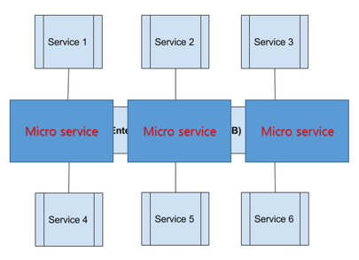<p><그림.SOA와 비교한 MSA구조 ></p></center>


## 1.2. **API 게이트웨이의 주요 기능**

### 1.2.1. **인증/인가에 관련된 기능**

API 게이트웨이의 가장 기본적인 기능은 API 에 대한 인증과 인가 관련 기능이다. ***인증은, API 를 호출하는 클라이언트에 대한 identity(신분)를 확인*** 해주는 기능이고, ***인가는 클라이언트가 API를 호출할 수 있는 권한이 있는지를 확인해주는 기능***이다. 

#### 1.2.1.1. **API 토큰 발급**

인증 인가를 거칠때 마다 매번 사용자의 인가/인증 절차를 거치기는 불편하다. 사용자로 부터 매번 사용자 ID와 비밀 번호를 받기는 번거롭고, 그렇다고 사용자 ID와 비밀 번호를 저장해놓는 것은 해킹의 빌미를 제공한다.
그래서 보통 사용하는 방식이 토큰이라는 방식을 사용하는데, ***사용자 인가가 끝나면, 사용자가 API를 호출할 수 있는 토큰을 발급해준다. API 서버는 이 토큰으로 사용자의 identity 와 권한을 확인한후, API 호출을 허가***해준다.
API 게이트 웨이는 클라이언트를 인증한 후, 이러한 API 토큰을 생성 및 발급해주는 역할을 한다.

<center>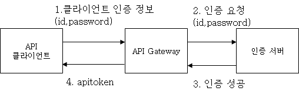<p><그림. 일반적은 토큰 발급 절차></p></center>

토큰 발급을 위해서는 먼저 클라이언트를 인증해야 한다.
클라이언트를 인증하는 방법은 가장 간단하게 사용자의 id와 password를 넣는 방법에서 부터, 공인 인증서를 이용하는 방법, 지문이나 OTP (One time password) 등을 이용하는 방법등 다양한 방법이 있다. 각 보안 요건에 요구 되는 다양한 방식에 따라서 클라이언트를 인증한 후에, apitoken을 발급하게 된다.
이때, 클라이언트에 대한 인증은 직접적으로 API 게이트웨이가 하지 않고 뒷단에 있는 인증 서버가 이를 수행하는데, 간단하게는 내부 계정 관리를 위한 Active Directory, LDAP 또는 RDBMS등이 될 수 도 있으며, 외부 인증 서버로는 예를 들어서 온라인 게임 서비스에 가입할때, 페이스북 계정을 사용하는 경우, 온라인 게임 서버가 페이스북에 이 사용자의 인증을 요청하고, 페이스북이 인증을 해주면 온라인 게임서버가 apitoken을 발급해주는 흐름등을 들 수 있다.
그래서 API 게이트웨이의 중요한 기능중의 하나는 다양한 인증 서버와 연계가 가능한 것이 좋다.
이렇게 발급된 토큰을 API를 호출할 수 있는 권한 정보와 연관이 되는데, 이 권한 정보를 토큰 자체에 저장하느냐 또는 서버에 저장해놓느냐에 따라서 두 가지 종류로 나눌 수 있다.
토큰 자체가 이러한 정보를 갖는 형태를 ***클레임 기반의 토큰 (Claim based token)이라고 하는데, 근래에 유행하는 JWT (JSON Web Token)이나 SAML 토큰***등이 이에 해당한다. 예를 들어 토큰 자체가 아래와 같은 정보를 가지고 있는 형태라고 생각하면 된다. 

> {
>
> “name”:”Terry”,
>
> “role”:[“admmin”,”enduser”]
>
> “org”:”petstore”
>
> }

<그림. 클레임 기반의 토큰 예>

클레임 기반의 토큰이 아닌 경우, 이러한 클레임 정보를 서버에 저장해놓게 되는데, 클라이언트로는 unique한 string만을 리턴해주는 경우이다.

 <center>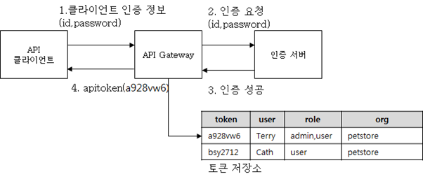<p><그림. 서버에 토큰을 저장하는 경우></p></center>

이 ***서버 기반의 토큰이 현재 일반적으로 가장 많이 사용되는 형태인데, token에 연관되는 정보가 서버에 저장되기 때문에 안전하고, 많은 정보를 저장할 수 있으며, token에 대한 정보를 수정하기가 용이***하다. 그러나 서버단에서 별도의 토큰 저장소를 유지해야 하기 때문에 구현 노력이 더 높게 든다. 토큰은 매 API 호출마다 정보를 가지고 와야 하기 때문에, DBMS와 같은 FILE IO 기반의 저장소 보다는 redis, memcached와 같이 메모리 기반의 고속 스토리지를 사용하는 것이 좋다.
***클레임 기반의 토큰은 이러한 토큰 저장소가 필요 없다는 장점***이 있어서 구현은 용이하지만, 토큰 자체에 클레임 정보가 들어가 있기 때문에, 토큰의 길이가 커지기 때문에 일정 양 이상의 정보를 담기가 어려우며, 한번 발급된 토큰은 변경이 어렵다. 예를 들어 role:admin으로 관리자 권한으로 발급된 토큰은 서버쪽에서 파기가 불가능하기 때문에 토큰 통제가 어렵다는 단점을 가지고 있다. 그래서, ***클레임 기반의 토큰을 사용할때는 토큰의 유효기간을 둬서 반드시 강제적으로 토큰을 주기적으로 재발급*** 받도록 하는 것이 좋다.

#### 1.2.1.2. **엔드포인트별 API 호출 인증**

Apitoken이 발급되었으면, 클라이언트는 이 apitoken을 이용하여 API를 호출하는데, 이 때 API 게이트웨이는 apitoken을 검증함으로써 API 호출을 승인할지 여부를 결정한다.
***서버에 토큰 정보가 저장되는 형태의 경우 매 API 호출 마다 해당 apitoken을 가지고 연관 정보를 토큰 저장소로 부터 읽어와서 비교한후, 그 정보를 기반으로 API 호출 가능 여부를 결정***한다.

 <center>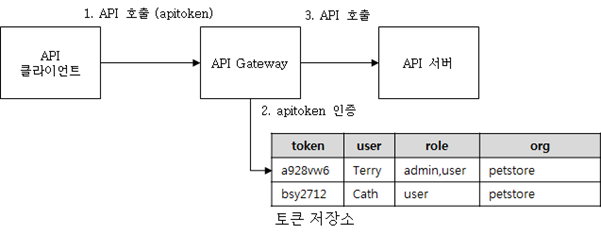<p><그림. Apitoken을 이용한 API 호출 인증></p></center>

***클레임 기반의 토큰의 경우에는 이러한 작업이 없이 그냥 API 게이트 웨이에서 apitoken을 까보고, 그 안에 있는 내용을 가지고 API 호출 가능 여부를 결정***한다.
이렇게 api token으로 인증을 하는 방법이 일반적인 방법이지만, 서버대 서버간의 통신은 내부 서버의 경우 별도의 인증 없이 API 를 제공하는 경우도 있고, 외부 서버와의 통신은 특정 ip 주소와 통신을 허용 하거나 높은 보안을 요구하는 경우 양방향 SSL등의 인증 방식을 사용함으로써 apitoken없이도 API 호출을 인증하는 방법도 있다.
이렇게 각각의 클라이언트나 서비스 별로 제공되는 엔드포인트에 대해서 API 인증 방식이 다르기 때문에, API 게이트웨이에서는 각 엔드 포인트 별로 다양한 형태의 인증 방식을 제공해야 한다. API 게이트를 이용하여 다양한 엔드포인트를 통해 서비스를 제공하는 방법은 뒤에서 다시 설명하도록 한다.

#### 1.2.1.3. **엔드포인트별 API 요청 인가**

인증(Authentication)과 인가(Authorization)은 다른 의미를 갖는데, API를 호출 하는 것이 Terry가 맞다는 것을  확인 해주는 것을 인증이라고 한다면, 이 Terry가 이 API를 호출할 수 있는 권한이 있는 것을 확인해주는 것이 인가(Authorization)이다. 쉽게 생각하면, 일반 사용자용 API와 관리자용 API를 생각하면 이해가 쉽다.
이렇게 권한을 제어하는 방식은 여러가지가 있는데, 각 개별 권한을 토큰에 부여 하는 방식과 역할(ROLE) 기반으로  권한을 부여하는 방식이 대표적이다.
개별 권한을 토큰에 부여 하는 방식은 다양한 권한 정책을 세밀하게 관리할 수 있다는 장점을 가지고 있다.

<center>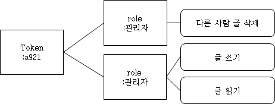<p><그림. 토큰에 역할을 부여하는 방식></p></center>

토큰에 제한적으로 권한을 부여할 수 있다는 장점을 가지고 있는데, 페이스북이 이런 형태의 권한 통제 모델을 사용한다. 
https://developers.facebook.com/docs/facebook-login/permissions/v2.2?locale=ko_KR
에 보면 api 토큰에 연동할 수 있는 권한 리스트들이 있는데, 페이스북의 써드파티 애플리케이션을 보면, 페이스북의 API의 권한을 일부 요청 하는 형태로 토큰에 권한을 연결한다.그렇지만,이 방식의 경우에는 권한의 종류가 많을 경우, 관리가 어려워 지고 복잡해지기 때문에, 일반적으로 역할(ROLE)기반으로 권한을 관리 하는 방식을 많이 사용한다.
직접 권한을 토큰에 연결하는 것이 아니라, ***역할이라는 개념을 두고, 역할별로 권한을 연결한 다음에, 이 역할을 토큰에 부여하는 개념이다 쉽게 이야기 하면, 관리자용 기능과 일반 사용자용 기능을 분리한 다음에, 관리자나 일반 사용자와 같은 역할(ROLE)을 토큰에 부여하는 방식이다. 이를 RBAC (Role Based Access Control)이라고 한다.***
이 RBAC 기반으로 하면, 통제 해야 하는 권한의 숫자가 줄어들기 때문에, 다음과 같이 엔드포인트를 나눠서 권한 접근 제어가 가능하다. (예를 들어 총 권한이 100개가 있다고 했을때, 이를 관리자용 기능과 일반 사용자용 기능으로 나누어 버리면, 관리해야 하는 두개의 권한 집합을 나뉘어 진다.) 
이런 경우 관리자용 API 엔드포인트(/service/admin), 일반 사용자용 API 엔드포인트(/service/users) 두 개로 나눈 다음에, apitoken에 권한을 admin,user 두가지 종류로 정의한 후에, /service/admin 엔드포인트에서는 api token이 admin 권한이 있을 경우에만, 호출을 허용하도록 하면 된다. 

<center>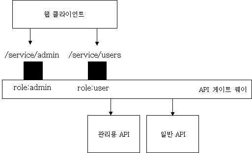<p><그림. 역할(ROLE)별로 엔드포인트를 나눠서 권한 인가를 하는 구조></p></center>

### 1.2.2. **API 라우팅**
API 게이트웨이에서 다음으로 유용한 기능중의 하나가 API 호출을 라우팅 하는 기능이다. 같은 API라도 사용하는 서비스나 클라이언트에 따라서 다른 엔드포인트를 이용해서 서비스를 제공하거나, 데이타 센터가 여러개일때, 데이타 센터간의 라우팅등을 지원하는 기능이다. 주요 기능들을 보면 다음과 같다.

#### 1.2.2.1. **백엔드 API 서버로의 로드 밸런싱**
가장 기본적인 기능으로는 로드밸런서 기능이다. API 게이트 웨이 뒷단에 다수의 API 서버가 있다고 할때, 여러개의 API 서버로 부하를 분산하는 기능이 필요하다.
 <center>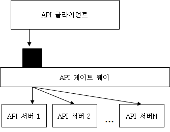<p><그림. API 게이트 웨이를 통한 API 서버로의 로드 밸런싱></p></center>

단순하게 Round Robin 방식으로 부하를 분산하는 기능뿐만 아니라, 각 서버 하드웨어에 따라 부하를 가중치를 줘서 분산하는 기능등을 고려해볼 수 있겠고, 무엇보다 중요한 기능은 API 서버가 장애가 났을때 이를 감지해서 로드 밸런싱 리스트에서 빼고, 복구 되었을때 다시 로드 밸런싱 기능에 넣는 기능들이 필요하다.
단순하게, HA Proxy와 같은 L4의 기능처럼, 뒷단의 서버가 살아 있으면 부하를 보내고 죽었으면 부하를 안보내는 기능에서 부터, 고급 기능으로는 API 서버가 Hang up (멈춤)에 걸렸을 때 이를 인지해서 부하를 안보내는 기능등을 고려해볼 수 있다. 이러한 고급 기능은 API 서버의 애플리케이션 상태를 인지해야 하기 때문에 단순히 IP 포트가 살아 있음을 가지고 판단 하는 것이 아니라 쓰레드 수, 응답 시간등으로  서버의 장애 상태를 판단해야 한다.  

#### 1.2.2.2. **서비스 및 클라이언트 별 엔드포인트 제공**

또 다른 유용한 기능중의 하나는, 같은 API를 여러개의 엔드포인트를 통해서 서비스를 제공할 수있다는 점인데, 하나의 시스템이 다양한 서비스나, 다양한 클라이언트등으로 서비스를 제공할때, 각각 다른 서비스 별 또는 클라이언트 별로 다른 엔드포인트를 제공할 수 있다.
예를 들어서 IOT 플랫폼 서비스가 있다고 하자. 이 플랫폼은 REST API를 제공하는데, 이를 통해서 센서로 부터 데이타를 수집해서 분석하는 시스템이라고 가정하자.
이 시스템은 선박용 서비스, 비행기용 서비스, 차량용 서비스를 지원한다고 가정하자.
각 서비스별로 API의 특성이나 노출되는 API가 다소 다를 수 있는데, 각 서비스 별로

- 선박용 /ships/
- 비행기용 /airplanes/
- 차량용 /cars/

라는 식으로 각각의 다른 엔드 포인트를 제공할 수 있다.
그리고, 이 서비스에서는 센서로 부터 데이타를 수집하는 시나리오와, 관리자가 웹을 통해서 시스템을 관리하기 위한 API가 있다고 가정하면, 앞의 API는 다음과 같이 클라이언트의 종류에 따라서 분리 될 수 있다.

- 선박 센서용 /ships/sensors/, 선박 관리자 웹 /ships/admin
- 비행기 센서용 /airplanes/sensors/, 비행기 관리자용 /airplanes/admin
- 차량 센서용 /cars/sensors, 차량 관리자용 /cars/admin

그리고 각각의 엔드포인트 별로 노출(expose)하는 API를 다르게 할 수 있다.
<center>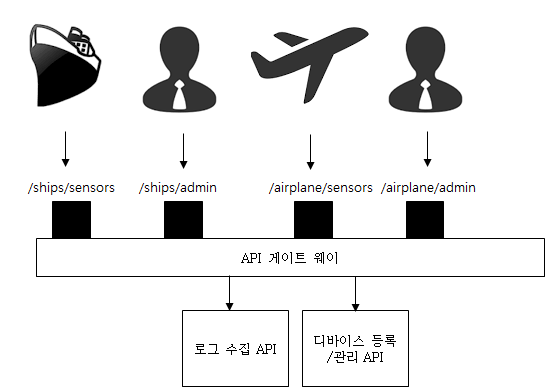<p><그림. API를 엔드포인트 별로 다르게 노출></p></center>

API 게이트 웨이는 API 서버가 공통적인 API를 가지더라도, 각 서비스나 클라이언트 타입에 따라서 각각 다른 API 를 선별적으로 서비스 할 수 있도록 해준다.
※ 실제로 멀티 서비스를 제공하는 플랫폼형태의 경우에는 이 기능이 매우 유용하다.특히 같은 API라도 클라이언트의 종류에 따라서 인증 방식이 다를 수 있고 보안 메커니즘이 다를 수 있다.

#### 1.2.2.3. **메세지 또는 헤더기반 라우팅**
라우팅에서 유용한 기능중의 하나는 메세지 내용을 기반으로 하는 라우팅이다. 예를 들어 그림과같이 HTTP 헤더에 country code가 있을 경우, country code에 따라서 유럽에 있는 API를 호출하거나 또는 미국에 있는 API 서버를 호출할 수 있도록 Routing을 할 수 있다.
<center>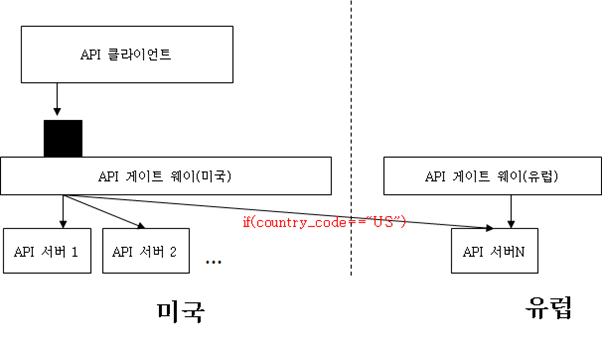<p><그림. 메세지 기반의 글로벌 라우팅 예시></p></center>

특히 글로벌 단위로 배포되는 시스템인 경우 각 데이타 센터간에 메세지를 라우팅 시키는데 유용하게 사용할 수 있다. 위의 예에서 처럼, 특정 데이타 센터로 조건에 따라 라우팅을 할 수 도 있고, 또는 중앙 집중형 시스템의 경우, 각 지역에 API 게이트 웨이를 두고, 클라이언트는 가까운 API  게이트 웨이를 호출하지만, 중앙 데이타 센터에만 있는 API 서버의 경우 중앙 데이타 센터로 호출을 라우팅 할 수 있다.
데이타 복제가 필요할 경우, 미국에 있는 API 게이트웨이로 호출하면 API 게이트 웨이가 미국 API서버와, 유럽 API 서버를 동시에 호출해서, 업데이트성 트렌젝션을 모든 데이타 센터에 복제함으로써 API를 통한 데이타 복제가 가능해진다.
라우팅에 있어서 고려해야할 사항은 먼저 메세지에 대한 라우팅인데, REST API를 기준으로 설명하면, REST API는 HTTP URL,HTTP Header,HTTP Body 3가지로 구분이 된다.
메세지를 기반으로 라우팅을 하기 위해서는 API 게이트 웨이가 이 메세지를 파싱해야 한다.
예를 들어 country_code가 HTTP Body에 JSON으로 다음과 같이 들어가 있다고 가정하자

> {
>
> “country_code”:”US”
>
>  :
>
> }

이 경우 이 API 호출에 대해서 라우팅 정보를 추출하기 위해서 매번 HTTP Body에 있는 JSON을 API 게이트웨이가 파싱해서 열어봐야 한다. 이는 빠르게 메세지가 통과해야 하는 API 게이트웨이의 역할에 많은 부담을 준다. 만약에 이러한 라우팅 정보를 HTTP Header로 옮긴다면, HTTP Body는 파싱하지 않고, Header만 파싱한후, Body 정보는 라우팅되는 서버로 그냥 포워딩만 해도 된다.
그래서 메세지 기반의 라우팅을 사용할 때는 이러한 파싱에 대한 오버헤드를 잘 고려하고, 가능하면, HTTP URL이나 HTTP Header에 라우팅 필드를 넣는 것이 좋다. 
부득이하게, HTTP Body에 있는 내용으로 라우팅을 해야 하는 경우에는 호출 빈도가 적은 API인 경우 API 게이트웨이에서 담당하고, 다른 경우에는 별도의 게이트웨이 인스턴스(프로세스)로 분리를 하거나 뒷단의 API서버가 라우팅을 하도록 하는 것도 하나의 방안이 된다.

### 1.2.3. **공통 로직 처리**
API 게이트웨이는 특성상 모든 API 서버 앞쪽에 위치 하기 때문에, 모든 API 호출이 이 API 게이트를 거쳐간다. 그렇기 때문에, 모든 API 가 공통적으로 처리해야 하는 공통 기능이 필요할 경우 이러한 공통 기능을 API 게이트웨이로 옮기게 되면 별도로 API 서버에서 이러한 기능을 개발할 필요 없이 비지니스 로직 자체 구현에만 집중할 수 있게 된다.
아래 그림은 각 API 서버에서 인증과, 로깅에 관련된 로직을 API 게이트웨이로 이전한 구조이다.
API 로깅이나 인증은 전체 시스템에 대해 공통된 기능으로, 공통 계층에서 처리하게 되면 개발 중복을 줄일 수 있는 장점뿐만 아니라, 표준 준수가 더 쉽다는 장점을 가지고 있다. 

<center>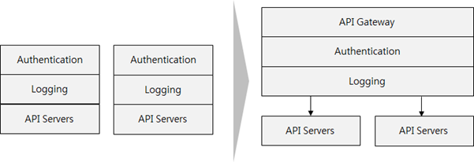<p><그림 API 게이트웨이를 이용하여 공통 로직을 API 서버에서 API 게이트웨이로 이전한 구조></p></center>

### 1.2.4. **메디에이션 기능 (Mediation)**
메디에이션이란, 한글로 “중재”또는 “조정” 이라는 의미를 갖는데, API서버에서 제공되는 API가 클라이언트가 원하는 API 형태와 다를때, API 게이트웨이가 이를 변경해주는 기능을 이야기 한다. 구체적인 기능을 보자

#### **1.2.4.1. 메세지 포맷 변환 (Message format transformation)**
메세지 포맷을 변환하는 기능이란, JSON으로 된 요청(Request) 메세지가 들어왔을때, 이를 API 서버로 보낼때 변환 해서 보내거나, 또는 API 서버에서 생성된 응답을 클라이언트에 리턴할때 변경해서 보내는 기능을 의미한다.
예를 들어보자, 아래와 같이 terry의 연봉(salary) 정보를 구하는 API가 필요하다고 하자. 그런데, 시스템에는 연봉 정보만 주는 API는 없고, 전체 사용자 정보를 리턴하는 API만 있는 상황이다.
이런 경우, API 게이트 웨이를 통해서 /users/salary라는 새로운 API를 제공하고, 이를 기존에 전체 사용자 정보를 주는 /users/details라는 API로 라우팅 한다. /users/details에서 사용자 정보를 뽑았을때, 클라이언트에게 응답을 줄때는 API 게이트웨이에서 아래 그림과 같이 name과 salary 정보만 뽑아서 리턴하도록 한다.

<center>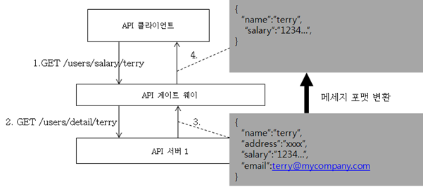<p><그림. 메세지 포맷 변환의 예시></p></center>

일단 간단한 기능으로 구현이 가능하기 때문에 서술은 해놨지만, 그다지 권장하고 싶지 않은 기능이다. 메세지 포맷이 변환이 된다면, 차라리 필요한 포맷에 맞는 API를 따로 뽑아 내는 것이 났지 않나 싶다.

#### **1.2.4.2. 프로토콜 변환** 
다양한 서비스나 클라이언트를 지원하게 되면, 클라이언트나 서비스별로 다른 통신 프로토콜을 사용해야 하는 경우가 있다. 웹에서는 JSON기반의 REST가 많이 사용되지만, 배나 비행기에 사용되는 센서들의 경우에는 REST도 무겁기 때문에 바이너리 기반의 경량 프토토콜을 사용하거나, 또는 예전 엔터프라이즈 시스템의 경우 XML 기반의 웹서비스를 이용할 수 도 있다.
이렇게 다양한 타입의 프로토콜을 지원하기 위해서, 각 서비스들이 새롭게 구현을 하는 것이 아니라 API 게이트웨이 계층에서 프로토콜 변환을 통하여, 같은 API를 다른 프로토콜로 서비스 할 수 있도록 할 수 있다.

<center>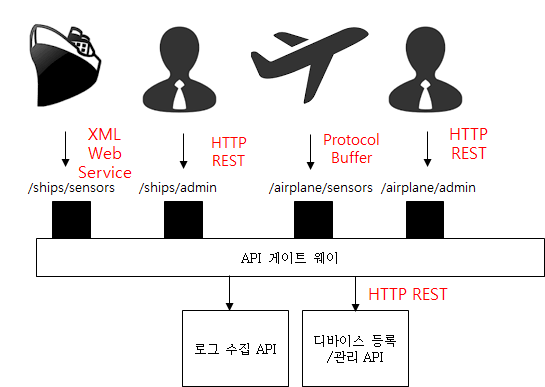<p><그림. API 게이트 웨이를 통한 프로토콜 변환></p></center>

실제로 유용한 기능인데, 내부 API는 REST가 아니라 페이스북 Thrift나 구글의 Protocol Buffer로 구현을 하고, 외부에 제공하는 API는 API 게이트 웨이단에서 REST 로 변경해서 서비스 하는 구조를 이용하면, 내부 API 성능을 올리고, 외부로는 REST API로 서비스 함으로써 범용성을 확보할 수 있다. (실제 사례가 있었다.)
또한 근래에 M2M이나 IOT (Internet of things)와 같은 개념이 활성화 되면서, HTTP REST 뿐 아니라 기존의 센서에서 통신에 사용되는 다양한 프로토콜을 지원하여 백엔드 API 서버의 프로토콜로 맞춰줘야 하는 필요가 점점 증대되고 있다.

### 1.2.5. **메세지 호출 패턴 변환 (Message Exchange Pattern : MEP)**
메세지 호출 패턴, 보통 MEP(Message Exchange Pattern)라고 하는데, 동기,비동기 호출과 같은 API를 호출하는 메세지 패턴을 정의한다.
API 게이트웨이의 좋은 기능중의 하나가 이 MEP를 변경할 수 있다는 건데, 쉽게는 Async API호출을 Sync 호출로 바꿔 준다거나, 하나의 API 호출을 여러 데이타 센터로 복제 해준다거나 하는 형태의 메세징 패턴을 변화 시킬 수 있다.

<center>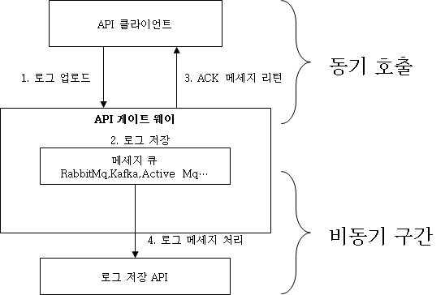<p><그림. 비동기 호출을 API게이트웨이를 통해서, 동기 호출로 변경한 구조></p></center>

위의 그림의 예제는 로그를 수집하는 시스템에 대한 구조이다.뒷단의 로그저장 API 서버가 대용량 트래픽에 대한 대응 능력이 없을때, API 게이트 웨이에서 큐를 이용해서 API 요청을 받고 (1), 바로 클라이언트에 ACK를 준후에, 메세지큐 연동을 이용하여 메세지를 저장한후, 로그 저장 API 서버의 성능에 맞게 흘려주는 방식이다. 클라이언트 입장에서는 동기 호출이지만 실제 메세지 흐름은 큐를 이용한 비동기 구조로 변경되었다.

### 1.2.6. **어그레게이션 (aggregation)**
SOA에서는 Orchestration(오케스트레이션)이라고 불렀는데, 여러개의 API를 묶어서 하나의 API로 만드는 작업을 이야기 한다. 예를 들어서, 계좌 이체를 한다고 했을때,

①	A은행에서 잔액 확인

②	A은행에서 인출

③	B은행으로 입금

하는 3개의 API 호출을 하나의 API 인 POST transfer(인출계좌,입급계좌,금액)으로 구현한다고 하자.이를 API 게이트웨이에서 구현 하면 다음과 같은 형태로 구현할 수 있다.
<center>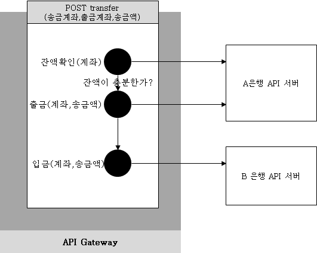<p><그림. API 게이트 웨이를 이용한 API Aggregation></p></center>

대부분의 API 게이트 웨이 제품들은 이러한 aggregation을 할 수 있는 일종의 워크플로우 엔진과 유사한 기능들을 가지고 있다.
<center>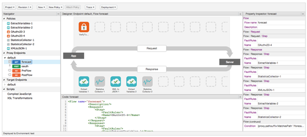<p><그림. Apigee 제품의 워크플로우 저작도구 화면></p></center>

이러한 aggregation 기능이 언뜻 보면 좋아보이지만, 하나의 플로우에서, 여러 API를 호출해야 하고, 비지니스 로직을 수행하면서 실제로 API 메세지 BODY까지 파싱해야 하기 때문에, API 게이트 웨이 입장에서는 부하가 매우 크다. 
MSA 의 전신인 SOA에서 API 게이트웨이와 유사한 역할을 했던 ESB역시 이러한 aggregation (ESB에서는 보통 오케스트레이셔이라고 함)을 남발해서, ESB의 성능이 떨어져서 시스템 개발이 실패하는 아키텍쳐를 많이 봤다.
그래서 본인의 경우에는 이러한 무거운 aggregation 로직은 별도의 Mediator API 서버라는 계층을 만들어서, API 게이트웨이 밖에서 따로 하는 방법을 권장한다.
아래 그림과 같이 여러 API를 조합하는 목적의 API 서버를 별도로 둬서, 이러한 기능을 API 게이트웨이에서 제거한다.

<center>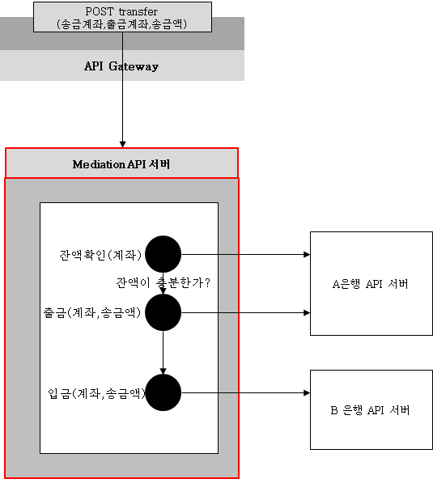<p><그림. API aggregation을 API 게이트웨이에서 Mediation API 서버로 분리한 구조></p></center>

aggregation 로직을 API 게이트웨이 안에 넣으면 확실하게  게이트웨이가 받는 부하량은 올라간다. 설치형 API 게이트웨이의 경우, 이는 추가적인 하드웨어 박스를 더 구매하고, 상용 API 게이트웨이의 경우 라이센스를 더 구매해야 한다는 것을 의미하기 때문에, Mediation API 서버 계층을 사용하는 것을 권장한다.
클라우드형 API 게이트웨이의 경우, 호출 수로 과금을 하기 때문에 aggregation 로직을 API 게이트웨이에 넣는 방안을 고려해볼 수 있으나, aggregation 로직이 게이트웨이 안에 있으면 디버깅이나 테스팅이 쉽지 않기 때문에, 이를 적절히 고민한 후 판단해서 aggregation 로직의 위치를 결정해야 한다.

### **1.2.7. 로깅 및 미터링**
API 게이트웨이의 비기능적인 요건으로 중요한 기능이 로깅과 미터링이다. 

#### **1.2.7.1 API 호출 로깅**
앞서 공통 로직 처리 부분에서도 언급하였지만, API 호출시 API 게이트웨이는 공통적으로 호출되는 부분인 만큼 모든 로그를 중간에서 수집하기가 가장좋다.
근래의 애플리케이션 아키텍쳐가 클라이언트와 서버간의 통신이 모두 API를 기반하는 형태로 변경이되어감에 따라 API 호출 패턴을 분석하면 사용자의 사용 패턴을 분석해낼 수 있기 때문에, 빅데이타 영역과 연계하여 API 호출 로그는 아주 중요한 자산으로 다루어지고 있다.
또한 API 호출 로그는 차후 문제가 발생하였을때, 문제를 추적하기 위한 중요한 자료로 사용된다. (Audit: ‘감사’의 목적) 그래서, API 로그 수집은 단순 분석 목적뿐 아니라, 향후 감사 목적용으로도 저장되어야 한다.
근래에 출시되고 서비스되는 클라우드형 API 게이트웨이의 경우에는 특히나 이 API에 대한 로그 분석 기능을 강화해서 출시되고 있다.

<center>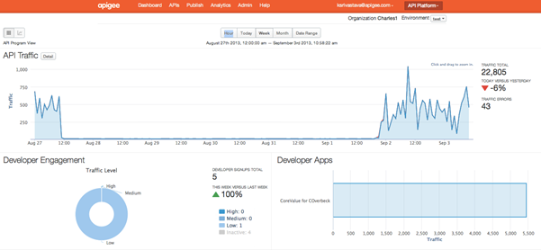<p><그림. Apigee.com의 API 모니터링></p></center>

#### **1.2.7.2. API 미터링 & 차징 (Metering & Charing)**	
API 미터링과 차징은 유료 API 서비스를 위한 기능으로,  미터링은 과금을 위한 API 호출 횟수,클라이언트 IP, API 종류,IN/OUT 용량등을 측정 기록하는 서비스이고,
차징은 미터링이 된 자료를 기반으로 하여, API 서비스 사용 금액을 금액 정책에 따라서 계산 해내는 서비스이다. 
대부분의 SNS 오픈 API 서비스는 무료인 경우가 많지만, 구글 API 의 경우에도, 특정 호출 횟수(/일)을 넘어가면 과금등을 하도록 되어 있다.

#### **1.2.7.3. QoS 조정 (Quality of service)**
마지막으로 QoS 조정 기능이란, API 서비스를 클라이언트 대상에 따라서 서비스 레벨을 조정하는 기능이다.
유료 서비스가 있는  API 서비스라고 가정할때, 무료 사용자의 경우 1일 1000건으로 호출횟수를 제한 한다거나, 전송 용량이나, 네트워크 대역폭을 유료/무료 사용자에 따라 다르게 적용하는 것과 같은 기능을 QoS 기능이라고 한다.
유료 서비스인 경우만 아니라, 플랫폼 차원에서 다양한 클라이언트나 다양한 서비스로 API 를 제공하는 경우, 각 클라이언트나 서비스에 따라서 이 QoS를 조정하는 기능은 유용하게 사용될 수 있다. 특정 서비스나 클라이언트가 폭주하여 API를 과도하게 사용하여 다른 서비스들이 API를 사용할 수 없게 한다던가 그런 문제를 미연에 예방할 수 있다.


------

# 2. API 게이트웨이 기반의 디자인 패턴

API 게이트 웨이는 여러개의 엔드포인트를 설정하고, 각 엔드포인트 마다 메세지 흐름을 워크 플로우 엔진 설정을 통해서 API 에 대한 Mediation, Aggregation 설정을 할 수 있는 미들웨어 이다. 쉽게 말하면 설정과 프로그래밍이 가능한 툴일 뿐이다. 그래서, API 게이트 웨이를 도입한다고 게이트웨이가 재 역할을 하는 것이 아니라, 게이트웨이 를 이용하여 적절한 게이트 웨이 아키텍쳐를 설계해야 한다. 
여기서는 API 게이트 웨이를 이용한 아키텍쳐 설계시 참고할 수 있는 디자인 패턴에 대해서 소개 한다. 
※ 이 패턴들은 예전에 ESB 기반으로 SOA 프로젝트를 했을 때 사용했던 패턴으로 일반적인 이론이 아니라 실제 적용 및 검증을 거친 패턴이다.

## 2.1. **다중 API 게이트웨이 아키텍쳐**
API 게이트 웨이를 배포할때는 하나의 게이트웨이가 아니라 용도나 목적에 따라서 게이트 웨이를 분리하는 전략을 취할 수 있다. 몇가지 분리 패턴에 대해서 알아보도록 하자

#### **2.1.1. 내부 게이트웨이와 외부 게이트 웨이 엔드포인트 분리**
가장 유용한 패턴중의 하나는 외부 서비스용 게이트웨이와 내부 서비스용 게이트웨이를 분리하는 방안이다. 물리적으로 게이트 웨이 자체를 두개로 나누는 방법도 있지만, 하나의 게이트웨이에서 엔드포인트를 내부용과 외부용으로 분리하는 방안이다.

<center>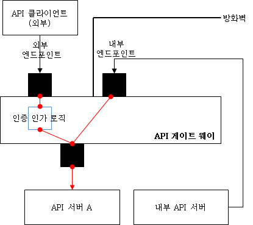<p><그림. 외부 및 내부 게이트웨이를 분리한 패턴></p></center>

같은 내부 API를 외부와 내부로 나눠서 서비스를 하되, 외부 엔드포인트에 대해서는 인증/인가 로직을 거치도록 한다.
내부 API 엔드포인트는 내부 IP를 가지도록 하고, 방화벽 안에서만 오픈하되 별도의 인증/인가 로직을 거치지 않고 내부 서버들이 API를 호출하는데 사용할 수 있도록 한다. 

#### **2.1.2. 파일 업/다운로드 엔드포인트 분리**
API 게이트웨이는 내부 구조는 쓰레드 풀 기반의 멀티 쓰레드나 또는 비동기 IO 기반의 싱글 쓰레드 모델을 사용한다.
쓰레드 풀 모델은 톰캣같은 WAS와 비슷한 모델로, 쓰레드 풀내의 하나의 쓰레드가 하나의 API 요청에 대해서 응답까지 모두 처리하는 모델로, API 요청이 들어오면 응답을 보낼때 까지 그 쓰레드는 해당 API 호출에 의해서 점유 된다 그래서, 이러한 모델의 API 게이트웨이는 일반적인 WAS와 마찬가지로 동시에 서비스 할 수 있는 트렌젝션 수가 쓰레드풀의 전체수밖에 되지 않는다.
싱글 쓰레드 모델은 비동기 IO 기반의 방식으로 멀티 쓰레드 모델에 비해서 많은 클라이언트를 처리할 수 있다.
(Node.js가 대표적인 비동기 IO 기반의 싱글 쓰레드 모델이다.)
파일 업로드나 다운로드와 같은 트렌젝션은 CPU는 많이 사용하지 않지만, 요청 처리에 시간이 많이 걸리는 작업이기 때문에, 쓰레드 풀 형태의 API 게이트 웨이 제품에서는 파일 업/다운로드에 쓰레드가 오랫동안 잡혀있기 때문에, 서비스를 할 수 있는 유휴 쓰레드 수가 적게 되고, 다른 일반 API 서비스에 영향을 줄 수 있다.
싱글 쓰레드 기반의 비동기 IO 게이트웨이의 경우에는 비동기 IO이기 때문에 파일 업/다운로드에는 다소 유리할 수 있지만, 네트워크 대역폭을 상당 부분 소모해버리기 때문에 마찬가지로 다른 API  서비스를 하는데 영향을 줄 수 있다.
그래서 이러한 파일 업/다운로드는 가급적이면 게이트 웨이를 거치지 않고 별도의 독립된 엔드포인트나 프록시를 사용하는 것이 좋은데, 다음은 별도의 프록시를 넣는 아키텍쳐 설계 방식의 예이다.

<center>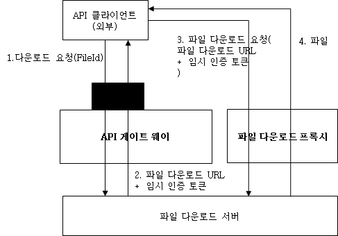<p><그림. 파일 업/다운로드를 API 게이트웨이에서 분리해내는 방법></p></center>

1.	API 클라이언트가 파일 서버에 API를 이용하여 파일 다운로드를 요청한다.
2.	파일 서버는 API에 대한 응답으로 파일을 바로 내리는 것이 아니라, 파일을 다운로드 받을 수 있는 URL과 함께, 임시 인증 토큰을 발급(현재 API 클라이언트에 IP 에만 유효하고, 특정시간 예를 들어 발급후 30분 이내만 사용이 가능한 토큰)하여, API 클라이언트에게 리턴한다.
3.	API 클라이언트는 2에서 받은 URL로 임시 인증 토큰과 함께 파일 다운로드를 파일 다운로드 프로젝시를 통해서 요청한다.
4.	파일 다운로드 프록시는 임시 인증 토큰을 인증한 다음에, 파일 다운로드를 수행한다.
파일 다운로드 프록시는 일반적인 리버스 프록시 (HA Proxy, Nginx,Apache)등을 사용할 수 있으며 여기에 간단하게 다운로드용 임시 인증 토큰 로직을 넣으면 된다. 또는 아마존 클라우드의 CDN과 같은 서비스들도 임시 다운로드 토큰과 같은 서비스를 제공하기 때문에, CDN 사용시에도 유사하게 적용할 수 있는 아키텍쳐이다.

#### **2.1.3. 특수 목적 엔드포인트 분리**
파일 업로드/다운로드 엔드 포인트를 분리한 것 처럼, 특수 목적의 엔드포인트는 별도의 API 게이트웨이로 분리해 내는 것이 좋다.
예를 들어 인증등이 없이 고속으로 많은 로그를 업로드 하는 엔드 포인트같은 경우, 부하량이 많기 때문에 다른 일반 API 엔드포인트에 부담을 주지 않기 위해서 분리 할 수 있다.

### 2.2. **트렌젝션 ID 추적 패턴**
MSA 아키텍쳐를 기반으로 하게 되면, 클라이언트에서 호출된, 하나의 API 요청은 API 게이트웨이와 여러개의 서버를 거쳐서 처리된 후에, 최종적으로 클라이언트에 전달된다.
만약에 중간에 에러가 났을 경우, 어떤 호출이 어떤 서버에서 에러가 났는지를 연결해서 판단해야 할 수 가 있어야 한다. 예를 들어 서버 A,B,C를 거쳐서 처리되는 호출의 경우 서버 C에서 에러가 났을때, 이 에러가 어떤 메세지에 의해서 에러가 난 것이고, 서버 A,B에서는 어떻게 처리되었는 찾으려면, 각 서버에서 나오는 로그를 해당 호출에 대한 것인지 묶을 수 있어야 한다.
하나의 API 호출을 트렌젝션이라고 정의하자, 그리고 각 트렌젝션에 ID를 부여하자. 그래서 API 호출시, HTTP Header에 이 트렌젝션 ID를 넣어서 서버간의 호출시에도 넘기면 하나의 트렌젝션을 구별할 수 있다.
여기에 추가적인 개념이 필요한데, 서버 A,B,C가 있을때, API 서버 B가 하나의 API 호출에서 동 두번 호출된다고 가정하자. 그러면 에러가 났을때 B 서버에 있는 로그중에, 이 에러가 첫번째 호출에 대한 에러인지, 두번째 호출에 대한 에러인지 어떻게 구분할까?
아래 그림을 서버 A->B로의 첫번째 호출과, 두번째 호출 모두 트렌젝션 ID가 txid:1로, 이 txid로는 구별이 불가하다.

<center>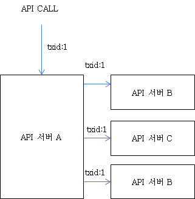<p><그림. 단일 트렌젝션 ID를 사용했을때 문제></p></center>

그래서 이러한 문제를 해결하기 위해서는 글로벌 트렌젝션 ID(gtxid)와, 로컬 트렌젝션 ID (ltxid)의 개념을 도입할 수 있다.
API 호출을 하나의 트렌젝션으로 정의하면 이를 글로벌 트렌젝션 gtx라고 하고, 개별 서버에 대한 호출을 로컬 트렌젝션 ltx라고 한다. 이렇게 하면 아래 그림과 같이 하나의 API호출은 gtxid로 모두 연결될 수 있고 각 서버로의 호출은 ltxid로 구분될 수 있다
※ 사실 이 개념은 2개 이상의 데이타 베이스를 통한 분산 트렌젝션을 관리하기 위한 개념으로, 글로벌 트렌젝션과 로컬 트렌젝션의 개념을 사용하는데, 그 개념을 차용한것이다.
<center>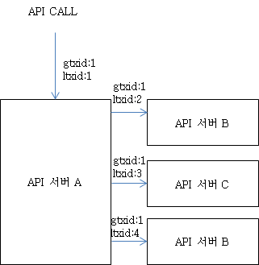<p><그림. 글로벌 트렌젝션과 로컬 트렌젝션 개념을 이용한 API 트렌젝션 추적 방법></p></center>

이런 글로벌 트렌젝션과 로컬 트렌젝션 개념을 API 게이트웨이와 연동하여 아키텍쳐를 설계하면 다음과 같은 모양이된다. 
<center>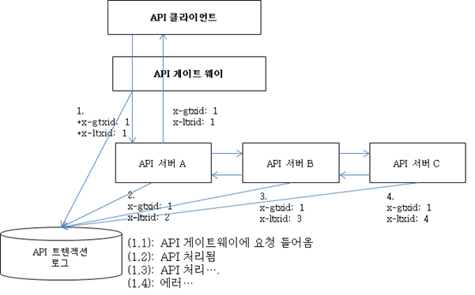<p><그림, gtxid,ltxid를 이용한 API 트렌젝션 추적 아키텍쳐></p></center>

API 클라이언트는 API를 호출한다. API 클라이언트는 트렌젝션 ID에 대한 개념이 없다.
API 게이트 웨이에서, HTTP 헤더를 체크해서 x-gtxid (글로벌 트렌젝션 ID)가 없으면 신규 API  호출로 판단하고 트렌젝션 ID를 생성해서 HTTP 헤더에 채워 넣는다. 로컬 트렌젝션 ID로 1로 세팅한다.
2번에서, API 서버 A가 호출을 받으면, 서버 A는 헤더를 체크하여 ltxid를 체크하고, ltxid를 하나 더 더해서, 로그 출력에 사용한다. 같은 gtxid를 이용해서 같은 API호출임을 알 수 있고, ltxid가 다르기 때문에 해당 API서버로는 다른 호출임을 구별할 수 있다.
이런식으로 서버B,C도 동일한 gtxid를 가지지만, 다른 ltxid를 갖게 된다.
각 API 서버는 이 gtxid와  ltxid로 로그를 출력하고, 중앙에서 로그를 수집해서 보면, 만약에 에러가 발생한 경우, 그 에러가 발생한 gtxid로 검색을 하면, 어떤 어떤 서버를 거쳐서 트렌젝션이 수행되었고 어떤 서버의 몇번째 호출에서 에러가 발생하였는지 쉽게 판별이 가능하다.
작은 팁중에 하나로, 자바로 API 서버를 개발할 경우 서블릿 필터를 넣어서, gtxid가 헤더로 들어오면 이 gtxid를 TheadLocal 변수에 저장하고, ltxid는 새로 생성해서 ThreadLocal 변수에 저장 해놓으면, 로그를 출력할때 ThreadLocal 변수에 있는 gtxid와 ltxid를 꺼내서 같이 출력하면 번거롭게 클래스의 메서드등으로 gtxid와 ltxid를 넘길 필요가 없다.  그리고 로그 수집은 SL4J나 Log4J와 같은 일반 로깅 프레임웍을 이용해서 gtxid와 ltxid 기반으로 로그를 출력하고 출력된 로그를 파일이 아니라 logstash를 이용해서 모아서, ElasticSearch에 저장하고, Kibana로 대쉬 보드를 만들면, 손쉽게 트렌젝션 ID기반으로 API 호출 로그 추적이 가능해진다.

# 3.  API 게이트웨이 기술스택 

## 3.1. **MSA 구축 솔루션**

|                    마이크로서비스 관심사                     | [Spring Cloud Netflix](https://zetawiki.com/wiki/Spring_Cloud_Netflix) | [Spring Cloud](https://zetawiki.com/wiki/Spring_Cloud_Netflix) |      [Kubernetes](https://zetawiki.com/wiki/Kubernetes)      |
| :----------------------------------------------------------: | :----------------------------------------------------------: | :----------------------------------------------------------- | :----------------------------------------------------------: |
|                           설정관리                           | [Spring Cloud Config](https://zetawiki.com/wiki/Spring_Cloud_Config_Server), [Consul](https://zetawiki.com/wiki/Consul), Netflix Archalus | Spring Cloud Config                                          | [Kubernetes ConfigMap](https://zetawiki.com/wiki/Kubernetes_ConfigMap) & [Secrets](https://zetawiki.com/wiki/쿠버네티스_Secrets) |
|                         서비스 발견                          |               Netflix Eureka, Hashicorp Consul               | Spring Cloud Zookeeper                                       | [Kubernetes Service](https://zetawiki.com/wiki/Kubernetes_Service) & [Ingress](https://zetawiki.com/wiki/쿠버네티스_Ingress) |
|                         로드 밸런싱                          | [Netflix Ribbon](https://zetawiki.com/w/index.php?title=Netflix_Ribbon&action=edit&redlink=1) | Spring Cloud LoadBalancer(SCL)                               | [Kubernetes Service](https://zetawiki.com/wiki/Kubernetes_Service) |
|                        API 게이트웨이                        |    [Netflix Zuul](https://zetawiki.com/wiki/Netflix_Zuul)    | Spring cloud gateway                                         | [Kubernetes Service](https://zetawiki.com/wiki/Kubernetes_Service) & [Ingress](https://zetawiki.com/wiki/쿠버네티스_Ingress) |
|                         서비스 보안                          |                    Spring Cloud Security                     | Spring Cloud Security                                        |                              -                               |
|                         중앙화 로깅                          | [ELK Stack](https://zetawiki.com/wiki/ELK_Stack) ([Logstash](https://zetawiki.com/wiki/Logstash)) | [ELK Stack](https://zetawiki.com/wiki/ELK_Stack) ([Logstash](https://zetawiki.com/wiki/Logstash)) | [EFK Stack](https://zetawiki.com/wiki/EFK_Stack) ([Fluentd](https://zetawiki.com/wiki/Fluentd)) |
|                        중앙화 메트릭                         |                  Netflix Spectator & Atlas                   | Spring Boot admin                                            | ~~[Heapster](https://zetawiki.com/wiki/Heapster)~~, [Prometheus](https://zetawiki.com/wiki/Prometheus), [Grafana](https://zetawiki.com/wiki/Grafana) |
|                        분산 트레이싱                         | Spring Cloud Sleuth, [Zipkin](https://zetawiki.com/wiki/Zipkin) | Spring Cloud Sleuth, [Zipkin](https://zetawiki.com/wiki/Zipkin) | [OpenTacing](https://zetawiki.com/w/index.php?title=OpenTacing&action=edit&redlink=1), [Jaeger](),[kiali]() |
|                 Resilience & Fault Tolerance                 |              Netflix Hystrix, Turbine & Ribbon               | Spring Cloud Circuit Breaker                                 |            Kubernetes Health Check & 리소스 격리             |
| [오토스케일링](https://zetawiki.com/wiki/오토스케일링) & [셀프힐링](https://zetawiki.com/w/index.php?title=셀프힐링&action=edit&redlink=1) |                              -                               |                                                              |      Kubernetes Health Check, Self Healing, Autoscaling      |
|                패키징, 디플로이먼트, 스케줄링                |     [Spring Boot](https://zetawiki.com/wiki/Spring_Boot)     | [Spring Boot](https://zetawiki.com/wiki/Spring_Boot)         | [Docker](https://zetawiki.com/wiki/Docker)/[Rkt](https://zetawiki.com/wiki/Rkt), Kubernetes Scheduler & Deployment |
|                          작업 관리                           |                         Spring Batch                         | Spring Batch                                                 | [Kubernetes Jobs](https://zetawiki.com/wiki/Kubernetes_Jobs), Scheduled Jobs |
|                     싱글턴 애플리케이션                      |                     Spring Cloud Cluster                     | Spring Cloud Cluster                                         | [Kubernetes Pods](https://zetawiki.com/wiki/Kubernetes_Pods) |

## 3.2. API GATEWAY 기술스택 검토

|       항목        |                Spring Cloud Gateway                |       Spring Cloud Zuul       |               KrakenD               |               Kong               |                Tyk                |
| :---------------: | :------------------------------------------------: | :---------------------------: | :---------------------------------: | :------------------------------: | :-------------------------------: |
|     관리 조직     | [springframework.org](http://springframework.org/) |            Neflix             |  [krakend.io](http://krakend.io/)   | [konghq.com](http://konghq.com/) |     [tyk.io](http://tyk.io/)      |
| Non-Blocking지원  |                        지원                        |            미지원             |                지원                 |               지원               |               지원                |
| 업데이트 지원여부 |                        지원                        |          Deprecated           |                지원                 |               지원               |               지원                |
|     제공 유형     |              Open SourceIn-House 개발              |   Open SourceIn-House 개발    |        Open Source Solution         |       Open Source Solution       |       Open Source Solution        |
|  제공 인터페이스  |             Customize 인터페이스 제공              | Filters 만으로 기능 구현 가능 |                 N/A                 |               N/A                |                N/A                |
|   최초 Release    |                       2019년                       |            2017년             |               2016년                |              2011년              |              2014년               |
|    구축 복잡성    |                        N/A                         |              N/A              |           낮음( Gateway )           | 중간( Kong Server + Datastore )  | 높음( Gateway + Dashboard +Pump ) |
|   데이터 레이어   |                        N/A                         |              N/A              |                 N/A                 |      Cassandra/ PostgreSQL       |          Redis + MongoDB          |
|    OpenSource     |                     Apache2.0                      |           Apache2.0           |        Apache2.0/Enterprise         |       Apache2.0/Enterprise       |          MPL/ Enterprise          |
|     사용기술      |                 Java, Spring Cloud                 |      Java, Spring Cloud       |                 Go                  |           NginX / LUA            |                Go                 |
|    On-Premise     |                        N/A                         |              N/A              |                지원                 |               지원               |               지원                |
|       인가        |                     직접 구현                      |           직접 구현           |                지원                 |               지원               |               지원                |
| 관리UI Dashboard  |                        N/A                         |              N/A              | 3rd-Party Logging, Metrics, Tracing |        미지원상용 UI 지원        |               지원                |
|       성능        |                        N/A                         |              N/A              |          3,479 request/sec          |        1,753 request/sec         |          451 request/sec          |
|    Scalability    |                        N/A                         |              N/A              |             별도db없음              |            DB연계필요            |            DB연계필요             |

## 3.3. API GW 장/단점 비교

|     항목      | Spring Cloud Gateway | Spring Cloud Zuul |                           KrakenD                            |                      Kong                      |                   Tyk                    |
| :-----------: | :------------------: | :---------------: | :----------------------------------------------------------: | :--------------------------------------------: | :--------------------------------------: |
|   검토 결과   |     In-House적합     |  In-House부적합   |                      OSS 기반 구축 적합                      |              OSS 기반 구축 부적합              |           OSS 기반 구축 부적합           |
|     장점      |         N/A          |        N/A        |             높은 성능, 다양한 기능, 쉬운 확장성              |      쉬운 설치, 준수한 성능, 관리 용이성       |               관리 용이성                |
|     단점      |         N/A          |        N/A        |            모니터링 위한 3rd-Party 별도 구성 필요            | 플러그인 수동 설치XML→ JSON, SOAP→ REST 미지원 | 상대적으로 많은 CPU 자원 필요, 낮은 성능 |
| Custom Plugin |         N/A          |        N/A        |            Go, CEL, Martian, Transformation, LUA             |                   LUA만 지원                   |    Go, Java, Python, .Net, Javascript    |
|     비고      |                      |                   | 대형 트래픽 처리 적합모니터링 위한 3rd-Party 별도 구성 API Merge , Multi expose 외 기능 제공기능 업데이트 활발Scale Out 지원Monitoring/Security/Throttling/Proxy/QosCache/Aggregation/Filtering/Decoding |  중형 트래픽 처리 적합확장/기능 유연성 떨어짐  |          소형 트래픽 처리 적합           |


------

# **4. Spring Cloud Gateway**


## 4.1. Spring Cloud Gateway 프로젝트 생성

프로젝트에 스프링 클라우드 게이트웨이를 추가하려면 그룹 ID `org.springframework.cloud`, 아티팩트 ID `spring-cloud-starter-gateway`인 [**스타터**](https://start.spring.io/)(를 사용하면 된다. 

<center>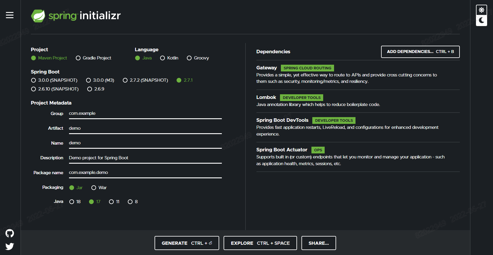<p></p></center>

스타터를 추가하되 게이트웨이를 활성화하고 싶지 않다면 `spring.cloud.gateway.enabled=false`를 설정해라.

> 스프링 클라우드 게이트웨이는 [스프링 부트 2.x](https://spring.io/projects/spring-boot#learn), [스프링 웹플럭스](https://godekdls.github.io/Reactive Spring/contents/), [프로젝트 리액터](https://projectreactor.io/docs) 기반이다. 그렇기 때문에 이미 익숙한 동기식 라이브러리(스프링 데이터, 스프링 시큐리티 등)나 알만한 패턴들은 스프링 클라우드 게이트웨이를 썼을 땐 적용이 안 될 수도 있다. 이런 프로젝트에 익숙하지 않다면, 스프링 클라우드 게이트웨이로 작업하기 전에 먼저 관련 문서를 읽는 것부터 시작해 새로운 개념들을 익히고 오는 게 좋다.

> 스프링 클라우드 게이트웨이는 스프링 부트와 스프링 웹플럭스에서 제공하는 Netty 런타임이 필요하다. 기존의 서블릿 컨테이너를 쓰거나 어플리케이션을 WAR로 빌드했을 땐 동작하지 않는다.

## 4.2. 용어 사전

- **Route**: 게이트웨이의 기본 구성 요소. ID, 목적지 URI, predicate 컬렉션, filter 컬렉션으로 정의된다. predicate들을 집계한 결과가 true일 때 route에 매칭된다.
- **Predicate**: [자바 8 Function Predicate](https://docs.oracle.com/javase/8/docs/api/java/util/function/Predicate.html). 입력 타입은 [스프링 프레임워크 `ServerWebExchange`](https://docs.spring.io/spring/docs/5.0.x/javadoc-api/org/springframework/web/server/ServerWebExchange.html)다. predicate를 통해 헤더나 파라미터같은 HTTP 요청 정보를 매칭시킬 수 있다.
- **Filter**: 특정 팩토리로 생성하는 [`GatewayFilter`](https://github.com/spring-cloud/spring-cloud-gateway/tree/master/spring-cloud-gateway-server/src/main/java/org/springframework/cloud/gateway/filter/GatewayFilter.java) 인스턴스. 필터에선 다운스트림으로 요청을 전송하기 전후에 요청과 응답을 수정할 수 있다.

## 4.3. 동작방식
<center><p><그림. 스프링 클라우드 게이트웨이의 동작 방식></p></center>

클라이언트에선 스프링 클라우드 게이트웨이에 요청을 전송한다. 게이트웨이 핸들러 매핑은 요청이 라우트와 매칭된다고 판단되면 게이트웨이 웹 핸들러로 전달한다. 이 핸들러에선 요청에 맞는 필터 체인을 통해 요청을 처리한다. 필터를 점선으로 나눈 이유는 필터는 프록시 요청을 전송하기 전과 후에 로직을 실행할 수 있기 때문이다. 먼저 모든 “pre” 필터 로직을 실행한다. 그 다음 프록시 요청을 만든다. 프록시 요청이 이루어진 후엔 “post” 필터 로직을 실행한다.

> 라우트에 URI를 포트 없이 정의했을 땐 HTTP, HTTPS는 각각 디폴트 포트 80, 443을 사용한다.

## 4.4. Configuring Route Predicate Factories and Gateway Filter Factories

predicate와 필터를 구성하는 방법은 **shortcut**(한 문장에 명시) 방식과 **fully expanded arguments**(모든 인자를 직접 지정) 방식 두 가지가 있다. 이 문서에 나오는 예시에선 대부분 shortcut 방식을 사용한다.

이름과 인자명들은 첫 문장에 규칙에 따라 나열하거나, 각 섹션에 나누어 명시한다. shortcut 설정에선 보통 인자를 필요한 순서대로 나열한다.

------

### 4.4.1. Shortcut Configuration

Shortcut 설정은 필터 이름, 등호(`=`), 콤마(`,`)로 구분하는 인자 값들 순으로 인식된다.

**application.yml**

```
spring:
  cloud:
    gateway:
      routes:
      - id: after_route
        uri: https://example.org
        predicates:
        - Cookie=mycookie,mycookievalue
```

위에 있는 샘플에선 쿠키명 `mycookie`, 매칭할 값 `mycookievalue`, 이 두 인자로 `Cookie` Route Predicate Factory를 정의한다.

------

### 4.4.2. Fully Expanded Arguments

Fully expanded arguments는 이름/값 쌍을 가진 표준 yaml 설정과 유사하다. 보통은 `name` 키와 `args` 키를 가진다. `args` 키는 predicate나 필터를 구성하는데 필요한 키/값 쌍의 맵이다.

**application.yml**

```
spring:
  cloud:
    gateway:
      routes:
      - id: after_route
        uri: https://example.org
        predicates:
        - name: Cookie
          args:
            name: mycookie
            regexp: mycookievalue
```

이 파일은 위에서 보여준 `Cookie` predicate shortcut 설정을 전부 나타낸 설정이다.

------

### 4.4.5. Route Predicate Factories

스프링 클라우드 게이트웨이는 스프링 웹플럭스의 `HandlerMapping`을 등록해 route를 매칭한다. 스프링 클라우드 게이트웨이는 다양한 route predicate 팩토리를 내장하고 있다. predicate들은 전부 각자의 HTTP 요청 속성을 매칭시킨다. 논리적인 `and` 표현을 사용해 여러 가지 route predicate 팩토리를 조합할 수도 있다.

------

### 4.5.1. The After Route Predicate Factory

`After` route predicate 팩토리는 `datetime`(자바 `ZonedDateTime`)이란 파라미터를 하나 사용한다. 이 predicate는 지정한 `datetime`보다 이후에 발생한 요청을 매칭시킨다. 다음은 after route predicate 설정 예시다:

**Example 1. application.yml**

```
spring:
  cloud:
    gateway:
      routes:
      - id: after_route
        uri: https://example.org
        predicates:
        - After=2017-01-20T17:42:47.789-07:00[America/Denver]
```

이 route는 산악 표준시 (덴버) 2017년 1월 20일 17:42 이후에 발생한 모든 요청을 매칭한다.

------

### 4.5.2. The Before Route Predicate Factory

`Before` route predicate 팩토리는 `datetime`(자바 `ZonedDateTime`)이란 파라미터를 하나 사용한다. 이 predicate는 지정한 `datetime`보다 이전에 발생한 요청을 매칭시킨다. 다음은 before route predicate 설정 예시다:

**Example 2. application.yml**

```
spring:
  cloud:
    gateway:
      routes:
      - id: before_route
        uri: https://example.org
        predicates:
        - Before=2017-01-20T17:42:47.789-07:00[America/Denver]
```

이 route는 산악 표준시 (덴버) 2017년 1월 20일 17:42 이전에 발생한 모든 요청을 매칭한다.

------

### 4.5.3. The Between Route Predicate Factory

`Between` route predicate 팩토리는 자바 `ZonedDateTime` 객체 `datetime1`, `datetime2` 두 파라미터를 사용한다. 이 predicate는 `datetime1` 이후, `datetime2` 이전에 발생한 요청을 매칭시킨다. `datetime1` 파라미터는 `datetime2`보다 앞선 시각이어야 한다. 다음은 between route predicate 설정 예시다:

**Example 3. application.yml**

```
spring:
  cloud:
    gateway:
      routes:
      - id: between_route
        uri: https://example.org
        predicates:
        - Between=2017-01-20T17:42:47.789-07:00[America/Denver], 2017-01-21T17:42:47.789-07:00[America/Denver]
```

이 route는 산악 표준시 (덴버) 2017년 1월 20일 17:42 이후, 2017년 1월 21일 17:42 이전에 발생한 모든 요청을 매칭한다. 이 조건은 점검 기간 등에 활용할 수 있다.

------

### 4.5.4. The Cookie Route Predicate Factory

`Cookie` route predicate 팩토리는 두 가지 파라미터 쿠키 `name`과 `regexp`(자바 정규 표현식)를 사용한다. 이 predicate는 주어진 이름을 가진 쿠키 값이 정규식과 일치할 때 요청을 매칭시킨다. 다음은 쿠키 route predicate 팩토리 설정 예시다:

**Example 4. application.yml**

```
spring:
  cloud:
    gateway:
      routes:
      - id: cookie_route
        uri: https://example.org
        predicates:
        - Cookie=chocolate, ch.p
```

이 route는 값이 정규 표현식 `ch.p`와 일치하는 `chocolate`이란 쿠키를 가진 요청을 매칭한다.

------

### 4.5.5. The Header Route Predicate Factory

`Header` route predicate 팩토리는 두 가지 파라미터 헤더 `name`과 `regexp`(자바 정규 표현식)를 사용한다. 이 predicate는 주어진 이름을 가진 헤더 값이 정규식과 일치할 때 요청을 매칭시킨다. 다음은 헤더 route predicate 설정 예시다:

**Example 5. application.yml**

```
spring:
  cloud:
    gateway:
      routes:
      - id: header_route
        uri: https://example.org
        predicates:
        - Header=X-Request-Id, \d+
```

이 route는 `X-Request-Id`라는 헤더 값이 값이 정규 표현식 `\d+`와 일치하는 (즉, 숫자 값이 하나 이상 들어있는) 요청을 매칭한다.

------

### 4.5.6. The Host Route Predicate Factory

`Host` route predicate 팩토리는 호스트명 패턴 리스트를 가리키는 파라미터 `patterns`를 하나 사용한다. 패턴은 Ant-style 패턴으로 `,`을 구분자로 사용한다. 이 predicate는 패턴과 일치하는 `Host` 헤더를 매칭시킨다. 다음은 호스트 route predicate 설정 예시다:

**Example 6. application.yml**

```
spring:
  cloud:
    gateway:
      routes:
      - id: host_route
        uri: https://example.org
        predicates:
        - Host=**.somehost.org,**.anotherhost.org
```

URI 템플릿 변수도 지원한다 (ex. `{sub}.myhost.org`).

이 route는 요청에 있는 `Host` 값이 `www.somehost.org`나 `beta.somehost.org`, `www.anotherhost.org`일 때 매칭한다.

이 predicate는 URI 템플릿 변수(예를 들어 위 예시에선 `sub`으로 정의한 변수)의 이름과 값을 맵으로 추출한 뒤, `ServerWebExchange.getAttributes()`에 `ServerWebExchangeUtils.URI_TEMPLATE_VARIABLES_ATTRIBUTE`에 정의된 키로 추가한다. 이렇게 하고나면 [`GatewayFilter` 팩토리](https://godekdls.github.io/Spring Cloud Gateway/route-predicate-factories/#gateway-route-filters)에서 변수 값을 사용할 수 있다.

------

### 4.5.7. The Method Route Predicate Factory

`Method` Route Predicate 팩토리는 하나 이상의 매칭할 HTTP 메소드를 파라미터로 사용한다. 다음은 메소드 route predicate 설정 예시다:

**Example 7. application.yml**

```
spring:
  cloud:
    gateway:
      routes:
      - id: method_route
        uri: https://example.org
        predicates:
        - Method=GET,POST
```

이 route는 요청 메소드가 `GET`이나 `POST`일 때 매칭한다.

------

### 4.5.8. The Path Route Predicate Factory

`Path` Route Predicate 팩토리는 두 가지 파라미터, 스프링 `PathMatcher` 리스트 `patterns`와 `matchTrailingSlash`란 생략 가능한 플래그(기본값은 `true`)를 사용한다. 다음은 path route predicate 설정 예시다:

**Example 8. application.yml**

```
spring:
  cloud:
    gateway:
      routes:
      - id: path_route
        uri: https://example.org
        predicates:
        - Path=/red/{segment},/blue/{segment}
```

이 route는 요청 path가 `/red/1`나 `/red/1/`, `/red/blue`, `/blue/green`일 때 매칭한다.

`matchTrailingSlash`를 `false`로 설정했을 땐 `/red/1/`은 매칭시키지 않는다.

이 predicate는 URI 템플릿 변수(예를 들어 위 예시에선 `segment`로 정의한 변수)의 이름과 값을 맵으로 추출한 뒤, `ServerWebExchange.getAttributes()`에 `ServerWebExchangeUtils.URI_TEMPLATE_VARIABLES_ATTRIBUTE`에 정의된 키로 추가한다. 이렇게 하고나면 [`GatewayFilter` 팩토리](https://godekdls.github.io/Spring Cloud Gateway/route-predicate-factories/#gateway-route-filters)에서 변수 값을 사용할 수 있다.

이런 변수에 더 쉽게 접근할 수 있는 유틸리티 메소드도 있다 (`get` 메소드). 다음은 `get` 메소드를 사용하는 방법을 보여주는 예시다:

```
Map<String, String> uriVariables = ServerWebExchangeUtils.getPathPredicateVariables(exchange);

String segment = uriVariables.get("segment");
```

------

### 4.5.9. The Query Route Predicate Factory

`Query` route predicate 팩토리는 필수 파라미터 `param`과 생략 가능한 `regexp`(자바 정규 표현식)를 사용한다. 다음은 쿼리 route predicate 설정 예시다:

**Example 9. application.yml**

```
spring:
  cloud:
    gateway:
      routes:
      - id: query_route
        uri: https://example.org
        predicates:
        - Query=green
```

이 route는 쿼리 파라미터 `green`을 가진 요청을 매칭한다.

**application.yml**

```
spring:
  cloud:
    gateway:
      routes:
      - id: query_route
        uri: https://example.org
        predicates:
        - Query=red, gree.
```

이 route는 쿼리 파라미터 `red`가 정규 표현식 `gree.`와 일치하는 요청을 매칭한다. 따라서 `green`과 `greet`가 매칭된다.

------

### 4.5.10. The RemoteAddr Route Predicate Factory

`RemoteAddr` route predicate 팩토리는 `192.168.0.1/16`과 같은 (여기서 `192.168.0.1`은 IP 주소고, `16`은 서브넷 마스크다) CIDR 표기(IPv4 또는 IPv6) 문자열 리스트 `sources`를 사용한다 (최소 사이즈 1). 다음은 RemoteAddr route predicate 설정 예시다:

**Example 10. application.yml**

```
spring:
  cloud:
    gateway:
      routes:
      - id: remoteaddr_route
        uri: https://example.org
        predicates:
        - RemoteAddr=192.168.1.1/24
```

이 route는 예를 들어 요청의 remote address가 `192.168.1.10`일 때 매칭한다.

------

### 4.5.11. The Weight Route Predicate Factory

`Weight` route predicate 팩토리는 두 파라미터 `group`, `weight`(int)를 사용한다. weight는 그룹별로 계산된다. 다음은 weight route predicate 설정 예시다:

**Example 11. application.yml**

```
spring:
  cloud:
    gateway:
      routes:
      - id: weight_high
        uri: https://weighthigh.org
        predicates:
        - Weight=group1, 8
      - id: weight_low
        uri: https://weightlow.org
        predicates:
        - Weight=group1, 2
```

이 route는 트래픽의 ~80%를 weighthigh.org로, 트래픽의 ~20%를 weightlow.org로 전달한다.

### 4.5.12. Modifying the Way Remote Addresses Are Resolved

RemoteAddr route predicate 팩토리는 기본적으로 들어온 요청의 remote address를 사용한다. 스프링 클라우드 게이트웨이가 프록시 레이어 뒤에 있다면 이 값이 실제 클라이언트 IP 주소와 일치하지 않을 수도 있다.

remote address를 리졸브하는 방식은 커스텀 `RemoteAddressResolver`를 설정해서 변경할 수 있다. 스프링 클라우드 게이트웨이는 디폴트는 아니지만, [X-Forwarded-For 헤더](https://developer.mozilla.org/en-US/docs/Web/HTTP/Headers/X-Forwarded-For) 기반 remote address 리졸버 `XForwardedRemoteAddressResolver`를 하나 제공한다.

`XForwardedRemoteAddressResolver`엔 보안에 다르게 접근하는 두 가지 스태틱 생성자 메소드가 있다:

- `XForwardedRemoteAddressResolver::trustAll`은 무조건 `X-Forwarded-For` 헤더에서 찾은 첫 번째 IP 주소를 사용하는 `RemoteAddressResolver`를 반환한다. 이때는 클라이언트가 악의적으로 `X-Forwarded-For`에 초기 값을 설정할 수 있어 스푸핑(spoofing"><p></p></center>에 취약하다.
- `XForwardedRemoteAddressResolver::maxTrustedIndex`는 스프링 클라우드 게이트웨이 앞에서 실행되는 신뢰할 수 있는 인프라 수를 가지고 인덱스를 고른다. 예를 들어서 HAProxy를 통해서만 스프링 클라우드 게이트웨이에 접근할 수 있을 땐 1을 사용해야 한다. 스프링 클라우드 게이트웨이에 접근하기 전에 신뢰할 수 있는 인프라 홉이 두 개 필요하다면 2를 사용해야 한다.

아래 헤더를 생각해보자:

```
X-Forwarded-For: 0.0.0.1, 0.0.0.2, 0.0.0.3
```

이땐 아래 `maxTrustedIndex` 값에 따라 다음과 같은 remote address를 생성한다:

| `maxTrustedIndex`        | result                                                     |
| :----------------------- | :--------------------------------------------------------- |
| [`Integer.MIN_VALUE`,0]  | (invalid, 초기화 단계에서 `IllegalArgumentException` 발생) |
| 1                        | 0.0.0.3                                                    |
| 2                        | 0.0.0.2                                                    |
| 3                        | 0.0.0.1                                                    |
| [4, `Integer.MAX_VALUE`] | 0.0.0.1                                                    |

다음은 같은 설정을 자바로 구성하는 예시다:

**Example 12. GatewayConfig.java**

```
RemoteAddressResolver resolver = XForwardedRemoteAddressResolver
    .maxTrustedIndex(1);

...

.route("direct-route",
    r -> r.remoteAddr("10.1.1.1", "10.10.1.1/24")
        .uri("https://downstream1")
.route("proxied-route",
    r -> r.remoteAddr(resolver, "10.10.1.1", "10.10.1.1/24")
        .uri("https://downstream2")
)
```

## 4.6. GatewayFilter Factories

Route 필터를 사용하면 전달받은 HTTP 요청이나 전송할 HTTP 응답을 원하는 대로 수정할 수 있다. Route 필터는 route 단위로 지정한다. 스프링 클라우드 게이트웨이는 다양한 내장 GatewayFilter 팩토리를 제공한다.

> 아래 있는 필터들을 사용하는 방법은 [유닛 테스트](https://github.com/spring-cloud/spring-cloud-gateway/tree/master/spring-cloud-gateway-server/src/test/java/org/springframework/cloud/gateway/filter/factory)에서 자세한 예시를 확인할 수 있다.

------

### 4.6.1. The `AddRequestHeader` `GatewayFilter` Factory

`AddRequestHeader` `GatewayFilter` 팩토리는 `name`, `value` 파라미터를 사용한다. 다음은 `AddRequestHeader` `GatewayFilter` 설정 예시다:

**Example 13. application.yml**

```
spring:
  cloud:
    gateway:
      routes:
      - id: add_request_header_route
        uri: https://example.org
        filters:
        - AddRequestHeader=X-Request-red, blue
```

이 예시에선 매칭된 모든 요청을 다운스트림으로 보내기 전에 `X-Request-red:blue` 헤더를 추가한다.

`AddRequestHeader`는 path나 호스트를 매칭할 때 사용한 URI 변수를 인식할 수 있다. URI 변수는 value에서 활용할 수 있으며, 런타임에 치환된다. 다음은 변수를 하나 사용하는 `AddRequestHeader` `GatewayFilter` 설정 예시다:

**Example 14. application.yml**

```
spring:
  cloud:
    gateway:
      routes:
      - id: add_request_header_route
        uri: https://example.org
        predicates:
        - Path=/red/{segment}
        filters:
        - AddRequestHeader=X-Request-Red, Blue-{segment}
```

------

### 4.6.2. The `AddRequestParameter` `GatewayFilter` Factory

`AddRequestParameter` `GatewayFilter` 팩토리는 `name`, `value` 파라미터를 사용한다. 다음은 `AddRequestParameter` `GatewayFilter` 설정 예시다:

**Example 15. application.yml**

```
spring:
  cloud:
    gateway:
      routes:
      - id: add_request_parameter_route
        uri: https://example.org
        filters:
        - AddRequestParameter=red, blue
```

이 예시에선 매칭된 모든 요청을 다운스트림으로 보내기 전에 쿼리 스트링에 `red=blue`를 추가한다.

`AddRequestParameter`는 path나 호스트를 매칭할 때 사용한 URI 변수를 인식할 수 있다. URI 변수는 value에서 활용할 수 있으며, 런타임에 치환된다. 다음은 변수를 하나 사용하는 `AddRequestParameter` `GatewayFilter` 설정 예시다:

**Example 16. application.yml**

```
spring:
  cloud:
    gateway:
      routes:
      - id: add_request_parameter_route
        uri: https://example.org
        predicates:
        - Host: {segment}.myhost.org
        filters:
        - AddRequestParameter=foo, bar-{segment}
```

------

### 4.6.3. The `AddResponseHeader` `GatewayFilter` Factory

`AddResponseHeader` `GatewayFilter` 팩토리는 `name`, `value` 파라미터를 사용한다. 다음은 `AddResponseHeader` `GatewayFilter` 설정 예시다:

**Example 17. application.yml**

```
spring:
  cloud:
    gateway:
      routes:
      - id: add_response_header_route
        uri: https://example.org
        filters:
        - AddResponseHeader=X-Response-Red, Blue
```

이 예시에선 매칭된 모든 요청에서 다운스트림 응답 헤더에 `X-Response-red:blue`를 추가한다.

`AddResponseHeader`는 path나 호스트를 매칭할 때 사용한 URI 변수를 인식할 수 있다. URI 변수는 value에서 활용할 수 있으며, 런타임에 치환된다. 다음은 변수를 하나 사용하는 `AddResponseHeader` `GatewayFilter` 설정 예시다:

**Example 18. application.yml**

```
spring:
  cloud:
    gateway:
      routes:
      - id: add_response_header_route
        uri: https://example.org
        predicates:
        - Host: {segment}.myhost.org
        filters:
        - AddResponseHeader=foo, bar-{segment}
```

------

### 4.6.4. The `DedupeResponseHeader` `GatewayFilter` Factory

`DedupeResponseHeader` `GatewayFilter` 팩토리는 `name` 파라미터와 옵션 파라미터 `strategy`를 사용한다. `name`에는 헤더 이름 리스트를 공백으로 구분해서 담을 수 있다. 다음은 `DedupeResponseHeader` `GatewayFilter` 설정 예시다:

**Example 19. application.yml**

```
spring:
  cloud:
    gateway:
      routes:
      - id: dedupe_response_header_route
        uri: https://example.org
        filters:
        - DedupeResponseHeader=Access-Control-Allow-Credentials Access-Control-Allow-Origin
```

이렇게 설정한 뒤 게이트웨이 CORS 로직과 다운스트림 로직에서 모두 응답 헤더 `Access-Control-Allow-Credentials`, `Access-Control-Allow-Origin`을 추가한다면, 헤더에 중복된 값을 제거해준다.

`DedupeResponseHeader` 필터는 생략 가능한 파라미터 `strategy`도 허용한다. 허용되는 값은 `RETAIN_FIRST`(기본값), `RETAIN_LAST`, `RETAIN_UNIQUE`다.

------

### 4.6.5. Spring Cloud CircuitBreaker GatewayFilter Factory

스프링 클라우드 `CircuitBreaker` `GatewayFilter` 팩토리는 스프링 클라우드 CircuitBreaker API를 사용해서 게이트웨이 route를 서킷 브레이커로 감싼다. 스프링 클라우드 CircuitBreaker는 스프링 클라우드 게이트웨이와 함께 사용할 수 있는 다양한 라이브러리를 지원한다. 스프링 클라우드에선 Resilience4J를 바로 사용할 수 있다.

스프링 클라우드 `CircuitBreaker` 필터를 활성화하려면 클래스패스에 `spring-cloud-starter-circuitbreaker-reactor-resilience4j`를 추가해야 한다. 다음은 스프링 클라우드 `CircuitBreaker` `GatewayFilter` 설정 예시다:

**Example 20. application.yml**

```
spring:
  cloud:
    gateway:
      routes:
      - id: circuitbreaker_route
        uri: https://example.org
        filters:
        - CircuitBreaker=myCircuitBreaker
```

서킷 브레이커를 설정하려면 사용하고 있는 서킷 브레이커 구현체 설정을 참고해라.

- [Resilience4J 문서](https://cloud.spring.io/spring-cloud-circuitbreaker/reference/html/spring-cloud-circuitbreaker.html)

스프링 클라우드 CircuitBreaker 필터에는 생략 가능한 파라미터 `fallbackUri`도 넘길 수 있다. 현재는 `forward:` 스킴 URI만 지원한다. 폴백이 호출되면 URI와 매칭되는 컨트롤러로 요청을 포워딩한다. 다음은 이 같은 폴백을 설정하는 예시다:

**Example 21. application.yml**

```
spring:
  cloud:
    gateway:
      routes:
      - id: circuitbreaker_route
        uri: lb://backing-service:8088
        predicates:
        - Path=/consumingServiceEndpoint
        filters:
        - name: CircuitBreaker
          args:
            name: myCircuitBreaker
            fallbackUri: forward:/inCaseOfFailureUseThis
        - RewritePath=/consumingServiceEndpoint, /backingServiceEndpoint
```

다음은 같은 설정을 자바로 구성하는 예시다:

**Example 22. Application.java**

```
@Bean
public RouteLocator routes(RouteLocatorBuilder builder) {
    return builder.routes().route(
            "circuitbreaker_route",
            r -> r.path("/consumingServiceEndpoint")
                    .filters(f -> f.circuitBreaker(c -> c.name("myCircuitBreaker")
                            .fallbackUri("forward:/inCaseOfFailureUseThis"))
                            .rewritePath("/consumingServiceEndpoint", "/backingServiceEndpoint"))
                    .uri("lb://backing-service:8088").build()
    );
}
```

이 예시에선 서킷 브레이커 폴백이 호출되면 `/inCaseofFailureUseThis` URI로 포워딩시킨다. 여기선 (선택 사항) 스프링 클라우드 LoadBalancer 로드 밸런싱도 시연하고 있다 (목적지 URI에 `lb` 프리픽스로 정의).

일차적인 시나리오는 `fallbackUri`를 사용해 게이트웨이 어플리케이션 내에 있는 내부 컨트롤러나 핸들러를 정의하는 거다. 하지만 다음과 같이 외부 어플리케이션에 있는 컨트롤러나 핸들러로 요청을 다시 라우팅할 수도 있다:

**Example 23. application.yml**

```
spring:
  cloud:
    gateway:
      routes:
      - id: ingredients
        uri: lb://ingredients
        predicates:
        - Path=//ingredients/**
        filters:
        - name: CircuitBreaker
          args:
            name: fetchIngredients
            fallbackUri: forward:/fallback
      - id: ingredients-fallback
        uri: http://localhost:9994
        predicates:
        - Path=/fallback
```

이 예시에선 게이트웨이 어플리케이션엔 폴백 엔드포인트나 핸들러가 없다. 하지만 `localhost:9994`에 등록된 다른 어플리케이션이 하나 존재한다.

스프링 클라우드 CircuitBreaker GatewayFilter는 요청이 폴백으로 전달될 땐 폴백을 유발한 `Throwable`도 제공한다. 게이트웨이 어플리케이션 내에서 폴백을 처리할 때 사용할 수 있는 `ServerWebExchange`에 `ServerWebExchangeUtils.CIRCUITBREAKER_EXECUTION_EXCEPTION_ATTR` 속성으로 추가된다.

외부 컨트롤러/핸들러에 다시 라우팅할 때는 예외 관련 세부 정보를 가진 헤더를 추가할 수 있다. 자세한 내용은 [FallbackHeaders GatewayFilter Factory 섹션](https://godekdls.github.io/Spring Cloud Gateway/gatewayfilter-factories/#66-the-fallbackheaders-gatewayfilter-factory)에서 확인할 수 있다.

### 4.6.5.1. Tripping The Circuit Breaker On Status Codes

어떤 상황에선 래핑하는 route에서 반환한 상태 코드를 기반으로 서킷 브레이커를 작동시키고 싶을 수도 있다. 서킷 브레이커 설정 객체는 서킷 브레이커를 작동시킬 상태 코드 리스트를 가져온다. 서킷 브레이커를 작동시킬 상태 코드를 설정할 땐 상태 코드의 정수 값을 사용해도 되고, `HttpStatus` enum을 문자열로 나타내도 된다.

**Example 24. application.yml**

```
spring:
  cloud:
    gateway:
      routes:
      - id: circuitbreaker_route
        uri: lb://backing-service:8088
        predicates:
        - Path=/consumingServiceEndpoint
        filters:
        - name: CircuitBreaker
          args:
            name: myCircuitBreaker
            fallbackUri: forward:/inCaseOfFailureUseThis
            statusCodes:
              - 500
              - "NOT_FOUND"
```

**Example 25. Application.java**

```
@Bean
public RouteLocator routes(RouteLocatorBuilder builder) {
    return builder.routes()
        .route("circuitbreaker_route", r -> r.path("/consumingServiceEndpoint")
            .filters(f -> f.circuitBreaker(c -> c.name("myCircuitBreaker").fallbackUri("forward:/inCaseOfFailureUseThis").addStatusCode("INTERNAL_SERVER_ERROR"))
                .rewritePath("/consumingServiceEndpoint", "/backingServiceEndpoint")).uri("lb://backing-service:8088")
        .build();
}
```

------

### 4.6.6. The `FallbackHeaders` `GatewayFilter` Factory

`FallbackHeaders` 팩토리를 사용하면 다음 시나리오에서와 같이 외부 어플리케이션의 `fallbackUri`로 전달하는 요청에 스프링 클라우드 CircuitBreaker execution 예외와 관련한 세부 정보를 헤더로 추가할 수 있다:

**Example 26. application.yml**

```
spring:
  cloud:
    gateway:
      routes:
      - id: ingredients
        uri: lb://ingredients
        predicates:
        - Path=//ingredients/**
        filters:
        - name: CircuitBreaker
          args:
            name: fetchIngredients
            fallbackUri: forward:/fallback
      - id: ingredients-fallback
        uri: http://localhost:9994
        predicates:
        - Path=/fallback
        filters:
        - name: FallbackHeaders
          args:
            executionExceptionTypeHeaderName: Test-Header
```

이 예시에선 서킷 브레이커를 실행하는 동안 execution 예외가 발생하면, `localhost:9994`에서 실행 중인 어플리케이션의 `fallback` 엔드포인트나 핸들러로 요청을 포워딩시킨다. `FallbackHeaders` 필터가 예외 타입, 메세지 정보와, (있다면) root cause 예외 타입과 메세지 정보를 가진 헤더를 추가해준다.

설정 헤더들의 이름은 다음 인자 값을 설정하면 재정의할 수 있다 (기본값과 함께 표기했다):

- `executionExceptionTypeHeaderName` (`"Execution-Exception-Type"`)
- `executionExceptionMessageHeaderName` (`"Execution-Exception-Message"`)
- `rootCauseExceptionTypeHeaderName` (`"Root-Cause-Exception-Type"`)
- `rootCauseExceptionMessageHeaderName` (`"Root-Cause-Exception-Message"`)

서킷 브레이커와 게이트웨이에 대한 자세한 내용은 [스프링 클라우드 CircuitBreaker 팩토리 섹션](https://godekdls.github.io/Spring Cloud Gateway/gatewayfilter-factories/#65-spring-cloud-circuitbreaker-gatewayfilter-factory)을 참고해라.

------

### 4.6.7. The `MapRequestHeader` `GatewayFilter` Factory

`MapRequestHeader` `GatewayFilter` 팩토리는 `fromHeader`, `toHeader` 파라미터를 사용한다. 헤더(`toHeader`)를 하나 새로 생성하며, 값은 전달받은 http 요청에 있는 기존 헤더(`fromHeader`)에서 추출한다. 이 필터는 입력 헤더가 없을 땐 아무 영향도 없다. 새로 만들 헤더가 이미 있는 경우엔 기존 값에 새 값을 추가로 더 넣는다. 다음은 `MapRequestHeader` 설정 예시다:

**Example 27. application.yml**

```
spring:
  cloud:
    gateway:
      routes:
      - id: map_request_header_route
        uri: https://example.org
        filters:
        - MapRequestHeader=Blue, X-Request-Red
```

여기선 다운스트림 요청에 전달받은 HTTP 요청의 `Blue` 헤더 값을 추가한 `X-Request-Red:<values>` 헤더를 넣어준다.

------

### 4.6.8. The `PrefixPath` `GatewayFilter` Factory

`PrefixPath` `GatewayFilter` 팩토리는 단일 파라미터 `prefix`를 사용한다. 다음은 `PrefixPath` `GatewayFilter` 설정 예시다:

**Example 28. application.yml**

```
spring:
  cloud:
    gateway:
      routes:
      - id: prefixpath_route
        uri: https://example.org
        filters:
        - PrefixPath=/mypath
```

이 예시에선 매칭된 모든 요청 path에 `/mypath` 프리픽스를 추가할 거다. 따라서 `/hello`에 대한 요청은 `/mypath/hello`로 전송된다.

------

### 4.6.9. The `PreserveHostHeader` `GatewayFilter` Factory

`PreserveHostHeader` `GatewayFilter` 팩토리엔 파라미터가 없다. 이 필터는 HTTP 클라이언트가 결정하는 호스트 헤더가 아닌, 원래 요청에 있던 호스트 헤더를 전송하도록 만드는 요청 속성을 설정한다. 이 요청 속성은 나중에 라우팅 필터에서 조회해간다. 다음은 `PreserveHostHeader` `GatewayFilter` 설정 예시다:

**Example 29. application.yml**

```
spring:
  cloud:
    gateway:
      routes:
      - id: preserve_host_route
        uri: https://example.org
        filters:
        - PreserveHostHeader
```

------

### 4.6.10. The `RequestRateLimiter` `GatewayFilter` Factory

`RequestRateLimiter` `GatewayFilter` 팩토리는 `RateLimiter` 구현체를 사용해서 현재 요청을 이어서 진행할지를 결정한다. 요청을 허용하지 않을 땐 `HTTP 429 - Too Many Requests`(디폴트) 상태를 반환한다.
이 필터는 선택 파라미터 `keyResolver`와 rate limiter 전용 파라미터들을 사용한다 (뒤에서 설명한다).
`keyResolver`는 `KeyResolver` 인터페이스를 구현하는 빈이다. 설정에선 SpEL을 사용해 빈 이름을 참조해라. `#{@myKeyResolver}`는 `myKeyResolver`라는 빈을 참조하는 SpEL 표현식이다. 다음은 `KeyResolver` 인터페이스다:
**Example 30. KeyResolver.java**

```
public interface KeyResolver {
    Mono<String> resolve(ServerWebExchange exchange);
}
```
`KeyResolver` 인터페이스를 사용하면 요청을 제한하기 위한 키를 원하는 전략으로 가져올 수 있다. 향후 마일스톤 릴리즈에선 몇 가지 `KeyResolver` 구현체를 추가할 예정이다.
`KeyResolver`의 기본 구현체는 `PrincipalNameKeyResolver`로, `ServerWebExchange`에서 `Principal`을 조회해 `Principal.getName()`을 호출한다.
기본적으로는 `KeyResolver`에서 키를 찾지 못하면 요청을 거부한다. 이 동작은 `spring.cloud.gateway.filter.request-rate-limiter.deny-empty-key`(`true`/`false`)와 `spring.cloud.gateway.filter.request-rate-limiter.empty-key-status-code` 프로퍼티를 설정해서 조절할 수 있다.
> `RequestRateLimiter`는 “shortcut” 표기법으로는 설정할 수 없다. 아래는 *유효하지 않은* 예시다:
>
> **Example 31. application.properties**
>
> ```
> # INVALID SHORTCUT CONFIGURATION
> spring.cloud.gateway.routes[0].filters[0]=RequestRateLimiter=2, 2, #{@userkeyresolver}
> ```

### 4.6.10.1. The Redis `RateLimiter`

Redis 구현체는 [Stripe](https://stripe.com/blog/rate-limiters)에서 구현한 로직을 기반으로 만들었다. 이 구현체는 스프링 부트 스타터 `spring-boot-starter-data-redis-reactive`가 필요하다.
사용하는 알고리즘은 [토큰 버킷 알고리즘](https://en.wikipedia.org/wiki/Token_bucket)이다.
`redis-rate-limiter.replenishRate` 프로퍼티는 요청을 드랍하지 않고 사용자마다 허용할 초당 요청 수다. 토큰 버킷을 채우는 속도라고 할 수 있다.
`redis-rate-limiter.burstCapacity` 프로퍼티는 사용자마다 1초 동안 허용할 최대 요청 수를 가리킨다. 토큰 버킷이 보유할 수 있는 토큰 수라고 할 수 있다. 이 값을 0으로 설정하면 모든 요청을 차단한다.
`redis-rate-limiter.requestedTokens` 프로퍼티는 요청에 드는 토큰 수다. 각 요청마다 버킷에서 가져오는 토큰 수로, 기본값은 `1`이다.
`replenishRate`와 `burstCapacity`에 동일한 값을 설정하면 일정한 비율로만 요청을 허용할 수 있다. `burstCapacity`를 `replenishRate` 보다 높게 설정하면 일시적으로 급증하는 요청(temporary bursts)을 허용할 수 있다. 이 땐 버스트가 두 번 연속되면 요청을 드랍하게 되므로 (`HTTP 429 - Too Many Requests`), 최초 버스트 발생 후 일정 시간이 지나야 요청을 허용할 수 있다 (`replenishRate`에 따라). 다음은 `redis-rate-limiter` 설정 예시다:
아래는 `replenishRate`을 원하는 요청 수로, `requestedTokens`를 시간 범위로(초) 설정하고, `replenishRate`와 `requestedTokens`에 따라 `burstCapacity`를 산출해 `1 request/s`로 속도를 제한한다. 예를 들어 `replenishRate=1`, `requestedTokens=60`, `burstCapacity=60`을 설정하면 `1 request/min`으로 제한된다.
**Example 32. application.yml**

```
spring:
  cloud:
    gateway:
      routes:
      - id: requestratelimiter_route
        uri: https://example.org
        filters:
        - name: RequestRateLimiter
          args:
            redis-rate-limiter.replenishRate: 10
            redis-rate-limiter.burstCapacity: 20
            redis-rate-limiter.requestedTokens: 1
```

다음은 자바를 사용한 KeyResolver 설정 예시다:
**Example 33. Config.java**

```
@Bean
KeyResolver userKeyResolver() {
    return exchange -> Mono.just(exchange.getRequest().getQueryParams().getFirst("user"));
}
```

여기선 사용자 당 요청 속도 제한을 10으로 정의하고 있다. 버스트는 20만큼 허용하지만, 그 다음 1초 동안은 10 개의 요청만 허용한다. 여기서 보여준 `KeyResolver`는 요청 파라미터 `user`를 가져오는 간단한 구현체다 (프로덕션에 권장하는 설정은 아니다).
rate limiter는 `RateLimiter` 인터페이스를 구현하는 빈으로도 정의할 수 있다. 설정에선 SpEL을 사용해 빈 이름을 참조하면 된다. `#{@myRateLimiter}`는 `myRateLimiter`라는 빈을 참조하는 SpEL 표현식이다. 다음은 앞에서 정의한 `KeyResolver`를 사용하는 rate limiter를 정의하고 있다:
**Example 34. application.yml**

```
spring:
  cloud:
    gateway:
      routes:
      - id: requestratelimiter_route
        uri: https://example.org
        filters:
        - name: RequestRateLimiter
          args:
            rate-limiter: "#{@myRateLimiter}"
            key-resolver: "#{@userKeyResolver}"
```

------
### 4.6.11. The `RedirectTo` `GatewayFilter` Factory

`RedirectTo` GatewayFilter 팩토리는 두 파라미터 `status`와 `url`을 사용한다. `status` 파라미터는 301같은 300 번대 리다이렉션 시리즈 HTTP 코드여야 한다. `url` 파라미터는 유효한 URL이어야 하며, `Location` 헤더을 나타낸다. 상대경로로 리다이렉션할 땐 route 정의에 있는 uri는 `uri: no://op`를 사용해야 한다. 다음은 `RedirectTo` `GatewayFilter`설정 예시다:
**Example 35. application.yml**

```
spring:
  cloud:
    gateway:
      routes:
      - id: prefixpath_route
        uri: https://example.org
        filters:
        - RedirectTo=302, https://acme.org
```

이렇게 하면 리다이렉션을 수행할 수 있도록 `Location:https://acme.org` 헤더와 함께 302 상태를 전송한다.

------
### 4.6.12. The `RemoveRequestHeader` GatewayFilter Factory
`RemoveRequestHeader` `GatewayFilter` 팩토리는 `name` 파라미터를 사용한다. 이 파라미터는 제거할 헤더의 이름이다. 다음은 `RemoveRequestHeader` `GatewayFilter` 설정 예시다:
**Example 36. application.yml**

```
spring:
  cloud:
    gateway:
      routes:
      - id: removerequestheader_route
        uri: https://example.org
        filters:
        - RemoveRequestHeader=X-Request-Foo
```

이렇게 하면 다운스트림으로 전송하기 전에 `X-Request-Foo` 헤더를 제거한다.

------
### 4.6.13. `RemoveResponseHeader` `GatewayFilter` Factory
`RemoveResponseHeader` `GatewayFilter` 팩토리는 `name` 파라미터를 사용한다. 이 파라미터는 제거할 헤더의 이름이다. 다음은 `RemoveResponseHeader` `GatewayFilter` 설정 예시다:
**Example 37. application.yml**

```
spring:
  cloud:
    gateway:
      routes:
      - id: removeresponseheader_route
        uri: https://example.org
        filters:
        - RemoveResponseHeader=X-Response-Foo
```

이렇게 하면 응답을 게이트웨이 클라이언트로 반환하기 전에 `X-Response-Foo` 헤더를 제거한다.
이 필터로 민감한 헤더를 모두 제거하려면 필요한 route 마다 필터를 설정해야 한다. 아니면 `spring.cloud.gateway.default-filters`를 사용하면 필터는 한 번만 설정해도 모든 route에 적용된다.

------
### 4.6.14. The `RemoveRequestParameter` `GatewayFilter` Factory

`RemoveRequestParameter` `GatewayFilter` 팩토리는 `name` 파라미터를 사용한다. 이 파라미터는 제거할 쿼리 파라미터의 이름이다. 다음은 `RemoveRequestParameter` `GatewayFilter` 설정 예시다:
**Example 38. application.yml**

```
spring:
  cloud:
    gateway:
      routes:
      - id: removerequestparameter_route
        uri: https://example.org
        filters:
        - RemoveRequestParameter=red
```

이렇게 하면 다운스트림으로 전송하기 전에 `red` 파라미터를 제거한다.

------

### 4.6.15. The `RewritePath` `GatewayFilter` Factory

`RewritePath` `GatewayFilter` 팩토리는 path를 가리키는 `regexp` 파라미터와, `replacement` 파라미터를 사용한다. 여기선 요청 path를 유연하게 재작성할 수 있도록 자바 정규 표현식을 사용한다. 다음은 `RewritePath` `GatewayFilter` 설정 예시다:

**Example 39. application.yml**

```
spring:
  cloud:
    gateway:
      routes:
      - id: rewritepath_route
        uri: https://example.org
        predicates:
        - Path=/red/**
        filters:
        - RewritePath=/red/?(?<segment>.*), /$\{segment}
```

이 예시에선 `/red/blue` 요청을 받으면 다운스트림 요청을 만들기 전에 path를 `/blue`로 설정한다. 단, YAML 스펙에 따라 `$`는 `$\`로 치환해야 한다.

------

### 4.6.16. `RewriteLocationResponseHeader` `GatewayFilter` Factory

`RewriteLocationResponseHeader` `GatewayFilter` 팩토리는 `Location` 응답 헤더 값을 수정한다. 일반적으로 백엔드와 관련해서 필요한 세부 정보를 제거할 때 사용한다. 사용하는 파라미터는 `stripVersionMode`, `locationHeaderName`, `hostValue`, `protocolsRegex`다. 다음은 `RewriteLocationResponseHeader` `GatewayFilter` 설정 예시다:

**Example 40. application.yml**

```
spring:
  cloud:
    gateway:
      routes:
      - id: rewritelocationresponseheader_route
        uri: http://example.org
        filters:
        - RewriteLocationResponseHeader=AS_IN_REQUEST, Location, ,
```

예를 들어 `POST api.example.com/some/object/name` 요청에선, `Location` 응답 헤더 값 `object-service.prod.example.net/v2/some/object/id`는 `api.example.com/some/object/id`로 재작성된다.

`stripVersionMode` 파라미터에 사용할 수 있는 값은 `NEVER_STRIP`, `AS_IN_REQUEST`(디폴트), `ALWAYS_STRIP`이다.

- `NEVER_STRIP`: 원래 요청 path에 버전이 없더라도 버전을 제거하지 않는다.
- `AS_IN_REQUEST`: 원래 요청 path에 버전이 없을 때에만 버전을 제거한다.
- `ALWAYS_STRIP`: 원래 요청 path에 버전이 있더라도 무조건 버전을 제거한다.

응답 헤더 `Location`의 `host:port` 부분을 치환할 땐 `hostValue` 파라미터를 사용한다 (제공했다면). 파라미터를 제공하지 않았다면 요청 헤더에 있는 `Host` 값을 사용한다.

`protocolsRegex` 파라미터는 프로토콜 명을 매칭할 유효한 정규식 `String`이어야 한다. 매칭되지 않으면 필터에선 아무 작업도 수행하지 않는다. 기본값은 `http|https|ftp|ftps`다.

------
### 4.6.17. The `RewriteResponseHeader` `GatewayFilter` Factory
`RewriteResponseHeader` `GatewayFilter` 팩토리는 `name`, `regexp`, `replacement` 파라미터를 사용한다. 여기선 응답 헤더를 유연하게 재작성할 수 있도록 자바 정규 표현식을 사용한다. 다음은 `RewriteResponseHeader` `GatewayFilter` 설정 예시다:
**Example 41. application.yml**

```
spring:
  cloud:
    gateway:
      routes:
      - id: rewriteresponseheader_route
        uri: https://example.org
        filters:
        - RewriteResponseHeader=X-Response-Red, , password=[^&]+, password=***
```

헤더 값 `/42?user=ford&password=omg!what&flag=true`의 경우, 다운스트림 요청을 만든 후에 `/42?user=ford&password=***&flag=true`로 세팅된다. YAML 스펙에 따라 `$`를 사용하려면 `$\`를 명시해야 한다.

------
### 4.6.18. The `SaveSession` `GatewayFilter` Factory
`SaveSession` `GatewayFilter` 팩토리는 다운스트림으로 넘기기 전에 `WebSession::save` 실행을 강제한다. 특히 [스프링 세션](https://projects.spring.io/spring-session/) 등을 지연(lazy) 데이터 저장소에 저장하며, 원격 호출 실행 전에 반드시 세션 상태를 저장해야 할 때 많이 쓴다. 다음은 `SaveSession` `GatewayFilter` 설정 예시다:
**Example 42. application.yml**

```
spring:
  cloud:
    gateway:
      routes:
      - id: save_session
        uri: https://example.org
        predicates:
        - Path=/foo/**
        filters:
        - SaveSession
```
[스프링 시큐리티](https://spring.io/projects/spring-security)를 스프링 세션과 통합하고, 보안 관련 세부 정보를 반드시 원격 프로세스로 전달해야 한다면 특히 중요하다.

------
### 4.6.19. The `SecureHeaders` `GatewayFilter` Factory
`SecureHeaders` `GatewayFilter` 팩토리는 [이 블로그 게시글](https://blog.appcanary.com/2017/http-security-headers.html)의 권고에 따라 응답에 여러 가지 헤더를 추가한다.
추가하는 헤더는 다음과 같다 (기본값도 함께 표기했다):
- `X-Xss-Protection:1` (mode=block)
- `Strict-Transport-Security` (max-age=631138519)
- `X-Frame-Options` (DENY)
- `X-Content-Type-Options` (nosniff)
- `Referrer-Policy` (no-referrer)
- `Content-Security-Policy` (default-src ‘self’ https:; font-src ‘self’ https: data:; img-src ‘self’ https: data:; object-src ‘none’; script-src https:; style-src ‘self’ https: ‘unsafe-inline)’
- `X-Download-Options` (noopen)
- `X-Permitted-Cross-Domain-Policies` (none)
기본값을 변경하려면 `spring.cloud.gateway.filter.secure-headers` 네임스페이스에 적절한 프로퍼티를 설정해라. 다음과 같은 프로퍼티를 이용할 수 있다:
- `xss-protection-header`
- `strict-transport-security`
- `x-frame-options`
- `x-content-type-options`
- `referrer-policy`
- `content-security-policy`
- `x-download-options`
- `x-permitted-cross-domain-policies`
기본값을 비활성화하려면 `spring.cloud.gateway.filter.secure-headers.disable` 프로퍼티에 값들을 콤마로 구분해서 넣어라. 사용법은 다음 예제를 참고해라:
```
spring.cloud.gateway.filter.secure-headers.disable=x-frame-options,strict-transport-security
```

> 비활성화할 때는 소문자로 된 보안 헤더의 풀 네임을 사용해야 한다.

------
### 4.6.20. The `SetPath` `GatewayFilter` Factory
`SetPath` `GatewayFilter` 팩토리는 path를 가리키는 `template` 파라미터를 사용한다. 이 클래스를 사용하면 간단하게 path의 세그먼트를 템플릿화해서 요청 path를 조작할 수 있다. 여기선 스프링 프레임워크의 URI 템플릿을 사용한다. 세그먼트는 여러 개를 매칭시킬 수 있다. 다음은 `SetPath` `GatewayFilter` 설정 예시다:
**Example 43. application.yml**

```
spring:
  cloud:
    gateway:
      routes:
      - id: setpath_route
        uri: https://example.org
        predicates:
        - Path=/red/{segment}
        filters:
        - SetPath=/{segment}
```

여기선 `/red/blue` 요청을 받으면 다운스트림 요청을 만들기 전에 path를 `/blue`로 설정한다.

------
### 4.6.21. The `SetRequestHeader` `GatewayFilter` Factory
`SetRequestHeader` `GatewayFilter` 팩토리는 `name`, `value` 파라미터를 사용한다. 다음은 `SetRequestHeader` `GatewayFilter` 설정 예시다:
**Example 44. application.yml**

```
spring:
  cloud:
    gateway:
      routes:
      - id: setrequestheader_route
        uri: https://example.org
        filters:
        - SetRequestHeader=X-Request-Red, Blue
```

이 `GatewayFilter`는 모든 헤더를 지정한 이름으로 (추가한다기 보단) 대체한다. 따라서 `X-Request-Red:1234`로 요청을 보내더라도, 다운스트림 서비스에서 받는 요청 헤더는 `X-Request-Red:Blue`로 대체된다.
`SetRequestHeader`는 path나 호스트를 매칭할 때 사용한 URI 변수를 인식할 수 있다. URI 변수는 value에서 활용할 수 있으며, 런타임에 치환된다. 다음은 변수를 하나 사용하는 `SetRequestHeader` `GatewayFilter` 설정 예시다:
**Example 45. application.yml**

```
spring:
  cloud:
    gateway:
      routes:
      - id: setrequestheader_route
        uri: https://example.org
        predicates:
        - Host: {segment}.myhost.org
        filters:
        - SetRequestHeader=foo, bar-{segment}
```

------
### 4.6.22. The `SetResponseHeader` `GatewayFilter` Factory
`SetResponseHeader` `GatewayFilter` 팩토리는 `name`, `value` 파라미터를 사용한다. 다음은 `SetResponseHeader` `GatewayFilter` 설정 예시다:
**Example 46. application.yml**

```
spring:
  cloud:
    gateway:
      routes:
      - id: setresponseheader_route
        uri: https://example.org
        filters:
        - SetResponseHeader=X-Response-Red, Blue
```

이 `GatewayFilter`는 모든 헤더를 지정한 이름으로 (추가한다기 보단) 대체한다. 따라서 다운스트림 서버가 `X-Response-Red:1234`로 응답하면, 게이트웨이 클라이언트가 수신하는 응답은 `X-Response-Red:Blue`로 대체된다.
`SetResponseHeader`는 path나 호스트를 매칭할 때 사용한 URI 변수를 인식할 수 있다. URI 변수는 value에서 활용할 수 있으며, 런타임에 치환된다. 다음은 변수를 하나 사용하는 `SetResponseHeader` `GatewayFilter` 설정 예시다:
**Example 47. application.yml**

```
spring:
  cloud:
    gateway:
      routes:
      - id: setresponseheader_route
        uri: https://example.org
        predicates:
        - Host: {segment}.myhost.org
        filters:
        - SetResponseHeader=foo, bar-{segment}
```

------
### 4.6.23. The `SetStatus` `GatewayFilter` Factory
`SetStatus` `GatewayFilter` 팩토리는 단일 파라미터 `status`를 사용한다. 이 파라미터는 유효한 스프링 `HttpStatus`여야 한다. `404`같은 정수 값을 사용해도 되고, enum을 문자열로 표현해도 된다(`NOT_FOUND`). 다음은 `SetStatus` `GatewayFilter` 설정 예시다:
**Example 48. application.yml**

```
spring:
  cloud:
    gateway:
      routes:
      - id: setstatusstring_route
        uri: https://example.org
        filters:
        - SetStatus=BAD_REQUEST
      - id: setstatusint_route
        uri: https://example.org
        filters:
        - SetStatus=401
```

두 케이스 모두 응답 HTTP 상태 코드를 401로 설정한다.
`SetStatus` `GatewayFilter`에선 프록시한 요청의 기존 HTTP 상태 코드를 응답 헤더에 넣어 반환할 수도 있다. 아래 프로퍼티를 설정하면 응답에 헤더를 추가한다:
**Example 49. application.yml**

```
spring:
  cloud:
    gateway:
      set-status:
        original-status-header-name: original-http-status
```

------
### 4.6.24. The `StripPrefix` `GatewayFilter` Factory
`StripPrefix` `GatewayFilter` 팩토리는 단일 파라미터 `parts`를 사용한다. `parts` 파라미터는 요청을 다운스트림으로 보내기 전에 제거할 path 수를 나타낸다. 다음은 `StripPrefix` `GatewayFilter` 설정 예시다:
**Example 50. application.yml**

```
spring:
  cloud:
    gateway:
      routes:
      - id: nameRoot
        uri: https://nameservice
        predicates:
        - Path=/name/**
        filters:
        - StripPrefix=2
```

게이트웨이를 통해 `/name/blue/red`로 요청을 보내면 `nameservice`에 보내는 요청은 `nameservice/red`가 된다.

------
### 4.6.25. The Retry `GatewayFilter` Factory
`Retry` `GatewayFilter` 팩토리가 지원하는 파라미터는 다음과 같다:
- `retries`: 재시도해볼 횟수.
- `statuses`: 재시도해야 하는 HTTP 상태 코드들로, `org.springframework.http.HttpStatus`로 표현한다.
- `methods`: 재시도해야 하는 HTTP 메소드들로, `org.springframework.http.HttpMethod`로 표현한다.
- `series`: 재시도할 상태 코드 시리즈들로, `org.springframework.http.HttpStatus.Series`로 표현한다.
- `exceptions`: 던져지면 재시도해야 하는 예외들 리스트.
- `backoff`: 재시도에 설정하는 exponential backoff. 재시도는 `firstBackoff * (factor ^ n)`만큼의 백오프 인터벌을 두고 수행하며, 여기서 `n`은 반복 회차(iteration)를 나타낸다. `maxBackoff`를 설정하면 백오프는 최대 `maxBackoff`까지만 적용된다. `basedOnPreviousValue`가 true일 땐 백오프를 `prevBackoff * factor`로 계산한다.
`Retry` 필터를 활성화하면 설정되는 기본값은 다음과 같다:
- `retries`: 세 번
- `series`: 5XX 시리즈
- `methods`: GET 메소드
- `exceptions`: `IOException`과 `TimeoutException`
- `backoff`: 비활성화
다음은 `Retry` `GatewayFilter` 설정 예시다:
**Example 51. application.yml**

```
spring:
  cloud:
    gateway:
      routes:
      - id: retry_test
        uri: http://localhost:8080/flakey
        predicates:
        - Host=*.retry.com
        filters:
        - name: Retry
          args:
            retries: 3
            statuses: BAD_GATEWAY
            methods: GET,POST
            backoff:
              firstBackoff: 10ms
              maxBackoff: 50ms
              factor: 2
              basedOnPreviousValue: false
```

> `forward:` 프리픽스가 붙은 URL에서 retry 필터를 사용할 때는, 에러 발생 시 응답을 클라이언트로 전송하고 커밋할 수 있는 어떤 작업도 수행하지 않도록 타겟 엔드포인트를 신중히 작성해야 한다. 예를 들어, 타겟 엔드포인트가 어노테이션을 선언한 컨트롤러라면, 타겟 컨트롤러 메소드에선 에러 상태 코드를 가진 `ResponseEntity`를 리턴해선 안 된다. 그대신 `Exception`을 던지거나 에러 신호를 보내야 한다 (예를 들어 `Mono.error(ex)`를 리턴해서). 이렇게 해야만 retry 필터가 재시도할 수 있다.

> body를 가진 HTTP 메소드에 retry 필터를 사용하면, body를 캐시하고 게이트웨이 메모리를 사용하게 된다. body는 `ServerWebExchangeUtils.CACHED_REQUEST_BODY_ATTR`에 정의된 요청 속성에 캐시된다. 객체의 타입은 `org.springframework.core.io.buffer.DataBuffer`다.

------
### 4.6.26. The `RequestSize` `GatewayFilter` Factory
`RequestSize` `GatewayFilter` 팩토리는 허용치보다 크기가 큰 요청은 다운스트림 서비스에 도달하지 못하도록 제한할 수 있다. 이 필터는 `maxSize` 파라미터를 사용한다. `maxSize`는 `DataSize` 타입이므로, 숫자 뒤에 `KB` `MB`같은 `DataUnit` suffix를 정의해도 된다. suffix가 없을 때 기본값은 바이트를 나타내는 `B`로, 허용할 요청 크기 제한치를 바이트 단위로 정의한다. 다음은 `RequestSize` `GatewayFilter` 설정 예시다:
**Example 52. application.yml**

```
spring:
  cloud:
    gateway:
      routes:
      - id: request_size_route
        uri: http://localhost:8080/upload
        predicates:
        - Path=/upload
        filters:
        - name: RequestSize
          args:
            maxSize: 5000000
```

`RequestSize` `GatewayFilter` 팩토리는 사이즈 때문에 요청을 거부할 땐, 응답 상태를 `413 Payload Too Large`로 설정하고 `errorMessage` 헤더를 별도로 추가한다. 다음은 `errorMessage` 예시다:

```
errorMessage: Request size is larger than permissible limit. Request size is 6.0 MB where permissible limit is 5.0 MB
```

> route 정의에 요청 사이즈를 filter 인자로 제공하지 않으면 디폴트로 5MB로 설정된다.

------
### 4.6.27. The `SetRequestHostHeader` `GatewayFilter` Factory
가끔은 host 헤더를 재정의해야 하기도 한다. 이런 상황에선 `SetRequestHostHeader` `GatewayFilter` 팩토리로 기존 host 헤더를 지정값으로 대체할 수 있다. 이 필터는 `host` 파라미터를 사용한다. 다음은 `SetRequestHostHeader` `GatewayFilter` 설정 예시다:
**Example 53. application.yml**

```
spring:
  cloud:
    gateway:
      routes:
      - id: set_request_host_header_route
        uri: http://localhost:8080/headers
        predicates:
        - Path=/headers
        filters:
        - name: SetRequestHostHeader
          args:
            host: example.org
```

이 `SetRequestHostHeader` `GatewayFilter` 팩토리는 host 헤더 값을 `example.org`로 대체한다.

------
### 4.6.28. Modify a Request Body `GatewayFilter` Factory
`ModifyRequestBody` 필터 팩토리를 사용하면 게이트웨이에서 다운스트림으로 요청을 전송하기 전에 요청 body를 수정할 수 있다.

> 이 필터는 자바 DSL을 통해서만 설정할 수 있다.

다음은 `GatewayFilter`로 요청 body를 수정하는 방법을 보여주는 예시다:

```
@Bean
public RouteLocator routes(RouteLocatorBuilder builder) {
    return builder.routes()
            .route("rewrite_request_obj", r -> r.host("*.rewriterequestobj.org")
                    .filters(f -> f.prefixPath("/httpbin")
                            .modifyRequestBody(String.class, Hello.class,
                                    MediaType.APPLICATION_JSON_VALUE,
                                    (exchange, s) -> Mono.just(new Hello(s.toUpperCase())))
                    )
                    .uri(uri))
            .build();
}

static class Hello {
    String message;

    public Hello() { }

    public Hello(String message) {
        this.message = message;
    }

    public String getMessage() {
        return message;
    }

    public void setMessage(String message) {
        this.message = message;
    }
}
```
> 요청에 body가 없으면 `RewriteFunction`에는 `null`이 전달된다. 요청 body가 없을 때는 `Mono.empty()`를 반환해야 한다.

------
### 4.6.29. Modify a Response Body `GatewayFilter` Factory
`ModifyResponseBody` 필터를 사용하면 응답 body를 클라이언트로 돌려주기 전에 수정할 수 있다.
> 이 필터는 자바 DSL을 통해서만 설정할 수 있다.

다음은 `GatewayFilter`로 응답 body를 수정하는 방법을 보여주는 예시다:

```
@Bean
public RouteLocator routes(RouteLocatorBuilder builder) {
    return builder.routes()
        .route("rewrite_response_upper", r -> r.host("*.rewriteresponseupper.org")
            .filters(f -> f.prefixPath("/httpbin")
                .modifyResponseBody(String.class, String.class,
                    (exchange, s) -> Mono.just(s.toUpperCase()))).uri(uri))
        .build();
}
```

> 응답에 body가 없다면 `RewriteFunction`에는 `null`이 전달된다. 응답 body가 없을 때는 `Mono.empty()`를 반환해야 한다.

------
### 4.6.30. Token Relay `GatewayFilter` Factory
Token Relay에선 OAuth2 컨슈머가 클라이언트로 동작하며, 전달받은 토큰을 리소스 요청에 추가해서 전송한다. 컨슈머는 순수 클라이언트(SSO 어플리케이션 등)일 수도 있고, 리소스 서버일 수도 있다.
스프링 클라우드 게이트웨이는 OAuth2 액세스 토큰을 프록시하는 다운스트림 서비스로 전달할 수 있다. 게이트웨이에 이 기능을 넣으려면 다음과 같이 `TokenRelayGatewayFilterFactory`를 추가해야 한다:

**App.java**

```
@Bean
public RouteLocator customRouteLocator(RouteLocatorBuilder builder) {
    return builder.routes()
            .route("resource", r -> r.path("/resource")
                    .filters(f -> f.tokenRelay())
                    .uri("http://localhost:9000"))
            .build();
}
```

또는

**application.yaml**

```
spring:
  cloud:
    gateway:
      routes:
      - id: resource
        uri: http://localhost:9000
        predicates:
        - Path=/resource
        filters:
        - TokenRelay=
```

이렇게 하면 (사용자를 로그인시키고 토큰을 잡아내는 것 말고도) 인증 토큰을 다운스트림 서비스로 전달한다. (`/resource`).
이 기능을 스프링 클라우드 게이트웨이에서 사용하려면 다음 의존성을 추가해라.

- `org.springframework.boot:spring-boot-starter-oauth2-client`

원리가 뭘까? [TokenRelayGatewayFilterFactory](https://github.com/spring-cloud/spring-cloud-gateway/blob/3e00fef5828f6a7deadda912bcd30ac618fa7fc5/spring-cloud-gateway-server/src/main/java/org/springframework/cloud/gateway/filter/factory/TokenRelayGatewayFilterFactory.java) 필터는 현재 인증된 사용자로부터 액세스 토큰을 추출해 다운스트림 요청 헤더에 집어넣는다.

동작하는 전체 샘플은 [이 프로젝트](https://github.com/spring-cloud-samples/sample-gateway-oauth2login)를 참고해라.

> `TokenRelayGatewayFilterFactory` 빈은 `ReactiveClientRegistrationRepository` 빈 생성을 트리거하는 적절한 `spring.security.oauth2.client.*` 프로퍼티를 설정했을 때에만 생성된다.

> `TokenRelayGatewayFilterFactory`에서 사용하는 디폴트 `ReactiveOAuth2AuthorizedClientService` 구현체는 인 메모리 데이터 저장소를 사용한다. 좀 더 탄탄한 솔루션이 필요하다면 자체 `ReactiveOAuth2AuthorizedClientService` 구현체를 제공해야 한다.

------
### 4.6.31. Default Filters
모든 route에 적용할 필터를 추가하려면 `spring.cloud.gateway.default-filters`를 사용하면 된다. 이 프로퍼티는 필터 리스트를 사용한다. 다음은 디폴트 필터 셋을 정의하는 예시다:
**Example 54. application.yml**

```
spring:
  cloud:
    gateway:
      default-filters:
      - AddResponseHeader=X-Response-Default-Red, Default-Blue
      - PrefixPath=/httpbin
```


## 4.7. Global Filters
`GlobalFilter` 인터페이스 시그니처는 `GatewayFilter`와 동일하다. `GlobalFilter`는 모든 route에 조건부로 적용되는 특수 필터다.

> 이 인터페이스와 사용법은 향후 마일스톤 릴리즈에서 변경될 수 있다.

------
### 4.7.1. Combined Global Filter and `GatewayFilter` Ordering
요청이 route에 매칭되면 필터링 웹 핸들러는 모든 `GlobalFilter` 인스턴스와 route에 등록된 모든 `GatewayFilter` 인스턴스를 필터 체인에 추가한다. 필터 체인을 결합한 다음엔 `org.springframework.core.Ordered` 인터페이스로 정렬하며, 순서는 `getOrder()` 메소드를 구현하면 원하는대로 설정할 수 있다.
스프링 클라우드 게이트웨이는 필터 로직을 실행할 때 “pre”, “post” 단계를 구분한다 ([How it Works](https://godekdls.github.io/Spring Cloud Gateway/how-it-works) 섹션 참고). 따라서 우선 순위가 제일 높은 필터는 “pre” 단계에선 첫 번째로, “post” 단계에선 마지막으로 실행된다.
다음은 필터 체인을 설정하는 예시다:
**Example 55. ExampleConfiguration.java**

```
@Bean
public GlobalFilter customFilter() {
    return new CustomGlobalFilter();
}

public class CustomGlobalFilter implements GlobalFilter, Ordered {

    @Override
    public Mono<Void> filter(ServerWebExchange exchange, GatewayFilterChain chain) {
        log.info("custom global filter");
        return chain.filter(exchange);
    }

    @Override
    public int getOrder() {
        return -1;
    }
}
```

------
### 4.7.2. Forward Routing Filter
`ForwardRoutingFilter`는 exchange 속성 `ServerWebExchangeUtils.GATEWAY_REQUEST_URL_ATTR`에서 URI를 찾는다. URL에 `forward`스키마가 있으면 (ex. `forward:///localendpoint`), 스프링 `DispatcherHandler`를 사용해서 요청을 처리한다. 요청 URL의 path는 포워드 URL에 있는 path로 재정의된다. 원래 있던 URL은 `ServerWebExchangeUtils.GATEWAY_ORIGINAL_REQUEST_URL_ATTR` 속성에 있는 리스트에 추가한다.

------
### 4.7.3. The `LoadBalancerClient` Filter
`LoadBalancerClientFilter`는 `ServerWebExchangeUtils.GATEWAY_REQUEST_URL_ATTR`이란 exchange 속성에서 URI를 찾는다. URL에 `lb` 스키마가 있으면 (ex. `lb://myservice`) 스프링 클라우드 `LoadBalancerClient`를 사용해서 이름을 (이 예시에선 `myservice`) 실제 호스트와 포트로 리졸브하고, 같은 속성에 URI를 대체해 넣는다. 원래 있던 URL은 `ServerWebExchangeUtils.GATEWAY_ORIGINAL_REQUEST_URL_ATTR` 속성에 있는 리스트에 추가한다. 이 필터는 `ServerWebExchangeUtils.GATEWAY_SCHEME_PREFIX_ATTR` 속성값도 `lb`와 같은지 확인한다. 속성 값이 `lb`라면 같은 규칙을 적용한다. 다음은 `LoadBalancerClientFilter` 설정 예시다:

**Example 56. application.yml**

```
spring:
  cloud:
    gateway:
      routes:
      - id: myRoute
        uri: lb://service
        predicates:
        - Path=/service/**
```

> `LoadBalancer`에서 서비스 인스턴스를 찾을 수 없다면 기본적으로 `503`을 반환한다. `spring.cloud.gateway.loadbalancer.use404=true`를 설정하면 `404`를 반환하도록 만들 수 있다.

> `LoadBalancer`에서 반환한 `ServiceInstance`의 `isSecure` 값은 게이트웨이에 전송한 요청에 지정했던 스킴을 재정의한다. 예를 들어 게이트웨이에 `HTTPS`를 통해 요청이 들어왔더라도, `isSecure`가 false면 다운스트림 요청은 `HTTP`를 통해 이루어진다. 반대 상황도 가능하다. 하지만 게이트웨이 설정에서 route에 `GATEWAY_SCHEME_PREFIX_ATTR`을 지정하면 route URL에 있는스키마가 `ServiceInstance` 설정을 또 한번 재정의하게 된다.

> 게이트웨이는 LoadBalancer 기능을 모두 지원한다. 자세한 내용은 [Spring Cloud Commons 문서](https://docs.spring.io/spring-cloud-commons/docs/current/reference/html/#spring-cloud-loadbalancer)에서 확인할 수 있다.

------
### 4.7.4. The `ReactiveLoadBalancerClientFilter`
`ReactiveLoadBalancerClientFilter`는 `ServerWebExchangeUtils.GATEWAY_REQUEST_URL_ATTR`이란 exchange 속성에서 URI를 찾는다. URL에 `lb` 스키마가 있으면 (ex. `lb://myservice`) 스프링 클라우드 `ReactorLoadBalancer`를 사용해서 이름을 (이 예시에선 `myservice`) 실제 호스트와 포트로 리졸브하고, 같은 속성에 URI를 대체해 넣는다. 원래 있던 URL은 `ServerWebExchangeUtils.GATEWAY_ORIGINAL_REQUEST_URL_ATTR` 속성에 있는 리스트에 추가한다. 이 필터는 `ServerWebExchangeUtils.GATEWAY_SCHEME_PREFIX_ATTR` 속성값도 `lb`와 같은지 확인한다. 속성 값이 `lb`라면 같은 규칙을 적용한다. 다음은 `ReactiveLoadBalancerClientFilter` 설정 예시다:

**Example 57. application.yml**

```
spring:
  cloud:
    gateway:
      routes:
      - id: myRoute
        uri: lb://service
        predicates:
        - Path=/service/**
```

> `ReactorLoadBalancer`에서 서비스 인스턴스를 찾을 수 없다면 기본적으로 `503`을 반환한다. `spring.cloud.gateway.loadbalancer.use404=true`를 설정하면 `404`를 반환하도록 만들 수 있다.

> `ReactiveLoadBalancerClientFilter`에서 반환한 `ServiceInstance`의 `isSecure` 값은 게이트웨이에 전송한 요청에 지정했던 스킴을 재정의한다. 예를 들어 게이트웨이에 `HTTPS`를 통해 요청이 들어왔더라도, `isSecure`가 false면 다운스트림 요청은 `HTTP`를 통해 이루어진다. 반대 상황도 가능하다. 하지만 게이트웨이 설정에서 route에 `GATEWAY_SCHEME_PREFIX_ATTR`을 지정하면 route URL에 있는스키마가 `ServiceInstance` 설정을 또 한번 재정의하게 된다.

------
### 4.7.5. The Netty Routing Filter
Netty 라우팅 필터는 exchange의 `ServerWebExchangeUtils.GATEWAY_REQUEST_URL_ATTR` 속성에서 조회한 URL에 `http`나 `https`스키마가 있을 때 실행된다. 이땐 Netty `HttpClient`를 사용해서 다운스트림 프록시 요청을 만든다. 응답은 이후 필터에서 사용할 수 있도록 exchange의 `ServerWebExchangeUtils.CLIENT_RESPONSE_ATTR` 속성에 저장한다. (아직 실험 단계지만, 같은 로직을 실행하지만 Netty가 필요하지 않은 `WebClientHttpRoutingFilter`도 있다.)

------

### 4.7.6. The Netty Write Response Filter
`NettyWriteResponseFilter`는 exchage의 `ServerWebExchangeUtils.CLIENT_RESPONSE_ATTR` 속성에 Netty `HttpClientResponse`가 있을 때 실행된다. 다른 필터를 모두 완료한 뒤에 실행되며, 게이트웨이 클라이언트에 돌려줄 응답에 프록시 응답을 작성한다. (아직 실험 단계지만, 같은 로직을 실행하지만 Netty가 필요하지 않은 `WebClientWriteResponseFilter`도 있다.)

------
### 4.7.7. The `RouteToRequestUrl` Filter
exchange의 `ServerWebExchangeUtils.GATEWAY_ROUTE_ATTR` 속성에 `Route` 객체가 있으면 `RouteToRequestUrlFilter`가 실행된다. 요청 URI를 기반으로 새 URI를 생성하는데, 이때 URI는 `Route` 객체의 URI 속성을 반영해서 만들어진다. 새 URI는 exchange 속성 `ServerWebExchangeUtils.GATEWAY_REQUEST_URL_ATTR`에 추가한다.

URI에 `lb:ws://serviceid`같은 스킴 프리픽스가 있을 때는, `lb` 스키마는 URI에서 제거되고, 이후 필터 체인에서 사용할 수 있도록 `ServerWebExchangeUtils.GATEWAY_SCHEME_PREFIX_ATTR`에 추가한다.

------
### 4.7.8. The Websocket Routing Filter
exchage의 `ServerWebExchangeUtils.GATEWAY_REQUEST_URL_ATTR` 속성에 있는 URL에 `ws`나 `wss`스키마가 있을 땐 웹소켓 라우팅 필터가 실행된다. 이때는 스프링 WebSocket 인프라를 통해 웹소켓 요청을 다운스트림으로 전달한다.
URI에 `lb:ws://serviceid`같은 `lb` 프리픽스를 지정하면 웹소켓 요청을 로드밸런싱할 수 있다.
> [SockJS](https://github.com/sockjs)를 일반 HTTP에 대한 폴백으로 사용한다면 웹소켓 route 외에 일반 HTTP route도 설정해야 한다.
다음은 웹소켓 라우팅 필터 설정 예시다:

**Example 58. application.yml**

```
spring:
  cloud:
    gateway:
      routes:
      # SockJS route
      - id: websocket_sockjs_route
        uri: http://localhost:3001
        predicates:
        - Path=/websocket/info/**
      # Normal Websocket route
      - id: websocket_route
        uri: ws://localhost:3001
        predicates:
        - Path=/websocket/**
```

------
### 4.7.9. The Gateway Metrics Filter
게이트웨이 메트릭을 활성화하려면 프로젝트 의존성에 `spring-boot-starter-actuator`를 추가해라. 의존성을 추가하면 `spring.cloud.gateway.metrics.enabled` 프로퍼티를 `false`로 명시하지 않는 한 디폴트로 게이트웨이 메트릭 필터를 실행한다. 이 필터는 다음과 같은 태그로 `gateway.requests`라는 타이머 메트릭을 추가한다:
- `routeId`: route ID.
- `routeUri`: API를 라우팅한 URI.
- `outcome`: [HttpStatus.Series](https://docs.spring.io/spring-framework/docs/current/javadoc-api/org/springframework/http/HttpStatus.Series.html)로 분류한 결과.
- `status`: 클라이언트에 돌려준 요청의 HTTP 상태 코드.
- `httpStatusCode`: 클라이언트에 돌려준 요청의 HTTP 상태 코드.
- `httpMethod`: 요청에 사용한 HTTP 메소드.
이 메트릭들은 `/actuator/metrics/gateway.requests`에서 수집해갈 수 있으며, 쉽게 프로메테우스와 통합해 [그라파나](https://docs.spring.io/spring-cloud-gateway/docs/3.0.2/reference/html/images/gateway-grafana-dashboard.jpeg"><p></p></center> [대시 보드](https://docs.spring.io/spring-cloud-gateway/docs/3.0.2/reference/html/gateway-grafana-dashboard.json)를 만들 수 있다.

> 프로메테우스 엔드포인트를 활성화하려면 프로젝트 의존성에 `micrometer-registry-prometheus`를 추가해라.

------
### 4.7.10. Marking An Exchange As Routed
게이트웨이에선 `ServerWebExchange`를 라우팅한 뒤에는 exchange 속성에 `gatewayAlreadyRouted`를 추가해서 해당 exchange는 “라우팅 되었음”으로 마킹한다. 일단 요청이 라우팅된 걸로 마킹되고 나면, 다른 라우팅 필터들은 요청을 다시 라우팅하지 않고 근본적으로 필터를 건너뛰게 된다. Exchange를 라우팅 완료로 마킹하거나, 이미 라우팅 됐는지를 확인할 수 있는 간편한 메소드들이 준비되어 있다.
- `ServerWebExchangeUtils.isAlreadyRouted`는 `ServerWebExchange` 객체를 받아 “라우팅이 되었는지”를 확인한다.
- `ServerWebExchangeUtils.setAlreadyRouted`는 `ServerWebExchange` 객체를 받아 “라우팅 되었음”으로 마킹한다.


## 4.8. HttpHeadersFilters
HttpHeadersFilter 류는 `NettyRoutingFilter`에서와 같이 요청을 다운스트림에 전송하기 전에 적용된다.

------
### 4.8.1. Forwarded Headers Filter
`Forwarded` Headers 필터는 다운스트림 서비스로 보낼 `Forwarded` 헤더를 생성한다. 기존 `Forwarded` 헤더에 현재 요청의 `Host` 헤더와 스킴, 포트를 추가한다.

------
### 4.8.2. RemoveHopByHop Headers Filter
`RemoveHopByHop` Headers 필터는 forwarded 요청에서 헤더를 제거한다. 제거할 기본 헤더 목록은 [IETF](https://tools.ietf.org/html/draft-ietf-httpbis-p1-messaging-14#section-7.1.3)에서 따왔다.
기본으로 제거되는 헤더는 다음과 같다:
- Connection
- Keep-Alive
- Proxy-Authenticate
- Proxy-Authorization
- TE
- Trailer
- Transfer-Encoding
- Upgrade
변경하려면 `spring.cloud.gateway.filter.remove-hop-by-hop.headers` 프로퍼티에 제거할 헤더명의 리스트를 설정해라.

------
### 4.8.3. XForwarded Headers Filter
`XForwarded` Headers 필터는 다운스트림 서비스로 보낼 다양한 `X-Forwarded-*` 헤더를 생성한다. 현재 요청의 `Host` 헤더, 스킴, 포트, path를 사용해서 다양한 헤더를 만든다.
각 헤더 생성은 다음 boolean 프로퍼티로 제어할 수 있다 (디폴트는 true다):
- `spring.cloud.gateway.x-forwarded.for-enabled`
- `spring.cloud.gateway.x-forwarded.host-enabled`
- `spring.cloud.gateway.x-forwarded.port-enabled`
- `spring.cloud.gateway.x-forwarded.proto-enabled`
- `spring.cloud.gateway.x-forwarded.prefix-enabled`
각 헤더에 값을 여러 개 추가하려면 다음 boolean 프로퍼티로 제어하면 된다 (디폴트는 true다):
- `spring.cloud.gateway.x-forwarded.for-append`
- `spring.cloud.gateway.x-forwarded.host-append`
- `spring.cloud.gateway.x-forwarded.port-append`
- `spring.cloud.gateway.x-forwarded.proto-append`
- `spring.cloud.gateway.x-forwarded.prefix-append`


## 4.9. TLS and SSL
게이트웨이는 평상시의 스프링 서버 설정을 사용해서 HTTPS에서 요청을 수신(listen)할 수 있다. 다음은 그 방법을 보여주는 예시다:
**Example 59. application.yml**

```
server:
  ssl:
    enabled: true
    key-alias: scg
    key-store-password: scg1234
    key-store: classpath:scg-keystore.p12
    key-store-type: PKCS12
```

게이트웨이 route를 `HTTP`나, `HTTPS` 백엔드로 라우팅할 수 있다. HTTPS 백엔드로 라우팅하는 경우엔, 다음과 같이 게이트웨이가 모든 다운스트림 인증서를 신뢰하도록 설정할 수 있다:
**Example 60. application.yml**

```
spring:
  cloud:
    gateway:
      httpclient:
        ssl:
          useInsecureTrustManager: true
```

insecure trust manager를 사용하는 건 프로덕션엔 적합하지 않다. 프로덕션 배포에선 다음과 같이 게이트웨이에 신뢰할 수 있는 알려진 인증서 셋을 설정할 수 있다:
**Example 61. application.yml**

```
spring:
  cloud:
    gateway:
      httpclient:
        ssl:
          trustedX509Certificates:
          - cert1.pem
          - cert2.pem
```

스프링 클라우드 게이트웨이가 신뢰할 수 있는 인증서로 프로비저닝되지 않은 경우, 디폴트 trust store를 사용한다 (이 설정은 시스템 프로퍼티 `javax.net.ssl.trustStore`를 설정해 재정의할 수 있다).

------
### 4.9.1. TLS Handshake
게이트웨이는 백엔드로 라우팅하는 데 사용하는 클라이언트 풀을 유지한다. HTTPS를 통해 통신할 때는 클라이언트에서 TLS 핸드셰이크를 시작한다. 이 핸드셰이크에는 관련된 timeout 값들이 많이 있다. 이런 timeout 값들은 아래와 같이 설정할 수 있다 (기본값을 표기했다).

**Example 62. application.yml**

```
spring:
  cloud:
    gateway:
      httpclient:
        ssl:
          handshake-timeout-millis: 10000
          close-notify-flush-timeout-millis: 3000
          close-notify-read-timeout-millis: 0
```

## 4.10. Configuration
스프링 클라우드 게이트웨이의 설정은 `RouteDefinitionLocator` 인스턴스 컬렉션을 통해 구동된다. 다음은 `RouteDefinitionLocator` 인터페이스의 정의다:
**Example 63. RouteDefinitionLocator.java**

```
public interface RouteDefinitionLocator {
    Flux<RouteDefinition> getRouteDefinitions();
}
```

기본적으로 `PropertiesRouteDefinitionLocator`는 스프링 부트의 `@ConfigurationProperties` 메커니즘을 통해 프로퍼티를 로드한다.
앞에서 보여준 설정 예시에선 모두 인자들을 이름을 지정하지 않고, 위치로 인자를 찾는 shortcut 표기법을 사용했다. 다음 두 예시는 동일한 설정이다:
**Example 64. application.yml**

```
spring:
  cloud:
    gateway:
      routes:
      - id: setstatus_route
        uri: https://example.org
        filters:
        - name: SetStatus
          args:
            status: 401
      - id: setstatusshortcut_route
        uri: https://example.org
        filters:
        - SetStatus=401
```

게이트웨이의 사용 사례에 따라 프로퍼티로도 충분할 수 있지만, 프로덕션에선 데이터베이스같은 외부 소스에서 설정을 로드하는 게 더 좋을 수도 있다. 향후 마일스톤 버전에는 Redis, MongoDB, Cassandra같은 Spring Data Repositories 기반 `RouteDefinitionLocator` 구현체가 몇 가지 추가될 거다.


## 4.11. Route Metadata Configuration
모든 route에는 다음과 같이 메타데이터를 통해 별도의 파라미터를 설정할 수 있다:

**Example 65. application.yml**

```
spring:
  cloud:
    gateway:
      routes:
      - id: route_with_metadata
        uri: https://example.org
        metadata:
          optionName: "OptionValue"
          compositeObject:
            name: "value"
          iAmNumber: 1
```

모든 메타데이터 프로퍼티는 다음과 같이 exchange에서 가져올 수 있다:

```
Route route = exchange.getAttribute(GATEWAY_ROUTE_ATTR);
// get all metadata properties
route.getMetadata();
// get a single metadata property
route.getMetadata(someKey);
```


## 4.12. Http timeouts configuration
모든 route에 사용할 Http 타임아웃(response/connect)을 설정하고, 특정 route마다 설정을 재정의할 수 있다.

------
### 4.12.1. Global timeouts
전역 http 타임아웃을 설정하려면:
`connect-timeout`은 밀리세컨드로 지정해야 한다.
`response-timeout`은 java.time.Duration으로 지정해야 한다.

**global http timeouts example**

```
spring:
  cloud:
    gateway:
      httpclient:
        connect-timeout: 1000
        response-timeout: 5s
```

------
### 4.12.2. Per-route timeouts
route 단위 타임아웃을 설정하려면:
`connect-timeout`은 밀리세컨드로 지정해야 한다.
`response-timeout`은 밀리세컨드로 지정해야 한다.

**per-route http timeouts configuration via configuration**

```
      - id: per_route_timeouts
        uri: https://example.org
        predicates:
          - name: Path
            args:
              pattern: /delay/{timeout}
        metadata:
          response-timeout: 200
          connect-timeout: 200
```

**per-route timeouts configuration using Java DSL**

```
import static org.springframework.cloud.gateway.support.RouteMetadataUtils.CONNECT_TIMEOUT_ATTR;
import static org.springframework.cloud.gateway.support.RouteMetadataUtils.RESPONSE_TIMEOUT_ATTR;

      @Bean
      public RouteLocator customRouteLocator(RouteLocatorBuilder routeBuilder){
         return routeBuilder.routes()
               .route("test1", r -> {
                  return r.host("*.somehost.org").and().path("/somepath")
                        .filters(f -> f.addRequestHeader("header1", "header-value-1"))
                        .metadata(RESPONSE_TIMEOUT_ATTR, 200)
                        .metadata(CONNECT_TIMEOUT_ATTR, 200)
                        .uri("http://someuri");
               })
               .build();
      }
```

------
### 4.12.3. Fluent Java Routes API
`RouteLocatorBuilder` 빈은 자바 설정을 간소화할 수 있는 fluent API를 제공한다. 다음은 사용 방법을 보여주는 예시다:

**Example 66. GatewaySampleApplication.java**

```
// static imports from GatewayFilters and RoutePredicates
@Bean
public RouteLocator customRouteLocator(RouteLocatorBuilder builder, ThrottleGatewayFilterFactory throttle) {
    return builder.routes()
            .route(r -> r.host("**.abc.org").and().path("/image/png")
                .filters(f ->
                        f.addResponseHeader("X-TestHeader", "foobar"))
                .uri("http://httpbin.org:80")
            )
            .route(r -> r.path("/image/webp")
                .filters(f ->
                        f.addResponseHeader("X-AnotherHeader", "baz"))
                .metadata("key", "value")
                .uri("http://httpbin.org:80")
            )
            .route(r -> r.order(-1)
                .host("**.throttle.org").and().path("/get")
                .filters(f -> f.filter(throttle.apply(1, 1, 10, TimeUnit.SECONDS)))
                .metadata("key", "value")
                .uri("http://httpbin.org:80")
            )
            .build();
}
```

게다가 이 스타일에선 predicate를 더 다양하게 커스텀해 정의할 수 있다. `RouteDefinitionLocator` 빈으로 정의한 predicate는 논리적 `and` 연산자를 사용해 결합된다. fluent Java API를 사용하면 `Predicate` 클래스의 `and()`, `or()`, `negate()` 연산자를 좀 더 다양하게 활용할 수 있다.

------
### 4.12.4. The `DiscoveryClient` Route Definition Locator
게이트웨이는 `DiscoveryClient` 호환 서비스 레지스트리에 등록된 서비스를 기반으로 route를 생성하도록 설정할 수 있다.
이 기능을 활성화하려면 `spring.cloud.gateway.discovery.locator.enabled=true`를 설정하돼, 반드시 클래스패스에 `DiscoveryClient` 구현체가 (ex. Netflix Eureka, Consul, Zookeeper) 있고 활성화돼 있어야 한다.
### 4.12.4.1. Configuring Predicates and Filters For `DiscoveryClient` Routes
게이트웨이는 `DiscoveryClient`로 생성된 route엔 기본적으로 predicate와 필터를 하나씩 정의한다.
디폴트 predicate는 `/serviceId/**` 패턴으로 정의한 path predicate며, 여기서 `serviceId`는 `DiscoveryClient`의 서비스 ID다.
디폴트 필터는 regexp `/serviceId/?(?<remaining>.*)`와 replacement `/${remaining}`을 가진 rewrite path 필터다. 이렇게 하면 요청을 다운스트림으로 전송하기 전에 서비스 ID는 path에서 제거된다.
`DiscoveryClient` route에서 사용할 predicate나 필터를 커스텀하고 싶다면, `spring.cloud.gateway.discovery.locator.predicates[x]`와 `spring.cloud.gateway.discovery.locator.filters[y]`를 설정해라. 단, 앞에서 보여준 디폴트 predicate와 필터 기능을 보존하고 싶다면, 디폴트 predicate, 필터도 반드시 추가해야 한다. 다음은 어떻게 설정을 구성하는지 보여주는 예시다:

**Example 67. application.properties**

```
spring.cloud.gateway.discovery.locator.predicates[0].name: Path
spring.cloud.gateway.discovery.locator.predicates[0].args[pattern]: "'/'+serviceId+'/**'"
spring.cloud.gateway.discovery.locator.predicates[1].name: Host
spring.cloud.gateway.discovery.locator.predicates[1].args[pattern]: "'**.foo.com'"
spring.cloud.gateway.discovery.locator.filters[0].name: CircuitBreaker
spring.cloud.gateway.discovery.locator.filters[0].args[name]: serviceId
spring.cloud.gateway.discovery.locator.filters[1].name: RewritePath
spring.cloud.gateway.discovery.locator.filters[1].args[regexp]: "'/' + serviceId + '/?(?<remaining>.*)'"
spring.cloud.gateway.discovery.locator.filters[1].args[replacement]: "'/${remaining}'"
```


## 4.13. Reactor Netty Access Logs
리액터 네티 액세스 로그를 활성화하려면 `-Dreactor.netty.http.server.accessLogEnabled=true`를 설정해라.
> 스프링 부트 프로퍼티가 아닌 자바 시스템 프로퍼티를 설정해야 한다.
로깅 시스템에서 액세스 로그 파일을 별도로 만들게 설정할 수도 있다. 다음은 Logback 설정 예시다:

**Example 68. logback.xml**

```
    <appender name="accessLog" class="ch.qos.logback.core.FileAppender">
        <file>access_log.log</file>
        <encoder>
            <pattern>%msg%n</pattern>
        </encoder>
    </appender>
    <appender name="async" class="ch.qos.logback.classic.AsyncAppender">
        <appender-ref ref="accessLog" />
    </appender>

    <logger name="reactor.netty.http.server.AccessLog" level="INFO" additivity="false">
        <appender-ref ref="async"/>
    </logger>
```

## 4.14. CORS Configuration

설정만 넣어주면 게이트웨이에서 CORS 동작을 제어할 수 있다. “글로벌” CORS 설정은 URL 패턴을 [스프링 프레임워크 `CorsConfiguration`](https://docs.spring.io/spring/docs/5.0.x/javadoc-api/org/springframework/web/cors/CorsConfiguration.html)로 매핑한 맵으로 표현한다. 다음은 CORS를 설정하는 예시다:

**Example 69. application.yml**

```
spring:
  cloud:
    gateway:
      globalcors:
        cors-configurations:
          '[/**]':
            allowedOrigins: "https://docs.spring.io"
            allowedMethods:
            - GET
```

위 예시에선 모든 GET 요청 path에 대해 `docs.spring.io`에서 시작된 요청에만 CORS를 허용한다.
게이트웨이 route predicate에서 처리하지 않는 요청에 같은 CORS 설정을 제공하려면, `spring.cloud.gateway.globalcors.add-to-simple-url-handler-mapping` 프로퍼티를 `true`로 설정해라. 이 프로퍼티는 CORS preflight 요청을 지원하고 싶은데, route predicate가 HTTP 메소드 `options`를 `true`로 평가하지 않을 때 유용할 거다.

## 4.15. Actuator API

액추에이터 엔드포인트 `/gateway`를 사용하면 스프링 클라우드 게이트웨이 어플리케이션을 모니터링하고, 어플리케이션과 상호 작용할 수 있다. 원격으로 접근하려면 어플리케이션 프로퍼티에 엔드포인트를 [활성화](https://docs.spring.io/spring-boot/docs/current/reference/html/production-ready-endpoints.html#production-ready-endpoints-enabling-endpoints)하고 [HTTP나 JMX를 통해 노출해야](https://docs.spring.io/spring-boot/docs/current/reference/html/production-ready-endpoints.html#production-ready-endpoints-exposing-endpoints) 한다. 다음은 설정 방법을 보여주는 예시다:

**Example 70. application.properties**

```
management.endpoint.gateway.enabled=true # default value
management.endpoints.web.exposure.include=gateway
```

------
### 4.15.1. Verbose Actuator Format
더 자세한 포맷이 스프링 클라우드 게이트웨이에 새롭게 추가됐다. 이 포맷에선 각 route마다 세부 정보를 더 추가하기 때문에, 사용 가능한 모든 설정과, 각 route와 관련된 predicate와 필터를 함께 조회할 수 있다. 다음은 `/actuator/gateway/routes` 예시다:

```
[
  {
    "predicate": "(Hosts: [**.addrequestheader.org] && Paths: [/headers], match trailing slash: true)",
    "route_id": "add_request_header_test",
    "filters": [
      "[[AddResponseHeader X-Response-Default-Foo = 'Default-Bar'], order = 1]",
      "[[AddRequestHeader X-Request-Foo = 'Bar'], order = 1]",
      "[[PrefixPath prefix = '/httpbin'], order = 2]"
    ],
    "uri": "lb://testservice",
    "order": 0
  }
]
```

이 기능은 디폴트로 활성화된다. 비활성화하려면 다음 프로퍼티를 설정해라:

**Example 71. application.properties**

```
spring.cloud.gateway.actuator.verbose.enabled=false
```

향후 릴리즈에선 디폴트로 `true`를 사용할 거다.

------
### 4.15.2. Retrieving Route Filters
이번 섹션에선 다음과 같은 route 필터를 조회하는 방법을 자세히 설명한다:
- [Global Filters](https://godekdls.github.io/Spring Cloud Gateway/actuator-api/#1521-global-filters)
- [gateway-route-filters](https://godekdls.github.io/Spring Cloud Gateway/actuator-api/#1522-route-filters)

### 4.15.2.1. Global Filters
모든 route에 적용된 [글로벌 필터](https://godekdls.github.io/Spring Cloud Gateway/globalfilters)를 조회하려면 `actuator/gateway/globalfilters`에 `GET` 요청을 보내라. 응답 결과는 다음과 유사할 거다:

```
{
  "org.springframework.cloud.gateway.filter.LoadBalancerClientFilter@77856cc5": 10100,
  "org.springframework.cloud.gateway.filter.RouteToRequestUrlFilter@4f6fd101": 10000,
  "org.springframework.cloud.gateway.filter.NettyWriteResponseFilter@32d22650": -1,
  "org.springframework.cloud.gateway.filter.ForwardRoutingFilter@106459d9": 2147483647,
  "org.springframework.cloud.gateway.filter.NettyRoutingFilter@1fbd5e0": 2147483647,
  "org.springframework.cloud.gateway.filter.ForwardPathFilter@33a71d23": 0,
  "org.springframework.cloud.gateway.filter.AdaptCachedBodyGlobalFilter@135064ea": 2147483637,
  "org.springframework.cloud.gateway.filter.WebsocketRoutingFilter@23c05889": 2147483646
}
```

응답에는 마련돼 있는 글로벌 필터들의 세부 정보가 담겨있다. 모든 글로벌 필터마다 필터 객체의 문자열 표현과 (ex. `org.springframework.cloud.gateway.filter.LoadBalancerClientFilter@77856cc5`) 필터 체인 내의 순서 정보가 있다.

### 4.15.2.2. Route Filters
route에 적용된 [`GatewayFilter` 팩토리](https://godekdls.github.io/Spring Cloud Gateway/gatewayfilter-factories)를 조회하려면 `/actuator/gateway/routefilters`에 `GET` 요청을 보내라. 응답 결과는 다음과 유사할 거다:

```
{
  "[AddRequestHeaderGatewayFilterFactory@570ed9c configClass = AbstractNameValueGatewayFilterFactory.NameValueConfig]": null,
  "[SecureHeadersGatewayFilterFactory@fceab5d configClass = Object]": null,
  "[SaveSessionGatewayFilterFactory@4449b273 configClass = Object]": null
}
```

응답에는 특정 route에 적용된 `GatewayFilter` 팩토리의 세부 정보가 담겨있다. 모든 팩토리마다 해당 객체의 문자열 표현이 있다 (ex. `[SecureHeadersGatewayFilterFactory@fceab5d configClass = Object]`). `null` 값은 엔드포인트 컨트롤러 구현이 아직 미완성이기 때문인데, `GatewayFilter` 팩토리 객체에 적용되지 않는 필터 체인에서의 순서를 설정하려고 하기 때문이다.

------
### 4.15.3. Refreshing the Route Cache
routes 캐시를 지우려면 `/actuator/gateway/refresh`에 `POST` 요청을 보내라. 이 요청은 응답 body 없이 200을 반환한다.

------
### 4.15.4. Retrieving the Routes Defined in the Gateway
게이트웨이에 정의한 route를 조회하려면 `/actuator/gateway/routes`에 `GET` 요청을 보내라. 응답 결과는 다음과 유사할 거다:

```
[{
  "route_id": "first_route",
  "route_object": {
    "predicate": "org.springframework.cloud.gateway.handler.predicate.PathRoutePredicateFactory$$Lambda$432/1736826640@1e9d7e7d",
    "filters": [
      "OrderedGatewayFilter{delegate=org.springframework.cloud.gateway.filter.factory.PreserveHostHeaderGatewayFilterFactory$$Lambda$436/674480275@6631ef72, order=0}"
    ]
  },
  "order": 0
},
{
  "route_id": "second_route",
  "route_object": {
    "predicate": "org.springframework.cloud.gateway.handler.predicate.PathRoutePredicateFactory$$Lambda$432/1736826640@cd8d298",
    "filters": []
  },
  "order": 0
}]
```

응답에는 게이트웨이에 정의한 모든 route의 세부 정보가 담겨있다. 다음은 응답에 있는 각 요소(route)의 구조를 설명하는 테이블이다:

| Path                     | Type   | Description                                                  |
| :----------------------- | :----- | :----------------------------------------------------------- |
| `route_id`               | String | route ID.                                                    |
| `route_object.predicate` | Object | route predicate.                                             |
| `route_object.filters`   | Array  | route에 적용한 [`GatewayFilter` factories](https://godekdls.github.io/Spring Cloud Gateway/gatewayfilter-factories). |
| `order`                  | Number | route 순서.                                                  |

------
### 4.15.5. Retrieving Information about a Particular Route
단일 route의 정보를 조회하려면 `/actuator/gateway/routes/{id}`에 `GET` 요청을 보내라 (예를 들어 `/actuator/gateway/routes/first_route`). 응답 결과는 다음과 유사할 거다:

```
{
  "id": "first_route",
  "predicates": [{
    "name": "Path",
    "args": {"_genkey_0":"/first"}
  }],
  "filters": [],
  "uri": "https://www.uri-destination.org",
  "order": 0
}]
```

다음은 응답 구조를 설명하는 테이블이다:

| Path         | Type   | Description                                                  |
| :----------- | :----- | :----------------------------------------------------------- |
| `id`         | String | route ID.                                                    |
| `predicates` | Array  | route predicate들의 컬렉션. 각 아이템은 주어진 predicate의 이름과 인자들을 정의한다. |
| `filters`    | Array  | route에 적용된 필터들의 컬렉션.                              |
| `uri`        | String | route의 목적지 URI.                                          |
| `order`      | Number | route 순서.                                                  |

------
### 4.15.6. Creating and Deleting a Particular Route
route를 생성하려면 JSON body로 route의 필드를 지정해서 ([특정 route 정보 조회하기](https://godekdls.github.io/Spring Cloud Gateway/actuator-api/#155-retrieving-information-about-a-particular-route) 참고) `/gateway/routes/{id_route_to_create}`에 `POST` 요청을 보내라.

route를 삭제하려면 `/gateway/routes/{id_route_to_delete}`에 `DELETE` 요청을 보내라.

------
### 4.15.7. Recap: The List of All endpoints
아래 테이블에 스프링 클라우드 게이트웨이 액추에이터 엔드포인트를 요약해뒀다 (모든 엔드포인트는 `/actuator/gateway`가 기본 path다):

| ID              | HTTP Method | Description                                                  |
| :-------------- | :---------- | :----------------------------------------------------------- |
| `globalfilters` | GET         | route들에 적용된 글로벌 필터 리스트를 노출한다.              |
| `routefilters`  | GET         | 특정 route에 적용된 `GatewayFilter` 팩토리 리스트를 노출한다. |
| `refresh`       | POST        | 라우트 캐시를 삭제한다.                                      |
| `routes`        | GET         | 게이트웨이에 정의한 route 리스트를 노출한다.                 |
| `routes/{id}`   | GET         | 특정 route와 관련된 정보를 노출한다.                         |
| `routes/{id}`   | POST        | 게이트웨이에 새 route를 추가한다.                            |
| `routes/{id}`   | DELETE      | 게이트웨이에서 기존 route를 제거한다.                        |


## 4.16. Troubleshooting
이번 섹션에선 스프링 클라우드 게이트웨이를 사용할 때 흔히 발생할 수 있는 문제들을 다룬다.

------
### 4.16.1. Log Levels
다음 로거에서 `DEBUG`와 `TRACE` 레벨로 남긴 로그 중에 트러블슈팅에 도움이 될만한 정보가 있을 수도 있다:
- `org.springframework.cloud.gateway`
- `org.springframework.http.server.reactive`
- `org.springframework.web.reactive`
- `org.springframework.boot.autoconfigure.web`
- `reactor.netty`
- `redisratelimiter`

------
## 4.16.2. Wiretap
리액터 네티 `HttpClient`와 `HttpServer`는 wiretap을 활성화할 수 있다. 활성화하고서 `reactor.netty` 로그 레벨을 `DEBUG`나 `TRACE`로 설정하면, 네트워크로 송수신한 헤더와 body같은 정보를 로깅한다. wiretap을 활성화하려면 `HttpServer`, `HttpClient`에 각각 `spring.cloud.gateway.httpserver.wiretap=true`, `spring.cloud.gateway.httpclient.wiretap=true`를 설정해라.


## 4.17. Developer Guide
### 4.17.1. Writing Custom Route Predicate Factories
Route Predicate를 작성하려면 `RoutePredicateFactory`를 구현해야 한다. `AbstractRoutePredicateFactory`라는 추상 클래스를 상속해도 된다.

**MyRoutePredicateFactory.java**

```
public class MyRoutePredicateFactory extends AbstractRoutePredicateFactory<HeaderRoutePredicateFactory.Config> {

    public MyRoutePredicateFactory() {
        super(Config.class);
    }

    @Override
    public Predicate<ServerWebExchange> apply(Config config) {
        // grab configuration from Config object
        return exchange -> {
            //grab the request
            ServerHttpRequest request = exchange.getRequest();
            //take information from the request to see if it
            //matches configuration.
            return matches(config, request);
        };
    }

    public static class Config {
        //Put the configuration properties for your filter here
    }

}
```

------

### 4.17.2. Writing Custom GatewayFilter Factories

GatewayFilter를 작성하려면 `GatewayFilterFactory`를 구현해야 한다. `AbstractGatewayFilterFactory`라는 추상 클래스를 상속해도 된다. 다음은 그 방법을 보여주는 예시다:

**Example 72. PreGatewayFilterFactory.java**

```
public class PreGatewayFilterFactory extends AbstractGatewayFilterFactory<PreGatewayFilterFactory.Config> {

    public PreGatewayFilterFactory() {
        super(Config.class);
    }

    @Override
    public GatewayFilter apply(Config config") {
        // grab configuration from Config object
        return (exchange, chain) -> {
            //If you want to build a "pre" filter you need to manipulate the
            //request before calling chain.filter
            ServerHttpRequest.Builder builder = exchange.getRequest().mutate();
            //use builder to manipulate the request
            return chain.filter(exchange.mutate().request(builder.build()).build());
        };
    }

    public static class Config {
        //Put the configuration properties for your filter here
    }

}
```

**PostGatewayFilterFactory.java**

```
public class PostGatewayFilterFactory extends AbstractGatewayFilterFactory<PostGatewayFilterFactory.Config> {

    public PostGatewayFilterFactory() {
        super(Config.class);
    }

    @Override
    public GatewayFilter apply(Config config") {
        // grab configuration from Config object
        return (exchange, chain) -> {
            return chain.filter(exchange).then(Mono.fromRunnable(() -> {
                ServerHttpResponse response = exchange.getResponse();
                //Manipulate the response in some way
            }));
        };
    }

    public static class Config {
        //Put the configuration properties for your filter here
    }

}
```

### 4.17.2.1. Naming Custom Filters And References In Configuration

커스텀 필터 클래스 이름은 `GatewayFilterFactory`로 끝나야 한다.

예를 들어서, 설정 파일에서 `Something`이란 필터를 참조하려면 `SomethingGatewayFilterFactory`라는 클래스 안에 필터가 있어야 한다.

> `class AnotherThing`과 같이 이름에 `GatewayFilterFactory` suffix가 없는 게이트웨이 필터도 생성할 수는 있다. 설정 파일에선 `AnotherThing`으로 참조할 수 있다. 하지만 공식적으로 지원하는 네이밍 컨벤션은 **아니다**. 이 문법은 향후 릴리즈에서 제거될 수도 있다. 필터 이름은 컨벤션 규정을 준수하도록 업데이트해라.

------

### 4.17.3. Writing Custom Global Filters

커스텀 글로벌 필터를 작성하려면 `GlobalFilter` 인터페이스를 구현해야 한다. 이 필터는 모든 요청에 적용된다.

다음 예제에선 각각 글로벌 pre, post 필터를 설정하고 있다:

```
@Bean
public GlobalFilter customGlobalFilter() {
    return (exchange, chain) -> exchange.getPrincipal()
        .map(Principal::getName)
        .defaultIfEmpty("Default User")
        .map(userName -> {
          //adds header to proxied request
          exchange.getRequest().mutate().header("CUSTOM-REQUEST-HEADER", userName).build();
          return exchange;
        })
        .flatMap(chain::filter);
}

@Bean
public GlobalFilter customGlobalPostFilter() {
    return (exchange, chain) -> chain.filter(exchange)
        .then(Mono.just(exchange))
        .map(serverWebExchange -> {
          //adds header to response
          serverWebExchange.getResponse().getHeaders().set("CUSTOM-RESPONSE-HEADER",
              HttpStatus.OK.equals(serverWebExchange.getResponse().getStatusCode()) ? "It worked": "It did not work");
          return serverWebExchange;
        })
        .then();
}
```


## 4.18. Building a Simple Gateway by Using Spring MVC or Webflux

여기서부턴 또 다른 스타일의 게이트웨이를 설명한다. 이전에 설명했던 내용은 여기서 다루는 스타일에선 적용되지 않는다.

스프링 클라우드 게이트웨이는 `ProxyExchange`라는 유틸리티 객체를 제공한다. 전형적인 스프링 웹 핸들러에서 메소드 파라미터로 사용할 수 있다. HTTP 메소드를 그대로 옮긴 객체 메소드를 통해 기본적인 다운스트림 HTTP exchange를 지원한다. MVC에선 `forward()` 메소드를 통해 로컬 핸들러로도 포워딩할 수 있다. `ProxyExchange`를 사용하려면 클래스패스에 알맞은 모듈을 넣어라 (`spring-cloud-gateway-mvc`나 `spring-cloud-gateway-webflux`).

다음 MVC 예제는 원격 서버에 대한 다운스트림 `/test` 요청을 프록시한다:

```
@RestController
@SpringBootApplication
public class GatewaySampleApplication {

    @Value("${remote.home}")
    private URI home;

    @GetMapping("/test")
    public ResponseEntity<?> proxy(ProxyExchange<byte[]> proxy) throws Exception {
        return proxy.uri(home.toString() + "/image/png").get();
    }

}
```

다음은 같은 일을 하는 Webflux 예제다:

```
@RestController
@SpringBootApplication
public class GatewaySampleApplication {

    @Value("${remote.home}")
    private URI home;

    @GetMapping("/test")
    public Mono<ResponseEntity<?>> proxy(ProxyExchange<byte[]> proxy) throws Exception {
        return proxy.uri(home.toString() + "/image/png").get();
    }

}
```

`ProxyExchange`에 있는 간편 메소드를 사용하면, 핸들러 메소드에서 수신한 요청의 URI path를 가져와 변경할 수 있다. 예를 들어 path의 뒤에 나오는 요소들을 추출해서 다운스트림으로 전달할 수 있다:

```
@GetMapping("/proxy/path/**")
public ResponseEntity<?> proxyPath(ProxyExchange<byte[]> proxy) throws Exception {
  String path = proxy.path("/proxy/path/");
  return proxy.uri(home.toString() + "/foos/" + path).get();
}
```

게이트웨이 핸들러 메소드에선 스프링 MVC와 Webflux의 모든 기능을 사용할 수 있다. 따라서, 요청 헤더와 쿼리 파라미터 등을 주입할 수 있으며, 매핑 어노테이션을 선언해서 수신할 요청 범위를 한정할 수 있다. 이 기능과 관련해서 자세한 내용은 스프링 MVC의 `@RequestMapping` 문서를 참고해라.

다운스트림 응답에 헤더를 추가하려면 `ProxyExchange`의 `header()` 메소드를 사용하면 된다.

더불어 `get()` 메소드에 매퍼를 넘기면 (다른 메소드도 마찬가지), 응답 헤더를 조작할 수 있다 (응답에 있는 다른 모든 항목들도 마찬가지). 매퍼는 전달받은 `ResponseEntity`를 전송할 `ResponseEntity`로 변환하는 `Function`이다.

다운스트림으로 전달되지 않는 “민감한” 헤더와 (디폴트로 `cookie`와 `authorization`), “프록시” (`x-forwarded-*`) 헤더를 최우선으로 지원한다.


## 4.19. Configuration properties


| Name                                                         | Default                                                      | Description                                                  |
| :----------------------------------------------------------- | :----------------------------------------------------------- | :----------------------------------------------------------- |
| spring.cloud.gateway.default-filters                         |                                                              | List of filter definitions that are applied to every route.  |
| spring.cloud.gateway.discovery.locator.enabled               | `false`                                                      | Flag that enables DiscoveryClient gateway integration.       |
| spring.cloud.gateway.discovery.locator.filters               |                                                              |                                                              |
| spring.cloud.gateway.discovery.locator.include-expression    | `true`                                                       | SpEL expression that will evaluate whether to include a service in gateway integration or not, defaults to: true. |
| spring.cloud.gateway.discovery.locator.lower-case-service-id | `false`                                                      | Option to lower case serviceId in predicates and filters, defaults to false. Useful with eureka when it automatically uppercases serviceId. so MYSERIVCE, would match /myservice/** |
| spring.cloud.gateway.discovery.locator.predicates            |                                                              |                                                              |
| spring.cloud.gateway.discovery.locator.route-id-prefix       |                                                              | The prefix for the routeId, defaults to discoveryClient.getClass().getSimpleName() + "_". Service Id will be appended to create the routeId. |
| spring.cloud.gateway.discovery.locator.url-expression        | `'lb://'+serviceId`                                          | SpEL expression that create the uri for each route, defaults to: 'lb://'+serviceId. |
| spring.cloud.gateway.enabled                                 | `true`                                                       | Enables gateway functionality.                               |
| spring.cloud.gateway.fail-on-route-definition-error          | `true`                                                       | Option to fail on route definition errors, defaults to true. Otherwise, a warning is logged. |
| spring.cloud.gateway.filter.add-request-header.enabled       | `true`                                                       | Enables the add-request-header filter.                       |
| spring.cloud.gateway.filter.add-request-parameter.enabled    | `true`                                                       | Enables the add-request-parameter filter.                    |
| spring.cloud.gateway.filter.add-response-header.enabled      | `true`                                                       | Enables the add-response-header filter.                      |
| spring.cloud.gateway.filter.circuit-breaker.enabled          | `true`                                                       | Enables the circuit-breaker filter.                          |
| spring.cloud.gateway.filter.dedupe-response-header.enabled   | `true`                                                       | Enables the dedupe-response-header filter.                   |
| spring.cloud.gateway.filter.fallback-headers.enabled         | `true`                                                       | Enables the fallback-headers filter.                         |
| spring.cloud.gateway.filter.hystrix.enabled                  | `true`                                                       | Enables the hystrix filter.                                  |
| spring.cloud.gateway.filter.map-request-header.enabled       | `true`                                                       | Enables the map-request-header filter.                       |
| spring.cloud.gateway.filter.modify-request-body.enabled      | `true`                                                       | Enables the modify-request-body filter.                      |
| spring.cloud.gateway.filter.modify-response-body.enabled     | `true`                                                       | Enables the modify-response-body filter.                     |
| spring.cloud.gateway.filter.prefix-path.enabled              | `true`                                                       | Enables the prefix-path filter.                              |
| spring.cloud.gateway.filter.preserve-host-header.enabled     | `true`                                                       | Enables the preserve-host-header filter.                     |
| spring.cloud.gateway.filter.redirect-to.enabled              | `true`                                                       | Enables the redirect-to filter.                              |
| spring.cloud.gateway.filter.remove-hop-by-hop.headers        |                                                              |                                                              |
| spring.cloud.gateway.filter.remove-hop-by-hop.order          |                                                              |                                                              |
| spring.cloud.gateway.filter.remove-request-header.enabled    | `true`                                                       | Enables the remove-request-header filter.                    |
| spring.cloud.gateway.filter.remove-request-parameter.enabled | `true`                                                       | Enables the remove-request-parameter filter.                 |
| spring.cloud.gateway.filter.remove-response-header.enabled   | `true`                                                       | Enables the remove-response-header filter.                   |
| spring.cloud.gateway.filter.request-header-size.enabled      | `true`                                                       | Enables the request-header-size filter.                      |
| spring.cloud.gateway.filter.request-header-to-request-uri.enabled | `true`                                                       | Enables the request-header-to-request-uri filter.            |
| spring.cloud.gateway.filter.request-rate-limiter.deny-empty-key | `true`                                                       | Switch to deny requests if the Key Resolver returns an empty key, defaults to true. |
| spring.cloud.gateway.filter.request-rate-limiter.empty-key-status-code |                                                              | HttpStatus to return when denyEmptyKey is true, defaults to FORBIDDEN. |
| spring.cloud.gateway.filter.request-rate-limiter.enabled     | `true`                                                       | Enables the request-rate-limiter filter.                     |
| spring.cloud.gateway.filter.request-size.enabled             | `true`                                                       | Enables the request-size filter.                             |
| spring.cloud.gateway.filter.retry.enabled                    | `true`                                                       | Enables the retry filter.                                    |
| spring.cloud.gateway.filter.rewrite-location-response-header.enabled | `true`                                                       | Enables the rewrite-location-response-header filter.         |
| spring.cloud.gateway.filter.rewrite-location.enabled         | `true`                                                       | Enables the rewrite-location filter.                         |
| spring.cloud.gateway.filter.rewrite-path.enabled             | `true`                                                       | Enables the rewrite-path filter.                             |
| spring.cloud.gateway.filter.rewrite-response-header.enabled  | `true`                                                       | Enables the rewrite-response-header filter.                  |
| spring.cloud.gateway.filter.save-session.enabled             | `true`                                                       | Enables the save-session filter.                             |
| spring.cloud.gateway.filter.secure-headers.content-security-policy | `default-src 'self' https:; font-src 'self' https: data:; img-src 'self' https: data:; object-src 'none'; script-src https:; style-src 'self' https: 'unsafe-inline'` |                                                              |
| spring.cloud.gateway.filter.secure-headers.content-type-options | `nosniff`                                                    |                                                              |
| spring.cloud.gateway.filter.secure-headers.disable           |                                                              |                                                              |
| spring.cloud.gateway.filter.secure-headers.download-options  | `noopen`                                                     |                                                              |
| spring.cloud.gateway.filter.secure-headers.enabled           | `true`                                                       | Enables the secure-headers filter.                           |
| spring.cloud.gateway.filter.secure-headers.frame-options     | `DENY`                                                       |                                                              |
| spring.cloud.gateway.filter.secure-headers.permitted-cross-domain-policies | `none`                                                       |                                                              |
| spring.cloud.gateway.filter.secure-headers.referrer-policy   | `no-referrer`                                                |                                                              |
| spring.cloud.gateway.filter.secure-headers.strict-transport-security | `max-age=631138519`                                          |                                                              |
| spring.cloud.gateway.filter.secure-headers.xss-protection-header | `1 ; mode=block`                                             |                                                              |
| spring.cloud.gateway.filter.set-path.enabled                 | `true`                                                       | Enables the set-path filter.                                 |
| spring.cloud.gateway.filter.set-request-header.enabled       | `true`                                                       | Enables the set-request-header filter.                       |
| spring.cloud.gateway.filter.set-request-host-header.enabled  | `true`                                                       | Enables the set-request-host-header filter.                  |
| spring.cloud.gateway.filter.set-response-header.enabled      | `true`                                                       | Enables the set-response-header filter.                      |
| spring.cloud.gateway.filter.set-status.enabled               | `true`                                                       | Enables the set-status filter.                               |
| spring.cloud.gateway.filter.strip-prefix.enabled             | `true`                                                       | Enables the strip-prefix filter.                             |
| spring.cloud.gateway.forwarded.enabled                       | `true`                                                       | Enables the ForwardedHeadersFilter.                          |
| spring.cloud.gateway.global-filter.adapt-cached-body.enabled | `true`                                                       | Enables the adapt-cached-body global filter.                 |
| spring.cloud.gateway.global-filter.forward-path.enabled      | `true`                                                       | Enables the forward-path global filter.                      |
| spring.cloud.gateway.global-filter.forward-routing.enabled   | `true`                                                       | Enables the forward-routing global filter.                   |
| spring.cloud.gateway.global-filter.load-balancer-client.enabled | `true`                                                       | Enables the load-balancer-client global filter.              |
| spring.cloud.gateway.global-filter.netty-routing.enabled     | `true`                                                       | Enables the netty-routing global filter.                     |
| spring.cloud.gateway.global-filter.netty-write-response.enabled | `true`                                                       | Enables the netty-write-response global filter.              |
| spring.cloud.gateway.global-filter.reactive-load-balancer-client.enabled | `true`                                                       | Enables the reactive-load-balancer-client global filter.     |
| spring.cloud.gateway.global-filter.remove-cached-body.enabled | `true`                                                       | Enables the remove-cached-body global filter.                |
| spring.cloud.gateway.global-filter.route-to-request-url.enabled | `true`                                                       | Enables the route-to-request-url global filter.              |
| spring.cloud.gateway.global-filter.websocket-routing.enabled | `true`                                                       | Enables the websocket-routing global filter.                 |
| spring.cloud.gateway.globalcors.add-to-simple-url-handler-mapping | `false`                                                      | If global CORS config should be added to the URL handler.    |
| spring.cloud.gateway.globalcors.cors-configurations          |                                                              |                                                              |
| spring.cloud.gateway.httpclient.compression                  | `false`                                                      | Enables compression for Netty HttpClient.                    |
| spring.cloud.gateway.httpclient.connect-timeout              |                                                              | The connect timeout in millis, the default is 45s.           |
| spring.cloud.gateway.httpclient.max-header-size              |                                                              | The max response header size.                                |
| spring.cloud.gateway.httpclient.max-initial-line-length      |                                                              | The max initial line length.                                 |
| spring.cloud.gateway.httpclient.pool.acquire-timeout         |                                                              | Only for type FIXED, the maximum time in millis to wait for aquiring. |
| spring.cloud.gateway.httpclient.pool.max-connections         |                                                              | Only for type FIXED, the maximum number of connections before starting pending acquisition on existing ones. |
| spring.cloud.gateway.httpclient.pool.max-idle-time           |                                                              | Time in millis after which the channel will be closed. If NULL, there is no max idle time. |
| spring.cloud.gateway.httpclient.pool.max-life-time           |                                                              | Duration after which the channel will be closed. If NULL, there is no max life time. |
| spring.cloud.gateway.httpclient.pool.name                    | `proxy`                                                      | The channel pool map name, defaults to proxy.                |
| spring.cloud.gateway.httpclient.pool.type                    |                                                              | Type of pool for HttpClient to use, defaults to ELASTIC.     |
| spring.cloud.gateway.httpclient.proxy.host                   |                                                              | Hostname for proxy configuration of Netty HttpClient.        |
| spring.cloud.gateway.httpclient.proxy.non-proxy-hosts-pattern |                                                              | Regular expression (Java) for a configured list of hosts. that should be reached directly, bypassing the proxy |
| spring.cloud.gateway.httpclient.proxy.password               |                                                              | Password for proxy configuration of Netty HttpClient.        |
| spring.cloud.gateway.httpclient.proxy.port                   |                                                              | Port for proxy configuration of Netty HttpClient.            |
| spring.cloud.gateway.httpclient.proxy.type                   |                                                              | proxyType for proxy configuration of Netty HttpClient.       |
| spring.cloud.gateway.httpclient.proxy.username               |                                                              | Username for proxy configuration of Netty HttpClient.        |
| spring.cloud.gateway.httpclient.response-timeout             |                                                              | The response timeout.                                        |
| spring.cloud.gateway.httpclient.ssl.close-notify-flush-timeout | `3000ms`                                                     | SSL close_notify flush timeout. Default to 3000 ms.          |
| spring.cloud.gateway.httpclient.ssl.close-notify-read-timeout | `0`                                                          | SSL close_notify read timeout. Default to 0 ms.              |
| spring.cloud.gateway.httpclient.ssl.default-configuration-type |                                                              | The default ssl configuration type. Defaults to TCP.         |
| spring.cloud.gateway.httpclient.ssl.handshake-timeout        | `10000ms`                                                    | SSL handshake timeout. Default to 10000 ms                   |
| spring.cloud.gateway.httpclient.ssl.key-password             |                                                              | Key password, default is same as keyStorePassword.           |
| spring.cloud.gateway.httpclient.ssl.key-store                |                                                              | Keystore path for Netty HttpClient.                          |
| spring.cloud.gateway.httpclient.ssl.key-store-password       |                                                              | Keystore password.                                           |
| spring.cloud.gateway.httpclient.ssl.key-store-provider       |                                                              | Keystore provider for Netty HttpClient, optional field.      |
| spring.cloud.gateway.httpclient.ssl.key-store-type           | `JKS`                                                        | Keystore type for Netty HttpClient, default is JKS.          |
| spring.cloud.gateway.httpclient.ssl.trusted-x509-certificates |                                                              | Trusted certificates for verifying the remote endpoint’s certificate. |
| spring.cloud.gateway.httpclient.ssl.use-insecure-trust-manager | `false`                                                      | Installs the netty InsecureTrustManagerFactory. This is insecure and not suitable for production. |
| spring.cloud.gateway.httpclient.websocket.max-frame-payload-length |                                                              | Max frame payload length.                                    |
| spring.cloud.gateway.httpclient.websocket.proxy-ping         | `true`                                                       | Proxy ping frames to downstream services, defaults to true.  |
| spring.cloud.gateway.httpclient.wiretap                      | `false`                                                      | Enables wiretap debugging for Netty HttpClient.              |
| spring.cloud.gateway.httpserver.wiretap                      | `false`                                                      | Enables wiretap debugging for Netty HttpServer.              |
| spring.cloud.gateway.loadbalancer.use404                     | `false`                                                      |                                                              |
| spring.cloud.gateway.metrics.enabled                         | `false`                                                      | Enables the collection of metrics data.                      |
| spring.cloud.gateway.metrics.prefix                          | `spring.cloud.gateway`                                       | The prefix of all metrics emitted by gateway.                |
| spring.cloud.gateway.metrics.tags                            |                                                              | Tags map that added to metrics.                              |
| spring.cloud.gateway.predicate.after.enabled                 | `true`                                                       | Enables the after predicate.                                 |
| spring.cloud.gateway.predicate.before.enabled                | `true`                                                       | Enables the before predicate.                                |
| spring.cloud.gateway.predicate.between.enabled               | `true`                                                       | Enables the between predicate.                               |
| spring.cloud.gateway.predicate.cloud-foundry-route-service.enabled | `true`                                                       | Enables the cloud-foundry-route-service predicate.           |
| spring.cloud.gateway.predicate.cookie.enabled                | `true`                                                       | Enables the cookie predicate.                                |
| spring.cloud.gateway.predicate.header.enabled                | `true`                                                       | Enables the header predicate.                                |
| spring.cloud.gateway.predicate.host.enabled                  | `true`                                                       | Enables the host predicate.                                  |
| spring.cloud.gateway.predicate.method.enabled                | `true`                                                       | Enables the method predicate.                                |
| spring.cloud.gateway.predicate.path.enabled                  | `true`                                                       | Enables the path predicate.                                  |
| spring.cloud.gateway.predicate.query.enabled                 | `true`                                                       | Enables the query predicate.                                 |
| spring.cloud.gateway.predicate.read-body.enabled             | `true`                                                       | Enables the read-body predicate.                             |
| spring.cloud.gateway.predicate.remote-addr.enabled           | `true`                                                       | Enables the remote-addr predicate.                           |
| spring.cloud.gateway.predicate.weight.enabled                | `true`                                                       | Enables the weight predicate.                                |
| spring.cloud.gateway.redis-rate-limiter.burst-capacity-header | `X-RateLimit-Burst-Capacity`                                 | The name of the header that returns the burst capacity configuration. |
| spring.cloud.gateway.redis-rate-limiter.config               |                                                              |                                                              |
| spring.cloud.gateway.redis-rate-limiter.include-headers      | `true`                                                       | Whether or not to include headers containing rate limiter information, defaults to true. |
| spring.cloud.gateway.redis-rate-limiter.remaining-header     | `X-RateLimit-Remaining`                                      | The name of the header that returns number of remaining requests during the current second. |
| spring.cloud.gateway.redis-rate-limiter.replenish-rate-header | `X-RateLimit-Replenish-Rate`                                 | The name of the header that returns the replenish rate configuration. |
| spring.cloud.gateway.redis-rate-limiter.requested-tokens-header | `X-RateLimit-Requested-Tokens`                               | The name of the header that returns the requested tokens configuration. |
| spring.cloud.gateway.routes                                  |                                                              | List of Routes.                                              |
| spring.cloud.gateway.set-status.original-status-header-name  |                                                              | The name of the header which contains http code of the proxied request. |
| spring.cloud.gateway.streaming-media-types                   |                                                              |                                                              |
| spring.cloud.gateway.x-forwarded.enabled                     | `true`                                                       | If the XForwardedHeadersFilter is enabled.                   |
| spring.cloud.gateway.x-forwarded.for-append                  | `true`                                                       | If appending X-Forwarded-For as a list is enabled.           |
| spring.cloud.gateway.x-forwarded.for-enabled                 | `true`                                                       | If X-Forwarded-For is enabled.                               |
| spring.cloud.gateway.x-forwarded.host-append                 | `true`                                                       | If appending X-Forwarded-Host as a list is enabled.          |
| spring.cloud.gateway.x-forwarded.host-enabled                | `true`                                                       | If X-Forwarded-Host is enabled.                              |
| spring.cloud.gateway.x-forwarded.order                       | `0`                                                          | The order of the XForwardedHeadersFilter.                    |
| spring.cloud.gateway.x-forwarded.port-append                 | `true`                                                       | If appending X-Forwarded-Port as a list is enabled.          |
| spring.cloud.gateway.x-forwarded.port-enabled                | `true`                                                       | If X-Forwarded-Port is enabled.                              |
| spring.cloud.gateway.x-forwarded.prefix-append               | `true`                                                       | If appending X-Forwarded-Prefix as a list is enabled.        |
| spring.cloud.gateway.x-forwarded.prefix-enabled              | `true`                                                       | If X-Forwarded-Prefix is enabled.                            |
| spring.cloud.gateway.x-forwarded.proto-append                | `true`                                                       | If appending X-Forwarded-Proto as a list is enabled.         |
| spring.cloud.gateway.x-forwarded.proto-enabled               | `true`                                                       | If X-Forwarded-Proto is enabled.                             |

# 5. 실습

### 5.1. 사전준비

### 5.1.1. JDK 설치

[Eclipse Temulin Java 17](https://projects.eclipse.org/projects/adoptium.temurin)

```
지난 2021년 9월  14일 JAVA LTS(Long Term Support)인 JDK 17 GA 가 릴리즈되었다.
JDK17은 향후 최대 2029년 9월까지 업데이트가 제공될 예정이다.
참고로 다음 LTS는 JDK21 (2023년 9월)이 될 것으로 예상된다.

2018년 오라클의 정책 변경에 따라 Oracle JDK 바이너리에 적용되던 BCL 라이선스가 바뀌어 이를 사용하려면 라이선스 구독이 필요하다. 따라서 대안으로는 OpenJDK 레퍼런스 소스 코드를 기반으로 제작된 여러 밴더사에서 제공중인 바이너리를 사용할 수 있으며, Azul Platform, Amazon Corretto, ReadHat OpenJDK, AdoptOpenJDK 가 그 대표적인 예이다.

이 중에서 커뮤니티 기반 빌드인 AdoptOpenJDK 가 많이 쓰이는데, AdoptOpenJDK 의 최근 변화에 대해 알아보고 JDK 17 사용 방법을 살펴보고자 한다.
 
AdoptOpenJDK 에서 Eclipse Adoptium 으로 이전

https://blog.adoptopenjdk.net/2021/08/goodbye-adoptopenjdk-hello-adoptium/
2021년 8월 2일 AdoptOpenJDK 가 Eclipse Adoptium 으로 이전되었다.
Eclipse Adoptium 는 최상위 프로젝트(TLP)를 의미하며, Eclipse Temurin 에서 Java SE 런타임을 진행한다.
Eclipse Temurin 은 오라클 SE TCK(Technology Compatibility Kit)와 Eclipse AQAvit 테스트를 통과했다.
Azul Platform Core OpenJDK 지원 구독을 통해 Temurin 에 대한 상용 지원이 가능하다고 한다.
기존의 AdoptOpenJDK 웹사이트와 AdoptOpenJDK API는 당분간 유지할 예정이나, 빠른 시일내에 Eclipse Adoptium 으로 이전할 것을 권장하고 있다.
```

### 5.1.2 Redis 설치

[윈도우용 Redis 설치(Redis 3.2.100)](https://github.com/microsoftarchive/redis/releases/tag/win-3.2.100)

Redis 실행

```
> redis-server.exe redis.windows.conf
                _._
           _.-``__ ''-._
      _.-``    `.  `_.  ''-._           Redis 3.2.100 (00000000/0) 64 bit
  .-`` .-```.  ```\/    _.,_ ''-._
 (    '      ,       .-`  | `,    )     Running in standalone mode
 |`-._`-...-` __...-.``-._|'` _.-'|     Port: 6379
 |    `-._   `._    /     _.-'    |     PID: 24368
  `-._    `-._  `-./  _.-'    _.-'
 |`-._`-._    `-.__.-'    _.-'_.-'|
 |    `-._`-._        _.-'_.-'    |           http://redis.io
  `-._    `-._`-.__.-'_.-'    _.-'
 |`-._`-._    `-.__.-'    _.-'_.-'|
 |    `-._`-._        _.-'_.-'    |
  `-._    `-._`-.__.-'_.-'    _.-'
      `-._    `-.__.-'    _.-'
          `-._        _.-'
              `-.__.-'

[24368] 28 Jun 16:09:06.657 # Server started, Redis version 3.2.100
[24368] 28 Jun 16:09:06.657 * The server is now ready to accept connections on port 6379
[24368] 28 Jun 16:14:07.049 * 10 changes in 300 seconds. Saving...
```

Redis 설치 확인

```
> redis-cli.exe
127.0.0.1:6379> ping
PONG
127.0.0.1:6379> keys *
```

### 5.1.3. git-bash 설치

[Git Bash 다운로드](https://git-scm.com/downloads)

### 5.1.4 node.js 설치

[node.js 다운로드](https://nodejs.org/ko/)

### 5.1.5. wscat 설치

```
npm install --location=global wscat
```

### 5.1.6. STS 설치

[STS 다운로드](https://spring.io/tools)

```
java -jar sts.jar
```

## 5.2.  Backend API 개발

Backend API는 테스트를 위해 2개가 필요하므로 프로젝트 생성 후 복사하여 2개를 만든다.

### 5.2.1. 프로젝트 생성

#### https://start.spring.io/
<center>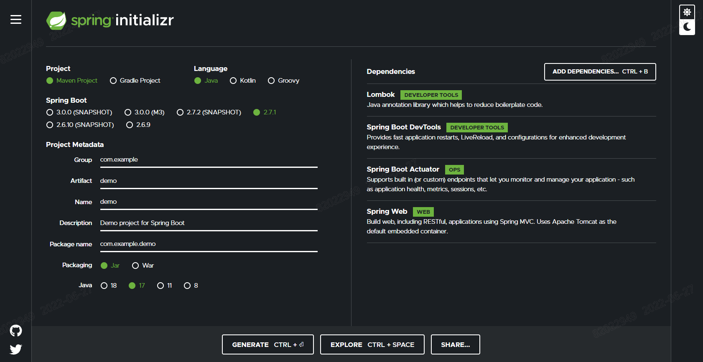<p></p></center>

### 5.2.2. 의존성 추가

#### pom.xml

```     xml
        <dependency> 
           <groupId>org.springdoc</groupId>
            <artifactId>springdoc-openapi-ui</artifactId>
            <version>1.6.6</version>
         </dependency> 
        
```

### 5.2.3. Swagger 설정

#### OpenApiConfig.java

```java
@Configuration
public class OpenApiConfig {

  @Bean
  public GroupedOpenApi openApi() {
    String[] paths = {"/**"};
    return GroupedOpenApi.builder().group("api-group").pathsToMatch(paths).build();
  }

  @Bean
  public OpenAPI springShopOpenAPI() {
      return new OpenAPI()
              .info(new Info().title("")
              .description("")
              .version("")
              .license(new License().name("").url("")))
              .externalDocs(new ExternalDocumentation()
              .description("")
              .url(""));
  }  
}
```

### 5.2.4. 설정

#### application.yml

```yaml
server:
  port: 8081 #복사한 서비스는 8082로 변경

spring:
  application:
    name: backend
  profiles:
    active: local
```

### 5.2.5. REST API  코딩

#### BackendApplication.java(Bootstrap)

```
package com.example.backend;

import org.springframework.boot.SpringApplication;
import org.springframework.boot.autoconfigure.SpringBootApplication;

@SpringBootApplication
public class BackendApplication {

	public static void main(String[] args) {
		SpringApplication.run(BackendApplication.class, args);
	}

}
```

#### Endpoint.java

```java
package com.example.backend.endpoint;

import java.util.Map;
import java.util.Random;

import org.springframework.web.bind.annotation.CrossOrigin;
import org.springframework.web.bind.annotation.GetMapping;
import org.springframework.web.bind.annotation.PostMapping;
import org.springframework.web.bind.annotation.RequestBody;
import org.springframework.web.bind.annotation.RequestHeader;
import org.springframework.web.bind.annotation.RestController;

import com.example.backend.payload.Payload;

import io.swagger.v3.oas.annotations.Operation;
import io.swagger.v3.oas.annotations.tags.Tag;
import lombok.extern.slf4j.Slf4j;

@CrossOrigin(origins = "*", allowedHeaders = "*")
@RestController
@Tag(name = "테스트 API", description = "테스트 API 서비스입니다.")
@Slf4j
public class Endpoint {

	@Operation(summary = "테스트 Get API", description = "테스트용 GET API 입니다.")
	@GetMapping(path = "/get")
	public Payload get(@RequestHeader Map<String, Object> requestHeader) {
		log.info("[REQ]get api headers : {}", requestHeader);

		return Payload.builder().code("200").message("success").service("backend1 get").data("").build();
	}
	
	@Operation(summary = "테스트 Post API", description = "테스트용 Post API 입니다.")
	@PostMapping(path = "/post")
	public Payload pot(@RequestHeader Map<String, Object> requestHeader, @RequestBody String body) {
		log.info("[REQ]get api headers : {}, body : {}", requestHeader, body);

		return Payload.builder().code("200").message("success").service("backend1 get").data(body).build();
	}
	
	@Operation(summary = "테스트 Auth Get API", description = "테스트용 Auth GET API 입니다.")
	@GetMapping(path = "/auth/get")
	public Payload authGet(@RequestHeader Map<String, Object> requestHeader, @RequestBody String body) {
		log.info("[REQ]get api headers : {}, body : {}", requestHeader, body);

		return Payload.builder().code("200").message("success").service("backend1 auth").data(body).build();
	}
	
	@Operation(summary = "테스트 Root API", description = "테스트용 Root API 입니다.")
	@GetMapping(path = "/")
	public Payload root(@RequestHeader Map<String, Object> requestHeader, @RequestBody String body) {
		log.info("[REQ]root api headers : {}, body : {}", requestHeader, body);

		return Payload.builder().code("200").message("success").service("backend1 root").data(body).build();
	}

	@Operation(summary = "테스트 Delay API", description = "테스트용 Delay API 입니다.")
	@GetMapping(path = "/delay")
	public Payload delay(@RequestHeader Map<String, Object> requestHeader, @RequestBody String body) {
		log.info("[REQ]delay api headers : {}, body : {}", requestHeader, body);
		
		try {
			Thread.sleep(10000);
		} catch (InterruptedException e) {
			log.error("error: ",e);
		}

		log.info("[RES]delay api");
		return Payload.builder().code("200").message("success").service("backend1 delay").data(body).build();
	}

}
```

### 5.2.6. Payload 생성

Payload.java

```java
package com.example.backend.payload;

import lombok.AllArgsConstructor;
import lombok.Builder;
import lombok.Getter;
import lombok.NoArgsConstructor;
import lombok.Setter;
import lombok.ToString;

@Getter
@Setter
@Builder
@AllArgsConstructor
@NoArgsConstructor
@ToString
public class Payload {
	
	private String code;
	
	private String message;
	
	private String service;
	
	private String data;

}
```

### 5.2.7. API테스트

 http://localhost:8081/swagger-ui.html
<center>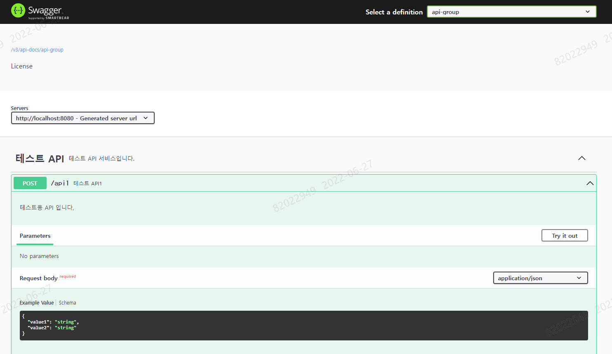<p></p></center>

## 5.3. Spring Cloud Gateway 개발

### 5.3.1. 프로젝트 생성

#### https://start.spring.io/

<center><p></p></center>

### 5.2.2. 의존성 추가

#### pom.xml

```xml
		<dependency>
			<groupId>org.springframework.boot</groupId>
			<artifactId>spring-boot-starter-actuator</artifactId>
		</dependency>
		<dependency>
			<groupId>org.springframework.cloud</groupId>
			<artifactId>spring-cloud-starter</artifactId>
		</dependency>
		<dependency>
			<groupId>org.springframework.boot</groupId>
			<artifactId>spring-boot-starter-webflux</artifactId>
		</dependency>
		<dependency>
			<groupId>org.springframework.cloud</groupId>
			<artifactId>spring-cloud-starter-gateway</artifactId>
		</dependency>
		<dependency>
			<groupId>org.springframework.cloud</groupId>
			<artifactId>spring-cloud-starter-circuitbreaker-reactor-resilience4j</artifactId>
		</dependency>
		<dependency>
			<groupId>org.springframework.boot</groupId>
			<artifactId>spring-boot-starter-data-redis</artifactId>
		</dependency>
		<dependency>
			<groupId>org.springframework.boot</groupId>
			<artifactId>spring-boot-starter-security</artifactId>
		</dependency>
		<dependency>
			<groupId>org.springframework.boot</groupId>
			<artifactId>spring-boot-starter-test</artifactId>
			<scope>test</scope>
		</dependency>	
		<dependency>
			<groupId>org.springframework.boot</groupId>
			<artifactId>spring-boot-devtools</artifactId>
			<scope>runtime</scope>
			<optional>true</optional>
		</dependency>
		<dependency>
			<groupId>org.projectlombok</groupId>
			<artifactId>lombok</artifactId>
			<optional>true</optional>
		</dependency>
```

### 5.3.3. 설정

#### application.yml

```yaml
spring:
  application:
    name: demo-gateway
  profiles:
    active: local
  redis:
    host: localhost
    port: 6379    

resilience4j.circuitbreaker:
  configs:
    default: #https://resilience4j.readme.io/docs/circuitbreaker 참고
             #최소 10건이 요청되었을 때 60% 이상(6건)의 요청이 오류가 발생하거나, 느린 요청일 경우 CircuitBreaker가 발동.
        registerHealthIndicator: true
        slidingWindowType: COUNT_BASED
        slidingWindowSize: 10 # {통계건수}
        minimumNumberOfCalls: 10 # {최소요청횟수}
        failureRateThreshold: 60 # {실패율}
        slowCallRateThreshold: 60 # {느린요청비율}
        slowCallDurationThreshold: 3000 # {느린요청으로 간주할 시간}
        permittedNumberOfCallsInHalfOpenState: 2
        waitDurationInOpenState: 5s # {Circuit Breaker유지시간}
        eventConsumerBufferSize: 10
  instances:
    testcirguitbreaker:
        baseConfig: default
    
management:
  endpoints:
    web:
      exposure:
        include: "*"
  endpoint:
    shutdown:
      enabled: true
    health:
      show-details: always
  health:
    circuitbreakers:
      enabled: true
    redis:
      enabled: true
        
logging: 
  level:
    org.springframework.cloud.gateway: TRACE
```

### 5.3.4. API 게이트웨이 코딩

#### GatewayApplication.java(Bootstrap)

```java
package com.example.demogateway;

import org.springframework.boot.SpringApplication;
import org.springframework.boot.autoconfigure.SpringBootApplication;

@SpringBootApplication
public class GatewayApplication {
	
	public static void main(String[] args) {
		SpringApplication.run(GatewayApplication.class, args);
	}
}
```

#### FallbackEndpoint.java

```java
package com.example.demogateway.endpoint;

import org.springframework.web.bind.annotation.RequestMapping;
import org.springframework.web.bind.annotation.RestController;

@RestController
public class FallbackEndpoint {

	@RequestMapping("/circuitbreakerfallback")
	public String circuitbreakerfallback() {
		return "This is a fallback";
	}

}

```

#### LoggingGatewayFilterFactory.java

```java
package com.example.demogateway.filter;

import org.springframework.cloud.gateway.filter.GatewayFilter;
import org.springframework.cloud.gateway.filter.factory.AbstractGatewayFilterFactory;
import org.springframework.stereotype.Component;

import lombok.AllArgsConstructor;
import lombok.Getter;
import lombok.NoArgsConstructor;
import lombok.Setter;
import lombok.extern.slf4j.Slf4j;
import reactor.core.publisher.Mono;

@Slf4j
@Component
public class LoggingGatewayFilterFactory extends AbstractGatewayFilterFactory<LoggingGatewayFilterFactory.Config> {
    public LoggingGatewayFilterFactory() {
        super(Config.class);
    }

    @Override
    public GatewayFilter apply(Config config) {
        return (exchange, chain) -> {
            if (config.isPreLogger()) {
                log.info("Pre GatewayFilter logging: " + config.getBaseMessage());
            }

            return chain.filter(exchange)
                    .then(Mono.fromRunnable(() -> {
                        if (config.isPostLogger()) {
                            log.info("Post GatewayFilter logging: " + config.getBaseMessage());
                        }
                    }));
        };
    }

    @NoArgsConstructor
    @AllArgsConstructor
    @Getter
    @Setter
    public static class Config {
        private String baseMessage;
        private boolean preLogger;
        private boolean postLogger;
    }
}
```

#### RequestBodyTransform.java

```java
package com.example.demogateway.tranform;

import org.reactivestreams.Publisher;
import org.springframework.cloud.gateway.filter.factory.rewrite.RewriteFunction;
import org.springframework.stereotype.Component;
import org.springframework.web.server.ServerWebExchange;

import io.micrometer.core.instrument.util.StringUtils;
import lombok.extern.slf4j.Slf4j;
import reactor.core.publisher.Mono;

@Component
@Slf4j
public class RequestBodyTransform implements RewriteFunction<String,String> {
  
    @Override
    public Publisher<String> apply(ServerWebExchange exchange, String requestBody) {

        String modifiedJsonBody= "modifiedJsonBody";
    	if(StringUtils.isNotEmpty(requestBody)) {
    		modifiedJsonBody= "modifiedJsonBody=".concat(requestBody);
    	}
        log.info("RequestBodyTransform : {}", modifiedJsonBody);
    	return Mono.just(modifiedJsonBody);
        
    }

}
```

#### RewriteGlobalFilter.java

```java
package com.example.demogateway.filter;

import org.springframework.beans.factory.annotation.Autowired;
import org.springframework.cloud.gateway.filter.GatewayFilterChain;
import org.springframework.cloud.gateway.filter.GlobalFilter;
import org.springframework.cloud.gateway.filter.factory.rewrite.ModifyRequestBodyGatewayFilterFactory;
import org.springframework.core.Ordered;
import org.springframework.stereotype.Component;
import org.springframework.web.server.ServerWebExchange;

import com.example.demogateway.tranform.RequestBodyTransform;

import lombok.extern.slf4j.Slf4j;
import reactor.core.publisher.Mono;

@Slf4j
@Component
public class RewriteGlobalFilter implements GlobalFilter, Ordered {
	
    @Autowired
    private ModifyRequestBodyGatewayFilterFactory modifyRequestBodyFilter;
    
    @Autowired
    private RequestBodyTransform requestBodyTransform;
    
    @Override
    public Mono<Void> filter(ServerWebExchange exchange, GatewayFilterChain chain) {
        log.info("===================== pre filter =====================");
        
		return modifyRequestBodyFilter
				.apply(new ModifyRequestBodyGatewayFilterFactory
						.Config()
						.setRewriteFunction(String.class, String.class, requestBodyTransform))
				.filter(exchange, chain)
				.then(Mono.fromRunnable(() -> {
                   log.info("===================== post filter =====================");
               }));
    }

    @Override
    public int getOrder() {
        return -1;
    }
}
```

#### DemoRouteLocator.java

```java
package com.example.demogateway.route;

import org.springframework.cloud.gateway.filter.ratelimit.RedisRateLimiter;
import org.springframework.cloud.gateway.route.RouteLocator;
import org.springframework.cloud.gateway.route.builder.RouteLocatorBuilder;
import org.springframework.context.annotation.Bean;
import org.springframework.context.annotation.Configuration;
import org.springframework.security.config.web.server.ServerHttpSecurity;
import org.springframework.security.core.userdetails.MapReactiveUserDetailsService;
import org.springframework.security.core.userdetails.User;
import org.springframework.security.core.userdetails.UserDetails;
import org.springframework.security.web.server.SecurityWebFilterChain;
import com.example.demogateway.filter.LoggingGatewayFilterFactory;

@Configuration
public class DemoRouteLocator {

	@Bean
	public RouteLocator customRouteLocator(RouteLocatorBuilder builder, LoggingGatewayFilterFactory loggingGatewayFilterFactory) {
		return builder.routes()
				.route("path_route1", r -> r.path("/get")
						.filters(f -> f.addRequestHeader("Hello", "World"))
						.uri("http://localhost:8081"))
				
				.route("path_route2", r -> r.path("/post")
						.filters(f -> f.filter(loggingGatewayFilterFactory.apply(new LoggingGatewayFilterFactory.Config("message", true, true))))						
						.uri("http://localhost:8081"))				
				
				.route("path_route_1", r -> r.path("/backend1/**")
						.filters(f -> f.rewritePath("/backend1/(?<segment>.*)","/${segment}"))
						.uri("http://localhost:8081"))	
				
				.route("path_route_2", r -> r.path("/backend2/**")
						.filters(f -> f.rewritePath("/backend2/(?<segment>.*)","/${segment}"))
						.uri("http://localhost:8082"))					
				
				.route("host_route", r -> r.host("*.myhost.org")
						.uri("http://localhost:8082"))
				
				.route("rewrite_route", r -> r.host("*.rewrite.org")
						.filters(f -> f.rewritePath("/foo/(?<segment>.*)","/${segment}"))
						.uri("http://localhost:8081"))
				
				.route("circuitbreaker_route", r -> r.host("*.circuitbreaker.org")
						.filters(f -> f.circuitBreaker(c -> c.setName("testcirguitbreaker")))
						.uri("http://localhost:8081"))
				
				.route("circuitbreaker_fallback_route", r -> r.host("*.circuitbreakerfallback.org")
						.filters(f -> f.circuitBreaker(c -> c.setName("testcirguitbreaker").setFallbackUri("forward:/circuitbreakerfallback")))
						.uri("http://localhost:8081"))        
				
				.route("limit_route", r -> r.host("*.limited.org").and().path("/auth/**")
						.filters(f -> f.requestRateLimiter(c -> c.setRateLimiter(redisRateLimiter())))
						.uri("http://localhost:8081"))
				
				.route("websocket_route", r -> r.path("/echo")
					.uri("ws://localhost:9000"))
				.build();
	}

	@Bean
	RedisRateLimiter redisRateLimiter() {
		return new RedisRateLimiter(1, 2);
		// Token Bucket 알고리즘 시반
		// replenishRate: 초당처리량
		// burstCapacity : 최대 버킷크기
         // 일시적으로 최대 2 request/second를 처리할 수 있으며, 평균적으로는 1 request/second를 처리하며, 이를 초과하는 요청에 대해서는 HTTP 429 - Too Many Requets를 리턴
	}

	@Bean
	SecurityWebFilterChain springWebFilterChain(ServerHttpSecurity http) throws Exception {
		return http.httpBasic().and().csrf().disable().authorizeExchange().pathMatchers("/auth/**").authenticated()
				.anyExchange().permitAll().and().build();
	}

	@Bean
	public MapReactiveUserDetailsService reactiveUserDetailsService() {
		UserDetails user = User.withDefaultPasswordEncoder().username("user").password("password").roles("USER")
				.build();
		return new MapReactiveUserDetailsService(user);
	}

}
```

### 5.3.5. 테스트

------

#### Websocket 호출 테스트
터미널을 열어서 websocket 서버를 실행한다.

```shell
wscat --listen 9000
```

또다른 터미널을  열어서 websocket 클라이언트를 실행한다.

```shell
wscat --connect ws://localhost:8080/echo
```

websocket 서버/클라이언트가 게이트웨이를 통해 잘 전달되는지 확인한다.

#### API호출 테스트(Git Bash 터미널에서 실행)

```shell
$ curl  http://127.0.0.1:8080/get -i
$ curl -X POST http://127.0.0.1:8080/post -i -d data
$ curl  http://127.0.0.1:8080/backend1/get -i
$ curl  http://127.0.0.1:8080/backend2/get -i
$ curl --header "Host: www.myhost.org"  http://127.0.0.1:8080 -i
$ curl --header "Host: www.rewrite.org"  http://127.0.0.1:8080/foo/get -i
$ curl --header "Host: www.circuitbreaker.org"  http://127.0.0.1:8080/delay -i
$ curl --header "Host: www.circuitbreakerfallback.org"  http://127.0.0.1:8080/delay -i
$ while true; do curl --header "Host: www.limited.org"  http://127.0.0.1:8080/auth/get -i -u user:password;  done;
```

#### Actuator를 통한 상태 확인

```apl
http://localhost:8080/actuator/health
```

#### Redis CLI 를 통한 확인

```shell
127.0.0.1:6379> keys *
(empty list or set)
127.0.0.1:6379> keys *
1) "request_rate_limiter.{user}.timestamp"
2) "request_rate_limiter.{user}.tokens"
```

# 6. ICIS-Tr API Gateway

<center>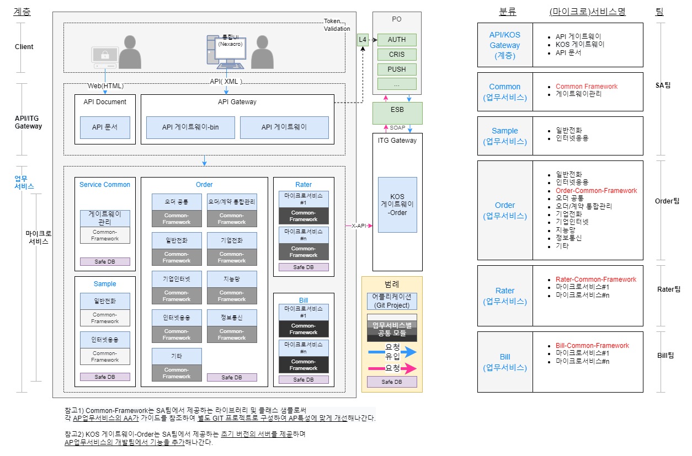<p></p></center>

## 6.1.  API GW 기능

<center>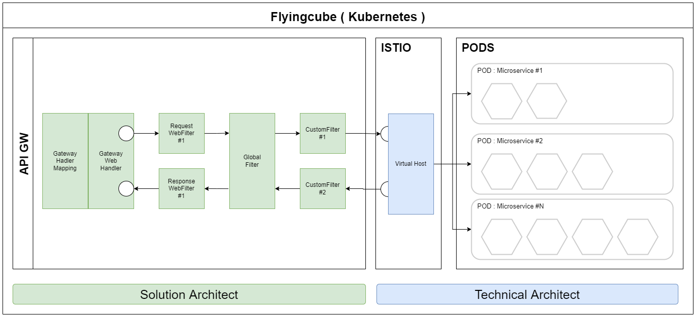<p></p></center>

#### 6.1.1. 트랜스폼 필터 ( XML → JSON )

RequestTransformGlobalFilter, ResponseTransformGlobalFilter 를 통하여 들어온 요청을 형식에 맞게 변환하는 RequestBodyTransform, ResponseBodyTransform 로 전달하여 변환을 수행한다. 

각 트랜스폼 클래스에서는 각각의 목적에 맞게 동기, 비동기 방식으로 들어온 요청을 검증하거나 변환하는 작업을 수행한다.

#### 6.2.2. 모니터링 연계 서비스

BMON에 요청 및 응답을 연계하기 위한 서비스는 공통서비스로 별도로 존재하며, 해당 서비스로의 연계는 OpenFeign방식으로 이루어진다. APIGW에서는 비동기 방식으로 요청 및 응답을 전달하여 이를 기록한다.

#### 6.2.3. 인증 서비스

UI에서 전달받은 Token의 validation을 위해 K-Auth를 Webclient를 통해 비동기 호출하고 그 결과를 받아 인증 여부를 판단한다.

#### 6.2.4. 라우팅 서비스

전문을 통해 전달받은 serviceName을 파싱하여 Istio Gateway를 통해 이를 처리할 서비스로 라우팅해 준다.

#### 6.2.5 캐쉬 연계 서비스 및 대안흐름 구성

기존 ESB에서 사용하는 meta정보 등을 관리하는 Redis에 접속하여 관련 정보를 가져온다. 만약 redis가 접속 불가하거나, 오류가 발생할 경우 별도의 API서비스를 OpenFeign방식으로 연결하여 대안흐름을 구성한다. 

## 6.2.  API GW 기능상세

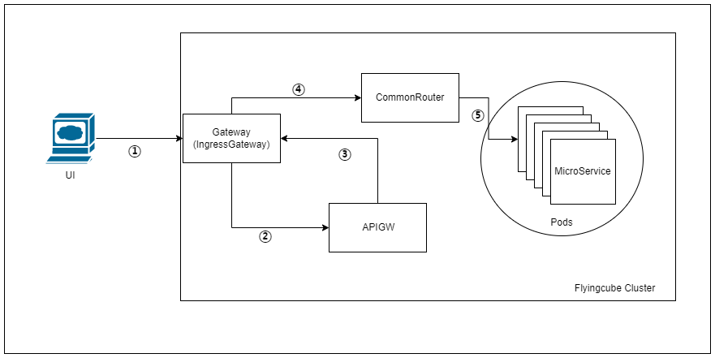
UI에서 전송된 서비스 요청을 MicroService 에서 처리하기까지의 과정은 다음과 같다. 각각의 처리 과정을 좀 더 상세하게 설명하면 다음과 같다.

① : UI에서 전송된 요청은 FlyingCube의 라우팅 규칙에 의해 IngressGateway로 전달된다. 
② : IngressGateway에서는 해당 요청을 APIGW로 전달하여 전문을 파싱하고 인증,E2E로깅을 처리한다.
③ : APIGW에서 처리한 전문은 다시 IngressGateway로 전달된다. 
④ : IngressGateway → CommonRouter로 전달된 요청은 요청의 context-path에 따라 맞는 MicroService의 service로 포워딩된다. 
⑤ : service로 전달된 요청이 pod로 전달된다. 

## 6.3. API GW 기능 목록

| 컴포넌트 유형 | 컴포넌트명(한글)   | 컴포넌트명(영문)                     | 상위 컴포넌트 | 처리흐름                                                     | Input                                  | Output                                 | 비고                          |
| :------------ | :----------------- | :----------------------------------- | :------------ | :----------------------------------------------------------- | :------------------------------------- | :------------------------------------- | :---------------------------- |
| APIGW         | 연계-모니터링 연계 | MonitoringFilter                     |               | 들어온 요청을 Filter를 통해 전달받아 BMON 시스템으로 전송한다.보내야 할 응답을 Filter를 통해 전달받아 BMON시스템으로 전송한다. 해당 서비스 장애시 이를 무시하고 처리할 수 있도록 개발한다. | 요청 - header, body응답 - header, body | N/A                                    |                               |
| APIGW         | 연계- 인증         | AuthFilter                           | GlobalFilter  | 들어온 요청의 token값을 전달받아 Auth 시스템으로 전송하여 token이 valid한지 확인한다.장애 발생시를 대비하여 BOS의 기준정보를 읽어 인증절차를 생략할 수 있도록 한다.token이 valid한 경우 요청을 통화(pass)한다.token이 invalid 한 경우 인증오류 메세지를 리턴하여 UI에서 인증을 수행하도록 한다. | String(x-auth-token)                   | String(조합된메세지)                   |                               |
| APIGW         | 연계- 트래픽 제어  | RoutingFilter                        | GlobalFilter  | BOS메타정보를 연계하는 기능을 제공한다.들어온 요청의 BizHeader를 확인하여 SvcName에 따라 해당되는 API주소로 포워딩될 수 있도록 한다.(UI에서 입력된 그대로 포워딩) | bizHeaderorderIdsvcNamefnName          | String(조합된메세지)                   |                               |
| APIGW         | 연계-트래픽제어    | CircuitBreaker                       |               | Corebiz 서비스에 이상상황 발생시 이를 제어하기 위한 CircuitBreacker 기능을 개발한다. | 서비스단 이상상황 발생시 차단 설정     | N/A                                    |                               |
| APIGW         | 연계-ESB연계       | KosEsbGateway                        |               | Http요청을 받아 이를 기존 ESB에 SOAP형태의 WebService로 전달하고 처리한다. | 요청 - body(xml)응답 - body(xml)       | 요청 - body(SOAP)응답 - body(SOAP)     |                               |
| APIGW         | 입출력- 입력 채널  | TransformFilter                      | GlobalFilter  | UI에서 수신받은 xml데이터를 REST 전송을 위한 json 포맷으로 변경한다. Corebiz API로부터 수신받은 json 데이터를 UI 전송을 위한 xml 포맷으로 변경한다. | 요청 - body(xml)응답 - body(xml)       | 요청 - body(json)응답 - body(json)     | 변환되는 클래스의 구조를 명시 |
| APIGW         | 공통-Gateway 공통  | GlobalFilter,WebFilter, Customfilter |               | Spring-Cloud-Gateway 를 위해 필요한 GlobalFilter, WebFilter, CustomFilter 구조를 개발한다.Filter간 역할, 적용 순서 및 적용여부를 설정할 수 있도록 개발한다. | 요청 - header, body응답 - header, body | 요청 - header, body응답 - header, body |                               |
| APIGW         | 공통-로깅          | LoggingFilter                        | CustomFilter  | 들어온 요청에 대한 로그를 파일로 저장한다(저장할 데이터-사용자IP, UserAgent 정보, UI로부터 넘겨받는 버전 혹은 클라이언트 정보 등을 포함)이후 로깅시 추적 가능하도록 GlobalNo,bussinessKey정보를 저장한다.향후 EFK를 통해 저장하고 통합 관리할 수 있도록 로그 내용을 구성한다. | N/A                                    | N/A                                    |                               |
| APIGW         | 공통-프로퍼티      | ICISPropertyManager                  |               | BOS로부터 기준정보를 읽어 이를 Redis에 저장하고 관리한다.Redis 장애시 DB로부터 이를 읽어올 수 있도록 한다, | N/A                                    | N/A                                    |                               |
|               |                    |                                      |               |                                                              |                                        |                                        |                               |

## 6.4. Istio Ingress Gateway

Gateway(Istio Ingress Gateway)는 외부에서 받은 요청을 클러스터 내부로 전달하는 역할을 한다. 클러스터에 접근하여 생성, 삭제할 수 있으며 형상을 통해 소스코드로 관리된다.

이 문서에서는 API-Gateway와 구분하기 위해 Gateway라고 표기하며, API-Gateway는 APIGW로 표기한다.

### 6.4.1. Gateway 관리

- 적용 혹은 변경을 위해서는 다음과 같이 수행한다.(미리 해당 클러스터 로그인이 되어 있어야 함)

```shell
# Gateway 생성(변경 후 재적용)
$ icis-samp-cmmn git:(dev) kubectl apply -f ./dev-icis-ingress-gateway.yaml
gateway.networking.istio.io/icis-apigw-gateway unchanged
virtualservice.networking.istio.io/icis-apigw-vs unchanged

#삭제
$ icis-samp-cmmn git:(dev) kubectl delete -f ./dev-icis-ingress-gateway.yaml
gateway.networking.istio.io/icis-apigw-gateway deleted
virtualservice.networking.istio.io/icis-apigw-vs deleted
```

간혹 변경이 인식되지 않을 경우 삭제 후 재적용하면 적용이 가능하다. 

### 6.4.2. Routing

APIGW(API-Gateway)는 Spring-Cloud-Gateway를 기반으로 개발된 Gateway 용 어플리케이션이며, UI로 부터 전달된 전문을 읽고, 변환하거나, 인증, 로깅을 처리하고 뒷단의 MicroService로 전달해준다.

### 6.4.3. APIGW 형상

다음의 형상 위치의 소스코드를 받아 수정하고 형상에 반영한다. dev 환경에 반영을 위해서는 develop 브랜치에 반영해야 하며 이외 ait, sit 등 각각의 환경의 경우 CICD 가이드를 참고하여 적절한 브랜치에 반영한다.

소스코드, GITOPS, CONFIG가 각각의 형상의 목적에 따라 분리되어 있으며 목적에 맞는 형상을 수정한다.

- APIGW 소스코드 - https://gitlab.dspace.kt.co.kr/icis-tr/sa/icistr-gateway.git
- APIGW GITOPS - https://gitlab.dspace.kt.co.kr/icis-tr/sa/icistr-gateway-gitops.git
- APIGW CONFIG - https://gitlab.dspace.kt.co.kr/icis-tr/sa/icis-apigw-config.git

다음과 같이 상황에 따라 환경에 반영하기 위한 작업을 수행한다. 

- 소스코드를 수정하였을 경우 - Jenkins를 통해 해당 환경에 대한 빌드잡을 실행 - argocd에서 동기화를 수행한다.
- GITOPS 설정을 수정하였을 경우 - argocd에서 동기화를 수행한다. 
- CONFIG를 수정하였을 경우 - consul에 의해 자동적으로 반영되므로 일정기간 후 다시 적용되었는지 확인한다. 

### 6.4.4.  서킷브레이커

MicroService 구성에서 서비스 간 장애의 전파를 방지하기 위하여 CircuitBreaker 패턴을 시스템에 적용하며, 시스템 혹은 컴포넌트가 느려질 경우 장애가 종속된 서비스까지의 전파를 방지하며 이를 위해 Spring-Cloud-Gateway에서는 Resilience4J 라는 라이브러리를 이용하여 CircuitBreaker를 구현한다. 

설정파일에 들어가 있는 CircuitBraker 설정은 다음과 같다. 다음과 같은 경우 최소 10건이 요청되었을 때 60% 이상(6건)의 요청이 오류가 발생하거나, 느린 요청일 경우 CircuitBreaker가 발동하게 된다. 

```yaml
resilience4j.circuitbreaker:
  configs:
    default:
        registerHealthIndicator: true
        slidingWindowType: COUNT_BASED
        slidingWindowSize: 10 # {통계건수}
        minimumNumberOfCalls: 10 # {최소요청횟수}
        failureRateThreshold: 60 # {실패율}
        slowCallRateThreshold: 60 # {느린요청비율}
        slowCallDurationThreshold: 3000 # {느린요청으로 간주할 시간}
        permittedNumberOfCallsInHalfOpenState: 2
        waitDurationInOpenState: 5s # {Circuit Breaker유지시간}        
        eventConsumerBufferSize: 10
  instances:
    apigw:
        baseConfig: default
```

APIGW의 /actuator/health 를 통해 확인해 보면 CircuitBreaker 발동시 아래와 같이 Circuit이 Open되어 있음을 확인할 수 있다.

```json
{
  "status": "UP",
  "components": {
    "circuitBreakers": {
      "status": "UP",
      "details": {
        "apigw": {
          "status": "CIRCUIT_OPEN",
          "details": {
            "failureRate": "-1.0%",
            "failureRateThreshold": "60.0%",
            "slowCallRate": "-1.0%",
            "slowCallRateThreshold": "100.0%",
            "bufferedCalls": 1,
            "slowCalls": 0,
            "slowFailedCalls": 0,
            "failedCalls": 10,
            "notPermittedCalls": 0,
            "state": "OPEN"
          }
        },
```

Circuit이 Open되었을 경우 일시적으로 서비스 사용이 막히게 되므로, 설정된 시간이 흐른 후 Valid한 요청을 보내면 다시 Circuit이 HALF_OPEN → OPEN 상태로 변경되어 서비스를 정상적으로 사용할 수 있다.

## 6.5. CommonRouter

ComonRouter는 APIGW로부터 요청을 전달받아 그 context-path에 따라 뒷단의 적당한 MicroService로 연결해주는 역할을 수행한다. Ingress Gateway와 마찬가지로 클러스터에 접근하여 생성, 수정할 수 있으며 소스코드로 관리된다.

### 6.5.1. CommonRouter 관리

적용 혹은 변경을 위해서는 다음과 같이 수행한다.(미리 해당 클러스터 로그인이 되어 있어야 함)

```shell
# CommonRouter 생성(변경 후 재적용)

$  icis-samp-cmmn git:(dev) kubectl apply -f ./olv-icis-cmmn-router.yaml
gateway.networking.istio.io/icis-common-router-gateway unchanged
virtualservice.networking.istio.io/icis-common-router-vs unchanged

# 삭제
$  icis-samp-cmmn git:(dev) kubectl delete -f ./olv-icis-cmmn-router.yaml
gateway.networking.istio.io/icis-common-router-gateway deleted
virtualservice.networking.istio.io/icis-common-router-vs deleted
```

### 6.5.2. 트래픽 제어

MicroService가 추가될 경우 CommonRouter상의 icis-common-router-vs에 다음 위치에 경로를 추가한다. match 레벨에 맞게 해당 경로와 service 명을 추가하여 CommonRouter를 다시 클러스터에 적용해 준다.

```yaml
(...)
apiVersion: networking.istio.io/v1alpha3
kind: VirtualService
metadata:
  name: icis-common-router-vs
  namespace: sa-app
spec:
  hosts:
  - "sa-app-ingressgateway.sa-app.svc"
    gateways:
  - icis-common-router-gateway
  - mesh
    http:
  - match:
    - uri:
        prefix: /ppon-cqrs-command
    route:
    - destination:
        host:  icis-samp-ppon-cqrs-command-active
        port:
          number: 80
  - match:
    - uri:
        prefix: /ppon-cqrs-query
    route:
    - destination:
        host:  icis-samp-ppon-cqrs-query-active
        port:
          number: 80
  - match:
    - uri:
        prefix: /ppon
    route:
    - destination:
        host: icis-samp-ppon-active
        port:
          number: 80
  - match:
    - uri:
        prefix: /intelnet
    route:
    - destination:
        host: icis-samp-intelnet-active
        port:
          number: 80
  - match:
    - uri:
        prefix: /inetaplca    # prefix명
    route:
    - destination:
        host:  icis-samp-inetaplca-active    # 서비스명
        port:
          number: 80
```

# [별첨]

## 1. Proxy

프록시 서버는 클라이언트가 자신을 통해서 다른 네트워크 서비스에 간접적으로 접속할 수 있게 해 주는 컴퓨터 시스템이나 응용 프로그램을 가리킨다.
서버와 클라이언트 사이에 중계기로서 대리로 통신을 수행하는 것을 가리켜 '프록시', 그 중계 기능을 하는 것을 프록시 서버라고 부른다.
프록시 서버 중 일부는 프록시 서버에 요청된 내용들을 캐시를 이용하여 저장해 둔다.
프록시는 크게 **Forward Proxy** 와 **Reverse Proxy** 로 나뉜다.

### Forward Proxy
클라이언트(사용자)가 인터넷에 직접 접근하는게 아니라 포워드 프록시 서버가 요청을 받고 인터넷에 연결하여 결과를 클라이언트에 전달 (forward) 해준다.
프록시 서버는 Cache 를 사용하여 자주 사용하는 데이터라면 요청을 보내지 않고 캐시에서 가져올 수 있기 때문에 성능 향상이 가능하다.

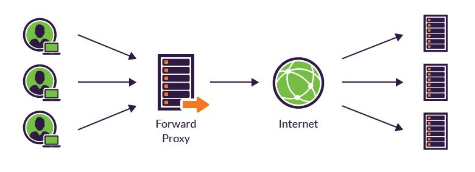

### Reverse Proxy
클라이언트가 인터넷에 데이터를 요청하면 리버스 프록시가 이 요청을 받아 내부 서버에서 데이터를 받은 후 클라이언트에 전달한다.
클라이언트는 내부 서버에 대한 정보를 알 필요 없이 리버스 프록시에만 요청하면 된다.
내부 서버 (WAS) 에 직접적으로 접근한다면 DB 에 접근이 가능하기 때문에 중간에 리버스 프록시를 두고 클라이언트와 내부 서버 사이의 통신을 담당한다.
또한 내부 서버에 대한 설정으로 로드 밸런싱(Load Balancing) 이나 서버 확장 등에 유리하다.


### 차이점

#### **End Point**
Forward Proxy 는 클라이언트가 요청하는 End Point 가 **실제 서버 도메인**이고 프록시는 둘 사이의 통신을 담당해준다.
Reverse Proxy 는 클라이언트가 요청하는 End Point 가 **프록시 서버의 도메인**이고 실제 서버의 정보는 알 수 없다.

#### **감춰지는 대상**
Forward Proxy 는 **클라이언트가 감춰진다.**
요청 받는 서버는 포워드 프록시 서버를 통해서 요청을 받기 때문에 클라이언트의 정보를 알 수 없다.
Reverse Proxy 는 반대로 **서버가 감춰진다.**
클라이언트는 리버스 프록시 서버에게 요청하기 때문에 실제 서버의 정보를 알 수가 없다.

출처 : https://bcp0109.tistory.com/194


## 2. Webflux


WebFlux는 Spring 5에 새롭게 추가된 Reactive-stack의 웹 프레임워크이다.
WebFlux는 클라이언트와 서버에서 리액티브 애플리케이션 개발을 위한 논블로킹 **리액티브 스트림**을 지원한다.
WebFlux 논블로킹으로 동작하는 웹 스택의 필요성 때문에 등장하게 되었다. 기존 SpringMVC의 Servlet API는 v3.1 부터 논블로킹 I/O를 위한 API를 제공했었다. 하지만, 이외의 동기적으로 처리하는 모듈(Filter, Servlet)과 블로킹 방식의 API(getParameter, getPart)들이 있기에 완벽한 논블로킹 환경의 개발을 할 수 없었다. 또한, 비동기 논블로킹 환경의 서버로 Netty가 부상하고 있었으며 이 Netty와의 연동을 위해 Spring은 새로운 API가 필요했다.

### WebFlux로의 전환 이유
SpringMVC로 개발하고 동작이 잘 되던 서버를 굳이 왜 WebFlux로 전환할까? 전환을 한다면 이에 대한 합리적인 이유가 필요하다. 그냥 새로운 기술이라, 적용하고 싶어서가 아니다.
먼저 SpringMVC와 WebFlux의 차이를 살펴보자

### SpringMVC
SpringMVC는 하나의 요청에 대해 하나의 스레드가 사용된다(thread-per-request). 그렇기에 다수의 요청을 대비하여 미리 스레드 풀을 생성해놓으며, 각 요청마다 스레드를 할당하여 처리한다. 전통적인 방식의 서버는 이러한 방식으로 요청을 처리하는데 문제는 다음과 같은 상황에서 발생한다.

1) 블로킹 콜(Blocking Call)

동작중인 스레드가 블로킹 상태가 되면 다른 스레드에서 CPU 사용을 위해 문맥 교환(context switch)이 일어나게 된다. 만약 서버의 대부분의 연산이 이러한 블로킹 콜(blocking call)로 구성되어 있다면, 특히 MSA 환경은 API 호출 또는 db connection으로 대부분의 비즈니스 로직이 구성되어 있으니 잦은 문맥 교환이 일어나게 된다. 내부 블로킹 콜이 차지하는 비중만큼 문맥 교환의 오버헤드가 있는 것이다.

2) 많은 요청량(more and more request)

요청량이 증가한다면 스레드 수도 이에 비례하여 증가한다. 64비트 JVM은 기본적으로 스레드 스택 메모리를 1MB 예약 할당하는데 스레드 수가 증가한다면 서버가 감당해내지 못할 만큼의 메모리를 먹을 수 있다. 1만개 요청이면 9.76GB, 100만 개면 976GB 메모리를 점유한다 (불가능).

### WebFlux

리액티브 프로그래밍은 논블로킹과 고정된 스레드 수 만으로 모든 요청을 처리함으로 위의 문제들을 해결한다. 논블로킹 리액티브 웹 스택 중 하나인 WebFlux는 위의 리액티브의 특징들을 가진다.

서버는 스레드 한 개로 운영하며, 디폴트로 CPU 코어 수 개수의 스레드를 가진 워커 풀을 생성하여 해당 워커 풀 내의 스레드로 모든 요청을 처리한다. 제약이 있다면 논블로킹으로 동작하여야만 하며, 블로킹 라이브러리가 필수적으로 사용되어야 한다면, 워커 스레드가 아닌 외부 별도의 스레드로 요청을 처리해야한다(이는 요청을 처리하는 Event Loop가 절대 블로킹되지 않아야 하기 때문이다).

### 전환 시 고려할 조건

1) 내부 작업의 유형

 Hard한 연산들이 로직의 주를 이루는 경우 SpringMVC보다 성능적인 향상을 내지 못한다. 전환을 고려한다면 내부 로직들이 어떠한 연산으로 이루어져 있는지 고려할 필요가 있다. 내부 연산보다는 블로킹 콜인 파일 업다운로드와 외부 API 호출, db 조회가 주된 작업일 경우 WebFlux로의 전환이 성능적인 개선을 가져올 수 있는 구조이다.

2) 리액티브 라이브러리 유무

사용하는 라이브러리들이 블로킹이라면 이는 쉽게 논블로킹으로 전환하기 어려울 수 있다. 워커풀이 아닌 별도의 외부 스레드풀을 생성하여 논블로킹으로 처리할 수 있겠지만, 스프링 가이드는 최대한 이러한 방법도 피하는 것을 권장한다. 필자의 프로젝트엔 DB connection을 위해`spring-boot-starter-data-mongodb` 가 사용되고 있었고 MongoDB는 리액티브 라이브러리를 일찍 부터 제공 했었기에 dependency만 `spring-boot-starter-data-mongodb-reactive` 로 수정하여 리액티브 개발에 들어갈 수 있다.

### WebFlux 전환

절반정도 MVC로 개발하던 프로젝트를 WebFlux로 전환하며 겪었던 전환 요소나 결정해야 했던 상황들을 나열해본다.

### Reactor - Reactive API

Reactor는 WebFlux에서 사용하는 리액티브 스트림 API의 구현체이다. 개발자가 리액티브 스트림을 직접 구현하는것은 매우 힘든일이며 이를 위해 Reactor는 고수준의 리액티브 API Mono와 Flux를 제공한다.


Mono는 0~1개의 데이터를 발행하는 Publisher 구현체이며, Flux는 0~N개의 데이터를 발행하는 Publisher 구현체이다.

### Programming Model

MVC와 다르게 WebFlux는 두가지의 프로그래밍 모델이 존재한다.

> Annotated Controller

SpringMVC와 같은 `@Controller`, `@RequestMapping` 애노테이션들을 활용한 방식의 프로그래밍 모델이다. 이 방법으로 택할 시, 변경할 사항이 가장 적었으며 MVC와 동일하게 `spring-web` 모듈의 애노테이션을 그대로 사용가능하다.

> Functional Endpoints

WebFlux가 나오며 Spring에 추가된 프로그래밍 방식이다. 자바 8의 람다 표현식으로 자바에서 함수형 API를 작성할 수 있게되며, 이러한 방식으로 웹 서버를 개발할 수 있게 되었다. annotated controller와 다른 점으로는 애노테이션으로 의도를 선언하여 콜백받는 방식이 아닌, 요청을 애플리케이션이 처음부터 끝까지 다 제어한다(콜백받기 위해 애노테이션을 scan, mapping 과정이 생략되어서인지 애플리케이션 부팅 시간이 좀 더 빠르다 한다).
필자의 프로젝트는 MVC기반으로 작성되었었고 첫 WebFlux로의 전환이기에 **Annotated Controller** 방식을 선택하였다.

### 설정
MVC의 경우 [WebMvcConfigurer](https://docs.spring.io/spring-framework/docs/current/javadoc-api/org/springframework/web/servlet/config/annotation/WebMvcConfigurer.html)를 implements하고 원하는 추가 설정은 오버라이드하여 구현한다. WebFlux의 경우에도 크게 다르지 않다. [WebFluxConfigurer](https://docs.spring.io/spring-framework/docs/current/javadoc-api/org/springframework/web/reactive/config/WebFluxConfigurer.html)를 implements하고 동일하게 원하는 설정을 오버라이드하여 구현하면 된다.

### 필터와 인터셉터
WebFlux는 필터와 인터셉터의 기능을 WebFliter 클래스로 제공한다. 인증과 Acl을 위해 구현되었던 인터셉터를 WebFliter로 전환하였다.

### 코드
> 리턴 타입 변환 T → Mono, Flux

컨트롤러와 서비스 메소드에서의 리턴 타입을 전환하였다. 기존에 일반 타입으로 반환하였다면, Reactor는 리액티브 스트림을 지원하는 Mono와 Flux를 제공하기에 리턴 타입도 Mono, Flux로 전환되어야 한다.
리액티브 라이브러리의 경우 이미 Mono와 Flux의 리턴타입을 가질것이며, 직접 데이터를 생성하는 경우라면 `just()` 메서드로 감싸서 전달하도록 한다.

> 비동기 작업의 순서유지를 위해 flatMap으로 체이닝

WebFlux 전환 시, 내부엔 블로킹이 존재하지 않는다. 작업들은 비동기적으로 처리될 것이며 라인 순서에 따른 실제 코드의 동작 순서는 일치하지 않게된다(메서드를 호출해도 실제 동작은 나중에 처리될것이기 때문이다). 이때 flatMap을 통해 이전 비동기 작업이 끝난 후 다음 로직들이 처리되도록 순서를 보장시켜줄 수 있다.

> 내부가 동기적인 동작이라면 map으로 체이닝

flatMap과 map의 차이점은 전달하는 함수의 리턴 타입이다. flatMap에 전달하는 함수의 리턴 타입은 Mono나 Flux와 같은 리액티브 API이며, 이는 비동기 동작이 있는 함수를 전달하기 위해서이다.

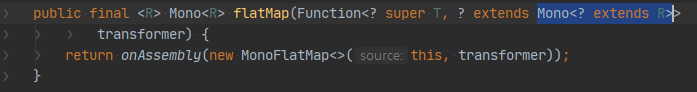
리턴타입이 Mono<? extends R>

하지만, 블로킹될 일이 없는 로직으로만 구성되고 데이터를 직접 생성한다면 map 함수를 통해 체이닝 할 수 있다. 그렇기에 map에 전달하는 함수는 일반적인 오브젝트(T)를 리턴 한다

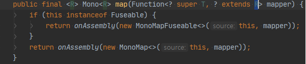
리턴타입이 R이다

> 예외처리는 Mono.error(Throwable), onErrorXX로
WebFlux에서 리턴 타입은 Mono나 Flux로 구성된다. 그렇기에 예외를 던져야할 때 throw 대신 Mono.error API를 사용하자. Mono.error를 리턴 시키도록 수정하고 던지던 예외는 error() 메서드에 인자로 전달한다.
예외 처리 시 Exception을 발생시키는 것 이외에도 catch 실패 시 처리할 로직을 태울때도 있다. 그런경우는 onErrorXX API를 사용하자. 이는 예외 발생 시 다른 Mono나 Flux 형태로 리턴하여 반환할 수 있도록 한다.

> 블로킹 라이브러리
어쩔수 없이 블로킹 라이브러리가 사용되어야 한다면 별도의 스레드 풀을 생성하여 이를 이용해야한다. 찾아보니 `publishOn` 연산자를 통해 연산을 다른 스레드 풀로 전환하여 사용할 수 있다고 하는데, 필자와 같은 경우 ThreadPoolTaskExecutor을 통해 별도의 스레드 풀을 생성하고 필요한 작업만을 할당하게 하였다.
CompletableFuture::supplyAsync 를 통해 필요한 작업을 특정 executor(별도로 만든 스레드 풀)에 할당하여 처리하도록 하였으며

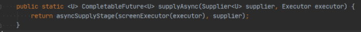
Mono::fromFuture로 생성된 CompletableFuture를 Mono로 전환하였다.

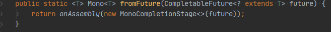
위와 같은 방법으로 필요한 작업만을 외부 라이브러리에서 동작할 수 있도록 해주었다.

### Blocking Call 검출
리액티브 애플리케이션에서의 블로킹 콜은 매우 치명적이다. 그렇기에 [BlockHound](https://github.com/reactor/BlockHound) 사용하여 내부 블로킹 콜을 검출할 수 있다.
BlockHound는 논블로킹으로 동작해야만 하는 스레드에 대해 블로킹 콜을 감지하며 예외를 발생시킨다. 이때 논블로킹으로 동작해야만 하는 스레드는 서버 역할의 하나의 메인 스레드와 CPU 코어 수 만큼 생성하는 워커 스레드들을 의미한다.
적용도 pom.xml에 dependency를 추가해주고

```xml
<dependencies>
  <dependency>
    <groupId>io.projectreactor.tools</groupId>
    <artifactId>blockhound</artifactId>
    <version>$LATEST_RELEASE</version>
  </dependency>
</dependencies>
```

애플리케이션 시작시 BlockGound.install을 호출해 주기만 하면 BlockHound가 적용 된다.
BlockHound 사용시 주의할 점이라면 스레드에서 블로킹 콜 여부를 감시하기 때문에 개발 환경이 아닌 리얼 환경에서 사용한다면 성능에 영향을 미치게된다. 그렇기에 개발 환경에서 적용하여 블로킹 콜이 없는지 최대한 테스트하고 리얼 환경에선 이 라이브러리를 사용하지 않도록 하자.

출처 : https://ckddn9496.tistory.com/158,  https://docs.spring.io/spring-framework/docs/current/reference/html/web-reactive.html


## 3. SOA( Service Oriented Architecture) vs MSA ( MicroService Architecture)

### 공통 철학

- 비즈니스를 구현할 때 서로다른 서비스들이 존재하고, 이런 서비스들을 조합하여 하나의 비즈니스 요구사항을 해결한다
- SOA와 MSA는 ***기능 중심의 모듈 재사용\***보다 상위 수준의 ***서비스 수준의 재 사용성\***에 초점 맞추다는 공통점이 있다.
- 소프트웨어는 코드라는 형체가 있지만 보이지 않기 때문에, 더 정확하고 명확하게 설계되어야 한다.
- SOA와 MSA의 기본 철학은 비슷하나, SOA > MSA MSA가 더 작은단위로 아키텍쳐 형태에 차이가 있다.

### 차이점

#### 공유관점

 SOA 는 모듈의 의존성은 줄이되 모듈 내에서 공유할 수 있는건 최대한 공유하는 정책을 사용한다.
반면, MSA 는 가능한 공유하지 않고 모듈들이 독립적으로 운용될 수 있도록 아키텍처를 디자인 한다.
서비스 재사용성 강조하는 한 가지 작은 서비스에 집중한다. 그리고 SOA는 서비스를 최대한 공유하려고 ESB 같은 걸 도입하지만 MSA는 최대한 독립적으로 구성하도록 디자인한다.

#### Flow 관점

SOA 는 서비스의 Flow 를 유지하려하지만, MSA 는 Flow 의 구별을 요구한다.
가령, 서비스 내에서 결제를 하고자 할때, SOA 는 관련된 루틴을 수행하여 결제를 지원함으로써, 유저에게 제공해주는 "서비스" 를 1차 목적으로 한다.
반면, MSA 는 유저에게 관련된 루틴과 결제 루틴을 별도로 이용하게끔 한다. 즉 서비스 내의 독립이 아닌 독립된 서비스를 지향한다.
그렇다보니 SOA 아키텍처는 대게 어느정도 업격한 Protocol 과 Message 체계를 운용하게 되고, MSA 의 경우 별도의 체계가 없이 경량화된 프로토콜을 통해 운용되게 된다.

#### 지향점

SOA 는 서비스들의 재사용에 중점을 두지만 MSA 는 서비스들의 독립을 추구한다.

#### 경계식별

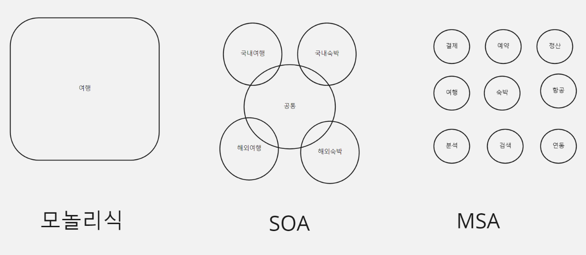

### 특성

- SOA는 각 레이어의 통신방법을 중시하며, 재사용을 위해 공유할수 있습니다. 
- MSA는 배포와 업무 조직단위의 서비스(레파지토리) 자체가 분리된다. 서비스내에 동일 로직이 생길수 있으며 각 서비스가 책임진다.
- MSA에서 서비스 오케스트레이션 영역에 목숨걸지말고, 유지보수와 배포에 포커싱해야합니다. ( 데브옵스 )
- MSA에서 API 게이트 웨이를 반드시 사용해야하는 강박관점도 없애야 한다.

### 콘웨이 법칙

시스템을 설계하는 조직은 조직의 의사소통 구조를 본딴 설계를 생산하도록 제약된다는 것이다. 우리는 이 사실이 시스템 설계 관리에 중요한 영향을 미친다는 것을 보았다. 기본적으로, 우리는 설계 조직의 구조에 대한 기준을 발견했다: 설계 활동은 의사소통 필요에 따라 조직되어야 한다.

조직도는 콘웨이의 법칙이 말하는 것처럼 인터페이스 명세와 서로 얽혀 있다. "시스템을 설계하는 조직은, 그 조직의 의사소통 구조를 본뜬 시스템을 만들어내게 되어 있다." 이어서 콘웨이는 최초의 조직도에는 첫 설계 내용이 반영될 것이라고 지적한다. 이 설계가 제대로일 가능성은 물론 아주 낮다. **시스템 설계가 자유롭게 변경될 수 있어야 한다면 조직 역시 변화에 대비하고 있어야 한다.**

**역 콘웨이 법칙**

**애플리케이션 아키텍처는 그것을 개발하는 조직의 구조를 그대로 반영한다는 뜻입니다. 따라서 이 법칙을 역으로 이용해서 조직의 구조가 마이크로서비스 아키텍처에 고스란히 반영되도록 설계해야 합니다. 이렇게 하면 개발 팀과 서비스를 느슨하게 결합시킬 수 있습니다.**

### **서비스 경계식별**

마이크로 서비스가 무조건 작은 단위로 쪼게어, 우리가 운영을 하기 힘든케이스가 되어선 안됩니다.

중요한것은 "너무 크지도 작지도 않은것" 이며 사실은 우리에게 적절한 신중하게 디자인한 도메인모델을 사용하는것입니다.

무조건 작게 만드는것이 아닌, 어떻게 구분을 할것인가? 이며 DDD의 Bounded Conxtext 는 이러한 점에서 도움을 줄수 있습니다.

DDD가 마치 MSA를 위한것인것처럼 보일수 있는데, SOA/모놀리식 등에서도 활용될수 있습니다. 

경계가 꼭 배포단위가 될필요가 없으며, 리팩토링을 통해서도 경계를 만들수 있기때문이며 필요하면 독립될수 있기때문입니다.


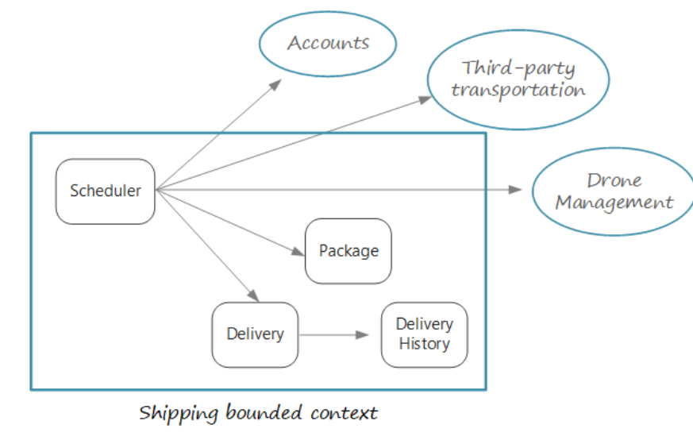

 ****

**소프트웨어의 관심사를 도메인을 바탕으로 분명하게 분리시켜야 한다.**
상호 의존성을 갖기 때문에, 서브도메인으로 나누지 않는다면 변화가 계속됨에 따라 훨씬 **큰 부담**을 지게 된다.

## Next - 데브옵스 패턴

오늘날의 소프트웨어 환경에서는 모든 조직이 모놀리스를 제거하고, 파이프라인을 자동화하며, 전체적인 작업을 감소함으로써 관행을 현대화해야 한다는
압박을 지속적으로 받고 있습니다. 현대화를 위해 대부분의 조직은 데브옵스 관행으로 전환하지만,
이러한 전환 여정을 자체적으로 완료할 수 있는 역량을 보유한 경우는 그리 흔치 않습니다.데브옵스로 원활하게 전환을 해주는 단일한 방법은 존재하지 않습니다. 서로 고립된 상태로 운영되는 조직들을 정렬하려면 문화적, 절차적,
기술적 변화가 함께 이루어져야 합니다. 비즈니스 요구와 목표에 맞는 실용적인 접근 방식을 신중하게 사용하면, 궁극적으로 성공할 수 있습니다.

## **참고링크**

- 콘웨이 법칙 : https://johngrib.github.io/wiki/Conway-s-law/
- MSA VS SOA : http://blog.naver.com/PostView.nhn?blogId=stmshra&logNo=221446919085&parentCategoryNo=&categoryNo=73&viewDate=&isShowPopularPosts=true&from=search
- DDD 바운디드 컨텍스트 : http://redutan.github.io/2018/04/28/IDDD-chapter02
- 마이크로 서비스 경계 식별 : https://docs.microsoft.com/ko-kr/azure/architecture/microservices/model/microservice-boundaries
- 데브옵스 패턴 : https://newrelic.com/kr/resources/ebooks/devops-maturity-phases

출처 : https://wiki.webnori.com/display/devbegin/SOA+VS+MSA
