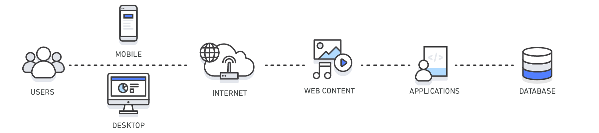
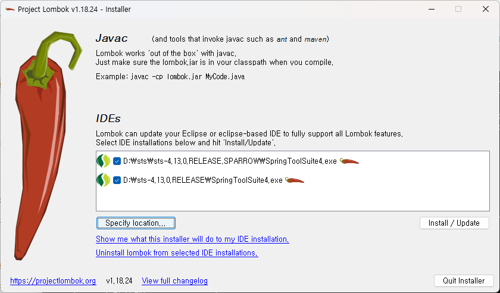
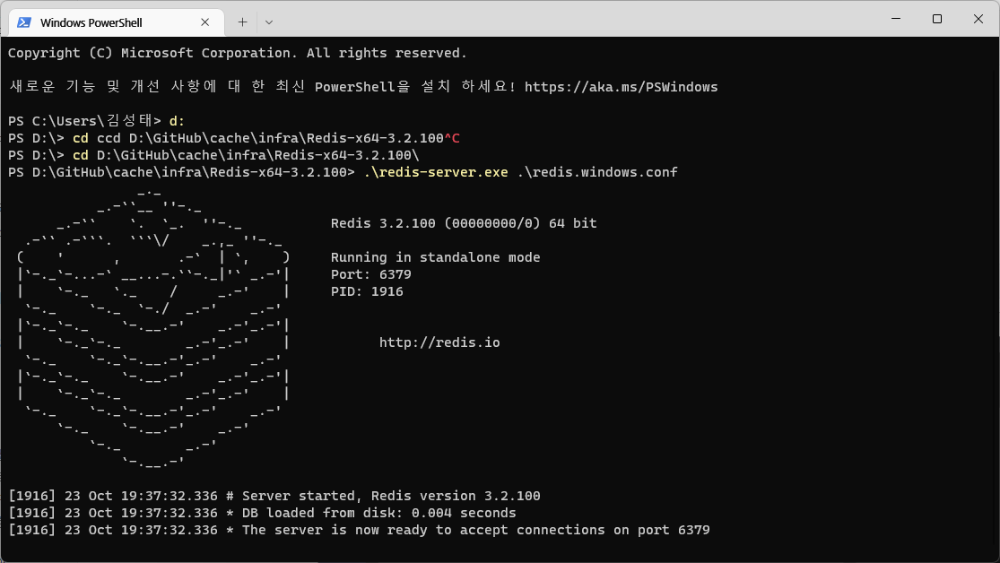
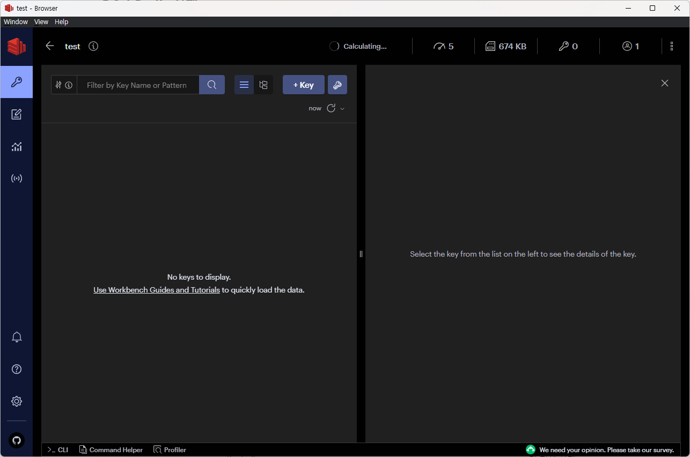
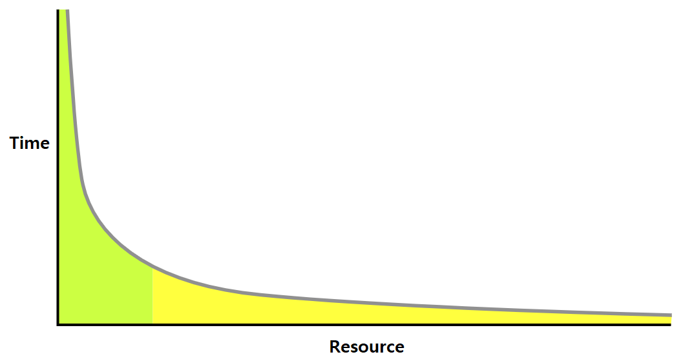
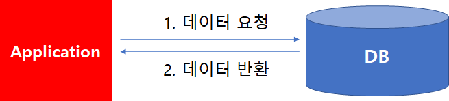
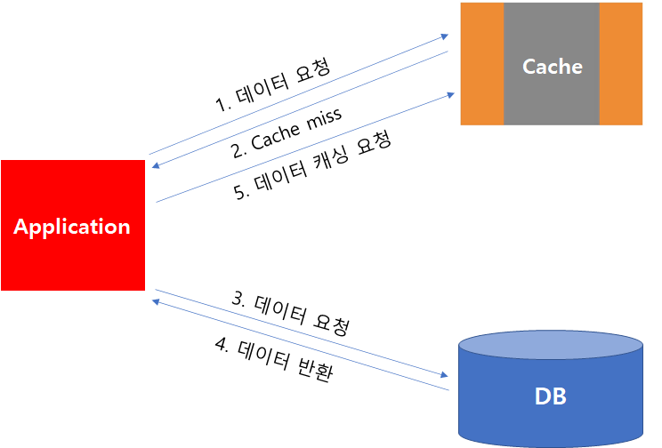
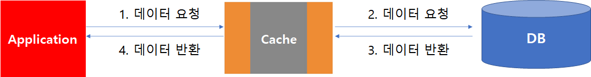
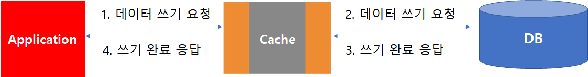
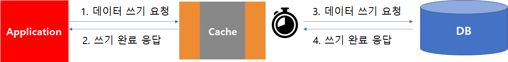

# 1. Caching 이란 ?

- 나중에 요청할 결과를 미리 요청해 두었다가 빠르게 서비스를 제공해주는 역할
  - 컴퓨팅에서 캐시는 일반적으로 일시적인 특징이 있는 데이터 하위 집합을 저장하는 고속 데이터 스토리지 계층.
  - 캐시는 캐시의 접근 시간에 비해 원래 데이터를 접근하는 시간이 오래 걸리는 경우나 값을 다시 계산하는 시간을 절약하고 싶은 경우에 사용.
  - 캐시에 데이터를 미리 복사해 놓으면 계산이나 접근 시간 없이 더 빠른 속도로 데이터에 접근 가능.


# 2. Cache 작동 원리?

- 캐시의 데이터는 일반적으로 RAM(Random Access Memory)과 같이 빠르게 액세스할 수 있는 하드웨어에 저장되며, 소프트웨어 구성 요소와 함께 사용될 수도 있다.
- 캐시의 주요 목적은 더 느린 기본 스토리지 계층에 액세스해야 하는 필요를 줄임으로써 데이터 검색 성능을 높이는 것이다.
- 속도를 위해 용량을 절충하는 캐시는 일반적으로 데이터의 하위 집합을 일시적으로 저장한다. 
  - 전체를 저장하는 데이터베이스와 다르며 캐시에 어떤 데이타를 저장하느냐에 따라 Caching의 성능이 좌우된다.




| **계층**      | **클라이언트 측**                                            | **DNS**             | **웹**                                                       | **앱**                                    | **데이터베이스**                               |
| ------------- | ------------------------------------------------------------ | ------------------- | ------------------------------------------------------------ | ----------------------------------------- | ---------------------------------------------- |
| **사용 사례** | 웹 사이트에서 웹 콘텐츠를 검색하는 속도 가속화(브라우저 또는 디바이스) | 도메인과 IP 간 확인 | 웹 또는 앱 서버에서 웹 콘텐츠를 검색하는 속도를 높이다. 웹 세션 관리(서버 측) | 애플리케이션 성능 및 데이터 액세스 가속화 | 데이터베이스 쿼리 요청과 관련한 지연 시간 단축 |
| **기술**      | HTTP 캐시 헤더, 브라우저                                     | DNS 서버            | HTTP 캐시 헤더, CDN, 역방향 프록시, 웹 액셀러레이터, 키-값 스토어 | 키-값 데이터 스토어, 로컬 캐시            | 데이터베이스 버퍼, 키-값 데이터 스토어         |
| **솔루션**    | 브라우저 Cache Storage                                       | DNS 캐시            | Vanish, nginx 등                                             | Redis, Memcached, Caffeine, EHCache 등    | Memory DB 계열                                 |


# 3. Cache의 이점


### 3.1 애플리케이션 성능 개선

- 메모리는 디스크(마그네틱 또는 SSD)보다 훨씬 속도가 빠르기 때문에 인 메모리 캐시에서 데이터를 읽는 속도가 매우 빠르다.(밀리초 미만).
-  이렇게 훨씬 더 빠른 데이터 액세스는 애플리케이션의 전반적인 성능을 개선한다.


### 3.2 데이터베이스 비용 절감

- 단일 캐시 인스턴스는 수십만 IOPS(초당 입출력 작업)를 제공할 수 있으며, 따라서 수많은 데이터베이스 인스턴스를 대체할 수 있으므로 총 비용이 절감된다.
- 이 같은 비용 절감 이점은 기본 데이터베이스에서 처리량당 요금이 부과되는 경우 특히 큽니다. 이 경우 수십 퍼센트의 비용이 절감될 수 있다.


### 3.3 백엔드의 로드 감소

- Caching은 읽기 로드의 상당 부분을 백엔드 데이터베이스에서 인 메모리 계층으로 리디렉션함으로써 데이터베이스의 로드를 줄이고 로드 시에 성능이 저하되거나 작업 급증 시에 작동이 중단되지 않도록 보호할 수 있다.


### 3.4 예측 가능한 성능

- 모던 애플리케이션의 일반적인 과제 중 하나는 애플리케이션 사용량이 급증하는 시기에 대응하는 것이다. 
- 슈퍼볼이나 선거 기간 동안의 소셜 앱, 블랙 프라이데이 기간 동안의 전자 상거래 웹 사이트 등을 예로 들 수 있다. 
- 데이터베이스에 대한 로드가 증가하면 데이터를 가져오는 데 있어 지연 시간이 길어지고 전반적인 애플리케이션 성능이 예측 불가능해진다. 
- 높은 처리량의 인 메모리 캐시를 활용함으로써 이 문제를 완화할 수 있다.


### 3.5 데이터베이스 핫스팟 제거

- 많은 애플리케이션에서 유명 인사 프로필이나 인기있는 제품과 같은 작은 데이터 하위 집합이 나머지 부분에 비해 더 자주 액세스될 것이다. 

- 이로 인해 데이터베이스에 핫스팟이 발생할 수 있으며 가장 자주 사용되는 데이터의 처리량 요구 사항에 맞추어 데이터베이스 리소스를 초과 프로비저닝해야 할 수 있다. 

- 인 메모리 캐시에 공통 키를 저장하면 가장 자주 액세스하는 데이터에 대해 예측 가능한 빠른 성능을 제공하는 동시에 초과 프로비저닝의 필요성을 줄일 수 있다.

  

### 3.6 읽기 처리량 증가

- 인 메모리 시스템은 지연 시간을 줄일 뿐만 아니라 유사한 디스크 기반 데이터베이스에 비해 훨씬 높은 요청 속도(IOPS)를 제공한다. 
- 분산형 사이드 캐시로 사용되는 단일 인스턴스는 초당 수십만 건의 요청을 처리할 수 있다.


# 4. Cache 유형


## 4.1 데이터베이스 Cache

- 속도와 처리량 면에서, 데이터베이스가 제공하는 성능은 애플리케이션 전체 성능에 무엇보다 크게 영향을 미칠 수 있다. 

- 또한 오늘날 많은 데이터베이스가 비교적 우수한 성능을 제공하지만, 애플리케이션에 더 높은 성능이 요구되는 사용 사례도 많다. 

- 데이터베이스 Caching을 사용하면 처리량을 크게 높이고 백엔드 데이터베이스와 관련한 데이터 검색 지연 시간을 줄일 수 있으므로 애플리케이션의 전반적인 성능이 향상된다. 캐시는 성능을 높이기 위해 애플리케이션에 사용할 수 있는 데이터베이스에 인접한 데이터 액세스 계층 역할을 한다. 

- 데이터베이스 캐시 계층은 관계형 데이터베이스와 NoSQL 데이터베이스를 비롯하여 모든 유형의 데이터베이스의 프런트에 적용할 수 있다. 

  

## 4.2 콘텐츠 전송 네트워크(CDN) 

- 웹 트래픽이 지리적으로 분산되어 있는 경우, 전 세계에 걸쳐 전체 인프라를 복제하는 방식이 현실적으로 불가능할 수도 있고 비용상 효율적이지도 않다. 

- [CDN](https://aws.amazon.com/ko/caching/cdn/)은 글로벌 엣지 로케이션 네트워크를 활용하여 동영상, 웹 페이지, 이미지 등 웹 콘텐츠의 Caching된 복사본을 고객에게 제공하는 기능을 제공한다. 

- 응답 시간을 줄이기 위해 [CDN](https://aws.amazon.com/ko/caching/cdn/)은 고객과 가장 가까운 엣지 로케이션 또는 원래 요청 위치를 활용함으로써 응답 시간을 단축한다. 웹

- 자산이 캐시에서 제공되므로 처리량이 대폭 늘어납니다. 

- 동적 데이터의 경우 많은 수의 [CDN](https://aws.amazon.com/ko/caching/cdn/)을 구성하여 오리진 서버에서 데이터를 검색할 수 있다. 

  

## 4.3 DNS Cache

- 인터넷의 모든 도메인 요청에서는 도메인 이름과 연결된 IP 주소를 확인하기 위해 [DNS](https://aws.amazon.com/route53/what-is-dns/) 캐시 서버를 쿼리한다. 
- DNS Caching은 OS를 비롯한 여러 수준에서 ISP 및 DNS 서버를 통해 실행될 수 있다.


## 4.4 웹 세션 Cache

- HTTP 세션에는 로그인 정보, 쇼핑 카트 목록, 이전에 본 항목 등, 사이트 사용자와 웹 애플리케이션 간에 교환된 사용자 데이터가 포함된다. 
- 웹 사이트에서 우수한 사용자 환경을 제공하는 데 있어서는 사용자의 기본 설정을 기억하고 풍부한 사용자 컨텍스트를 제공함으로써 HTTP 세션을 효과적으로 관리하는 것이 중요하다. 
- 중앙 집중식 세션 관리 데이터 스토어를 활용하는 것이 모든 웹 서버에서 일관된 사용자 환경을 제공하고, 탄력적인 웹 서버 플릿에서 더 나은 세션 내구성을 제공하며, 세션 데이터가 여러 캐시에 복제되는 경우에 더 높은 가용성을 제공하는 등 여러 가지 이유로 모던 애플리케이션 아키텍처에 이상적인 솔루션이라고 할 수 있다.


## 4.5 API Cache

-  API는 일반적으로 HTTP를 통해 액세스할 수 있으며 사용자가 애플리케이션과 상호 작용할 수 있도록 리소스를 노출하는 RESTful 웹 서비스이다. 
- API를 설계할 때 API의 예상 로드, 권한 부여, 버전 변경이 API 소비자에게 미치는 영향, 그리고 무엇보다 API의 사용 편의성 등을 고려하는 것이 중요하다.
- API가 비즈니스 로직을 인스턴스화하고 모든 요청에서 데이터베이스로 백엔드 요청을 보내야 하는 것은 아니다. 
- 경우에 따라서는 API의 Caching된 결과를 제공하는 것이 비용 효율적인 최적의 응답 방식이 될 수 있다. 
- 기반 데이터의 변경 속도에 맞춰 API 응답을 Caching할 수 있는 경우 특히 그렇다. 
- 예를 들어 제품 리스팅 API를 사용자에게 노출했으며 제품 범주는 하루에 한 번만 변경된다고 가정해보겠다. 
- 제품 범주 요청에 대한 응답은 하루 종일 API에 대한 호출이 있을 때마다 동일하므로, 하루 동안 API 응답을 Caching하는 것으로 충분하다. 
- API 응답을 Caching함으로써 애플리케이션 서버 및 데이터베이스를 비롯한 인프라에 가해지는 부담을 줄일 수 있다. 
- 또한 응답 시간이 빨라져 더 높은 성능의 API를 제공할 수 있다.


## 4.6 하이브리드 Cache

- 하이브리드 클라우드 환경에는 클라우드에 상주하면서 온프레미스 데이터베이스에 자주 액세스해야 하는 애플리케이션이 있을 수 있다. 
- VPN 및 Direct Connect를 비롯하여, 클라우드와 온프레미스 환경 간의 연결을 구현하기 위해 사용할 수 있는 다양한 네트워크 토폴로지가 있다. 
- 또한 VPC에서 온프레미스 데이터 센터까지의 지연 시간이 짧더라도, 전체 데이터 검색 성능을 가속화하기 위해 클라우드 환경에서 온프레미스 데이터를 Caching하는 것이 가장 바람직할 수도 있다.


## 4.7 웹 Cache

- 최종 사용자에게 웹 콘텐츠를 제공할 때, 아티팩트를 Caching하여 디스크 읽기와 서버 로드를 배제하면 이미지, html 문서, 동영상 등의 웹 자산 검색과 관련된 대부분의 지연 시간을 크게 줄일 수 있다. 
- 서버와 클라이언트 양쪽 모두에서 다양한 웹 Caching 기술을 활용할 수 있다. 
- 서버 측 웹 Caching은 일반적으로 프런트에 위치한 웹 서버의 웹 응답을 보존하는 웹 프록시를 활용하여 로드 및 대기 시간을 효과적으로 줄인다. 
- 클라이언트 측 웹 Caching에는 이전에 방문한 웹 콘텐츠의 Caching된 버전을 유지하는 브라우저 기반 Caching이 포함될 수 있다. 


## 4.8 일반 Cache

- 메모리에서 데이터에 액세스하면 디스크나 SSD에서 데이터에 액세스하는 것보다 훨씬 빠르기 때문에 캐시의 데이터를 활용하면 많은 이점이 있다.
-  트랜잭션 데이터 지원이나 디스크 기반의 내구성이 필요하지 않은 여러 사용 사례에서 인 메모리 키-값 스토어를 독립 실행형 데이터베이스로 사용하는 방법은 고성능 애플리케이션을 구축하는 데 효과적이다.
-  애플리케이션 속도는 물론, 경제적인 가격으로 제공되는 높은 처리량을 통해 이점을 얻을 수 있다. 제품 그룹, 범주 목록, 프로파일 정보 등의 참조 가능한 데이터는 [일반 캐시](https://aws.amazon.com/ko/caching/general-cache/)의 좋은 사용 사례이다. 


## 4.8 통합 Cache

- 통합 캐시는 오리진 데이터베이스에서 자주 액세스하는 데이터를 자동으로 Caching하는 인 메모리 계층이다.
- 가장 일반적으로, 기반 데이터베이스는 데이터가 캐시에 상주하는 경우 캐시를 사용하여 인바운드 데이터베이스 요청에 대한 응답을 제공한다. 
- 이 경우 요청 지연 시간이 단축되고 데이터베이스 엔진의 CPU 및 메모리 사용률이 감소하여 데이터베이스의 성능이 크게 향상된다. 
- 통합 캐시의 중요한 특성 중 하나는 Caching된 데이터가 데이터베이스 엔진이 디스크에 저장한 데이터와 일치한다는 것이다.

# 5. Redis

**Redis** 오픈소스는 **Re**mote **Di**ctionary **S**erver의 약어로, 전세계적으로 널리 사용되고 있는 In-memory cache 솔루션이다. 
Redis는 다양한 데이터 구조 집합을 제공하고 있다.
 DB-Engines Ranking of Key-value Stores에 따르면, Redis는 현재 가장 인기 있는 key-value store로써, BSD 라이선스를 보유하고 최적화된 C언어 코드로 작성되어 있으며, 다양한 개발 언어를 지원하고 있다. 

## 5.1 Redis 의 주요 특징

| 항목                          | 내용                                                         |
| ----------------------------- | ------------------------------------------------------------ |
| Key-Value 스토어              | Key-Value 를 저장할 수 있는 스토리지를 지원한다.             |
| 컬렉션 지원                   | List, Set, Sorted Set, Hash 등의 자료구조를 지원한다.        |
| Pub/Sub 지원                  | Publish/Subscribe 모델을 지원한다.                           |
| 디스크 저장(Persistent Layer) | 현재 메모리의 상태를 디스크로 저장할 수 있는 기능과 현재까지의 업데이트 내용을 로그로 저장할 수 있는 AOF 기능이 있다. |
| 복제(Replication)             | 다른 노드에서 해당 내용을 복제할 수 있는 Master/Slave 구조를 지원한다. |
| 빠른 속도                     | 이상의 기능을 지원하면서도 초당 100,000 QPS(Queries Per Second) 수준의 높은 성능을 지원한다. |

## 5.2 Redis 사용시 주의할 점

- 메모리는 60%~70%사용 권고한다.
  - 넘을 경우 메모리 Swap 현상 및 데이타 파편화로 인해 지연이 발생한다.
- 삭제 정책 없는 무분별한 Key 생성은 메모리 및 성능 이슈가 발생한다.
  - key는 Redis가 재기동되더라도 없어지지 않는다.
- keys(모든 데이터 조회), flushall(모든 데이터 소거)  사용 시 성능 지연이 생긴다.
  - Redis는 Single Thread로 동작하기 때문에 전체 키를 검색하는 명령어 사용 시 다음 요청이 중단됨
  - Keys 조회 시 Scan 명령어를 사용해하고 운영환경에서는 flushall 명령어를 사용하념 안된다.(ElastiCache에서는 막혀있음)

1. Collection 에 너무 많은 데이타를 쌓으면 성능 지연이 생긴다.

   콜렉션에 데이터 100만건을 넣으면 처리시간이 10초, 1천만건 넣으면 100초씩 걸리는 식으로 늘어나기 때문에 굳이 쓰려면 일단 데이터를 1만건 미만으로 관리해야 한다 고 권고했다.


## 5.3 Redis 메모리 

Redis에서는 Key 와 DataType 을 관리하기 위한 OverHead 가 발생한다. 
Redis는 메모리 기반 캐시 솔루션으로 데이타 적재 시 적절한 DataType을 선택하여 메모리를 효율적으로 사용할 수 있도록 설계한다.

\- Key의 관리 메모리 : 50 바이트

\- String 타입의 관리 메모리 : 30 바이트

\- Lists 타입의 관리 메모리 : 15 바이트

\- Sets 타입의 관리 메모리 : 75 바이트

\- ZSets 타입의 관리 메모리 : 120 바이트

\- Hash 타입의 관리 메모리 : 100 바이트


# 6. 실습 애플리케이션  구성


## 6.1  개요

- cache 활용 실습을 위한 Spring Boot로 구성되어 있는 간단한 애플리케이션이다.
- 해당 애플리케이션은 Cache를 사용하는 않는 일반적인 Backend API 제공을 위한 서비스이다.

- 실습 애플리케이션은 아래의 Git을 통해 다운로드 받을수 있다.

  ```shell
  git clone https://github.com/kirobo77/cache.git
  ```

  

## 6.2  사전 준비 작업


### 6.2.1  주요 라이브러리

| 기술 스택         | 참고                                         |
| ----------------- | -------------------------------------------- |
| Spring Web MVC    | Rest API를 제공하는 Spring 라이브러리        |
| Spring Data JDBC  | Database와 연계하는 Spring Data의 라이브러리 |
| Spring Data Redis | Redis와 연계하는 Spring Data의 라이브러리    |


### 6.2.2  애플리케이션

- Java 17을 기반 Spring Boot(v2.7.2)를 이용한 애플리케이션이다.

| 서비스 명  | API                                        | HTTP  Method | 설명          |
| ---------- | ------------------------------------------ | ------------ | ------------- |
| catalog-ms | http://localhost:50003/catalog-ms/catalogs | GET          | 전체상품 조회 |
| catalog-ms | http://localhost:50003/catalog-ms/catalog  | GET          | 상품조회      |
| catalog-ms | http://localhost:50003/catalog-ms/catalog  | POST         | 상품등록      |

 

## 6.3  사전준비


### 6.3.1. JDK 설치

- 다운로드 : [Eclipse Temulin Java 17](https://projects.eclipse.org/projects/adoptium.temurin/downloads)

```
지난 2021년 9월  14일 JAVA LTS(Long Term Support)인 JDK 17 GA 가 릴리즈되었다.
JDK17은 향후 최대 2029년 9월까지 업데이트가 제공될 예정이다.
참고로 다음 LTS는 JDK21 (2023년 9월)이 될 것으로 예상된다.

2018년 오라클의 정책 변경에 따라 Oracle JDK 바이너리에 적용되던 BCL 라이선스가 바뀌어 이를 사용하려면 라이선스 구독이 필요하다. 따라서 대안으로는 OpenJDK 레퍼런스 소스 코드를 기반으로 제작된 여러 밴더사에서 제공중인 바이너리를 사용할 수 있으며, Azul Platform, Amazon Corretto, ReadHat OpenJDK, AdoptOpenJDK 가 그 대표적인 예이다.

이 중에서 커뮤니티 기반 빌드인 AdoptOpenJDK 가 많이 쓰이는데, AdoptOpenJDK 의 최근 변화에 대해 알아보고 JDK 17 사용 방법을 살펴보고자 한다.
 
AdoptOpenJDK 에서 Eclipse Adoptium 으로 이전

https://blog.adoptopenjdk.net/2021/08/goodbye-adoptopenjdk-hello-adoptium/
2021년 8월 2일 AdoptOpenJDK 가 Eclipse Adoptium 으로 이전되었다.
Eclipse Adoptium 는 최상위 프로젝트(TLP)를 의미하며, Eclipse Temurin 에서 Java SE 런타임을 진행한다.
Eclipse Temurin 은 오라클 SE TCK(Technology Compatibility Kit)와 Eclipse AQAvit 테스트를 통과했다.
Azul Platform Core OpenJDK 지원 구독을 통해 Temurin 에 대한 상용 지원이 가능하다고 한다.
기존의 AdoptOpenJDK 웹사이트와 AdoptOpenJDK API는 당분간 유지할 예정이나, 빠른 시일내에 Eclipse Adoptium 으로 이전할 것을 권장하고 있다.
```


### 6.3.2 STS 설치

- 다운로드 :  https://spring.io/tools
- 

- 실행

  ```
  java -jar spring-tool-suite-4-4.16.0.RELEASE-e4.25.0-win32.win32.x86_64.self-extracting.jar
  ```


### 6.3.3 Lombok 설치

- 다운로드 : https://projectlombok.org/download


- 실행

  ```shell
  java -jar lombok.jar
  ```

- 설치

  


### 6.3.4 Redis 설치

원한할 실습을 위하여 윈도우에서 동작하는 Redis StandAlone 버전을 사용한다.

```
cd D:\GitHub\cache\infra\Redis-x64-3.2.100
.\redis-server.exe .\redis.windows.conf
```

- 윈도우용 Redis의 경우 싱글 서버구조로 테스트용이며 고가용성이나 이중화를 위해 서버환경의 Redis Cluster, Sentinel 서버를 사용해야 한다.




### 6.3.5 Redis 데이터 확인

- redis-cli 를 통해서 커맨드라인으로 Redis 관리가 가능하나 아래 윈도우용 툴을 통해 GUI로 확인 가능

```
D:\GitHub\cache\infra\RedisInsight-v2-win-installer.exe
```




## 6.6 테스트

| 서비스 명       | URI                                                      | 설명                        |
| --------------- | -------------------------------------------------------- | --------------------------- |
| Catalog Service | http://localhost:50003/swagger-ui/index.html             | API 테스트                  |
|                 | http://localhost:50003/h2-console/                       | H2 DB 콘솔                  |
| Redis           | cd D:\cache\infra\Redis-x64-3.2.100<br />.\redis-cli.exe | Redis CLI 어플리케이션 실행 |
|                 | keys *                                                   | 키 전체 조회                |
|                 | get "catalogs::SimpleKey []"                             | 키 값 조회                  |
|                 | del key "catalogs::SimpleKey []"                         | 키 삭제                     |
|                 | flushall                                                 | 키 전체 삭제                |
|                 | info stats                                               | 상태조회                    |


# 7. Caching Data with Spring


## 7.1 개요

- Spring에서 Cache를 사용하기 위한 추상화된 다앙한 기능을 제공하는 라이브러리이다.

  - Annotaion 기반의 Cache 추상화 기능 제공

    - 가장 쓰기 쉬움

  - Repository 기반의 Cache 추상화 기능 제공

    - Database 와 유사한 아답터 제공
  
  - Template 기반의 Cache 추상화 기능 제공
  
    - 정교한 처리가 가능
    
    

## 7.2 의존성 추가

- Spring Boot를 사용하는 경우 *[spring-boot-starter-cache](https://search.maven.org/search?q=g:org.springframework.boot a:spring-boot-starter-cache)* 스타터 패키지를 활용하여 Caching 종속성을 쉽게 추가할 수 있다.

```xml
<dependency>
    <groupId>org.springframework.boot</groupId>
    <artifactId>spring-boot-starter-cache</artifactId>
    <version>2.4.0</version>
</dependency>
<!-- 서드파티(Redis)를 사용하기 위한 스프링부트 스타터 라이브러리-->
<dependency>
	<groupId>org.springframework.boot</groupId>
	<artifactId>spring-boot-starter-data-redis</artifactId>
</dependency>
```

- spring-boot-starter-data-redis  는 spring-data-redis 와 lettuce-core 라이브러리고 구성되어 있다.

```xml
<?xml version="1.0" encoding="UTF-8"?>
<project xsi:schemaLocation="http://maven.apache.org/POM/4.0.0 http://maven.apache.org/xsd/maven-4.0.0.xsd" xmlns="http://maven.apache.org/POM/4.0.0"
    xmlns:xsi="http://www.w3.org/2001/XMLSchema-instance">
  <!-- This module was also published with a richer model, Gradle metadata,  -->
  <!-- which should be used instead. Do not delete the following line which  -->
  <!-- is to indicate to Gradle or any Gradle module metadata file consumer  -->
  <!-- that they should prefer consuming it instead. -->
  <!-- do_not_remove: published-with-gradle-metadata -->
  <modelVersion>4.0.0</modelVersion>
  <groupId>org.springframework.boot</groupId>
  <artifactId>spring-boot-starter-data-redis</artifactId>
  <version>2.7.2</version>
  <name>spring-boot-starter-data-redis</name>
  <description>Starter for using Redis key-value data store with Spring Data Redis and the Lettuce client</description>
  <url>https://spring.io/projects/spring-boot</url>
  <organization>
    <name>Pivotal Software, Inc.</name>
    <url>https://spring.io</url>
  </organization>
  <licenses>
    <license>
      <name>Apache License, Version 2.0</name>
      <url>https://www.apache.org/licenses/LICENSE-2.0</url>
    </license>
  </licenses>
  <developers>
    <developer>
      <name>Pivotal</name>
      <email>info@pivotal.io</email>
      <organization>Pivotal Software, Inc.</organization>
      <organizationUrl>https://www.spring.io</organizationUrl>
    </developer>
  </developers>
  <scm>
    <connection>scm:git:git://github.com/spring-projects/spring-boot.git</connection>
    <developerConnection>scm:git:ssh://git@github.com/spring-projects/spring-boot.git</developerConnection>
    <url>https://github.com/spring-projects/spring-boot</url>
  </scm>
  <issueManagement>
    <system>GitHub</system>
    <url>https://github.com/spring-projects/spring-boot/issues</url>
  </issueManagement>
  <dependencies>
    <dependency>
      <groupId>org.springframework.boot</groupId>
      <artifactId>spring-boot-starter</artifactId>
      <version>2.7.2</version>
      <scope>compile</scope>
    </dependency>
    <dependency>
      <groupId>org.springframework.data</groupId>
      <artifactId>spring-data-redis</artifactId>
      <version>2.7.2</version>
      <scope>compile</scope>
    </dependency>
    <dependency>
      <groupId>io.lettuce</groupId>
      <artifactId>lettuce-core</artifactId>
      <version>6.1.9.RELEASE</version>
      <scope>compile</scope>
    </dependency>
  </dependencies>
</project>

```


## 7.3 Caching 활성화

- Caching을 활성화하기 위해 Spring은 프레임워크에서 다른 구성 수준 기능을 활성화하는 것과 마찬가지로 어노테이션을 사용한다.
- *구성 클래스에 @EnableCaching* 주석을 추가하여 Caching 기능을 활성화할 수 있다.
- Spring Boot에서는 `spring-boot-starter-cache` Artifact를 추가 하여 CacheManager를 구성 할 수 있다.
- 별도의 추가적인 서드파티 모듈이 없는 경우에는 Local Memory에 저장이 가능한 ConcurrentMap기반인 `ConcurrentMapCacheManager`가 Bean으로 자동 생성 된다.
- EHCache, Ceffeine, Redis등의 서드파티 모듈을 추가 하게 되면 `EHCacheCacheManager`,  CaffeineCacheManager, RedisCacheManager를 Bean으로 등록 하여 사용할 수 있다. 
- 별도로 다른 설정 없이도 단순 Memory Cache가 아닌 Cache Server를 대상으로 캐시를 저장 할 수 있도록 지원하고 있다.


### 67.3.1 설정

#### 7.3.1.1 Cache 활성화

```java
package com.example.cloudnative.catalogws;

import org.springframework.boot.SpringApplication;
import org.springframework.boot.autoconfigure.SpringBootApplication;
import org.springframework.cache.annotation.EnableCaching;
import org.springframework.retry.annotation.EnableRetry;

@SpringBootApplication
@EnableCaching //Cache 기능 활성화  
public class CatalogWsApplication {

    public static void main(String[] args) {
        SpringApplication.run(CatalogWsApplication.class, args);
    }
}
```

#### 7.3.1.2 Redis 프로퍼티

- Spring Boot Auto Configuration이 spring-boot-starter-data-redis를 사용하게 되면 디폴트로 자동 세팅되므로 필수가 아니다.

```yaml
  redis:
    lettuce:
      timeout: 10000
      shutdown-timeout: 100
      auto-reconnect: false
      pool:
        max-active: 1   # pool에 할당할수 있는 커넥션 최대수(default:8)
        max-idle: 1     # pool의 idle 커넥션 최대수(default:8)
        min-idle: 0     # pool의 idle 커넥션 최소수(default:0)
    host: localhost  # 
    port: 6379
```

#### 7.3.1.3 Redis 설정

- Spring Boot Auto Configuration이 spring-boot-starter-data-redis를 사용하게 되면 디폴트로 자동 세팅되므로 필수가 아니다.

```java
import static org.springframework.data.redis.serializer.RedisSerializationContext.SerializationPair.fromSerializer;

@Configuration
@RequiredArgsConstructor
public class CacheConfig {

	private final RedisConnectionFactory connectionFactory;

	@Bean
	public RedisCacheManager redisCacheManager() {

		return RedisCacheManager.RedisCacheManagerBuilder.fromConnectionFactory(connectionFactory)
				.cacheDefaults(defaultConfiguration()).withInitialCacheConfigurations(customConfigurationMap()).build();
	}

	private RedisCacheConfiguration defaultConfiguration() {
		return RedisCacheConfiguration.defaultCacheConfig()
				.serializeKeysWith(fromSerializer(new StringRedisSerializer()))
				.serializeValuesWith(fromSerializer(new GenericJackson2JsonRedisSerializer()))
				.entryTtl(Duration.ofMinutes(1));
	}

    //어노테이션방식은 캐쉬이름별 TTL을 설정으로 줄 수 있다.
	private Map<String, RedisCacheConfiguration> customConfigurationMap() {
		Map<String, RedisCacheConfiguration> customConfigurationMap = new HashMap<>();
		customConfigurationMap.put("catalog", defaultConfiguration().entryTtl(Duration.ofSeconds(30L)));
		return customConfigurationMap;
	}
}
```


## 7.4 Annotaion을 통한 Caching 사용

- Caching을 사용하기 위해 어노테이션을 사용하여 Caching 동작을 메서드에 바인딩할 수 있다.


### 7.4.1 KeyGenerator

- Cache의 Key를 생성하는 인터페이스이다. 

- Cache에 사용하는 메서드에 대와 파라미터에 기반하여 key를 생성하기 위해 사용된다.

- 스프링에서는 SimpleKeyGenerator를 기본으로 제공한다.

- 별도의 키생성 패턴을 구현 시 아래  KeyGenerator에 대한 구현체를 작성할 수 있다.

#### 7.4.1.1 실습

- Custom 키 생성기 구현

```java
import java.lang.reflect.Method;
import org.springframework.cache.interceptor.KeyGenerator;
import org.springframework.util.StringUtils;

public class CustomKeyGenerator implements KeyGenerator {

	public Object generate(Object target, Method method, Object... params) {
		return target.getClass().getSimpleName() + "_" + method.getName() + "_"
				+ StringUtils.arrayToDelimitedString(params, "_");
	}
}
```

- 빈 등록
  - CacheConfig 파일에 추가한다.

```java
	@Bean("customKeyGenerator")
	public KeyGenerator keyGenerator() {
		return new CustomKeyGenerator();
	}
```

- 사용

```java
@Cacheable(keyGenerator="customKeyGenerator", value="catalog")
public String getCatalog(String productId) {...}
```


### 7.4.2 @Cacheable

- 메소드에 대한 Caching 동작을 활성화하는 가장 간단한 방법은 *@Cacheable* 로 구분 하고 결과가 저장될 캐시 이름으로 매개변수화한다.

```java
@Cacheable("catalog")
public String getCatalog(String productId) {...}
```

*getCatalog()* 호출 은 실제로 메서드를 호출한 다음 결과를 Caching하기 전에 먼저 캐시 *주소 를 확인한다.*

대부분의 경우 하나의 캐시로 충분하지만 Spring 프레임워크는 매개변수로 전달할 여러 캐시도 지원한다..

```java
@Cacheable({"catalog", "catalog2"})
public String getCatalog(String productId) {...}
```

이 경우 캐시에 필요한 결과가 포함된 경우 결과가 반환되고 메서드가 호출되지 않는다.

#### Optional Element

| **Element**      | **Description**                                              | **Type** |
| ---------------- | ------------------------------------------------------------ | -------- |
| **cacheNames**   | 캐시 이름 (설정 메서드 리턴값이 저장되는)                    | String[] |
| **value**        | cacheName의 alias                                            | String[] |
| **key**          | 동적인 키 값을 사용하는 SpEL 표현식 동일한 cache name을 사용하지만 구분될 필요가 있을 경우 사용되는 값 | String   |
| **condition**    | SpEL 표현식이 참일 경우에만 Caching 적용 - or, and 등 조건식, 논리연산 가능 | String   |
| **unless**       | Caching을 막기 위해 사용되는 SpEL 표현식 condition과 반대로 참일 경우에만 Caching이 적용되지 않음 | String   |
| **cacheManager** | 사용 할 CacheManager 지정 (EHCacheCacheManager, RedisCacheManager 등) | String   |
| **sync**         | 여러 스레드가 동일한 키에 대한 값을 로드하려고 할 경우, 기본 메서드의 호출을 동기화 즉, 캐시 구현체가 Thread safe 하지 않는 경우, 캐시에 동기화를 걸 수 있는 속성 | boolean  |


### 7.4.3 @CacheEvict

- 자주 필요하지 않은 값으로 캐시를 채울 경우 캐시는 상당히 크고 빠르게 증가할 수 있으며 오래되거나 사용되지 않는 데이터를 많이 보유할 수 있다. 
- 이 경우 새로운 값을 캐시에 다시 로드할 수 있도록 @CacheEvict 주석을 사용하여 하나 이상의 모든 값을 제거 할수 가 있다.

```java
@CacheEvict(value="catalog", allEntries=true)
public String getCatalog(String productId) {...}
```

- 여기서 비울 캐시와 함께 *allEntries 추가 매개변수를 사용한다.* 이렇게 하면 캐시 *주소* 의 모든 항목이 지워지고 새 데이터를 위해 준비된다.

#### Optional Element

| **Element**          | **Description**                                              | **Type** |
| -------------------- | ------------------------------------------------------------ | -------- |
| **cacheNames**       | 제거할 캐시 이름                                             | String[] |
| **value**            | cacheName의 Alias                                            | String[] |
| **key**              | 동적인 키 값을 사용하는 SpEL 표현식 동일한 cache name을 사용하지만 구분될 필요가 있을 경우 사용되는 값 | String   |
| **allEntries**       | 캐시 내의 모든 리소스를 삭제할지의 여부                      | boolean  |
| **condition**        | SpEL 표현식이 참일 경우에만 삭제 진행 - or, and 등 조건식, 논리연산 가능 | String   |
| **cacheManager**     | 사용 할 CacheManager 지정 (EHCacheCacheManager, RedisCacheManager 등) | String   |
| **beforeInvocation** | true - 메서드 수행 이전 캐시 리소스 삭제 false - 메서드 수행 후 캐시 리소스 삭제 | boolean  |


### 7.4.4 @CachePut

- *@CacheEvict* 가 오래되고 사용되지 않는 항목을 제거하여 대용량 캐시에서 항목을 조회하는 오버헤드를 줄이는 동안 캐시에서 너무 많은 데이터를 제거하는 것을 방지할 필요성이 있을 경우 *@CachePut* 주석을 사용 하면 메서드 실행을 방해하지 않고 캐시 내용을 업데이트할 수 있다.

```java
@CachePut(value="catalog")
public String getCatalog(String productId) {...}
```

- *@Cacheable* 과 *@CachePut* 의 차이점은 @Cacheable은 *메서드* 실행 을 **건너뛰지** 만 *@CachePut* 은 **실제로 메서드** 를 실행한 다음 그 결과를 캐시에 저장한다는 것이다.

#### Optional Element

| **Element**  | ***\*Description\****                                        | ***\**\*Type\*\**\*** |
| ------------ | ------------------------------------------------------------ | --------------------- |
| cacheName    | 입력할 캐시 이름                                             | String[]              |
| value        | cacheNamed의 Alias                                           | String[]              |
| key          | 동적인 키 값을 사용하는 SpEL 표현식 동일한 cache name을 사용하지만 구분될 필요가 있을 경우 사용되는 값 | String                |
| cacheManager | 사용 할 CacheManager 지정 (EHCacheCacheManager, RedisCacheManager 등) | String                |
| condition    | SpEL 표현식이 참일 경우에만 Caching 적용 - or, and 등 조건식, 논리연산 가능 | String                |
| unless       | Caching을 막기 위해 사용되는 SpEL 표현식 condition과 반대로 참일 경우에만 Caching이 적용되지 않음 | String                |


### 7.4.5 @Caching

- 메서드를 Caching하기 위해 동일한 유형의 여러 어노테이션을 사용할 경우 아래와 같이 사용하는 것은 허용하지 않는다.

```java
@CacheEvict("catalog")
@CacheEvict(value="catalog2", key="#productId")
public String getCatalog(String productId) {...}
```

- 그럴경우 아래와 같이 Caching관련 어노테이션을 그룹화하는 @Caching을 사용해야 한다.

```java
@Caching(evict = { 
@CacheEvict("catalog"), 
@CacheEvict(value="catalog2", key="#productId") })
public String getCatalog(String productId) {...}
```

#### Optional Element

| **Element**  | ***\*Description\****                                        | ***\**\*Type\*\**\*** |
| ------------ | ------------------------------------------------------------ | --------------------- |
| cacheName    | 입력할 캐시 이름                                             | String[]              |
| value        | cacheNamed의 Alias                                           | String[]              |
| key          | 동적인 키 값을 사용하는 SpEL 표현식 동일한 cache name을 사용하지만 구분될 필요가 있을 경우 사용되는 값 | String                |
| cacheManager | 사용 할 CacheManager 지정 (EHCacheCacheManager, RedisCacheManager 등) | String                |
| condition    | SpEL 표현식이 참일 경우에만 Caching 적용 - or, and 등 조건식, 논리연산 가능 | String                |
| unless       | Caching을 막기 위해 사용되는 SpEL 표현식 condition과 반대로 참일 경우에만 Caching이 적용되지 않음 | String                |


### 7.4.6 @CacheConfig

- *@CacheConfig* 주석을 사용하면 캐시 구성의 일부를 클래스 수준의 단일 위치로 간소화할 수 있으므로 **여러** 번 선언할 필요가 없다.

```java
@CacheConfig(cacheNames={"catalog"})
public class CustomerDataService {

    @Cacheable
    public String getCatalog(String productId) {...}
```

####  Optional Element

| **Element**  | ***\*Description\****                                        | ***\**\*Type\*\**\*** |
| ------------ | ------------------------------------------------------------ | --------------------- |
| cacheNames   | 해당 클래스 내 정의된 캐시 작업에서의 default 캐시 이름      | String[]              |
| cacheManager | 사용 할 CacheManager 지정 (EHCacheCacheManager, RedisCacheManager 등) | String                |


### 7.4.7  조건부 Caching

- 경우에 따라 모든 상황에서 메서드에 대해 Caching이 제대로 작동하지 않을 수 있으며 이 경우 조건부 Caching을 활용하여 효과적인 캐쉬를 사용할 수 있다.

```java
@CachePut(value="catalog")
public String getCatalog(String productId) {...}
```

- 조건 매개변수

주석이 활성화될 때 더 많은 제어를 원하면 SpEL 표현식을 사용하고 해당 표현식 평가를 기반으로 결과가 캐시되도록 하는 조건 매개 변수로 *@CachePut 을 매개변수화할 수 있다.*

```java
@CachePut(value="catalog", condition="#productId == 'CATALOG-001'")
public String getCatalog(String productId) {...}
```

- 매개변수가 아닌 경우

*if* 매개변수 를 통한 **입력이 아닌 메소드의 출력을 기반으로** Caching을 제어할 수 있다.

```java
@CachePut(value="catalog", unless="#result == null")
public String getCatalog(String projectId) {...}
```

- 위의 코드는 null 이 Caching 안되도록 사용한 예이다.
- 이러한 종류의 조건부 Caching은 큰 결과를 관리하는 데 매우 효과적이며 모든 작업에 일반 동작을 적용하는 대신 입력 매개 변수를 기반으로 동작을 사용자 지정하는 데 유용하다.


### 7.4.8 장애 처리

- 레디스가 동작하지 않는 동안에는 캐시가 아닌 DB 에서 조회 하도록 fallback 기능이 있어야 한다.
- spring-retry 의 @Retryable 과 @Recover 를 사용하면 된다.
- @Retryable 은 예외 발생시 재시도를 하고, @Recover는 재시도 실패시에 동작하는 어노테이션 이다.

- **설정**

```xml
		<dependency>
			<groupId>org.springframework.retry</groupId>
			<artifactId>spring-retry</artifactId>
		</dependency>
		<dependency>
			<groupId>org.springframework</groupId>
			<artifactId>spring-aspects</artifactId>
		</dependency>
```

- **Retry 활성화**

```java
@SpringBootApplication
@EnableRetry //Retry 활성화
public class CatalogWsApplication {

    public static void main(String[] args) {
        SpringApplication.run(CatalogWsApplication.class, args);
    }

}
```

- **실습**

```java
	@Retryable(maxAttempts = 1)
	@Cacheable(value = "catalog", key = "#productId")
	public CatalogEntity getCatalog(String productId) {
		log.info("Cache Miss = {}", productId);
		CatalogEntity catalogEntity = catalogRepository.findByProductId(productId);
		return catalogEntity;
	}
	
	@Recover
	public CatalogEntity getCatalog(Exception e, String productId) {
		log.info("Fallback Cache = {}", productId);
		CatalogEntity catalogEntity = catalogRepository.findByProductId(productId);
		return catalogEntity;
	}
```


### 7.4.9 CacheManager

- @Cacheable 어노테이션을 사용하여 생성한 캐시를 조회하고 삭제하는 등 로우레벨의 캐시를 활용할 수 있다.

```java
import org.springframework.cache.CacheManager;

	@Autowired
	CacheManager cacheManager;
	
	public void clearAll() {
        cacheManager.getCacheNames().stream().forEach(cacheName -> cacheManager.getCache(cacheName).clear());
	}

	public void clearCacheName(String cacheName) {
		cacheManager.getCache(cacheName).clear();
	}
```

 

## 7.5 Redis Repository을 통한 Caching 사용

- Spring Data Redis 의 Redis Repository 를 이용하면 간단하게 Domain Entity 를 Redis Hash 로 만들 수 있다.

- 트랜잭션을 지원하지 않기 때문에 만약 트랜잭션을 적용하고 싶다면 `RedisTemplate` 을 사용한다.


### 7.5.1 Entity 클래스 생성

```java
import java.util.Date;

import org.springframework.data.annotation.Id;
import org.springframework.data.redis.core.RedisHash;

import lombok.AllArgsConstructor;
import lombok.Builder;
import lombok.Getter;
import lombok.NoArgsConstructor;
import lombok.Setter;
import lombok.ToString;

@Getter
@Setter
@Builder
@AllArgsConstructor
@NoArgsConstructor
@ToString
@RedisHash(value = "catalog", timeToLive = 60L)
public class CatalogDto {

	private long id;

	@Id
	private String productId;

	private String productName;

	private Integer stock;

	private Integer unitPrice;

	private Date createdAt;
	
}
```

- Redis 에 저장할 자료구조인 객체를 정의한다.

- 일반적인 객체 선언 후 @RedisHash를 붙이면 해당 객체를 사용하는 Repository는 Redis를 구현체로 사용한다.

- value : Redis 의 keyspace 값으로 사용된다.

- timeToLive : 만료시간을 seconds 단위로 설정할 수 있니다. 

  - 기본값은 만료시간이 없는 -1L 이다.
  - -2L이면 캐쉬가 만료된 것이다.

- @Id 어노테이션이 붙은 필드가 Redis Key 값이 되며 null 로 세팅하면 랜덤값이 설정된다.

- keyspace 와 합쳐져서 레디스에 저장된 최종 키 값은 keyspace:id 가 된다.

  

### 7.5.2  Repository 클래스 생성

```
@Repository
public interface CatalogCacheRepository extends CrudRepository<CatalogDto, String> {
}

```

- `CrudRepository` 를 상속받는 `Repository` 클래스 추가한다.

- **실습**

```java
@Slf4j
@SpringBootTest
class CatalogWsApplicationTests {

	@Autowired
	private CatalogCacheRepository repostiory;

	@Test
	void test() {
		CatalogDto catalogDto = CatalogDto.builder().productId("CATALOG-006").productName("seoul").stock(10)
				.unitPrice(100).createdAt(new Date()).build();
		// 저장
		repostiory.save(catalogDto);
		// `keyspace:id` 값을 가져옴
	
		log.info("repostiory = {}",repostiory.findById(catalogDto.getProductId()));
		// CatalogDto Entity 의 @RedisHash 에 정의되어 있는 keyspace (catalog) 에 속한 키의 갯수를 구함
		log.info("repostiory.count = {}",repostiory.count());
		// 삭제
		//repostiory.delete(catalogDto);
	}
}

```

- JPA 와 유사하게 사용할 수 있다.
- 여기서는 `id` 값을 따로 설정하지 않아서 랜덤한 키값이 생성된다.
- 저장할때 `save()` 를 사용하고 값을 조회할 때 `findById()` 를 사용하면 된다.


## 7.6 RedisTemplate을 통한 Caching 사용

- `RedisTemplate` 을 사용하면 특정 Entity 뿐만 아니라 여러가지 원하는 타입을 넣을 수 있다.
- `template` 을 선언한 후 원하는 타입에 맞는 `Operations` 을 꺼내서 사용한다.
- DataType 의 상세한 사용법은 아래 사이트를 참고한다.
  - http://redisgate.kr/redis/command/commands.php


### 7.6.1 설정


```java
@Configuration
@RequiredArgsConstructor
public class RedisConfig {

    //고가용성 테스트를 위해 ShareNativeConnection 옵션 끔, 이럴경우 성능저하 일부 발생함
	@Bean
	public RedisConnectionFactory redisConnectionFactory() {
		LettuceConnectionFactory lettuceConnectionFactory = new LettuceConnectionFactory();
		lettuceConnectionFactory.setShareNativeConnection(false);
		return lettuceConnectionFactory;
	}

    //키/밸류 시리얼라이저 지정
	@Bean
	public RedisTemplate<String, Object> redisTemplate() {
		RedisTemplate<String, Object> redisTemplate = new RedisTemplate<>();
		redisTemplate.setConnectionFactory(redisConnectionFactory());
        redisTemplate.setKeySerializer(new StringRedisSerializer());
        redisTemplate.setValueSerializer(new GenericJackson2JsonRedisSerializer());
		return redisTemplate;
	}

```

- `RedisTemplate` 에 `LettuceConnectionFactory` 을 적용해주기 위해 설정해준다.

- Redis는 여러 자료 구조를 가지고 있다. 
- 이런 여러 종류의 자료구조를 대응하기 위해 `RedisTemplate` 는 opsForValue, opsForSet, opsForZSet 등의 메서드를 제공한다. 
- 해당 메서드를 사용하면 각 자료구조에 대해서 쉽게 Serialize 및 Deserialize 할 수 있다.

- 각 메서드에 대한 설명은 아래와 같다.

| 메서드          | 설명                                                    |
| --------------- | ------------------------------------------------------- |
| **opsForValue** | Strings를 쉽게 Serialize / Deserialize 해주는 Interface |
| **opsForList**  | List를 쉽게 Serialize / Deserialize 해주는 Interface    |
| opsForSet       | Set를 쉽게 Serialize / Deserialize 해주는 Interface     |
| opsForZSet      | ZSet를 쉽게 Serialize / Deserialize 해주는 Interface    |
| **opsForHash**  | Hash를 쉽게 Serialize / Deserialize 해주는 Interface    |


### 7.6.2 Strings

- 대부분의 데이터는 문자열로 처리.
- **실습**

```java
    @Autowired
    StringRedisTemplate redisTemplate;

	@Test
	public void testStrings() {
		final String key = "string";

		final ValueOperations<String, String> stringStringValueOperations = redisTemplate.opsForValue();

		stringStringValueOperations.set(key, "1"); // redis set 명령어
		final String result_1 = stringStringValueOperations.get(key); // redis get 명령어

		log.info("result_1 = {}", result_1);

		stringStringValueOperations.increment(key); // redis incr 명령어
		final String result_2 = stringStringValueOperations.get(key);

		log.info("result_2 = {}", result_2);
	}
//result_1 = 1
//result_2 = 2
```


### 7.6.3 List

- 순서를 가진 데이터 구조이다. (Head --- tail)
- Pub-Sub (생산자-소비자) 패턴에서 많이 사용된다.
- **실습**

```java
@Autowired
StringRedisTemplate redisTemplate;

	@Test
	public void testList() {
		final String key = "list";

		final ListOperations<String, String> stringStringListOperations = redisTemplate.opsForList();

		stringStringListOperations.rightPush(key, "H");
		stringStringListOperations.rightPush(key, "e");
		stringStringListOperations.rightPush(key, "l");
		stringStringListOperations.rightPush(key, "l");
		stringStringListOperations.rightPush(key, "o");

		stringStringListOperations.rightPushAll(key, " ", "s", "a", "b", "a");

		final String character_1 = stringStringListOperations.index(key, 1);

		log.info("character_1 = {}", character_1);

		final Long size = stringStringListOperations.size(key);

		log.info("size = {}", size);

		final List<String> ResultRange = stringStringListOperations.range(key, 0, 9);

		log.info("ResultRange = ", Arrays.toString(ResultRange.toArray()));

		log.info("Left Pop = {}", stringStringListOperations.leftPop(key));

		log.info("size = {}", stringStringListOperations.size(key));
	}
//character_1 = e
//size = 10
//ResultRange = [H, e, l, l, o,  , s, a, b, a]
```


### 7.6.4 Set

- 데이터 존재 여부 확인에서 많이 사용한다.
- **실습**

```java
	@Test
	public void testSet() {
		String key = "set";
		SetOperations<String, String> stringStringSetOperations = redisTemplate.opsForSet();

		stringStringSetOperations.add(key, "H");
		stringStringSetOperations.add(key, "e");
		stringStringSetOperations.add(key, "l");
		stringStringSetOperations.add(key, "l");
		stringStringSetOperations.add(key, "o");

		Set<String> sabarada = stringStringSetOperations.members(key);

		log.info("members = ", Arrays.toString(sabarada.toArray()));

		Long size = stringStringSetOperations.size(key);

		log.info("size = {}", size);

		Cursor<String> cursor = stringStringSetOperations.scan(key,
				ScanOptions.scanOptions().match("*").count(3).build());

		while (cursor.hasNext()) {
			log.info("cursor = {}", cursor.next());
		}
	}
//members = [l, e, o, H]
//size = 4
//cursor = l
//cursor = e
//cursor = o
//cursor = H
```


### 7.6.5 Sorted Set

- 정렬된 set 데이터 처리용도로 사용된다.

- 랭킹 처리, 정렬에서 많이 사용된다.
  - score : 요소의 가중치 ⇒ 요소의 정렬 결정 (default 오름차순)
- **실습**

```java
	@Test
	public void testSortedSet() {
		String key = "sortedSet";

		ZSetOperations<String, String> stringStringZSetOperations = redisTemplate.opsForZSet();

		stringStringZSetOperations.add(key, "H", 1);
		stringStringZSetOperations.add(key, "e", 5);
		stringStringZSetOperations.add(key, "l", 10);
		stringStringZSetOperations.add(key, "l", 15);
		stringStringZSetOperations.add(key, "o", 20);

		Set<String> range = stringStringZSetOperations.range(key, 0, 5);

		log.info("range = {}", Arrays.toString(range.toArray()));

		Long size = stringStringZSetOperations.size(key);

		log.info("size = {}", size);

		Set<String> scoreRange = stringStringZSetOperations.rangeByScore(key, 0, 13);

		log.info("scoreRange = {}", Arrays.toString(scoreRange.toArray()));
	}
//range = [H, e, l, o]
//size = 4
//scoreRange = [H, e
```


### 7.6.6 Hash

- 키-값 쌍으로 이뤄진 데이터이다.(자바의 map 구조)
- Key - Value 밑에 sub Key - Value 형식의 데이터 구조이다.
- **실습**

```java
	@Test
	public void testHash() {
		String key = "hash";

		HashOperations<String, Object, Object> stringObjectObjectHashOperations = redisTemplate.opsForHash();

		stringObjectObjectHashOperations.put(key, "Hello", "sabarada");
		stringObjectObjectHashOperations.put(key, "Hello2", "sabarada2");
		stringObjectObjectHashOperations.put(key, "Hello3", "sabarada3");

		Object hello = stringObjectObjectHashOperations.get(key, "Hello");

		log.info("hello = {}", hello);

		Map<Object, Object> entries = stringObjectObjectHashOperations.entries(key);

		log.info("entries = {}", entries.get("Hello2"));

		Long size = stringObjectObjectHashOperations.size(key);

		log.info("size = {}", size);
	}
//hello = sabarada
//entries = sabarada2
//size = 3
```


### 7.6.7 HyperLogLog 

- 주로 매우 큰 데이터의 오차가 1% 이하의 근사치를 구할 때 사용한다.
- 집합의 원소의 개수 추정, 타입은 string으로 저장.
- **실습**

```java
	@Test
	public void testHyperLogLog() {

		HyperLogLogOperations<String, String> hyperLogLogOps = redisTemplate.opsForHyperLogLog();

		String cacheKey = "valueHyperLogLog";

		String[] arr1 = { "1", "2", "2", "3", "4", "5", "5", "5", "5", "6", "7", "7", "7" };

		hyperLogLogOps.add(cacheKey, arr1);

		log.info("count : {}", hyperLogLogOps.size(cacheKey));

	}
//count : 7
```


### 7.6.8 Geo 

- 좌표 정보 처리, 타입은 zset으로 저장.
- **실습**

```java
	@Test
	public void testGeo() {
		GeoOperations<String, String> geoOps = redisTemplate.opsForGeo();
		String[] cities = { "서울", "부산" };
		String[][] gu = { { "강남구", "서초구", "관악구", "동작구", "마포구" }, { "사하구", "해운대구", "영도구", "동래구", "수영구" } };
		Point[][] pointGu = {
				{ new Point(10, -10), new Point(11, -20), new Point(13, 10), new Point(14, 30), new Point(15, 40) },
				{ new Point(-100, 10), new Point(-110, 20), new Point(-130, 80), new Point(-140, 60),
						new Point(-150, 30) } };
		String cacheKey = "valueGeo";

		for (int x = 0; x < cities.length; x++) {
			for (int y = 0; y < 5; y++) {
				geoOps.add(cacheKey, pointGu[x][y], gu[x][y]);
			}
		}

		Distance distance = geoOps.distance(cacheKey, "강남구", "동작구");

		log.info("Distance : {}", distance.getValue());
		
		List<Point> position = geoOps.position(cacheKey, "동작구");
		
		for (Point point : position) {
			log.info("Position : {} x {}", point.getX(), point.getY());
		}
	}
//Distance : 4469610.0767
//Position : 14.000001847743988 x 30.000000249977013
```


## 7.6 Pub/Sub

- Publish / Subscribe 란 특정한 주제(topic)에 대하여 해당 topic을 구독한 모두에게 메시지를 발행하는 통신 방법으로 채널을 구독한 수신자(클라이언트) 모두에게 메세지를 전송 하는것을 의미한다.

- 하나의 Client가 메세지를 Publish하면, 이 Topic에 연결되어 있는 다수의 클라이언트가 메세지를 받을 수 있는 구조이다.

- Kafka의 Partition/Group 개념이 없고 Publish 시점에 Subscribe 하지 않으면 대상 이벤트는 수신 받을 수 없다.
- 또한 동일한 채널에 Subscribe 되어 있으면 동일한 이벤트를 수신받는다.(브로드캐스팅 구조)
- 따라서 Redis를 이용한 Pub/Sub 구성 시 에는 비지니스에 맞는지 검토가 필요하다.


### 7.6.1 설정

```java
@Configuration
@RequiredArgsConstructor
public class RedisConfig {
    
    private final CatalogRepository catalogRepository;
    
    @Bean
	public RedisConnectionFactory redisConnectionFactory() {
		LettuceConnectionFactory lettuceConnectionFactory = new LettuceConnectionFactory();
		lettuceConnectionFactory.setShareNativeConnection(false);
		return lettuceConnectionFactory;
	}
    
   //리스너에 구독자 등록
	@Bean
	MessageListenerAdapter messageListenerAdapter() {
		return new MessageListenerAdapter(new RedisSubscriber(catalogRepository));
	}
	
    //리스너에 토픽 등록
	@Bean
	RedisMessageListenerContainer redisContainer() {
		RedisMessageListenerContainer container = new RedisMessageListenerContainer();
		container.setConnectionFactory(redisConnectionFactory());
		container.addMessageListener(messageListenerAdapter(), topic());
		return container;
	}

    //"catalog" 토픽 채널 생성
	@Bean
	ChannelTopic topic() {
		return new ChannelTopic("Catalog");
	}

}
```

- topic() : redis에서 pub/sub할 채널을 지정해 준다.


### 7.6.2 Subscriber 

```java
import org.springframework.data.redis.connection.Message;
import org.springframework.data.redis.connection.MessageListener;
import org.springframework.data.redis.serializer.GenericJackson2JsonRedisSerializer;
import org.springframework.stereotype.Service;

import com.example.cloudnative.catalogws.entity.CatalogEntity;
import com.example.cloudnative.catalogws.repository.CatalogRepository;

import lombok.RequiredArgsConstructor;
import lombok.extern.slf4j.Slf4j;

@Slf4j
@Service
@RequiredArgsConstructor
public class RedisSubscriber implements MessageListener {

	private final CatalogRepository catalogRepository;

	@Override
	public void onMessage(Message message, byte[] pattern) {
		log.info("Message received = {}", message.toString());
		ObjectMapper mapper = new ObjectMapper();
		CatalogEntity catalogEntity;
		try {
			catalogEntity = mapper.readValue(message.toString(), CatalogEntity.class);
			log.info("catalogEntity =  {}", catalogEntity);
			catalogRepository.save(catalogEntity);
		} catch (JsonProcessingException e) {
			e.printStackTrace();
		}
	}
}

```

- MessageListener를 구현한 서비스 클래스이다.
- 메시지를 subscribe했을 때 수행할 onMessage() 메서드를 오버라이드 한다.

- GenericJackson2JsonRedisSerializer를 사용해서 JSON을 파싱해서 자바 객체(CatalogEntity.Class)로 바꿔준다

- 메시지를 DB에 저장하거나 다른 용도로 활용 한다.


### 7.6.3 Publisher 

```java
@Service
@RequiredArgsConstructor
public class RedisPubService {
   private final StringRedisTemplate redisTemplate;

	public CatalogEntity setCatalog(CatalogEntity catalogEntity) {
		ObjectMapper mapper = new ObjectMapper();
		String catalogJson = mapper.writeValueAsString(catalogEntity);
		redisTemplate.convertAndSend("Catalog", catalogJson);
		return catalogEntity;
	}
}
```

- 해당 채널로 메시지를 Pub하는 Service이다.

- Config에서 설정해준 redisTemplate.converAndSend()메서드를 사용하여 해당 채널에 이벤트를 Publishing 한다.


### 7.6.4 RedisTemplate 유틸

- RedisTemplate를 쉽게 사용할 수 있는 제네릭 기반의 클래스이다.

- 해당 클래스를 서비스단에 인젝션하여 사용한다.

  > RedisOperator<CatalogEntity> redisOperator;

```java
import java.util.List;
import java.util.concurrent.TimeUnit;

import javax.annotation.Resource;

import org.springframework.beans.factory.annotation.Autowired;
import org.springframework.beans.factory.annotation.Qualifier;
import org.springframework.data.redis.core.RedisCallback;
import org.springframework.data.redis.core.RedisTemplate;
import org.springframework.data.redis.core.ValueOperations;
import org.springframework.stereotype.Repository;

import lombok.extern.slf4j.Slf4j;

@Repository
@Slf4j
public class RedisOperator<T> {

    @Autowired
    @Qualifier("redisTemplate")
    private RedisTemplate<String, T> redisTemplate;

    @Resource(name = "redisTemplate")
	private ValueOperations<String, T> valueOps;
	
	@Resource(name = "redisTemplate")
	private ValueOperations<String, List<T>> valueOpsList;

	public RedisOperator(){		
	}
    public T getValue(String key) {
		try {
			log.debug("RedisOperator getValue --- key: {}", key);
			return  valueOps.get(key);
			
		} catch (Exception e) {
			log.error("RedisOperator getValue error : {} " , e.getMessage());
			return null;
		}
	}
    public List<T> getListValue(String key) {
		try {
			log.debug("RedisOperator getListValue --- key: {}", key);
			return valueOpsList.get(key);
		} catch (Exception e) {
			log.error("RedisOperator getListValue error : {}", e.getMessage());
			return null;
		}
	}


    public void set(String key, T value, long timeout, TimeUnit timeUnit) {
        try {
            valueOps.set(key, value, timeout,  timeUnit);
			 
			log.debug("RedisOperator set --- key:{}", key);
		} catch (Exception e) {
			log.error("RedisOperator set  error : {}", e.getMessage());
		}
    }

    public void setList(String key, List<T> list, long timeout, TimeUnit timeUnit){
		try {
			valueOpsList.set(key, list, timeout, timeUnit);
            log.debug("RedisOperator setList --- key: {}", key);
		} catch (Exception e) {
			log.error("RedisOperator setList  error: {}", e.getMessage());
		}
	}

    public void delete(String key) {
		try {
			redisTemplate.delete(key);
            log.debug("RedisOperator delete --- key: {}", key);
		} catch (Exception e) {
			log.error("RedisOperator delete  error: {}",  e.getMessage());
		}
	}

	public Iterable<byte[]> getRedisTemplate(RedisCallback<Iterable<byte[]>> redisCallback) {
		return (Iterable<byte[]>) redisTemplate.execute((RedisCallback<T>) redisCallback);
	}

}
```


# 8. Caching 전략


## 8.1 Local Cache 

- Local 장비 내에서만 사용되는 캐시로, Local 장비의 Resource를 이용한다.
  - Local에서만 작동하기 때문에 **속도가 빠르다**.
  - Local에서만 작동하기 때문에 다른 서버와 데이터 공유가 어렵다.
  - EhCache, Caffeine , ConcurrentMap 등이 있으며 **K,V 구조만 지원**한다.

> **Monolithic Architecture 환경의 경우 여러 서버간 캐쉬 데이타의 공유가 필요없을 경우에 사용**
>
> **Local Cache 사용 시 개별 인스턴스의 메모리 관리 잘 해야 함.**


##  8.2 Global Cache

- 여러 서버에서 Cache Server에 접근하여 사용하는 캐시로 분산된 서버에서 데이터를 저장하고 조회할 수 있다.
  - 네트워크를 통해 데이터를 가져오므로, **Local Cache에 비해 상대적으로 느리다**.
  - 별도의 Cache서버를 이용하기 때문에 서버 간의 데이터 공유가 쉽다.
  - Redis, ElastiCache,  Memcached 등이 있고 Collection 등 **다양한 자료구조를 지원**한다.

> **Micro Service Architecture 환경에서 다수의 서비스간 캐쉬 데이타 공유가 필요할 경우 사용**.
>
> **Redis에서 제공하는 Collection을 잘 활용할 경우 성능 및 개발 생산성을 향상 시킬 수 있다.**
>
> 애플리케이션의 데이타 Caching 시에는 Redis/ElastiCache, DB 데이타의 Caching 시에는 Memcached를 사용하면 된다.
>
> 


## 8.3 Cache Hit

### 8.3.1 Hit Ratio





> 위 그림은 파레토 법칙을 표현한다.(반대로 롱테일의 법칙도 있다.)
>
> 시스템 리소스 20%가 전체 시간의 80% 정도를 소요함을 의미한다.
>
> 캐시 대상을 선정할 때에는 캐시 오브젝트가 얼마나 자주 사용하는지, 적용시 전체적인 성능을 대폭 개선할 수 있는지 등을 따져야 한다.

- Cache 용어

  - **cache hit**

    - 참조하려는 데이터가 캐시에 존재할 때 cache hit라 함

  - **cache miss**

    - 참조하려는 데이터가 캐시에 존재 하지 않을 때 cache miss라 함

  - **cache hit ratio**(캐시 히트율)

    ```
    (cache hit 횟수)/(전체참조횟수) = (cache hit 횟수)/(cache hit 횟수 + cache miss 횟수)
    ```

- 캐시 히트율이 현저히 낮다면 그 의미는 **캐시된 데이터를 제대로 찾지 못하고 있다** 는 뜻이며 그만큼 디스크에서 데이터를 읽어오는 비율이 높다는 것을 의미한다.
  
- 디스크에서 데이터를 읽어올 경우, I/O가 많이 발생하기 때문에 그만큼 성능에 큰 영향이 끼치게 된다.
  
- 캐시 히트율이 높다는 것은 데이터베이스에서 읽어오는 비율보다 메모리에 캐시된 데이터를 읽어오는 비율이 높다는 의미이기 때문에 효율적으로 캐시를 사용하고 있는것으로 판단할 수 있다.

> Redis 의 info stats 명령어를 통해  hit/miss 건수 를 확인 할 수 있다.


### 8.3.2 고려할 점

- 캐시가 효율적으로 동작하기 위해선 데이터가 다음과 같은 특징을 가져야 효과적인 활용이 가능하다.
  - 자주 조회되는 데이타.(데이타베이스의 부하를 극적으로 줄여준다.)
  - 수정/삭제가 잘 발생하지 않는 데이타.(수정이 발생할 경우 캐시데이터 일관성 처리 작업이 필요하다.)
  - 데이터의 결과값이 일정한 데이타.(키 관리가 용이하다.)
  - 연산이 무거움.(애플리케이션의 성능향상을 극적으로 높여준다.)

- 저장된 Cache 데이터에 대해 캐시 만료(TTL) 및 삭제(Evict) 정책을 적절하게 설정하고 오랜 시간이 지난 데이터는 Cache에서 삭제될 수 있도록 운영해야 한다.
- 누적된 Cache 데이타는 cache 서버에 파편화 및 메모리 부족현상으로 가용성에 문제가 발생한다.
  - Cache 만료/삭제 정책에 대해서는 비지니스 요건에 따라 달라지므로 정답은 없다.


## 8.4 읽기 전략

읽기 전략은 읽기 요청 시 어떤 시점에 캐시를 조회하느냐에 따라 전략이 달라진다.

> ### Cache-through
>
> 캐시에 데이터가 없는 상황에서 Miss가 발생했을 때, Application이 아닌 캐시제공자가 데이터를 처리한 다음 애플리케이션에게 데이터를 전달하는 방법. 
>
> 동기화의 책임이 애플리케이션에 있었다면, 해당 패턴은 캐시 제공자에게 책임이 위임되는 형태이다.
>
> 해당 솔루션은 Redis Enterprise, Amazon DAX(Amazon DynamoDB Accelerator),  Memcached등이 있다.


### 8.4.1 No-Caching

- 캐시없이 Application에서 직접 DB로 요청하는 방식이다.

- 별도 캐시한 내역이 없으므로 매번 DB와의 통신이 필요하며, 부하가 유발되는 SQL이 지속 수행되면 DB I/O에 영향을 줍니다.




###  8.4.2 Cache-aside(Lazy-Loding)

- 애플리케이션에서 가장 일반적으로 사용되는 캐시전략.

- 주로 읽기 작업이 많은 애플리케이션에 적합함.

- Cache Hit 의 경우 DB 를 확인하지 않기 때문에 **캐시가 최신 데이터를 가지고 있는지 (동기화) 가 중요하다.**

- 캐시가 분리되어 있기 때문에 원하는 데이터만 별도로 구성하여 캐시에 저장할 수 있고 **캐시에 장애가 발생해도 DB 에서 데이터를 가져오는 데 문제가 없다.**

- 캐시에 장애가 발생했다는 뜻은 DB 로 직접 오는 요청이 많아져서 전체적인 장애로 이어질 수 있다. 





1.  캐시에 데이터가 있는지 확인

2. 데이터가 존재하면 (Cache Hit) 해당 캐시 데이터를 반환
3. 데이터가 존재하지 않으면 (Cache Miss) **애플리케이션에서 DB 에 데이터 요청** 후 캐시에 저장하고 데이터를 반환

- **실습**

```java
import org.springframework.cache.annotation.CacheEvict;
import org.springframework.cache.annotation.Cacheable;
import org.springframework.stereotype.Service;
import com.example.cloudnative.catalogws.entity.CatalogEntity;
import com.example.cloudnative.catalogws.repository.CatalogRepository;
import com.example.cloudnative.catalogws.util.ThreadUtil;
import com.fasterxml.jackson.core.JsonProcessingException;

import lombok.RequiredArgsConstructor;
import lombok.extern.slf4j.Slf4j;

@Service
@Slf4j
@RequiredArgsConstructor
public class CacheAsideWriteAroundService {

	private final CatalogRepository catalogRepository;

	@Cacheable(cacheNames = "catalogs", key = "'all'")
	public Iterable<CatalogEntity> getAllCatalogs() {
		log.info("Cache Miss");
		ThreadUtil.sleep();
		return catalogRepository.findAll();
	}

	@CacheEvict(cacheNames = "catalogs", allEntries = true)
	public CatalogEntity createCatalog(CatalogEntity catalogEntity) throws JsonProcessingException {
		log.info("Cache Evict catalogs = {}", catalogEntity);
		catalogRepository.save(catalogEntity);
		return catalogEntity;
	}

	@Cacheable(cacheNames = "catalog", key = "#productId")
	public CatalogEntity getCatalog(String productId) {
		log.info("Cache Miss = {}", productId);
		ThreadUtil.sleep();
		CatalogEntity catalogEntity = catalogRepository.findByProductId(productId);
		return catalogEntity;
	}
}
```


### 8.4.3 Read-through

- Cache Aside 와 비슷하지만 데이터 동기화를 라이브러리 또는 캐시 제공자에게 위임하는 방식이라는 차이점이 있다.

- 마찬가지로 읽기 작업이 많은 경우에 적합하며 두 방법 다 데이터를 처음 읽는 경우에는 Cache Miss 가 발생해서 느리다는 특징이 있다.

- Cache Aside 와는 다르게 캐시에 의존성이 높기 때문에 캐시에 장애가 발생한 경우 바로 전체 장애로 이어진다

- 이를 방지하기 위해 Cache Cluster 등 가용성 높은 시스템을 구축하여야 한다.



1. 캐시에 데이터 요청
2. 캐시는 데이터가 있으면 (Cache Hit) 바로 반환
3. 데이터가 없다면 (Cache Miss) **캐시가 DB 에서 데이터를 조회**한 후에 캐시에 저장 후 반환

### 8.4.4 Refresh Ahead

- 자주 사용되는 데이터를 캐시 만료 전에 미리 TTL (Expire time) 을 갱신한다.
- 캐시 미스 발생을 최소화 할 수 있지만 Warm Up 작업과 마찬가지로 자주 사용되는 데이터를 잘 예측해야 한다.

- **실습**

```java
import java.util.concurrent.TimeUnit;

import org.springframework.data.redis.core.RedisTemplate;
import org.springframework.stereotype.Service;

import lombok.RequiredArgsConstructor;
import lombok.extern.slf4j.Slf4j;

@Service
@Slf4j
@RequiredArgsConstructor
public class RefreshAheadService{

	RedisTemplate<String, Object> redisTemplate;
	
	public void refreshAhead(String productId) {
		log.info("refreshAhead = {}", productId);
        //캐시 만료시간 갱신
		redisTemplate.expire(String.format("catalog::%s", productId), 1, TimeUnit.MINUTES);
	}

}

```

- 갱신을 위한 API 작성해서 호출해서 대상 키의 TTL이 연장되었는지 확인해본다.

```java
    @GetMapping(value="/refresh-ahead/{productId}")
    public ResponseEntity<Void> refreshAhead(@PathVariable("productId") String productId)  {
    	log.info("refreshAhead = {}", productId);
    	
    	refreshAhead.refreshAhead(productId);
                
        return ResponseEntity.status(HttpStatus.OK).body(null);
    }

```


### 8.4.5 읽기 캐시에서 발생 가능한 장애

####  8.4.4.1 Thundering Herd

- 캐시 읽기 전략에서는 공통적으로 캐시 확인 -> DB 확인 순서로 이어지는데 이 과정에서 캐시에 데이터가 있으며 DB 확인을 생략하는 것으로 성능을 향상시킨다.

- 하지만 서비스를 이제 막 오픈해서 **캐시가 비어있는 경우에는 들어오는 요청이 전부 Cache Miss 가 발생하고 DB 조회 후 캐시를 갱신**하느라 장애가 발생할 수 있다.

- **해결방안**
  - 캐시에 데이터를 미리 세팅해두는 Cache Warm up 작업을 하거나 첫 요청이 캐시 갱신될 때까지 기다린 후에 이후 요청은 전부 캐시에서 반환하게 할 수 있다.
  - Cache Warm up 작업을 할 때 어떤 데이터를 넣느냐에 따라 마찬가지로 Cache Miss 가 발생할 수 있기 때문에 자주 들어올만한 데이터의 예측이 중요하다.

- **실습**

```java
import org.springframework.boot.context.event.ApplicationReadyEvent;
import org.springframework.context.ApplicationListener;
import org.springframework.stereotype.Service;

import lombok.RequiredArgsConstructor;
import lombok.extern.slf4j.Slf4j;

@Service
@Slf4j
@RequiredArgsConstructor
public class ThunderingHerdServcie implements ApplicationListener<ApplicationReadyEvent> {

	private final CacheAsideWriteAroundService cacheAsideWriteAround;

	@Override
	public void onApplicationEvent(ApplicationReadyEvent event) {
		log.info("Cache Load Service = {}",cacheAsideWriteAround.getAllCatalogs());
	}
}
```


#### 8.4.4.2 Cache Stampede

- Cache Stampede 란 캐시가 만료될 때, 대용량 트래픽의 경우 캐시 miss 가 여러번 발생할 수 있다..
- 여러 요청에 대해 cache miss 가 발생하면 각 request 는 DB 를 조회해서 데이터를 읽어와 캐시에 여러 번 쓰게 된다.
- cache miss 와 cache write 가 여러번 발생해서 성능에 영향을 주는 것이 Cache Stampede 이다.

- **해결방안**
  
- PER(Probablistic Early Recomputation) 알고리즘을 도입.
  
  - PER 이란 TTL (만료시간) 이후 캐시를 갱신할 것인지에 대한 알고리즘이다.
  
  > Redis는 자기가 지니고 있는 key 중 랜덤으로 20개의 key를 테스트해서 20개의 key중 TTL이 다한 key를 expire한다.
  >
  > 만약 전체의 25%가 넘는다면 Redis는 다시 자기가 지니고 있는 Key중 랜덤으로 20개의 Key를 고르게 된다.
  >
  > 넘지 않는다면 그대로 20개를 다시 확인한다. 이 과정을 끊임없이 반복한다.


#### 8.4.4.3 Hot Key

- hot key 란 하나의 키에 대한 빈번한 접근을 말한다.
- 대용량 트래픽에서 hot key 에 대한 대응방안이 안돼있다면 성능 문제가 발생할 수 있다.

- **해결방안**
  - 서버 증설
    - 서버가 죽었을 때 failover 나 서버를 scale out 경우 등 고가용성을 위한 추가적인 관리요소가 발생한다.

  - 복제본 생성 
    - test 라는 hot-key 키가 있다면 앞에 prefix 를 붙이고 저장한 후 해당 키에 접근할 때는 prefix 를 랜덤으로 붙여 조회한다.

  - 압축
    - 데이터를 저장할 때, 용량이 크다면 성능 저하가 발생한다.
    - 이를 해결하기 위해 압축을 할 수 있다.

- **실습**

```java
import org.springframework.cache.annotation.CacheEvict;
import org.springframework.cache.annotation.Cacheable;
import org.springframework.stereotype.Service;

import com.example.cloudnative.catalogws.entity.CatalogEntity;
import com.example.cloudnative.catalogws.repository.CatalogRepository;
import com.fasterxml.jackson.core.JsonProcessingException;

import lombok.RequiredArgsConstructor;
import lombok.extern.slf4j.Slf4j;

@Service
@Slf4j
@RequiredArgsConstructor
public class HotKeyService{

	private final CatalogRepository catalogRepository;
	
	@Cacheable(value = "catalogs")
	public Iterable<CatalogEntity> getAllCatalogs() {
		log.info("Cache Miss");
		return catalogRepository.findAll();
	}

	@CacheEvict(value = "catalogs", allEntries = true)
	public CatalogEntity createCatalog(CatalogEntity catalogEntity) throws JsonProcessingException {
		log.info("createCatalog");
		catalogRepository.save(catalogEntity);
		return catalogEntity;
	}

	@Cacheable(value = {"catalog:1","catalog:2","catalog:3"}, key = "#productId")
	public CatalogEntity getCatalog(String productId) {
		log.info("Cache Miss = {}", productId);
		CatalogEntity catalogEntity = catalogRepository.findByProductId(productId);
		return catalogEntity;
	}
}
```


## 8.5 쓰기 전략

- 쓰기패턴은 쓰기 요청 시 어떤 시점에 캐시 갱신을 하는지에 따라 다음과 같이 세분화할 수 있다.
  - Write Around: 캐시를 갱신하지 않음
  - Write Through: 캐시를 바로 갱신
  - Write Back: 캐시를 모아서 나중에 갱신


### 8.5.1 Write Around

- 데이타 쓰기 요청 시 DB에만 반영하고 캐시는 사용하지 않는다.

- 수정사항은 DB 에만 반영하고 캐시는 그대로 두기 때문에 Cache Miss 가 발생하기 전까지는 캐시 갱신이 발생하지 않는다.

- Cache 가 갱신된지 얼마 안된 경우에는 **캐시 Expire 처리 되기 전까지 계속 DB 와 다른 데이터를 갖고 있다는 단점**이 있다.

- 업데이트 이후 바로 조회되지 않을거라는 확신이 있다면 캐시를 초기화하여 Cache Miss 를 유도하는 방법으로 보완할 수 있다.

1. 데이터 추가/업데이트 요청이 들어오면 DB 에만 데이터를 반영
2. 쓰기 작업에서 캐시는 건들지 않고 읽기 작업 시 Cache Miss 가 발생하면 업데이트 됨


### 8.5.2 Write-through

- Read Through 와 마찬가지로 DB 동기화 작업을 캐시에게 위임한다.

- 동기화까지 완료한 후에 데이터를 반환하기 때문에 **캐시를 항상 최신 상태로 유지할 수 있다**는 장점이 있다.

- 캐시 및 DB 를 동기식으로 갱신한 후에 최종 데이터 반환이 발생하기 때문에 전반적으로 느려질 수 있다.

- 새로운 데이터를 캐시에 미리 넣어두기 때문에 읽기 성능을 향상시킬 수 있지만 **이후에 읽히지 않을 데이터도 넣어두는 리소스 낭비**가 발생할 수 있다.



1. 캐시에 데이터를 추가하거나 업데이트

2. 캐시가 DB 에 동기식으로 데이터 갱신

3. 캐시 데이터를 반환

   

### 8.5.3 Write-behind

- 캐시와 DB 동기화를 비동기로 하는 방법이며 동기화 과정이 생략되기 때문에 **쓰기 작업이 많은 경우에 적합**하다.

- 캐시에서 일정 시간 또는 일정량의 **데이터를 모아놓았다가 한번에 DB 에 업데이트** 하기 때문에 쓰기 비용을 절약할 수 있다.

- 다른 캐시 전략에 비해 구현하기 복잡한 편이며 캐시에서 DB 로 데이터를 업데이트 하기 전에 장애가 발생하면 데이터가 유실될 수 있다.



1. 캐시에 데이터를 추가하거나 업데이트
2. 캐시 데이터 반환
3. 캐시에 있던 데이터는 이후에 별도 서비스 (이벤트 큐 등) 를 통해 DB 에 업데이트

- **실습**
  - Redis Pub/Sub을 응용한 DB 업데이트 처리로 6.6.2 Subscriber 예제를 참고한다.

```
import org.springframework.cache.annotation.Cacheable;
import org.springframework.data.redis.core.RedisTemplate;
import org.springframework.stereotype.Service;

import com.example.cloudnative.catalogws.entity.CatalogEntity;
import com.example.cloudnative.catalogws.repository.CatalogRepository;
import com.fasterxml.jackson.core.JsonProcessingException;

import lombok.RequiredArgsConstructor;
import lombok.extern.slf4j.Slf4j;

@Service
@Slf4j
@RequiredArgsConstructor
public class WriteBehindService{

	private final RedisTemplate<String, Object> redisTemplate;
	private final CatalogRepository repository;
	
	@Cacheable(value = "catalogs")
	public Iterable<CatalogEntity> getAllCatalogs() {
		log.info("Cache Miss");
		return repository.findAll();
	}

	@Cacheable(value = "catalog", key = "#catalogCacheDto.productId")
	public CatalogEntity createCatalog(CatalogEntity catalogEntity) throws JsonProcessingException {
		log.info("Cache Save = {}", catalogEntity);
		redisTemplate.convertAndSend("Catalog", catalogEntity);
		return catalogEntity;
	}

	@Cacheable(value = "catalog", key = "#productId")
	public CatalogEntity getCatalog(String productId) {
		log.info("Cache Miss = {}", productId);
		CatalogEntity catalogEntity = repository.findByProductId(productId);
		return catalogEntity;
	}
	
}

```


[출처]

https://aws.amazon.com/ko/caching/

https://spring.io/projects/spring-data-redis

https://daddyprogrammer.org/post/2241/redis-spring-data-redis-cluster-structure-comands/