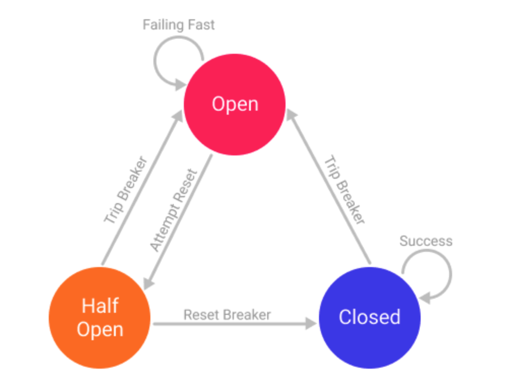
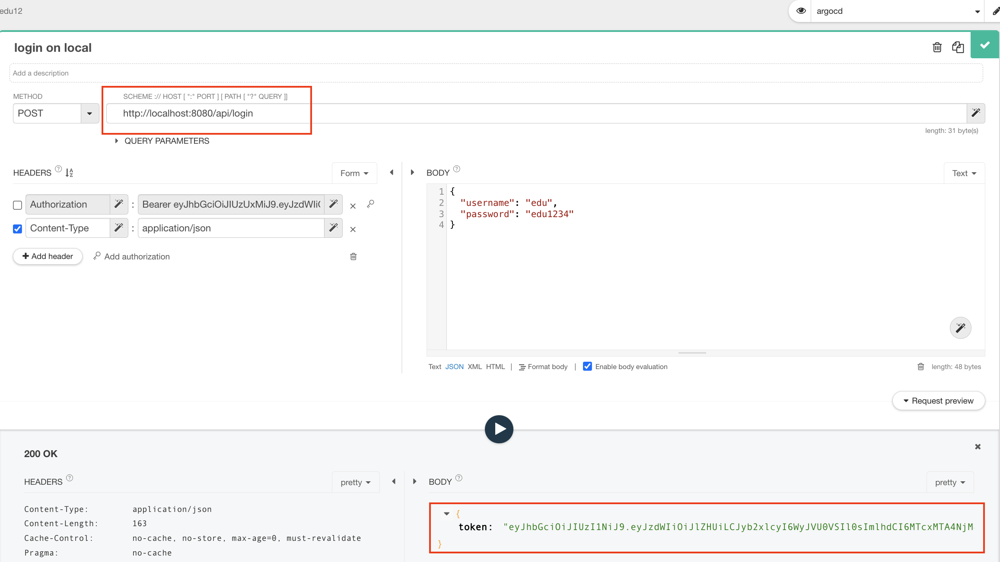
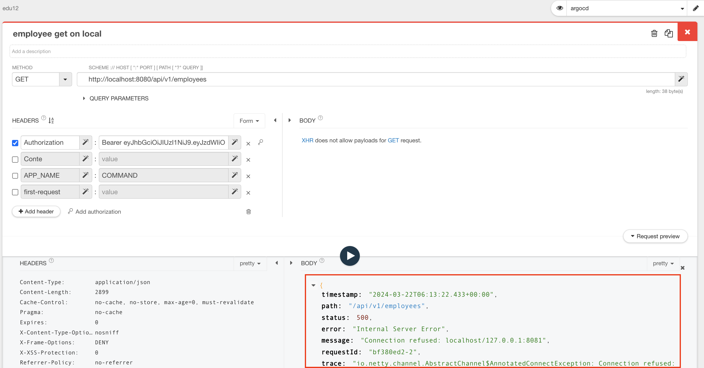
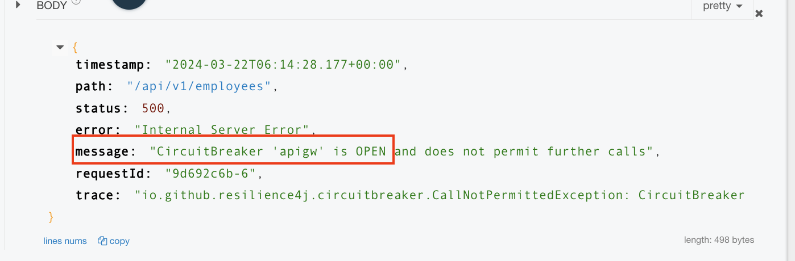

# CircuitBreaker ( Resilience4j )

<br/>

CircuitBreaker 를 이해 하고 실습 할수 있다.   

<br/>


1. Circuitbreaker  

2. Resilience4j

3. 설정 및 실습

4. 참고

<br/>

## 1. Circuitbreaker


<br/>

먼저 Circuit Breaker 란 회로차단을 뜻하는데 회로 차단기의 개념은 호출이 실패하거나 시간 초과될 수 있다고 알려진 경우 마이크로 서비스에 대한 호출을 방지하는 것입니다.   

이는 클라이언트가 실패할 가능성이 있는 요청을 처리하는 데 소중한 리소스를 낭비하지 않도록 하기 위한 것입니다. 이 개념을 사용하면 서버에 복구할 여유 시간을 줄 수 있습니다.  

다음과 같은 상태들이 있다.  

  


<br/>

- Closed: 모든 것이 정상일 때. 초기에 close 상태  

- Open: 정해진 설정에 미치치 못할때, 이 상태에서는 다른 마이크로 서비스에 대한 요청이 실행되지 않으며 가능한 경우 빠른 페일백 또는 폴백이 수행됩니다. 이 상태가 특정 시간 제한을 지나면 자동으로 또는 특정 기준에 따라 Half-Open 상태로 돌아갑니다.  

- HalfOpen: 호출하는 마이크로 서비스가 정상적으로 작동하는지 확인하기 위해 여러 요청이 실행됩니다. 성공하면 상태가 닫힘 상태로 돌아갑니다. 그러나 여전히 실패하면 Open 상태로 돌아갑니다.  

<br/>

Circuitbreaker 슬라이딩 윈도우 기반으로 동작하며 아래 두가지 기능을 선택하여 사용 할 수 있습니다.

<br/>

### 카운트 기반 슬라이딩

<br/>

카운트 기반 슬라이딩 윈도우는 지정된 카운트 개수의 요청을 체크 하여 해당 체크한 결과에 따라 동작 하는 방식 입니다.
카운트 기반 슬라이딩 윈도우 기법은 원형 배열 구조로 구현 되어 있으며 윈도우 카운트 값이 10이라면 10개의 값을 체크 하고 갱신 합니다.
새로운 요청이 들어오면 전체 값을 갱신 하며 오래된 측정 값은 제거 합니다. 스냅샷을 검색 하는 시간은 O(1) 으로 일정 하며 메모리 소비는 O(n)입니다.

<br/>

### 시간 기반 슬라이딩 윈도우  

<br/>

시간 기반 슬라이딩 윈도우는 지정된 시간 만큼 요청을 버킷에 기록 해 두고 체크한 결과에 따라 동작 하는 방식 입니다. 만약 10초로 설정을 했다면 10개의 버킷 배열이 생성이 되고 각 버킷 별로 부분 집합을 수집 하게 됩니다.  

요청이 들어오면 점진적으로 전체 버킷을 업데이트 하게되며 오래된 부분 집계 부터 제거 하며 부분 집계 에는 실패한 호출 수, 느린 호출 수 및 총 호출 수를 계산 하기 위해 3개의 정수로 구성 되어 있으며 전체 시간은 Long 타입으로 저장 됩니다. 검색 하는 시간은 O(1) 이고 메모리 소비는 O(n) 입니다.  

<br/>

### 실패율 체크 및 느린 동작 체크  

<br/>

실패율이 50% 이상 도달 하게 되면 써킷 브레이커의 상태는 COSED 에서 OPEN 상태로 변경 되게 됩니다.
모든 예외(Exception) 는 실패로 간주 되게 되며 예외 설정을 통해서 지정하거나 무시 하게 할 수 있습니다.  

느린 동작의 또한 50% 이상 도달 하게 되면 써킷 브레이커의 상태는 CLOSED 에서 OPEN 상태로 변경 되게 됩니다.
예를 들어 10개의 요청중 5초이상 지연된 요청이 5개 이상이 되면 써킷 브레이커의 상태가 변경 됩니다.  

실패율과 느린동작이 동작 하게 되려면 최소 동작 개수 만큼 기록 되어야 하며 예를 들어 최소 동작 개수 가 10개로 설정 되었다면
10개의 요청이 기록 되어야 평가하여 동작 하게 됩니다. 9개만 기록 된 경우에는 동작 하지 않습니다.  

<br/>

### 동작 방식

<br/>

Circuitbreaker 는 상태가 OPEN 인 경우 CallNotPermittedException 을 포함한 요청을 차단 합니다.
OPEN 상태로 변경 되고 대기 시간이 지난 후에 HALF_OPEN 상태로 변경 되어 최소 동작 개수 만큼 기록 하여 체크 한 다음
정상인 경우 CLOSED 상태로 변경 되게 되며 아닌 경우 OPEN 상태로 변경 됩니다.  

써킷 브레이커는 DISABLE(항상 허용), FORCED_OPEN(항상 차단) 두개지 옵션을 더 제공 합니다.  

이 상태 일 경우에는 써킷 브레이커가 별도의 매트릭을 수집 하지 않으며 해당 상태를 변경 하기 위해서는 설정을 변경 하거나
별도의 트리거를 통해서 설정 변경을 해야 합니다.  

써킷 브레이커는 원자성이 보장된 요청은 Thread-safe 하며 특정 시점에 하나의 스레드만 윈도우에 기록 하도록 합니다.  

<br/>

## 2. Resilience4j

<br/>

Resilience4j는 자바 언어로 개발된 내결함성 라이브러리입니다. 이 라이브러리는 분산 시스템에서 장애를 처리하고 시스템의 내결함성을 향상시키는 데 사용됩니다.  

Resilience4j는 일련의 내결함성 패턴을 구현하고, 이러한 패턴을 사용하여 애플리케이션을 더 견고하고 신뢰할 수 있도록 지원합니다.  

주요 기능 리스트
- Circuit Breaker : Circuit Breaker 패턴은 서비스 호출을 모니터링하고, 호출 실패 또는 지정된 실패률을 초과할 때 호출을 차단합니다. 이는 서비스의 과부하를 방지하고 시스템 전체의 가용성을 높입니다.  

- Retry : Retry 패턴은 재시도를 통해 임시적인 장애를 극복하는 데 사용됩니다. 서비스 호출이 실패하면, 일정 횟수만큼 다시 시도하여 성공할 때까지 시스템의 가용성을 유지합니다.  

- Rate Limiter : Rate Limiter 패턴은 서비스 호출의 빈도를 제한하여 과도한 부하를 방지합니다. 이를 통해 시스템이 처리할 수 있는 양의 요청을 관리하고, 서비스의 가용성을 보호합니다.  

- Bulkhead : Bulkhead 패턴은 서비스 호출을 격리하여 하나의 서비스 호출이 다른 호출에 영향을 주지 않도록 합니다. 이는 서비스 간의 의존성을 관리하고 시스템의 견고성을 향상시킵니다.  


<br/>

## 3. 설정 및 실습

<br/>

### dependency 추가

<br/>

아래 예제는 Spring Cloud Gateway ( SpringBoot 3.2.1 ) 를 기준으로 합니다.  

```bash
		<dependency>
			<groupId>org.springframework.cloud</groupId>
			<artifactId>spring-cloud-starter-circuitbreaker-reactor-resilience4j
			</artifactId>
		</dependency>
```  

<br/>

### `application-local.yml` 설정

<br/>

```yaml
# spring boot - actuator expose
management:
  endpoints:
    health:
      show-details: always
      enabled: true
    loggers:
      enabled: true  
    prometheus:
      enabled: true
    gateway:
      enabled: true
    circuitbreakers: ## actuator 에서 circuit breaker 상태 확인
      enabled: true
    ratelimiters:
      enabled: true  
    web:
      exposure:
        include: "*"
  endpoint:
    health:
      probes:
        enabled: true

#circuitbreaker
resilience4j.circuitbreaker:
  configs:
    default:
      registerHealthIndicator: true
      slidingWindowType: COUNT_BASED
      slidingWindowSize: 5 # 10 # {통계건수} : 서킷 CLOSE 상태에서 N회 호출 도달 시 failureRateThreshold 실패 비율 계산
      minimumNumberOfCalls: 10 # {최소요청횟수} : 집계에 필요한 최소 호출 수
      failureRateThreshold: 10 #60 # {실패율} : 실패 설정% 이상 시 서킷 오픈
      slowCallRateThreshold: 60 # {느린요청비율} : 설정값 이상 소요 시 실패로 간주
      slowCallDurationThreshold: 3000 # {느린요청으로 간주할 시간}
      permittedNumberOfCallsInHalfOpenState: 2 # HALFOPEN -> CLOSE or OPEN 으로 판단하기 위해 호출 횟수
      waitDurationInOpenState: 30s # 5s # {Circuit Breaker유지시간} : OPEN -> HALF-OPEN 전환 전 기다리는 시간
      eventConsumerBufferSize: 10
  instances:
    apigw:
      baseConfig: default
      timeout-duration: 3s # 요청 시간 제한
 ```  
<br/>

### Class에 `CircuitBreaker` 설정

<br/>

기존에 구현한 Spring Cloud Gateway 에서 route 대상인 서비스를 connection 안 되도록 해야 하기 때문에 기동하지 않는다.  

webfilter를 implement 해서 로그를 찍기 때문에 LoggingWebFilter 라는 class 에서 circuitbreaker를 설정한다.  

이름은 application-local.yaml 에서 설정한 instance 이름 이다.

<br/>

```java
@CircuitBreaker(name="apigw")
public class LoggingWebFilter implements WebFilter {
```  


<br/>

Spring Cloud Gateway를 실행하고 아래 url를 클릭하면 resilience4j_circuitbreaker 의 지표를 확인 할 수 있다.  
- http://localhost:8080/actuator/prometheus   

```bash
# HELP resilience4j_circuitbreaker_slow_calls The number of slow successful which were slower than a certain threshold
# TYPE resilience4j_circuitbreaker_slow_calls gauge
resilience4j_circuitbreaker_slow_calls{group="none",kind="successful",name="apigw",} 0.0
resilience4j_circuitbreaker_slow_calls{group="none",kind="failed",name="apigw",} 0.0
# HELP jvm_memory_used_bytes The amount of used memory
# TYPE jvm_memory_used_bytes gauge
jvm_memory_used_bytes{area="heap",id="G1 Survivor Space",} 1.0311296E7
jvm_memory_used_bytes{area="heap",id="G1 Old Gen",} 3.4794496E7
jvm_memory_used_bytes{area="nonheap",id="Metaspace",} 5.7461584E7
jvm_memory_used_bytes{area="nonheap",id="CodeCache",} 1.214144E7
jvm_memory_used_bytes{area="heap",id="G1 Eden Space",} 2097152.0
jvm_memory_used_bytes{area="nonheap",id="Compressed Class Space",} 8149664.0
# HELP resilience4j_circuitbreaker_not_permitted_calls_total Total number of not permitted calls
# TYPE resilience4j_circuitbreaker_not_permitted_calls_total counter
resilience4j_circuitbreaker_not_permitted_calls_total{group="none",kind="not_permitted",name="apigw",} 0.0
```  

<br/>

[표 6-1] Resilience4J 서킷 브레이커 지표 항목

| Metric name | Type | Tags | Description |
|:--------| :-----|:----|  :----|    
| resilience4j .circuitbreaker .calls | Timer | kind="failed", "successful", "ignored" | 성공, 실패, 무시한 전체 호출 건수 | 
| resilience4j .circuitbreaker .max.buffered.calls | Gauge | name="서킷브레이커명" | 현재 링 버퍼에 저장할 수 있는 최대 호출 건수 | 
| resilience4j .circuitbreaker .state | Gauge 0 - Not active 1 - Active | state="closed", "open", "half_open", "forced_open", "disabled" | 서킷 브레이커의 상태 | 
| resilience4j .circuitbreaker .failure.rate | Gauge | name="서킷브레이커명" | 서킷 브레이커의 실패율 | 
| resilience4j .circuitbreaker .buffered.calls | Gauge | kind="failed", "successful" | 링 버퍼에 저장된 성공, 실패 호출 건수 | 
| resilience4 .circuitbreaker .not.permitted.calls | Counter | kind="not_permitted" name="backendA" | 비인가된 호출 건수 | 
| resilience4j .circuitbreaker .slow.call.rate | Gauge | name="backendA" | 서킷브레이커의 지연 호출 비율 | 


<br/>

### TEST 하기  

<br/>

circuitbreaker 상태 보기는 아래 url 로 확인 할 수 있다.  
- http://localhost:8080/actuator/circuitbreakers  

```bash
{"circuitBreakers":{"apigw":{"failureRate":"-1.0%","slowCallRate":"-1.0%","failureRateThreshold":"10.0%","slowCallRateThreshold":"60.0%","bufferedCalls":0,"failedCalls":0,"slowCalls":0,"slowFailedCalls":0,"notPermittedCalls":0,"state":"CLOSED"}}}
```  

<br/>

Talend API 로 먼저 로그인을 하고 token을 가져 온다.  

  

<br/>

Employee 서비스를 조회해 본다. 5번 호출하면 에러 메시지가 변경이 되는 것을 확인 할 수 있다.   


    

  

<br/>

Circuit 이 OPEN이 되었다.  

```bash
{"circuitBreakers":{"apigw":{"failureRate":"-1.0%","slowCallRate":"-1.0%","failureRateThreshold":"10.0%","slowCallRateThreshold":"60.0%","bufferedCalls":0,"failedCalls":0,"slowCalls":0,"slowFailedCalls":0,"notPermittedCalls":0,"state":"OPEN"}}}
```  

<br/>

시간이 지나면 HALF_OPEN 으로 상태가 변경이 된다.  

```bash
{"circuitBreakers":{"apigw":{"failureRate":"-1.0%","slowCallRate":"-1.0%","failureRateThreshold":"10.0%","slowCallRateThreshold":"60.0%","bufferedCalls":0,"failedCalls":0,"slowCalls":0,"slowFailedCalls":0,"notPermittedCalls":0,"state":"HALF_OPEN"}}}
```  

<br/>

설정이 시간이 되면 다시 CLOSED 상태로 돌아온다.  

<br/>

## 4. 참고

<br/>

- https://velog.io/@wy9295/SCG-CircuitBreaker-resilience4j  
- https://parkhyeokjin.github.io/spring/2024/02/26/resilience4j-start-chap1.html  
- https://dveamer.github.io/backend/SpringCloudGateway.html  
- https://learn.microsoft.com/ko-kr/azure/spring-apps/how-to-circuit-breaker-metrics  
- https://mangkyu.tistory.com/289  
- 속성 설명 : https://wellbell.tistory.com/256  
- https://medium.com/@taesulee93/장애-전파를-방지하기-위한-circuitbreaker-pattern-도입-with-resilience4j-dc67ed7569d2 
- https://happycloud-lee.tistory.com/219
- https://jydlove.tistory.com/72
- https://oliveyoung.tech/blog/2023-08-31/circuitbreaker-inventory-squad/
