# 1. CQRS(Command Query Responsibility Segregation)

------

## 1.1. 개요

- **CQRS는 크리스 리처드슨의 '마이크로서비스 패턴'에 나오는 44가지 패턴 중 핵심 패턴 중 하나로 어플리케이션 패턴 중 데이터 패턴 중 조회에 대한 부분이다.**


## 1.2. Query 와 Command 란?

- CQRS 이전의 하위 개념인 CQS 에 대한 이해가 필요하다.

  

- CQS 는 Design By Contract 라는 용어를 만든 버트란드 메이어가 소개한 개념이다.

- 함수는 특정 동작을 수행하는 코드 블록을 의미하는데, 함수의 목적에 따라서 두가지로 분류할 수 있다.

- **Command 와 Query 이다.**

###  1.2.1. Command

- Command 는 시스템에 어떠한 side effect, 즉 **변경을 가하는 행위**를 하는 것을 말한다.

- 그래서 Command 성 함수 라고 한다면 변경을 가하는 함수를 말할 수 있다.

- **Command 성 함수는 시스템의 상태를 변경시키는 대신 값을 반환하지 않아야 한다.** 

```
// O, 상태만 변경시킴
void updateUser(User user) {
  user.updateAge(12);
}

// X, 값을 반환
User updateUser(User user) {
  return user.updateAge(12);
}
```

### 1.2.2. Query

- 이에 반해서 Query 는 시스템의 **상태를 관찰할 수 있는 행위**를 하는 것을 말한다.

- 마찬가지로 Query 성 함수라고 한다면 **단지 시스템의 상태만 확인하는 함수**라고 할 수 있다.

- **Query 성 함수는 시스템의 상태를 단지 반환하기만 하고 상태를 변경시키지 않아야 한다.**

```
// O, 값만 반환
User getUser(Long userId) {
  return users.get(userId);
}

// X, 상태를 변경
void getUser(Long userId) {
  User user = users.get(userId);
  user.updateLastQueriedAt();
  return user;
}
```

### 1.2.3. CQS (Command Query Separation ) 란?

 

- 버트란드 메이어는 위의 Command 와 Query 를 분리해야 하며 하나의 함수는 이 성격을 띄어야 한다고 했다.

- **즉, 어떠한 함수가 있다면 그 함수는 Command 또는 Query 중 하나의 역할만 수행해야 한다.**

- 만약 하나의 함수에서 Command 와 Query 가 모두 동시에 일어나게 된다면, 이는 소프트웨어의 3가지 원칙 중 복잡하지 않아야 한다는 KISS 가 지켜지지 않을 것이다.

  - > *KISS 원칙은 "Keep It Simple Stupid!", "Keep It Short and Simple", "Keep It Small and Simple"의 첫 글자를 따서 만든 약어다. 소프트웨어를 설계하는 작업이나 코딩을 하는 행위에서 되도록이면 간단하고 단순하게 만드는 것이 좋다는 원리로 소스 코드나 설계 내용이 '**불필요하게**' 장황하거나 복잡해지는 것을 경계하라는 원칙이다.*

  단순할수록 이해하기 쉽고, 이해하기 쉬울수록 버그가 발생할 가능성이 줄어든다. 이는 곧 생산성 향상으로 연결된다. 작업이 불필요하게 복잡해지는 것을 항상 경계해야 한다.

- 이런 관점에서 연장선상에 있는 것이 바로 Command Query Responsibility Segregation 이다.


## 1.3. CQRS (Command Query Responsibility Separation ) 란?


- CQRS 는**그렉 영**이 소개한 말이고, CQS에 비해 조금 더 큰 레벨에서의 Command 모듈과 Query 모듈의 책임을 분리하자는 말이다.

- CQS 는 코드 레벨에서의 분리를 말한다면 CQRS 는 조금 더 거시적인 관점에서의 분리를 의미한다.

- 앞서 버트란드 메이어가 말한것 처럼 command 형이거나 query 형의 함수를 분리시키면 소프트웨어가 더욱 단순해지고 이해하기 쉬워진다고 했다.

- **CQRS 는 이 원칙을 차용한다.**

- 일반적으로 CQRS 패턴을 적용한 애플리케이션은 다음과 같은 형태를 띄게 된다. 


- 위 그림을 보면 하나의 service interface 를 두고 두개의 서로 다른 애플리케이션이 존재한다.
  - **read side**
  - *write side**

- 아래의 그림은 **게임 보드** 라는 가상의 도메인을 모델링한 그림이다.
  - 사용자는 정답을 입력한다.
  - 정답이라면 점수를 올리고 오답이면 점수를 내린다.
  - 사용자의 랭킹 확인할 수 있다.

- 위의 구조는 동일한 도메인 모델을 사용한다. 즉, 조회의 책임과 명령의 책임이 하나의 도메인에 포함되어있다는 이야기다.

- 그럼 무슨 문제가 생길까?

- 위 아키텍처에서는 3가지의 잠재적인 문제가 존재할 것이다.
  - 복잡성
  - 성능
  - 확장성

- **문제1. 복잡성, 도메인이 비대해진다.**

  - 우리의 시스템에서 도메인이 갖는 의미에 대해서 생각해보자.
  - **도메인이란 곧 비즈니스이다.**
  - 비즈니스는 보통 특정한 데이터의 상태를 변경 (create, update, delete) 을 하는 것이다. 이러한 비즈니스는 시간이 증가하면서 점점 복잡도가 올라가게 되고, 많은 요구사항들을 포함할 수 있어야 했다.
  - 하지만 query 는 어떠할까?
  - query 는 단순 데이터 조회이기 때문에 비즈니스와 무관하지만 가끔 query 를 위한 처리가 도메인에 침투하는 경우가 생긴다.

  - 우리가 만나는 UI 의 데이터 대부분은 비정형 데이터들일 것이다. 즉, 쇼핑몰에서 user 정보에 따른 관심 물품, 최근 구매 내역, AI 추천 상품 목록 등 이러한 데이터는 하나 이상의 바운디드 컨텍스트와 관련이 있게 된다.
  - 그럼 이런 비즈니스 요구사항이 생길때마다 도메인을 수정해야 할까? 쿼리를 더 잘 할 수 있도록 도메인에 관련 행위를 추가해야 하는가?
  - 안 그래도 도메인 자체는 비대해져 가는데, 비즈니스 자체를 표현해야 하는 도메인에 query 가 침투한다? 즉 복잡성이 올라간다는 것을 의미한다.

- **문제2. 성능**
  
  - 대부분의 write 연산에서 우리는 일관성 (consistency) 에 대해서 많은 신경을 써야한다.
  - 대부분의 잘 알려진 consistency 를 지키기 위한 해법 으로 **DB Locking 기법**을 사용할 것이다.
- write 연산에서 한번 lock 을 잡게 되면 그 뒤의 read 연산이 모두 대기를 하게 되며 전반적인 성능이 낮아지는 결과를 초래할 수 있다. (물론 lock 의 기법에 따라서 결과는 다를 수 있지만)
  
- **문제 3. 확장성**
  - 많은 시스템에서 읽기와 쓰기에 대한 불균형이 존재한다는 사실은 꽤나 자주 들리는 이야기다.
  - 쓰기 작업과 읽기 작업의 비율이 **1(write):1000(read)** 라고 한다.
  - 그렇다는 이야기는 **read side 와 write side 의 서버는 서로 다른 기준으로 설계**가 되어야 한다는 것이다.
  - 즉, 독립적으로 확장이 가능해야 하고 각각 목적에 맞는 다른 솔루션이 필요하다는 이야기다.
  - 만약 이 둘이 분리되어 있지 않고 하나의 컴퓨팅 엔진만을 사용한다면 혹은 하나의 데이터소스만을 사용한다면 독립적인 확장이 힘들 것이다.
  - 하지만 여기서 CQRS 를 적용해서 **책임에 따른 Command 와 Query 의 연산을 각각 독립적으로 분리**시키면 다음과 같은 형태를 띄게 된다.

- 앞서 보았던 일반적인 CQRS 의 형태와 비슷하게 되었다.

- 그렇다면 정답과 관련된 비즈니스를 책임지는 윗쪽 도메인에게는 **상태를 변경시키는 Command 의 책임**만 존재하기에 비즈니스를 그대로 표현할 수 있다.

- 역시 아래의 도메인에게는 **상태를 확인하는 Query 의 책임** 만 존재하게 된다.

- 이렇게 되면 어떤 장점이 있을 수 있을까?

- 단순히 가장 먼저 드는 생각은 Command 와 Query 에 각기 다른 Persistence Module 을 사용할 수 있을것이다.
  - Command Side 에는 객체 중심적인 개발이 가능한 **Spring Data JDBC/JPA** 를 사용할 수 있다.
  - Query Side 에는 최적화된 쿼리를 위해서 **JdbcTemplage/MyBatis** 를 사용할 수 있을 것이다.

- CQRS 더 고도화 시켜볼 수 있다
  - Command 와 Query 의 책임이 분리되었기 때문에 Command 와 Query 는 서로 다른 인프라가 구성될 수 있다.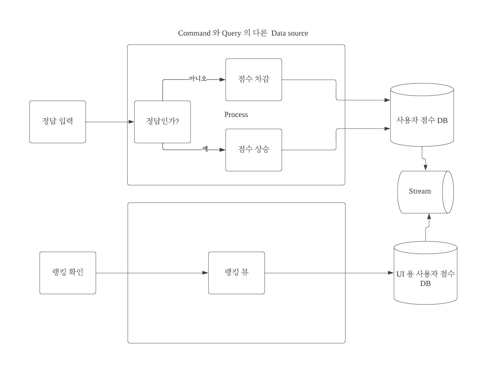
  - 그럼 위와 같이 Polyglot 한 Persistence Infra 가 구성될 수 있다.
  - Command infra 에는 write 에 최적화된 DB를 사용할 수 있을 것이다.
  - Query Side 에는 더욱 빠른 쿼리을 위해서 elasticsearch나 와 같은 검색 엔진을 도입할 수 있을 것이다.

  - Query Side 에 **Materialized View** 를 이용하여 복잡한 쿼리를 방지하고 **관점에 따른 정보 뷰**를 생성하여 사용하곤 한다
  - Write Side 에서 발생하는 변경 사항들에 대해서는 중간에 메시징 인프라를 이용해서 계속해서 동기화를 시켜주는 형태로 사용하기도 한다.

  

## 1.4. CQRS 의 장점


### 1.4.1. Scalability, 확장성

- 많은 enterprise 시스템에서, read 연산이 write 연산보다 훨씬 많이 일어나기 때문에 당신의 scalability, 즉 서버의 확장성은 read side 와 write side 각각에 다른 기준이 적용되어야 한다.

- 하나의 Bounded Context 내에서 **read side 와 write side 를 분리함으로써 각각을 서로 다르게 확장**할 수 있음을 의미한다.

- 예를 들어, Windows Azure에서 애플리케이션을 호스팅하는 경우, 각 side 를 분리한다면 **서로 다른 수의 인스턴스를 추가하여 독립적으로 확장**할 수 있다.

  

### 1.4.2 Reduced Complexity, 복잡성 줄이기

- 당신의 복잡한 도메인 속에서, **하나의 객체 안에 읽기 연산과 쓰기 연산을 모두 설계하고 구현하는 것은 복잡성을 더욱 악화**시킬 수 있다.

- 여러 케이스에서, 비즈니스 로직의 복잡성은 **update 와 트랜잭셔널한 연산을 수행할 떄에만 발생하지만, 반대로 읽기 연산은 그보다 훨씬 단순**하다.

- 비즈니스 로직과 읽기 연산이 하나의 모델에 뒤섞여 있다면, 더욱 어려운 비즈니스적 문제를 해결하거나, 대용량 처리, 분산 처리, 성능, 트랜잭션 및 consistency 를 처리하는 데에 큰 산이 될 것이다.

- 읽기 연산과 비즈니스 로직을 분리하면 이러한 문제를 해결하는데에 도움이 되지만 많은 대다수는 기존 모델을 분리하고 이해하는데에 여러 노력이 필요할 수도 있다.

- 많은 다른 Pattern 들 처럼, **CQRS 패턴을 도메인에 내제된 복잡성 중 일부를 더 쉽게 이해되고 특정 영역에서 문제 해결에 집중할 수 있도록 하는 접근 방식 또는 메커니즘**으로 바라볼 수 있다.

- 읽기 연산과 비즈니스 로직을 분리하여 경계 컨텍스트를 단순화하는 또 다른 잠재적인 이점은 테스트를 더 쉽게 만들 수 있다는 것이다.

  

### 1.4.3. Flexibility, 유연성

- CQRS 패턴을 사용할 때 얻어지는 유연성은 read-side 와 write-side 를 분리할 때 주로 발생된다.

- CQRS 패턴을 사용한다면, UI 에서 보여질 특정 쿼리를 추가한다거나 하는 read-side 에서 변경 및 추가가 쉬워진다.

- 비즈니스 로직에 어떠한 영향을 끼치지 않는다고 확신할 수 있을 때, **UI 에서 보여질 특정 view 를 위해서 쿼리를 추가하는 것과 같이 read-side 에서 변경하는 것이 훨씬 쉬워진다.**

- write-side 에서, 도메인의 핵심 비즈니스 로직만 표현하는 모델을 갖는다는 것은 read 연산과 write 연산이 혼재되어있을 때 보다 훨씬 간단하다는 것을 의미한다.

- 장기적으로 봤을 때, 당신의 핵심 도메인 비즈니스 로직을 명확하게 설명하는 코어 도메인 모델이 가치 있는 자산이 될 것이다.

- 당신이 직면해있는 계속해서 변경되는 비즈니스 환경과 경쟁의 압박 속에서 훨씬 더 agile 스럽게 해준다.

이러한 유연성과 agility 은 DDD 의 Continousous Integration 과 관련이 있다.

- 어떤 경우에는 write side 와 read side 에 서로 다른 개발 팀을 구성하는 것이 가능할 수도 있지만, 현실에서 이것은 아마도 얼마나 특정 바운디드 컨텍스트가 얼마나 큰지에 달려있을 것이다.


### 1.4.4. 비즈니스에 집중하기

- 만약 당신이 CRUD 를 사용한다면, 기술은 해결책을 형성하는 경향이 있다.
- CQRS 패턴을 채택하는 것은 당신이 **비즈니스에 집중하고 task-oridened (작업 지향) UI 를 만드는 데에 집중**할 수 있도록 도와준다.
- **read-side 와 write-side 의 관심사를 분리하는 것의 결과는 변화하는 비즈니스 요구사항에 더 잘 적응할 수 있는 솔루션**이다. 이로 인해서 장기적으로 개발 및 유지보수 비용이 절감된다.


### 1.4.5. 작업 기반 UI 만들기를 촉진 (Facilitates building task-based UIs)

- CQRS 패턴을 구현할 때, 도메인에게 작업을 시작하도록 할때 command 를 사용한다.
- 이러한 command 들은 일반적으로 도메인의 연산과 [*유비쿼터스 언어](https://github.com/dhslrl321/cqrs-journey-guide-korean/blob/master/terms/Ubiquitous Language.md)에 밀접하게 연관이 있다.
- 예를 들어서 "컨퍼런스 X 의 두 자리 좌석을 예매한다" 라는 command 가 있다고 해보자. 전통적인 CRUD 스타일의 작업을 하는 대신 이러한 명령을 도메인으로 보내기 위한 UI 를 설계할 수 있다.
- 이렇게 된다면 더욱 직관적이게 되고 작업 기반 UI 를 더 쉽게 설계할 수 있게 된다.


## 1.5. CQRS 단점

- **개발 리소스 증가**
  - CQRS 패턴을 적용하는 추가적인 개발 리소스가 투입될 수 있으므로 관련 사항을 이해관계자에게 이해 시키는 것이 중요하다.

  - write-side 와 read-side 를 명시적으로 분리하기 때문에 중복된 코드가 생길 수 있다.

- **즉시적인 일관성이 보장되지 않는다(최종 일관성은 보장)**
  - command 에 따른 data 의 무결성이 잠시동안 깨질 수 있다.
  - 이 말은 데이터의 consistency 가 항상 동일하지 않다
  - 하지만 최종적으로는 데이터가 맞춰질 것이니 **Eventual Consistency**라고 할 수 있다.


## 1.6. CQRS 를 사용해야 하는 경우

- **많은 사용자가 동일한 데이터에 병렬로 액세스하는 협업 도메인**
  -  CQRS를 사용하면 도메인 수준에서 **병합 충돌 및 충돌이 발생할 때 명령으로 병합할 수 있는 충돌을 최소화할 수 있을 정도로 자세하게 명령을 정의**할 수 있다.
- **여러 단계를 거치거나 복잡한 도메인 모델을 사용하는 복잡한 프로세스를 통해 사용자를 안내하는 작업 기반 사용자 인터페이스.**** 
  - 쓰기 모델에는 비즈니스 논리, 입력 유효성 검사 및 비즈니스 유효성 검사가 포함된 전체 명령 처리 스택이 있다. 
  - 쓰기 모델은 데이터 변경(DDD 용어의 집계)에 대한 단일 단위로 연결된 개체 세트를 처리하고 이러한 개체가 항상 일관된 상태인지 확인할 수 있다. 
  - 읽기 모델은 비즈니스 논리 또는 유효성 검사 스택을 보유하지 않으며 보기 모델에 사용할 DTO를 반환한다. 
  - **결과적으로 읽기 모델과 쓰기 모델의 일관성이 유지**됩니다.
- **읽기 수가 쓰기 수보다 훨씬 큰 경우 데이터 읽기의 성능을 데이터 쓰기 성능과 별도로 미세 조정해야 하는 시나리오.** 
  - 읽기 모델을 스케일 아웃할 수 있지만 몇 가지 인스턴스에서만 쓰기 모델을 실행할 수 있습니다. 
  - 소수의 쓰기 모델 인스턴스는 병합 충돌 발생을 최소화하는 데도 기여한다.
- **협업**
  - Udi Dahan 과 Greg Young 모두 바운디드 컨텍스트에 CQRS 패턴을 적용할 때 발생되는 최고 이점으로 협업을 꼽았다.
  - 개발자 중 한 팀은 쓰기 모델에 포함되는 복잡한 도메인 모델에 집중하고 또 한 팀은 읽기 모델과 사용자 인터페이스에 집중할 수 환경 제공.
- **비지니스 변화가 잦은 경우(배포)**
  -  이벤트 소싱과 조합해 다른 시스템과 통합하는 경우. 이때 하위 시스템 하나의 일시적인 장애가 다른 시스템의 가용성에 영향을 주지 않아야 합니다.

- **클라우드 환경**
  - PaaS(Platform as a Service) 클라우드 컴퓨팅 플랫폼에서 제공되는 많은 여러 서비스는 확상성이 뛰어난 데이터 저장소, 메시징 서비스 및 캐싱 서비스가 CQRS 구현을 위한 인프라로 적합.


## 1.7. CQRS 를 사용하지 말아야 하는 경우

- 도메인 또는 비즈니스 규칙이 간단한 경우 복잡도만 증가 한다.
- 간단한 CRUD 스타일 사용자 인터페이스 및 데이터 액세스 작업이 충분할 경우 굳이 분리할 필요가 없다.


## 1.8 CQRS의 구현형태

- 명령과 쿼리 모델이 한 프로세스에 있는지 다른 프로세스에 있는지
- 같은 DB를 사용하는지 다른 DB를 사용하는지

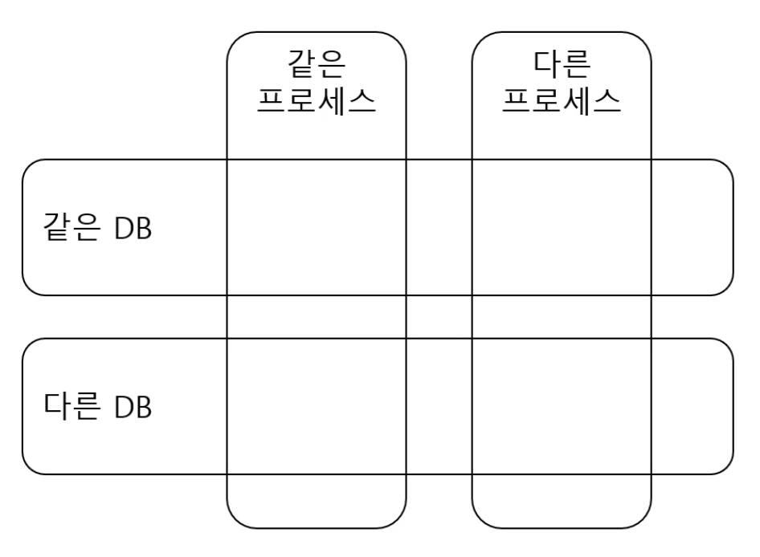


### 1.8.1. 구현: 같은 프로세스, 같은 DB

- 가장 단순하고 명령과 쿼리가 코드 수준에서 분리된다.
- 명령/쿼리 동일 데이터 보장


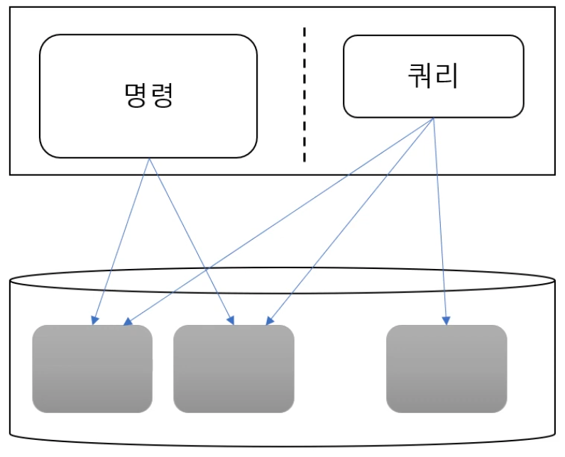


### 1.8.2. 구현: 같은 프로세스, 같은 DB, 다른 테이블

- 명령과 쿼리가 코드 수준에서 분리 되고 데이터 수준에서도 분리된다.
  - 단 데이터가 같은 DB에 있는 형태

- 쿼리 전용 테이블 사용
  - 예: 최근 조회수 많은 글 목록을 별도 테이블로 따로 저장
  - 쿼리 모델은 이 테이블을 이용해서 구현
- 명령이 상태를 변경할때 쿼리 전용 테이블을 함께 변경된다.

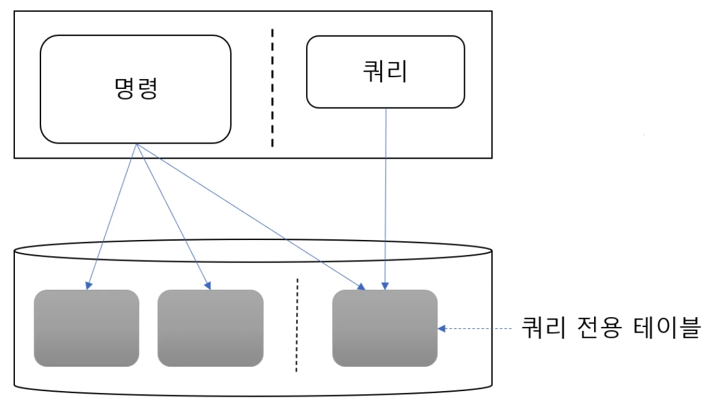


### 1.8.3. 구현: 같은 프로세스, 다른 DB

- 예: 상품목록을 레디스와 같은 저장소에 캐싱하고 쿼리 모델은 레디스를 사용하는 방식
  - 명령이 데이터를 변경하면 변경내역을 쿼리쪽 DB에 전달


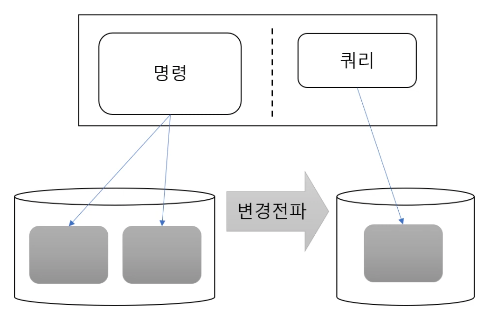

### 1.8.3.1. 구현: 다른 프로세스, 다른 DB

- 명령이 데이터를 변경하면 변경내역을 쿼리쪽 DB에 전달
  - 마이크로서비스 분리 추세에 따라 많이 만날 수 있는 형태


### 1.8.3.2. 다른 DB로 변경 전파

- 명령이 직접 쿼리 DB를 수정하는 방식
  - 카프카와 같은 메세징 수단을 이용해서 전달하는 변형도 있음
  - 장점: 구현이 단순함
  - 단점: 데이터 유실 가능성이 있음
    - 쿼리 DB나 메시징이 일시적으로 장애가 발생하게 되면 쿼리 DB에 반영해야 할 데이터가 유실될 수 있음
    - 쿼리 DB나 메시징의 문제 때문에 명령을 수행하는 기능 자체가 에러가 발생할 수 있음
- 변경내역을 기록하고 별도 전파기를 이용해서 변경내역을 전달하는 방식
  - 중간에 메시징을 두는 변형이 있음
  - 명령은 상태를 변경한 다음 변경내역을 별도 테이블에 기록 함
  - 장점: 한 트랜잭션으로 처리 되기 때문에 변경내역이 유실되지 않음
  - 단점: 전파기를 별도로 구현해야하는 부담이 있음
- DB가 제공하는 CDC(Change Data Capture)를 사용하는 방식
  - 중간에 메시징을 두는 변형이 있음
  - DB의 바이너리 로그를 읽어서 변경 데이터를 확인하고 변경된 데이터를 쿼리쪽에 전달하는 방식
  - 장점: 명령 쪽 코드에서 변경내역을 따로 저장하지 않아도 되므로 명령코드가 단순해짐


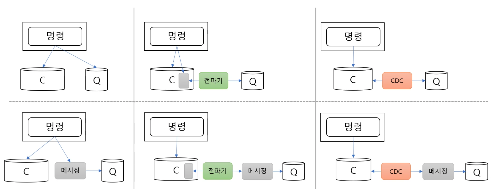


### 1.8.3.3. 다른 DB 사용시 주의 사항

- **데이터 유실**
  - 유실 허용 여부에 따라 DB 트랜잭션 범위 중요
  - 예)
    - 주문목록 쿼리 기능의 경우 데이터가 유실되면 곤란함
    - 최근 읽기글 쿼리 기능은 일시적으로 데이터 전파가 안되도 치명적이지 않음
- **허용 가능 지연 시간**
  - 명령의 변경내역을 얼마나 빨리 쿼리쪽에 반영하는지에 따라서 구현의 선택이 달라질 수 있음
- **중복 전달**
  - 쿼리쪽 DB에 변경된 데이터를 전달하는 과정에서 문제가 발생하게 되면 다시 전달할 수 있는 수단이 필요
  - 다시 전달할 수 있는 수단을 만들다 보면 쿼리쪽에 이미 반영된 데이터를 중복으로 전달하는 경우도 발생하게 됨
  - 중복으로 데이터를 전달 하더라도 쿼리쪽 데이터가 망가지지 않도록 별도의 처리를 해야 함


## 1.9. 요약

- ***CQRS 패턴을  적용하기에 앞써 초기 비용과 오버헤드, 미래의 비즈니스 이점 사이의 장단점을 명확히 분석해야 한다.***

- ***CQRS 패턴을 적용할 수 있는 곳을 식별하는 데 유용한 지표는 복잡하며 유동적인 비즈니스 규칙을 포함하여 collaborative 한 구성 요소를 찾는 것이다.***

- ***CQRS 패턴은  Command 와 Query 를 분리시켜 복잡성을 줄이는 것이 핵심이며 서비스 및 인프라 구성은 도메인 비지니스의 성격에 따라 고려되어야 한다.***


# 2. CQRS 구성하기 위한 기술


## 2.1. Spring with kafka


### 2.1.1. 개요

- [Apache Kafka](https://kafka.apache.org/) 는 분산 및 내결함성 스트림 처리 시스템이다.

- *Spring Kafka는 @KafkaListener* 어노테이션 을 통해 *KafkaTemplate* 및 **Message-driven POJO 가 있는 단순하고 일반적인 Spring 템플릿 프로그래밍 모델을 제공**한다.


### 2.1.2. 의존성 추가

```xml
<dependency>
    <groupId>org.springframework.kafka</groupId>
    <artifactId>spring-kafka</artifactId>
</dependency>
```


### 2.1.2. 설정

```yaml
  kafka:
    consumer:
      bootstrap-servers: localhost:9092
      group-id: consumerGroupId
      auto-offset-reset: earliest
      key-deserializer: org.apache.kafka.common.serialization.StringDeserializer
      value-deserializer: org.apache.kafka.common.serialization.StringDeserializer
    producer:
      bootstrap-servers: localhost:9092
```


### 2.1.3. 이벤트 전송

- *KafkaTemplate* 클래스 를 사용하여 메시지를 보낼 수 있다.

```java
@Autowired
private KafkaTemplate<String, String> kafkaTemplate;

public void sendMessage(String msg) {
    kafkaTemplate.send(topicName, msg);
}
```

- send API는 ListenableFuture 객체 를 반환한다. 보내는 스레드를 차단하고 보낸 메시지에 대한 결과를 얻으려면 *ListenableFuture* 객체 의 *get* API를 호출할 수 있다. 스레드는 결과를 기다리지만 Producer 속도가 느려진다.
  - Kafka는 빠른 스트림 처리 플랫폼이다. 따라서 후속 메시지가 이전 메시지의 결과를 기다리지 않도록 결과를 비동기적으로 처리하는 것이 좋다.

- 이 같은 경우 콜백을 통해 작업을 수행할 수 있다.

```java
public void sendMessage(String message) {
            
    ListenableFuture<SendResult<String, String>> future = 
      kafkaTemplate.send(topicName, message);
	
    future.addCallback(new ListenableFutureCallback<SendResult<String, String>>() {

        @Override
        public void onSuccess(SendResult<String, String> result) {
            System.out.println("Sent message=[" + message + 
              "] with offset=[" + result.getRecordMetadata().offset() + "]");
        }
        @Override
        public void onFailure(Throwable ex) {
            System.out.println("Unable to send message=[" 
              + message + "] due to : " + ex.getMessage());
        }
    });
}
```


### 2.1.4. 이벤트 수신

- @KafkaListener 어노테이션을 통해 원하는 topic에 대한 메시지를 수신 받을 수 있다.

```java
@KafkaListener(topics = "topicName", groupId = "foo")
public void listenGroupFoo(String message) {
    System.out.println("Received Message in group foo: " + message);
}
```

- Topic 에 대해 각각 다른 Group ID를 가진 여러 리스너를 구현할 수 있다. 또한 한 Consumer는 다양한 Topic 메시지를 수신 할 수 있다.

```java
@KafkaListener(topics = "topic1, topic2", groupId = "foo")
```

- Spring은 또한 리스너에서 @Header 주석을 사용하여 하나 이상의 메시지 헤더 검색을 지원한다.

```java
@KafkaListener(topics = "topicName")
public void listenWithHeaders(
  @Payload String message, 
  @Header(KafkaHeaders.RECEIVED_PARTITION_ID) int partition) {
      System.out.println(
        "Received Message: " + message"
        + "from partition: " + partition);
}
```


## 2.2. Caching Data with Spring


### 2.2.1. 개요

- **Spring에서 Caching 추상화를 사용하는 방법 과 일반적으로 시스템의 성능을 향상시키는 기능을 제공**한다.


### 2.2.2. 의존성 추가

- Spring Boot를 사용하는 경우 *[spring-boot-starter-cache](https://search.maven.org/search?q=g:org.springframework.boot a:spring-boot-starter-cache)* 스타터 패키지를 활용하여 캐싱 종속성을 쉽게 추가할 수 있다.

```xml
<dependency>
    <groupId>org.springframework.boot</groupId>
    <artifactId>spring-boot-starter-cache</artifactId>
    <version>2.4.0</version>
</dependency>
```


### 2.2.3. 캐싱 활성화

- 캐싱을 활성화하기 위해 Spring은 프레임워크에서 다른 구성 수준 기능을 활성화하는 것과 마찬가지로 어노테이션을 사용한다.

- *구성 클래스에 @EnableCaching* 주석을 추가하여 캐싱 기능을 활성화할 수 있다.

- 캐싱을 사용하기 위해 어노테이션을 사용하여 캐싱 동작을 메서드에 바인딩할 수 있다.

```java
package com.example.cloudnative.catalogws;

import org.springframework.boot.SpringApplication;
import org.springframework.boot.autoconfigure.SpringBootApplication;
import org.springframework.cache.annotation.EnableCaching;
import org.springframework.retry.annotation.EnableRetry;

@SpringBootApplication
@EnableCaching //Cache 기능 활성화  
public class CatalogWsApplication {

    public static void main(String[] args) {
        SpringApplication.run(CatalogWsApplication.class, args);
    }
}
```


### 2.2.4. @Cacheable

- 메소드에 대한 캐싱 동작을 활성화하는 가장 간단한 방법은 *@Cacheable* 로 구분 하고 결과가 저장될 캐시 이름으로 매개변수화한다.

```java
@Cacheable("addresses")
public String getAddress(Customer customer) {...}
```

- *getAddress()* 호출 은 실제로 메서드를 호출한 다음 결과를 캐싱하기 전에 먼저 캐시 *주소 를 확인한다.*


### 2.2.5 @CacheEvict

- 자주 필요하지 않은 값으로 캐시를 채울 경우 캐시는 상당히 크고 빠르게 증가할 수 있으며 오래되거나 사용되지 않는 데이터를 많이 보유할 수 있다. 
- 이 경우 새로운 값을 캐시에 다시 로드할 수 있도록 @CacheEvict 주석을 사용하여 하나 이상의 모든 값을 제거 할수 가 있다.

```java
@CacheEvict(value="addresses", allEntries=true)
public String getAddress(Customer customer) {...}
```

- 여기서 비울 캐시와 함께 *allEntries 추가 매개변수를 사용한다.* 이렇게 하면 캐시 *주소* 의 모든 항목이 지워지고 새 데이터를 위해 준비됩니다.


## 2.3.  Spring Data JDBC


### 2.3.1. 개요

- **MSA 환경의 DDD(도메인주도설계) 관점의 Aggregate의 일관성을 제공하는 필수 기능을 제공하는 프레임워크**이다.
- Spring Data JDBC는 Spring Data JPA만큼 복잡하지 않으며  JPA의 캐시, 지연 로딩, 세션 등 여러 기능을 제공하지 않는다. 
- 자체 ORM이 있으며 매핑된 엔터티, 저장소, 쿼리 주석 및 JdbcTemplate 과 같이 Spring Data JPA와 함께 사용되는 대부분의 기능을  제공한다.
- Spring Data JDBC는 스키마 생성을 제공하지 않므로 스키마를 사전에 생성하여야 한다.
- Spring Data JDBC는 Spring JDBC를 사용하는 것처럼 간단한 솔루션을 제공하며  Spring Data JPA의 대부분의 기능을 제공한다.
- Spring Data JDBC의 가장 큰 장점 중 하나는 Spring Data JPA에 비해 데이터베이스에 접근할 때 향상된 성능을 제공한다.
- Spring Data JDBC를 사용할 때 가장 큰 단점 중 하나는 데이터베이스 벤더에 의존하므로 데이터베이스를 MySQL에서 Oracle로 변경하기로 결정한 경우 다른 Dialect를 사용하여 데이터베이스에서 발생하는 문제를 처리해야 한다.


### 2.3.2. Spring Data JDBC 의존성 추가

- Spring Data JDBC는 JDBC 종속성 스타터가 있는 Spring Boot 애플리케이션에서 사용할 수 있다.
  - 이 의존성은 데이터베이스 드라이버를 가져오지 않는다.

```xml
<dependency> 
    <groupId>org.springframework.boot</groupId> 
    <artifactId>spring-boot-starter-data-jdbc</artifactId>
</dependency> 
```

- 이 예에서는 H2 데이터베이스를 사용하고 있다. 
  -  이러한 경우 스키마 개체를 만들기 위한 SQL DDL 명령이 있는 사용자 지정 *schema.sql 파일을 만들 수 있다.
- 자동으로 Spring Boot는 이 파일을 선택하여 데이터베이스 객체를 생성하는 데 사용한다.


### 2.3.3. 엔티티 추가

- 다른 Spring Data 프로젝트와 마찬가지로 주석을 사용하여 POJO를 데이터베이스 테이블과 매핑된다. 
- Spring Data JDBC 에서 엔티티는 **@Id** 가 있어야 합니다 . Spring Data JDBC는 *@Id* 주석을 사용하여 엔티티를 식별한다.

- Spring Data JPA와 유사하게 Spring Data JDBC는 기본적으로 Java 엔티티를 관계형 데이터베이스 테이블에 매핑하고 속성을 열 이름에 매핑하는 명명 전략을 사용한다. 
- 기본적으로 엔터티 및 속성의 Camel Case 이름은 테이블 및 열의 스네이크 케이스 이름에 각각 매핑된다.

- *@Table* 및 *@Column* 주석을 사용하여 엔티티 및 속성을 테이블 및 열과 명시적으로 매핑할 수 있다.

```java
public class Person {
    @Id
    private long id;
    private String firstName;
    private String lastName;
    // constructors, getters, setters
}
```

- *Person* 클래스 에서 *@Table* 또는 *@Column* 주석을 사용할 필요가 없습니다 . Spring Data JDBC의 기본 명명 전략은 엔터티와 테이블 간의 모든 매핑을 암시적으로 수행한다.


### 2.3.4. JDBC 저장소 선언

- Spring Data JDBC는 Spring Data JPA와 유사한 구문을 사용한다.
- *Repository* , *CrudRepository 또는 PagingAndSortingRepository* 인터페이스 를 확장하여 Spring Data JDBC 저장소를 생성할 수 있다. 
- *CrudRepository* 를 구현함으로써 우리는 특히 *save* , *delete* , *findById* 와 같은 가장 일반적으로 사용되는 메소드의 구현을 상속한다.

- JDBC 저장소를 예제는 다음과 같다.

```java
@Repository 
public interface PersonRepository extends CrudRepository<Person, Long> {
}
```

- JPA와 마찬가지로 페이징 및 정렬 기능이 필요한 경우 *PagingAndSortingRepository* 인터페이스를 사용할 수 있다.


### 2.3.5. JDBC 저장소 사용자 정의

- *CrudRepository* 의 내장 메소드 에도 불구하고 특정 경우에 대한 메소드를 생성해야 한다.

- 이제 수정하지 않는 쿼리와 수정하는 쿼리를 사용하여 *PersonRepository 에 대한 예제이다.*

```java
@Repository
public interface PersonRepository extends CrudRepository<Person, Long> {

    List<Person> findByFirstName(String firstName);

    @Modifying
    @Query("UPDATE person SET first_name = :name WHERE id = :id")
    boolean updateByFirstName(@Param("id") Long id, @Param("name") String name);
}
```

- 버전 2.0부터 Spring Data JDBC는 [쿼리 메소드](https://docs.spring.io/spring-data/jdbc/docs/current/reference/html/#jdbc.query-methods) 를 지원한다. 즉, 예를 들어 *findByFirstName과* 같은 키워드를 포함하는 쿼리 메서드의 이름을 지정하면 Spring Data JDBC는 쿼리 객체를 자동으로 생성한다.

- 수정 쿼리의 경우 *@Modifying* 주석을 사용하여 엔터티를 수정하는 쿼리 메서드에 주석을 추가한다. *또한 @Query* 주석 으로 장식합니다 .

- *@Query* 주석 내부에 SQL 명령을 추가한다. **Spring Data JDBC에서는 일반 SQL로 쿼리를 작성한다.** 
- JPQL과 같은 고급 쿼리 언어를 사용하지 않는다. 

- **Spring Data JDBC가 인덱스 번호가 있는 매개변수 참조를 지원하지 않고**매개변수는 이름으로만 참조할 수** 있다.


# 3. 실습


## 3.1. 개요

- CQRS를 구현하기 위한 여러 케이스별 실습을 진행한다.

- 해당 실습은 고전적인 스타일의 일반적인 CRUD Backend API 제공을 위한 서비스를 기반으로 CQRS의 여러가지 관점으로 어플리케이션을 개발해 본다.

  


## 3.2.  사전준비

### 3.2.1. JDK 설치

- 다운로드 : [Eclipse Temulin Java 17](https://projects.eclipse.org/projects/adoptium.temurin/downloads)

```
지난 2021년 9월  14일 JAVA LTS(Long Term Support)인 JDK 17 GA 가 릴리즈되었다.
JDK17은 향후 최대 2029년 9월까지 업데이트가 제공될 예정이다.
참고로 다음 LTS는 JDK21 (2023년 9월)이 될 것으로 예상된다.

2018년 오라클의 정책 변경에 따라 Oracle JDK 바이너리에 적용되던 BCL 라이선스가 바뀌어 이를 사용하려면 라이선스 구독이 필요하다. 따라서 대안으로는 OpenJDK 레퍼런스 소스 코드를 기반으로 제작된 여러 밴더사에서 제공중인 바이너리를 사용할 수 있으며, Azul Platform, Amazon Corretto, ReadHat OpenJDK, AdoptOpenJDK 가 그 대표적인 예이다.

이 중에서 커뮤니티 기반 빌드인 AdoptOpenJDK 가 많이 쓰이는데, AdoptOpenJDK 의 최근 변화에 대해 알아보고 JDK 17 사용 방법을 살펴보고자 한다.
 
AdoptOpenJDK 에서 Eclipse Adoptium 으로 이전

https://blog.adoptopenjdk.net/2021/08/goodbye-adoptopenjdk-hello-adoptium/
2021년 8월 2일 AdoptOpenJDK 가 Eclipse Adoptium 으로 이전되었다.
Eclipse Adoptium 는 최상위 프로젝트(TLP)를 의미하며, Eclipse Temurin 에서 Java SE 런타임을 진행한다.
Eclipse Temurin 은 오라클 SE TCK(Technology Compatibility Kit)와 Eclipse AQAvit 테스트를 통과했다.
Azul Platform Core OpenJDK 지원 구독을 통해 Temurin 에 대한 상용 지원이 가능하다고 한다.
기존의 AdoptOpenJDK 웹사이트와 AdoptOpenJDK API는 당분간 유지할 예정이나, 빠른 시일내에 Eclipse Adoptium 으로 이전할 것을 권장하고 있다.
```


### 3.2.2. STS 설치

- 다운로드 :  https://spring.io/tools

- 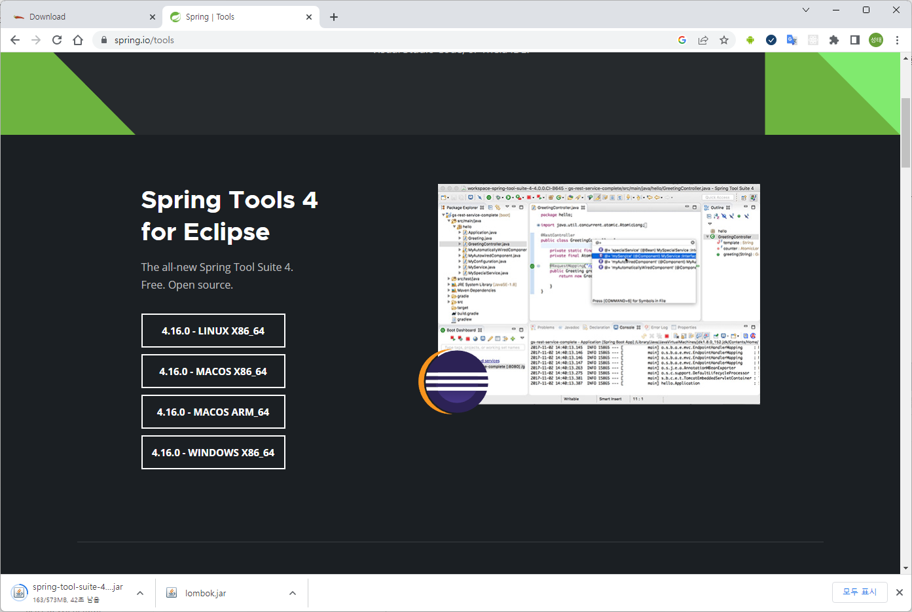

- 실행

  ```
  java -jar spring-tool-suite-4-4.16.0.RELEASE-e4.25.0-win32.win32.x86_64.self-extracting.jar
  ```


### 3.2.3. Lombok 설치

- 다운로드 : https://projectlombok.org/download


- 실행

  ```shell
  java -jar lombok.jar
  ```

- 설치

  


### 3.2.4. Docker Desktop 설치

- Kafka를 활용한 데이타 동기화 실습 시 Kafka + Kafka Connect + MySql 구동을 위한 도커환경 구성이 필요하다.

- 다운로드 : https://www.docker.com/products/docker-desktop/

  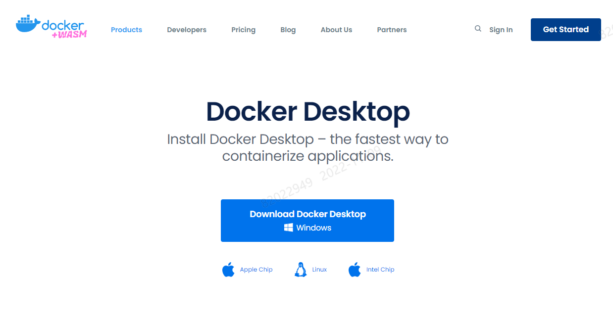

- 설치
  
  - 다운로드한 파일을 실행해서 설치한다.
- 실행
  
  - 프로그램 목록에서 Docker Desktop을 실행한다.


### 3.2.5 Git Bash 설치

- Curl 등 테스트를 위해 Linux Shell 환경을 제공해주는클라이언트를 설치한다.

- 다운로드 : https://git-scm.com/downloads

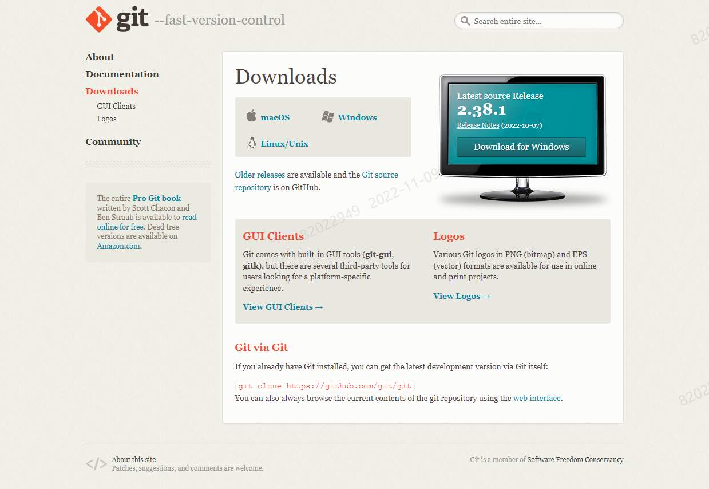

- 설치

  - 다운로드한 파일을 실행해서 설치한다.

- 실행

  - 프로그램 목록에서 Git Bash를 실행한다.

  


## 3.3. 실습 애플리케이션 소개

실습 애플리케이션은 신용카드를 제공하는 간단한 도메인 서비스이다 해당 서비스는 아래의 기능을 가지고 있다.

- 카드에서 돈을 인출할 수 있다.(명령)
- 카드서 돈을 인출한 목록을 읽을 수 있습니다( 조회)

해당서비스에서 중요한 요구사항은 **카드에서 인출한 돈이 인출 목록에 정확하게 조회되어야 한다**.

따라서 명령과 조회의 상태를 일관성 있게 만드는 **동기화** 작업이 필요하다.


## 3.4.  주요 라이브러리

| 기술 스택         | 참고                                         |
| ----------------- | -------------------------------------------- |
| Spring Web MVC    | Rest API를 제공하는 라이브러리               |
| Spring Data JDBC  | Database와 연계하는 Spring Data의 라이브러리 |
| Spring with Kafka | Kafka와 연계하는 라이브러리                  |
| Spring Data Cache | Spring에서 Cache를 사용할 수 있는 라이브러리 |
| JAVA 17           | Eclipse Temurin JAVA 17                      |


## 3.5. 단일 프로세스로 처리되는 CRUD


### 3.5.1. 개요

- 전통적인 단일 프로세스 환경에서 도메인의 CRUD를 처리하는 방식이다.


### 3.5.2. 아키텍처 구성

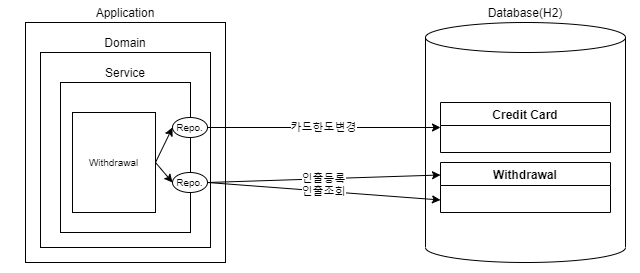


### 3.5.3. 실습

- 프로젝트 구조

  ```
  ├─java
  │  └─com
  │      └─kt
  │          └─cqrs
  │              ├─controller
  │              ├─repository
  │              │  └─entity
  │              └─service
  └─resources
  ```

- Database

  - 파일명 : schema.sql

    ```sql
    CREATE TABLE IF NOT EXISTS CREDIT_CARD (
      ID            VARCHAR(255) PRIMARY KEY,
      INITIAL_LIMIT DECIMAL(18,2) NOT NULL,
      USED_LIMIT    DECIMAL(18,2) NOT NULL
    );
    
    CREATE TABLE IF NOT EXISTS WITHDRAWAL (
      ID     VARCHAR(255) PRIMARY KEY,
      CARD_ID   VARCHAR(255)    NOT NULL,
      AMOUNT DECIMAL(18,2) NOT NULL,
      foreign key (CARD_ID) references CREDIT_CARD(ID)
    );
    ```

  - 파일명 : data.sql

    ```sql
    INSERT INTO credit_card (ID, INITIAL_LIMIT, USED_LIMIT) VALUES
      ('3a3e99f0-5ad9-47fa-961d-d75fab32ef0e', 10000, 0);
    
    COMMIT;
    ```

-  Dependency

  -  파일명 : pom.xml
  
  ```xml
  <?xml version="1.0" encoding="UTF-8"?>
  <project xmlns="http://maven.apache.org/POM/4.0.0"
  	xmlns:xsi="http://www.w3.org/2001/XMLSchema-instance"
  	xsi:schemaLocation="http://maven.apache.org/POM/4.0.0 http://maven.apache.org/xsd/maven-4.0.0.xsd">
  	<modelVersion>4.0.0</modelVersion>
  
  	<groupId>icis.com</groupId>
  	<artifactId>monolithic</artifactId>
  	<version>0.0.1-SNAPSHOT</version>
  	<packaging>jar</packaging>
  
  
  	<parent>
  		<groupId>org.springframework.boot</groupId>
  		<artifactId>spring-boot-starter-parent</artifactId>
  		<version>2.7.2</version>
  		<relativePath /> <!-- lookup parent from repository -->
  	</parent>
  
  	<properties>
  		<project.build.sourceEncoding>UTF-8</project.build.sourceEncoding>
  		<project.reporting.outputEncoding>UTF-8</project.reporting.outputEncoding>
  		<java.version>17</java.version>
  		<spring-cloud.version>2021.0.3</spring-cloud.version>
  	</properties>
  
  	<dependencyManagement>
  		<dependencies>
  			<dependency>
  				<groupId>org.springframework.cloud</groupId>
  				<artifactId>spring-cloud-dependencies</artifactId>
  				<version>${spring-cloud.version}</version>
  				<type>pom</type>
  				<scope>import</scope>
  			</dependency>
  		</dependencies>
  	</dependencyManagement>
  
  	<build>
  		<plugins>
  			<plugin>
  				<groupId>org.springframework.boot</groupId>
  				<artifactId>spring-boot-maven-plugin</artifactId>
  			</plugin>
  		</plugins>
  	</build>
  
  	<dependencies>
  		<dependency>
  			<groupId>org.springframework.boot</groupId>
  			<artifactId>spring-boot-starter-data-jdbc</artifactId>
  		</dependency>
  		<dependency>
  			<groupId>org.springframework.boot</groupId>
  			<artifactId>spring-boot-starter-web</artifactId>
  		</dependency>
  		<dependency>
  			<groupId>org.springframework.boot</groupId>
  			<artifactId>spring-boot-starter-actuator</artifactId>
  		</dependency>
  
  		<dependency>
  			<groupId>com.h2database</groupId>
  			<artifactId>h2</artifactId>
  		</dependency>
  
  		<dependency>
  			<groupId>org.projectlombok</groupId>
  			<artifactId>lombok</artifactId>
  			<scope>provided</scope>
  		</dependency>
  
  		<dependency>
  			<groupId>org.springframework.boot</groupId>
  			<artifactId>spring-boot-starter-test</artifactId>
  			<scope>test</scope>
  		</dependency>
  
  		<dependency>
  			<groupId>junit</groupId>
  			<artifactId>junit</artifactId>
  			<scope>test</scope>
  		</dependency>
  
          <dependency>
  			<groupId>org.springdoc</groupId>
  			<artifactId>springdoc-openapi-ui</artifactId>
  			<version>1.6.6</version>
  		</dependency>
  					
  		<dependency>
  			<groupId>org.springframework.boot</groupId>
  			<artifactId>spring-boot-devtools</artifactId>
  			<scope>runtime</scope>
  			<optional>true</optional>
  		</dependency>	
  	</dependencies>
  
  </project>
  
  ```
  
-  Properties

  -  파일명 : resources/application.yml
  
  ```yaml
  server:
    port: 8080
    
  spring:     
    devtools:
      restart:
        enabled: true
    h2:
      console:
        enabled: true
        settings:
          web-allow-others: true
        path: /h2-console        
    datasource:
      url: jdbc:h2:mem:testdb;DB_CLOSE_DELAY=-1
  ```
  
-  BootStrap

  -  파일명 : CqrsApplication.java
  
  ```java
  package com.kt.cqrs;
  
  import org.springframework.boot.SpringApplication;
  import org.springframework.boot.autoconfigure.SpringBootApplication;
  import org.springframework.web.servlet.config.annotation.EnableWebMvc;
  
  @EnableWebMvc
  @SpringBootApplication
  public class CqrsApplication {
  
  	public static void main(String[] args) {
  		SpringApplication.run(CqrsApplication.class, args);
  	}
  }
  
  ```


- Exception
  -  파일명 : NotEnoughMoneyException.java
  ```java
  package com.kt.cqrs.service;
  
  import java.util.UUID;
  
  public class NotEnoughMoneyException extends RuntimeException {
  
  	private static final long serialVersionUID = 1L;
  
  	public NotEnoughMoneyException(UUID cardNo, long wanted, long availableBalance) {
          super(String.format("Card %s not able to withdraw %s. Balance is %s", cardNo, wanted, availableBalance));
      }
  }
  ```


- Entity
  -  파일명 : CreditCard.java
  ```java
  package com.kt.cqrs.repository.entity;
  
  import java.util.UUID;
  
  import org.springframework.data.annotation.Id;
  import org.springframework.data.relational.core.mapping.Table;
  
  import lombok.AllArgsConstructor;
  import lombok.Builder;
  import lombok.Getter;
  import lombok.NoArgsConstructor;
  import lombok.Setter;
  import lombok.ToString;
  
  @Getter
  @Setter
  @Builder
  @AllArgsConstructor
  @NoArgsConstructor
  @ToString
  @Table("CREDIT_CARD")
  public class CreditCard {
  
      @Id
      private UUID id;
      private long initialLimit;
      private long usedLimit;
  
  }
  ```
  -  파일명 : Withdrawal.java
  ```java
  package com.kt.cqrs.repository.entity;
  
  import java.util.UUID;
  
  import org.springframework.data.annotation.Id;
  import org.springframework.data.annotation.Transient;
  import org.springframework.data.domain.Persistable;
  import org.springframework.data.relational.core.mapping.Table;
  
  import lombok.AllArgsConstructor;
  import lombok.Builder;
  import lombok.Getter;
  import lombok.NoArgsConstructor;
  import lombok.Setter;
  import lombok.ToString;
  
  @Getter
  @Setter
  @Builder
  @AllArgsConstructor
  @NoArgsConstructor
  @ToString
  @Table("WITHDRAWAL")
  public class Withdrawal implements Persistable<UUID>{
  
      @Transient
      private boolean isNew = false;
      
      @Id
      private UUID id;
      private long amount;
      private UUID cardId;
      
      public static Withdrawal newWithdrawal(UUID id, long amount, UUID cardId) {
      	Withdrawal withdrawal = new Withdrawal(true, id, amount, cardId);
          return withdrawal;
      }
  
      @Override
      public boolean isNew() {
          return isNew;
      }
  }
  
  ```
  
- Rpository
  -  파일명 : CreditCardRepository.java
  ```java
  package com.kt.cqrs.repository;
  import java.util.UUID;
    import org.springframework.data.repository.CrudRepository;
    import com.kt.cqrs.repository.entity.CreditCard;
  
    public interface CreditCardRepository extends CrudRepository<CreditCard, UUID> {
    }
  ```
  -  파일명 : WithdrawalRepository.java
  ```java
  package com.kt.cqrs.repository;
  
  import java.util.List;
  import java.util.UUID;
  import org.springframework.data.repository.CrudRepository;
  import com.kt.cqrs.repository.entity.Withdrawal;
  
  public interface WithdrawalRepository extends CrudRepository<Withdrawal, UUID> {
      List<Withdrawal> findByCardId(UUID cardId);
  }
  
  ```

- Service
  -  파일명 : WithdrawalService.java
  ```java
  package com.kt.cqrs.service;
  
  import java.util.List;
  import java.util.UUID;
  
  import org.springframework.stereotype.Service;
  import org.springframework.transaction.annotation.Transactional;
  
  import com.kt.cqrs.repository.CreditCardRepository;
  import com.kt.cqrs.repository.WithdrawalRepository;
  import com.kt.cqrs.repository.entity.CreditCard;
  import com.kt.cqrs.repository.entity.Withdrawal;
  
  import lombok.RequiredArgsConstructor;
  import lombok.extern.slf4j.Slf4j;
  
  @Slf4j
  @Service
  @RequiredArgsConstructor
  public class WithdrawalService {
  
  	private final CreditCardRepository creditCardRepository;
  	private final WithdrawalRepository withdrawalRepository;
  
  	@Transactional
  	public void withdraw(UUID cardId, long amount) {
  		CreditCard creditCard = creditCardRepository.findById(cardId)
  				.orElseThrow(() -> new IllegalStateException("Cannot find card with id " + cardId));
  		withdraw(creditCard, amount);
  	}
  
  	public void withdraw(CreditCard creditCard, long amount) {
  		if (thereIsMoneyToWithdraw(creditCard, amount)) {
  			creditCard.setUsedLimit(creditCard.getUsedLimit() + amount);
  			creditCardRepository.save(creditCard);
  			withdrawalRepository.save(Withdrawal.newWithdrawal(UUID.randomUUID(), amount, creditCard.getId()));
  		} else {
  			throw new NotEnoughMoneyException(creditCard.getId(), amount, availableBalance(creditCard));
  		}
  	}
  
  	public long availableBalance(CreditCard creditCard) {
  		return creditCard.getInitialLimit() - creditCard.getUsedLimit();
  	}
  
  	private boolean thereIsMoneyToWithdraw(CreditCard creditCard, long amount) {
  		return availableBalance(creditCard) >= amount;
  	}
  
  	public List<Withdrawal> withdraw(UUID cardId) {
  		return withdrawalRepository.findByCardId(cardId);
  	}
  }
  
  ```
  
- Controller
  -  파일명 : WithdrawalController.java
  ```java
  package com.kt.cqrs.controller;
  
  import java.util.List;
  import java.util.UUID;
  import javax.websocket.server.PathParam;
  import org.springframework.http.ResponseEntity;
  import org.springframework.web.bind.annotation.GetMapping;
  import org.springframework.web.bind.annotation.PostMapping;
  import org.springframework.web.bind.annotation.RequestBody;
  import org.springframework.web.bind.annotation.RequestMapping;
  import org.springframework.web.bind.annotation.RestController;
  import com.kt.cqrs.repository.entity.Withdrawal;
  import com.kt.cqrs.service.WithdrawalService;
  import lombok.RequiredArgsConstructor;
  
  @RestController
  @RequestMapping("/withdrawal")
  @RequiredArgsConstructor
  class WithdrawalController {
  
      private final WithdrawalService withdrawalService;
  
      @PostMapping
      ResponseEntity<?> withdraw(@RequestBody Withdrawal withdrawal) {
          withdrawalService.withdraw(withdrawal.getCardId(), withdrawal.getAmount());
          return ResponseEntity.ok().build();
      }
  
  	@GetMapping
      ResponseEntity<List<Withdrawal>> withdrawals(@PathParam("cardId") String cardId) {
          return ResponseEntity.ok().body(withdrawalService.withdraw(UUID.fromString(cardId)));
      }
  }
  ```

  

### 3.3.3. 테스트

- 카드인출(명령)

```shell
curl localhost:8080/withdrawal -X POST --header 'Content-Type: application/json' -d '{"cardId":"3a3e99f0-5ad9-47fa-961d-d75fab32ef0e", "amount": 10.00}' --verbose
```

- 인출목록 조회(쿼리)

```shell
curl http://localhost:8080/withdrawal?cardId=3a3e99f0-5ad9-47fa-961d-d75fab32ef0e --verbose
```

- 예상 결과

```shell
[{"amount":10.00}]
```

- 데이터 확인

```http
http://localhost:8080/h2-console/
```


## 3.6. 단일 프로세스로 처리되는 동기식 CQRS - Entity

### 3.6.1. 개요

- 코드레벨에서 명령과 조회를 분리

- 명령과 조회 동기로 처리

- 명령과 조회 동일하게  Domain 기반의 Entity 형태로 조회

- 구현은 간단하나 복잡한 조회 모델일 경우 구현의 어렵다.

  

### 3.6.2. 아키텍처 구성

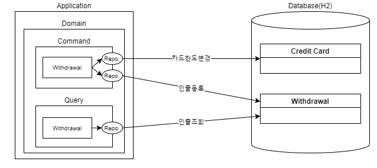

### 3.6.3 실습

- 프로젝트 구성

```
├─java
│  └─com
│      └─kt
│          └─cqrs
│              ├─command
│              │  ├─controller
│              │  ├─payload
│              │  ├─repository
│              │  │  └─entity
│              │  └─service
│              └─query
│                  ├─controller
│                  ├─repository
│                  │  └─entity
│                  └─service
└─resources
```


- Database

  - 파일명 : schema.sql

    ```sql
    CREATE TABLE IF NOT EXISTS CREDIT_CARD (
      ID            VARCHAR(255) PRIMARY KEY,
      INITIAL_LIMIT DECIMAL(18,2) NOT NULL,
      USED_LIMIT    DECIMAL(18,2) NOT NULL
    );
    
    CREATE TABLE IF NOT EXISTS WITHDRAWAL (
      ID     VARCHAR(255) PRIMARY KEY,
      CARD_ID   VARCHAR(255)    NOT NULL,
      AMOUNT DECIMAL(18,2) NOT NULL,
      foreign key (CARD_ID) references CREDIT_CARD(ID)
    );
    ```

  - 파일명 : data.sql

    ```sql
    INSERT INTO credit_card (ID, INITIAL_LIMIT, USED_LIMIT) VALUES
      ('3a3e99f0-5ad9-47fa-961d-d75fab32ef0e', 10000, 0);
    
    COMMIT;
    ```

    

- Dependency

  - 파일명 :  pom.xml

    ```xml
    <?xml version="1.0" encoding="UTF-8"?>
    <project xmlns="http://maven.apache.org/POM/4.0.0" xmlns:xsi="http://www.w3.org/2001/XMLSchema-instance"
             xsi:schemaLocation="http://maven.apache.org/POM/4.0.0 http://maven.apache.org/xsd/maven-4.0.0.xsd">
        <modelVersion>4.0.0</modelVersion>
    
        <groupId>icis.com</groupId>
        <artifactId>class-sync-with-entity</artifactId>
        <version>0.0.1-SNAPSHOT</version>
        <packaging>jar</packaging>
    
         <parent>
            <groupId>org.springframework.boot</groupId>
            <artifactId>spring-boot-starter-parent</artifactId>
            <version>2.7.2</version>
            <relativePath/> <!-- lookup parent from repository -->
        </parent>
    
        <properties>
            <project.build.sourceEncoding>UTF-8</project.build.sourceEncoding>
            <project.reporting.outputEncoding>UTF-8</project.reporting.outputEncoding>
            <java.version>17</java.version>
            <spring-cloud.version>2021.0.3</spring-cloud.version>
        </properties>
    
        <dependencyManagement>
            <dependencies>
                <dependency>
                    <groupId>org.springframework.cloud</groupId>
                    <artifactId>spring-cloud-dependencies</artifactId>
                    <version>${spring-cloud.version}</version>
                    <type>pom</type>
                    <scope>import</scope>
                </dependency>
            </dependencies>
        </dependencyManagement>
    
        <build>
            <plugins>
                <plugin>
                    <groupId>org.springframework.boot</groupId>
                    <artifactId>spring-boot-maven-plugin</artifactId>
                </plugin>
            </plugins>
        </build>
    
        <dependencies>
    		<dependency>
    			<groupId>org.springframework.boot</groupId>
    			<artifactId>spring-boot-starter-data-jdbc</artifactId>
    		</dependency>
            <dependency>
                <groupId>org.springframework.boot</groupId>
                <artifactId>spring-boot-starter-web</artifactId>
            </dependency>
            <dependency>
                <groupId>org.springframework.boot</groupId>
                <artifactId>spring-boot-starter-actuator</artifactId>
            </dependency>
    
            <dependency>
                <groupId>com.h2database</groupId>
                <artifactId>h2</artifactId>
            </dependency>
    
    		<dependency>
    			<groupId>org.projectlombok</groupId>
    			<artifactId>lombok</artifactId>
    			<scope>provided</scope>
    		</dependency>
    
    		<dependency>
    			<groupId>org.springframework.boot</groupId>
    			<artifactId>spring-boot-starter-test</artifactId>
    			<scope>test</scope>
    		</dependency>
    		
    		<dependency>
    			<groupId>junit</groupId>
    			<artifactId>junit</artifactId>
    			<scope>test</scope>
    		</dependency>
    		
    		<dependency>
    			<groupId>org.springdoc</groupId>
    			<artifactId>springdoc-openapi-ui</artifactId>
    			<version>1.6.6</version>
    		</dependency>
    		
    		<dependency>
    			<groupId>org.springframework.boot</groupId>
    			<artifactId>spring-boot-devtools</artifactId>
    			<scope>runtime</scope>
    			<optional>true</optional>
    		</dependency>		
    
        </dependencies>
    
    
    </project>
    
    ```

- Properties

  - 파일명 : application.yml

    ```yaml
    server:
      port: 8080
      
    spring:     
      devtools:
        restart:
          enabled: true
      h2:
        console:
          enabled: true
          settings:
            web-allow-others: true
          path: /h2-console        
      datasource:
        url: jdbc:h2:mem:testdb;DB_CLOSE_DELAY=-1
    ```

- Bootstrap

  - 파일명 : CqrsApplication.java

    ```java
    package com.kt.cqrs;
    
    import org.springframework.boot.SpringApplication;
    import org.springframework.boot.autoconfigure.SpringBootApplication;
    import org.springframework.web.servlet.config.annotation.EnableWebMvc;
    
    @EnableWebMvc
    @SpringBootApplication
    public class CqrsApplication {
    
    	public static void main(String[] args) {
    		SpringApplication.run(CqrsApplication.class, args);
    	}
    }
    
    ```

- Exception

  -  파일명 : NotEnoughMoneyException.java

```java
package com.kt.cqrs.command.service;

import java.util.UUID;

public class NotEnoughMoneyException extends RuntimeException {

	private static final long serialVersionUID = 1L;

	public NotEnoughMoneyException(UUID cardNo, long wanted, long availableBalance) {
        super(String.format("Card %s not able to withdraw %s. Balance is %s", cardNo, wanted, availableBalance));
    }

}

```

- Command

  - Entity

    - 파일명 : CreditCard.java

      ```java
      package com.kt.cqrs.command.repository.entity;
      
      import java.util.UUID;
      
      import org.springframework.data.annotation.Id;
      import org.springframework.data.relational.core.mapping.Table;
      
      import lombok.AllArgsConstructor;
      import lombok.Builder;
      import lombok.Getter;
      import lombok.NoArgsConstructor;
      import lombok.Setter;
      import lombok.ToString;
      
      @Getter
      @Setter
      @Builder
      @AllArgsConstructor
      @NoArgsConstructor
      @ToString
      @Table("CREDIT_CARD")
      public class CreditCard {
      
          @Id
          private UUID id;
          private long initialLimit;
          private long usedLimit;
      
      }
      
      ```

    - 파일명 : Withdrawal.java

      ```java
      package com.kt.cqrs.command.repository.entity;
      
      import java.util.UUID;
      
      import org.springframework.data.annotation.Id;
      import org.springframework.data.annotation.Transient;
      import org.springframework.data.domain.Persistable;
      import org.springframework.data.relational.core.mapping.Table;
      
      import lombok.AllArgsConstructor;
      import lombok.Builder;
      import lombok.Getter;
      import lombok.NoArgsConstructor;
      import lombok.Setter;
      import lombok.ToString;
      
      @Getter
      @Setter
      @Builder
      @AllArgsConstructor
      @NoArgsConstructor
      @ToString
      @Table("WITHDRAWAL")
      public class Withdrawal implements Persistable<UUID>{
      
          @Transient
          private boolean isNew = false;
          
          @Id
          private UUID id;
          private long amount;
          private UUID cardId;
          
          public static Withdrawal newWithdrawal(UUID id, long amount, UUID cardId) {
          	Withdrawal withdrawal = new Withdrawal(true, id, amount, cardId);
              return withdrawal;
          }
      
          @Override
          public boolean isNew() {
              return isNew;
          }
      
      }
      
      ```

      

  - Rpository

    - 파일명 : CreditCardRepository.java

      ```java
      package com.kt.cqrs.command.repository;
      
      import java.util.UUID;
      import org.springframework.data.repository.CrudRepository;
      import com.kt.cqrs.command.repository.entity.CreditCard;
      
      public interface CreditCardRepository extends CrudRepository<CreditCard, UUID> {
      }
      
      ```

    - 파일명 : WithdrawalCommandRepository.java

      ```java
      package com.kt.cqrs.command.repository;
      
      import java.util.UUID;
      import org.springframework.data.repository.CrudRepository;
      import com.kt.cqrs.command.repository.entity.Withdrawal;
      
      public interface WithdrawalCommandRepository extends CrudRepository<Withdrawal, UUID> {
      }
      
      ```

      

  - Service

    - 파일명 : WithdrawalCommandService.java

      ```java
      package com.kt.cqrs.command.service;
      
      import java.util.UUID;
      
      import org.springframework.stereotype.Service;
      import org.springframework.transaction.annotation.Transactional;
      
      import com.kt.cqrs.command.repository.CreditCardRepository;
      import com.kt.cqrs.command.repository.WithdrawalRepository;
      import com.kt.cqrs.command.repository.entity.CreditCard;
      import com.kt.cqrs.command.repository.entity.Withdrawal;
      
      import lombok.RequiredArgsConstructor;
      import lombok.extern.slf4j.Slf4j;
      
      @Slf4j
      @Service
      @RequiredArgsConstructor
      public class WithdrawalCommandService {
      
          private final CreditCardRepository creditCardRepository;
          private final WithdrawalCommandRepository withdrawalCommandRepository;
      
          @Transactional
          public void withdraw(UUID cardId, long amount) {
              CreditCard creditCard = creditCardRepository.findById(cardId)
                      .orElseThrow(() -> new IllegalStateException("Cannot find card with id " + cardId));
              withdraw(creditCard, amount);
      		withdrawalCommandRepository.save(Withdrawal.newWithdrawal(UUID.randomUUID(), amount, creditCard.getId()));
          }
      
      	public void withdraw(CreditCard creditCard, long amount) {
      		if (thereIsMoneyToWithdraw(creditCard, amount)) {
      			creditCard.setUsedLimit(creditCard.getUsedLimit() + amount);
      			log.info("creditCard = {}", creditCard);
      			creditCardRepository.save(creditCard);
      		} else {
      			throw new NotEnoughMoneyException(creditCard.getId(), amount, availableBalance(creditCard));
      		}
      	}
      
      	public long availableBalance(CreditCard creditCard) {
      		return creditCard.getInitialLimit() - creditCard.getUsedLimit();
      	}
      
      	private boolean thereIsMoneyToWithdraw(CreditCard creditCard, long amount) {
      		return availableBalance(creditCard) >= amount;
      	}
      	
      }
      ```

  - Payload

    - 파일명 : WithdrawalCommand.java

      ```java
      package com.kt.cqrs.command.payload;
      
      import java.util.UUID;
      
      import lombok.AllArgsConstructor;
      import lombok.Data;
      import lombok.NoArgsConstructor;
      
      @Data
      @NoArgsConstructor
      @AllArgsConstructor
      public class WithdrawalCommand {
          private UUID card;
          private long amount;
      
      }
      
      ```

  - Controller

    - 파일명 : WithdrawalCommandController.java

      ```java
      package com.kt.cqrs.command.controller;
      
      import org.springframework.http.ResponseEntity;
      import org.springframework.web.bind.annotation.PostMapping;
      import org.springframework.web.bind.annotation.RequestBody;
      import org.springframework.web.bind.annotation.RequestMapping;
      import org.springframework.web.bind.annotation.RestController;
      
      import com.kt.cqrs.command.payload.WithdrawalCommand;
      import com.kt.cqrs.command.service.WithdrawalCommandService;
      
      import lombok.RequiredArgsConstructor;
      
      @RestController
      @RequestMapping("/withdrawal")
      @RequiredArgsConstructor
      class WithdrawalCommandController {
      	
          private final WithdrawalCommandService withdrawalCommandService;
      
          @PostMapping
          ResponseEntity<?> withdraw(@RequestBody WithdrawalCommand withdrawalCommand) {
          	withdrawalCommandService.withdraw(withdrawalCommand.getCard(), withdrawalCommand.getAmount());
              return ResponseEntity.ok().build();
          }
      
      }
      
      ```

  

- Query

  - Entity

    - 파일명 : Withdrawal.java

    ```java
    package com.kt.cqrs.query.repository.entity;
    
    import java.util.UUID;
    
    import org.springframework.data.annotation.Id;
    import org.springframework.data.relational.core.mapping.Table;
    
    import lombok.AllArgsConstructor;
    import lombok.Builder;
    import lombok.Getter;
    import lombok.NoArgsConstructor;
    import lombok.Setter;
    import lombok.ToString;
    
    @Getter
    @Setter
    @Builder
    @AllArgsConstructor
    @NoArgsConstructor
    @ToString
    @Table("WITHDRAWAL")
    public class Withdrawal{
    
        @Id
        private UUID id;
        private long amount;
        private UUID cardId;
       
    
    }
    
    ```

    

  - Repository

    - 파일명 : WithdrawalRepository.java

    ```java
    package com.kt.cqrs.query.repository;
    
    import java.util.List;
    import java.util.UUID;
    import org.springframework.data.repository.CrudRepository;
    import com.kt.cqrs.query.repository.entity.Withdrawal;
    
    public interface WithdrawalRepository extends CrudRepository<Withdrawal, UUID> {
        List<Withdrawal> findByCardId(UUID cardId);
    }
    
    ```

    

  - Service

    -  파일명 : WithdrawalQueryService.java

    ```java
    package com.kt.cqrs.query.service;
    
    import java.util.List;
    import java.util.UUID;
    
    import org.springframework.stereotype.Service;
    
    import com.kt.cqrs.query.repository.WithdrawalRepository;
    import com.kt.cqrs.query.repository.entity.Withdrawal;
    
    import lombok.RequiredArgsConstructor;
    import lombok.extern.slf4j.Slf4j;
    
    @Slf4j
    @Service
    @RequiredArgsConstructor
    public class WithdrawalQueryService {
    
        private final WithdrawalRepository withdrawalRepository;
    
    	public List<Withdrawal> withdraw(UUID cardId) {
    		return withdrawalRepository.findByCardId(cardId);
    	}
    }
    
    ```

  - Controller

    - 파일명 : WithdrawalQueryController.java

    ```java
    package com.kt.cqrs.query.controller;
    
    import java.util.List;
    import java.util.UUID;
    
    import javax.websocket.server.PathParam;
    
    import org.springframework.http.ResponseEntity;
    import org.springframework.web.bind.annotation.GetMapping;
    import org.springframework.web.bind.annotation.RequestMapping;
    import org.springframework.web.bind.annotation.RestController;
    
    import com.kt.cqrs.query.repository.entity.Withdrawal;
    import com.kt.cqrs.query.service.WithdrawalQueryService;
    
    import lombok.RequiredArgsConstructor;
    
    @RestController
    @RequestMapping("/withdrawal")
    @RequiredArgsConstructor
    class WithdrawalQueryController {
    	
        private final WithdrawalQueryService withdrawalQueryService;
    
        @GetMapping
        ResponseEntity<List<Withdrawal>> withdrawals(@PathParam("cardId") String cardId) {
            return ResponseEntity.ok().body(withdrawalQueryService.withdraw(UUID.fromString(cardId)));
        }
    }
    
    ```


### 3.6.4 테스트

- 키드인출(명령)

```shell
curl localhost:8080/withdrawal -X POST --header 'Content-Type: application/json' -d '{"cardId":"3a3e99f0-5ad9-47fa-961d-d75fab32ef0e", "amount": 10.00}' --verbose
```

- 쿼리로 확인:

```shell
curl http://localhost:8080/withdrawal?cardId=3a3e99f0-5ad9-47fa-961d-d75fab32ef0e --verbose
```

- 예상 결과:

```shell
[{"amount":10.00}]
```

- 데이터 확인

```http
http://localhost:8080/h2-console/
```


## 3.7. 단일 프로세스로 처리되는 동기식 CQRS - Dto

### 3.7.1. 개요

- 코드레벨에서 명령과 조회를 분리

- 명령과 조회 동기로 처리

- 명령의 경우   Domain 기반의 Entity 형태로 조회

- 조희의 경우 Temaplate 또는 Native Query 기반의 Dto 형태로 조회

- 도메인의 Aggregate Root 일관성 보장 및 다양한 조회모델에 대응이 가능

  

### 3.7.2. 아키텍처 구성


### 3.7.3. 실습

- **프로젝트 구조**

  ```
  ├─java
  │  └─com
  │      └─kt
  │          └─cqrs
  │              ├─command
  │              │  ├─controller
  │              │  ├─payload
  │              │  ├─repository
  │              │  │  └─entity
  │              │  └─servcie
  │              └─query
  │                  ├─controller
  │                  ├─payload
  │                  └─service
  └─resources
  ```

- Database

  - 파일명 : .java schema.sql

    ```sql
    CREATE TABLE IF NOT EXISTS CREDIT_CARD (
      ID            VARCHAR(255) PRIMARY KEY,
      INITIAL_LIMIT DECIMAL(18,2) NOT NULL,
      USED_LIMIT    DECIMAL(18,2) NOT NULL
    );
    
    CREATE TABLE IF NOT EXISTS WITHDRAWAL (
      ID     VARCHAR(255) PRIMARY KEY,
      CARD_ID   VARCHAR(255)    NOT NULL,
      AMOUNT DECIMAL(18,2) NOT NULL,
      foreign key (CARD_ID) references CREDIT_CARD(ID)
    );
    ```

  - 파일명: data.sql

    ```sql
    INSERT INTO credit_card (ID, INITIAL_LIMIT, USED_LIMIT) VALUES
      ('3a3e99f0-5ad9-47fa-961d-d75fab32ef0e', 10000, 0);
    
    COMMIT;
    ```

    

- Dependency
  -  파일명 : pom.xml
  ```xml
  <?xml version="1.0" encoding="UTF-8"?>
  <project xmlns="http://maven.apache.org/POM/4.0.0" xmlns:xsi="http://www.w3.org/2001/XMLSchema-instance"
           xsi:schemaLocation="http://maven.apache.org/POM/4.0.0 http://maven.apache.org/xsd/maven-4.0.0.xsd">
      <modelVersion>4.0.0</modelVersion>
  
      <groupId>icis.com</groupId>
      <artifactId>class-sync-with-dto</artifactId>
      <version>0.0.1-SNAPSHOT</version>
      <packaging>jar</packaging>
      <parent>
          <groupId>org.springframework.boot</groupId>
          <artifactId>spring-boot-starter-parent</artifactId>
          <version>2.7.2</version>
          <relativePath/> <!-- lookup parent from repository -->
      </parent>
  
      <properties>
          <project.build.sourceEncoding>UTF-8</project.build.sourceEncoding>
          <project.reporting.outputEncoding>UTF-8</project.reporting.outputEncoding>
          <java.version>17</java.version>
          <spring-cloud.version>2021.0.3</spring-cloud.version>
      </properties>
  
      <dependencyManagement>
          <dependencies>
              <dependency>
                  <groupId>org.springframework.cloud</groupId>
                  <artifactId>spring-cloud-dependencies</artifactId>
                  <version>${spring-cloud.version}</version>
                  <type>pom</type>
                  <scope>import</scope>
              </dependency>
          </dependencies>
      </dependencyManagement>
  
      <build>
          <plugins>
              <plugin>
                  <groupId>org.springframework.boot</groupId>
                  <artifactId>spring-boot-maven-plugin</artifactId>
              </plugin>
          </plugins>
      </build>
  
      <dependencies>
          <dependency>
              <groupId>org.springframework.boot</groupId>
              <artifactId>spring-boot-starter-data-jdbc</artifactId>
          </dependency>
          <dependency>
              <groupId>org.springframework.boot</groupId>
              <artifactId>spring-boot-starter-web</artifactId>
          </dependency>
          <dependency>
              <groupId>org.springframework.boot</groupId>
              <artifactId>spring-boot-starter-actuator</artifactId>
          </dependency>
  
          <dependency>
              <groupId>com.h2database</groupId>
              <artifactId>h2</artifactId>
          </dependency>
  
  		<dependency>
  			<groupId>org.projectlombok</groupId>
  			<artifactId>lombok</artifactId>
  			<scope>provided</scope>
  		</dependency>
  
  		<dependency>
  			<groupId>org.springframework.boot</groupId>
  			<artifactId>spring-boot-starter-test</artifactId>
  			<scope>test</scope>
  		</dependency>
  		
  		<dependency>
  			<groupId>junit</groupId>
  			<artifactId>junit</artifactId>
  			<scope>test</scope>
  		</dependency>
  		
  		<dependency>
  			<groupId>org.springdoc</groupId>
  			<artifactId>springdoc-openapi-ui</artifactId>
  			<version>1.6.6</version>
  		</dependency>
  		
  		<dependency>
  			<groupId>org.springframework.boot</groupId>
  			<artifactId>spring-boot-devtools</artifactId>
  			<scope>runtime</scope>
  			<optional>true</optional>
  		</dependency>
      </dependencies>
  
  </project>
  
  ```
  
- Properties
  -  파일명 : application.yml
  ```yaml
  server:
    port: 8080
    
  spring:     
    devtools:
      restart:
        enabled: true
    h2:
      console:
        enabled: true
        settings:
          web-allow-others: true
        path: /h2-console        
    datasource:
      url: jdbc:h2:mem:testdb;DB_CLOSE_DELAY=-1
  ```
  
- Bootstrap
  -  파일명 : CqrsApplication.java
  ```java
  package com.kt.cqrs;
  
  import org.springframework.boot.SpringApplication;
  import org.springframework.boot.autoconfigure.SpringBootApplication;
  import org.springframework.web.servlet.config.annotation.EnableWebMvc;
  
  @EnableWebMvc
  @SpringBootApplication
  public class CqrsApplication {
  
  	public static void main(String[] args) {
  		SpringApplication.run(CqrsApplication.class, args);
  	}
  }
  ```
  
- Exception

  -  파일명 : NotEnoughMoneyException.java
  ```java
  package com.kt.cqrs.command.servcie;

  import java.util.UUID;
  
  public class NotEnoughMoneyException extends RuntimeException {
  
  	private static final long serialVersionUID = 1L;
  
  	public NotEnoughMoneyException(UUID cardNo, long wanted, long availableBalance) {
          super(String.format("Card %s not able to withdraw %s. Balance is %s", cardNo, wanted, availableBalance));
      }
  
  }
  
  ```

- Command

  - Entity

    - 파일명 : CreditCard.java

    ```java
    package com.kt.cqrs.command.repository.entity;
    
    import java.util.UUID;
    
    import org.springframework.data.annotation.Id;
    import org.springframework.data.relational.core.mapping.Table;
    
    import lombok.AllArgsConstructor;
    import lombok.Builder;
    import lombok.Getter;
    import lombok.NoArgsConstructor;
    import lombok.Setter;
    import lombok.ToString;
    
    @Getter
    @Setter
    @Builder
    @AllArgsConstructor
    @NoArgsConstructor
    @ToString
    @Table("CREDIT_CARD")
    public class CreditCard {
    
        @Id
        private UUID id;
        private long initialLimit;
        private long usedLimit;
    
    }
    
    ```
    
  - Rpository
  
  - 파일명 : CreditCardRepository.java
  
  ```java
    package com.kt.cqrs.command.repository;
  
    import java.util.UUID;
    import org.springframework.data.repository.CrudRepository;
    import com.kt.cqrs.command.repository.entity.CreditCard;
    
    public interface CreditCardRepository extends CrudRepository<CreditCard, UUID> {
    }
  ```
  
  - Service
  
  -  파일명 : WithdrawalCommandService.java
  
  ```java
    package com.kt.cqrs.command.servcie;
  
    import java.util.UUID;
    
    import org.springframework.jdbc.core.JdbcTemplate;
    import org.springframework.stereotype.Service;
    import org.springframework.transaction.annotation.Transactional;
    import com.kt.cqrs.command.repository.CreditCardRepository;
    import com.kt.cqrs.command.repository.entity.CreditCard;
    
    import lombok.RequiredArgsConstructor;
    import lombok.extern.slf4j.Slf4j;
    
    @Slf4j
    @Service
    @RequiredArgsConstructor
    public class WithdrawalCommandService {
    
        private final CreditCardRepository creditCardRepository;
        private final JdbcTemplate jdbcTemplate;
    
        @Transactional
        public void withdraw(UUID cardId, long amount) {
            CreditCard creditCard = creditCardRepository.findById(cardId)
                    .orElseThrow(() -> new IllegalStateException("Cannot find card with id " + cardId));
            withdraw(creditCard, amount);
            jdbcTemplate.update("INSERT INTO WITHDRAWAL(ID, CARD_ID, AMOUNT) VALUES (?,?,?)", UUID.randomUUID(), cardId, amount);
        }
        
    	public void withdraw(CreditCard creditCard, long amount) {
    		if (thereIsMoneyToWithdraw(creditCard, amount)) {
    			creditCard.setUsedLimit(creditCard.getUsedLimit() + amount);
    			log.info("creditCard = {}", creditCard);
    			creditCardRepository.save(creditCard);
    		} else {
    			throw new NotEnoughMoneyException(creditCard.getId(), amount, availableBalance(creditCard));
    		}
    	}
    
    	public long availableBalance(CreditCard creditCard) {
    		return creditCard.getInitialLimit() - creditCard.getUsedLimit();
    	}
    
    	private boolean thereIsMoneyToWithdraw(CreditCard creditCard, long amount) {
    		return availableBalance(creditCard) >= amount;
    	}
    
    }
    
  ```
  
  - Payload
  
  - 파일명 : WithdrawalCommand.java
  
  ```java
    package com.kt.cqrs.command.payload;
  
    import java.util.UUID;
    import lombok.AllArgsConstructor;
    import lombok.Data;
    import lombok.NoArgsConstructor;
    
    @Data
    @NoArgsConstructor
    @AllArgsConstructor
    public class WithdrawalCommand {
        private UUID card;
        private long amount;
    }
  ```
  
  - Controller
  
  - 파일명 : WithdrawalCommandService.java
  
  ```java
    package com.kt.cqrs.command.controller;
  
    import org.springframework.http.ResponseEntity;
    import org.springframework.web.bind.annotation.PostMapping;
    import org.springframework.web.bind.annotation.RequestBody;
    import org.springframework.web.bind.annotation.RequestMapping;
    import org.springframework.web.bind.annotation.RestController;
    import com.kt.cqrs.command.payload.WithdrawalCommand;
    import com.kt.cqrs.command.servcie.WithdrawalCommandService;
    import lombok.RequiredArgsConstructor;
    
    @RestController
    @RequestMapping("/withdrawal")
    @RequiredArgsConstructor
    class WithdrawalCommandController {
    
        private final WithdrawalCommandService withdrawalService;
    
        @PostMapping
        ResponseEntity<?> withdraw(@RequestBody WithdrawalCommand withdrawalCommand) {
            withdrawalService.withdraw(withdrawalCommand.getCard(), withdrawalCommand.getAmount());
            return ResponseEntity.ok().build();
        }
    
    }
  ```
  
  
  
- Query

  - Service

    -  파일명 : WithdrawalQueryService.java

    ```java
    package com.kt.cqrs.query.service;
    
    import java.util.List;
    import java.util.UUID;
    
    import org.springframework.jdbc.core.BeanPropertyRowMapper;
    import org.springframework.jdbc.core.JdbcTemplate;
    import org.springframework.stereotype.Service;
    import com.kt.cqrs.query.payload.WithdrawalDto;
    import lombok.RequiredArgsConstructor;
    import lombok.extern.slf4j.Slf4j;
    
    @Slf4j
    @Service
    @RequiredArgsConstructor
    public class WithdrawalQueryService {
    
        private final JdbcTemplate jdbcTemplate;
    
    	@SuppressWarnings("deprecation")
    	public List<WithdrawalDto> withdraw(UUID cardId) {
    		return jdbcTemplate.query("SELECT * FROM WITHDRAWAL WHERE CARD_ID = ?", new Object[]{cardId}, new BeanPropertyRowMapper<>(WithdrawalDto.class));
        }
    
    }
    
    ```
    
  - Payload

    - 파일명: WithdrawalDto.java

    ```java
    package com.kt.cqrs.query.payload;
    
    import java.util.UUID;
    import lombok.AllArgsConstructor;
    import lombok.Data;
    import lombok.NoArgsConstructor;
    
    @Data
    @NoArgsConstructor
    @AllArgsConstructor
    public class WithdrawalDto {
        private UUID cardId;
        private long amount;
    
    }
    
    ```
    
  - Controller
  
  - 파일명 : WithdrawalQueryController.java
  
  ```java
    package com.kt.cqrs.query.controller;
  
    import java.util.List;
    import java.util.UUID;
    import javax.websocket.server.PathParam;
    import org.springframework.http.ResponseEntity;
    import org.springframework.web.bind.annotation.GetMapping;
    import org.springframework.web.bind.annotation.RequestMapping;
    import org.springframework.web.bind.annotation.RestController;
    import com.kt.cqrs.query.payload.WithdrawalDto;
    import com.kt.cqrs.query.service.WithdrawalQueryService;
    import lombok.RequiredArgsConstructor;
    
    @RestController
    @RequestMapping("/withdrawal")
    @RequiredArgsConstructor
    class WithdrawalQueryController {
    
        private final WithdrawalQueryService withdrawalQueryService;
    
        @GetMapping
        ResponseEntity<List<WithdrawalDto>> withdrawals(@PathParam("cardId") String cardId) {
            return ResponseEntity.ok().body(withdrawalQueryService.withdraw(UUID.fromString(cardId)));
        }
    
    }		
  ```
  
  

### 3.7.4. 테스트

- 키드인출(명령)

```
curl localhost:8080/withdrawal -X POST --header 'Content-Type: application/json' -d '{"card":"3a3e99f0-5ad9-47fa-961d-d75fab32ef0e", "amount": 10.00}' --verbose
```

- 쿼리로 확인:

```
curl http://localhost:8080/withdrawal?cardId=3a3e99f0-5ad9-47fa-961d-d75fab32ef0e --verbose
```

- 예상 결과:

```
[{"amount":10.00}]
```

- 데이터 확인

```http
http://localhost:8080/h2-console/
```


## 3.8. 단일 서비스로 처리되는 이벤트 기반 CQRS - ApplicationEvent

### 3.8.1. 개요

- 코드레벨에서 명령과 조회를 분리

- 명령모델에 대해 이벤트 기반으로 처리를하여 도메인의 역할과 책임을 구분하여 응집도를 낮출수 있음

  

### 3.8.2. 아키텍처 구성


### 3.8.3 실습

- 패키지 구조

  ```
  ├─java
  │  └─com
  │      └─kt
  │          └─cqrs
  │              ├─command
  │              │  ├─controller
  │              │  ├─event
  │              │  ├─payload
  │              │  ├─repository
  │              │  │  └─entity
  │              │  └─service
  │              └─query
  │                  ├─controller
  │                  ├─payload
  │                  └─service
  ```
  
- Database

  - 파일명 : schema.sql

    ```sql
    CREATE TABLE IF NOT EXISTS CREDIT_CARD (
      ID            VARCHAR(255) PRIMARY KEY,
      INITIAL_LIMIT DECIMAL(18,2) NOT NULL,
      USED_LIMIT    DECIMAL(18,2) NOT NULL
    );
    
    CREATE TABLE IF NOT EXISTS WITHDRAWAL (
      ID     VARCHAR(255) PRIMARY KEY,
      CARD_ID   VARCHAR(255)    NOT NULL,
      AMOUNT DECIMAL(18,2) NOT NULL
    );
    ```
  
- 파일명 : data.sql
  
  ```sql
    INSERT INTO credit_card (ID, INITIAL_LIMIT, USED_LIMIT) VALUES
      ('3a3e99f0-5ad9-47fa-961d-d75fab32ef0e', 10000, 0);
    
    COMMIT;
  ```
- Dependency
  - 파일명 : pom.xml
  
    ```xml
    <?xml version="1.0" encoding="UTF-8"?>
    <project xmlns="http://maven.apache.org/POM/4.0.0" xmlns:xsi="http://www.w3.org/2001/XMLSchema-instance"
             xsi:schemaLocation="http://maven.apache.org/POM/4.0.0 http://maven.apache.org/xsd/maven-4.0.0.xsd">
        <modelVersion>4.0.0</modelVersion>
    
        <groupId>icis.com</groupId>
        <artifactId>class-async</artifactId>
        <version>0.0.1-SNAPSHOT</version>
        <packaging>jar</packaging>
        <parent>
            <groupId>org.springframework.boot</groupId>
            <artifactId>spring-boot-starter-parent</artifactId>
            <version>2.7.2</version>
            <relativePath/> <!-- lookup parent from repository -->
        </parent>
    
        <properties>
            <project.build.sourceEncoding>UTF-8</project.build.sourceEncoding>
            <project.reporting.outputEncoding>UTF-8</project.reporting.outputEncoding>
            <java.version>17</java.version>
            <spring-cloud.version>2021.0.3</spring-cloud.version>
        </properties>
    
        <dependencyManagement>
            <dependencies>
                <dependency>
                    <groupId>org.springframework.cloud</groupId>
                    <artifactId>spring-cloud-dependencies</artifactId>
                    <version>${spring-cloud.version}</version>
                    <type>pom</type>
                    <scope>import</scope>
                </dependency>
            </dependencies>
        </dependencyManagement>
    
        <build>
            <plugins>
                <plugin>
                    <groupId>org.springframework.boot</groupId>
                    <artifactId>spring-boot-maven-plugin</artifactId>
                </plugin>
            </plugins>
        </build>
    
        <dependencies>
            <dependency>
                <groupId>org.springframework.boot</groupId>
                <artifactId>spring-boot-starter-data-jdbc</artifactId>
            </dependency>
            <dependency>
                <groupId>org.springframework.boot</groupId>
                <artifactId>spring-boot-starter-web</artifactId>
            </dependency>
            <dependency>
                <groupId>org.springframework.boot</groupId>
                <artifactId>spring-boot-starter-actuator</artifactId>
            </dependency>
    		<dependency>
    			<groupId>org.springframework.boot</groupId>
    			<artifactId>spring-boot-configuration-processor</artifactId>
    			<optional>true</optional>
    		</dependency>
            <dependency>
                <groupId>com.h2database</groupId>
                <artifactId>h2</artifactId>
            </dependency>
    
    		<dependency>
    			<groupId>org.projectlombok</groupId>
    			<artifactId>lombok</artifactId>
    			<scope>provided</scope>
    		</dependency>
    
    		<dependency>
    			<groupId>org.springframework.boot</groupId>
    			<artifactId>spring-boot-starter-test</artifactId>
    			<scope>test</scope>
    		</dependency>
    
    		<dependency>
    			<groupId>junit</groupId>
    			<artifactId>junit</artifactId>
    			<scope>test</scope>
    		</dependency>
    		
    		<dependency>
    			<groupId>org.springdoc</groupId>
    			<artifactId>springdoc-openapi-ui</artifactId>
    			<version>1.6.6</version>
    		</dependency>
    
        </dependencies>
    
    
    </project>
    
    ```
- Properties
  - 파일명 : resources/application.yaml	
  
    ```yaml
    server:
      port: 8080
      
    spring:     
      devtools:
        restart:
          enabled: true
      h2:
        console:
          enabled: true
          settings:
            web-allow-others: true
          path: /h2-console        
      datasource:
        url: jdbc:h2:mem:testdb;DB_CLOSE_DELAY=-1
    ```
- Bootstrap
  - 파일명 :  
  
    ```java
    package com.kt.cqrs;
    
    import org.springframework.boot.SpringApplication;
    import org.springframework.boot.autoconfigure.SpringBootApplication;
    
    @SpringBootApplication
    public class CqrsApplication {
    
    	public static void main(String[] args) {
    		SpringApplication.run(CqrsApplication.class, args);
    	}
    }
    
    ```
- Event

  - 파일명 : CardWithdraw.java

    ```java
    package com.kt.cqrs.command.event;
    
    import java.util.UUID;
    
    import lombok.AllArgsConstructor;
    import lombok.Builder;
    import lombok.Getter;
    import lombok.NoArgsConstructor;
    import lombok.Setter;
    import lombok.ToString;
    
    @Getter
    @Setter
    @Builder
    @AllArgsConstructor
    @NoArgsConstructor
    @ToString
    public class CardWithdraw {
    
        private UUID cardNo;
        private long amount;
    
    }
    
    ```

  - 파일명 : EventHandler.java

    ```java
    package com.kt.cqrs.command.event;
    
    import java.util.UUID;
    
    import org.springframework.context.event.EventListener;
    import org.springframework.jdbc.core.JdbcTemplate;
    import org.springframework.scheduling.annotation.Async;
    import org.springframework.stereotype.Service;
    
    import lombok.RequiredArgsConstructor;
    
    @Service
    @RequiredArgsConstructor
    class EventHandler {
    
        private final JdbcTemplate jdbcTemplate;
    
        @Async
        @EventListener
        public void addWithdrawalOnCardWithdrawn(CardWithdraw event) {
            jdbcTemplate.update("INSERT INTO WITHDRAWAL(ID, CARD_ID, AMOUNT) VALUES (?,?,?)", UUID.randomUUID(), event.getCardNo(), event.getAmount());
        }
    }

    ```
    
    

- Command

  - Entity

    - 파일명 : 

    ```java
    package com.kt.cqrs.command.repository.entity;
    
    import java.util.UUID;
    
    import org.springframework.data.annotation.Id;
    import org.springframework.data.relational.core.mapping.Table;
    
    import lombok.AllArgsConstructor;
    import lombok.Builder;
    import lombok.Getter;
    import lombok.NoArgsConstructor;
    import lombok.Setter;
    import lombok.ToString;
    
    @Getter
    @Setter
    @Builder
    @AllArgsConstructor
    @NoArgsConstructor
    @ToString
    @Table("CREDIT_CARD")
    public class CreditCard {
        @Id
        private UUID id;
        private long initialLimit;
        private long usedLimit;
    }
    
    ```
    
  - Rpository

    - 파일명 : 

    ```java
    package com.kt.cqrs.command.repository;
    
    import java.util.UUID;
    import org.springframework.data.repository.CrudRepository;
    import com.kt.cqrs.command.repository.entity.CreditCard;
    
    public interface CreditCardRepository extends CrudRepository<CreditCard, UUID> {
    }
    
    ```
    
  - Service

    -  파일명 : 

    ```java
    package com.kt.cqrs.command.service;
    
    import java.util.UUID;
    
    import org.springframework.context.ApplicationEventPublisher;
    import org.springframework.stereotype.Service;
    import org.springframework.transaction.annotation.Transactional;
    
    import com.kt.cqrs.command.repository.CreditCardRepository;
    import com.kt.cqrs.command.repository.entity.CreditCard;
    import com.kt.cqrs.event.CardWithdraw;
    
    import lombok.RequiredArgsConstructor;
    import lombok.extern.slf4j.Slf4j;
    
    @Slf4j
    @Service
    @RequiredArgsConstructor
    public class WithdrawalCommandService {
    
        private final CreditCardRepository creditCardRepository;
        private final ApplicationEventPublisher applicationEventPublisher;
    
        @Transactional
        public void withdraw(UUID cardId, long amount) {
            CreditCard creditCard = creditCardRepository.findById(cardId)
                    .orElseThrow(() -> new IllegalStateException("Cannot find card with id " + cardId));
            CardWithdraw event = withdraw(creditCard, amount);
            applicationEventPublisher.publishEvent(event);
        }
        
    	public CardWithdraw withdraw(CreditCard creditCard, long amount) {
    		if (thereIsMoneyToWithdraw(creditCard, amount)) {
    			creditCard.setUsedLimit(creditCard.getUsedLimit() + amount);
    			log.info("creditCard = {}", creditCard);
    			creditCardRepository.save(creditCard);
    		} else {
    			throw new NotEnoughMoneyException(creditCard.getId(), amount, availableBalance(creditCard));
    		}
    		
    		return new CardWithdraw(creditCard.getId(), amount);
    	}
    
    	public long availableBalance(CreditCard creditCard) {
    		return creditCard.getInitialLimit() - creditCard.getUsedLimit();
    	}
    
    	private boolean thereIsMoneyToWithdraw(CreditCard creditCard, long amount) {
    		return availableBalance(creditCard) >= amount;
    	}
    }
    
    ```
    
    - 파일명 : NotEnoughMoneyException.java
    
    ```java
    package com.kt.cqrs.command.service;
    
    import java.util.UUID;
    
    public class NotEnoughMoneyException extends RuntimeException {
    
    	private static final long serialVersionUID = 1L;
    
    	public NotEnoughMoneyException(UUID cardNo, long wanted, long availableBalance) {
            super(String.format("Card %s not able to withdraw %s. Balance is %s", cardNo, wanted, availableBalance));
        }
    }
    ```
    
  - Payload

    - 파일명 : WithdrawalCommand.java

    ```java
    package com.kt.cqrs.command.payload;
    
    import java.util.UUID;
    
    import lombok.AllArgsConstructor;
    import lombok.Data;
    import lombok.NoArgsConstructor;
    
    @Data
    @NoArgsConstructor
    @AllArgsConstructor
    public class WithdrawalCommand {
        private UUID card;
        private long amount;
    
    }
    
    ```
    
  - Controller

    - 파일명 : WithdrawalCommandController.java

    ```java
    package com.kt.cqrs.command.controller;
    
    import org.springframework.http.ResponseEntity;
    import org.springframework.web.bind.annotation.PostMapping;
    import org.springframework.web.bind.annotation.RequestBody;
    import org.springframework.web.bind.annotation.RequestMapping;
    import org.springframework.web.bind.annotation.RestController;
    
    import com.kt.cqrs.command.payload.WithdrawalCommand;
    import com.kt.cqrs.command.service.WithdrawalCommandService;
    
    import lombok.RequiredArgsConstructor;
    
    @RestController
    @RequestMapping("/withdrawal")
    @RequiredArgsConstructor
    class WithdrawalCommandController {
    
        private final WithdrawalCommandService withdrawalCommandService;
    
        @PostMapping
        ResponseEntity<?> withdraw(@RequestBody WithdrawalCommand withdrawalCommand) {
        	withdrawalCommandService.withdraw(withdrawalCommand.getCard(), withdrawalCommand.getAmount());
            return ResponseEntity.ok().build();
        }
    
    }
    
    ```

  

- Query

  - Service

    -  파일명 : WithdrawalQueryService.java

    ```java
    package com.kt.cqrs.query.service;
    
    import java.util.List;
    import java.util.UUID;
    
    import org.springframework.jdbc.core.BeanPropertyRowMapper;
    import org.springframework.jdbc.core.JdbcTemplate;
    import org.springframework.stereotype.Service;
    
    import com.kt.cqrs.query.payload.WithdrawalDto;
    
    import lombok.RequiredArgsConstructor;
    import lombok.extern.slf4j.Slf4j;
    
    @Slf4j
    @Service
    @RequiredArgsConstructor
    public class WithdrawalQueryService {
    
        private final JdbcTemplate jdbcTemplate;
    
    
    	@SuppressWarnings("deprecation")
    	public List<WithdrawalDto> withdraw(UUID cardId) {
    		return jdbcTemplate.query("SELECT * FROM WITHDRAWAL WHERE CARD_ID = ?", new Object[]{cardId}, new BeanPropertyRowMapper<>(WithdrawalDto.class));
        }
    }
    
    ```
    
  - Payload
  
    - 파일명 : WithdrawalDto.java
  
    ```java
    package com.kt.cqrs.query.payload;
    
    import java.util.UUID;
    
    import lombok.AllArgsConstructor;
    import lombok.Data;
    import lombok.NoArgsConstructor;
    
    @Data
    @NoArgsConstructor
    @AllArgsConstructor
    public class WithdrawalDto {
        private UUID cardId;
        private long amount;
    
    }
    
    ```
    
  - Controller
  
    - 파일명 : WithdrawalQueryController.java
  
    ```java
    package com.kt.cqrs.query.controller;
    
    import java.util.List;
    import java.util.UUID;
    
    import javax.websocket.server.PathParam;
    
    import org.springframework.http.ResponseEntity;
    import org.springframework.web.bind.annotation.GetMapping;
    import org.springframework.web.bind.annotation.RequestMapping;
    import org.springframework.web.bind.annotation.RestController;
    
    import com.kt.cqrs.query.payload.WithdrawalDto;
    import com.kt.cqrs.query.service.WithdrawalQueryService;
    
    import lombok.RequiredArgsConstructor;
    
    @RestController
    @RequestMapping("/withdrawal")
    @RequiredArgsConstructor
    class WithdrawalQueryController {
    
        private final WithdrawalQueryService withdrawalQueryService;
    
        @GetMapping
        ResponseEntity<List<WithdrawalDto>> withdrawals(@PathParam("cardId") String cardId) {
            return ResponseEntity.ok().body(withdrawalQueryService.withdraw(UUID.fromString(cardId)));
        }
    
    }
    
    ```

### 3.8.3 테스트

- 키드인출(명령)

```shell
curl localhost:8080/withdrawal -X POST --header 'Content-Type: application/json' -d '{"card":"3a3e99f0-5ad9-47fa-961d-d75fab32ef0e", "amount": 10.00}' --verbose
```

- 쿼리로 확인:

```shell
curl http://localhost:8080/withdrawal?cardId=3a3e99f0-5ad9-47fa-961d-d75fab32ef0e --verbose
```

- 예상 결과:

```shell
[{"amount":10.00}]
```

- 데이터 확인

```http
http://localhost:8080/h2-console/
```


## 3.9. 단일 서비스로 처리되는 이벤트 기반 CQRS - Port and Adapter

### 3.9.1. 개요

- Hexagonal 아키텍처 기반 Port and Adapter 패턴을 적용
- 도메인 내부에서 명령과 조회를 분리
- 명령모델에 대해 이벤트 기반으로 처리를하여 도메인의 역할과 책임을 구분하여 응집도를 낮출수 있음
- 도메인 계층을 보호할 수 있음
  - 인프라가 변경되더라도 도메인이 코드가 달라지지 않음
  - 어플리케이션 복잡도가 높아짐

### 3.9.2. 아키텍처 구성

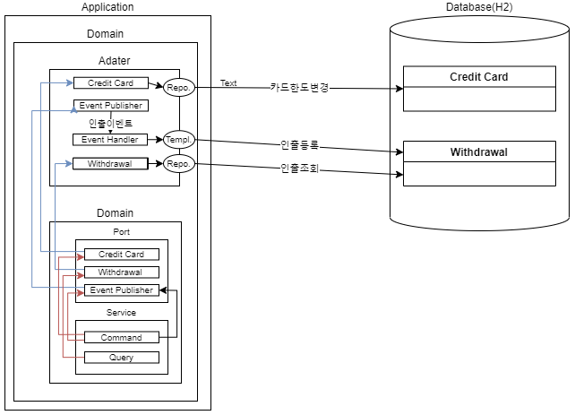

### 3.9.3 실습

- 패키지 구조

  ```
   main
      ├─java
      │  └─com
      │      └─kt
      │          └─cqrs
      │              ├─adapter
      │              │  ├─in
      │              │  │  ├─api
      │              │  │  └─event
      │              │  └─out
      │              │      ├─event
      │              │      └─persistence
      │              └─domain
      │                  └─port
      └─resources
  ```

- Database

  - 파일명: schema.sql

    ```sql
    CREATE TABLE IF NOT EXISTS CREDIT_CARD (
      ID            VARCHAR(255) PRIMARY KEY,
      INITIAL_LIMIT DECIMAL(18,2) NOT NULL,
      USED_LIMIT    DECIMAL(18,2) NOT NULL
    );
    
    CREATE TABLE IF NOT EXISTS WITHDRAWAL (
      ID     VARCHAR(255) PRIMARY KEY,
      CARD_ID   VARCHAR(255)    NOT NULL,
      AMOUNT DECIMAL(18,2) NOT NULL,
      foreign key (CARD_ID) references CREDIT_CARD(ID)
    );
    ```

  - 파일명: data.sql

    ```sql
    INSERT INTO credit_card (ID, INITIAL_LIMIT, USED_LIMIT) VALUES
      ('3a3e99f0-5ad9-47fa-961d-d75fab32ef0e', 10000, 0);
    
    COMMIT;
    ```
  
- Dependency
  - 파일명 : pom.xml
  
    ```xml
    <?xml version="1.0" encoding="UTF-8"?>
    <project xmlns="http://maven.apache.org/POM/4.0.0" xmlns:xsi="http://www.w3.org/2001/XMLSchema-instance"
             xsi:schemaLocation="http://maven.apache.org/POM/4.0.0 http://maven.apache.org/xsd/maven-4.0.0.xsd">
        <modelVersion>4.0.0</modelVersion>
    
        <groupId>icis.com</groupId>
        <artifactId>class-aync-repository</artifactId>
        <version>0.0.1-SNAPSHOT</version>
        <packaging>jar</packaging>
        <parent>
            <groupId>org.springframework.boot</groupId>
            <artifactId>spring-boot-starter-parent</artifactId>
            <version>2.7.2</version>
            <relativePath/> <!-- lookup parent from repository -->
        </parent>
    
        <properties>
            <project.build.sourceEncoding>UTF-8</project.build.sourceEncoding>
            <project.reporting.outputEncoding>UTF-8</project.reporting.outputEncoding>
            <java.version>17</java.version>
            <spring-cloud.version>2021.0.3</spring-cloud.version>
        </properties>
    
        <dependencyManagement>
            <dependencies>
                <dependency>
                    <groupId>org.springframework.cloud</groupId>
                    <artifactId>spring-cloud-dependencies</artifactId>
                    <version>${spring-cloud.version}</version>
                    <type>pom</type>
                    <scope>import</scope>
                </dependency>
            </dependencies>
        </dependencyManagement>
    
        <build>
            <plugins>
                <plugin>
                    <groupId>org.springframework.boot</groupId>
                    <artifactId>spring-boot-maven-plugin</artifactId>
                </plugin>
            </plugins>
        </build>
    
        <dependencies>
            <dependency>
                <groupId>org.springframework.boot</groupId>
                <artifactId>spring-boot-starter-data-jdbc</artifactId>
            </dependency>
            <dependency>
                <groupId>org.springframework.boot</groupId>
                <artifactId>spring-boot-starter-web</artifactId>
            </dependency>
            <dependency>
                <groupId>org.springframework.boot</groupId>
                <artifactId>spring-boot-starter-actuator</artifactId>
            </dependency>
    		<dependency>
    			<groupId>org.springframework.boot</groupId>
    			<artifactId>spring-boot-configuration-processor</artifactId>
    			<optional>true</optional>
    		</dependency>
            <dependency>
                <groupId>com.h2database</groupId>
                <artifactId>h2</artifactId>
            </dependency>
            <dependency>
                <groupId>org.flywaydb</groupId>
                <artifactId>flyway-core</artifactId>
            </dependency>
    
    		<dependency>
    			<groupId>org.projectlombok</groupId>
    			<artifactId>lombok</artifactId>
    			<scope>provided</scope>
    		</dependency>
    
    		<dependency>
    			<groupId>org.springframework.boot</groupId>
    			<artifactId>spring-boot-starter-test</artifactId>
    			<scope>test</scope>
    		</dependency>
    		<dependency>
    			<groupId>org.modelmapper</groupId>
    			<artifactId>modelmapper</artifactId>
    			<version>2.3.2</version>
    		</dependency>
    		<dependency>
    			<groupId>junit</groupId>
    			<artifactId>junit</artifactId>
    			<scope>test</scope>
    		</dependency>
    		
    		<dependency>
    			<groupId>org.springdoc</groupId>
    			<artifactId>springdoc-openapi-ui</artifactId>
    			<version>1.6.6</version>
    		</dependency>
    
    		<dependency>
    			<groupId>org.springframework.boot</groupId>
    			<artifactId>spring-boot-devtools</artifactId>
    			<scope>runtime</scope>
    			<optional>true</optional>
    		</dependency>	
        </dependencies>
    
    
    </project>
    
    ```
  
- Properties
  - 파일명 : application.yml
  
    ```yaml
    server:
      port: 8080
      
    spring:     
      devtools:
        restart:
          enabled: true
      h2:
        console:
          enabled: true
          settings:
            web-allow-others: true
          path: /h2-console        
      datasource:
        url: jdbc:h2:mem:testdb;DB_CLOSE_DELAY=-1
    ```
  
- Bootstrap
  - 파일명 : CqrsApplication.java
  
    ```java
    package com.kt.cqrs;
    
    import org.springframework.boot.SpringApplication;
    import org.springframework.boot.autoconfigure.SpringBootApplication;
    import org.springframework.web.servlet.config.annotation.EnableWebMvc;
    
    @EnableWebMvc
    @SpringBootApplication
    public class CqrsApplication {
    
    	public static void main(String[] args) {
    		SpringApplication.run(CqrsApplication.class, args);
    	}
    }
    
    ```
  
- In Api

  - 파일명 : WithdrawalCommand.java

  ```java
  package com.kt.cqrs.adapter.in.api;
  
  import java.util.UUID;
  
  import lombok.AllArgsConstructor;
  import lombok.Data;
  import lombok.NoArgsConstructor;
  
  @Data
  @NoArgsConstructor
  @AllArgsConstructor
  public class WithdrawalCommand {
      private UUID card;
      private long amount;
  }
  
  ```
  
  - 파일명 : WithdrawalController.java
  
  ```java
  package com.kt.cqrs.adapter.in.api;
  
  import java.util.ArrayList;
  import java.util.List;
  import java.util.UUID;
  
  import javax.websocket.server.PathParam;
  
  import org.modelmapper.ModelMapper;
  import org.springframework.http.ResponseEntity;
  import org.springframework.web.bind.annotation.GetMapping;
  import org.springframework.web.bind.annotation.PostMapping;
  import org.springframework.web.bind.annotation.RequestBody;
  import org.springframework.web.bind.annotation.RequestMapping;
  import org.springframework.web.bind.annotation.RestController;
  
  import com.kt.cqrs.domain.WithdrawalCommandService;
  import com.kt.cqrs.domain.WithdrawalQueryService;
  import com.kt.cqrs.domain.ports.Withdrawal;
  
  import lombok.AllArgsConstructor;
  
  
  @AllArgsConstructor
  @RestController
  @RequestMapping("/withdrawal")
  class WithdrawalController {
  
      private final WithdrawalCommandService withdrawalCommandService;
      private final WithdrawalQueryService withdrawalQueryService;
  
      @PostMapping
      ResponseEntity<?> withdraw(@RequestBody WithdrawalCommand withdrawalCommand) {
      	withdrawalCommandService.withdraw(withdrawalCommand.getCard(), withdrawalCommand.getAmount());
          return ResponseEntity.ok().build();
      }
  
      @GetMapping
      ResponseEntity<List<WithdrawalQuery>> withdrawals(@PathParam("cardId") String cardId) {
      	List<Withdrawal> withdrawalRecords = withdrawalQueryService.withdrawal(UUID.fromString(cardId));
          List<WithdrawalQuery> result = new ArrayList<>();
          withdrawalRecords.forEach(v -> result.add(new ModelMapper().map(v, WithdrawalQuery.class)));
          return ResponseEntity.ok().body(result);
      }
  
  }
  
  ```
  
  - 파일명 : WithdrawalQuery.java
  
  ```java
  package com.kt.cqrs.adapter.in.api;
  
  import java.util.UUID;
  
  import lombok.AllArgsConstructor;
  import lombok.Data;
  import lombok.NoArgsConstructor;
  
  @Data
  @NoArgsConstructor
  @AllArgsConstructor
  public class WithdrawalQuery {
      private UUID cardId;
      private long amount;
  }
  
  ```
  
  
  
- In event

  - 파일명 : EventSubscriber.java

  ```java
  package com.kt.cqrs.adapter.in.event;
  
  import java.util.UUID;
  
  import org.springframework.context.event.EventListener;
  import org.springframework.jdbc.core.JdbcTemplate;
  import org.springframework.scheduling.annotation.Async;
  import org.springframework.stereotype.Component;
  
  import com.kt.cqrs.domain.port.CardWithdrawn;
  
  import lombok.extern.slf4j.Slf4j;
  
  @Slf4j
  @Component
  class EventSubscriber {
  
      private final JdbcTemplate jdbcTemplate;
  
      EventSubscriber(JdbcTemplate jdbcTemplate) {
          this.jdbcTemplate = jdbcTemplate;
      }
      
      @Async
      @EventListener
      public void addWithdrawalOnCardWithdrawn(CardWithdrawn event) {
      	log.info("subscribeEvent = {}", event);
          jdbcTemplate.update("INSERT INTO WITHDRAWAL(ID, CARD_ID, AMOUNT) VALUES (?,?,?)", UUID.randomUUID(), event.getCardNo(), event.getAmount());
      }
  }
  
  ```
  
  
  
- Out event

  -  파일명 : EventPublisherAdapter.java

  ```java
  package com.kt.cqrs.adapter.out.event;
  
  import org.springframework.context.ApplicationEventPublisher;
  import org.springframework.stereotype.Component;
  
  import com.kt.cqrs.adapter.in.event.DomainEvent;
  import com.kt.cqrs.domain.ports.EventPublisher;
  
  import lombok.AllArgsConstructor;
  
  @Component
  @AllArgsConstructor
  public class EventPublisherAdapter implements EventPublisher {
  
  	private final ApplicationEventPublisher applicationEventPublisher;
  	
  	@Override
  	public void publishEvent(DomainEvent event) {
  		applicationEventPublisher.publishEvent(event);
  		
  	}
  
  }
  ```

- Persistence

  - 파일명 :  CreditCardJdbcRepository.java

  ```java
  package com.kt.cqrs.adapter.out.persistence;
  
  import java.util.UUID;
  import org.springframework.data.repository.CrudRepository;
  import com.kt.cqrs.domain.ports.CreditCard;
  
  public interface CreditCardJdbcRepository extends CrudRepository<CreditCard, UUID> {
  }
  
  ```

  - 파일명 : CreditCardRepositoryAdapter.java

  ```java
  package com.kt.cqrs.adapter.out.persistence;
  
  import lombok.AllArgsConstructor;
  import org.springframework.stereotype.Repository;
  
  import com.kt.cqrs.domain.port.CreditCard;
  import com.kt.cqrs.domain.port.CreditCardRepository;
  
  import java.util.Optional;
  import java.util.UUID;
  
  @Repository
  @AllArgsConstructor
  public class CreditCardRepositoryAdapter implements CreditCardRepository {
  
      private final CreditCardJdbcRepository creditCardJdbcRepository;
  
      @Override
      public Optional<CreditCard> load(UUID cardId) {
          return creditCardJdbcRepository.findById(cardId);
      }
  
      @Override
      public void save(CreditCard record) {
      	creditCardJdbcRepository.save(record);
      }
  }
  
  ```

  - 파일명 : WithdrawalJdbcRepository.java

  ```java
  package com.kt.cqrs.adapter.out.persistence;
  
  import java.util.List;
  import java.util.UUID;
  
  import org.springframework.data.repository.CrudRepository;
  
  import com.kt.cqrs.domain.port.Withdrawal;
  
  public interface WithdrawalJdbcRepository extends CrudRepository<Withdrawal, UUID> {
  	List<Withdrawal> findByCardId(UUID cardId);
  }
  
  ```

  - 파일명 : WithdrawalRepositoryAdapter.java

  ```java
  package com.kt.cqrs.adapter.out.persistence;
  
  import java.util.List;
  import java.util.UUID;
  
  import org.springframework.stereotype.Repository;
  
  import com.kt.cqrs.domain.port.Withdrawal;
  import com.kt.cqrs.domain.port.WithdrawalRepository;
  
  import lombok.AllArgsConstructor;
  
  @Repository
  @AllArgsConstructor
  public class WithdrawalRepositoryAdapter implements WithdrawalRepository {
  
      private final WithdrawalJdbcRepository withdrawalJdbcRepository;
  
      @Override
      public List<Withdrawal> list(UUID cardId) {
          return withdrawalJdbcRepository.findByCardId(cardId);
      }
  }
  
  ```

- Domian

  - port

    -  파일명 : CardWithdrawn.java

    ```java
    package com.kt.cqrs.domain.port;
    
    import java.util.UUID;
    
    import com.kt.cqrs.adapter.in.event.DomainEvent;
    
    import lombok.Value;
    
    @Value
    public class CardWithdrawn implements DomainEvent {
    
        private final UUID cardNo;
        private final long amount;
    
    }
    
    ```

    - 파일명 : CreditCard.java

    ```java
    package com.kt.cqrs.domain.port;
    
    import java.util.UUID;
    
    import org.springframework.data.annotation.Id;
    import org.springframework.data.relational.core.mapping.Table;
    
    import com.kt.cqrs.adapter.in.event.DomainEvent;
    
    import lombok.Data;
    import lombok.NoArgsConstructor;
    
    @Data
    @NoArgsConstructor
    @Table(name = "CREDIT_CARD")
    public class CreditCard {
    
        @Id
        private UUID id;
        private long initialLimit;
        private long usedLimit;
    
    
        public void apply(DomainEvent event) {
            if (event instanceof CardWithdrawn) {
                this.usedLimit = usedLimit + ((CardWithdrawn) event).getAmount();
            } else {
                throw new IllegalStateException("Event: " + event.getClass().getSimpleName() + "not handled");
            }
        }
    }
    
    ```
    - 파일명 : CreditCardDao.java

    ```java
    package com.kt.cqrs.domain.port;
    
    import java.util.Optional;
    import java.util.UUID;
    
    public interface CreditCardRepository {
    
        Optional<CreditCard> load(UUID cardId);
    
        void save(CreditCard record);
    }
    
    ```

    - 파일명 : EventPublisher.java

    ```java
    package com.kt.cqrs.domain.port;
    
    import com.kt.cqrs.adapter.in.event.DomainEvent;
    
    public interface EventPublisher {
    	void publishEvent(DomainEvent event);
    }
    
    ```

    - 파일명 : DomainEvent.java

    ```java
    package com.kt.cqrs.domain.port;
    
    public interface DomainEvent {
    }
    
    ```
  
    - 파일명 : Withdrawal.java
  
    ```java
    package com.kt.cqrs.domain.port;
    
    import java.util.UUID;
    
    import org.springframework.data.annotation.Id;
    import org.springframework.data.relational.core.mapping.Table;
    
    import lombok.AllArgsConstructor;
    import lombok.Builder;
    import lombok.Getter;
    import lombok.NoArgsConstructor;
    import lombok.Setter;
    import lombok.ToString;
    
    @Getter
    @Setter
    @Builder
    @AllArgsConstructor
    @NoArgsConstructor
    @ToString
    @Table("WITHDRAWAL")
    public class Withdrawal {
        
       	@Id
        private UUID id;
        private long amount;
        private UUID cardId;
    
    }
    
    ```
  
    - 파일명 : WithdrawalRepository.java
  
    ```java
    package com.kt.cqrs.domain.port;
    
    import java.util.List;
    import java.util.UUID;
    
    public interface WithdrawalRepository {
    
        List<Withdrawal> list(UUID cardId);
    
    }
    
    ```
  
  - Service
  
    - 파일명 :  NotEnoughMoneyException.java
  
    ```java
    package com.kt.cqrs.domain.service;
    
    import java.util.UUID;
    
    public class NotEnoughMoneyException extends RuntimeException {
  
      private static final long serialVersionUID = 1L;
    
    	public NotEnoughMoneyException(UUID cardNo, long wanted, long availableBalance) {
            super(String.format("Card %s not able to withdraw %s. Balance is %s", cardNo, wanted, availableBalance));
        }
    }
    ```
  
    - 파일명 : WithdrawalCommandService.java
  
    ```java
    package com.kt.cqrs.domain.service;
    
    import java.util.UUID;
    
    import org.springframework.stereotype.Service;
    import org.springframework.transaction.annotation.Transactional;
    
    import com.kt.cqrs.domain.port.CardWithdrawn;
    import com.kt.cqrs.domain.port.CreditCard;
    import com.kt.cqrs.domain.port.CreditCardRepository;
    import com.kt.cqrs.domain.port.EventPublisher;
    
    import lombok.AllArgsConstructor;
    import lombok.extern.slf4j.Slf4j;
    
    @Slf4j
    @Service
    @AllArgsConstructor
    public class WithdrawalCommandService {
    
        private final CreditCardRepository creditCardRepository;
        private final EventPublisher eventPublisher;
    
        @Transactional
        public void withdraw(UUID cardId, long amount) {
        	CreditCard creditCard = creditCardRepository.load(cardId)
                    .orElseThrow(() -> new IllegalStateException("Cannot find card with id " + cardId));
        	CardWithdrawn event = withdraw(creditCard, amount);
        	eventPublisher.publishEvent(event);
        }
        
    	public CardWithdrawn withdraw(CreditCard creditCard, long amount) {
    		if (thereIsMoneyToWithdraw(creditCard, amount)) {
    			creditCard.setUsedLimit(creditCard.getUsedLimit() + amount);
    			log.info("creditCard = {}", creditCard);
    			creditCardRepository.save(creditCard);
    		} else {
    			throw new NotEnoughMoneyException(creditCard.getId(), amount, availableBalance(creditCard));
    		}
    		
    		return new CardWithdrawn(creditCard.getId(), amount);
    	}
    
    	public long availableBalance(CreditCard creditCard) {
    		return creditCard.getInitialLimit() - creditCard.getUsedLimit();
  	}
    
    	private boolean thereIsMoneyToWithdraw(CreditCard creditCard, long amount) {
    		return availableBalance(creditCard) >= amount;
    	}
    }
    
    ```
  
    - 파일명 : WithdrawalQueryService.java
  
    ```java
    package com.kt.cqrs.domain.service;
    
    import java.util.List;
    import java.util.UUID;
    
    import org.springframework.stereotype.Service;
    
    import com.kt.cqrs.domain.port.Withdrawal;
    import com.kt.cqrs.domain.port.WithdrawalRepository;
    
    import lombok.AllArgsConstructor;
    
    @Service
    @AllArgsConstructor
    public class WithdrawalQueryService {
    
    	 private final WithdrawalRepository withdrawalRepository;
    	 
    	public List<Withdrawal> withdrawal(UUID cardId) {
    		return withdrawalRepository.list(cardId);
    	}
    }
    
    ```
  

> ** 명령과 조회서비스로 분리해 본다.**


### 3.9.4. **테스트**

- 키드인출(명령)

```shell
curl localhost:8080/withdrawal -X POST --header 'Content-Type: application/json' -d '{"card":"3a3e99f0-5ad9-47fa-961d-d75fab32ef0e", "amount": 10.00}' --verbose
```

- 쿼리로 확인:

```shell
curl http://localhost:8080/withdrawal?cardId=3a3e99f0-5ad9-47fa-961d-d75fab32ef0e --verbose
```

- 예상 결과:

```shell
[{"amount":10.00}]
```

- 데이터 확인

```http
http://localhost:8080/h2-console/
```


## 3.10. 단일 프로세스로 처리되는 Trigger 기반 CQRS  - H2 Trigger 


### 3.10.1. 개요

- 코드레벨에서 명령과 조회를 분리
- 명령과 조회 모델의 데이타 일관성을 위해 Database 기능을 통해 처리
  - Database의 추가 오버헤드 발생
- 코드의 복잡도 감소
- 향후 프로세스 분리 시 비용 감소
- 솔루션 유지보수 비용 증가 및 솔루션 선택의 제약사항 발생
- 데이타 일관성을 보장하지 않으므로 보정을 할 수 있는 별도 방안 고려 필요.

### 3.10.2. 아키텍처 구성


### 3.10.3 실습

- 패키지 구조

  ```
  ├─java
  │  └─com
  │      └─kt
  │          └─cqrs
  │              ├─command
  │              │  ├─controller
  │              │  ├─payload
  │              │  ├─repository
  │              │  │  └─entity
  │              |  ├─event
  │              │  └─service
  │              └─query
  │                  ├─controller
  │                  ├─payload
  │                  └─service
  └─resources
  ```

- Database

  - 파일명: schema.sql

    ```sql
    CREATE TABLE IF NOT EXISTS CREDIT_CARD (
      ID            UUID PRIMARY KEY,
      INITIAL_LIMIT DECIMAL(18,2) NOT NULL,
      USED_LIMIT    DECIMAL(18,2) NOT NULL
    );
    
    CREATE TABLE IF NOT EXISTS WITHDRAWAL (
      ID     UUID PRIMARY KEY,
      CARD_ID   UUID    NOT NULL,
      AMOUNT DECIMAL(18,2) NOT NULL
    );
    
    CREATE TRIGGER ON_CARD_WITHDRAWN
    AFTER UPDATE
      ON CREDIT_CARD
    FOR EACH ROW
    CALL "com.kt.cqrs.command.event.EventHandler";
    ```
  
  - 파일명: data.sql
  
    ```sql
    INSERT INTO credit_card (ID, INITIAL_LIMIT, USED_LIMIT) VALUES
      ('3a3e99f0-5ad9-47fa-961d-d75fab32ef0e', 10000, 0);
    
    COMMIT;
    ```
  
- Dependency
  -  파일명 : 
  ```java
  <?xml version="1.0" encoding="UTF-8"?>
  <project xmlns="http://maven.apache.org/POM/4.0.0" xmlns:xsi="http://www.w3.org/2001/XMLSchema-instance"
           xsi:schemaLocation="http://maven.apache.org/POM/4.0.0 http://maven.apache.org/xsd/maven-4.0.0.xsd">
      <modelVersion>4.0.0</modelVersion>
  
      <groupId>icis.com</groupId>
      <artifactId>service-trigger</artifactId>
      <version>0.0.1-SNAPSHOT</version>
      <packaging>jar</packaging>
  
      <parent>
          <groupId>org.springframework.boot</groupId>
          <artifactId>spring-boot-starter-parent</artifactId>
          <version>2.7.2</version>
          <relativePath/> <!-- lookup parent from repository -->
      </parent>
  
      <properties>
          <project.build.sourceEncoding>UTF-8</project.build.sourceEncoding>
          <project.reporting.outputEncoding>UTF-8</project.reporting.outputEncoding>
          <java.version>17</java.version>
          <spring-cloud.version>2021.0.3</spring-cloud.version>
      </properties>
  
      <dependencyManagement>
          <dependencies>
              <dependency>
                  <groupId>org.springframework.cloud</groupId>
                  <artifactId>spring-cloud-dependencies</artifactId>
                  <version>${spring-cloud.version}</version>
                  <type>pom</type>
                  <scope>import</scope>
              </dependency>
          </dependencies>
      </dependencyManagement>
  
      <build>
          <plugins>
              <plugin>
                  <groupId>org.springframework.boot</groupId>
                  <artifactId>spring-boot-maven-plugin</artifactId>
              </plugin>
          </plugins>
      </build>
  
      <dependencies>
          <dependency>
              <groupId>org.springframework.boot</groupId>
              <artifactId>spring-boot-starter-data-jdbc</artifactId>
          </dependency>
          <dependency>
              <groupId>org.springframework.boot</groupId>
              <artifactId>spring-boot-starter-web</artifactId>
          </dependency>
          <dependency>
              <groupId>org.springframework.boot</groupId>
              <artifactId>spring-boot-starter-actuator</artifactId>
          </dependency>
  		<dependency>
  			<groupId>org.springframework.boot</groupId>
  			<artifactId>spring-boot-configuration-processor</artifactId>
  			<optional>true</optional>
  		</dependency>
          <dependency>
              <groupId>com.h2database</groupId>
              <artifactId>h2</artifactId>
          </dependency>
  
  		<dependency>
  			<groupId>org.projectlombok</groupId>
  			<artifactId>lombok</artifactId>
  			<scope>provided</scope>
  		</dependency>
  
  		<dependency>
  			<groupId>org.springframework.boot</groupId>
  			<artifactId>spring-boot-starter-test</artifactId>
  			<scope>test</scope>
  		</dependency>
  
  		<dependency>
  			<groupId>junit</groupId>
  			<artifactId>junit</artifactId>
  			<scope>test</scope>
  		</dependency>
  		
  		<dependency>
  			<groupId>org.springdoc</groupId>
  			<artifactId>springdoc-openapi-ui</artifactId>
  			<version>1.6.6</version>
  		</dependency>
  		
  		<dependency>
  			<groupId>org.springframework.boot</groupId>
  			<artifactId>spring-boot-devtools</artifactId>
  			<scope>runtime</scope>
  			<optional>true</optional>
  		</dependency>
  
      </dependencies>
  
  </project>
  
  ```
  
- Properties
  -  파일명 : application.yml
  ```yaml
  server:
    port: 8080
    
  spring:     
    devtools:
      restart:
        enabled: true
    h2:
      console:
        enabled: true
        settings:
          web-allow-others: true
        path: /h2-console        
    datasource:
      url: jdbc:h2:mem:testdb;DB_CLOSE_DELAY=-1
  ```
  
- Bootstrap
  -  파일명 : CqrsApplication.java
  ```java
  package com.kt.cqrs;
  
  import org.springframework.boot.SpringApplication;
  import org.springframework.boot.autoconfigure.SpringBootApplication;
  import org.springframework.web.servlet.config.annotation.EnableWebMvc;
  
  @EnableWebMvc
  @SpringBootApplication
  public class CqrsApplication {
  
  	public static void main(String[] args) {
  		SpringApplication.run(CqrsApplication.class, args);
  	}
  }
  
  ```
  
- Exception

  -  파일명 : NotEnoughMoneyException.java
  
  ```java
  package com.kt.cqrs.command.service;
  
  import java.util.UUID;
  
  public class NotEnoughMoneyException extends RuntimeException {
  
  	private static final long serialVersionUID = 1L;
  
  	public NotEnoughMoneyException(UUID cardNo, long wanted, long availableBalance) {
          super(String.format("Card %s not able to withdraw %s. Balance is %s", cardNo, wanted, availableBalance));
      }
  }
  
  ```
- Command

  - Entity

    - 파일명 : CreditCard.java

    ```java
    package com.kt.cqrs.command.repository.entity;
    
    import java.util.UUID;
    
    import org.springframework.data.annotation.Id;
    import org.springframework.data.relational.core.mapping.Table;
    
    import lombok.AllArgsConstructor;
    import lombok.Builder;
    import lombok.Getter;
    import lombok.NoArgsConstructor;
    import lombok.Setter;
    import lombok.ToString;
    
    @Getter
    @Setter
    @Builder
    @AllArgsConstructor
    @NoArgsConstructor
    @ToString
    @Table("CREDIT_CARD")
    public class CreditCard {
    
        @Id
        private UUID id;
        private long initialLimit;
        private long usedLimit;
    
    }
    
    ```
    
  - Rpository

    - 파일명 : CreditCardRepository.java

    ```java
    package com.kt.cqrs.command.repository;
    
    import java.util.UUID;
    
    import org.springframework.data.repository.CrudRepository;
    
    import com.kt.cqrs.command.repository.entity.CreditCard;
    
    public interface CreditCardRepository extends CrudRepository<CreditCard, UUID> {
    
    }
    
    ```
    
  - Service

    -  파일명 : WithdrawalCommandService.java

    ```java
    package com.kt.cqrs.command.service;
    
    import java.util.UUID;
    
    import org.springframework.jdbc.core.JdbcTemplate;
    import org.springframework.stereotype.Service;
    import org.springframework.transaction.annotation.Transactional;
    
    import com.kt.cqrs.command.repository.CreditCardRepository;
    import com.kt.cqrs.command.repository.entity.CreditCard;
    
    import lombok.RequiredArgsConstructor;
    import lombok.extern.slf4j.Slf4j;
    
    @Slf4j
    @Service
    @RequiredArgsConstructor
    public class WithdrawalCommandService {
    
        private final CreditCardRepository creditCardRepository;
        private final JdbcTemplate jdbcTemplate;
    
    
        @Transactional
        public void withdraw(UUID cardId, long amount) {
            CreditCard creditCard = creditCardRepository.findById(cardId)
                    .orElseThrow(() -> new IllegalStateException("Cannot find card with id " + cardId));
            withdraw(creditCard, amount);
        }
        
        public void withdraw(CreditCard creditCard, long amount) {
    		if (thereIsMoneyToWithdraw(creditCard, amount)) {
    			creditCard.setUsedLimit(creditCard.getUsedLimit() + amount);
    			log.info("creditCard = {}", creditCard);
    			creditCardRepository.save(creditCard);
    		} else {
    			throw new NotEnoughMoneyException(creditCard.getId(), amount, availableBalance(creditCard));
    		}
    	}
    
    	public long availableBalance(CreditCard creditCard) {
    		return creditCard.getInitialLimit() - creditCard.getUsedLimit();
    	}
    
    	private boolean thereIsMoneyToWithdraw(CreditCard creditCard, long amount) {
    		return availableBalance(creditCard) >= amount;
    	}
    
    }
    ```
    
  - Payload

    - 파일명 : WithdrawalCommand.java

    ```java
    package com.kt.cqrs.command.payload;
    
    import lombok.AllArgsConstructor;
    import lombok.Data;
    import lombok.NoArgsConstructor;
    
    
    import java.util.UUID;
    
    @Data
    @NoArgsConstructor
    @AllArgsConstructor
    public class WithdrawalCommand {
        private UUID card;
        private long amount;
    
    }
    
    ```
    
  - Controller

    - 파일명 : WithdrawalCommandController.java

    ```java
    package com.kt.cqrs.command.controller;
    
    import org.springframework.http.ResponseEntity;
    import org.springframework.web.bind.annotation.PostMapping;
    import org.springframework.web.bind.annotation.RequestBody;
    import org.springframework.web.bind.annotation.RequestMapping;
    import org.springframework.web.bind.annotation.RestController;
    
    import com.kt.cqrs.command.payload.WithdrawalCommand;
    import com.kt.cqrs.command.service.WithdrawalCommandService;
    
    import lombok.RequiredArgsConstructor;
    
    @RestController
    @RequestMapping("/withdrawal")
    @RequiredArgsConstructor
    class WithdrawalCommandController {
    
        private final WithdrawalCommandService withdrawalCommandService;
    
        @PostMapping
        ResponseEntity<?> withdraw(@RequestBody WithdrawalCommand withdrawalCommand) {
        	withdrawalCommandService.withdraw(withdrawalCommand.getCard(), withdrawalCommand.getAmount());
            return ResponseEntity.ok().build();
        }
    
    }
    
    ```

- Query

  - Event
    - 파일명 : CreditCardUsedTrigger.java
  
    ```java
      package com.kt.cqrs.query.event;
      
      import java.math.BigDecimal;
      import java.sql.Connection;
      import java.sql.PreparedStatement;
      import java.sql.SQLException;
      import java.util.UUID;
      
      import org.h2.api.Trigger;
      
      public class CreditCardUsedTrigger implements Trigger {
      
          @Override
          public void init(Connection connection, String s, String s1, String s2, boolean b, int i) throws SQLException {
      
          }
      
          @Override
          public void fire(Connection connection, Object[] before, Object[] after) throws SQLException {
              try (PreparedStatement stmt = connection.prepareStatement(
                      "INSERT INTO WITHDRAWAL (ID, CARD_ID, AMOUNT) " + "VALUES (?, ?, ?)")) {
                  stmt.setObject(1, UUID.randomUUID()); //generate withdrawal id
                  stmt.setObject(2, cardId(after));
                  stmt.setObject(3, getUsedLimitChange(before, after));
      
                  stmt.executeUpdate();
              }
          }
      
          private Object cardId(Object[] cardRow) {
              return cardRow[0];
          }
      
          private BigDecimal getUsedLimitChange(Object[] oldCardRow, Object[] newCardRow) {
              return ((BigDecimal) newCardRow[2]).subtract((BigDecimal) oldCardRow[2]);
          }
      
          @Override
          public void close() throws SQLException {
      
          }
      
          @Override
          public void remove() throws SQLException {
      
          }
      }
      
    ```
  
  - Service
  
    -  파일명 : WithdrawalQueryService.java
  
    ```java
    package com.kt.cqrs.query.service;
    
    import java.util.List;
    import java.util.UUID;
    
    import org.springframework.jdbc.core.BeanPropertyRowMapper;
    import org.springframework.jdbc.core.JdbcTemplate;
    import org.springframework.stereotype.Service;
    import org.springframework.web.bind.annotation.PathVariable;
    
    import com.kt.cqrs.query.controller.WithdrawalDto;
    
    import lombok.RequiredArgsConstructor;
    import lombok.extern.slf4j.Slf4j;
    
    @Slf4j
    @Service
    @RequiredArgsConstructor
    public class WithdrawalQueryService {
    
        private final JdbcTemplate jdbcTemplate;
    
    	
        @SuppressWarnings("deprecation")
    	public List<WithdrawalDto> withdrawal(@PathVariable UUID cardId) {
            return jdbcTemplate.query("SELECT * FROM WITHDRAWAL WHERE CARD_ID = ?", new Object[]{cardId},
                    new BeanPropertyRowMapper<>(WithdrawalDto.class));
        } 
    }
    
    ```
  
  - Payload
  
    - 파일명 : WithdrawalDto.java
  
    ```java
    package com.kt.cqrs.query.payload;
    
    import lombok.AllArgsConstructor;
    import lombok.Data;
    import lombok.NoArgsConstructor;
    
    
    import java.util.UUID;
    
    @Data
    @NoArgsConstructor
    @AllArgsConstructor
    public class WithdrawalDto {
        private UUID cardId;
        private long amount;
    
    }
    
    ```
  
  - Controller
  
    - 파일명 : WithdrawalQueryController.java
  
    ```java
    package com.kt.cqrs.query.controller;
    
    import java.util.List;
    import java.util.UUID;
    
    import javax.websocket.server.PathParam;
    
    import org.springframework.http.ResponseEntity;
    import org.springframework.web.bind.annotation.GetMapping;
    import org.springframework.web.bind.annotation.RequestMapping;
    import org.springframework.web.bind.annotation.RestController;
    
    import com.kt.cqrs.query.payload.WithdrawalDto;
    import com.kt.cqrs.query.service.WithdrawalQueryService;
    
    import lombok.RequiredArgsConstructor;
    
    @RestController
    @RequestMapping("/withdrawal")
    @RequiredArgsConstructor
    class WithdrawalQueryController {
    
        private final WithdrawalQueryService withdrawalQueryService;
    
        @GetMapping
        ResponseEntity<List<WithdrawalDto>> withdrawals(@PathParam("cardId") String cardId) {
            return ResponseEntity.ok().body(withdrawalQueryService.withdrawal(UUID.fromString(cardId)));
        }
    }
    ```
### 3.10.4. 테스트

- 키드인출(명령)

```shell
curl localhost:8080/withdrawal -X POST --header 'Content-Type: application/json' -d '{"card":"3a3e99f0-5ad9-47fa-961d-d75fab32ef0e", "amount": 10.00}' --verbose
```

- 쿼리로 확인:

```shell
curl http://localhost:8080/withdrawal?cardId=3a3e99f0-5ad9-47fa-961d-d75fab32ef0e --verbose
```

- 예상 결과:

```shell
[{"amount":10.00}]
```

- 데이터 확인

```http
http://localhost:8080/h2-console/
```


## 3.11. 분리된 프로세스로 처리되는 이벤트 기반 CQRS  - Kafka

### 3.11.1. 개요

- 다른 프로세스 명령과 조회를 분리
- 확장성과 가용성 향상
- 별도 이벤트스토리지를 통한 이벤트 유실 고려
  - 향후 이벤트소싱 패턴으로 발전 가능
- 메세징 솔루션 기반으로 코드 복잡도 증가
- 솔루션 유지보수 비용 증가 및 솔루션 선택의 제약사항 발생
- 데이타 일관성을 보장하지 않으므로 보정을 할 수 있는 별도 방안 고려 필요.

### 3.11.2. 아키텍처 구성

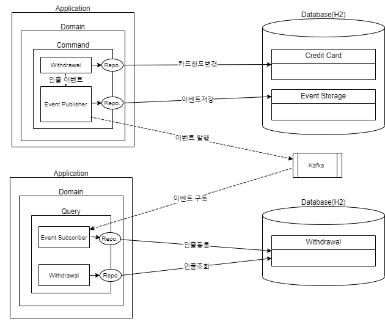

### 3.11.3. 실습 - Docker 환경 구성

- 해당 실습은 Docker 기반에서 진행하므로 사전에 Docker 파일과 Docker Compose 파일을 준비한다.
  - 파일명 : docker-compose

    ```yaml
    version: "3.1"
    
    services:
      command:
        build: ./service-db-event-command
        ports:
          - 8080:8080
        links:
          - kafka
    
      query:
        build: ./service-db-event-query
        ports:
          - 8888:8888
        links:
          - kafka
    
      zookeeper:
        image: debezium/zookeeper:0.8
        ports:
         - 2181:2181
         - 2888:2888
         - 3888:3888
      kafka:
        image: debezium/kafka:0.8
        ports:
         - 9092:9092
        links:
         - zookeeper
        environment:
         - ZOOKEEPER_CONNECT=zookeeper:2181
         - ADVERTISED_LISTENERS=PLAINTEXT://host.docker.internal:9092
         - KAFKA_CREATE_TOPICS=domain-event 
    
    ```
    

### 3.11.4. 실습 - 명령 서비스

- 패키지 구조

  ```
  ├─java
  │  └─com
  │      └─kt
  │          └─cqrs
  │              └─command
  │                  ├─controller
  │                  ├─event
  │                  ├─payload
  │                  ├─repository
  │                  │  └─entity
  │                  └─service
  └─resources
  ```

- Docker

  - 파일명 : Dockerfile

    ```shell
    # Start with a base image containing Java runtime
    FROM eclipse-temurin:17-jdk
    
    # Add a volume pointing to /tmp
    VOLUME /tmp
    
    # Make port 8080 available to the world outside this container
    EXPOSE 8080
    
    # The application's jar file
    ARG JAR_FILE=target/service-db-event-command-0.0.1-SNAPSHOT.jar
    
    # Add the application's jar to the container
    ADD ${JAR_FILE} service-db-event-command.jar
  
    # Run the jar file 
  ENTRYPOINT ["java","-Djava.security.egd=file:/dev/./urandom","-jar","/service-db-event-command.jar"]
    ```
  
- Database

  - 파일명: schema.sql

    ```sql
    CREATE TABLE IF NOT EXISTS CREDIT_CARD (
      id            VARCHAR(255) PRIMARY KEY,
      initial_limit DECIMAL(18,2) NOT NULL,
      used_limit    DECIMAL(18,2) NOT NULL
    );
    
    CREATE TABLE IF NOT EXISTS STORED_DOMAIN_EVENT (
      id     VARCHAR(255) PRIMARY KEY,
      content   VARCHAR2(4096)    NOT NULL,
      sent   BOOLEAN    NOT NULL,
      event_timestamp   DATETIME   NOT NULL,
      event_type VARCHAR2(128) NOT NULL
    );
    ```

  - 파일명: data.sql

    ```sql
    INSERT INTO credit_card (ID, INITIAL_LIMIT, USED_LIMIT) VALUES
      ('3a3e99f0-5ad9-47fa-961d-d75fab32ef0e', 10000, 0);
    COMMIT;
    ```

- Dependency

  -  파일명 :  pom.xml

  ```xml
  <?xml version="1.0" encoding="UTF-8"?>
  <project xmlns="http://maven.apache.org/POM/4.0.0" xmlns:xsi="http://www.w3.org/2001/XMLSchema-instance"
           xsi:schemaLocation="http://maven.apache.org/POM/4.0.0 http://maven.apache.org/xsd/maven-4.0.0.xsd">
      <modelVersion>4.0.0</modelVersion>
  
      <groupId>com.kt.cqrs</groupId>
      <artifactId>service-db-event-command</artifactId>
      <version>0.0.1-SNAPSHOT</version>
      <packaging>jar</packaging>
  
      <parent>
          <groupId>org.springframework.boot</groupId>
          <artifactId>spring-boot-starter-parent</artifactId>
          <version>2.7.2</version>
          <relativePath/> <!-- lookup parent from repository -->
      </parent>
  
      <properties>
          <project.build.sourceEncoding>UTF-8</project.build.sourceEncoding>
          <project.reporting.outputEncoding>UTF-8</project.reporting.outputEncoding>
          <java.version>17</java.version>
          <spring-cloud.version>2021.0.3</spring-cloud.version>
      </properties>
  
      <dependencyManagement>
          <dependencies>
              <dependency>
                  <groupId>org.springframework.cloud</groupId>
                  <artifactId>spring-cloud-dependencies</artifactId>
                  <version>${spring-cloud.version}</version>
                  <type>pom</type>
                  <scope>import</scope>
              </dependency>
          </dependencies>
      </dependencyManagement>
  
      <build>
          <plugins>
              <plugin>
                  <groupId>org.springframework.boot</groupId>
                  <artifactId>spring-boot-maven-plugin</artifactId>
              </plugin>
          </plugins>
      </build>
  
  
      <dependencies>
          <dependency>
              <groupId>org.springframework.boot</groupId>
              <artifactId>spring-boot-starter-data-jdbc</artifactId>
          </dependency>
          <dependency>
              <groupId>org.springframework.boot</groupId>
              <artifactId>spring-boot-starter-web</artifactId>
          </dependency>
  		<dependency>
  			<groupId>org.springframework.boot</groupId>
  			<artifactId>spring-boot-configuration-processor</artifactId>
  			<optional>true</optional>
  		</dependency>        
          <dependency>
              <groupId>org.springframework.boot</groupId>
              <artifactId>spring-boot-starter-actuator</artifactId>
          </dependency>
  
          <dependency>
              <groupId>com.h2database</groupId>
              <artifactId>h2</artifactId>
          </dependency>
  
  		<dependency>
  			<groupId>org.projectlombok</groupId>
  			<artifactId>lombok</artifactId>
  			<scope>provided</scope>
  		</dependency>
  		
  		<dependency>
  			<groupId>org.springframework.boot</groupId>
  			<artifactId>spring-boot-devtools</artifactId>
  			<scope>runtime</scope>
  			<optional>true</optional>
  		</dependency>
  		
  		<dependency>
  			<groupId>org.springframework.kafka</groupId>
  			<artifactId>spring-kafka</artifactId>
  		</dependency>		
  
  		<dependency>
  			<groupId>org.springframework.boot</groupId>
  			<artifactId>spring-boot-starter-test</artifactId>
  			<scope>test</scope>
  		</dependency>
  
  		<dependency>
  			<groupId>junit</groupId>
  			<artifactId>junit</artifactId>
  			<scope>test</scope>
  		</dependency>
  		
  		<dependency>
  			<groupId>org.springdoc</groupId>
  			<artifactId>springdoc-openapi-ui</artifactId>
  			<version>1.6.6</version>
  		</dependency>
  
      </dependencies>
  
  </project>
  
  ```

- Properties

  -  파일명 :  application.yml

  ```java
  server:
    port: 8080
    
  spring:     
    devtools:
      restart:
        enabled: true
    h2:
      console:
        enabled: true
        settings:
          web-allow-others: true
        path: /h2-console        
    datasource:
      url: jdbc:h2:mem:testdb;DB_CLOSE_DELAY=-1
      
    kafka:
      bootstrap-servers:
      - kafka:9092
      consumer:
        group-id: consumerGroup
        auto-offset-reset: earliest
        key-deserializer: org.apache.kafka.common.serialization.StringDeserializer
        value-deserializer: org.apache.kafka.common.serialization.StringDeserializer
      listener:      
         ack-mode: MANUAL_IMMEDIATE 
   
  ```

- Exception

  -  파일명 : NotEnoughMoneyException.java	
  
  ```java
  package com.kt.cqrs.command.service;
  
  import java.util.UUID;
  
  public class NotEnoughMoneyException extends RuntimeException {
  
  	private static final long serialVersionUID = 1L;
  
  	public NotEnoughMoneyException(UUID cardNo, long wanted, long availableBalance) {
          super(String.format("Card %s not able to withdraw %s. Balance is %s", cardNo, wanted, availableBalance));
      }
  }
  ```

- Bootstrap

  -  파일명 : CqrsApplication.java

  ```java
  package com.kt.cqrs.command;
  
  import org.springframework.boot.SpringApplication;
  import org.springframework.boot.autoconfigure.SpringBootApplication;
  import org.springframework.kafka.annotation.EnableKafka;
  import org.springframework.scheduling.annotation.EnableScheduling;
  import org.springframework.web.servlet.config.annotation.EnableWebMvc;
  
  @EnableWebMvc
  @EnableKafka
  @SpringBootApplication
  @EnableScheduling
  public class CqrsApplication {
  
  	public static void main(String[] args) {
  		SpringApplication.run(CqrsApplication.class, args);
  	}
  }
  
  ```

- Command

  - Entity

    - 파일명 : CardWithdrawn.java

    ```java
    package com.kt.cqrs.command.repository.entity;
    
    
    import java.util.Date;
    import java.util.UUID;
    
    import com.kt.cqrs.command.event.DomainEvent;
    
    import lombok.AllArgsConstructor;
    import lombok.Builder;
    import lombok.Getter;
    import lombok.NoArgsConstructor;
    import lombok.Setter;
    import lombok.ToString;
    
    @Getter
    @Setter
    @Builder
    @AllArgsConstructor
    @NoArgsConstructor
    @ToString
    public class CardWithdrawn implements DomainEvent {
    
        private UUID cardNo;
        private long amount;
        private Date timestamp = new Date();
    
        public CardWithdrawn(UUID cardNo, long amount) {
            this.cardNo = cardNo;
            this.amount = amount;
        }
    
        @Override
        public String getType() {
            return "card-withdrawn";
        }
    }
    
    ```

    - 파일명 : CreditCard.java

    ```java
    package com.kt.cqrs.command.repository.entity;
    
    import java.util.UUID;
    
    import org.springframework.data.annotation.Id;
    import org.springframework.data.relational.core.mapping.Table;
    
    import lombok.AllArgsConstructor;
    import lombok.Builder;
    import lombok.Getter;
    import lombok.NoArgsConstructor;
    import lombok.Setter;
    import lombok.ToString;
    
    @Getter
    @Setter
    @Builder
    @AllArgsConstructor
    @NoArgsConstructor
    @ToString
    @Table("CREDIT_CARD")
    public class CreditCard {
    
        @Id 
        private UUID id;
        private long initialLimit;
        private long usedLimit;
    
        public CreditCard(long limit) {
            this.initialLimit = limit;
        }
    
    }
    
    ```

  - Repository

    - 파일명 : CreditCardRepository.java

    ```java
    package com.kt.cqrs.command.repository;
    
    import java.util.UUID;
    
    import org.springframework.data.repository.CrudRepository;
    
    import com.kt.cqrs.command.repository.entity.CreditCard;
    
    public interface CreditCardRepository extends CrudRepository<CreditCard, UUID> {
    }
    
    ```
  
  - Service

    -  파일명 : WithdrawalService.java

    ```java
    package com.kt.cqrs.command.service;
    
    import java.util.UUID;
    
    import org.springframework.stereotype.Service;
    import org.springframework.transaction.annotation.Transactional;
    
    import com.kt.cqrs.command.event.DomainEventPublisher;
    import com.kt.cqrs.command.repository.CreditCardRepository;
    import com.kt.cqrs.command.repository.entity.CardWithdrawn;
    import com.kt.cqrs.command.repository.entity.CreditCard;
    
    import lombok.RequiredArgsConstructor;
    import lombok.extern.slf4j.Slf4j;
    
    @Slf4j
    @Service
    @RequiredArgsConstructor
    public class WithdrawalService {
    
        private final CreditCardRepository creditCardRepository;
        private final DomainEventPublisher domainEventPublisher;
    
        @Transactional
        public void withdraw(UUID cardId, long amount) {
            CreditCard creditCard = creditCardRepository.findById(cardId)
                    .orElseThrow(() -> new IllegalStateException("Cannot find card with id " + cardId));
            withdraw(creditCard, amount);
            domainEventPublisher.publish(new CardWithdrawn(cardId, amount));
        }
        
    
        public void withdraw(CreditCard creditCard, long amount) {
            if (thereIsMoneyToWithdraw(creditCard, amount)) {
            	creditCard.setUsedLimit(creditCard.getUsedLimit() + amount);
    			log.info("creditCard = {}", creditCard);
    			creditCardRepository.save(creditCard);
            } else {
                throw new NotEnoughMoneyException(creditCard.getId(), amount, availableBalance(creditCard));
            }
        }
    
        public long chargeBack(CreditCard creditCard, long amount) {
            return creditCard.getUsedLimit() - amount;
        }
    
        public long availableBalance(CreditCard creditCard) {
            return creditCard.getInitialLimit() - creditCard.getUsedLimit();
        }
    
        private boolean thereIsMoneyToWithdraw(CreditCard creditCard, long amount) {
            return availableBalance(creditCard) >= amount;
        }
    
    }
    
    ```
  
  - Payload

    - 파일명 : WithdrawalCommand.java

    ```java
    package com.kt.cqrs.command.payload;
    
    import lombok.AllArgsConstructor;
    import lombok.Data;
    import lombok.NoArgsConstructor;
    
    
    import java.util.UUID;
    
    @Data
    @NoArgsConstructor
    @AllArgsConstructor
    public class WithdrawalCommand {
        private UUID card;
        private long amount;
    
    }
    
    ```
  
  - Controller

    - 파일명 : WithdrawalController.java

    ```java
    package com.kt.cqrs.command.controller;
    
    import org.springframework.http.ResponseEntity;
    import org.springframework.web.bind.annotation.PostMapping;
    import org.springframework.web.bind.annotation.RequestBody;
    import org.springframework.web.bind.annotation.RequestMapping;
    import org.springframework.web.bind.annotation.RestController;
    
    import com.kt.cqrs.command.payload.WithdrawalCommand;
    import com.kt.cqrs.command.service.WithdrawalService;
    
    import lombok.RequiredArgsConstructor;
    
    @RestController
    @RequestMapping("/withdrawal")
    @RequiredArgsConstructor
    class WithdrawalController {
    
        private final WithdrawalService withdrawalService;
    
        @PostMapping
        ResponseEntity<?> withdraw(@RequestBody WithdrawalCommand withdrawalCommand) {
            withdrawalService.withdraw(withdrawalCommand.getCard(), withdrawalCommand.getAmount());
            return ResponseEntity.ok().build();
        }
    
    }
    
    
    ```
  
  - Event

    - 파일명 : DomainEvent.java

    ```java
    package com.kt.cqrs.command.event;
    
    public interface DomainEvent {
    
        String getType();
    }
    
    ```
  
    - 파일명 :  DomainEventPublisher.java

    ```java
    package com.kt.cqrs.command.event;
    
    public interface DomainEventPublisher {
    
        void publish(DomainEvent event);
    
    }
    ```
  
    - 파일명 : DomainEventsStorage.java

    ```java
    package com.kt.cqrs.command.event;
    
    import org.springframework.data.repository.CrudRepository;
    
    import java.util.List;
    
    interface DomainEventsStorage extends CrudRepository<StoredDomainEvent, Long> {
        List<StoredDomainEvent> findAllBySentOrderByEventTimestampDesc(boolean sent);
    }
    ```
  
    - 파일명 : KafkaDomainEventPublisher.java

    ```java
    package com.kt.cqrs.command.event;
    
    import java.util.List;
    
    import org.springframework.kafka.core.KafkaTemplate;
    import org.springframework.scheduling.annotation.Scheduled;
    import org.springframework.stereotype.Service;
    import org.springframework.transaction.annotation.Transactional;
    
    import com.fasterxml.jackson.core.JsonProcessingException;
    import com.fasterxml.jackson.databind.ObjectMapper;
    
    import lombok.RequiredArgsConstructor;
    import lombok.extern.slf4j.Slf4j;
    
    @Slf4j
    @Service
    @RequiredArgsConstructor
    public class KafkaDomainEventPublisher implements DomainEventPublisher {
    
        private final DomainEventsStorage domainEventStorage;
        private final ObjectMapper objectMapper;
        private final KafkaTemplate<String, String> kafkaTemplate;
    
        @Override
        public void publish(DomainEvent domainEvent) {
            try {
                domainEventStorage.save(StoredDomainEvent.newStoredDomainEvent(objectMapper.writeValueAsString(domainEvent), domainEvent.getType()));
            } catch (JsonProcessingException e) {
                throw new RuntimeException(e);
            }
        }
    
    
        @Scheduled(fixedRate = 2000)
        @Transactional
        public void publishExternally() {
        	log.info("publishExternally");
        	List<StoredDomainEvent> storedDomainEvents = domainEventStorage.findAllBySentOrderByEventTimestampDesc(false);
        	for(StoredDomainEvent storedDomainEvent: storedDomainEvents) {
        		log.info("storedDomainEvent = {}",storedDomainEvent);
        		kafkaTemplate.send("domain-event", storedDomainEvent.getContent());
        		storedDomainEvent.setSent(true);
        		domainEventStorage.save(storedDomainEvent);
        	}
                   
        }
     
    }
    
    ```
  
    - 파일명 : StoredDomainEvent.java

    ```java
    package com.kt.cqrs.command.event;
    
    import java.util.Date;
    import java.util.UUID;
    
    import org.springframework.data.annotation.Id;
    import org.springframework.data.annotation.Transient;
    import org.springframework.data.domain.Persistable;
    import org.springframework.data.relational.core.mapping.Table;
    
    import lombok.AllArgsConstructor;
    import lombok.Builder;
    import lombok.Getter;
    import lombok.NoArgsConstructor;
    import lombok.Setter;
    import lombok.ToString;
    
    @Getter
    @Setter
    @Builder
    @AllArgsConstructor
    @NoArgsConstructor
    @ToString
    @Table("STORED_DOMAIN_EVENT")
    class StoredDomainEvent implements Persistable<String> {
    
    	@Transient
    	private boolean isNew = false;
    
    	@Id
    	private String id;
    	private String content;
    	private boolean sent;
    	private Date eventTimestamp;
    	private String eventType;
    
    	StoredDomainEvent(String content, String eventType) {
    		this.isNew = true;
    		this.content = content;
    		this.id = UUID.randomUUID().toString();
    		this.eventType = eventType;
    		this.eventTimestamp = new Date();
    	}
    
    	public static StoredDomainEvent newStoredDomainEvent(String content, String eventType) {
    		StoredDomainEvent storedDomainEvent = new StoredDomainEvent(content, eventType);
    		return storedDomainEvent;
    	}
    
    	@Override
    	public boolean isNew() {
    		return isNew;
    	}
    
    	void sent() {
    		this.sent = true;
    	}
    
    }
    ```
  
    


### 3.11.5. 실습 - 조회 서비스

- 패키지 구성
  
  ```
  ├─java
  │  └─com
  │      └─kt
  │          └─cqrs
  │              └─query
  │                  ├─controller
  │                  ├─event
  │                  ├─repository
  │                  │  └─entity
  │                  └─service
  └─resources
  ```
  
- Docker
  
  - 파일명 : /Dockerfile
  
    ```shell
    # Start with a base image containing Java runtime
    FROM eclipse-temurin:17-jdk
    
    # Make port 8888 available to the world outside this container
    EXPOSE 8888
    
    # The application's jar file
    ARG JAR_FILE=target/service-db-event-query-0.0.1-SNAPSHOT.jar
    
    # Add the application's jar to the container
    ADD ${JAR_FILE} service-db-event-query.jar
    
    # Run the jar file 
    ENTRYPOINT ["java","-Djava.security.egd=file:/dev/./urandom","-jar","/service-db-event-query.jar"]
    ```
  
- Database

  - 파일명: schema.sql

  ```sql
  CREATE TABLE IF NOT EXISTS WITHDRAWAL (
    ID     VARCHAR(255) PRIMARY KEY,
    CARD_ID   VARCHAR(255)    NOT NULL,
    AMOUNT DECIMAL(18,2) NOT NULL
  );
  ```

- Dependency
  
  -  파일명 : pom.xml
  ```xml
  <?xml version="1.0" encoding="UTF-8"?>
  <project xmlns="http://maven.apache.org/POM/4.0.0"
  	xmlns:xsi="http://www.w3.org/2001/XMLSchema-instance"
  	xsi:schemaLocation="http://maven.apache.org/POM/4.0.0 http://maven.apache.org/xsd/maven-4.0.0.xsd">
  	<modelVersion>4.0.0</modelVersion>
  
  	<groupId>com.kt.cqrs</groupId>
  	<artifactId>service-db-event-query</artifactId>
  	<version>0.0.1-SNAPSHOT</version>
  	<packaging>jar</packaging>
  
  	<parent>
  		<groupId>org.springframework.boot</groupId>
  		<artifactId>spring-boot-starter-parent</artifactId>
  		<version>2.7.2</version>
  		<relativePath /> <!-- lookup parent from repository -->
  	</parent>
  
  	<properties>
  		<project.build.sourceEncoding>UTF-8</project.build.sourceEncoding>
  		<project.reporting.outputEncoding>UTF-8</project.reporting.outputEncoding>
  		<java.version>17</java.version>
  		<spring-cloud.version>2021.0.3</spring-cloud.version>
  	</properties>
  
  	<dependencyManagement>
  		<dependencies>
  			<dependency>
  				<groupId>org.springframework.cloud</groupId>
  				<artifactId>spring-cloud-dependencies</artifactId>
  				<version>${spring-cloud.version}</version>
  				<type>pom</type>
  				<scope>import</scope>
  			</dependency>
  		</dependencies>
  	</dependencyManagement>
  
  	<build>
  		<plugins>
  			<plugin>
  				<groupId>org.springframework.boot</groupId>
  				<artifactId>spring-boot-maven-plugin</artifactId>
  			</plugin>
  		</plugins>
  	</build>
  
  	<dependencies>
  
  		<dependency>
  			<groupId>com.h2database</groupId>
  			<artifactId>h2</artifactId>
  		</dependency>
  		
  		<dependency>
  			<groupId>org.springframework.boot</groupId>
  			<artifactId>spring-boot-starter-data-jdbc</artifactId>
  		</dependency>
  
  		<dependency>
  			<groupId>org.springframework.boot</groupId>
  			<artifactId>spring-boot-starter-web</artifactId>
  		</dependency>
  		
  		<dependency>
  			<groupId>org.springframework.boot</groupId>
  			<artifactId>spring-boot-starter-actuator</artifactId>
  		</dependency>
  		<dependency>
  			<groupId>org.springframework.boot</groupId>
  			<artifactId>spring-boot-configuration-processor</artifactId>
  			<optional>true</optional>
  		</dependency>
  		<dependency>
  			<groupId>org.springframework.boot</groupId>
  			<artifactId>spring-boot-devtools</artifactId>
  			<scope>runtime</scope>
  			<optional>true</optional>
  		</dependency>
  		
  		<dependency>
  			<groupId>org.springframework.kafka</groupId>
  			<artifactId>spring-kafka</artifactId>
  		</dependency>
  
  		<dependency>
  			<groupId>org.projectlombok</groupId>
  			<artifactId>lombok</artifactId>
  			<scope>provided</scope>
  		</dependency>
  
  		<dependency>
  			<groupId>org.springframework.boot</groupId>
  			<artifactId>spring-boot-starter-test</artifactId>
  			<scope>test</scope>
  		</dependency>
  
  		<dependency>
  			<groupId>junit</groupId>
  			<artifactId>junit</artifactId>
  			<scope>test</scope>
  		</dependency>
  
  		<dependency>
  			<groupId>org.springdoc</groupId>
  			<artifactId>springdoc-openapi-ui</artifactId>
  			<version>1.6.6</version>
  		</dependency>
  
  
  	</dependencies>
  
  </project>
  
  ```
  
- Properties
  -  파일명 : application.yml
  ```yaml
  server:
    port: 8888
    
  spring:     
    devtools:
      restart:
        enabled: true
    h2:
      console:
        enabled: true
        settings:
          web-allow-others: true
        path: /h2-console        
    datasource:
      url: jdbc:h2:mem:testdb;DB_CLOSE_DELAY=-1
      
    kafka:
      bootstrap-servers:
      - kafka:9092
      consumer:
        group-id: consumerGroupId
        auto-offset-reset: earliest
        
        key-deserializer: org.apache.kafka.common.serialization.StringDeserializer
        value-deserializer: org.apache.kafka.common.serialization.StringDeserializer
      listener:      
         ack-mode: MANUAL_IMMEDIATE
  ```
  
  
  
- Bootstrap
  - 파일명 : CqrsApplication.java

  ```java
  package com.kt.cqrs;
  
  import org.springframework.boot.SpringApplication;
  import org.springframework.boot.autoconfigure.SpringBootApplication;
  import org.springframework.kafka.annotation.EnableKafka;
  import org.springframework.web.servlet.config.annotation.EnableWebMvc;
  
  @EnableWebMvc
  @EnableKafka
  @SpringBootApplication
  public class CqrsApplication {
  
  	public static void main(String[] args) {
  		SpringApplication.run(CqrsApplication.class, args);
  	}
  }
  
  ```
  
- Query

  - Entity

    - 파일명 : Withdrawal.java

    ```java
    package com.kt.cqrs.query.repository.entity;
    
    import java.util.UUID;
    
    import org.springframework.data.annotation.Id;
    import org.springframework.data.annotation.Transient;
    import org.springframework.data.domain.Persistable;
    import org.springframework.data.relational.core.mapping.Table;
    
    import lombok.AllArgsConstructor;
    import lombok.Builder;
    import lombok.Getter;
    import lombok.NoArgsConstructor;
    import lombok.Setter;
    import lombok.ToString;
    
    
    @Getter
    @Setter
    @Builder
    @AllArgsConstructor
    @NoArgsConstructor
    @ToString
    @Table("WITHDRAWAL")
    public class Withdrawal implements Persistable<UUID>{
    
        @Transient
        private boolean isNew = false;
        
        @Id
        private UUID id;
        private long amount;
        private UUID cardId;
        
        public static Withdrawal newWithdrawal(UUID id, long amount, UUID cardId) {
        	Withdrawal withdrawal = new Withdrawal(true, id, amount, cardId);
            return withdrawal;
        }
    
        @Override
        public boolean isNew() {
            return isNew;
        }
    
    }
    
    ```
    
  - Rpository

    - 파일명 : WithdrawalRepository.java

    ```java
    package com.kt.cqrs.query.repository;
    
    import java.util.List;
    import java.util.UUID;
    
    import org.springframework.data.repository.CrudRepository;
    
    import com.kt.cqrs.query.repository.entity.Withdrawal;
    
    public interface WithdrawalRepository extends CrudRepository<Withdrawal, UUID> {
    
    	 List<Withdrawal> findByCardId(UUID cardId);
    }
    
    ```
    
  - Service

    -  파일명 : WithdrawalService.java

    ```java
    package com.kt.cqrs.query.service;
    
    import java.util.List;
    import java.util.UUID;
    
    import org.springframework.stereotype.Service;
    
    import com.kt.cqrs.query.repository.WithdrawalRepository;
    import com.kt.cqrs.query.repository.entity.Withdrawal;
    
    import lombok.RequiredArgsConstructor;
    import lombok.extern.slf4j.Slf4j;
    
    @Slf4j
    @Service
    @RequiredArgsConstructor
    public class WithdrawalService {
    
    	private final WithdrawalRepository withdrawalRepository;
    
    	public List<Withdrawal> withdraw(UUID cardId) {
    		return withdrawalRepository.findByCardId(cardId);
    	}
    
    }
    
    ```
    
  - Event

    - 파일명 : CardWithdrawn.java

    ```java
    package com.kt.cqrs.query.event;
    
    
    import java.util.Date;
    import java.util.UUID;
    
    import lombok.Data;
    
    @Data
    public class CardWithdrawn {
    
        private UUID cardNo;
        private long amount;
        private Date timestamp;
        private String type;
    
    }
    ```
    
    - 파일명 : QueryUpdater.java
    
    ```java
    package com.kt.cqrs.query.event;
    
    import java.util.UUID;
    
    import org.springframework.kafka.annotation.KafkaListener;
    import org.springframework.kafka.support.Acknowledgment;
    import org.springframework.stereotype.Service;
    
    import com.fasterxml.jackson.core.JsonProcessingException;
    import com.fasterxml.jackson.databind.ObjectMapper;
    import com.kt.cqrs.query.repository.WithdrawalRepository;
    import com.kt.cqrs.query.repository.entity.Withdrawal;
    
    import lombok.RequiredArgsConstructor;
    import lombok.extern.slf4j.Slf4j;
    
    @Slf4j
    @Service
    @RequiredArgsConstructor
    class QueryUpdater {
    
    	private final WithdrawalRepository withdrawalRepository;
    
    	@KafkaListener(topics="domain-event")
    	public void handle(String kafkaMessage, Acknowledgment acknowledgment) {
    		
    		ObjectMapper mapper = new ObjectMapper();
    		CardWithdrawn cardWithdrawn = null;
    		try {
    			cardWithdrawn  = mapper.readValue(kafkaMessage, CardWithdrawn.class);
    		} catch (JsonProcessingException e) {
    			e.printStackTrace();
    		}
    		
            withdrawalRepository.save(Withdrawal.newWithdrawal(UUID.randomUUID(), cardWithdrawn.getAmount(), cardWithdrawn.getCardNo()));
    	}
    }
    ```
    
  - Controller

    - 파일명 :  WithdrawalController.java

    ```java
    package com.kt.cqrs.query.controller;
    
    import java.util.List;
    import java.util.UUID;
    
    import javax.websocket.server.PathParam;
    
    import org.springframework.http.ResponseEntity;
    import org.springframework.web.bind.annotation.GetMapping;
    import org.springframework.web.bind.annotation.RequestMapping;
    import org.springframework.web.bind.annotation.RestController;
    
    import com.kt.cqrs.query.repository.entity.Withdrawal;
    import com.kt.cqrs.query.service.WithdrawalService;
    
    import lombok.RequiredArgsConstructor;
    
    @RestController
    @RequestMapping("/withdrawal")
    @RequiredArgsConstructor
    class WithdrawalController {
    
    	private final WithdrawalService withdrawalService;
    
        @GetMapping
        ResponseEntity<List<Withdrawal>> withdrawals(@PathParam("cardId") String cardId) {
        	 return ResponseEntity.ok().body(withdrawalService.withdraw(UUID.fromString(cardId)));
        }
    
    }
    ```

  

### 3.11.6. 테스트

- Docker Compose 실행

```shell
docker-compose up --build
```

- 카드인출(명령)

```shell
curl localhost:8080/withdrawal -X POST --header 'Content-Type: application/json' -d '{"card":"3a3e99f0-5ad9-47fa-961d-d75fab32ef0e", "amount": 10.00}' --verbose
```

- 쿼리로 확인:

```shell
curl http://localhost:8888/withdrawal?cardId=3a3e99f0-5ad9-47fa-961d-d75fab32ef0e --verbose
```

- 예상 결과:

```shell
[{"amount":10.00}]
```

- 데이타 확인

```http
http://localhost:8080/h2-console/
```


## 3.12. 분리된 프로세스로 처리되는 CDC 기반 CQRS - Kafka Connect


### 3.12.1. 개요

- 명령과 조회가 프로세스로 분리
- 명령과 조회 모델의 데이타 일관성 솔루션을 통해 처리(CDC)
- 가용성 및 성능 장점 
  - 부하가 발생하는 서비스의 스케일 아웃이 가능함
  - 조회 서비스에 Cache 등 을 활용한 성능향상 가능
- 코드의 복잡도 감소
  - 샘플의 경우 Event 처리를 위한 코드를 별도로 구상하였으나 일반적으로 DB to DB 직접 연동하는 형태로 활용
- 솔루션 유지보수 비용 증가 및 솔루션 선택의 제약사항 발생
- 데이타 일관성을 보장하지 않으므로 보정을 할 수 있는 별도 방안 고려 필요.


### 3.12.2. 아키텍처 구성


### 3.12.3. 실습 - Docker 환경 구성

- 해당 실습을 위해 MySql, Kafka, Kafka Connect가 필요하므로 Docker-Compose 를 통해 구성한다.
  - 파일명 : docker-compose.yaml

  ```
  version: '2'
  services:
    command:
      build: ./service-db-cdc-command
      ports:
        - 8080:8080
      links:
        - mysql    
    query:
      build: ./service-db-cdc-query
      ports:
        - 8888:8888
      links:
        - kafka    
    zookeeper:
      image: debezium/zookeeper:0.8
      ports:
       - 2181:2181
       - 2888:2888
       - 3888:3888
    kafka:
      image: debezium/kafka:0.8
      ports:
       - 9092:9092
      links:
       - zookeeper
      environment:
       - ZOOKEEPER_CONNECT=zookeeper:2181
       - ADVERTISED_LISTENERS=PLAINTEXT://host.docker.internal:9092
    mysql:
      image: debezium/example-mysql:0.8
      ports:
       - 3306:3306
      environment:
       - MYSQL_ROOT_PASSWORD=debezium
       - MYSQL_USER=mysqluser
       - MYSQL_PASSWORD=mysqlpw
      volumes:
        - ./db/initdb.d:/docker-entrypoint-initdb.d     
    connect:
      image: debezium/connect-jdbc-es:0.8
      build:
        context: debezium-jdbc
      ports:
       - 8083:8083
       - 5005:5005
      links:
       - kafka
       - mysql
      environment:
       - BOOTSTRAP_SERVERS=kafka:9092
       - GROUP_ID=1
       - CONFIG_STORAGE_TOPIC=my_connect_configs
       - OFFSET_STORAGE_TOPIC=my_connect_offsets
  
  ```

  - 파일명 : initdb.d
  
  ```sql
  CREATE DATABASE inventory;
  
  USE inventory;
  
  drop user 'mysqluser'@'%';
  
  flush privileges;
  
  create user mysqluser@'%' identified by 'mysqlpw'; 
  
  grant all privileges on *.* to 'mysqluser'@'%' identified by 'mysqlpw' with grant option;
  
  flush privileges;  
   
  CREATE TABLE IF NOT EXISTS credit_card (
    id            CHAR(36),
    initial_limit INT NOT NULL,
    used_limit    INT NOT NULL,
    PRIMARY KEY (ID)
  );
  
  CREATE TABLE IF NOT EXISTS withdrawal (
    id    CHAR(36) PRIMARY KEY,
    card_id   CHAR(36)    NOT NULL,
    amount INT NOT NULL
  );
  
  INSERT IGNORE INTO inventory.credit_card (ID, INITIAL_LIMIT, USED_LIMIT) VALUES  ('3a3e99f0-5ad9-47fa-961d-d75fab32ef0e', 10000, 0);
  
  COMMIT;
  ```
  
  - MySql 테이블 생성 및 Kafka Connect 생성정보는 아래 위치에서 다운로드 한다.
    - 다운로드 위치 : https://github.com/kirobo77/cqrs/sample/service-db-cdc.zip

### 3.10.3. 실습 - 명령서비스

- 패키지 구조

  ```
  ├─java
  │  └─com
  │      └─kt
  │          └─cqrs
  │              └─command
  │                  ├─controller
  │                  ├─payload
  │                  ├─repository
  │                  │  └─entity
  │                  └─service
  └─resources
  ```

- Docker

  - 파일명 : Dockerfile

  ```
  # Start with a base image containing Java runtime
  FROM eclipse-temurin:17-jdk
  
  # Make port 8080 available to the world outside this container
  EXPOSE 8080
  
  # The application's jar file
  ARG JAR_FILE=target/service-db-cdc-command-0.0.1-SNAPSHOT.jar
  
  # Add the application's jar to the container
  ADD ${JAR_FILE} service-db-cdc-command.jar
  
  # Run the jar file 
  ENTRYPOINT ["java","-Djava.security.egd=file:/dev/./urandom","-jar","/service-db-cdc-command.jar"]
  ```

- Dependency

  -  파일명 : pom.xml

  ```xml
  <?xml version="1.0" encoding="UTF-8"?>
  <project xmlns="http://maven.apache.org/POM/4.0.0" xmlns:xsi="http://www.w3.org/2001/XMLSchema-instance"
           xsi:schemaLocation="http://maven.apache.org/POM/4.0.0 http://maven.apache.org/xsd/maven-4.0.0.xsd">
      <modelVersion>4.0.0</modelVersion>
  
      <groupId>com.kt.cqrs</groupId>
      <artifactId>service-db-cdc-command</artifactId>
      <version>0.0.1-SNAPSHOT</version>
      <packaging>jar</packaging>
  
      <parent>
          <groupId>org.springframework.boot</groupId>
          <artifactId>spring-boot-starter-parent</artifactId>
          <version>2.7.2</version>
          <relativePath/> <!-- lookup parent from repository -->
      </parent>
  
      <properties>
          <project.build.sourceEncoding>UTF-8</project.build.sourceEncoding>
          <project.reporting.outputEncoding>UTF-8</project.reporting.outputEncoding>
          <java.version>17</java.version>
          <spring-cloud.version>2021.0.3</spring-cloud.version>
      </properties>
  
      <dependencyManagement>
          <dependencies>
              <dependency>
                  <groupId>org.springframework.cloud</groupId>
                  <artifactId>spring-cloud-dependencies</artifactId>
                  <version>${spring-cloud.version}</version>
                  <type>pom</type>
                  <scope>import</scope>
              </dependency>
          </dependencies>
      </dependencyManagement>
  
      <build>
          <plugins>
              <plugin>
                  <groupId>org.springframework.boot</groupId>
                  <artifactId>spring-boot-maven-plugin</artifactId>
              </plugin>
          </plugins>
      </build>
  
  
      <dependencies>
          <dependency>
              <groupId>org.springframework.boot</groupId>
              <artifactId>spring-boot-starter-data-jdbc</artifactId>
          </dependency>
          <dependency>
              <groupId>org.springframework.boot</groupId>
              <artifactId>spring-boot-starter-web</artifactId>
          </dependency>
  		<dependency>
  			<groupId>org.springframework.boot</groupId>
  			<artifactId>spring-boot-configuration-processor</artifactId>
  			<optional>true</optional>
  		</dependency>        
          <dependency>
              <groupId>org.springframework.boot</groupId>
              <artifactId>spring-boot-starter-actuator</artifactId>
          </dependency>
  
  		<dependency>
  			<groupId>mysql</groupId>
  			<artifactId>mysql-connector-java</artifactId>
  		</dependency>
  
  		<dependency>
  			<groupId>org.projectlombok</groupId>
  			<artifactId>lombok</artifactId>
  			<scope>provided</scope>
  		</dependency>
  		
  		<dependency>
  			<groupId>org.springframework.boot</groupId>
  			<artifactId>spring-boot-devtools</artifactId>
  			<scope>runtime</scope>
  			<optional>true</optional>
  		</dependency>
  		
  		<dependency>
  			<groupId>org.springframework.kafka</groupId>
  			<artifactId>spring-kafka</artifactId>
  		</dependency>		
  
  		<dependency>
  			<groupId>org.springframework.boot</groupId>
  			<artifactId>spring-boot-starter-test</artifactId>
  			<scope>test</scope>
  		</dependency>
  
  		<dependency>
  			<groupId>junit</groupId>
  			<artifactId>junit</artifactId>
  			<scope>test</scope>
  		</dependency>
  		
  		<dependency>
  			<groupId>org.springdoc</groupId>
  			<artifactId>springdoc-openapi-ui</artifactId>
  			<version>1.6.6</version>
  		</dependency>
  
      </dependencies>
  
  </project>
  
  ```

- Properties

  -  파일명 : resources/application.yml

  ```yaml
  server:
    port: 8080
    
  spring:     
    devtools:
      restart:
        enabled: true
    datasource:
      url: jdbc:mysql://mysql:3306/inventory?autoReconnect=true&useSSL=false
      username: mysqluser
      password: mysqlpw
        
    kafka:
      bootstrap-servers:
      - kafka:9092  
      consumer:
        group-id: inventory-event
        auto-offset-reset: earliest
        key-deserializer: org.apache.kafka.common.serialization.StringDeserializer
        value-deserializer: org.apache.kafka.common.serialization.StringDeserializer
      listener:      
         ack-mode: MANUAL_IMMEDIATE
  
   
  ```

- Bootstrap

  -  파일명 : CqrsApplication.java

  ```java
  package com.kt.cqrs.command;
  
  import org.springframework.boot.SpringApplication;
  import org.springframework.boot.autoconfigure.SpringBootApplication;
  import org.springframework.kafka.annotation.EnableKafka;
  import org.springframework.scheduling.annotation.EnableScheduling;
  import org.springframework.web.servlet.config.annotation.EnableWebMvc;
  
  @EnableWebMvc
  @EnableKafka
  @SpringBootApplication
  @EnableScheduling
  public class CqrsApplication {
  
  	public static void main(String[] args) {
  		SpringApplication.run(CqrsApplication.class, args);
  	}
  }
  
  ```

- Entity

  - 파일명 : CreditCard.java

  ```java
  package com.kt.cqrs.command.repository.entity;
  
  import org.springframework.data.annotation.Id;
  import org.springframework.data.relational.core.mapping.Table;
  import lombok.AllArgsConstructor;
  import lombok.Builder;
  import lombok.Getter;
  import lombok.NoArgsConstructor;
  import lombok.Setter;
  import lombok.ToString;
  
  @Getter
  @Setter
  @Builder
  @AllArgsConstructor
  @NoArgsConstructor
  @ToString
  @Table("credit_card")
  public class CreditCard {
      @Id
      private String id;
      private long initialLimit;
      private long usedLimit;
  }
  
  ```

- Rpository

  - 파일명 : CreditCardRepository.java

  ```java
  package com.kt.cqrs.command.repository;
  
  import org.springframework.data.repository.CrudRepository;
  import com.kt.cqrs.command.repository.entity.CreditCard;
  
  public interface CreditCardRepository extends CrudRepository<CreditCard, String> {
  }
  
  ```

- Service

  -  파일명 : WithdrawalService.java

  ```java
  package com.kt.cqrs.command.service;
  
  import org.springframework.stereotype.Service;
  import org.springframework.transaction.annotation.Transactional;
  
  import com.kt.cqrs.command.repository.CreditCardRepository;
  import com.kt.cqrs.command.repository.entity.CreditCard;
  
  import lombok.RequiredArgsConstructor;
  import lombok.extern.slf4j.Slf4j;
  
  @Slf4j
  @Service
  @RequiredArgsConstructor
  public class WithdrawalService {
  
      private final CreditCardRepository creditCardRepository;
  
      @Transactional
      public void withdraw(String cardId, long amount) {
          CreditCard creditCard = creditCardRepository.findById(cardId)
                  .orElseThrow(() -> new IllegalStateException("Cannot find card with id " + cardId));
          withdraw(creditCard, amount);
      }
      
  
      public void withdraw(CreditCard creditCard, long amount) {
          if (thereIsMoneyToWithdraw(creditCard, amount)) {
          	creditCard.setUsedLimit(creditCard.getUsedLimit() + amount);
  			log.info("creditCard = {}", creditCard);
  			creditCardRepository.save(creditCard);
          } else {
              throw new NotEnoughMoneyException(creditCard.getId(), amount, availableBalance(creditCard));
          }
      }
  
      public long chargeBack(CreditCard creditCard, long amount) {
          return creditCard.getUsedLimit() - amount;
      }
  
      public long availableBalance(CreditCard creditCard) {
          return creditCard.getInitialLimit() - creditCard.getUsedLimit();
      }
  
      private boolean thereIsMoneyToWithdraw(CreditCard creditCard, long amount) {
          return availableBalance(creditCard) >= amount;
      }
  
  }
  
  ```

- Exception

  -  파일명 : NotEnoughMoneyException.java

  ```java
  package com.kt.cqrs.command.service;
  
  public class NotEnoughMoneyException extends RuntimeException {
  
  	private static final long serialVersionUID = 1L;
  
  	public NotEnoughMoneyException(String cardNo, long wanted, long availableBalance) {
          super(String.format("Card %s not able to withdraw %s. Balance is %s", cardNo, wanted, availableBalance));
      }
  
  
  }
  
  ```

- Payload

  - 파일명 : WithdrawalCommand.java

  ```java
  package com.kt.cqrs.command.payload;
  
  import lombok.AllArgsConstructor;
  import lombok.Data;
  import lombok.NoArgsConstructor;
  
  @Data
  @NoArgsConstructor
  @AllArgsConstructor
  public class WithdrawalCommand {
      private String card;
      private long amount;
  }
  ```

- Controller

  - 파일명 : WithdrawalCommandController.java

  ```java
  package com.kt.cqrs.command.controller;
  
  import org.springframework.http.ResponseEntity;
  import org.springframework.web.bind.annotation.PostMapping;
  import org.springframework.web.bind.annotation.RequestBody;
  import org.springframework.web.bind.annotation.RequestMapping;
  import org.springframework.web.bind.annotation.RestController;
  import com.kt.cqrs.command.payload.WithdrawalCommand;
  import com.kt.cqrs.command.service.WithdrawalCommandService;
  
  import lombok.RequiredArgsConstructor;
  
  @RestController
  @RequestMapping("/withdrawal")
  @RequiredArgsConstructor
  class WithdrawalCommandController {
  
  	private final WithdrawalCommandService withdrawalCommandService;
  
  	@PostMapping
  	ResponseEntity<?> withdraw(@RequestBody WithdrawalCommand withdrawalCommand) {
  		withdrawalCommandService.withdraw(withdrawalCommand.getCard(), withdrawalCommand.getAmount());
  		return ResponseEntity.ok().build();
  	}
  
  }
  
  ```


### 3.10.3. 실습 - 조회서비스

- 패키지 구조

  ```
  ├─java
  │  └─com
  │      └─kt
  │          └─cqrs
  │              └─query
  │                  ├─controller
  │                  ├─event
  │                  │  └─message
  │                  ├─repository
  │                  │  └─entity
  │                  └─service
  └─resources
  ```

- Docker

  - 파일명 : Dockerfile

  ```
  # Start with a base image containing Java runtime
  FROM eclipse-temurin:17-jdk
  
  # Make port 8888 available to the world outside this container
  EXPOSE 8888
  
  # The application's jar file
  ARG JAR_FILE=target/service-db-cdc-query-0.0.1-SNAPSHOT.jar
  
  # Add the application's jar to the container
  ADD ${JAR_FILE} service-db-cdc-query.jar
  
  # Run the jar file 
  ENTRYPOINT ["java","-Djava.security.egd=file:/dev/./urandom","-jar","/service-db-cdc-query.jar"]
  ```

- Dependency

  -  파일명 : pom.xml

  ```xml
  <?xml version="1.0" encoding="UTF-8"?>
  <project xmlns="http://maven.apache.org/POM/4.0.0"
  	xmlns:xsi="http://www.w3.org/2001/XMLSchema-instance"
  	xsi:schemaLocation="http://maven.apache.org/POM/4.0.0 http://maven.apache.org/xsd/maven-4.0.0.xsd">
  	<modelVersion>4.0.0</modelVersion>
  
  	<groupId>com.kt.cqrs</groupId>
  	<artifactId>service-db-cdc-query</artifactId>
  	<version>0.0.1-SNAPSHOT</version>
  	<packaging>jar</packaging>
  
  	<parent>
  		<groupId>org.springframework.boot</groupId>
  		<artifactId>spring-boot-starter-parent</artifactId>
  		<version>2.7.2</version>
  		<relativePath /> <!-- lookup parent from repository -->
  	</parent>
  
  	<properties>
  		<project.build.sourceEncoding>UTF-8</project.build.sourceEncoding>
  		<project.reporting.outputEncoding>UTF-8</project.reporting.outputEncoding>
  		<java.version>17</java.version>
  		<spring-cloud.version>2021.0.3</spring-cloud.version>
  	</properties>
  
  	<dependencyManagement>
  		<dependencies>
  			<dependency>
  				<groupId>org.springframework.cloud</groupId>
  				<artifactId>spring-cloud-dependencies</artifactId>
  				<version>${spring-cloud.version}</version>
  				<type>pom</type>
  				<scope>import</scope>
  			</dependency>
  		</dependencies>
  	</dependencyManagement>
  
  	<build>
  		<plugins>
  			<plugin>
  				<groupId>org.springframework.boot</groupId>
  				<artifactId>spring-boot-maven-plugin</artifactId>
  			</plugin>
  		</plugins>
  	</build>
  
  	<dependencies>
  
  		<dependency>
  			<groupId>com.h2database</groupId>
  			<artifactId>h2</artifactId>
  		</dependency>
  		
  		<dependency>
  			<groupId>org.springframework.boot</groupId>
  			<artifactId>spring-boot-starter-data-jdbc</artifactId>
  		</dependency>
  
  		<dependency>
  			<groupId>org.springframework.boot</groupId>
  			<artifactId>spring-boot-starter-web</artifactId>
  		</dependency>
  		
  		<dependency>
  			<groupId>org.springframework.boot</groupId>
  			<artifactId>spring-boot-starter-actuator</artifactId>
  		</dependency>
  		<dependency>
  			<groupId>org.springframework.boot</groupId>
  			<artifactId>spring-boot-configuration-processor</artifactId>
  			<optional>true</optional>
  		</dependency>
  		<dependency>
  			<groupId>org.springframework.boot</groupId>
  			<artifactId>spring-boot-devtools</artifactId>
  			<scope>runtime</scope>
  			<optional>true</optional>
  		</dependency>
  		
  		<dependency>
  			<groupId>org.springframework.kafka</groupId>
  			<artifactId>spring-kafka</artifactId>
  		</dependency>
  
  		<dependency>
  			<groupId>org.projectlombok</groupId>
  			<artifactId>lombok</artifactId>
  			<scope>provided</scope>
  		</dependency>
  
  		<dependency>
  			<groupId>org.springframework.boot</groupId>
  			<artifactId>spring-boot-starter-test</artifactId>
  			<scope>test</scope>
  		</dependency>
  
  		<dependency>
  			<groupId>junit</groupId>
  			<artifactId>junit</artifactId>
  			<scope>test</scope>
  		</dependency>
  
  		<dependency>
  			<groupId>org.springdoc</groupId>
  			<artifactId>springdoc-openapi-ui</artifactId>
  			<version>1.6.6</version>
  		</dependency>
  
  
  	</dependencies>
  
  </project>
  
  ```

- Properties

  -  파일명 : resources/application.yml

  ```yaml
  server:
    port: 8888
    
  spring:     
    devtools:
      restart:
        enabled: true
    h2:
      console:
        enabled: true
        settings:
          web-allow-others: true
        path: /h2-console        
    datasource:
      url: jdbc:h2:mem:testdb;DB_CLOSE_DELAY=-1
      
    kafka:
      bootstrap-servers:
      - kafka:9092
      consumer:
        group-id: inventory-event
        auto-offset-reset: earliest
        key-deserializer: org.apache.kafka.common.serialization.StringDeserializer
        value-deserializer: org.apache.kafka.common.serialization.StringDeserializer
      listener:      
         ack-mode: MANUAL_IMMEDIATE
     
  ```

- Bootstrap

  -  파일명 : CqrsApplication.java

  ```java
  package com.kt.cqrs;
  
  import org.springframework.boot.SpringApplication;
  import org.springframework.boot.autoconfigure.SpringBootApplication;
  import org.springframework.kafka.annotation.EnableKafka;
  import org.springframework.web.servlet.config.annotation.EnableWebMvc;
  
  @EnableWebMvc
  @EnableKafka
  @SpringBootApplication
  public class CqrsApplication {
  
  	public static void main(String[] args) {
  		SpringApplication.run(CqrsApplication.class, args);
  	}
  }
  
  ```

- Event

  - 파일명 : EventHandler.java

  ```java
  package com.kt.cqrs.query.event;
  
  import java.util.UUID;
  
  import org.springframework.kafka.annotation.KafkaListener;
  import org.springframework.kafka.support.Acknowledgment;
  import org.springframework.stereotype.Service;
  
  import com.fasterxml.jackson.core.JsonProcessingException;
  import com.fasterxml.jackson.databind.ObjectMapper;
  import com.kt.cqrs.query.event.message.Envelope;
  import com.kt.cqrs.query.repository.WithdrawalRepository;
  import com.kt.cqrs.query.repository.entity.Withdrawal;
  
  import lombok.RequiredArgsConstructor;
  import lombok.extern.slf4j.Slf4j;
  
  @Service
  @Slf4j
  @RequiredArgsConstructor
  class EventHandler {
  
  	private final WithdrawalRepository withdrawalRepository;
  	
  	@KafkaListener(topics="credit_card")
  	public void handle(String kafkaMessage, Acknowledgment acknowledgment) {
  		
  		ObjectMapper mapper = new ObjectMapper();
  		Envelope message = null;
  		try {
  			message  = mapper.readValue(kafkaMessage, Envelope.class);
  			log.info("message = {}", message);
  		} catch (JsonProcessingException e) {
  			e.printStackTrace();
  		}
  		
  		String op = message.getPayload().getOp();
  		if("u".equals(op)) {
  			saveWithdrawalFrom(message);
  		}
  	}
  	
  
  	private void saveWithdrawalFrom(Envelope message) {
  		String cardId = message.getPayload().getBefore().getId();
  		long withdrawalAmount
  				= balanceAfter(message) - balanceBefore(message);
  		 withdrawalRepository.save(Withdrawal.newWithdrawal(UUID.randomUUID(), withdrawalAmount, UUID.fromString(cardId)));
  	}
  
  	private long balanceAfter(Envelope message) {
  		return message.getPayload().getAfter().getUsedLimit();
  	}
  
  	private long balanceBefore(Envelope message) {
  		return message.getPayload().getBefore().getUsedLimit();
  	}
  
  }
  ```

  - **Kafka Connect에서 보내는 Topic 메세지를 받기위한 Java 클래스를 com.kt.cqrs.event.message 위치에 복사한다**.
  
- 다운로드 위치 : https://github.com/kirobo77/cqrs/sample/topicJava.zip
  
- Entity
  
  - 파일명 : Withdrawal.java
  
    ```java
    package com.kt.cqrs.query.repository.entity;
    
    import java.util.UUID;
    
    import org.springframework.data.annotation.Id;
    import org.springframework.data.annotation.Transient;
    import org.springframework.data.domain.Persistable;
    import org.springframework.data.relational.core.mapping.Table;
    
    import lombok.AllArgsConstructor;
    import lombok.Builder;
    import lombok.Getter;
    import lombok.NoArgsConstructor;
    import lombok.Setter;
    import lombok.ToString;
    
    
    @Getter
    @Setter
    @Builder
    @AllArgsConstructor
    @NoArgsConstructor
    @ToString
    @Table("WITHDRAWAL")
    public class Withdrawal implements Persistable<UUID>{
    
        @Transient
        private boolean isNew = false;
        
        @Id
        private UUID id;
        private long amount;
        private UUID cardId;
        
        public static Withdrawal newWithdrawal(UUID id, long amount, UUID cardId) {
        	Withdrawal withdrawal = new Withdrawal(true, id, amount, cardId);
            return withdrawal;
        }
    
        @Override
        public boolean isNew() {
            return isNew;
        }
    
    }
    
    ```
  ```
  
  ```
  
- Repository
  
  -  파일명 : WithdrawalRepository.java
  
    ```java
    package com.kt.cqrs.query.repository;
    
    import java.util.List;
    import java.util.UUID;
    
    import org.springframework.data.repository.CrudRepository;
    
    import com.kt.cqrs.query.repository.entity.Withdrawal;
    
    public interface WithdrawalRepository extends CrudRepository<Withdrawal, UUID> {
    
    	 List<Withdrawal> findByCardId(UUID cardId);
    }
    
    ```
  ```
  
  ```
  
- Service
  
  - 파일명 : WithdrawalQueryService.java
  
    ```java
    package com.kt.cqrs.query.service;
    
    import java.util.List;
    import java.util.UUID;
    
    import org.springframework.stereotype.Service;
    
    import com.kt.cqrs.query.repository.WithdrawalRepository;
    import com.kt.cqrs.query.repository.entity.Withdrawal;
    
    import lombok.RequiredArgsConstructor;
    import lombok.extern.slf4j.Slf4j;
    
    @Slf4j
    @Service
    @RequiredArgsConstructor
    public class WithdrawalService {
    
    	private final WithdrawalRepository withdrawalRepository;
    
    	public List<Withdrawal> withdraw(UUID cardId) {
    		return withdrawalRepository.findByCardId(cardId);
    	}
    
    }
    
    ```
  ```
  
  ```
  
- Controller
  
  - 파일명 : WithdrawalQueryController.java
  
    ```java
    package com.kt.cqrs.query.controller;
    
    import java.util.List;
    import java.util.UUID;
    
    import javax.websocket.server.PathParam;
    
    import org.springframework.http.ResponseEntity;
    import org.springframework.web.bind.annotation.GetMapping;
    import org.springframework.web.bind.annotation.RequestMapping;
    import org.springframework.web.bind.annotation.RestController;
    
    import com.kt.cqrs.query.repository.entity.Withdrawal;
    import com.kt.cqrs.query.service.WithdrawalService;
    
    import lombok.RequiredArgsConstructor;
    
    @RestController
    @RequestMapping("/withdrawal")
    @RequiredArgsConstructor
    class WithdrawalController {
    
    	private final WithdrawalService withdrawalService;
    
        @GetMapping
        ResponseEntity<List<Withdrawal>> withdrawals(@PathParam("cardId") String cardId) {
        	 return ResponseEntity.ok().body(withdrawalService.withdraw(UUID.fromString(cardId)));
        }
    
    
    }
    
    
    ```

### 3.10.4. 테스트

- 빌드
  - 이클립스 프로젝트 익스플로러 컨텍스트 메뉴의 Run As> Maven Build 를 클릭 한 후 Goals 항목에 아래 명령어를 넣는다.

```
clean install
```

- Docker Compose 실행

```shell
docker-compose up --build
```

- Kafka Connect 생성

```shell
curl -i -X POST -H "Accept:application/json" -H  "Content-Type:application/json" http://localhost:8083/connectors/ -d @source.json --verbose
```

- 카드인출(명령)

```shell
curl localhost:8080/withdrawal -X POST --header 'Content-Type: application/json' -d '{"card":"3a3e99f0-5ad9-47fa-961d-d75fab32ef0e", "amount": 10.00}' --verbose
```

- 쿼리로 확인:

```shell
curl http://localhost:8888/withdrawal?cardId=3a3e99f0-5ad9-47fa-961d-d75fab32ef0e --verbose
```

- 예상 결과:

```shell
[{"amount":10.00}]
```

- H2 데이터확인

```http
http://localhost:8888/h2-console/
```

- MySql 데이터확인

```
docker exec -ti service-db-cdc-mysql-1 bash
....
cd bin
./mysql -u root -p   //패수워드 : debezium
use inventory;
show tables;
select * from credit_card;
```


[출처]

https://learn.microsoft.com/ko-kr/azure/architecture/patterns/cqrs

https://wonit.tistory.com/

https://github.com/microsoftarchive/cqrs-journey

https://github.com/dhslrl321/cqrs-journey-guide-korean

https://www.youtube.com/watch?v=H1IF3BUeFb8&list=PLwouWTPuIjUgr29uSrSkVo8PRmem6HRDE&index=4

 
https://youtu.be/BnS6343GTkY?si=fkZi2tUicDTtA-B8


