# Elastic Stack 

Elastic Stack 을 통한 Observability 를 이해한다.  

<br/>


1. Elastic Stack 소개

2. Elastic 기본 사용법 및 Kibana Dev Tool 실습

3. Elastic 를 통합 데이터 수집 ( /w kubernetes integration )

4. Application metric 수집 ( /w prometheus integration )

5. Application log 보기 

6. Application trace 수집 ( /w APM )

7. Dashboard 만들기 ( Import/Export )  

8. snapshot 설정  

9. 실습 및 과제   

10. Trouble Shooting

<br/>

## 1. Elastic Stack 소개

<br>

elastic Overivew   

- ElasticSearch는 No-SQL DB의 일종이며 수집/저장/시각화 모듈을 제공함

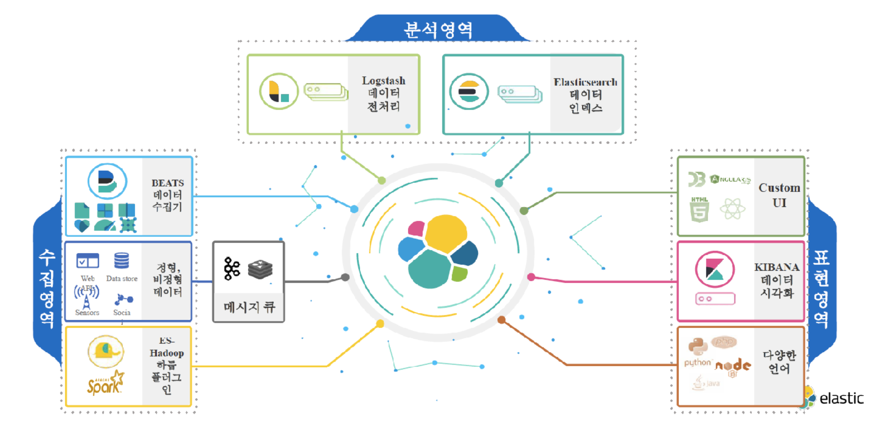

<br/>

elastic Stack 주요 기능  
- x-pack 사용을 위해서는 상용 버전 구매 필요   

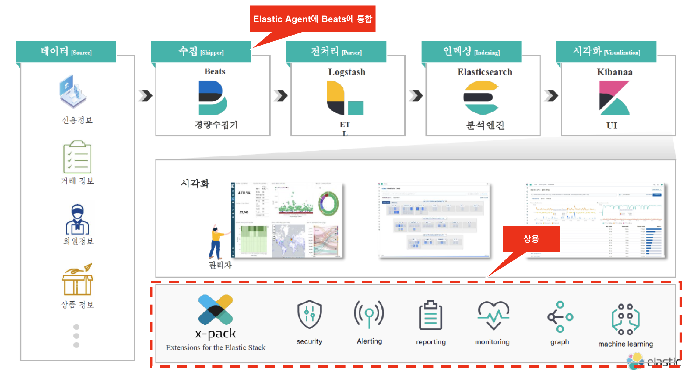

<br/>

elastic License 정책  

- 무료는  Basic  

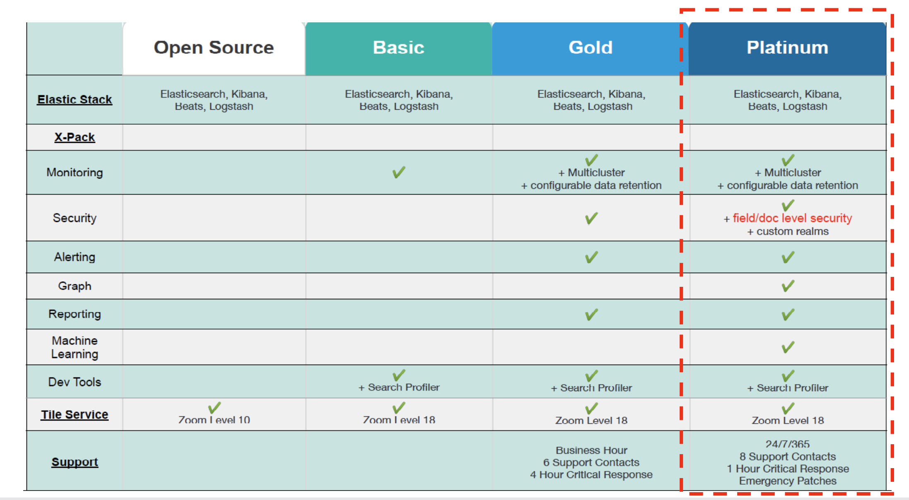

<br/>

Opensearch vs Elastic 차이  

- Elastic Stack 7.10.2 버전을 AWS에서 Fork하여 OpenSearch 로 오픈소스화. 그 이후 버전 (7.11 부터) 은 SSPL (Server Side
Public License )  


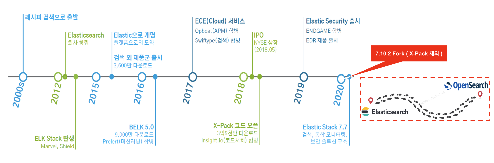

<br/>

Elastic vs RDBMS 차이    
참고 : https://kjw1313.tistory.com/65

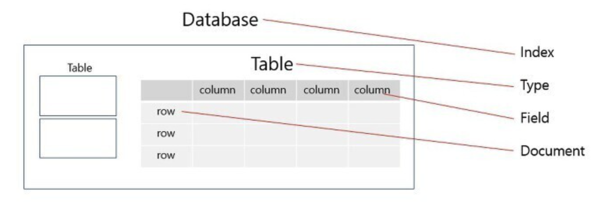

<br/>

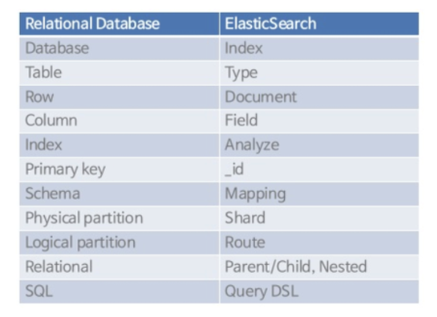

<br/>

기본적으로 용어가 다르며 RDBMS와는 아래의 차이점이 있다.  
 
- RDBMS  
    행 기반으로 데이터 저장.
    데이터 수정/삭제의 편의와 속도 면에서 강점.
    집계하는데 구조적 한계.  

- Elastic Search  
    단어를 기반으로(역 인덱스) 저장.
    단어가 저장된 도큐먼트를 알고 있기 때문에 개수와 상관없이 한 번의 조회로 검색을 끝낸다.  
    수정과 삭제는 많은 리소스가 소요되기에, 엘라스틱서치가 RDBMS를 완전히 대체할 수 없다. 

<br/>

### elastic 구조

- 클러스터  
    클러스트는 하나 이상의 노드(서버)가 모인 것이며, 전체 데이터를 저장하고 모든 노드를 포괄하는 통합 색인화 및 검색 기능을 제공한다. 클러스터는 고유한 이름으로 식별되는데, 기본 이름은 "elasticsearch"이다. 이 이름은 중요한데, 어떤 노드가 어느 클러스터에 포함되기 위해서는 이름에 의해 클러스터의 구성원이 되도록 설정되기 때문이다.   

    여러 대의 서버가 하나의 클러스터를 구성할 수 있고, 한 서버에 여러 개의 클러스터가 존재할 수도 있다. 

 <br/>

- 노드  
    Elasticsearch를 구성하는 하나의 단위 프로세스를 의미. 노드는 클러스터에 포함된 단일 서버로서 데이터를 저장하고 클러스터의 색인화 및 검색 기능에 참여한다. 노드는 클러스터처럼 이름으로 식별되는데, 기본 이름은 시작 시 노드에 지정되는 임의 UUID이다. 기본 이름 대신 어떤 노드 이름도 정의할 수 있다.   

    노드는 클러스터 이름을 통해 어떤 클러스터의 일부로 구성될 수 있다. 기본적으로 각 노드는 "elasticsearch"라는 이름의 클러스터에 포함되도록 설정된다. 즉 네트워크에서 다수의 노드를 시작할 경우 이 노드가 모두 자동으로 "elasticsearch"라는 단일 클러스터를 형성하고 이 클러스터의 일부가 된다.  

    하나의 클러스터에서 원하는 개수의 노드를 포함할 수 있다. 뿐만 다른 어떤 Elasticsearch 노드도 네트워크에서 실행되지 않은 상태에서 단일 노드를 시작하면 기본적으로 "elasticsearch"라는 이름의 새로운 단일 노드 클러스터가 생긴다.  

<br/>

- 인덱스   
    다소 비슷한 특성을 가진 문서의 모음이다. 이를테면 고객 데이터에 대한 색인, 제품 카탈로그에 대한 색인, 주문 데이터에 대한 색인을 각각 둘 수 있다. 색인은 이름으로 식별되며, 이 이름은 색인에 포함된 문서에 대한 색인화, 검색, 업데이트, 삭제 작업에서 해당 색인을 가리키는 데 쓰인다. 단일 클러스터에서 원하는 개수의 index를 정의할 수 있다.

 
<br/>

- 샤드 & 리플리카  
    index는 방대한 양의 데이터를 저장할 수 있고, 이 데이터가 단일 노드의 하드웨어 한도를 초과할 수도 있다. 예를 들어 10억 개의 문서로 구성된 하나의 색인에 1TB의 디스크 공간이 필요할 경우, 단일 노드의 디스크에서 수용하지 못하거나 단일 노드에서 검색 요청 처리 시 속도가 너무 느려질 수 있다.


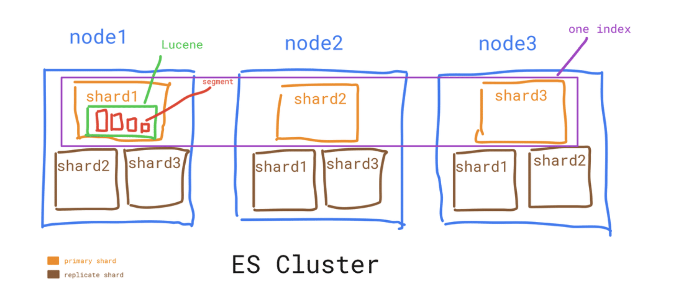

<br/>

현재 교육 환경은 single node cluster 로 구성이 되어 있다.  
elastic Cluster는 2개 Node 이상으로 구성이 되어야 하지만 resoure 문제로 1개로 구성을 하였다.  

<br/>

index management 에서 보면 특정 index 가 `yellow` 로 되어 있는데 replicas가 1개 인데 single node 이기 때문에 unstable 한 상태임을 나타내고 있다. replicas 를 0 으로 변경하면 `green` 으로 된다.  


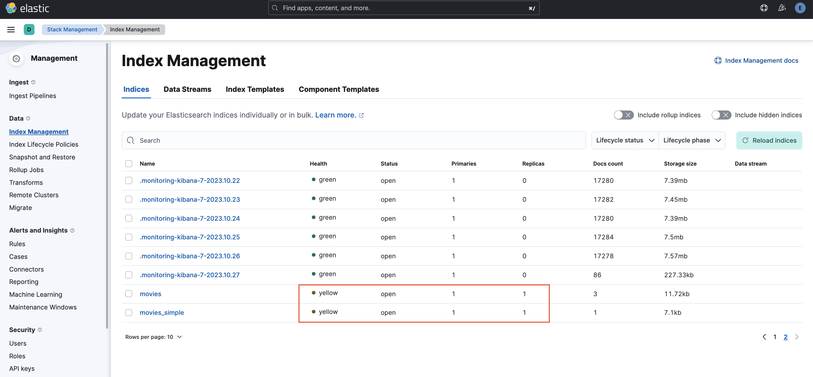

<br/>

yellow 상태는 모든 데이터의 읽기/쓰기가 가능한 상태이지만 일부 replica shard가 아직 배정되지 않은 상태를 말합니다.  

즉, 정상 작동중이지만 replica shard가 없기 때문에 검색 성능에 영향이 있을 수 있습니다.  

참고 : https://victorydntmd.tistory.com/311#cluster-status

<br>

elastic 8.0 소개 : https://youtu.be/GKIud5n7JeM?si=tg3vFJjtIQb-ldsu

<br/>

Elastic 개념 소개 :   
https://youtu.be/JqKDIg8fgd8?si=FGdfiZzAekuWO40O
- Datastream : 22분 42초 부터

<br/>


## 2. Elastic 기본 사용법 및 Kibana Dev Tool 실습

<br/>

Elastic 은 RDBMS 와 유사하며 elastic에서 접속하고 사용하기 위하여는 Rest API 를 사용 한다.    

kibana는 Dev Tool 라는 plugins 을 통해 Rest API 를 쉽게 사용 할 수 있게 해준다.

먼저 kibana 에 로그인을 해본다. 
- https://kibana.apps.okd4.ktdemo.duckdns.org/  
- id는 edu , 비밀번호는 기 공지 


<br/>

왼쪽 프레임 하단의 Dev Tool을 클릭합니다.  

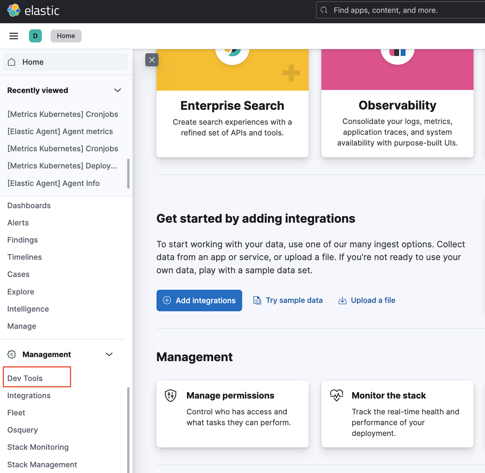

<br/>

첫 화면은 아래와 같이 나오고 하단에 실행 버튼을 클릭해봅니다.  

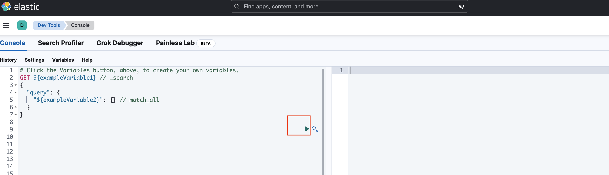

<br/>

원하는 API를 호출하고 실행 버튼을 누르면 선택된 영역의 Rest API가 수행이 되고 오른쪽에 결과 값이 나옵니다.  

<br/>


### 명령어 간단 실습

<br/>

```bash

# 전체 index (테이블) 조회
GET _cat/indices?v


# 전체 index (테이블) 조회 sorting desc
GET _cat/indices/*?v&s=index:desc

# elastic cluster 정보 조회
GET _cluster/stats/

# snapshot status 조회
GET _snapshot/_status

# index 별 storage size 조회
GET _cat/indices/*?v&s=store.size:desc

```

<br/>

### index 생성 및 조회

<br/>

index를 생성해 봅니다.       

PUT 를 사용을 하며 `_bulk` 라는 command 를 사용 합니다.  
- 교육생은 index 이름 변경 ( 예, movies_simple -> movies_simple_edu1 )
- Document는 1건을 생성하며 Array가 없는 구조  

```bash
PUT _bulk
{ "index" : { "_index": "movies_simple", "_id" : "1" } }
{"director": "Frankenheimer, John", "genre": "Drama", "year": 1962, "actor": "Lansbury, Angela", "title": "The Manchurian Candidate"}
```  

<br/>

Output  
```bash  
{
  "took": 2,
  "errors": false,
  "items": [
    {
      "index": {
        "_index": "movies_simple",
        "_id": "1",
        "_version": 3,
        "result": "updated",
        "_shards": {
          "total": 2,
          "successful": 1,
          "failed": 0
        },
        "_seq_no": 2,
        "_primary_term": 1,
        "status": 200
      }
    }
  ]
}
```  

<br/>

Index 를 조회를 해 봅니다.

```bash
GET movies_simple

# index 삭제 
DELETE movies_simple
```

<br/>

이제 입력된 Document 를 확인 해봅니다.  

```bash
# 전체 조회
GET movies_simple/_search

# 특정 document 조회
GET movies_simple/_doc/1

# 특정 document 삭제
DELETE movies_simple/_doc/1
```

<br/>

아래처럼 SQL 문 처럼 사용도 가능하다. Elastic 은 Array가 있으며 에러 발생한다.  

```bash
POST _sql?format=txt
{
  "query": "SELECT * FROM movies_simple"
}
```   

Output
```bash
     actor      |     director      |     genre     |         title          |     year      
----------------+-------------------+---------------+------------------------+---------------
Lansbury, Angela|Frankenheimer, John|Drama          |The Manchurian Candidate|1962   
```

<br/>

여러건 데이터가 있는 index를 생성해 봅니다.  

```bash
POST _bulk
{ "index" : { "_index": "movies", "_id" : "2" } }
{"director": "Frankenheimer, John", "genre": ["Drama", "Mystery", "Thriller", "Crime"], "year": 1962, "actor": ["Lansbury, Angela", "Sinatra, Frank", "Leigh, Janet", "Harvey, Laurence", "Silva, Henry", "Frees, Paul", "Gregory, James", "Bissell, Whit", "McGiver, John", "Parrish, Leslie", "Edwards, James", "Flowers, Bess", "Dhiegh, Khigh", "Payne, Julie", "Kleeb, Helen", "Gray, Joe", "Nalder, Reggie", "Stevens, Bert", "Masters, Michael", "Lowell, Tom"], "title": "The Manchurian Candidate"}
{ "index" : { "_index": "movies", "_id" : "3" } }
{"director": "Baird, Stuart", "genre": ["Action", "Crime", "Thriller"], "year": 1998, "actor": ["Downey Jr., Robert", "Jones, Tommy Lee", "Snipes, Wesley", "Pantoliano, Joe", "Jacob, Ir\u00e8ne", "Nelligan, Kate", "Roebuck, Daniel", "Malahide, Patrick", "Richardson, LaTanya", "Wood, Tom", "Kosik, Thomas", "Stellate, Nick", "Minkoff, Robert", "Brown, Spitfire", "Foster, Reese", "Spielbauer, Bruce", "Mukherji, Kevin", "Cray, Ed", "Fordham, David", "Jett, Charlie"], "title": "U.S. Marshals"}
{ "index" : { "_index": "movies", "_id" : "4" } }
{"director": "Ray, Nicholas", "genre": ["Drama", "Romance"], "year": 1955, "actor": ["Hopper, Dennis", "Wood, Natalie", "Dean, James", "Mineo, Sal", "Backus, Jim", "Platt, Edward", "Ray, Nicholas", "Hopper, William", "Allen, Corey", "Birch, Paul", "Hudson, Rochelle", "Doran, Ann", "Hicks, Chuck", "Leigh, Nelson", "Williams, Robert", "Wessel, Dick", "Bryar, Paul", "Sessions, Almira", "McMahon, David", "Peters Jr., House"], "title": "Rebel Without a Cause"}
```  

<br/>

### Opensearch 에서 사용

<br/>

Opensearch 는 Dev Tool 과 Query Workbench를 사용 할 수 있다.  

참고 : https://opensearch.org/docs/latest/search-plugins/sql/workbench/

<br/>

Dev Tools 에서 index 를 하나 생성한다.  

```bash
PUT accounts/_bulk?refresh
{"index":{"_id":"1"}}
{"account_number":1,"balance":39225,"firstname":"Amber","lastname":"Duke","age":32,"gender":"M","address":"880 Holmes Lane","employer":"Pyrami","email":"amberduke@pyrami.com","city":"Brogan","state":"IL"}
{"index":{"_id":"6"}}
{"account_number":6,"balance":5686,"firstname":"Hattie","lastname":"Bond","age":36,"gender":"M","address":"671 Bristol Street","employer":"Netagy","email":"hattiebond@netagy.com","city":"Dante","state":"TN"}
{"index":{"_id":"13"}}
{"account_number":13,"balance":32838,"firstname":"Nanette","lastname":"Bates","age":28,"gender":"F","address":"789 Madison Street","employer":"Quility","email":"nanettebates@quility.com","city":"Nogal","state":"VA"}
{"index":{"_id":"18"}}
{"account_number":18,"balance":4180,"firstname":"Dale","lastname":"Adams","age":33,"gender":"M","address":"467 Hutchinson Court","email":"daleadams@boink.com","city":"Orick","state":"MD"}
```  

<br/>

query workbench 로 이동하여 SQL 쿼리 처럼 사용할 수 있다. 단 Array인  경우는 첫 번째 값만 조회됨.

```bash
select * from accounts;
```

<br/>

## 3. Elastic 를 통합 데이터 수집 ( /w kubernetes integration )

<br/>

### fleet server 설치 ( Elastic Agent )

<br/>

Elastic Agent에 Fleet Server 역할을 부여하여 실행하면 Fleet Server 로
작동.

<br/>

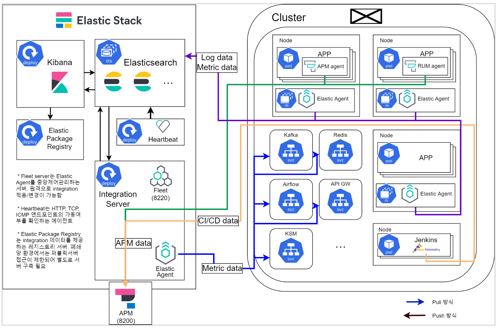

<br/>

host 설정이 안되어 있을 경우 name, URL(ex. https://fleet-server.elastic.svc:8220 ) 입력한 후 "Generate Fleet Server Policy" 로 policy 생성  


<br/>

설치 전 Kibana Fleet UI에서 Fleet Server의 service token 발급 필수이어서 아래의 `fleet-server-service-token` 값 복사 저장 필요.  


<br/>

```bash
curl -L -O https://artifacts.elastic.co/downloads/beats/elastic-agent/elastic-agent-8.5.1-linux-x86_64.tar.gz
tar xzvf elastic-agent-8.5.1-linux-x86_64.tar.gz
cd elastic-agent-8.5.1-linux-x86_64
sudo ./elastic-agent install \
  --fleet-server-es=http://localhost:9200 \
  --fleet-server-service-token=AAEAAWVsYXN0aWMvZmxlZXQtc2VydmVyL3Rva2VuLTE2OTcwMDQ3MT**c4LUY5a0MwZ0JJZw \
  --fleet-server-policy=fleet-server-policy
```  

<br/>

인증서 검증 절차 스킵 설정


Elasticsearch는 default로 자체 발급 사설인증서를 사용하기 때문에 별도로 인증서 발급 관련 설정하지 않을 경우 인증
서 검증 절차로 인해 Elasticsearch와 기타 요소 간의 통신이 안될 수 있음.    

<br/>

대표적으로 "x509: cetificate signed by unknown authority" error가 발생.
따라서 fleet server manifest에서 "FLEET_SERVER_ELASTICSEARCH_INSECURE"을 "1"(True)로 설정하여 인증서 검증 절차를 스킵  

<br/>

그리고 같은 클러스터에서 실행되는 daemonset Elastic Agent 또한 같은 이유로 아래와 같이 설정하여 인증서 검증 절차 를 스킵할 수 있음  

<br/> 

#### trouble shooting 

<br/>

fleet server 가 unhealth 가 보이거나 정상적이지 않은 경우에는
elasic-master pod 에 terminal 로 접속하여 elastic-agent restart 를 한다.

<br/>

Kibana > 우상단 (三) 메뉴 > Fleet > Settings Outputs > default(elasticsearch type) 편집  


<br/>

fleetserver 용 service accout 를 생성한다.  

```bash
[root@bastion elastic]# kubectl apply -f fleetserver_sa.yaml -n elastic
clusterrolebinding.rbac.authorization.k8s.io/elastic-agent-clusterrolebinding created
rolebinding.rbac.authorization.k8s.io/elastic-agent-rolebinding created
rolebinding.rbac.authorization.k8s.io/elastic-agent-kubeadm-config-rolebinding created
clusterrole.rbac.authorization.k8s.io/elastic-agent-clusterrole created
role.rbac.authorization.k8s.io/elastic-agent-role created
role.rbac.authorization.k8s.io/elastic-agent-kubeadm-config-role created
serviceaccount/elastic-agent created
[root@bastion elastic]# kubectl get sa -n elastic
NAME            SECRETS   AGE
builder         1         5d6h
default         1         5d6h
deployer        1         5d6h
elastic-agent   1         5s
```  

<br/>

fleet server 를 배포한다.  

```bash
[root@bastion elastic]# cat fleetserver_deploy.yaml
[root@bastion elastic]# kubectl apply -f fleetserver_deploy.yaml -n elastic
deployment.apps/integration-server-deployment created
service/fleet-server created
service/apm-server created
[root@bastion elastic]# kubectl get po -n elastic
NAME                                            READY   STATUS    RESTARTS   AGE
elasticsearch-master-0                          1/1     Running   0          56m
integration-server-deployment-dccb495dc-zpp7m   1/1     Running   0          54s
kibana-kibana-d8dcc5f6-4stg7                    1/1     Running   0          49m
```

<br/>

### APM 서버 설치

<br/>

APM Server는 8버전부터 APM integration으로 대체되어 바이너리 설 치 대신 APM integration을 Fleet server 혹은 기 설치된 Elastic Agent에 추가해서 사용한다.  

<br/>

이번 예제는  Fleet server에 APM integration을 추가함


APM integration 추가 및 설정  
- Kibana > 우상단 (三) 메뉴 > Integrations 으로 가서 APM 클릭


<br/>

Manage APM integration in Fleet 클릭  
- Add Elastic APM 클릭  

<br/>

서버 설정을 한다.  
- Host: 0.0.0.0:8200
- URL: {APM server route 주소} (ex. https://apm.apps.okd4.ktdemo.duckdns.org )  


<br/>

적용할 Agent policy 선택   
- Fleet server의 Agent policy 선택한 다음 save and continue


<br/>

위와 같이 추가된 것을 확인 가능  


<br/>

웹 브라우저에서 https://apm.apps.okd4.ktdemo.duckdns.org/ 로 연결하여 아래 처럼 `publish_ready` 가 `true` 로 되어 있으면 정상  

```bash
{
  "build_date": "2023-08-09T15:40:16Z",
  "build_sha": "c4ebfa692b24e576d0f1960f981deb461d99fae8",
  "publish_ready": true,
  "version": "8.9.1"
}
```


<br/>


```bash
[root@bastion elastic]# kubectl get svc -n elastic
NAME                            TYPE        CLUSTER-IP       EXTERNAL-IP   PORT(S)             AGE
apm-server                      ClusterIP   172.30.179.236   <none>        8200/TCP            104s
elasticsearch-master            ClusterIP   172.30.217.171   <none>        9200/TCP,9300/TCP   56m
elasticsearch-master-headless   ClusterIP   None             <none>        9200/TCP,9300/TCP   56m
fleet-server                    ClusterIP   172.30.115.208   <none>        8220/TCP            105s
kibana-kibana                   ClusterIP   172.30.17.252    <none>        5601/TCP            50m
```  

<br/>

###  Elastic Agent 설치 ( 2가지 )

<br/>


Elastic Stack은  크게 2가지 방식으로 Elastic Agent를 사용  

- `elastic` namespace에 Deployment로 Elastic Agent를 배포하여 여러 solution metric 을 수집   
- `elastic-daemonset` namespace에 Daemonset으로 Elastic Agent를 각 OKD 노드에 배포하여 노드 metric과 container log를 수집    


<br/>

#### kube metric 수집 ( 내부 API )

<br/>


Agent policy에 Integration 추가한다. 

<br/>


<br/>

Add Metrics Integration을 클릭한다.  


<br/>

Kubernetes 선택 한다.


Kubernetes metric 수집 항목은 아래와 같고 Add Kubernetes 버튼을 클릭한다.  


<br/>


내부 API를 호출 하는경우는 아래와 같이 체크를 한다.  ( kubelet 은 나중에 설정한다.   )


<br/>

host 에는 `https://kube-state-metric.openshift-monitoring.svc:8443` 를 입력한다.  

Leader Election 은 체크 하지 않는다.  

<br/>


<br/>

Adavanced Options 를 펼치고 아래와 같이 입력한다.  
- Bearer Token file : `/var/run/secrets/kubernetes.io/serviceaccount/token`
- SSL CA : `/var/run/secrets/kubernetes.io/serviceaccount/service-sa`

<br/>


<br/>

Host에는 클러스터에 설치되어 있는 kube-state-metrics의 service host와 port를 입력 (`https://kube-state-metrics.openshift-monitoring.svc:8443`)  

<br/>

Fleet Server는 Deployment로 배포되었기 때문에 Leader Election은 해제 (여러 Daemonset Elastic Agent 중 leader option을 가진 agent만 수집하기 위한 설정이므로 사용하지 않는다.)  

<br/>

processor는 전처리 모듈로 Elastic Agent가 Elasticsearch로 데이터를 전송하기 전에 데이터를 가공할 수 있다.

<br/>

API 서버 설정을 한다.    

기존 값은 변경하지 말고 processor에 아래 값을 추가한다.  

- Bearer Token file : `/var/run/secrets/kubernetes.io/serviceaccount/token`
- SSL CA : `/var/run/secrets/kubernetes.io/serviceaccount/ca`
- Hosts : `https://${env.KUBERNETES_SERVICE_HOST}:${env.KUBERNETES_SERVICE_PORT}`
- processor
    ```bash
    - add_fields:
        target: orchestrator.cluster
        fields:
          name: "ktdemo"
          url: "https://api.okd4.ktdemo.duckdns.org:6443"        
    ```  

<br/>


<br/>

Events도 마찬가지로 Leader Election 해제 processor는 위 설명과 동일
설정 완료하면 Existing Host에서 fleet 서버 선택후 save integration


<br/>


<br/>

아래와 같이 생성 된 것을 확인 할 수 있다.  


<br/>

Fleet Server Policy를 확인한다.   


<br/>

kubernetes Integration 을 생성하면 관련된 dashboard가 자동으로 생성이 된다.  


<br/>

Elastic Agent를 클릭하면 Agent의 metric 정보를 볼 수 있다.  

<br/>


<br/> 

##### toekn 값 확인

<br/>

`openshift-monitoring`  namespace 의 secret 에서 `kube-state-metrics-token` 으로 시작하는 값을 선택한다.  


<br/>

`service-ca.crt` 는 서비스 SSL CA 이고 `ca.crt` 는 API 서버의  SSL CA 이다.    

`token`은 Bearer token 이다.


```bash
[root@bastion elastic]# kubectl exec -it kube-state-metrics-7fc57d8785-r52m9 sh -n openshift-monitoring
kubectl exec [POD] [COMMAND] is DEPRECATED and will be removed in a future version. Use kubectl exec [POD] -- [COMMAND] instead.
sh-4.4$ cd /var/run/secrets/kubernetes.io/serviceaccount
sh-4.4$ pwd
/var/run/secrets/kubernetes.io/serviceaccount
sh-4.4$ ls -al
total 0
drwxrwsrwt. 3 root 1000430000 160 Oct 11 13:02 .
drwxr-xr-x. 3 root root        60 Oct 10 12:21 ..
drwxr-sr-x. 2 root 1000430000 120 Oct 11 13:02 ..2023_10_11_13_02_47.1047291665
lrwxrwxrwx. 1 root 1000430000  32 Oct 11 13:02 ..data -> ..2023_10_11_13_02_47.1047291665
lrwxrwxrwx. 1 root 1000430000  13 Oct 10 11:55 ca.crt -> ..data/ca.crt
lrwxrwxrwx. 1 root 1000430000  16 Oct 10 11:55 namespace -> ..data/namespace
lrwxrwxrwx. 1 root 1000430000  21 Oct 10 11:55 service-ca.crt -> ..data/service-ca.crt
lrwxrwxrwx. 1 root 1000430000  12 Oct 10 11:55 token -> ..data/token
sh-4.4$ ls
ca.crt	namespace  service-ca.crt  token
sh-4.4$ pwd
/var/run/secrets/kubernetes.io/serviceaccount
sh-4.4$ cat /var/run/secrets/kubernetes.io/serviceaccount/service-ca.crt
-----BEGIN CERTIFICATE-----
MIIDUTCCAjmgAwIBAgIIQ88lQjt5bBQwDQYJKoZIhvcNAQELBQAwNjE0MDIGA1UE
Awwrb3BlbnNoaWZ0LXNlcnZpY2Utc2VydmluZy1zaWduZXJAMTY5MzUzODM5MDAe
Fw0yMzA5MDEwMzE5NDlaFw0yNTEwMzAwMzE5NTBaMDYxNDAyBgNVBAMMK29wZW5z
aGlmdC1zZXJ2aWNlLXNlcnZpbmctc2lnbmVyQDE2OTM1MzgzOTAwggEiMA0GCSqG
******
bfGbmjwo3/A2DBLczYfJPmmFdlg5lRcFb3gh4MO/UFhbJw7jRxo+PynAXp9COZWA
f3G1/i1d5IMbRSMulaFqpyQBNboF4GL/OMRqbaXM3PT0KWIIOyXPd3DziC+lA9Yx
VSmOIAv12CRxennyDRCsFgqLvX09m0MUw37IsK0uk1lfFDDeVQ==
-----END CERTIFICATE-----
```  


<br/>

데이터가 수집이 되는지 확인 하기 위해서 아래처럼 Index Management -> Data Streams 에 보면 `metrics-kuber` 로 시작되는 stream이 보인다.  


<br/>

Discover 에서  `dataset` 을 `metrics-kubernetes` 로 생성한다.


<br/>

`Selected fields` 에  `data_stream.dataset` 을 선택하면 dataset 값만 보여진다.


<br/>

kuubernetes overview dashboard 를 보면 데이터가 안나오는 것들이 있는데 이 값은 `kube_state_metric` 이 아닌 `kubelet` 에서 수집할 수 있다.  


<br/>


<br/>

### kubelet 으로  metric 과 container 로그 수집

<br/>

kubelet 과 container 로그를 수집 하기 위해서는 worker node에서 데이터를 수집해야 하며 Daemonset 형태로 Elastic Agent 가 배포가 되어야 한다.  

<br/>

default 라는 이름으로 agent policy 를 생성한다.  

<br/>


<br/>

Add Agent를 클릭한다.

<br/>


<br/>

TOKEN 값만 확인 하고 복사한다.


Agent policy에 Integration 추가
- Add Kubernetes를 클릭한다.  

<br/>


<br/>

`kubernetes-common` 이라는 이름으로 integration을 만든다.  


<br/>

OKD Console 에서 kubelet 에서 metric 서비스 포트를 확인한다.  


<br/>


`kubernetes-common` 이라는 이름의 integration을 수정한다.  

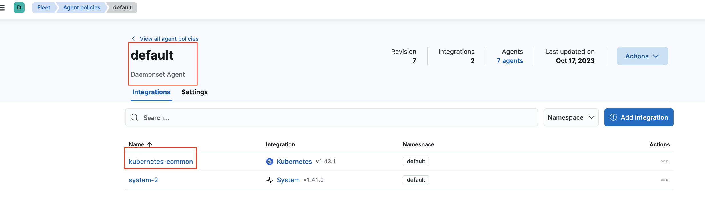

<br/>

아래와 같이 수집할 항목을 체크한다.  

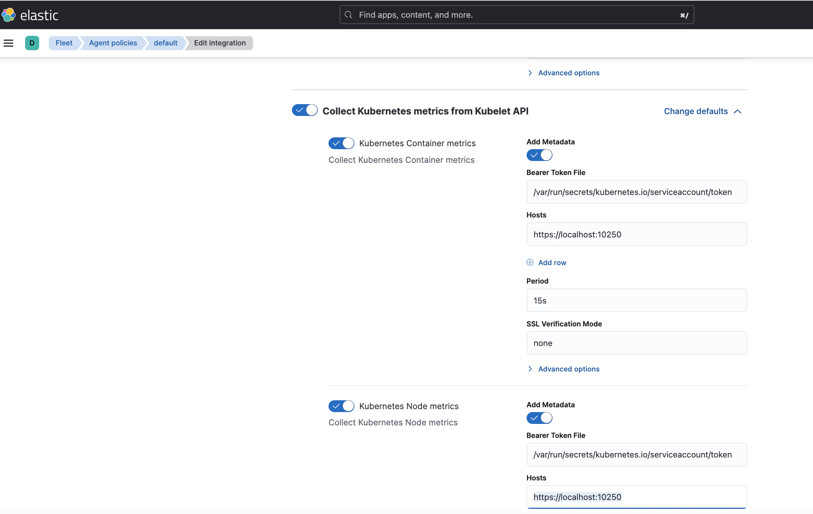

<br/>

먼저 Kubelet API 를 설정한다.   
- Bearer Token File 은 기존 값 유지 : `/var/run/secrets/kubernetes.io/serviceaccount/token`
- hosts의 포트는 워커노드 hostname 을 일력하는데 Daemonset 이 hostnetwork 로 설정이 되기때문에 localhost로  설정
- hosts의 포트는 워커노드의 kubelet 노출하는 포트는 10250 으로 설정  
- Hosts : `https://localhost:10250`
- Period : `15s`
- SSL Verification Mode : `none`  

<br/>

Advanced Options 을 열고 processor 에는 아래와 같이 설정한다.    

<br/>

```bash
- add_fields:
    target: orchestrator.cluster
    fields:
      name: "ktdemo"
      url: "https://api.okd4.ktdemo.duckdns.org:6443"
```  

<br/>

OKD의 Observe -> Targets 메뉴를 보면 kublet이 10250 으로 포트를 노출하고 있는 것을 확인 할 수 있다.  


<br/>

`elastic-daemonset` namespace를 생성하고 `node selector`를 설정 하지 않는다.    
- Daemonset 이 모든 Node에서 작동해야 함

<br/>

```bash
[root@bastion elastic]# oc new-project elastic-daemonset
Now using project "elastic-daemonset" on server "https://api.okd4.ktdemo.duckdns.org:6443".

You can add applications to this project with the 'new-app' command. For example, try:

    oc new-app rails-postgresql-example

to build a new example application in Ruby. Or use kubectl to deploy a simple Kubernetes application:

    kubectl create deployment hello-node --image=k8s.gcr.io/e2e-test-images/agnhost:2.33 -- /agnhost serve-hostname
```  

<br/>

권한은 cluster role 로 생성한다.  

```bash
[root@bastion elastic]# kubectl apply -f elastic_daemonset_sa.yaml -n elastic-daemonset
clusterrolebinding.rbac.authorization.k8s.io/elastic-agent-rolebinding created
clusterrolebinding.rbac.authorization.k8s.io/elastic-agent-kubeadm-config-rolebinding created
clusterrole.rbac.authorization.k8s.io/elastic-agent-role created
clusterrole.rbac.authorization.k8s.io/elastic-agent-kubeadm-config-role created
serviceaccount/elastic-agent created
```

`elastic-agent` sa 에 권한을 할당한다.  

```bash
[root@bastion elastic]# oc adm policy add-scc-to-user anyuid -z elastic-agent -n elastic-daemonset
clusterrole.rbac.authorization.k8s.io/system:openshift:scc:anyuid added: "elastic-agent"
[root@bastion elastic]# oc adm policy add-scc-to-user privileged -z elastic-agent -n elastic-daemonset
clusterrole.rbac.authorization.k8s.io/system:openshift:scc:privileged added: "elastic-agent"
```

<br/>

node-exporter 권한을 할당한다. ( 불필요 할듯 )  

```bash
[root@bastion elastic]# oc adm policy add-scc-to-user node-exportor -z elastic-agent -n elastic-daemonset
clusterrole.rbac.authorization.k8s.io/system:openshift:scc:node-exportor added: "elastic-agent"
```  

<br/>

elastic_daemonset_agent.yaml 에서 token 값을 replace 한다.  

```bash
[root@bastion elastic]# vi elastic_daemonset_agent.yaml
[root@bastion elastic]# kubectl apply -f elastic_daemonset_agent.yaml -n elastic-daemonset
daemonset.apps/elastic-agent created
[root@bastion elastic]# kubectl get po -n elastic-daemonset -o wide
NAME                  READY   STATUS    RESTARTS   AGE     IP              NODE                            NOMINATED NODE   READINESS GATES
elastic-agent-8fx95   1/1     Running   0          7m46s   192.168.1.149   okd-3.okd4.ktdemo.duckdns.org   <none>           <none>
elastic-agent-8qr6d   1/1     Running   0          7m46s   192.168.1.146   okd-1.okd4.ktdemo.duckdns.org   <none>           <none>
elastic-agent-qvfzg   1/1     Running   0          7m46s   192.168.1.154   okd-5.okd4.ktdemo.duckdns.org   <none>           <none>
elastic-agent-tdx82   1/1     Running   0          7m46s   192.168.1.150   okd-4.okd4.ktdemo.duckdns.org   <none>           <none>
elastic-agent-zhmzg   1/1     Running   0          7m47s   192.168.1.148   okd-2.okd4.ktdemo.duckdns.org   <none>           <none>
``` 

<br/>

Fleet agent 가 노드 마다 설정 이 된 것을 확인 할 수 있다.  


<br/>

정상적으로 Agent POD 가 생성이 되면 데이터를 수집하게 되고 대쉬보드를 보면 기본에 빠졌던 필드가 채워진 것을 볼 수 있다.   


<br/>


metric 이 정상적으로 수집이 되는 것을 확인 후에 다음 설정을 진행한다. 

<br/>

Kubernetes Scheduler 를 설정한다.   
- Bearer Token File 은 기존 값 유지 : `/var/run/secrets/kubernetes.io/serviceaccount/token`
- Hosts : `https://0.0.0.0:10259`
- Period : `15s`
- SSL Verification Mode : `none`  

<br/>

Advanced Options 을 열고 processor 에는 아래와 같이 설정한다.      
- Kubernetes Scheduler Label key : `app`
- Kubernetes Scheduler Label value : `openshift-kube-scheduler`
- processor

  ```bash
  - add_fields:
      target: orchestrator.cluster
      fields:
        name: "ktdemo"
        url: "https://api.okd4.ktdemo.duckdns.org:6443"
  ```  
<br/>


<br/>

Openshift/OKD는 Kubernetes와 다르게 scheduler label이 `app: openshift-kube-scheduler` 이고 k8s는 `app:kube-scheduler`

<br/>

Kubernetes Controller Manger 를 설정한다.   
- Bearer Token File 은 기존 값 유지 : `/var/run/secrets/kubernetes.io/serviceaccount/token`
- Hosts : `https://0.0.0.0:10257`
- Period : `15s`
- SSL Verification Mode : `none`  

<br/>

Advanced Options 을 열고 processor 에는 아래와 같이 설정한다.      
- Kubernetes Scheduler Label key : `app`
- Kubernetes Scheduler Label value : `kube-controller-manager`
- processor

  ```bash
  - add_fields:
      target: orchestrator.cluster
      fields:
        name: "ktdemo"
        url: "https://api.okd4.ktdemo.duckdns.org:6443"
  ```  
<br/>


<br/>

로그를 수집하기 위한 설정을 한다.  

- condition : `${kubernetes.container.name} != 'istio-proxy' and ${kubernetes.container.name} != 'istio-init' and ${kubernetes.container.name} != 'elastic-agent' and ${kubernetes.container.name} != 'elastic-agent-integrations' and ${kubernetes.container.name} != 'elasticsearch' and ${kubernetes.container.name} != 'kibana'`
- Kubernetes container log path : `/var/log/containers/*${kubernetes.container.id}.log`
- Container parser's stream configuration : `all`
- Container parser's format configuration : `auto`
- processor

  ```bash
  - add_fields:
      target: orchestrator.cluster
      fields:
        name: "ktdemo"
        url: "https://api.okd4.ktdemo.duckdns.org:6443"
  ```    


<br/>

container 로그 수집 설정을 한다.    


<br/>


## 4. Application metric 수집 ( /w prometheus integration )

<br/>

Application의  metric를 수집하기 위해서는  prometheus integration 설치 해야 한다.    
- prometheus 에서 데이터를 수집하는 것이 아니고 prometheus 형식의 데이터를 읽는 것 

<br/>

아래는 Prometheus를 사용하는 경우이고 

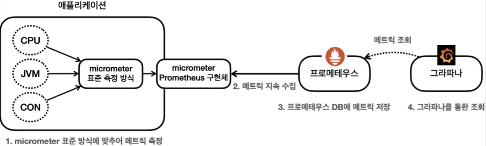

<br/>

이것은 Elastic을 사용 하는 경우이다.  

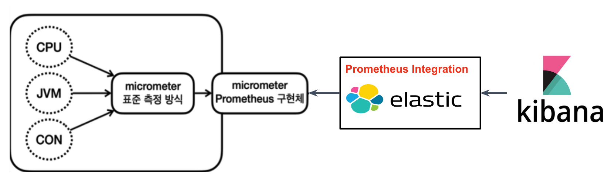

<br/>

우리가 테스트 할 Application 이고 SpringBot 로 개발되어 있다.  
- 소스 위치 : https://github.com/shclub/edu12-4  

<br/>

micrometer 를 사용을 사용하기 위해서는   

pom.xml 화일에 아래 dependency를 추가한다.    

```bash
		<!-- https://mvnrepository.com/artifact/io.micrometer/micrometer-registry-prometheus -->
		<dependency>
		    <groupId>io.micrometer</groupId>
		    <artifactId>micrometer-registry-prometheus</artifactId>
		</dependency>
```

<br/>

그리고 application.yml 화일에 actuator expose 를 추가하고 반드시 prometheus를 enable 해준다.  

application-dev.yml  
```bash
# spring boot - actuator expose
management:
  endpoints:
    health:
      show-details: always
    loggers:
      enabled: true
    prometheus:
      enabled: true
    web:
      exposure:
        include: health,prometheus,loggers,metrics,caches,beans
```  

<br/>

로컬에서 조회해 보면 아래와 같이 보인다.  

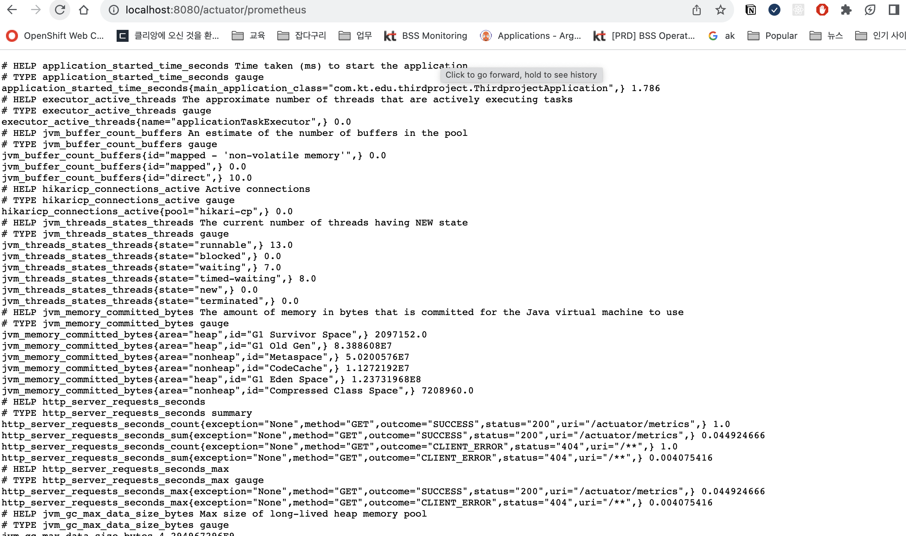

<br/>

배포는 Argocd로 진행을 하며 먼저 아래 github repostory를 fork 합니다. ( 안해도 실습 가능 )  
- https://github.com/shclub/edu_advanced_backend_gitops/  

<br/>

웹 브라우저에서 https://argocd.apps.okd4.ktdemo.duckdns.org/ 로 이동한 후 로그인합니다.    

Application을 생성합니다.    
- Application Name : edu25-backend ( 본인  namespace + backend )  
- Project Name : edu25 ( 본인 namespace )
- Repositor URL : https://github.com/shclub/edu_advanced_backend_gitops.git
- Path : . ( github 현재 폴더)
- Cluster URL : https://kubernetes.default.svc
- Namespace : edu25 ( 본인 namespace )  

아래 kustomization 내용을 확인하고 Create 버튼을 클릭합니다.    


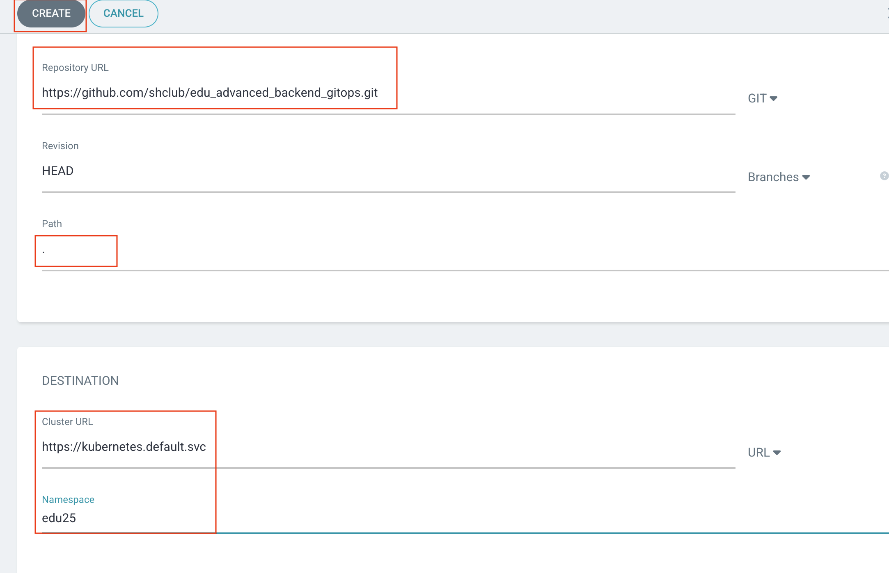


<br/>

생성된 카드 에서 Sync 버튼을 클릭합니다.  

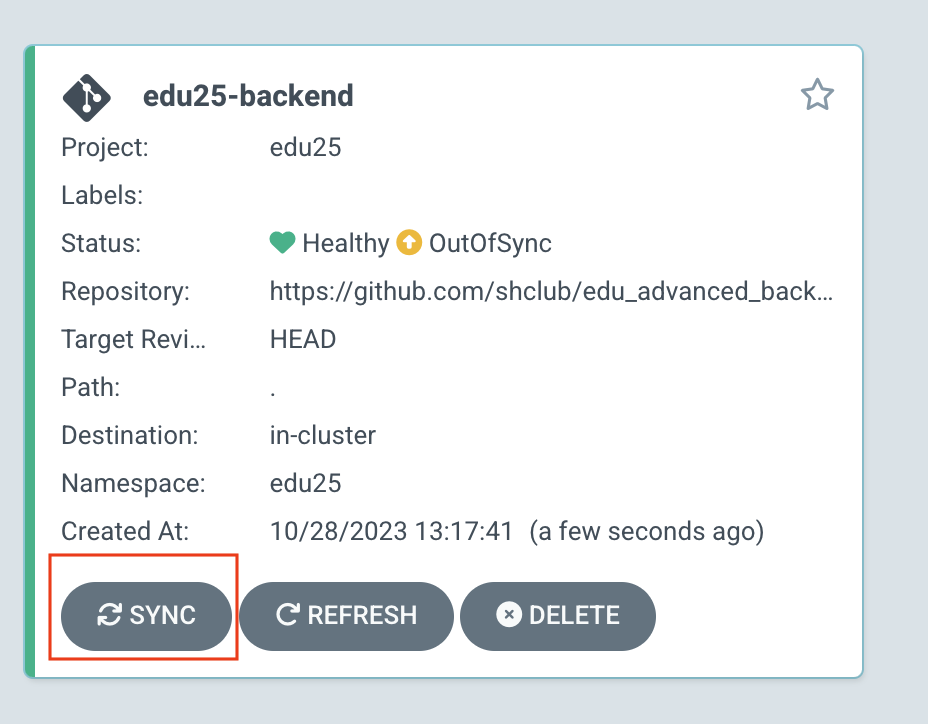

<br/>

Synchronize resource 체크가 된 것을 확인하고 `Synchronize ` 버튼을 눌러 배포를 합니다.  

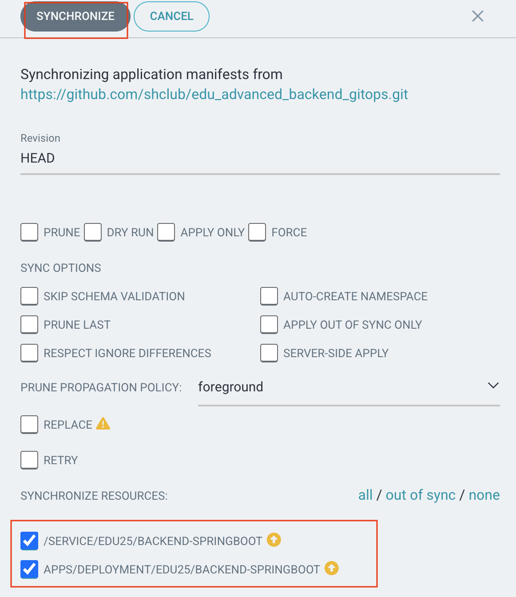

<br/>

카드를 클릭하여 배포 현황을 파악합니다.  

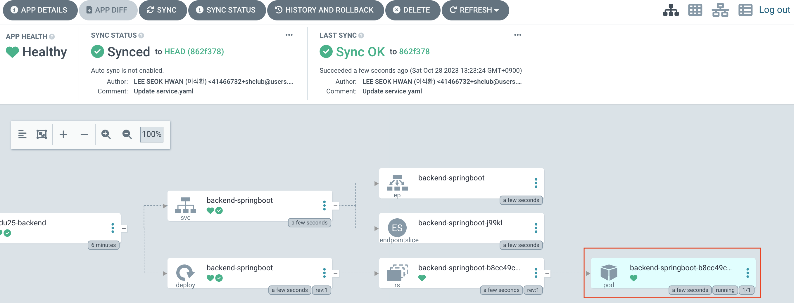

<br/>

POD를 클릭하여 log를 확인합니다.  

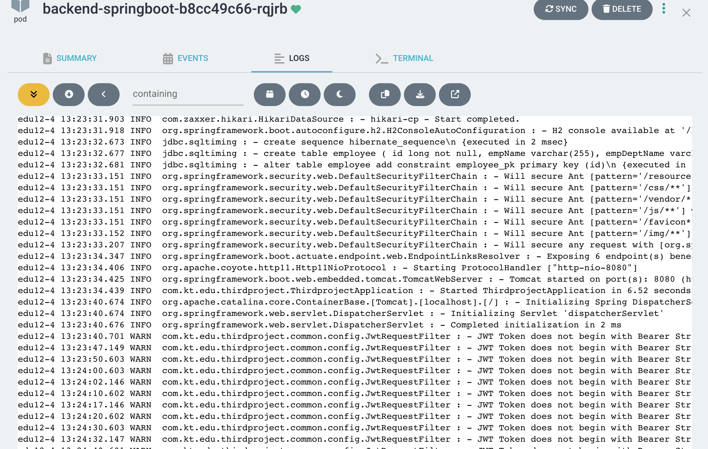

<br/>

배포한 backend-springboot 서비스와 pod를 조회해 본다.    
서비스 포트와 pod 이름을 확인한다.  

<br/>

```bash
[root@bastion elastic]# kubectl get svc -n edu25
NAME                         TYPE        CLUSTER-IP       EXTERNAL-IP   PORT(S)    AGE
backend                      ClusterIP   172.30.106.161   <none>        8080/TCP   2d15h
backend-springboot           ClusterIP   172.30.37.27     <none>        80/TCP     15h
elastic-agent-integrations   ClusterIP   172.30.65.7      <none>        8125/UDP   142m
external-node-exporter       ClusterIP   172.30.94.58     <none>        9100/TCP   3d17h
frontend                     ClusterIP   172.30.43.109    <none>        8080/TCP   2d15h
spring-petclinic             ClusterIP   172.30.46.177    <none>        8080/TCP   2d3h
[root@bastion elastic]# kubectl get po -n edu25
NAME                                                    READY   STATUS    RESTARTS       AGE
backend-springboot-b8cc49c66-c5n5s                      1/1     Running   0              14h
backend-v1-86d9c7747d-dqccf                             1/1     Running   0              2d15h
elastic-agent-integrations-deployment-fd85dfd6b-jvfwx   1/1     Running   0              148m
frontend-v1-5c9cdf678f-xbkxh                            1/1     Running   0              2d15h
netshoot                                                1/1     Running   55 (21m ago)   3d20h
network-tools-6875694c9b-n8kp9                          1/1     Running   36 (68m ago)   2d13h
spring-petclinic-55cc6c784b-vwzvv                       1/1     Running   0              2d4h
```  

<br/>


Prometheus 형식은 SpringBoot는 `/actuator/prometheus` 로 확인 가능 하고  Quarkus는 `/q/metrics` 로 조회 가능하다.  

<br/>

netshoot pod에 접속한후 `curl backend-springboot/actuator/prometheus` 로 expose 하는 값을 확인한다.    

```bash
[root@bastion elastic]# kubectl exec -it netshoot sh -n edu25
kubectl exec [POD] [COMMAND] is DEPRECATED and will be removed in a future version. Use kubectl exec [POD] -- [COMMAND] instead.
```  

<br/>

```bash
~ # curl backend-springboot/actuator/prometheus
```  

<br/>


```bash
# HELP application_ready_time_seconds Time taken (ms) for the application to be ready to service requests
# TYPE application_ready_time_seconds gauge
application_ready_time_seconds{main_application_class="com.kt.edu.thirdproject.ThirdprojectApplication",} 6.422
# HELP hikaricp_connections Total connections
# TYPE hikaricp_connections gauge
hikaricp_connections{pool="hikari-cp",} 2.0
# HELP jvm_threads_daemon_threads The current number of live daemon threads
# TYPE jvm_threads_daemon_threads gauge
jvm_threads_daemon_threads 19.0
# HELP disk_total_bytes Total space for path
# TYPE disk_total_bytes gauge
...
```  

<br/>

### Solution Integration Elastic Agent 생성 

<br/>

Prometheus Integration을 생성하기 전에  Solution Integration Elastic Agent 를 생성합니다.  

Solution integration Elastic Agent용 enroll token 발급을 한다. 
Kibana > 우상단 (三) 메뉴 > Fleet > Agent policies   

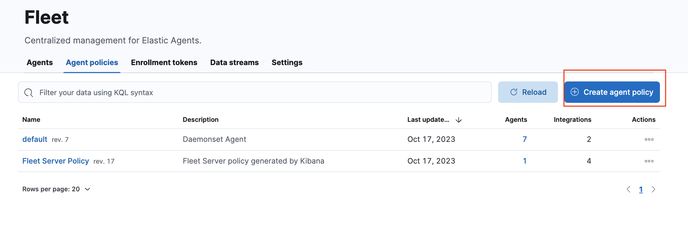

<br/>

policy name 설정 > Collect system logs and metrics 해제 > Collect agent logs, Collect agent metrics 해제(agent 모니 터링이 필요할 때 동적으로 활성화 가능) > Create agent policy 

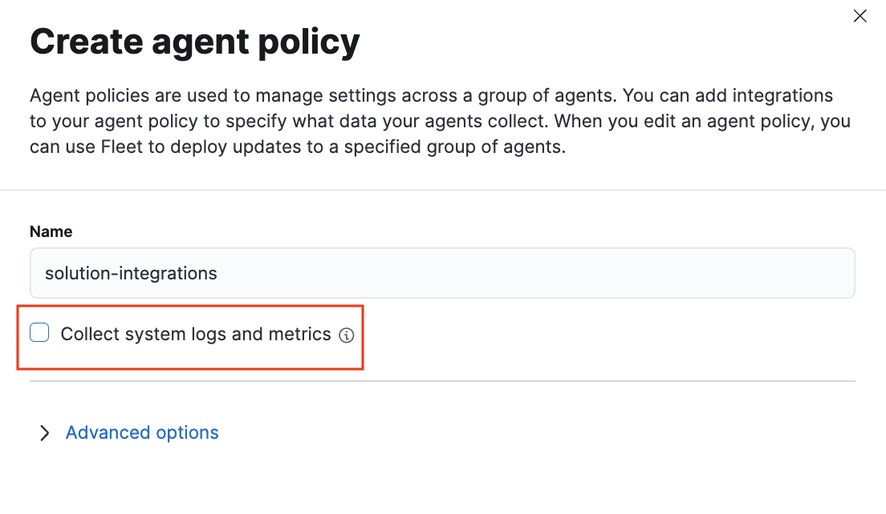

<br/>

생성한 policy 선택 > Add agent > Install Elastic Agent on your host에서 Kubernetes 선택

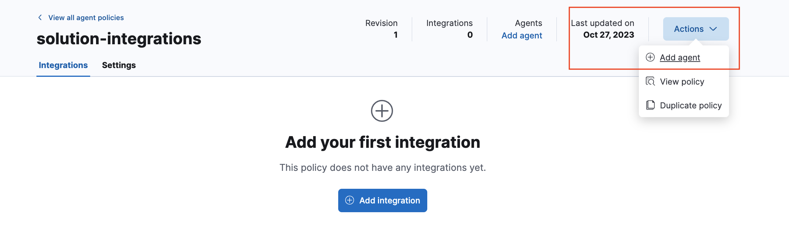

<br/>

FLEET_ENROLLMENT_TOKEN 값을 복사한다.  

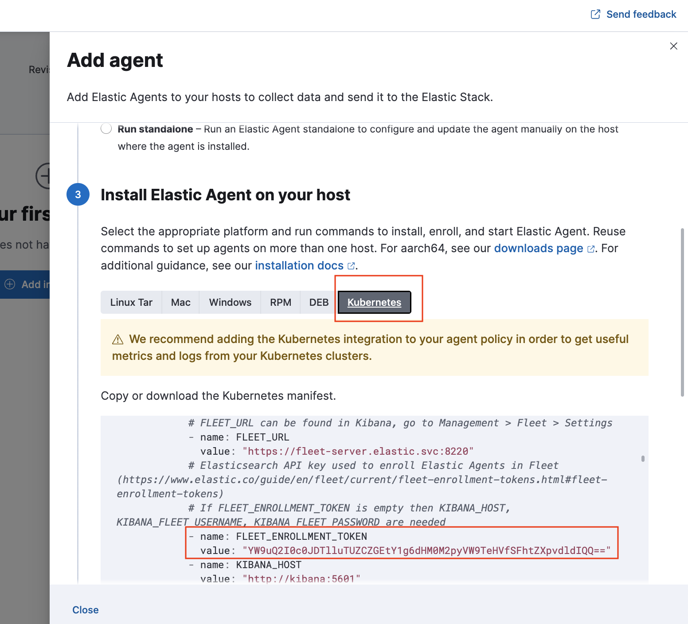  

<br/>

agent를 생성합니다. 
- Solution integration Elastic Agent 설치할 때는 같은 Fleet Server 설치 시 사용했던 serviceaccount를 사용  

```bash
[root@bastion elastic]# kubectl apply -f elastic_solution_agent.yaml -n elastic
deployment.apps/elastic-agent-integrations-deployment created
service/elastic-agent-integrations created
```  
<br/>

생성한 Agent 정상연동 확인을 합니다.  

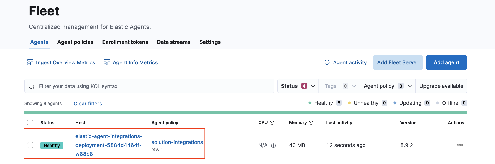

<br/>

### Promethues Integration 생성

<br/>

Kibana > 우상단 (三) 메뉴 > Fleet > Agent policies > solution integrations 용 agent policy 선택 > Add integration > prometheus 검색 > Prometheus 선택    

<br/>

FLEET_ENROLLMENT_TOKEN 값 기록

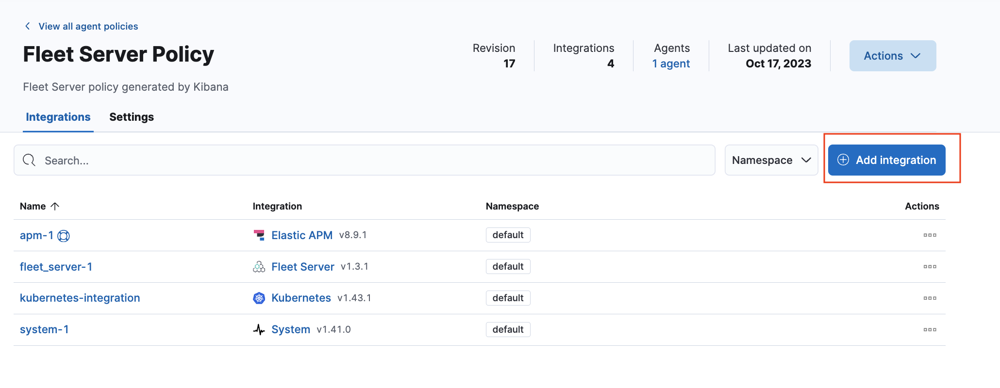

<br/>

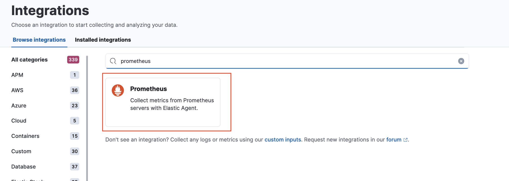

<br/>

Add Promtheus 클릭


<br/>

서비스 이름과 expose 하는 port를 확인한다.  

```bash
[root@bastion elastic]# kubectl get svc -n edu25
NAME                         TYPE        CLUSTER-IP       EXTERNAL-IP   PORT(S)    AGE
backend                      ClusterIP   172.30.106.161   <none>        8080/TCP   2d15h
backend-springboot           ClusterIP   172.30.37.27     <none>        80/TCP     15h  
```  

<br/>

다른 Prometheus integration과 구분하기 위해 name과 namespace 설정  
- host : backend-springboot.edu25 
- 예: <서비스 이름>.<namespace>  

<br/> 

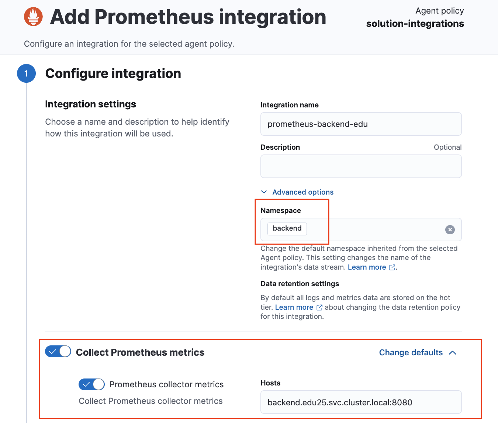

<br/>

Metrics Path  를 설정한다.
- /actuator/prometheus : SpringBoot + Micrometer  
- /q/metrics : Quarkus   


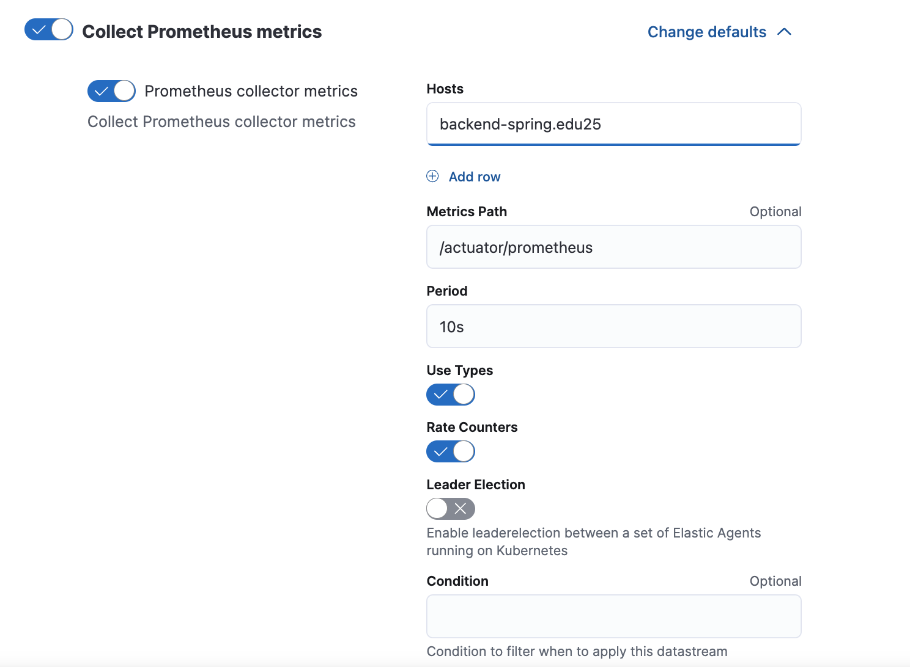  

Save and Deploy를 한다.

<br/>

Index Management -> Data Streams로 이동하여 `backend` 로 검색하면 `metrics-prometheus:collector-backend` 이 생성 된 것을 확인 할 수 있다.   
- `backend` 는 integration 에서 설정한 namespace 값이고 k8s namespace 와는 다르다.  
 
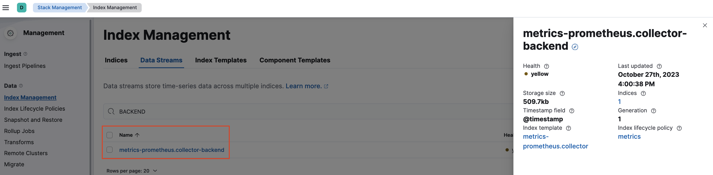  

<br/>

Discover 로 이동하여 create Data view 메뉴를 클릭하고 `prometheus-backend` 라는 data view ( 구 index pattern )를 생성한다.  

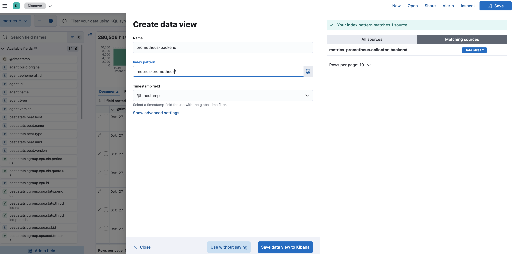  

<br/>

`prometheus-backend` 라는 data view 를 선택하면 metric 정보를 확인 할 수 있다.   

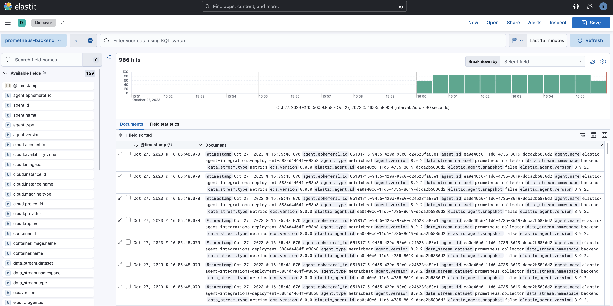  

<br/>

prometheus dashboard 도 자동으로 생성이 되어 있다.   

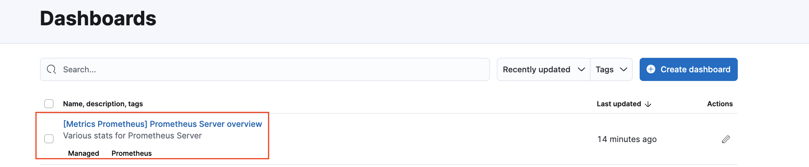  

<br/>

## 5. Application log 보기

<br/>

elastic 에서 위에서  로그 수집을 미리 설정해 놓았고 Daemonset 으로 수집한다.      


<br/>

kubernetes 환경에서는 Application log는 console 로그로만 출력해야한다.  
- https://github.com/shclub/edu12-4/blob/master/src/main/resources/log4j2.xml  


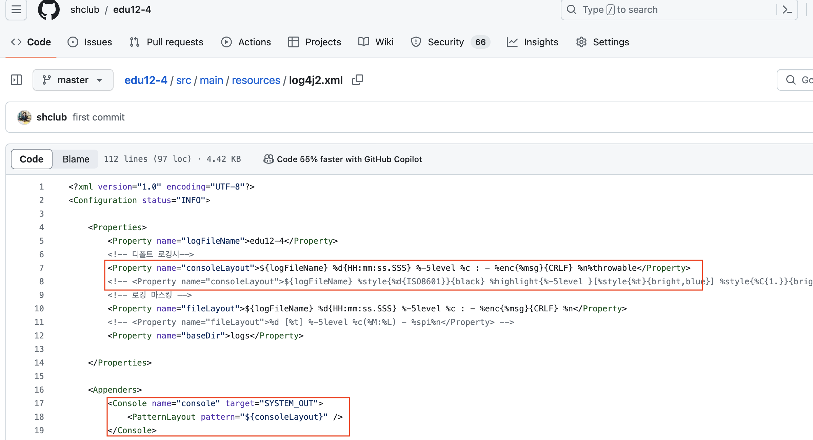  

<br/>

worker.sh 를 실행하여 worker node 에 접속해본다.    

```bash
root@edu25:~# worker.sh
Worker Node OKD-2 connect.
core@okd-2.okd4.ktdemo.duckdns.org's password:
Fedora CoreOS 37.20230218.3.0
Tracker: https://github.com/coreos/fedora-coreos-tracker
Discuss: https://discussion.fedoraproject.org/tag/coreos

Last login: Fri Oct 27 12:08:24 2023 from 192.168.1.40
```  

<br/>

`/var/log/containers` 폴더를 조회 해 보면 POD 이름으로 시작하는 로그를 볼수 있고 해당 화일을 Elastic Agent가 수집한다.     

```bash
[core@okd-7 ~]$ ls /var/log/containers
backend-springboot-b8cc49c66-rqjrb_edu25_backend-springboot-1938caed5aa0022aae6993d5bb498b4317913bba04b9a4b71486b043d154423a.log
collect-profiles-28308330-kxkgs_openshift-operator-lifecycle-manager_collect-profiles-9bc94d2857b05ca9e5e8119007ce9cd31305f31b5fe246c7bb045f34e3fa2f45.log
collect-profiles-28308345-m264d_openshift-operator-lifecycle-manager_collect-profiles-6d148606166f257aa9bdbcf89b8a254d7d818a0b32ea24bb4e6b4d89805f704f.log
collect-profiles-28308360-7xxtm_openshift-operator-lifecycle-manager_collect-profiles-d3529ebe1781940f7a04f6ace158a592e1352f2ea8b9a52ac2000d28ccd682a6.log
...
```  

<br/>

`backend-springboot` POD 이름으로 시작하는 로그를 아래와 같이 확인해 봅니다.     

```bash
[core@okd-7 ~]$ sudo cat /var/log/containers/backend-springboot-b8cc49c66-rqjrb_edu25_backend-springboot-1938caed5aa0022aae6993d5bb498b4317913bba04b9a4b71486b043d154423a.log | more
2023-10-28T13:23:28.395700386+09:00 stdout F 2023-10-28 13:23:28,393 main INFO Log4j appears to be running in a Servlet environment, but there's no log4j-web module available. If you wa
nt better web container support, please add the log4j-web JAR to your web archive or server lib directory.
2023-10-28T13:23:28.449052782+09:00 stdout F    _____                                                    ______   _____    _    _
2023-10-28T13:23:28.449052782+09:00 stdout F   / ____|                                                  |  ____| |  __ \  | |  | |
2023-10-28T13:23:28.449052782+09:00 stdout F  | |        __ _   _ __    __ _  __   __   __ _   _ __     | |__    | |  | | | |  | |
2023-10-28T13:23:28.449052782+09:00 stdout F  | |       / _` | | '__|  / _` | \ \ / /  / _` | | '_ \    |  __|   | |  | | | |  | |
2023-10-28T13:23:28.449052782+09:00 stdout F  | |____  | (_| | | |    | (_| |  \ V /  | (_| | | | | |   | |____  | |__| | | |__| |
2023-10-28T13:23:28.449052782+09:00 stdout F   \_____|  \__,_| |_|     \__,_|   \_/    \__,_| |_| |_|   |______| |_____/   \____/
2023-10-28T13:23:28.449052782+09:00 stdout F
2023-10-28T13:23:28.449052782+09:00 stdout F :: Spring Boot 2.6.3 ::
2023-10-28T13:23:28.449052782+09:00 stdout F
2023-10-28T13:23:28.531339054+09:00 stdout F edu12-4 13:23:28.524 INFO  com.kt.edu.thirdproject.ThirdprojectApplication : - Starting ThirdprojectApplication v0.0.1-SNAPSHOT using Java 1
7.0.2 on backend-springboot-b8cc49c66-rqjrb with PID 1 (/app.jar started by root in /)
2023-10-28T13:23:28.538100758+09:00 stdout F edu12-4 13:23:28.537 INFO  com.kt.edu.thirdproject.ThirdprojectApplication : - The following profiles are active: dev
2023-10-28T13:23:30.079357765+09:00 stdout F edu12-4 13:23:30.079 INFO  org.springframework.data.repository.config.RepositoryConfigurationDelegate : - Bootstrapping Spring Data JDBC rep
ositories in DEFAULT mode.
2023-10-28T13:23:30.144785915+09:00 stdout F edu12-4 13:23:30.144 INFO  org.springframework.data.repository.config.RepositoryConfigurationDelegate : - Finished Spring Data repository sc
anning in 59 ms. Found 1 JDBC repository interfaces.
2023-10-28T13:23:30.460036029+09:00 stdout F edu12-4 13:23:30.459 INFO  com.ulisesbocchio.jasyptspringboot.configuration.EnableEncryptablePropertiesBeanFactoryPostProcessor : - Post-pro
cessing PropertySource instances
2023-10-28T13:23:30.560154119+09:00 stdout F edu12-4 13:23:30.559 INFO  com.ulisesbocchio.jasyptspringboot.EncryptablePropertySourceConverter : - Converting PropertySource configuration
Properties [org.springframework.boot.context.properties.source.ConfigurationPropertySourcesPropertySource] to AOP Proxy
2023-10-28T13:23:30.560567313+09:00 stdout F edu12-4 13:23:30.560 INFO  com.ulisesbocchio.jasyptspringboot.EncryptablePropertySourceConverter : - Converting PropertySource servletConfig
InitParams [org.springframework.core.env.PropertySource$StubPropertySource] to EncryptablePropertySourceWrapper
2023-10-28T13:23:30.560836938+09:00 stdout F edu12-4 13:23:30.560 INFO  com.ulisesbocchio.jasyptspringboot.EncryptablePropertySourceConverter : - Converting PropertySource servletContex
tInitParams [org.springframework.core.env.PropertySource$StubPropertySource] to EncryptablePropertySourceWrapper
2023-10-28T13:23:30.561725952+09:00 stdout F edu12-4 13:23:30.560 INFO  com.ulisesbocchio.jasyptspringboot.EncryptablePropertySourceConverter : - Converting PropertySource systemPropert
ies [org.springframework.core.env.PropertiesPropertySource] to EncryptableMapPropertySourceWrapper
2023-10-28T13:23:32.673453023+09:00 stdout F edu12-4 13:23:32.673 INFO  jdbc.sqltiming : - create sequence hibernate_sequence\n {executed in 2 msec}
2023-10-28T13:23:32.677282591+09:00 stdout F edu12-4 13:23:32.677 INFO  jdbc.sqltiming : - create table employee ( id long not null, empName varchar(255), empDeptName varchar(255), empT
elNo varchar(20), empMail varchar(25) )\n {executed in 3 msec}
2023-10-28T13:23:32.682002208+09:00 stdout F edu12-4 13:23:32.681 INFO  jdbc.sqltiming : - alter table employee add constraint employee_pk primary key (id)\n {executed in 4 msec}
2023-10-28T13:23:33.151930382+09:00 stdout F edu12-4 13:23:33.151 INFO  org.springframework.security.web.DefaultSecurityFilterChain : - Will secure Ant [pattern='/resources/**'] with []
```  

<br>

데이터를 생성하기 위해서 frontend를 배포 해 봅니다.  


배포는 Argocd로 진행을 하며 먼저 아래 github repostory를 fork 합니다. ( fork 안해도 실습 가능 )  
- https://github.com/shclub/edu_advanced_frontend_gitops.git

<br/>

웹 브라우저에서 https://argocd.apps.okd4.ktdemo.duckdns.org/ 로 이동한 후 로그인합니다.    

Application을 생성합니다.    
- Application Name : edu25-frontend ( 본인  namespace + frontend )  
- Project Name : edu25 ( 본인 namespace )
- Repositor URL : https://github.com/shclub/edu_advanced_frontend_gitops.git
- Path : . ( github 현재 폴더)
- Cluster URL : https://kubernetes.default.svc
- Namespace : edu25 ( 본인 namespace )  

아래 kustomization 내용을 확인하고 Create 버튼을 클릭합니다.    

<br/>

생성된 `frontend-react` route를 확인하고 web browser 에서 해당 url로 접속합니다.  

```bash
[root@bastion elastic]# kubectl get route -n edu25
NAME               HOST/PORT                                             PATH   SERVICES           PORT   TERMINATION   WILDCARD
frontend           frontend-edu25.apps.okd4.ktdemo.duckdns.org                  frontend           http   edge          None
frontend-react     frontend-react-edu25.apps.okd4.ktdemo.duckdns.org            frontend-react     http   edge          None
spring-petclinic   spring-petclinic-edu25.apps.okd4.ktdemo.duckdns.org          spring-petclinic   http   edge          None
```  

<br/>

본인의 route 인 https://frontend-react-edu25.apps.okd4.ktdemo.duckdns.org/  로 접속하여 이 화면이 처음으로 나오면 로그인을 합니다.  
- 접속 정보 : edu/edu1234   

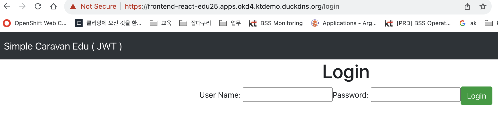    


<br/>

추가 버튼을 누르고 데이터를 생성해 봅니다.    

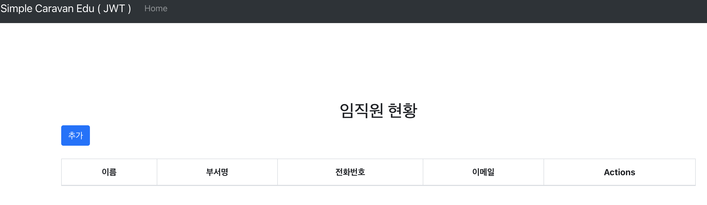    


<br/>

아래와 같이 생성 된것을 확인합니다.      

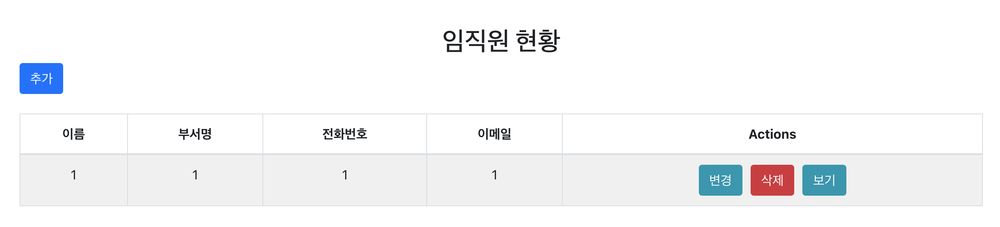    

<br/>

이제 kibana 로 이동하여 log 를 확인해 봅니다.  

Analytics -> Discover 메뉴로 이동하여 `logs-kubernetes` data view 를 선택합니다.    


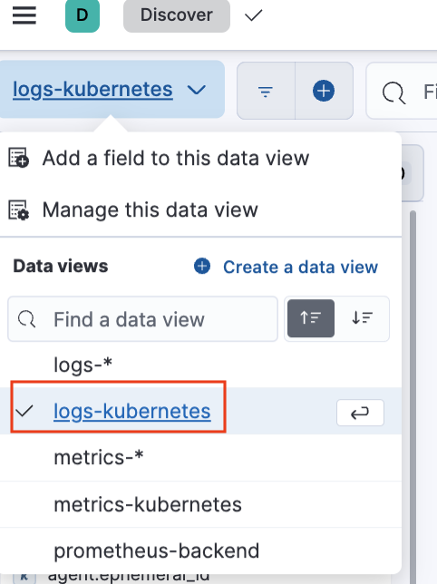  

<br/>

이렇게 설정을 하면 모든 Document를 볼 수 있는데 필요한 정보를 보기 위해서 필드를 지정합니다.   
로그 정보는 `message` 라는 필드에 저장이 됩니다.    

필드 입력하는 곳에 message를 입력하고 + 버튼을 눌러 필드는 고정합니다.  

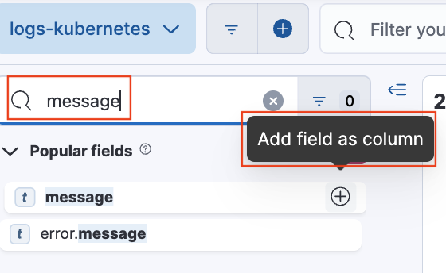  

<br/>

지금은 컨테이너 모든 로그를 볼 수 있습니다.  

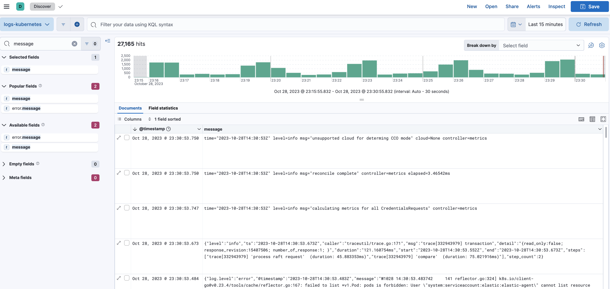    

<br/>

본인의 namespace 의 backend-springboot 로그를 보기 위해서는 filter를 설정하면 됩니다.   
상단의 KSQL 입력하는 곳에 본인의 namespace와 deployment 정보를 매핑합니다. ( 엔터를 치거나 update 버튼을 클릭 )  
- `kubernetes.namespace : edu25 and kubernetes.deployment.name : backend-springboot and data_stream.type : logs`    

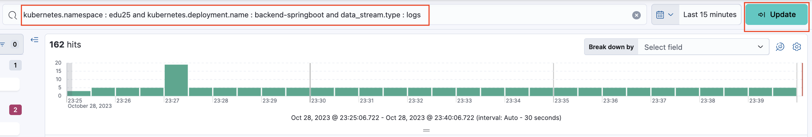  

<br/>

조금 전에 생성한 로그를 확인 할 수 있습니다.  

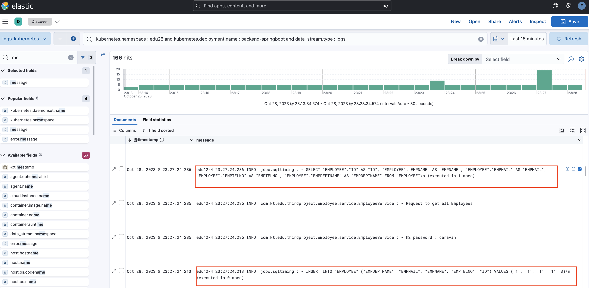  

<br/>

현재 검색할 조건을 저장하기 위해서 save 버튼을 클릭한다.   

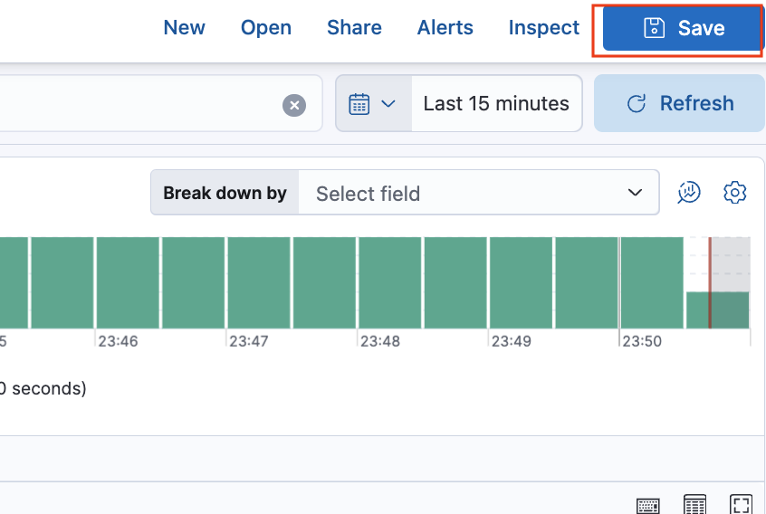  

<br/>

title 을 입력하고 저장한다.    

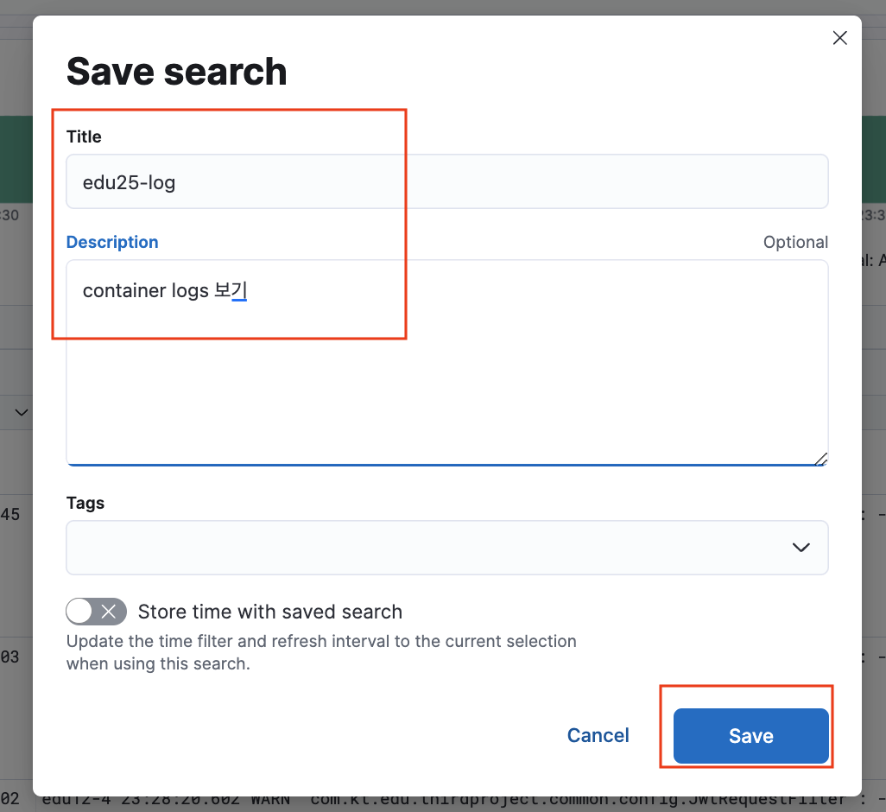  

<br/>

Open 버튼을 클릭하면 저장한 search 조건을 불러 올 수 있다.  

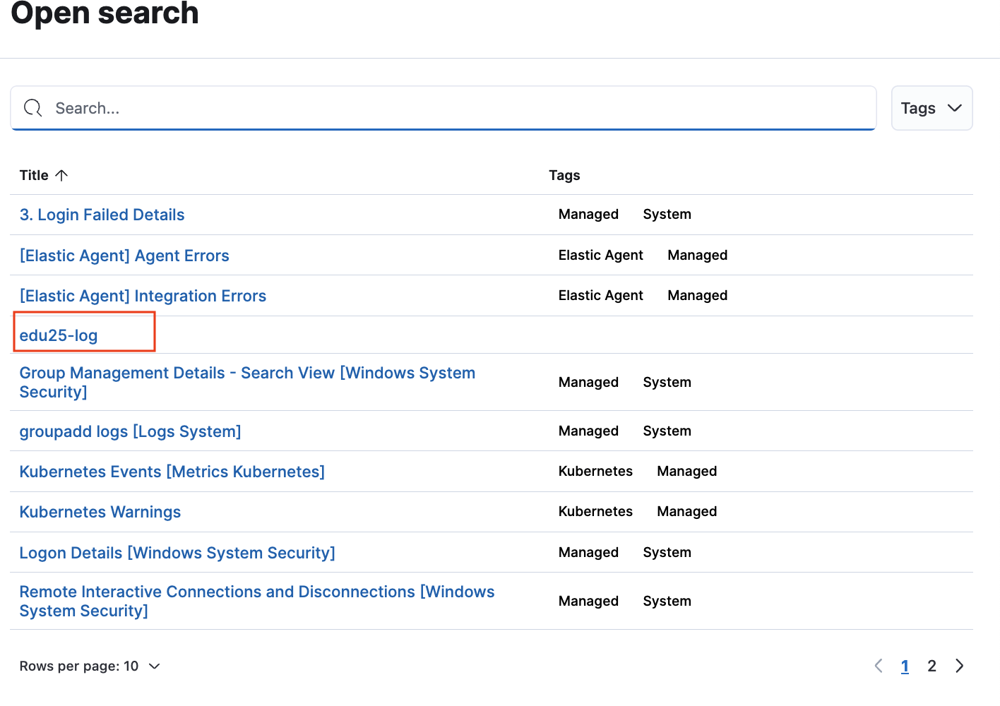  

<br/>

특정 Document 를 한 화면에 보기 위해서는  `Toggle dialog with details` 아이콘을 클릭한다.  

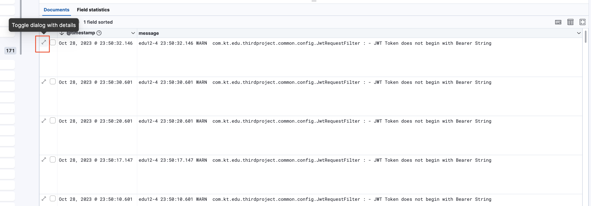    

<br/>

Expaned Document 화면을 볼 수 있고 Table/JSON 형식으로도 볼수 있다.  

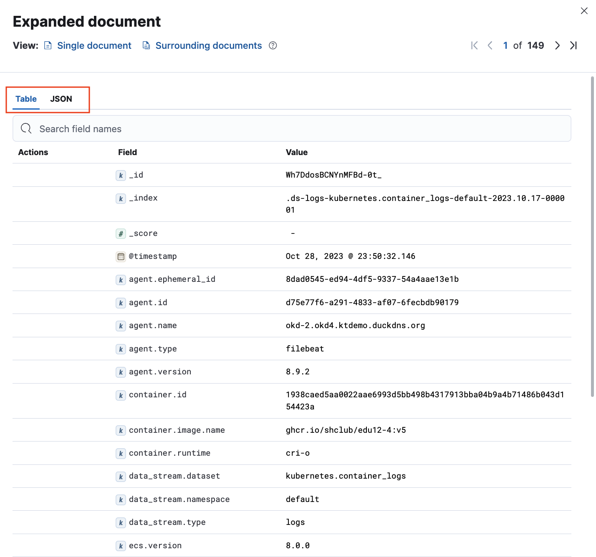  

<br/>


## 6. Application trace 수집 ( /w APM )

<br/>

Observability -> overview 로 이동하면 현재 서버 상태를 볼 수 있다.  

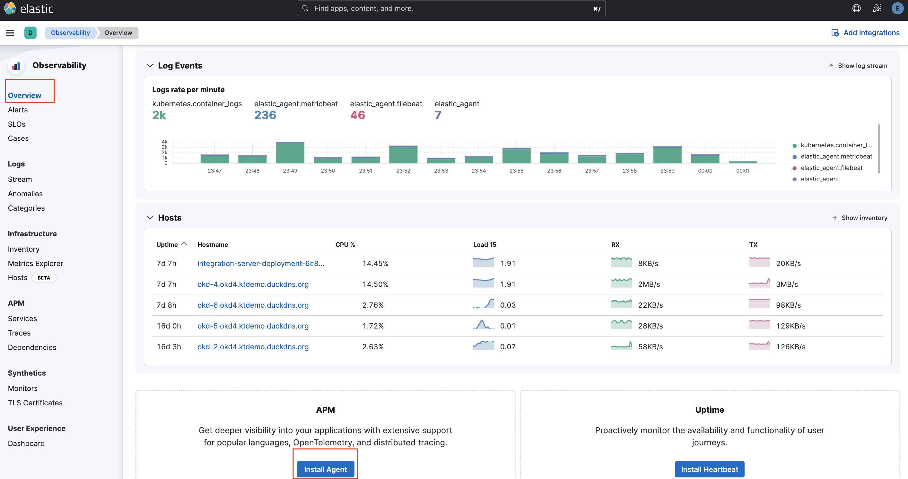  

<br/>

Observability -> APM -> Traces 로 이동하면 아직 Agent 가 설정이 안되어 있어서 아무 데이터도 없다.    
Add Data 를 클릭한다.  

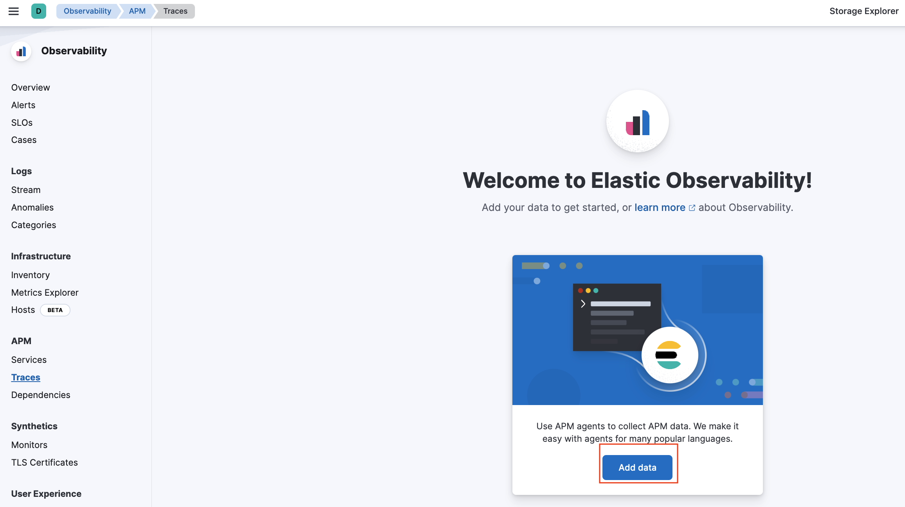  

<br/>

Elastic APM In Fleet 탭을 선택하고 Check APM Server Status 를 클릭하여 상태를 확인한다.   


  


<br/>

java를 선택하고 policy는 기존에 설정한 Fleet Agent Policy를 선택한다.  

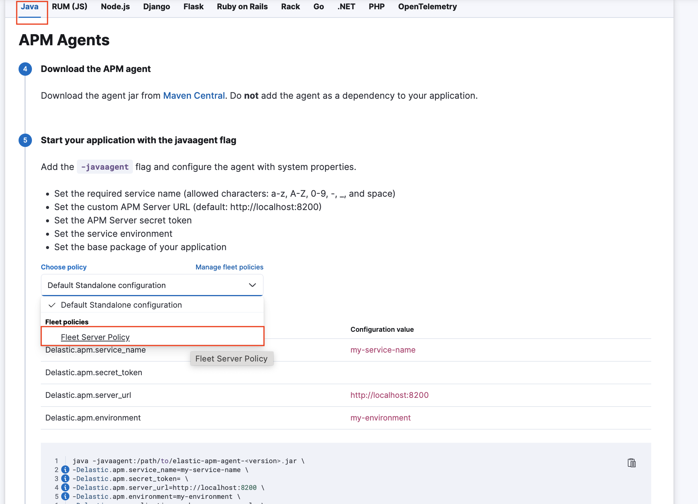  

<br/>

APM 서버 정보와 설정 정보를 확인한다.  

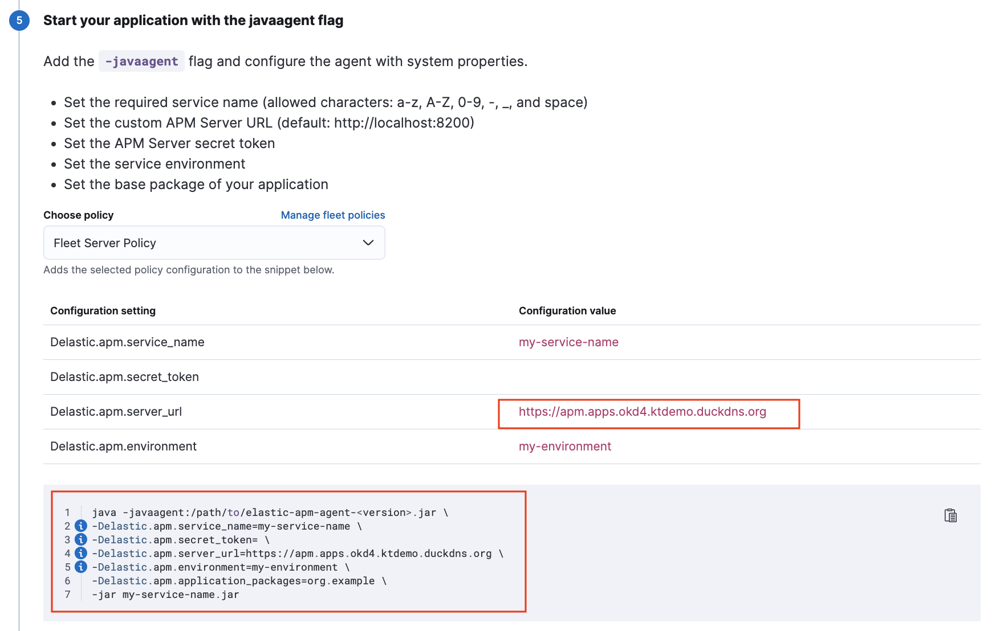  

<br/>


APM 서버 정보와 설정 정보를 확인한다.  

  

<br/>


서버 정보는 외부 접속 url 대신 내부 서버로 접속하기 위해 서비스를 조회한다.  

- 외부 서버 정보 : https://apm.apps.okd4.ktdemo.duckdns.org  

<br/>

```bash
[root@bastion elastic]# kubectl get svc -n elastic
NAME                            TYPE        CLUSTER-IP       EXTERNAL-IP   PORT(S)             AGE
apm-server                      NodePort    172.30.49.195    <none>        8200:30010/TCP      17d
```  


<br/>

- 내부 서버 정보: `http://apm-server.elastic:8200`

<br/>

https://mvnrepository.com/artifact/co.elastic.apm/elastic-apm-agent 사이트에서 최신 버전을 다운 받는다.    

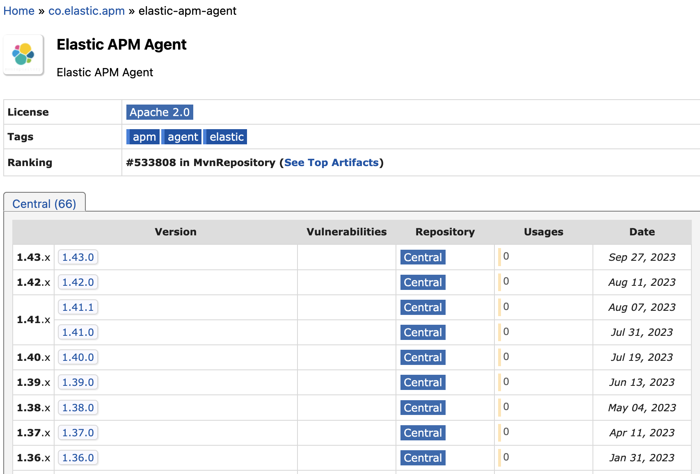  

<br/>

pom.xml 화일에 dependency 를 추가하고  jar 화일을 다운 받는다.  

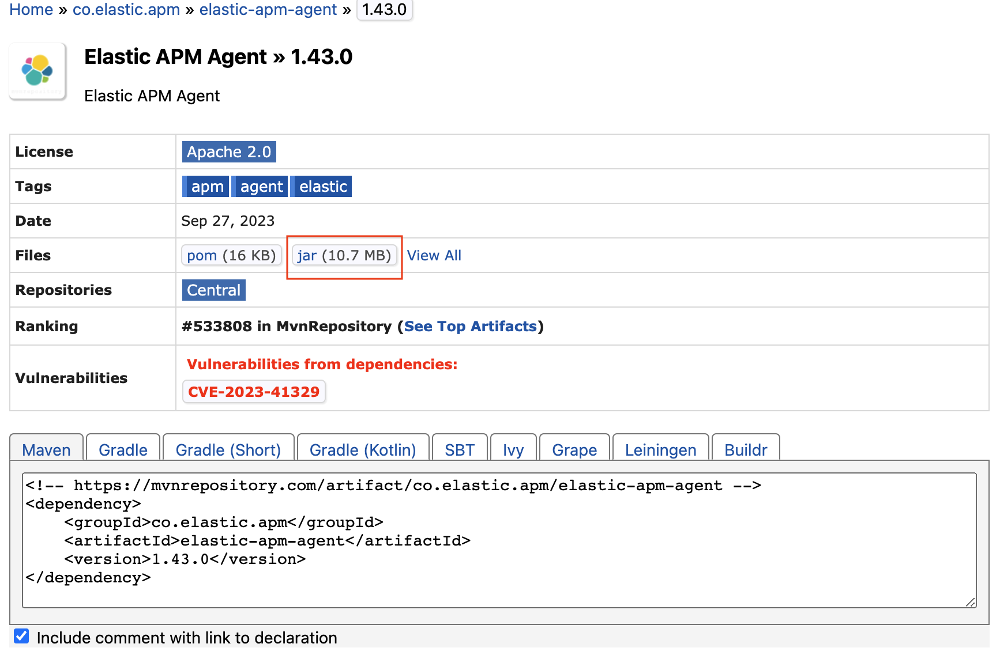  


```bash
<!-- https://mvnrepository.com/artifact/co.elastic.apm/elastic-apm-agent -->
<dependency>
    <groupId>co.elastic.apm</groupId>
    <artifactId>elastic-apm-agent</artifactId>
    <version>1.43.0</version>
</dependency>
```    

<br/>

아래 순서로 진행 한다.        
- 대상 repository : `https://github.com/shclub/edu12-4`
- `pom.xml` 화일을 추가한다.  
- `elastic-apm-agent-1.43.0.jar` upload 한다.
- Dockerfile 에 `COPY elastic-apm-agent-1.43.0.jar / ` 구문 추가한다.
- Docker 이미지를 재빌드 한다.      

<br/>

gitops project 의 deployment.yaml 화일에 아래 내용을 추가 한다.    
- https://github.com/shclub/edu_advanced_backend_gitops/blob/master/deployment.yaml  

<br/>

```bash
        env:
          - name: SPRING_PROFILES_ACTIVE
            value: "dev"
          - name: JAVA_TOOL_OPTIONS 
            value: "-javaagent:elastic-apm-agent-1.43.0.jar -Delastic.apm.server_url=http://apm-server.elastic:8200 -Delastic.apm.environment=dev -Dservice_name=backend-springboot -Delastic.apm.secret_token="    ## secret_token 값은 비워둠
```  

<br/>

ArgoCD 에서 backend 를 다시 Sync 하여 배포한다.  

<br/>

Observability -> APM -> Services 로 이동을 하면 아래와 같이 서비스가 추가 된 것을 볼 수 있다.    

서비스 이름은 SpringBoot 의 project 이름이다. 

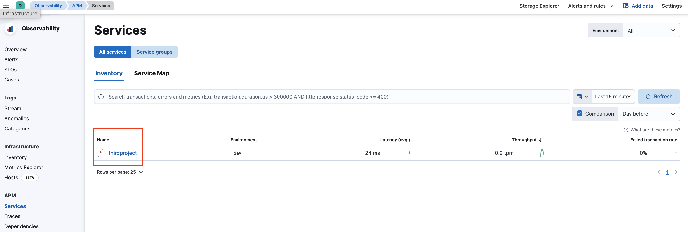  

<br/>

서비스 이름을 클릭하고 들어가면 더 많은 기능을 볼수 있고 servcie map 은 유료 기능이고 trial 은 30일 이다.  

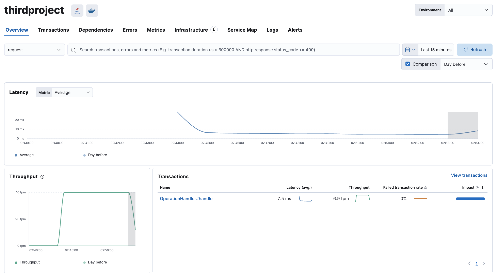  

<br/>


## 7. Dashboard 만들기 ( Import/Export )  

<br/>

이번 교육에서는 Dashboard 생성이나 Visualize 는 다루지 않고 Dashboard Import / Export 를 다룹니다.    

Stack Management -> Saved Objects 로 이동하면 다양한 종류의 Object 들이 저장 되어 있는 것을 볼수 있습니다.

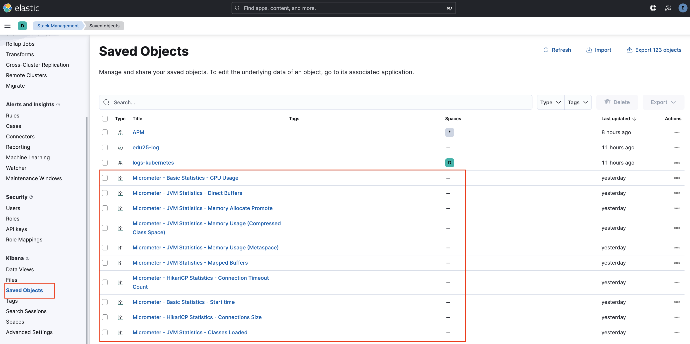  

<br/>

elastic 8.3 이전까지는 json 포맷이 지원 되나 그 이후 버전부터는 ndjson 형태이기 때문에 호환은 되지 않습니다.  

이전 버전 json 사용시 8.3 에서 한번 컨버전 하고 다시 최신 버전으로 컨버전 해야 합니다.  

<br/>

Dashboard를  export 해 봅니다.    
Type 을 dashboar를 선택합니다.  

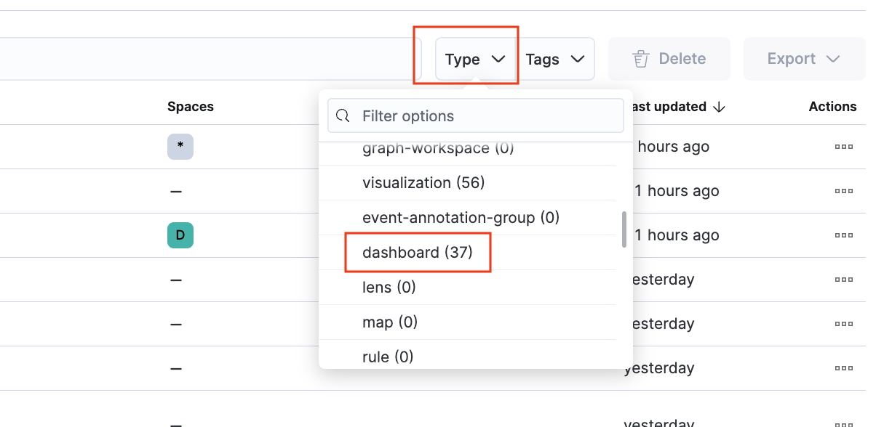    

<br/>

Export 하려고 하는 dashbaord 선택 후 export 버튼을 클릭합니다.  

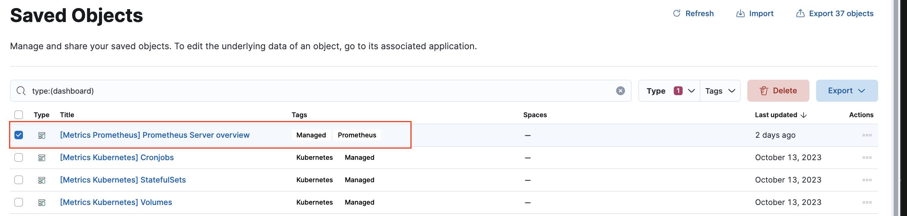  

<br/>

연관된 Object를 체크를 하면 관련된 data view 와 visualize가 같이 export 됩니다.  

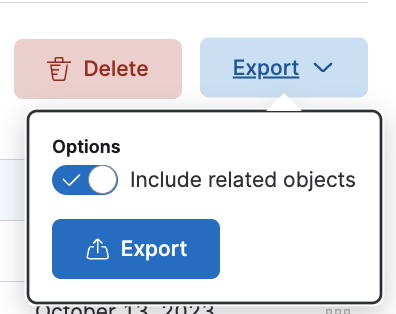  

<br/>

ndjson 형태로 화일이 다운 됩니다.    

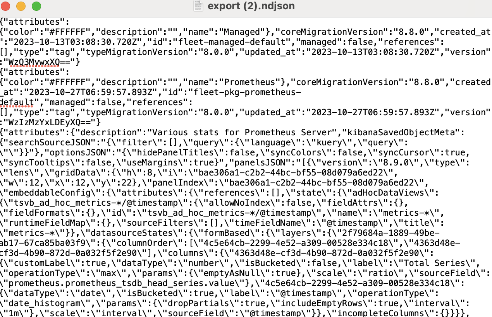  

<br/>

import를 하기 위해서는 상단의 import 버튼을 클릭하고 인터넷에서 다운 받은 ndjson 화일을 불러 옵니다.

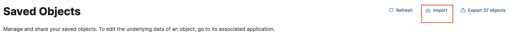  

<br/>


Data view 가 없는 경우 elastic 에 있는 data view 를 선택 할 수 있습니다.  
- import 하는 dashboard 가 data view 가 매핑 푈수 있습니다.  

필요 없으면 skip 합니다.

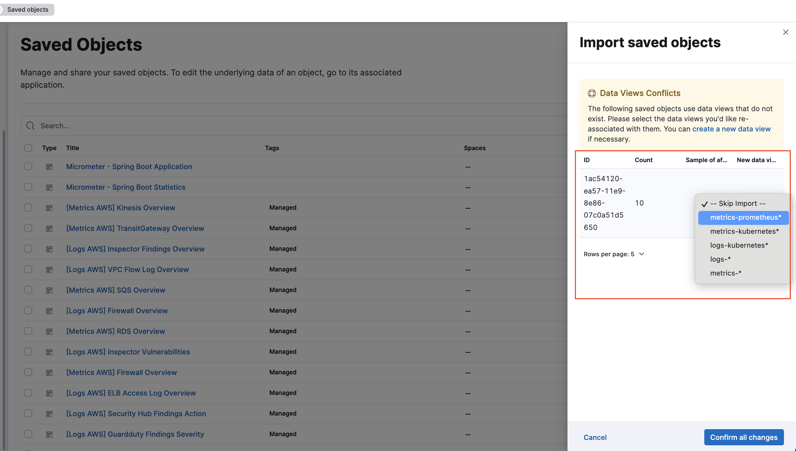  

<br/>

필요 없으면 skip 합니다.

  

<br/>

import 대상을 확인하고  Done 버튼을 클릭합니다.  

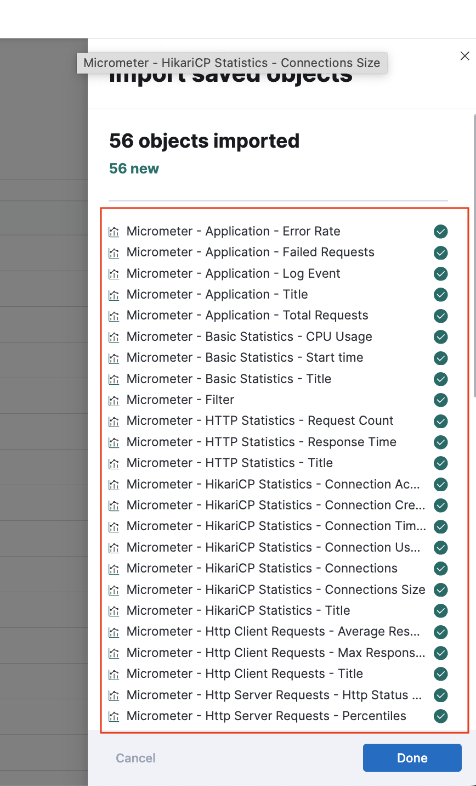  

<br/>

import 된  dashboard 와 visualize 를 확인 할 수 있습니다.  

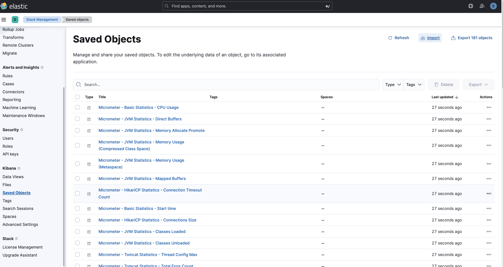  

<br/>

### 실습하기   

<br>

SpringBoot Overview Dashboard 수정해 보기  

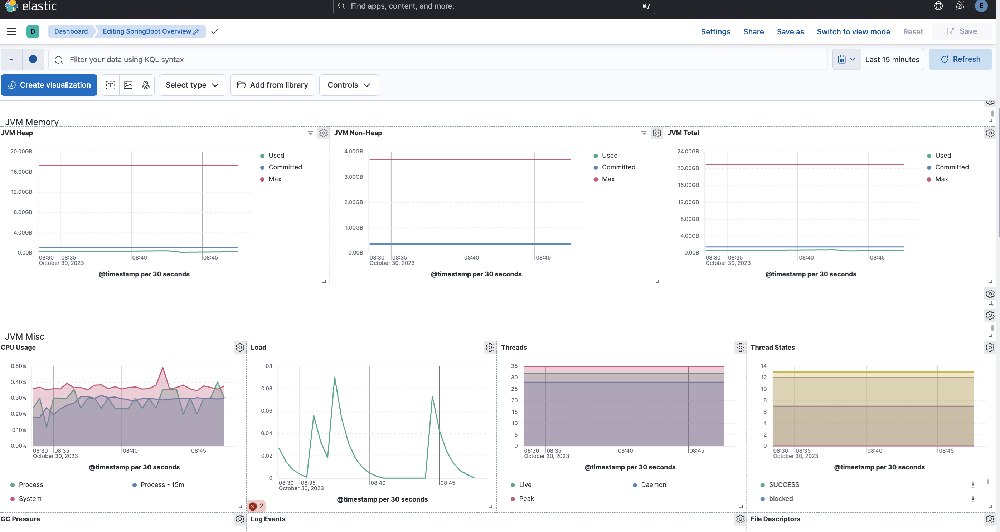  

<br/>

springboot_edu.ndjson 화일을 import 하여 본인의 data view 로 변경해 봅니다.  


<br/>

## 8. snapshot 설정

<br/>

elastic 7.x 부터는 repository-s3 plugin 은 기본으로 설치되어있어 snapshot을 s3에 저장 할수 있다.  

<br/>


S3와 연동 하기 위해서는 access_key , secret_key 가 필요하고 Elastic 최신버전은 key 값 같은 중요한 정보는 keystore 에 저장한다.        

<br/>

elasticsearch-master-0 POD에 terminal 로 접속하여 아래 명령을 실행한다.  
- single ode가 아닌 경우 모든 서버의 POD에서 수행해야 한다.  

<br/>

가운데 `okd`는 repository 생성시 client 구분자로 사용하기 위한 값이다.  

```bash
bin/elasticsearch-keystore add s3.client.okd.access_key
bin/elasticsearch-keystore add s3.client.okd.secret_key
```

<br/>


<br/>

값을 확인 하는 방법은 아래와 같다.  

```bash
sh-5.0$ bin/elasticsearch-keystore list                         
bootstrap.password
keystore.seed
s3.client.okd.access_key
s3.client.okd.secret_key
sh-5.0$ bin/elasticsearch-keystore show s3.client.okd.access_key
ErolFCocGsP12SgSI6xC
```  

<br/>

Dev Tool 에서 설정한 값을 elastic 에 적용을 한다.  

```bash
POST _nodes/reload_secure_settings
```  

<br/>

```bash
{
  "_nodes": {
    "total": 1,
    "successful": 1,
    "failed": 0
  },
  "cluster_name": "elasticsearch",
  "nodes": {
    "XtzT52GYTg6OvAPhjN8hRQ": {
      "name": "elasticsearch-master-0"
    }
  }
}
```  

<br/>

S3 snapshot 저장 repository 를 생성한다.  
- bucket 은  minio에서 이미 생성을 해 놓아야 한다.  
- 교육생들은 repostory 이름을 다르게 설정하다 ( 예,my_elastic_s3_repository_edu1 )
- 교육생들은 별도로 구성되어 아래 bucket 이름 변경 필요 ( 예. elastic-log-snapshot-edu1 )

```bash
PUT _snapshot/my_elastic_s3_repository
  {
     "type": "s3",
      "settings": {
         "region" : "ap-northeast-2",
         "bucket": "elastic-log-snapshot",
         "client": "okd",
         "endpoint": "http://my-minio.minio.svc.cluster.local:9000",
         "path_style_access": "true",
         "protocol": "http"
      }
  }
```
<br/>

정상적으로 생성이 되면 아래와 같은 응답이 온다.  

```bash
{
  "acknowledged": true
}
```  

<br/>

Snapshot repostory 화면에서 생성을 확인한다.  


<br/>

repository 이름으로 들어가서 verify repository 버튼을 클릭하여 확인을 한다.  


<br/>

수동으로 전체 index의 snapshot을 생성해본다.  ( SKIP )

```bash
PUT /_snapshot/my_elastic_s3_repository/my-first-snapshot?wait_for_completion=true
```  

<br/>

minio 에 가면 생성된 snapshot 을 확인 할 수 있다.  


<br/>

앞에 생성한 snapshot 을 삭제 한다.    

```bash
DELETE _snapshot/my_elastic_s3_repository/my-first-snapshot
```   
<br/>

응답 메시지  
```bash
{
  "acknowledged": true
}
```
<br/>

특정 index 를 snapshot 으로 저장해 봅니다. 
- index name : movies  

<br/>

```bash
PUT /_snapshot/my_elastic_s3_repository/snapshot_movies_1
{
         "indices": "movies",
         "ignore_unavailable": "true",
         "include_global_state": false
}
```

<br/>

응답메시지  
```bash
{
  "accepted": true
}
```  

<br/>

스냅샷 상태 확인
```bash
GET _snapshot/my_elastic_s3_repository/snapshot_movies_1
```  

<br/>


```bash
{
  "snapshots": [
    {
      "snapshot": "snapshot_movies_1",
      "uuid": "UzYzn-70TOuocoP99sFGHg",
      "repository": "my_elastic_s3_repository",
      "version_id": 8090199,
      "version": "8.9.1",
      "indices": [
        "movies"
      ],
      "data_streams": [],
      "include_global_state": false,
      "state": "SUCCESS",
      "start_time": "2023-10-18T09:00:30.418Z",
      "start_time_in_millis": 1697619630418,
      "end_time": "2023-10-18T09:00:30.819Z",
      "end_time_in_millis": 1697619630819,
      "duration_in_millis": 401,
      "failures": [],
      "shards": {
        "total": 1,
        "failed": 0,
        "successful": 1
      },
      "feature_states": []
    }
  ],
  "total": 1,
  "remaining": 0
}
```  
<br/>

minio 다시 가서 생성된 snapshot 을 확인 할 수 있다.  
c
<br/>

snapshot 을 복구하려면 아래 명령어 처럼 사용하고 movies 라는 index 가 존재하면 삭제를 하거나
snapshot 복구시 다른 이름으로 index 를 만들어야 한다.   

```bash
POST _snapshot/my_elastic_s3_repository/snapshot_movies_1/_restore
```  

<br/>


참고  
- https://www.elastic.co/guide/en/elasticsearch/reference/current/repository-s3.html 
- minio S3 : https://ahmetcan.org/elasticsearch-snapshots-to-minio/
- Public Cloud Storage : https://opster.com/guides/opensearch/opensearch-operations/how-to-set-up-snapshot-repositories/

<br/>


## 9. 실습 및 과제 

<br/>

### elastic cloud 활용

<br/>

웹 브러우저에서 https://www.elastic.co/cloud 접속하고 Start Free Trial 을 클릭한다.
- 14일간 전체 기능 무료 사용 가능  

<br/>

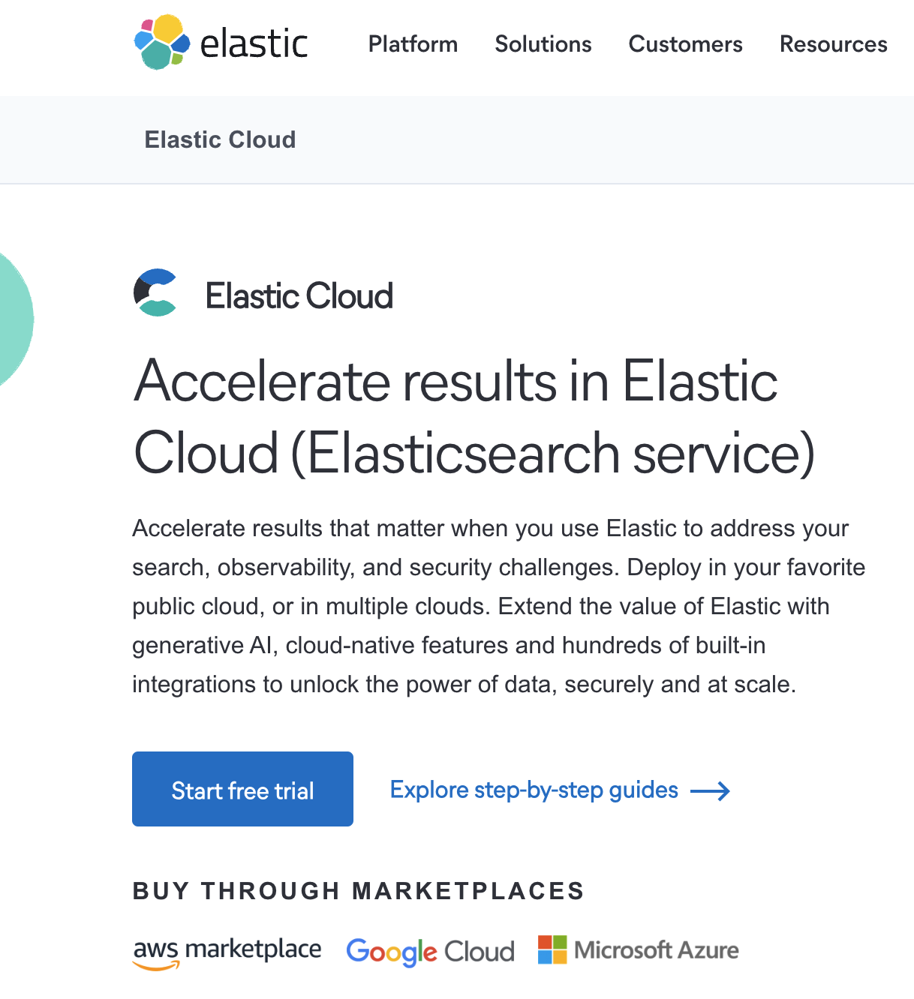

<br/>

Elastic Cluster 이름을 입력하고 Create Deployment 를 생성한다.  
- trial 계정은 하나의 deployment 만 생성 가능 하다.

<br/>

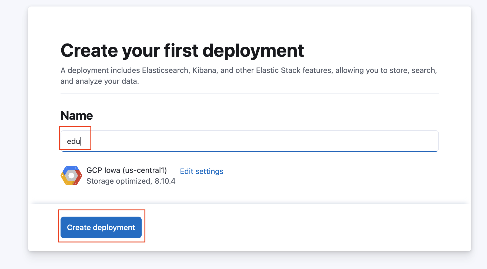


<br/>

가이드 화면이 나오고 해당 카드를 클릭하면 좀 더 쉽게 설정이 가능 하다.  
우리는 만 아래의 on my own 를 클릭한다.    

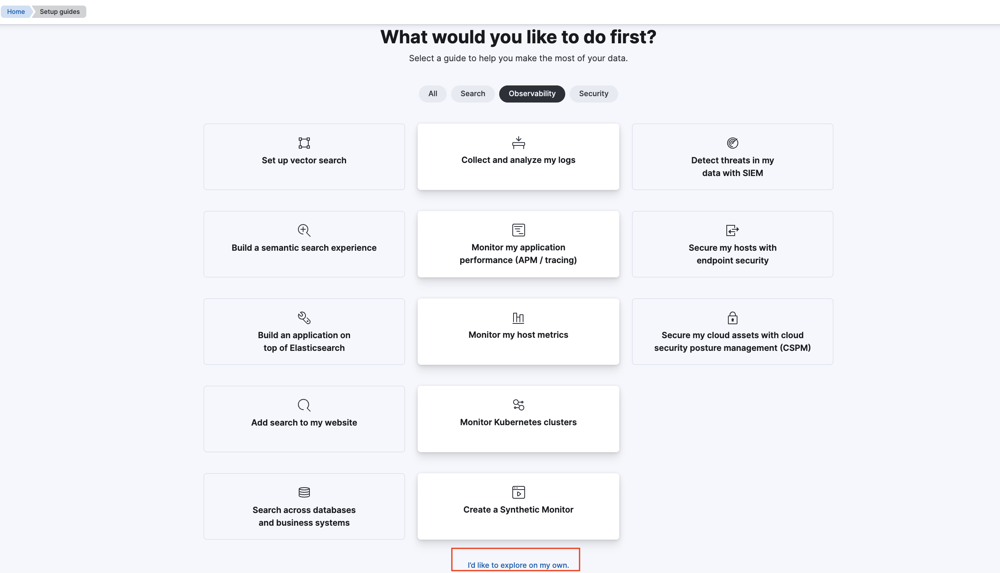

<br/>

kibana 의 첫 화면을 볼 수 있다.    


<br/>

왼쪽 햄버거 메뉴를 확장하고 아래쪽에 Management -> Fleet 메뉴로 이동하면 기본 설정된 Agent를 볼 수 있다.  

Add Agent 버튼을 클릭한다. 

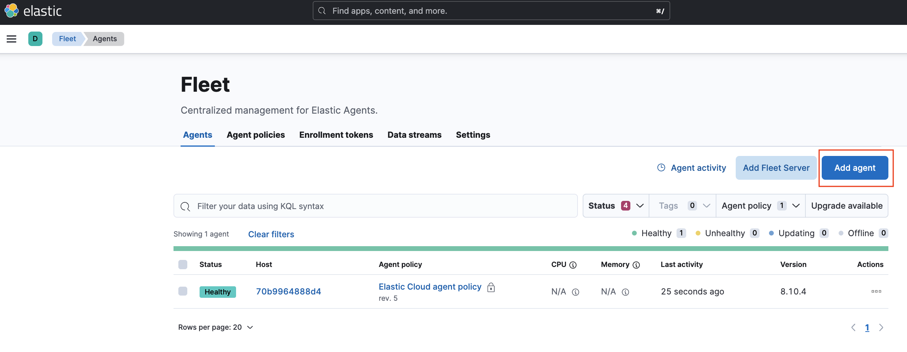

<br/>

Agent Policy 이름을 입력하고 생성한다.  


<br/>

Install Elastic Agent on your host -> kubernetes로 이동하고 아래 3개의 값을 복사한다.  
- name: FLEET_URL  
    - value: "https://9b95b2********4b90.fleet.us-central1.gcp.cloud.es.io:443"
- name: FLEET_ENROLLMENT_TOKEN  
    - value: "ZnU0N*****QQ=="
- name: KIBANA_HOST  
    - value: "http://kibana:5601"   

<br/>    

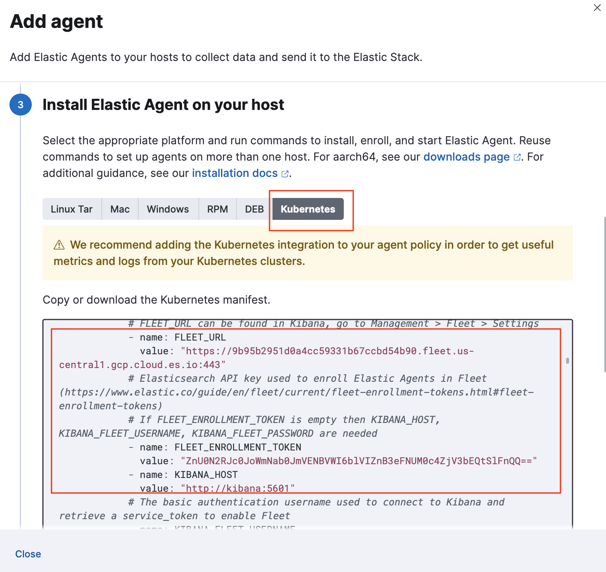

<br/>

본인의 Namespace에 `elastic-agent` 라는 service account 를 생성한다.    

```bash
[root@bastion elastic]# cat elastic_cloud_sa.yaml
apiVersion: v1
kind: ServiceAccount
metadata:
  name: elastic-agent
  labels:
    k8s-app: elastic-agent
    app: integraion-server
[root@bastion elastic]# kubectl apply -f elastic_cloud_sa.yaml  
```  

<br/>

Role 을 생성하고 `elastic-agent` sa 에 Role을 바인딩한다.      

```bash
[root@bastion elastic]# cat elastic_cloud_role_rolebindings.yaml
apiVersion: rbac.authorization.k8s.io/v1
kind: RoleBinding
metadata:
  name: elastic-agent-rolebinding
subjects:
  - kind: ServiceAccount
    name: elastic-agent
roleRef:
  kind: Role
  name: elastic-agent-role
  apiGroup: rbac.authorization.k8s.io
---
apiVersion: rbac.authorization.k8s.io/v1
kind: RoleBinding
metadata:
  name: elastic-agent-kubeadm-config-rolebinding
subjects:
  - kind: ServiceAccount
    name: elastic-agent
roleRef:
  kind: Role
  name: elastic-agent-kubeadm-config-role
  apiGroup: rbac.authorization.k8s.io
---
apiVersion: rbac.authorization.k8s.io/v1
kind: Role
metadata:
  name: elastic-agent-role
  # Should be the namespace where elastic-agent is running
  labels:
    k8s-app: elastic-agent
rules:
  - apiGroups:
      - coordination.k8s.io
    resources:
      - leases
    verbs: ["get", "create", "update"]
---
apiVersion: rbac.authorization.k8s.io/v1
kind: Role
metadata:
  name: elastic-agent-kubeadm-config-role
  labels:
    k8s-app: elastic-agent
rules:
  - apiGroups: [""]
    resources:
      - configmaps
    resourceNames:
      - kubeadm-config
    verbs: ["get"]
[root@bastion elastic]# kubectl apply -f elastic_cloud_role_rolebindings.yaml  
```  


<br/>

ClusterRole 에 ClusterRoleBindng 을 합니다. ( 강사  사전  수행 )

<br/>


```bash
[root@bastion elastic]# cat elastic_cloud_admin_cluster_role.yaml
apiVersion: rbac.authorization.k8s.io/v1
kind: ClusterRole
metadata:
  name: elastic-agent-clusterrole
  labels:
    k8s-app: elastic-agent
rules:
  - apiGroups: [""]
    resources:
      - nodes
      - namespaces
      - events
      - pods
      - services
      - configmaps
      # Needed for cloudbeat
      - serviceaccounts
      - persistentvolumes
      - persistentvolumeclaims
    verbs: ["get", "list", "watch"]
  # Enable this rule only if planing to use kubernetes_secrets provider
  #- apiGroups: [""]
  #  resources:
  #  - secrets
  #  verbs: ["get"]
  - apiGroups: ["extensions"]
    resources:
      - replicasets
    verbs: ["get", "list", "watch"]
  - apiGroups: ["apps"]
    resources:
      - statefulsets
      - deployments
      - replicasets
      - daemonsets
    verbs: ["get", "list", "watch"]
  - apiGroups:
      - ""
    resources:
      - nodes/stats
    verbs:
      - get
  - apiGroups: [ "batch" ]
    resources:
      - jobs
      - cronjobs
    verbs: [ "get", "list", "watch" ]
  # Needed for apiserver
  - nonResourceURLs:
      - "/metrics"
    verbs:
      - get
  # Needed for cloudbeat
  - apiGroups: ["rbac.authorization.k8s.io"]
    resources:
      - clusterrolebindings
      - clusterroles
      - rolebindings
      - roles
    verbs: ["get", "list", "watch"]
  # Needed for cloudbeat
  - apiGroups: ["policy"]
    resources:
      - podsecuritypolicies
    verbs: ["get", "list", "watch"]
  - apiGroups: [ "storage.k8s.io" ]
    resources:
      - storageclasses
    verbs: [ "get", "list", "watch" ]
```  

<br/>


```bash
[root@bastion elastic]# cat elastic_cloud_agent_rolebinding.yaml
apiVersion: rbac.authorization.k8s.io/v1
kind: ClusterRoleBinding
metadata:
  name: elastic-agent-clusterrolebinding-edu25
subjects:
  - kind: ServiceAccount
    name: elastic-agent
    namespace: edu25
roleRef:
  kind: ClusterRole
  name: elastic-agent-clusterrole
  apiGroup: rbac.authorization.k8s.io
```  

<br/>

```bash
[root@bastion elastic]# kubectl apply -f elastic_cloud_admin_cluster_role.yaml
[root@bastion elastic]# kubectl apply -f elastic_cloud_agent_rolebinding.yaml
``` 

<br/>

이제 Agent를 설치합니다.  

```bash
[root@bastion elastic]# cat elastic_solution_agent_cloud.yaml
---
apiVersion: apps/v1
kind: Deployment
metadata:
  name: elastic-agent-integrations-deployment
  labels:
    app: elastic-agent-integrations
spec:
  replicas: 1
  selector:
    matchLabels:
      app: elastic-agent-integrations
  template:
    metadata:
      name: elastic-agent-integrations
      labels:
        app: elastic-agent-integrations
    spec:
      containers:
      - name: elastic-agent-integrations
        image: docker.elastic.co/beats/elastic-agent:8.10.4 #elastic/elastic-agent:8.10.4
        env:
        - name: FLEET_ENROLL
          value: "1"
        - name: FLEET_INSECURE
          value: "true"
        - name: FLEET_URL
          value: "https://0113301ca3e947a0b96a04afa8d5926a.fleet.us-central1.gcp.cloud.es.io:443"
        - name: FLEET_ENROLLMENT_TOKEN
          value: OTM3ZGM0c0JzT2tsODhSX1VKaGY6a1RvelNIOEhTa085OG1LUTBnMVY5Zw==
        - name: KIBANA_HOST
          value: "http://kibana:5601"
        - name: KIBANA_FLEET_USERNAME
          value: "elastic"
        - name: KIBANA_FLEET_PASSWORD
          value: "changeme"
        - name: NODE_NAME
          valueFrom:
            fieldRef:
              fieldPath: spec.nodeName
        ports:
        - containerPort: 8125
          protocol: UDP
      nodeSelector:
        edu: 'true'
      serviceAccount: elastic-agent
---
apiVersion: v1
kind: Service
metadata:
  name: elastic-agent-integrations
  labels:
    k8s-app: elastic-agent
    app: elastic-agent-integrations
spec:
  type: ClusterIP
  selector:
    app: elastic-agent-integrations
  ports:
  - name: udpingest
    port: 8125
    protocol: UDP
    targetPort: 8125
---
[root@bastion elastic]# kubectl apply -f elastic_solution_agent_cloud.yaml
deployment.apps/elastic-agent-integrations-deployment unchanged
service/elastic-agent-integrations created
```  

<br/>

`elastic-agent-integrations-deployment` 로 시작하는 POD가 생성 된 것을 확인한다.  

```bash
[root@bastion elastic]# kubectl get po
NAME                                                    READY   STATUS    RESTARTS       AGE
backend-springboot-b8cc49c66-c5n5s                      1/1     Running   0              13h
elastic-agent-integrations-deployment-fd85dfd6b-jvfwx   1/1     Running   0              126m
```   

<br/>

elastic 에서 Fleet 으로 이동하면 정상적으로 `solution_integration` 라는 Agent Policy 가 생성된 것을 확인하고 해당 Agent Policy 를 선택하고 들어간다.   

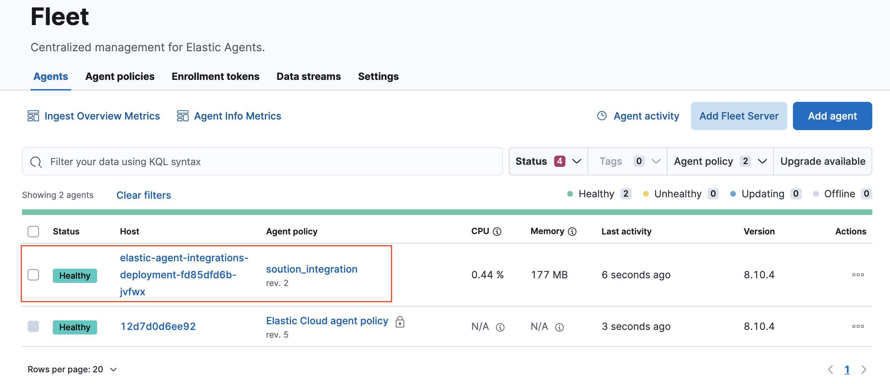


<br/>

Add Integration을 클릭하고 prometheus를  선택하고 설정을 한다.   

<br/>

이후 설정은 앞의 Prometheus Integration 과정을 따라서 진행을 한다.  

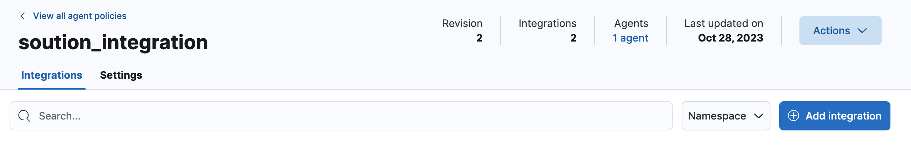

<br/>

설정이 완료가 되면 discover 에서 data view를 prometheus-backend 라는 이름으로 생성하고 데이터를 조회해 본다. 

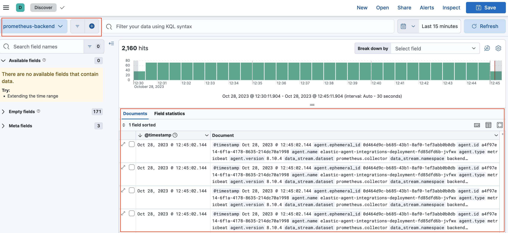


<br/>

Export 했던 SpringBoot overview 대쉬보드를 import 하여 대쉬보드에서 데이터가 잘 보이는지 확인한다.  

<br/> 

### 추가 과제

<br/>

Grafana 에서 위에서 생성한 SpringBoot Metric 를 확인 해봅니다ㅏ. 
 - Service Monitor 생성 필요 

<br/>

Pod의 ip로 확인   

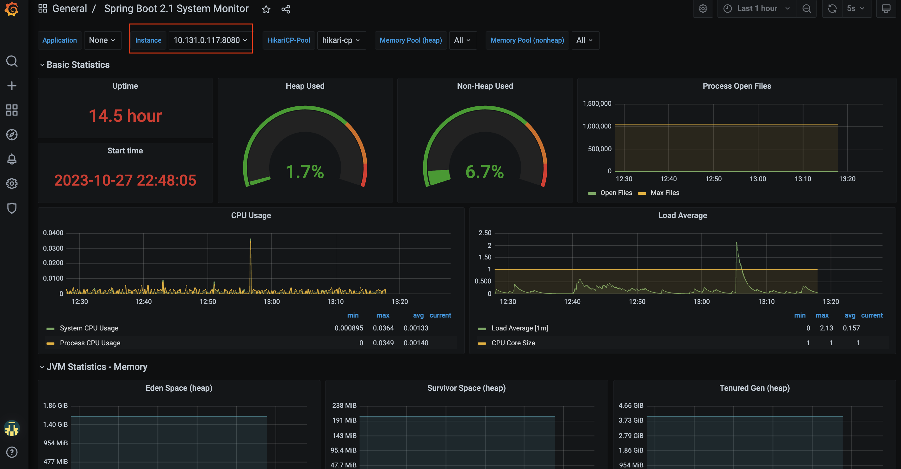


<br/>

## 10. Trouble Shooting

<br/>

### single node로 설치 시

<br/>

single node로 구성 후 pod가 재기동시 정상적으로 올라오지 않는 에러를 보면 Probe 에러인 `wait_for_status=green&timeout=1s` 라는 메시지가 나오는데 single node로 elastic을 사용하는 경우 이런 현상이 발생한다.      

<br/>

index 의 경우에는 yellow 상태를 볼수 있는데 이것도 single node로 사용하는 경우에 볼 수 있다.  

<br/>


<br/>

기본적으로 elastic 은 master/slave 로 사용이 되어야 하며  single node 로 사용시 helm 의 values.yaml을 아래와 같이 변경한다.     

- 이전값 : `clusterHealthCheckParams: "wait_for_status=green&timeout=1s"`
- 변경값 : `clusterHealthCheckParams: "level=cluster"`

<br/>

```bash
[root@bastion elastic]# helm upgrade elasticsearch elastic/elasticsearch -f values.yaml -n elastic
```
