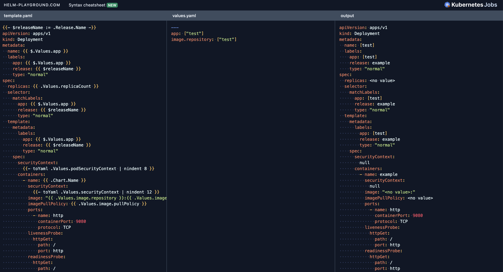
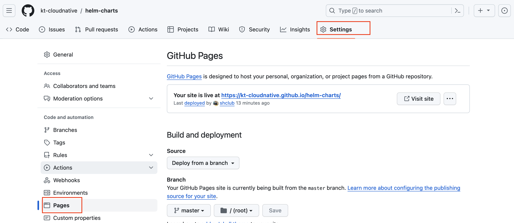
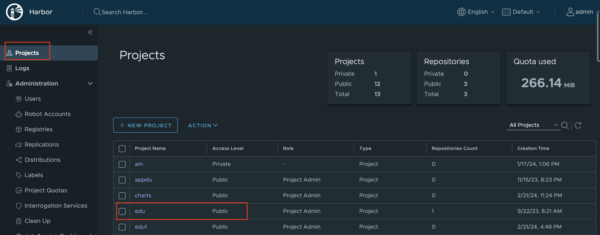
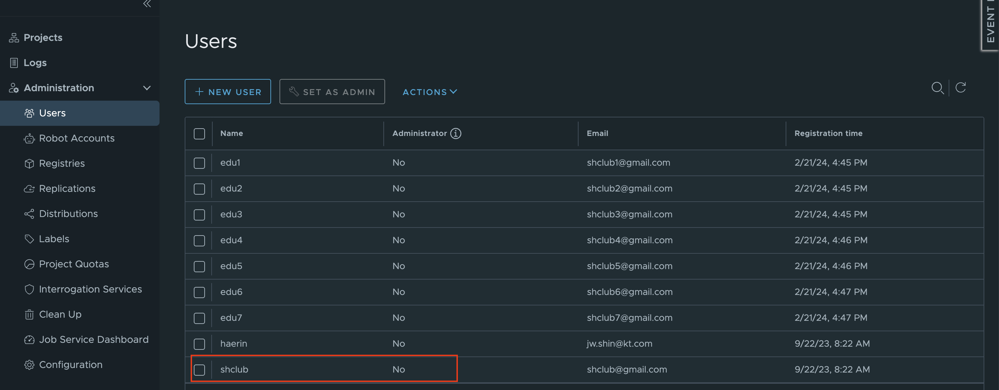
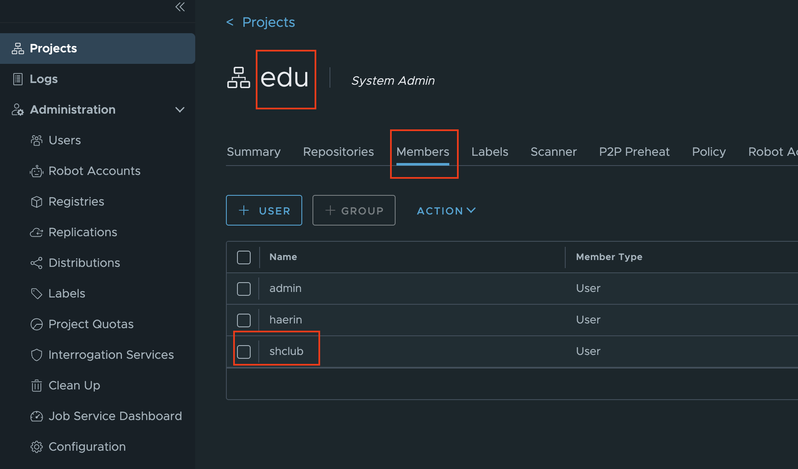

# SpringBoot helm으로 생성하여 배포하기 


## helm 생성하기   

<br/>

helm 이라는 폴더를 하나 생성하고 backend 라는 이름으로 helm을 구조를 생성합니다.  

```bash
root@newedu-k3s:~/helm# helm create backend
Creating backend
root@newedu-k3s:~/helm# cd backend
```  

<br/>

전체 폴더 구조는 아래와 같이 확인 할 수 있습니다.  

```bash
root@newedu-k3s:~/helm/backend# tree
.
├── Chart.yaml
├── charts
├── templates
│   ├── NOTES.txt
│   ├── _helpers.tpl
│   ├── deployment.yaml
│   ├── hpa.yaml
│   ├── ingress.yaml
│   ├── service.yaml
│   ├── serviceaccount.yaml
│   └── tests
│       └── test-connection.yaml
└── values.yaml

3 directories, 10 files
```  

<br/>

Chart.yaml 의 Description  내용을 수정해 봅니다.  

```bash
root@newedu-k3s:~/helm/backend# cat Chart.yaml
apiVersion: v2
name: backend
description: A Helm chart for Kubernetes

# A chart can be either an 'application' or a 'library' chart.
#
# Application charts are a collection of templates that can be packaged into versioned archives
# to be deployed.
#
# Library charts provide useful utilities or functions for the chart developer. They're included as
# a dependency of application charts to inject those utilities and functions into the rendering
# pipeline. Library charts do not define any templates and therefore cannot be deployed.
type: application

# This is the chart version. This version number should be incremented each time you make changes
# to the chart and its templates, including the app version.
# Versions are expected to follow Semantic Versioning (https://semver.org/)
version: 0.1.0

# This is the version number of the application being deployed. This version number should be
# incremented each time you make changes to the application. Versions are not expected to
# follow Semantic Versioning. They should reflect the version the application is using.
# It is recommended to use it with quotes.
appVersion: "1.16.0"
```  

<br/>

helm 조회시 desription은 아래와 같이 나타납니다.  

```bash
[root@bastion helm]# helm search repo backend
WARNING: Kubernetes configuration file is group-readable. This is insecure. Location: /root/okd4/auth/kubeconfig
NAME                 	CHART VERSION	APP VERSION	DESCRIPTION
github-stable/backend	0.1.0        	1.16.0     	A Helm chart for Kubernetes
bitnami/parse        	21.6.1       	6.4.0      	Parse is a platform that enables users to add a...
```  

<br/>

yaml 형태의 출력을 확인해 본다.


```bash
root@newedu-k3s:~/helm/backend# helm template .
---
# Source: backend/templates/serviceaccount.yaml
apiVersion: v1
kind: ServiceAccount
metadata:
  name: release-name-backend
  labels:
    helm.sh/chart: backend-0.1.0
    app.kubernetes.io/name: backend
    app.kubernetes.io/instance: release-name
    app.kubernetes.io/version: "1.16.0"
    app.kubernetes.io/managed-by: Helm
---
# Source: backend/templates/service.yaml
apiVersion: v1
kind: Service
metadata:
  name: release-name-backend
  labels:
    helm.sh/chart: backend-0.1.0
    app.kubernetes.io/name: backend
    app.kubernetes.io/instance: release-name
    app.kubernetes.io/version: "1.16.0"
    app.kubernetes.io/managed-by: Helm
spec:
  type: ClusterIP
  ports:
    - port: 80
      targetPort: http
      protocol: TCP
      name: http
  selector:
    app.kubernetes.io/name: backend
    app.kubernetes.io/instance: release-name
---
# Source: backend/templates/deployment.yaml
apiVersion: apps/v1
kind: Deployment
metadata:
  name: release-name-backend
  labels:
    helm.sh/chart: backend-0.1.0
    app.kubernetes.io/name: backend
    app.kubernetes.io/instance: release-name
    app.kubernetes.io/version: "1.16.0"
    app.kubernetes.io/managed-by: Helm
spec:
  replicas: 1
  selector:
    matchLabels:
      app.kubernetes.io/name: backend
      app.kubernetes.io/instance: release-name
  template:
    metadata:
      labels:
        app.kubernetes.io/name: backend
        app.kubernetes.io/instance: release-name
    spec:
      serviceAccountName: release-name-backend
      securityContext:
        {}
      containers:
        - name: backend
          securityContext:
            {}
          image: "nginx:1.16.0"
          imagePullPolicy: IfNotPresent
          ports:
            - name: http
              containerPort: 80
              protocol: TCP
          livenessProbe:
            httpGet:
              path: /
              port: http
          readinessProbe:
            httpGet:
              path: /
              port: http
          resources:
            {}
---
# Source: backend/templates/tests/test-connection.yaml
apiVersion: v1
kind: Pod
metadata:
  name: "release-name-backend-test-connection"
  labels:
    helm.sh/chart: backend-0.1.0
    app.kubernetes.io/name: backend
    app.kubernetes.io/instance: release-name
    app.kubernetes.io/version: "1.16.0"
    app.kubernetes.io/managed-by: Helm
  annotations:
    "helm.sh/hook": test
spec:
  containers:
    - name: wget
      image: busybox
      command: ['wget']
      args: ['release-name-backend:80']
  restartPolicy: Never
```  

<br/>

```bash
root@newedu-k3s:~/helm/backend# ls templates
NOTES.txt  _helpers.tpl  deployment.yaml  hpa.yaml  ingress.yaml  service.yaml  serviceaccount.yaml  tests
```  

<br/>

먼제 values.yaml 화일을 수정합니다.  

```bash
  4 app: backend # app 이름을 설정한다.
  ...
  7 image:
  8   repository: ghcr.io/kt-cloudnative/springboot_crud_security_keycloak
  9   pullPolicy: Always
 10   # Overrides the image tag whose default is the chart appVersion.
 11   tag: "v1"
 ...
 17 serviceAccount:
 18   # Specifies whether a service account should be created
 19   create: false
 ```  

 <br/>

helm 차트 작성시 오류가 많이 발생하기 때문에 https://helm-playground.com/ 같은 온라인 에디터에서 작성 하면 편하다.  


  


<br/>

templates 폴더의 deployment.yaml 을 아래와 같이 수정한다.  

```bash
root@newedu-k3s:~/helm/backend# cat ./templates/deployment.yaml
```  

```bash
{{- $releaseName := .Release.Name -}}
apiVersion: apps/v1
kind: Deployment
metadata:
  name: {{ $.Values.app }}
  labels:
    app: {{ $.Values.app }}
    release: {{ $releaseName }}
    type: "normal"
spec:
  replicas: {{ .Values.replicaCount }}
  selector:
    matchLabels:
      app: {{ $.Values.app }}
      release: {{ $releaseName }}
      type: "normal"
  template:
    metadata:
      labels:
        app: {{ $.Values.app }}
        release: {{ $releaseName }}
        type: "normal"
    spec:
      securityContext:
        {{- toYaml .Values.podSecurityContext | nindent 8 }}
      containers:
        - name: {{ .Chart.Name }}
          securityContext:
            {{- toYaml .Values.securityContext | nindent 12 }}
          image: "{{ .Values.image.repository }}:{{ .Values.image.tag | default .Chart.AppVersion }}"
          imagePullPolicy: {{ .Values.image.pullPolicy }}
          env:
          - name: SPRING_PROFILES_ACTIVE
            value: "local"
          ports:
            - name: http
              containerPort: 9080
              protocol: TCP
          resources:
            {{- toYaml .Values.resources | nindent 12 }}
      {{- with .Values.nodeSelector }}
      nodeSelector:
        {{- toYaml . | nindent 8 }}
      {{- end }}
      {{- with .Values.affinity }}
      affinity:
        {{- toYaml . | nindent 8 }}
      {{- end }}
      {{- with .Values.tolerations }}
      tolerations:
        {{- toYaml . | nindent 8 }}
      {{- end }}
```  

<br/>

templates 폴더의 service.yaml 을 아래와 같이 수정한다.  

```bash
root@newedu-k3s:~/helm/backend# cat ./templates/service.yaml
```  

```bash
{{- $releaseName := .Release.Name -}}
apiVersion: v1
kind: Service
metadata:
  name: {{ $.Values.app }}
  labels:
    app: {{ $.Values.app }}
    release: {{ $releaseName }}
spec:
  type: {{ .Values.service.type }}
  ports:
    - port: {{ .Values.service.port }}
      targetPort: http
      protocol: TCP
      name: http
  selector:
    app: {{ $.Values.app }}
    release: {{ $releaseName }}
```

<br/>

helm template 명령어를 사용하여 output를 확인한다.  

<br/>

```bash
root@newedu-k3s:~/helm/backend# helm template .
```  

```bash
---
# Source: backend/templates/service.yaml
apiVersion: v1
kind: Service
metadata:
  name: backend
  labels:
    app: backend
    release: release-name
spec:
  type: ClusterIP
  ports:
    - port: 80
      targetPort: http
      protocol: TCP
      name: http
  selector:
    app: backend
    release: release-name
---
# Source: backend/templates/deployment.yaml
apiVersion: apps/v1
kind: Deployment
metadata:
  name: backend
  labels:
    app: backend
    release: release-name
    type: "normal"
spec:
  replicas: 1
  selector:
    matchLabels:
      app: backend
      release: release-name
      type: "normal"
  template:
    metadata:
      labels:
        app: backend
        release: release-name
        type: "normal"
    spec:
      securityContext:
        {}
      containers:
        - name: backend
          securityContext:
            {}
          image: "ghcr.io/kt-cloudnative/springboot_crud_security_keycloak:v1"
          imagePullPolicy: Always
          env:
          - name: SPRING_PROFILES_ACTIVE
            value: "local"
          ports:
            - name: http
              containerPort: 9080
              protocol: TCP
          resources:
            {}
```  

<br/>

local chart 로 설치를 해 봅니다.  

```bash
root@newedu-k3s:~/helm/backend# helm install my-release . -n edu1
NAME: my-release
LAST DEPLOYED: Wed Feb 21 13:30:42 2024
NAMESPACE: edu1
STATUS: deployed
REVISION: 1
TEST SUITE: None
NOTES:
1. Get the application URL by running these commands:
  export POD_NAME=$(kubectl get pods --namespace edu1 -l "app.kubernetes.io/name=backend,app.kubernetes.io/instance=my-release" -o jsonpath="{.items[0].metadata.name}")
  export CONTAINER_PORT=$(kubectl get pod --namespace edu1 $POD_NAME -o jsonpath="{.spec.containers[0].ports[0].containerPort}")
  echo "Visit http://127.0.0.1:8080 to use your application"
  kubectl --namespace edu1 port-forward $POD_NAME 8080:$CONTAINER_PORT
 ```  

 <br/>

 helm 설치를 확인 해보고 pod , service를 확인한다.  

```bash
root@newedu-k3s:~/helm/backend# helm list -n edu1
NAME      	NAMESPACE	REVISION	UPDATED                                	STATUS  	CHART        	APP VERSION
my-release	edu1     	1       	2024-02-21 13:42:34.744588271 +0000 UTC	deployed	backend-0.1.0	1.16.0
root@newedu-k3s:~/helm/backend# kubectl get po -n edu1
NAME                       READY   STATUS    RESTARTS   AGE
backend-78b87b88b8-hjmwc   1/1     Running   0          15s
root@newedu-k3s:~/helm/backend# kubectl get svc -n edu1
NAME      TYPE        CLUSTER-IP      EXTERNAL-IP   PORT(S)   AGE
backend   ClusterIP   10.43.225.161   <none>        80/TCP    10m
```  

<br/>

정상적으로 작동을 하면 패키징을 합니다.

```bash
root@newedu-k3s:~/helm# helm package backend
Successfully packaged chart and saved it to: /root/helm/backend-0.1.0.tgz
```  

<br/>

### Github에 Helm Chart 올리기  

<br/>

본인의 GitHub 에 `helm-charts` 라는 이름으로 repostiory를 생성합니다.    

settings -> pages로 이동합니다.  


  

<br/>

branch를 master 로 선택합니다.  

<br/>

  

<br/>

git clone 으로  소스를 다운 받습니다.  

```bash
root@newedu-k3s:~# git clone https://github.com/kt-cloudnative/helm-charts.git
Cloning into 'helm-charts'...
remote: Enumerating objects: 3, done.
remote: Counting objects: 100% (3/3), done.
remote: Total 3 (delta 0), reused 0 (delta 0), pack-reused 0
Unpacking objects: 100% (3/3), done.
```  

<br/>

helm-charts 폴더로 이동합니다.  

```bash
root@newedu-k3s:~# cd helm-charts
```  

<br/>

stable 폴더를 생성합니다.   

```bash
root@newedu-k3s:~/helm-charts# mkdir stable
root@newedu-k3s:~/helm-charts# cd stable
```  

<br/>

packaging 한 tgz 화일을 stable 폴더로 복사합니다.

```bash
root@newedu-k3s:~/helm-charts/stable# cp /root/helm/*.tgz .
root@newedu-k3s:~/helm-charts/stable# ls
backend-0.1.0.tgz
```  
<br/>

index 를 생성합니다.  index를 생성해야 search 명령어로 조회가 가능합니다.  

```bash
root@newedu-k3s:~/helm-charts/stable# helm repo index ~/helm-charts/stable
root@newedu-k3s:~/helm-charts/stable# ls
backend-0.1.0.tgz  index.yaml
root@newedu-k3s:~/helm-charts/stable# cd ..
root@newedu-k3s:~/helm-charts# ls
README.md  stable
```  

<br/>

수정한 파일을 commit 합니다.  

```bash
root@newedu-k3s:~/helm-charts# git add .
root@newedu-k3s:~/helm-charts# git commit -m "first commit"
root@newedu-k3s:~/helm-charts# git push origin master
Username for 'https://github.com': shclub
Password for 'https://shclub@github.com':
Counting objects: 5, done.
Delta compression using up to 16 threads.
Compressing objects: 100% (5/5), done.
Writing objects: 100% (5/5), 4.47 KiB | 4.47 MiB/s, done.
Total 5 (delta 0), reused 0 (delta 0)
To https://github.com/kt-cloudnative/helm-charts.git
   99441b2..1df6c14  master -> master
```  


<br/>

이제 github helm chart 를 다운 받아서 실행해 봅니다.    

`github-stable` 라는 이름으로 우리가 생성한 github helm chart 를 추가합니다.  


```bash
[root@bastion helm]#  helm repo add github-stable https://kt-cloudnative.github.io/helm-charts/stable
WARNING: Kubernetes configuration file is group-readable. This is insecure. Location: /root/okd4/auth/kubeconfig
"github-stable" has been added to your repositories
```  

```bash
[root@bastion helm]# helm repo list
WARNING: Kubernetes configuration file is group-readable. This is insecure. Location: /root/okd4/auth/kubeconfig
NAME                           	URL
nfs-subdir-external-provisioner	https://kubernetes-sigs.github.io/nfs-subdir-external-provisioner
harbor                         	https://helm.goharbor.io
bitnami                        	https://charts.bitnami.com/bitnami
kubecost                       	https://kubecost.github.io/cost-analyzer/
aspecto                        	https://aspecto-io.github.io/helm-charts
kubescape                      	https://kubescape.github.io/helm-charts/
opensearch                     	https://opensearch-project.github.io/helm-charts/
elastic                        	https://helm.elastic.co
jetstack                       	https://charts.jetstack.io
opentelemetry                  	https://open-telemetry.github.io/opentelemetry-helm-charts
logzio-helm                    	https://logzio.github.io/logzio-helm
signoz                         	https://charts.signoz.io
fairwinds-stable               	https://charts.fairwinds.com/stable
vector                         	https://helm.vector.dev
apache-airflow                 	https://airflow.apache.org
github-stable                  	https://kt-cloudnative.github.io/helm-charts/stable
```  


```bash
[root@bastion helm]# helm repo update
WARNING: Kubernetes configuration file is group-readable. This is insecure. Location: /root/okd4/auth/kubeconfig
Hang tight while we grab the latest from your chart repositories...
...Successfully got an update from the "github-stable" chart repository
...Successfully got an update from the "elastic" chart repository
...Successfully got an update from the "kubecost" chart repository
...Successfully got an update from the "opentelemetry" chart repository
...Successfully got an update from the "opensearch" chart repository
...Successfully got an update from the "aspecto" chart repository
...Successfully got an update from the "harbor" chart repository
...Successfully got an update from the "kubescape" chart repository
...Successfully got an update from the "nfs-subdir-external-provisioner" chart repository
...Successfully got an update from the "logzio-helm" chart repository
...Successfully got an update from the "signoz" chart repository
...Successfully got an update from the "jetstack" chart repository
...Successfully got an update from the "vector" chart repository
...Successfully got an update from the "apache-airflow" chart repository
h...Successfully got an update from the "fairwinds-stable" chart repository
...Successfully got an update from the "bitnami" chart repository
Update Complete. ⎈Happy Helming!⎈
```  

<br/>
backend helm chart를 찾아보면 우리가 추가한 chart 가 보입니다.  


```bash
[root@bastion helm]# helm search repo backend
WARNING: Kubernetes configuration file is group-readable. This is insecure. Location: /root/okd4/auth/kubeconfig
NAME                 	CHART VERSION	APP VERSION	DESCRIPTION
github-stable/backend	0.1.0        	1.16.0     	A Helm chart for Kubernetes
bitnami/parse        	21.6.1       	6.4.0      	Parse is a platform that enables users to add a...
bitnami/supabase     	2.9.1        	0.23.11    	Supabase is an open source Firebase alternative...
```  

<br/> 

OKD 에 로그인 한 후 배포를 해봅니다.  

```bash
[root@bastion helm]# helm install backend github-stable/backend -n default
NAME: backend
LAST DEPLOYED: Thu Feb 22 09:16:14 2024
NAMESPACE: default
STATUS: deployed
REVISION: 1
TEST SUITE: None
NOTES:
1. Get the application URL by running these commands:
  export POD_NAME=$(kubectl get pods --namespace default -l "app.kubernetes.io/name=backend,app.kubernetes.io/instance=backend" -o jsonpath="{.items[0].metadata.name}")
  export CONTAINER_PORT=$(kubectl get pod --namespace default $POD_NAME -o jsonpath="{.spec.containers[0].ports[0].containerPort}")
  echo "Visit http://127.0.0.1:8080 to use your application"
  kubectl --namespace default port-forward $POD_NAME 8080:$CONTAINER_PORT
```  

<br/>

helm list 를 조회해서 설치 가 정상적인지 확인합니다.  


```bash
[root@bastion helm]# helm list -n default
WARNING: Kubernetes configuration file is group-readable. This is insecure. Location: /root/okd4/auth/kubeconfig
NAME   	NAMESPACE	REVISION	UPDATED                                	STATUS  	CHART        	APP VERSION
backend	default  	1       	2024-02-22 09:16:14.866311676 +0900 KST	deployed	backend-0.1.0	1.16.0
```  

<br/>

서비스와 Pod 가 정상적으로 생성 되었는지 확인합니다.   

<br/>


```bash
[root@bastion helm]# kubectl get svc -n default
NAME                         TYPE           CLUSTER-IP       EXTERNAL-IP                            PORT(S)    AGE
backend                      ClusterIP      172.30.105.88    <none>                                 80/TCP     41s
details                      ClusterIP      172.30.220.178   <none>                                 9080/TCP   100d
kubernetes                   ClusterIP      172.30.0.1       <none>                                 443/TCP    173d
openshift                    ExternalName   <none>           kubernetes.default.svc.cluster.local   <none>     173d
productpage                  ClusterIP      172.30.121.157   <none>                                 9080/TCP   100d
ratings                      ClusterIP      172.30.99.70     <none>                                 9080/TCP   100d
reviews                      ClusterIP      172.30.107.33    <none>                                 9080/TCP   100d
springcloud-simple-gateway   ClusterIP      172.30.20.25     <none>                                 80/TCP     100d
[root@bastion helm]# kubectl get po  -n default
NAME                       READY   STATUS    RESTARTS   AGE
backend-56d58946b7-z4x92   1/1     Running   0          47s
```  
<br/>

POD 로그를 조회해 봅니다.  

```bash
[root@bastion helm]# kubectl logs backend-56d58946b7-z4x92 -n default
   ____ _                 _    _   _       _   _              _____ ____  _   _
  / ___| | ___  _   _  __| |  | \ | | __ _| |_(_)_   _____   | ____|  _ \| | | |
 | |   | |/ _ \| | | |/ _` |  |  \| |/ _` | __| \ \ / / _ \  |  _| | | | | | | |
 | |___| | (_) | |_| | (_| |  | |\  | (_| | |_| |\ V /  __/  | |___| |_| | |_| |
  \____|_|\___/ \__,_|\__,_|  |_| \_|\__,_|\__|_| \_/ \___|  |_____|____/ \___/

:: Spring Boot 3.2.1 ::

SPRINGBOOT_SECURITY 09:20:29.743 INFO  com.kt.edu.thirdproject.ThirdprojectApplication : - Starting ThirdprojectApplication using Java 17.0.2 with PID 1 (/app.jar started by root in /)
SPRINGBOOT_SECURITY 09:20:29.755 INFO  com.kt.edu.thirdproject.ThirdprojectApplication : - The following 1 profile is active: "local"
SPRINGBOOT_SECURITY 09:20:32.760 INFO  org.springframework.data.repository.config.RepositoryConfigurationDelegate : - Bootstrapping Spring Data JDBC repositories in DEFAULT mode.
SPRINGBOOT_SECURITY 09:20:32.861 INFO  org.springframework.data.repository.config.RepositoryConfigurationDelegate : - Finished Spring Data repository scanning in 86 ms. Found 1 JDBC repository interface.
SPRINGBOOT_SECURITY 09:20:33.520 INFO  com.ulisesbocchio.jasyptspringboot.configuration.EnableEncryptablePropertiesBeanFactoryPostProcessor : - Post-processing PropertySource instances
SPRINGBOOT_SECURITY 09:20:33.653 INFO  com.ulisesbocchio.jasyptspringboot.EncryptablePropertySourceConverter : - Converting PropertySource configurationProperties [org.springframework.boot.context.properties.source.ConfigurationPropertySourcesPropertySource] to AOP Proxy
SPRINGBOOT_SECURITY 09:20:33.654 INFO  com.ulisesbocchio.jasyptspringboot.EncryptablePropertySourceConverter : - Converting PropertySource servletConfigInitParams [org.springframework.core.env.PropertySource$StubPropertySource] to EncryptablePropertySourceWrapper
SPRINGBOOT_SECURITY 09:20:33.655 INFO  com.ulisesbocchio.jasyptspringboot.EncryptablePropertySourceConverter : - Converting PropertySource servletContextInitParams [org.springframework.core.env.PropertySource$StubPropertySource] to EncryptablePropertySourceWrapper
SPRINGBOOT_SECURITY 09:20:33.655 INFO  com.ulisesbocchio.jasyptspringboot.EncryptablePropertySourceConverter : - Converting PropertySource systemProperties [org.springframework.core.env.PropertiesPropertySource] to EncryptableMapPropertySourceWrapper
SPRINGBOOT_SECURITY 09:20:33.655 INFO  com.ulisesbocchio.jasyptspringboot.EncryptablePropertySourceConverter : - Converting PropertySource systemEnvironment [org.springframework.boot.env.SystemEnvironmentPropertySourceEnvironmentPostProcessor$OriginAwareSystemEnvironmentPropertySource] to EncryptableMapPropertySourceWrapper
SPRINGBOOT_SECURITY 09:20:33.656 INFO  com.ulisesbocchio.jasyptspringboot.EncryptablePropertySourceConverter : - Converting PropertySource random [org.springframework.boot.env.RandomValuePropertySource] to EncryptablePropertySourceWrapper
SPRINGBOOT_SECURITY 09:20:33.656 INFO  com.ulisesbocchio.jasyptspringboot.EncryptablePropertySourceConverter : - Converting PropertySource Config resource 'class path resource [application-local.yml]' via location 'optional:classpath:/' [org.springframework.boot.env.OriginTrackedMapPropertySource] to EncryptableMapPropertySourceWrapper
SPRINGBOOT_SECURITY 09:20:33.656 INFO  com.ulisesbocchio.jasyptspringboot.EncryptablePropertySourceConverter : - Converting PropertySource Config resource 'class path resource [application.yml]' via location 'optional:classpath:/' [org.springframework.boot.env.OriginTrackedMapPropertySource] to EncryptableMapPropertySourceWrapper
SPRINGBOOT_SECURITY 09:20:33.750 INFO  com.ulisesbocchio.jasyptspringboot.filter.DefaultLazyPropertyFilter : - Property Filter custom Bean not found with name 'encryptablePropertyFilter'. Initializing Default Property Filter
SPRINGBOOT_SECURITY 09:20:34.422 INFO  com.ulisesbocchio.jasyptspringboot.resolver.DefaultLazyPropertyResolver : - Property Resolver custom Bean not found with name 'encryptablePropertyResolver'. Initializing Default Property Resolver
SPRINGBOOT_SECURITY 09:20:34.502 INFO  com.ulisesbocchio.jasyptspringboot.detector.DefaultLazyPropertyDetector : - Property Detector custom Bean not found with name 'encryptablePropertyDetector'. Initializing Default Property Detector
SPRINGBOOT_SECURITY 09:20:35.595 INFO  org.springframework.boot.web.embedded.tomcat.TomcatWebServer : - Tomcat initialized with port 9080 (http)
SPRINGBOOT_SECURITY 09:20:35.620 INFO  org.apache.coyote.http11.Http11NioProtocol : - Initializing ProtocolHandler ["http-nio-9080"]
SPRINGBOOT_SECURITY 09:20:35.624 INFO  org.apache.catalina.core.StandardService : - Starting service [Tomcat]
SPRINGBOOT_SECURITY 09:20:35.625 INFO  org.apache.catalina.core.StandardEngine : - Starting Servlet engine: [Apache Tomcat/10.1.17]
SPRINGBOOT_SECURITY 09:20:35.891 INFO  org.apache.catalina.core.ContainerBase.[Tomcat].[localhost].[/] : - Initializing Spring embedded WebApplicationContext
SPRINGBOOT_SECURITY 09:20:35.895 INFO  org.springframework.boot.web.servlet.context.ServletWebServerApplicationContext : - Root WebApplicationContext: initialization completed in 5801 ms
SPRINGBOOT_SECURITY 09:20:36.133 INFO  com.ulisesbocchio.jasyptspringboot.encryptor.DefaultLazyEncryptor : - Found Custom Encryptor Bean org.jasypt.encryption.pbe.StandardPBEStringEncryptor@7019d619 with name: jasyptStringEncryptor
SPRINGBOOT_SECURITY 09:20:36.369 INFO  com.zaxxer.hikari.HikariDataSource : - hikari-cp - Starting...
SPRINGBOOT_SECURITY 09:20:37.001 INFO  com.zaxxer.hikari.pool.HikariPool : - hikari-cp - Added connection net.sf.log4jdbc.sql.jdbcapi.ConnectionSpy@436a563f
SPRINGBOOT_SECURITY 09:20:37.006 INFO  com.zaxxer.hikari.HikariDataSource : - hikari-cp - Start completed.
SPRINGBOOT_SECURITY 09:20:37.025 INFO  org.springframework.boot.autoconfigure.h2.H2ConsoleAutoConfiguration : - H2 console available at '/h2-console'. Database available at 'jdbc:h2:mem:testdb'
SPRINGBOOT_SECURITY 09:20:37.630 INFO  com.kt.edu.thirdproject.common.filter.LogFilter : - LogFilter init()
SPRINGBOOT_SECURITY 09:20:37.748 INFO  jdbc.sqltiming : - create sequence hibernate_sequence\n {executed in 2 msec}
SPRINGBOOT_SECURITY 09:20:37.752 INFO  jdbc.sqltiming : - create table employee ( id long not null, empName varchar(255), empDeptName varchar(255), empTelNo varchar(20), empMail varchar(25) )\n {executed in 4 msec}
SPRINGBOOT_SECURITY 09:20:37.757 INFO  jdbc.sqltiming : - alter table employee add constraint employee_pk primary key (id)\n {executed in 4 msec}
SPRINGBOOT_SECURITY 09:20:38.299 INFO  org.hibernate.validator.internal.util.Version : - HV000001: Hibernate Validator 8.0.1.Final
SPRINGBOOT_SECURITY 09:20:39.548 INFO  org.springframework.boot.actuate.endpoint.web.EndpointLinksResolver : - Exposing 6 endpoint(s) beneath base path '/actuator'
SPRINGBOOT_SECURITY 09:20:39.682 DEBUG org.springframework.security.config.annotation.authentication.configuration.AuthenticationConfiguration$DefaultPasswordEncoderAuthenticationManagerBuilder : - No authenticationProviders and no parentAuthenticationManager defined. Returning null.
SPRINGBOOT_SECURITY 09:20:40.321 INFO  org.springframework.security.web.DefaultSecurityFilterChain : - Will secure any request with [org.springframework.security.web.session.DisableEncodeUrlFilter@32153bbe, org.springframework.security.web.context.request.async.WebAsyncManagerIntegrationFilter@4806fbf7, org.springframework.security.web.context.SecurityContextHolderFilter@7c013560, org.springframework.security.web.header.HeaderWriterFilter@29693b1d, org.springframework.web.filter.CorsFilter@4280b20b, org.springframework.security.web.authentication.logout.LogoutFilter@2d399e88, org.springframework.security.web.authentication.UsernamePasswordAuthenticationFilter@3dbb7bb, org.springframework.security.web.authentication.ui.DefaultLoginPageGeneratingFilter@1f370472, org.springframework.security.web.authentication.ui.DefaultLogoutPageGeneratingFilter@50e4d8cd, org.springframework.security.oauth2.server.resource.web.authentication.BearerTokenAuthenticationFilter@646ddc20, org.springframework.security.web.savedrequest.RequestCacheAwareFilter@229fe7ab, org.springframework.security.web.servletapi.SecurityContextHolderAwareRequestFilter@64f2b1b4, org.springframework.security.web.authentication.AnonymousAuthenticationFilter@4b37d1a4, org.springframework.security.web.session.SessionManagementFilter@44d6f9cf, org.springframework.security.web.access.ExceptionTranslationFilter@6802c10e, org.springframework.security.web.access.intercept.AuthorizationFilter@7ac47f14]
SPRINGBOOT_SECURITY 09:20:41.213 INFO  org.apache.coyote.http11.Http11NioProtocol : - Starting ProtocolHandler ["http-nio-9080"]
SPRINGBOOT_SECURITY 09:20:41.274 INFO  org.springframework.boot.web.embedded.tomcat.TomcatWebServer : - Tomcat started on port 9080 (http) with context path ''
SPRINGBOOT_SECURITY 09:20:41.321 INFO  com.kt.edu.thirdproject.ThirdprojectApplication : - Started ThirdprojectApplication in 12.53 seconds (process running for 16.33)
```  

<br/>


### Private Registry ( Harbor ) 에 Helm Chart 올리기

<br/>

로그인 후에 helm push로 harbor registry에 helm chart를 올려봅니다.

Harbor Web UI 에 로그인 하여 edu라는 이름으로 Project를 생성하고 로그인 할 유저를 생성합니다.    


  


<br/>

  

<br/>

생성된 프로젝트에 생성한 계정을 member로 추가합니다.   

  


<br/>

```bash
root@newedu-k3s:~/helm# helm registry login -u shclub https://myharbor.apps.okd4.ktdemo.duckdns.org --insecure
Password:
WARN[0003] insecure registry https://myharbor.apps.okd4.ktdemo.duckdns.org should not contain 'https://' and 'https://' has been removed from the insecure registry config
Login Succeeded
```  
<br/>


로그인이 완료가 되면 helm push 명령어를 사용하여 helm package를 등록합니다.  

```bash
root@newedu-k3s:~/helm# helm push backend-0.1.0.tgz oci://myharbor.apps.okd4.ktdemo.duckdns.org/edu
```

<br/>

도커 private registry 로 사용하는 경우는 아래와 같이 설정합니다.  

```bash
root@newedu-k3s:~/helm# cat /etc/docker/daemon.json
{
   "insecure-registries": [
    "https://myharbor.apps.okd4.ktdemo.duckdns.org"
   ],
   "data-root":"/data/docker"
}
```  

<br/>

반드시 도커를 재기동 합니다.  

```bash
root@newedu-k3s:/data/springboot-react-keycloak# systemctl daemon-reload
root@newedu-k3s:/data/springboot-react-keycloak# systemctl restart docker
```  

<br/>

docker login을 합니다.  

```bash
root@newedu-k3s:/data/# docker login https://myharbor.apps.okd4.ktdemo.duckdns.org
Username: shclub
Password:
WARNING! Your password will be stored unencrypted in /root/.docker/config.json.
Configure a credential helper to remove this warning. See
https://docs.docker.com/engine/reference/commandline/login/#credentials-store

Login Succeeded
```  
<br/>

docker tag를 하고 push 까지 진행을 합니다.  

