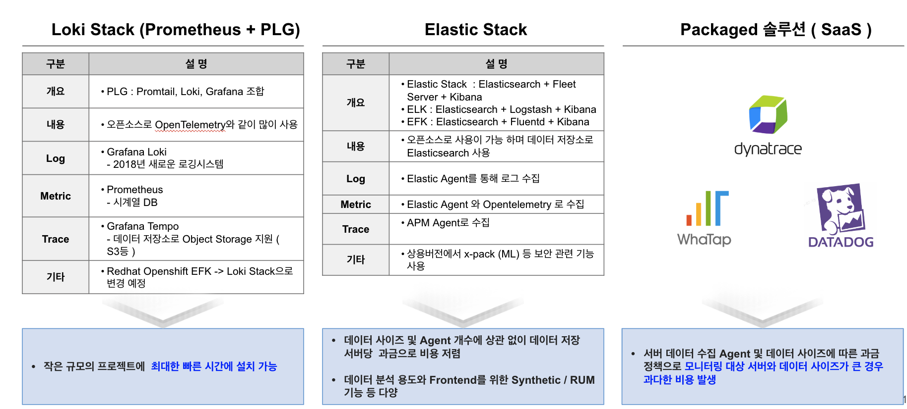
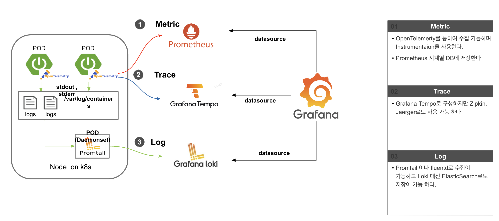
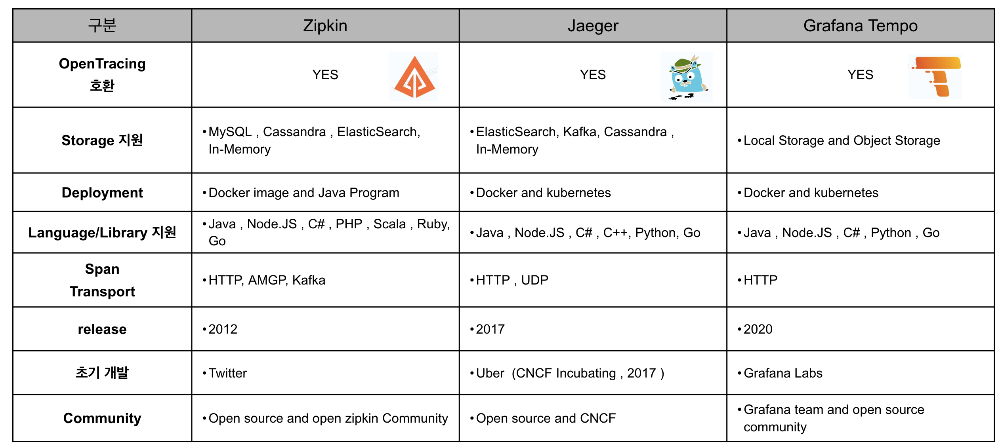
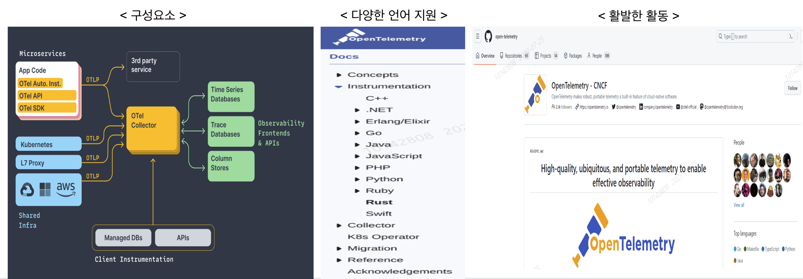
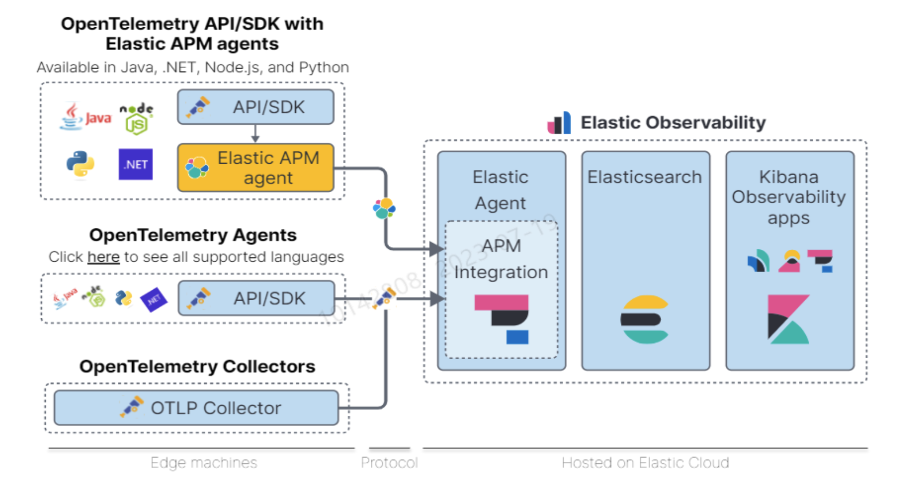
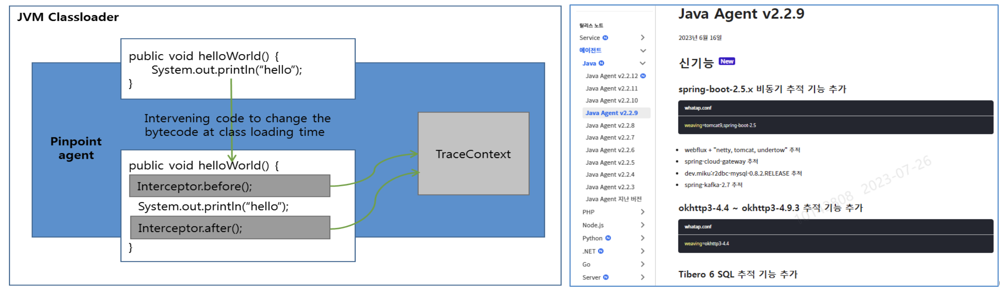

##  Observability 

 

Observability는 크게 Elastic Stack 과 Grafana Labs 의 Loki Stack 으로 구분이 되며 최근에는 SaaS 형태로도 지원 

 

 

Loki Stack은 Grafana Labs 의 Observability  솔루션으로 오픈소스로 사용이 가능하며 OKD 4.11 버전부터는 EFK (Elastic-Fluntd-Kibana) 대신 Loki Stack으로 기본 모니터링이 변경 되었다.

 

Open Tracing 비교 : Distributed tracing은 복잡한 마이크로 서비스 모니터링 환경에서 아주 중요하고 아래는 3종류의 오픈소스 트레이싱 솔루션을 비교한다   

 

최근에는 OpenTelemetry 를 통하여 데이터를 수집 하는 방식을 많이 사용한다.  

 

OpenTelemetry (축약해서 Otel)은 trace, metric, log와 같은 telemetry 데이터를 instrumenting, generating, collecting, exporting 하기 위한 말 그대로 모든 것이 열려있는 개방적인 모니터링 도구   

- 2019년 2개 프로젝트 병합  :  OpenTracing + OpenCensus (Google Open Source community project)  

 

개별 모니터링 제품 벤더가 내부적으로 개발하는 폐쇄적인 방식이 아닌 오픈 소스로 개방되어 수많은 개발자들이 만들어가는 모니터링 도구입니다.  
Otel 의 목표는 벤더에 종속되지 않는 SDK, API, tool을 통해 telemetry 데이터를 측정하고 Observability backend로 전송하는 것.  

- Dynatrace 는 Otel 의 Top Contributor  

 

   

Elastic은 OpenTelemetry에 적극적으로 참여하고 있으며 Elastic APM Agent / Elastic Agent에서 변환하여 Elasticsearch에 저장할 수 있다.    

- Jenkins 같은 경우 OpenTelemetry plugin 을 통해 Otel을 지원 하며 Elastic 과 연동이 가능 하다.  
  

   

BCI (Byte Code Instrumentation) 란 Java 에서 가장 원초적이고 강력한 프로그래밍 기법이다.
BCI 는 Java 의 Byte Code에 대해 직접적으로 수정을 가해서, 소스 파일의 수정 없이 원하는 기능을 부여할수 있고
이러한 특징 때문에 모니터링(APM) 툴들이 대부분 BCI 기능을 이용하고 있으며, BCI 를 통해 애플리케이션의 수정 없이 성능 측정에 필요한 요소들을 삽입할 수 있다.   

 

AOP 를 구현하는 핵심 기술이 바로 BCI 이다.
AOP 컴포넌트들이 컴파일시간이나 런타임 시간에 Aspect 와 Business Logic 을 Weaving 할수 있는 이유가 바로 BCI 를 사용해서 Java 바이트 코드를 직접 수정할 수 있는 기술을 사용하기 때문이다.  

- 참고 : https://pinpoint-apm.github.io/pinpoint/techdetail.html

 

 