#  Prometheus Metric 수집 
 
<br/>

Prometheus 에 대한 이해와 k8s metric 수집 실습을 진행한다.

<br/>


1. Metric 수집 방식

2. k8s metric 수집 구조

3. Prometheus 소개 / Grafana 사용 방법 

4. Metric 수집 실습 (과제) : Node Exporter ( Ubuntu VM )

5. Application Metric 수집 실습 :  Frontend / Backend 

6. Federation & Thanos 

7. Prometheus 내부 구조

<br/>

## 1. Metric 수집 방식  

<br/>

Push  
- 모니터링 주체가 서버에 정보를 보냄
- 수집 서버 정보를 알아야 함. agent에는 반드시 system agent가 설치되야 하고 agent는 중앙에 있는 서버에 metric을 보내야 하기 때문에 서버의 end-point IP를 알아야 한다. metric 정보가 변경될 때 마다 재 배포 해야 한다.
- 버퍼링 메커니즘(queue)
- 구성관리도구(CMDB) 필요
예) TICK Stack, Nagios  

<br/>

Pull (prometheus 방식)  
- exporters(like agent)
- 보통 수집 서버에 대한 정보를 agent나 서비스들이 알지 못한다. 프로메테우스는 agent가 내부 metric을 노출하고, 프로메테우스 중앙 집중형 컴포넌트가 metric을 수집한 후 DB에 저장한다.
- 중앙집중식 모니터링이지만 agent는 서버에 대한 정보를 모르고 외부에서 exporter나 다른 정보들이 metric을 expose 하는 것
- Service Discovery; k8s같은 오케스트레이션 툴을 통해 리소스에 있는 정보를 다이나믹하게 가져오는 방식
- push 방식도 지원
- 프로메테우스가 "주기적으로" exporter에서 메트릭을 읽어와서 수집( 메모리와 로컬디스크에 저장되고 exporter는 저장기능 없음 )


<br/>

## 2. k8s metric 수집 구조

<br>

쿠버네티스 노드는 kubelet을 통해 파드를 관리하며, 파드의 CPU나 메모리 같은 메트릭 정보를 수집하기 위해 kubelet에 내장된 cAdvisor를 사용. cAdvisor는 쿠버네티스 클러스터 위에 배포된 여러 컨테이너가 사용하는 메트릭 정보를 수집한 후 이를 가공해서 kubelet에 전달하는 역할을 한다.  

kubernetes 메트릭을 수집하는 것은 크게 4가지 종류로 나뉜다.  

<br/>

- kube-state-metric 사용
  모든 쿠버네티스 오브젝트의 메트릭을 가지고 있는 kube state metric  
  쿠버네티스 자체에 대한 모니터링. 서비스나 POD, 계정 정보 등이 해당
 
- kubelet  ( 주로 metric server 에서 수집 )
  kubelet에 포함된 cAdvisor를 통해 컨테이너의 메트릭 정보를 볼 수 있음  
  노드에서 가동되는 컨테이너에 대한 정보. CPU, 메모리, 디스크, 네트워크 사용량 등

- Node Exporter    
  노드의 CPU, 메모리, 디스크, 네트워크 사용량과 노드 OS와 커널에 대한 모니터링

- Application  
  컨테이너안에서 구동되는 개별 애플리케이션의 지표를 모니터링. 애플리케이션의 응답시간, HTTP 에러 빈도 등을 모니터링 (예, SpringBoot Actuator)

<br/>

어떤 솔루션을 사용하던 수집하는 metric 정보는 동일하며 promethues를 사용하지 않더라도 promethues 형식으로 데이터 포맷을 노출하는 서비스는 대부분 솔루션에서 수집을 지원한다.  


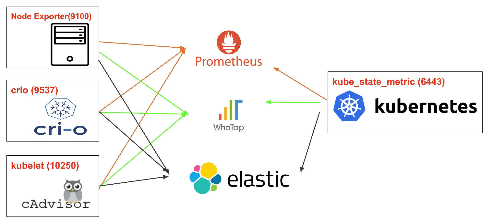

<br/>

### CAdvisor 란

<br/>

Kubelet 에는 CAdvisor 가 내장되어 있고 이는 컨테이너에 관련된 모니터링 데이터를 확인할 수 있는 모니터링 도구입니다. 하지만 CAdvisor가 제공하는 웹 UI에서는 단기간의 메트릭만 제공할 뿐, 체계적으로 데이터를 저장하고 분석하지는 않습니다.    

<br/>

CAdvisor 같은 모니터링 에이전트 부류의 도구들은 /metrics라고 하는 경로를 외부에 노출시켜 제공합니다. 이 /metrics 경로로 요청을 보내면 CAdvisor는 키-값 쌍으로 구성된 메트릭 데이터의 목록을 반환하는데, 이 메트릭 데이터를 프로메테우스 같은 시계열 데이터베이스에 저장할 수 있습니다.   

<br/>

프로메테우스는 CAdvisor의 엔드포인트를 미리 지정해주면 CAdvisor의 /metrics에 접근해 자동으로 데이터를 수집하므로 CAdvisor의 데이터를 직접 프로메테우스에 저장할 필요가 없습니다. 단, 이를 위해서는 프로메테우스가 CAdvisor에 접근해 메트릭을 가져갈 수 있도록 CAdivisor의 엔드포인트 정보를 프로메테우스에 미리 지정해둬야 합니다.

<br/>

이처럼 /metrics 경로를 외부에 노출시켜 데이터를 수집할 수 있도록 인터페이스를 제공하는 서버를 일반적으로 exporter라고 합니다.  


<br/>

### metric server 

<br/>


쿠버네티스 메트릭을 수집해 사용할 수 있도록 몇 가지 add-on(쿠버네티스 내부에 설치해 추가적으로 기능을 활용할 수 있도록 제공하는 도구)을 제공합니다. 그 중 가장 기초적인 것은 컨테이너와 인프라 레벨에서의 메트릭을 수집하는 metrics-server라는 도구입니다. metrics-server를 설치하면 포드의 오토스케링링, 사용 중인 리소스 확인 등 여러 기능을 추가적으로 사용할 수 있습니다.  

<br/>

각 POD, 노드의 리소스 사용량을 확인하는 명령어로 kubectl top 이라는 명령어가 있습니다. 단일 도커 호스트와는 달리 쿠버네티스는 여러 개의 노드로 구성되 있기 때문에 docker stats처럼 쉽게 메트릭을 확인할 수는 없습니다. kubectl top 명령어를 사용하려면 클러스터 내부의 메트릭을 모아서 제공하는 별도의 무언가가 필요한데 metrics-server가 바로 그 역할입니다.

<br/>


노드의 에이전트인 kubelet은 CAdvisor를 자체적으로 내장하고 있으며, 포드와 노드 메트릭을 반환하는 /stats/summary 라는 엔드포인트를 제공합니다. kubelet은 기본적으로 노드의 10250 포트로 연결돼있습니다.  

<br/>

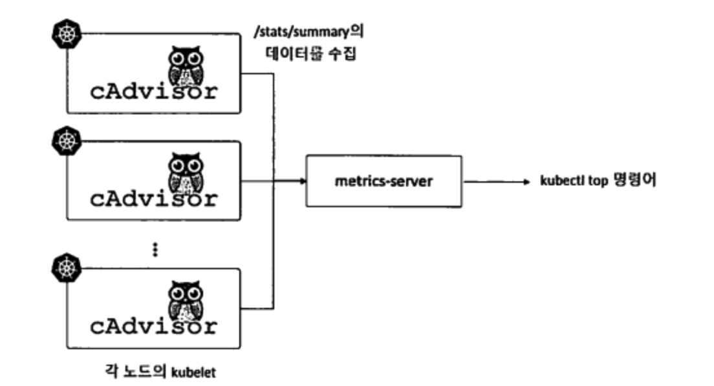

<br/>

cAdvisor 수집 metric Full List   
- https://github.com/google/cadvisor/blob/master/docs/storage/prometheus.md  

<br/>


### Node Exporter metric 데이터 조회해 보기 

<br/>

worker node 에서 수집되는 metric 정보는 다음과 같다.   

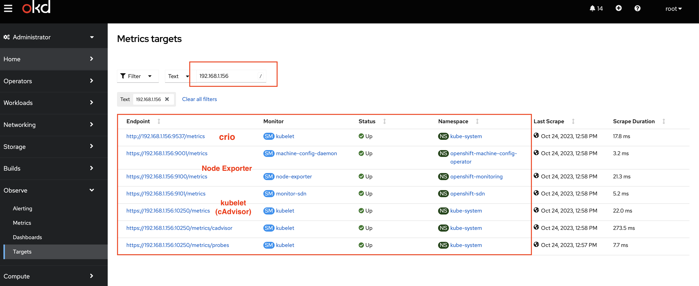


<br/>

metric 수집을 위한 서비스 들은 localhost로 접속을 할 수가 있는데 Daemonset 이나 static pod로 기동시에  Host Network 으로 설정이 된다.   

아래 node-exporter 기동으로 IP를 보면 Worker Node 의 IP ( 192.168.1.x )로 할당 된 것을 볼 수 있고 해당 port 들은 충돌이 나지 않도록 설정을 해야 한다.  


```bash
[root@bastion elastic]# kubectl get po -n openshift-monitoring -o wide
NAME                                                    READY   STATUS    RESTARTS       AGE     IP              NODE                            NOMINATED NODE   READINESS GATES
alertmanager-main-0                                     6/6     Running   14             53d     10.128.0.56     okd-1.okd4.ktdemo.duckdns.org   <none>           <none>
cluster-monitoring-operator-585c6bf574-pzqth            2/2     Running   16 (13d ago)   53d     10.128.0.41     okd-1.okd4.ktdemo.duckdns.org   <none>           <none>
kube-state-metrics-7fc57d8785-r52m9                     3/3     Running   19 (13d ago)   53d     10.128.0.29     okd-1.okd4.ktdemo.duckdns.org   <none>           <none>
node-exporter-29s9w                                     2/2     Running   4              36d     192.168.1.148   okd-2.okd4.ktdemo.duckdns.org   <none>           <none>
node-exporter-2t8r6                                     2/2     Running   6              13d     192.168.1.150   okd-4.okd4.ktdemo.duckdns.org   <none>           <none>
node-exporter-dvtf9                                     2/2     Running   4              36d     192.168.1.149   okd-3.okd4.ktdemo.duckdns.org   <none>           <none>
node-exporter-fb9gs                                     2/2     Running   2              13d     192.168.1.154   okd-5.okd4.ktdemo.duckdns.org   <none>           <none>
node-exporter-jrb82                                     2/2     Running   2              4d15h   192.168.1.155   okd-6.okd4.ktdemo.duckdns.org   <none>           <none>
node-exporter-p6khv                                     2/2     Running   6              53d     192.168.1.146   okd-1.okd4.ktdemo.duckdns.org   <none>           <none>
node-exporter-vfwv8                                     2/2     Running   0              2d5h    192.168.1.156   okd-7.okd4.ktdemo.duckdns.org   <none>           <none>
openshift-state-metrics-866ff84554-clxp8                3/3     Running   8              53d     10.128.0.12     okd-1.okd4.ktdemo.duckdns.org   <none>           <none>
prometheus-adapter-867dd46876-flf5v                     1/1     Running   0              4d15h   10.128.2.231    okd-5.okd4.ktdemo.duckdns.org   <none>           <none>
prometheus-k8s-0                                        6/6     Running   12             53d     10.128.0.27     okd-1.okd4.ktdemo.duckdns.org   <none>           <none>
prometheus-operator-864d498767-5298f                    2/2     Running   7              53d     10.128.0.50     okd-1.okd4.ktdemo.duckdns.org   <none>           <none>
prometheus-operator-admission-webhook-cf7d8fb4d-4d9wj   1/1     Running   5 (13d ago)    53d     10.128.0.54     okd-1.okd4.ktdemo.duckdns.org   <none>           <none>
telemeter-client-dcb65ff66-pxwrj                        3/3     Running   7              53d     10.128.0.36     okd-1.okd4.ktdemo.duckdns.org   <none>           <none>
thanos-querier-767bcd5786-nntjm                         6/6     Running   14             53d     10.128.0.45     okd-1.okd4.ktdemo.duckdns.org   <none>           <none>
```    

<br/>

`openshift-monitoring` namespace의 node exporter 의 Daemonset yaml 을 보면 `hostNetwork: true` 로 설정을 하여야 한다.    

또한 hostPort: 9100 와 containerPort: 9100 는 같은 port로 설정해야 한다.    

<br/>

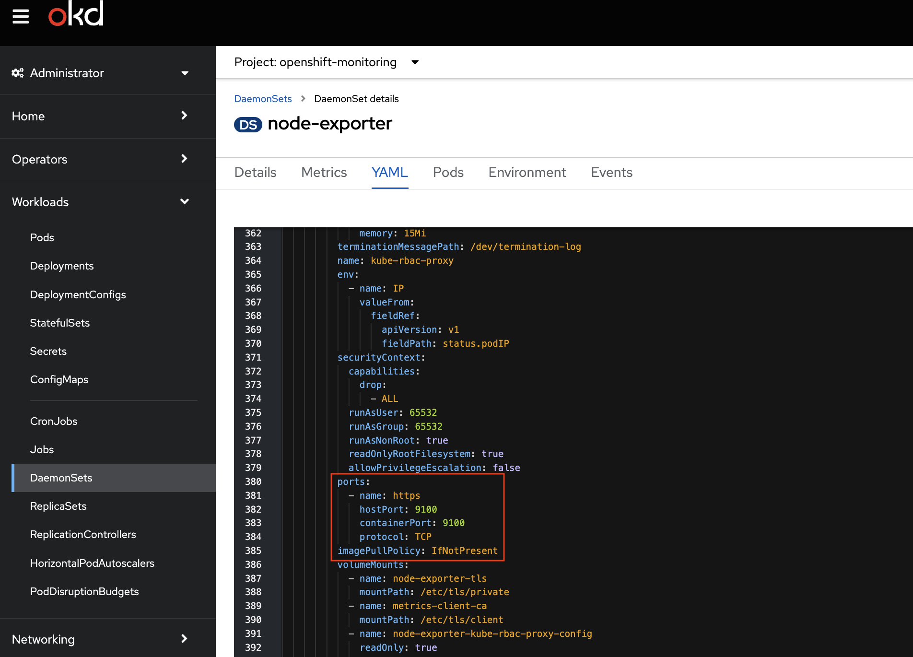


<br/>

```bash
      hostPID: true
      schedulerName: default-scheduler
      hostNetwork: true
      terminationGracePeriodSeconds: 30
      securityContext: {}
      ...
      ports:
        - name: https
          hostPort: 9100
          containerPort: 9100
          protocol: TCP      
```  

<br/>

`9100` 포트로 노출 되어 있는 Node Exporter 의 서비스를 호출 하여 metric 정보는 조회해 본다.    

해당 서비스를 조회 하기 위해서는 token 정보가 필요하고 OKD는 `openshift-monitoring` namespace의 secret 에 `node-exporter-token` 으로 시작 되는 secret 를 클릭한다.  


<br/>

Reveal Values 를 클릭하고 맨 아래로 가면 token 값을 확인 할 수 있고 해당 값을 복사한다.  

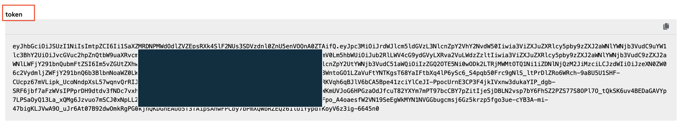


<br/>

이제 worker node 에 접속하기 위해 worker.sh 화일을 실행한다.  

```bash
root@edu19:~# worker.sh
Worker Node OKD-2 connect.
core@okd-2.okd4.ktdemo.duckdns.org's password:
```  

<br/>


token 변수에 앞에서 복사한 token 값을 넣는다.  

```bash
[core@okd-7 ~]$token=eyJhbGciOiJSUzI1NiIsImtpZCI6Ii1SaXZMRDNPMWdOdlZVZEpsRXk4SlF2NUs3SDVzdnl0ZnU5enVOQnA0ZTAifQ.
```  

<br/>

http 로 9100 포트에 접속을 하여 metric 을 조회해 본다.   

```bash
[core@okd-7 ~]$  curl -H "Authorization: Bearer $token" -k "http://localhost:9100/metrics" | more
  % Total    % Received % Xferd  Average Speed   Time    Time     Time  Current
                                 Dload  Upload   Total   Spent    Left  Speed
  0     0    0     0    0     0      0      0 --:--:-- --:--:-- --:--:--     0# HELP go_gc_duration_seconds A summary of the pause duration of garbage collection cycles.
# TYPE go_gc_duration_seconds summary
go_gc_duration_seconds{quantile="0"} 2.9151e-05
go_gc_duration_seconds{quantile="0.25"} 8.8563e-05
go_gc_duration_seconds{quantile="0.5"} 0.000155838
go_gc_duration_seconds{quantile="0.75"} 0.000232127
go_gc_duration_seconds{quantile="1"} 0.001913169
go_gc_duration_seconds_sum 2.670649289
go_gc_duration_seconds_count 12234
# HELP go_goroutines Number of goroutines that currently exist.
# TYPE go_goroutines gauge
go_goroutines 8
# HELP go_info Information about the Go environment.
# TYPE go_info gauge
go_info{version="go1.19.1"} 1
# HELP go_memstats_alloc_bytes Number of bytes allocated and still in use.
# TYPE go_memstats_alloc_bytes gauge
go_memstats_alloc_bytes 2.031872e+06
# HELP go_memstats_alloc_bytes_total Total number of bytes allocated, even if freed.
# TYPE go_memstats_alloc_bytes_total counter
go_memstats_alloc_bytes_total 1.9107712096e+10
# HELP go_memstats_buck_hash_sys_bytes Number of bytes used by the profiling bucket hash table.
# TYPE go_memstats_buck_hash_sys_bytes gauge
go_memstats_buck_hash_sys_bytes 1.917486e+06
# HELP go_memstats_frees_total Total number of frees.
...
```  

Prometheus 형태의 데이터가 추출되는 것을 볼 수 있다.  

<br/>

## 3. Prometheus 소개 / Grafana 사용 방법


<br/>

### Prometheus란?


<br/>

Prometheus는 시스템 및 서비스의 상태를 모니터링하는 인기 있는 오픈소스 모니터링 툴이다.

Prometheus는 다양한 데이터 소스에서 지표(Metric)를 수집하고 저장하는데, 이 지표는 시계열 데이터로 관리된다. Prometheus는 이러한 지표를 쿼리 하여 그래프로 나타낼 수 있다. 또한 특정 지표에 대한 경고를 설정할 수 있으며, 이를 통해 성능 이슈나 잠재적인 장애 상황에 대한 경고를 받을 수 있다.

프로메테우스의 아키텍처는 다음과 같다.  

<br/>

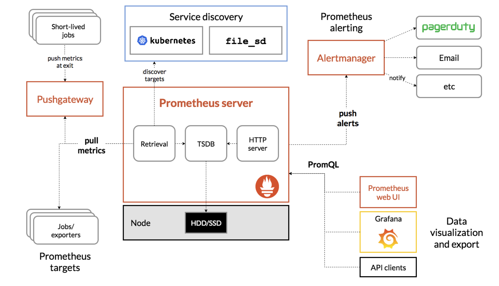

<br/>

### Prometheus metrics ( Data Model )

<br/>

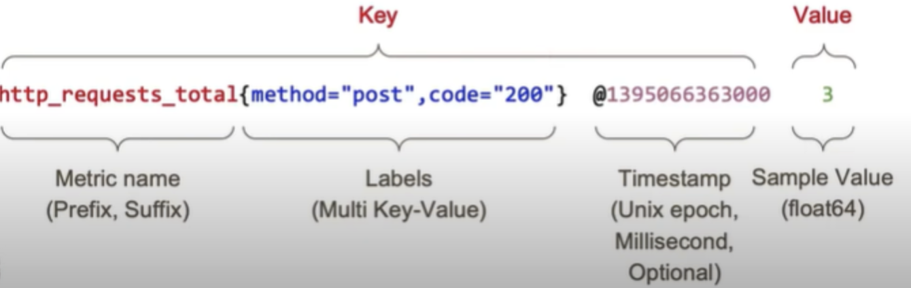


<br/>

### PromQL

<br/>

메트릭을 검색(retrive)하기 위한 고유한 쿼리 언어  
Instance: single unit/process (ex:서버 단위, CPU 사용량)

<br/>  

참고: https://gurumee92.tistory.com/244

<br/>

### Service Monitor

<br/>

참고 : https://jerryljh.medium.com/prometheus-servicemonitor-98ccca35a13e  


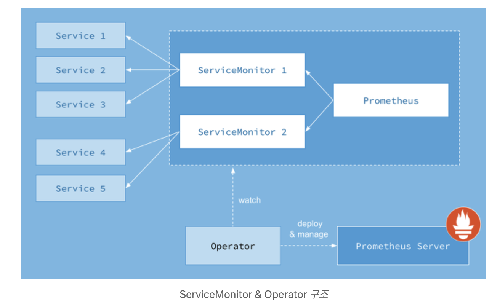

<br/>

### Service Monitor 와 prometheus.yaml

<br/>

service Monitor 와 Endpoint를 생성하면 prometheus.yaml 화일에 저장이 되는데 OKD의 경우는 secret으로 관리가 된다.  

<br/>

인프라에서 사용하는 prometheus
- namespace : `openshift-monitoring`
- secret : `prometheus-k8s`


<br/>

사용자들이 사용할 수 있는 prometheus
- namespace : `openshift-user-workload-monitoring`
- secret : `prometheus-user-workload`

<br/>

secret 으로 이동한후 `prometheus-user-workload` 를 클릭한다.  
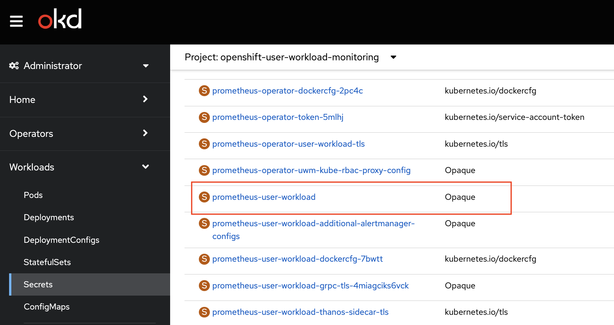

<br/>

맨 밑에 Data 항목에  prometheus.yaml.gz 가 있고 Save file을 하여 다운 받는다.  

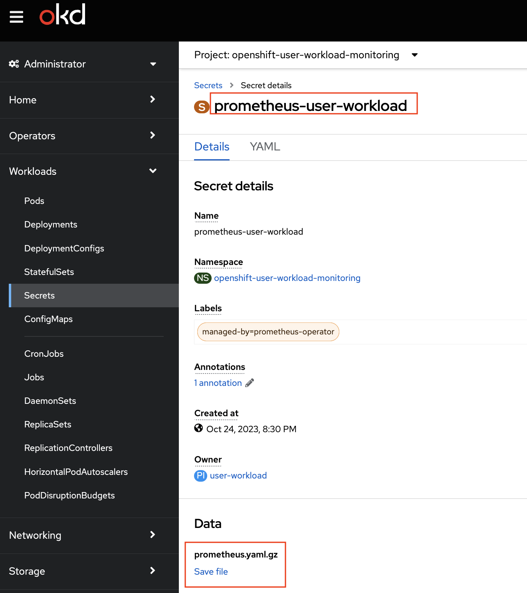

<br/>

압축을 풀면 prometheus.yaml 화일이 보이고 Service Monitor로 생성한 값이 보인다.    

prometheus.yaml
```bash
scrape_configs:
- job_name: serviceMonitor/edu25/external-node-exporter/0
  honor_labels: false
  honor_timestamps: false
  kubernetes_sd_configs:
  - role: endpoints
    namespaces:
      names:
      - edu25
  scrape_interval: 30s
  metrics_path: /metrics
```  


<br/>

### Service Monitor vs Pod Monitor

<br/>

참고  
- https://nangman14.tistory.com/75  
- https://alexandre-vazquez.com/prometheus-concepts-servicemonitor-and-podmonitor/ 


<br/>


### OKD 에서 Prometheus 기본 설정

<br/>


참고:  https://access.redhat.com/documentation/ko-kr/openshift_container_platform/4.12/html-single/monitoring/index  

<br/>

OKD 를 초기 설치 하면 기본적인 cpu , mem, disk 정도만 모니터링이 되고 데이터는 node 에 저장이 된다.  
데이터 저장소를 NFS (PV/PVC) 로 변경해야 한다.    

`openshift-monitoring` namespace 에 `cluster-monitoring-config` configmap 을 생성한다.  

<br/>

```bash
root@bastion monitoring]# cat cluster-monitoring-config.yaml
apiVersion: v1
kind: ConfigMap
metadata:
  name: cluster-monitoring-config
  namespace: openshift-monitoring
data:
  config.yaml: |
    #grafana:       #  grafana 자동 설치 4.11 이상 버전에서는 불가.
    #  nodeSelector:
    #    devops: "true"  # node selector 찾아서  설치  
    prometheusK8s:
      retention: 14d   # 데이터 보존 기간 
      volumeClaimTemplate:
        spec:
          storageClassName: nfs-client  # storage는 다이나믹 프로비져닝으로 생성
          volumeMode: Filesystem
          resources:
            requests:
              storage: 50Gi
      tolerations:
      - effect: NoExecute
        key: node.kubernetes.io/not-ready
        operator: Exists
        tolerationSeconds: 3
      - effect: NoExecute
        key: node.kubernetes.io/unreachable
        operator: Exists
        tolerationSeconds: 3
      - effect: NoSchedule
        key: node.kubernetes.io/memory-pressure
        operator: Exists
    alertmanagerMain:
      nodeSelector:
        devops: "true"
      volumeClaimTemplate:
        spec:
          storageClassName: nfs-client
          volumeMode: Filesystem
          resources:
            requests:
              storage: 50Gi
    telemeterClient:
      nodeSelector:
        devops: "true"
    prometheusOperator:
      nodeSelector:
        devops: "true"
    kubeStateMetrics:
      nodeSelector:
        devops: "true"
    openshiftStateMetrics:
      nodeSelector:
        devops: "true"
    thanosQuerier:
      nodeSelector:
        devops: "true"
    k8sPrometheusAdapter:
      nodeSelector:
        devops: "true"
```  

<br/>

아래 와 같이 `--dry-run=server` 명령어를 사용하여 yaml 화일을 검증 한다.  

```bash
[root@bastion monitoring]# kubectl apply -f cluster-monitoring-config.yaml --dry-run=server -n openshift-monitoring
configmap/cluster-monitoring-config created (server dry run)
```  

<br/>

에러가 없으면 configmap 을 생성한다.  

```bash
[root@bastion monitoring]# kubectl apply -f cluster-monitoring-config.yaml -n openshift-monitoring
configmap/cluster-monitoring-config created
```  

<br/>

`openshift-monitoring` namespace 의 pod 를 조회해 보면 신규로 `alertmanager-main` , `openshift-state-metrics` 등이 생성이 된다.    

```bash
[root@bastion monitoring]# kubectl get po -n openshift-monitoring
NAME                                                     READY   STATUS    RESTARTS      AGE
alertmanager-main-0                                      6/6     Running   1 (58s ago)   77s
cluster-monitoring-operator-585c6bf574-pzqth             2/2     Running   4             10d
kube-state-metrics-755448c775-875h2                      3/3     Running   0             107s
node-exporter-6z2q6                                      2/2     Running   0             10d
node-exporter-p6khv                                      2/2     Running   4             10d
node-exporter-v9jcd                                      2/2     Running   2             3d6h
openshift-state-metrics-6c75f948d8-qt4cx                 3/3     Running   0             107s
prometheus-adapter-5fc64d5b7f-n58sh                      1/1     Running   0             106s
prometheus-k8s-0                                         6/6     Running   0             63s
prometheus-operator-54f7875879-g49qq                     2/2     Running   0             2m
prometheus-operator-admission-webhook-7d8d84948d-xqhhg   1/1     Running   0             2m12s
telemeter-client-5fb4cc8d85-lksv2                        3/3     Running   0             106s
thanos-querier-798bc997d-trsbq                           6/6     Running   0             93s
```  

<br/>

다이나믹 프로비저닝을 통해 2개의 pvc가 생성이 된 것을 확인할 수 있다.    

<br/>

```bash
[root@bastion monitoring]# kubectl get pvc -n openshift-monitoring
NAME                                       STATUS   VOLUME                                     CAPACITY   ACCESS MODES   STORAGECLASS   AGE
alertmanager-main-db-alertmanager-main-0   Bound    pvc-03ed4deb-3c7d-4926-a9ec-a5bce1ad56f3   50Gi       RWO            nfs-client     15m
prometheus-k8s-db-prometheus-k8s-0         Bound    pvc-22760f54-17fc-44e2-9a77-9f1304c33fe8   50Gi       RWO            nfs-client     15m
```  

<br/>


<br/>

Observe -> metrics 메뉴로 이동하여 아래와 같이 `absent_over_time(container_cpu_usage_seconds_total{}[5m])` promQL을 입력하여 데이터를 조회 한다.    


<br/>

### OKD 에서 Prometheus user workload 설정

<br/>

참고 : https://access.redhat.com/documentation/en-us/openshift_container_platform/4.12/html-single/monitoring/index#enabling-monitoring-for-user-defined-projects  

<br/>

OKD 에서는 시스템 metric 수집 이외에 사용자 Application의 metric를 수집 하기 위해서는 
`openshift-user-workload-monitoring` namespace 를 활성화 해야 한다.  

<br/>

활성화를 위해서는 `cluster-monitoring-config` 이름의
configmap에 `enableUserWorkload: true` 를 추가한다.  

<br/>

```bash
[root@bastion ~]# oc -n openshift-monitoring edit configmap cluster-monitoring-config
```  

<br/>  

아래와 같이 추가 하고 저장.  

```bash
      6 data:
      7   config.yaml: |
      8     enableUserWorkload: true  # 추가
```     

<br/>

Cluster operator 에서 성공 메시지를 확인을 한다.   


<br/>

`openshift-user-workload-monitoring` namespace 에서 3개의 pod가 생성된 것을 확인한다.   


```bash  
[root@bastion ~]# kubectl get po -n openshift-user-workload-monitoring
NAME                                  READY   STATUS    RESTARTS   AGE
prometheus-operator-9d64bcf56-468q5   2/2     Running   0          48s
prometheus-user-workload-0            6/6     Running   0          44s
thanos-ruler-user-workload-0          3/3     Running   0          41s
```  

<br/>

OKD Prometheus component mapping 정보   

<br/>


<br/>

### Grafana 접속 방법

<br/>

grafana 는 web browser 에서 https://grafana-route-openshift-user-workload-monitoring.apps.okd4.ktdemo.duckdns.org/ 로 접속을 한다.  

<br/>

id는 순번이고 비밀번호는 기 공지 ( 예, edu1)

<br/>


## 4. Metric 수집 실습 : Node Exporter ( Ubuntu VM ) : 과제 

<br/>


해당 과제는 교육생의 VM 서버에 node exporter를 설치 하여 metric을 prometheus 에서 가져오고 Grafana 에서 조회하는 예제입니다.  

<br/>

아키텍처는 아래와 같습니다.  

<br/>

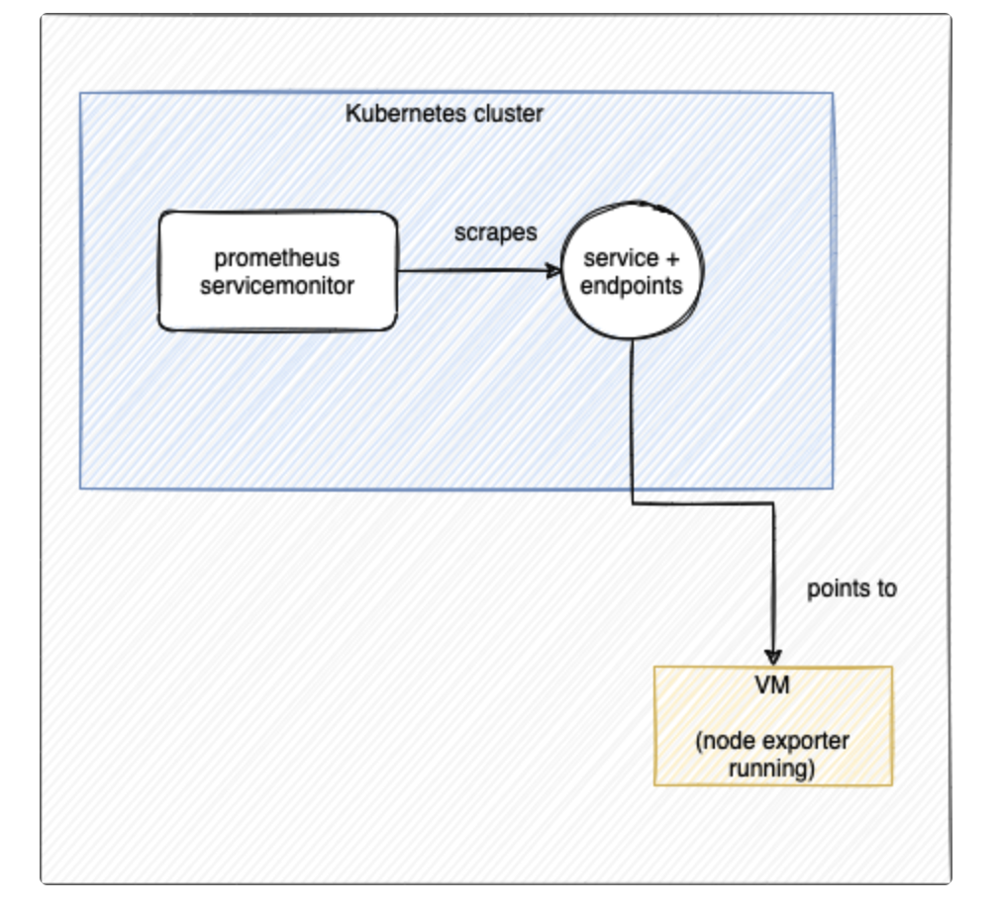

<br/>

최종 모습 : job을 external-node-exporter 로 설정하고 refresh 한다.  

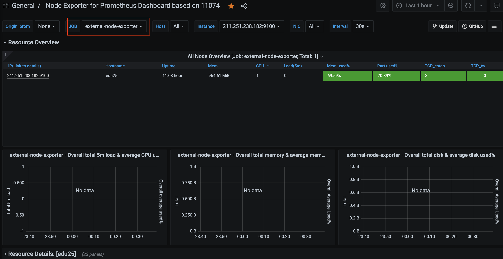


<br/>

아래 순서로 진행 합니다. 

<br/>


1. vm 서버에 접속하여 node_exporter 를 다운 받는다.   
- https://github.com/prometheus/node_exporter/releases

<br/>

```bash
root@edu25:~# wget https://github.com/prometheus/node_exporter/releases/download/v1.6.1/node_exporter-1.6.1.linux-amd64.tar.gz
```  


<br/>

2. 압축을 풀고 /usr/local/bin 폴더로 실행 화일을 변경하여 이동한다.   

```bash
root@edu25:~# tar xvfz node_exporter-*.*-amd64.tar.gz
root@edu25:~# sudo mv node_exporter-*.*-amd64/node_exporter /usr/local/bin/
```

<br/>


3. node_exporter 서비스를 실행하고 포트를 확인합니다.

```bash
root@edu25:~# < 해야할일 > &
...
level=info msg="Listening on" address=[::]:9100
ts=2023-10-24T09:50:40.565Z caller=tls_config.go:277 level=info msg="TLS is disabled." http2=false address=[::]:9100
```  

<br/> 

4. metric 을 조회해 본다.  

```bash
root@edu25:~# <해야 할일 >
  % Total    % Received % Xferd  Average Speed   Time    Time     Time  Current
                                 Dload  Upload   Total   Spent    Left  Speed
  0     0    0     0    0     0      0      0 --:--:-- --:--:-- --:--:--     0# HELP go_gc_duration_seconds A summary of the pause duration of garbage collection cycles.
# TYPE go_gc_duration_seconds summary
go_gc_duration_seconds{quantile="0"} 0
go_gc_duration_seconds{quantile="0.25"} 0
go_gc_duration_seconds{quantile="0.5"} 0
go_gc_duration_seconds{quantile="0.75"} 0
go_gc_duration_seconds{quantile="1"} 0
go_gc_duration_seconds_sum 0
go_gc_duration_seconds_count 0
```


<br/> 

5. k8s 에서 서비스를 생성한다.  
- external-node-exporter-svc.yaml 생성
- kind: Service
- name : external-node-exporter
- label : app: external-node-exporter
- port name : metrics
- port : 9100 , protocol: TCP , targetPort: 9100

<br/>

```bash
root@edu25:~# cat  external-node-exporter-svc.yaml
...
root@edu25:~# kubectl apply -f external-node-exporter-svc.yaml
service/external-node-exporter created
root@edu25:~# kubectl get svc
NAME                     TYPE        CLUSTER-IP     EXTERNAL-IP   PORT(S)    AGE
external-node-exporter   ClusterIP   172.30.94.58   <none>        9100/TCP   2m
```

<br/>

6. k8s 에서 external 시스템과 연결하기 위한 End Point를 생성한다.     
- external-node-exporter-ep.yaml 생성
- kind: Endpoints
- name : external-node-exporter
- addresses   
    ip에는 본인의 vm ip를 넣어준다.
- port : 9100 
- protocol: TCP

```bash
root@edu25:~# cat external-node-exporter-ep.yaml
root@edu25:~# kubectl apply -f external-node-exporter-ep.yaml
endpoints/external-node-exporter created
root@edu25:~# kubectl get endpoints
NAME                     ENDPOINTS              AGE
external-node-exporter   211.251.238.182:9100   9s
```

<br/>

ServiceMonitor 를 생성하기 위해서는 role를 생성하고 rolebinding을 해야 한다.    

```bash
[root@bastion monitoring]# cat service_monitor_role.yaml
apiVersion: rbac.authorization.k8s.io/v1
kind: Role
metadata:
  name: servicemonitor-role
rules:
- apiGroups: ["monitoring.coreos.com"]
  resources: ["servicemonitors"]
  verbs: ["*"]
[root@bastion monitoring]# kubectl apply -f  service_monitor_role.yaml
```  

<br/>

`edu25` 유저에게 권한을 할당한다.  

```bash 
[root@bastion monitoring]# kubectl create rolebinding servicemonitor-rolebinding --role=servicemonitor-role --user=edu25
```  

<br/>

아래와 같이 조회가 가능하다.   

```bash 
root@edu25:~# kubectl get servicemonitor
NAME                     AGE
external-node-exporter   30m
```

<br/>

7. ServiceMonitor 를 생성한다.     
- namespaceSelector에는  본인의 namespace 를 넣어준다. 

<br/>

```bash
root@edu25:~# cat external-node-exporter-sm.yaml
apiVersion: monitoring.coreos.com/v1
kind: ServiceMonitor
metadata:
  name: external-node-exporter
  labels:
    app: external-node-exporter
spec:
  endpoints:
    - port: metrics
      interval: 30s
      path: /metrics
  selector:
    matchLabels:
      app: external-node-exporter
  namespaceSelector:
    matchNames:
      - edu25
root@edu25:~# kubectl apply -f external-node-exporter-sm.yaml
servicemonitor.monitoring.coreos.com/external-node-exporter created
root@edu25:~# kubectl get servicemonitor
NAME                     AGE
external-node-exporter   51s
```
<br/>

Administration -> CustomeResourceDefinitions 로 이동하여 servicemonitor를 검색한다.  

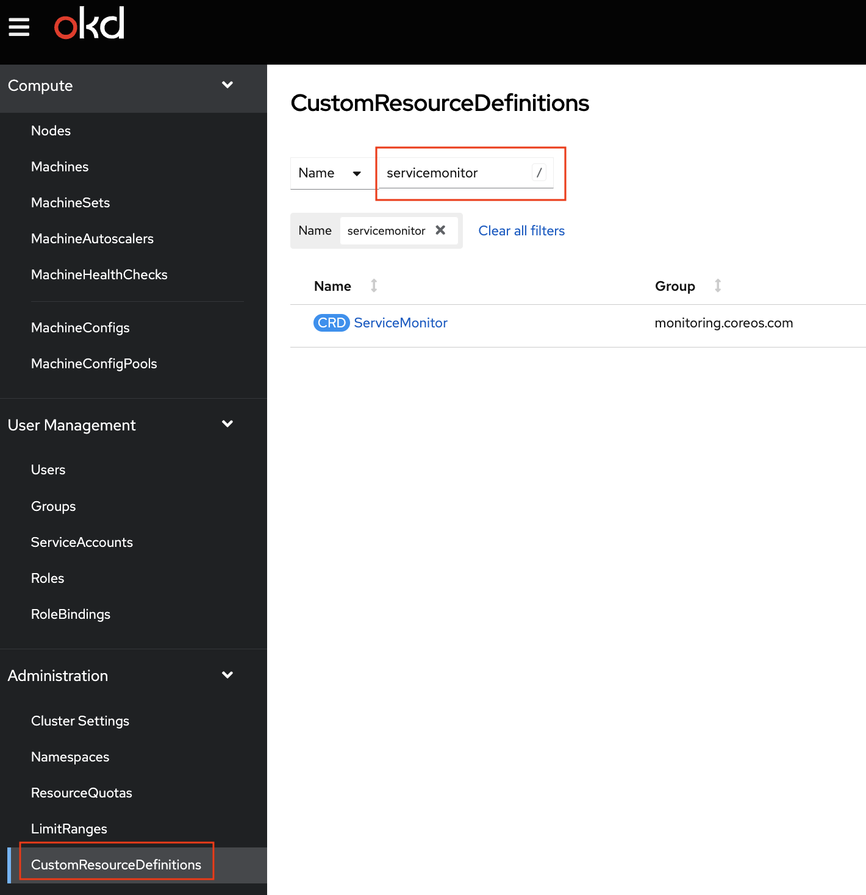


<br/>

servicemonitor를 클릭하고 Instances 를 선택하고 난후 external 로 검색을 하면 우리가 생성한 servicemonitor 를 확인 할 수 있다.  

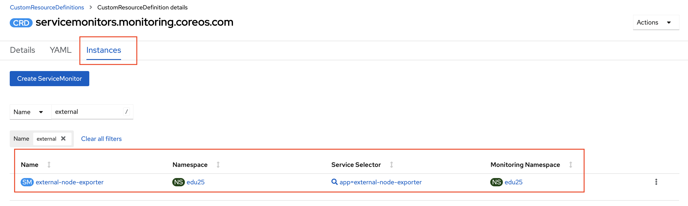

<br/>

8. okd 콘솔의 Observe 에서 target 이 생성 되었는지 확인한다.    

<br/>

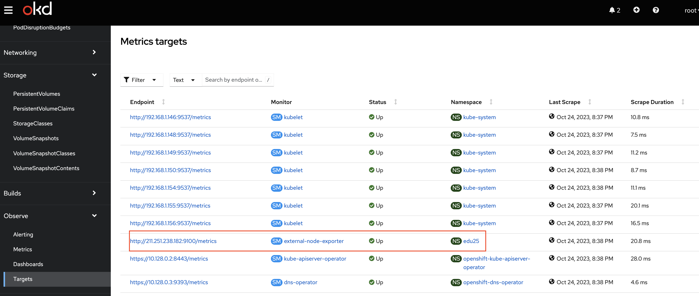

<br/>

9. okd 콘솔의 Observe에서 metric를 조회해 본다.    

<br/>

```bash
sum(rate(node_cpu_seconds_total{instance="211.251.238.182:9100"}[1m])/32*100)
```

<br/>

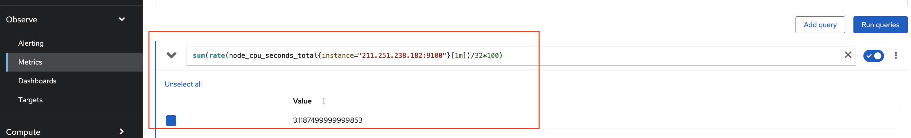

<br/>

10. grafana 에 dashboard 를 설치한다.  ( 이미 설치됨 skip )
- 대쉬보드번호 : 15172

<br/>

job을 external-node-exporter 로 설정하고 refresh 한다.  


<br/>

## Application Metric 수집 실습 :  Frontend / Backend 

<br/>

이제 Application 의 metric 을 수집해 봅니다.  

먼저 `openshift-user-workload-monitoring` namespace 의 POD를 확인한다.  

<br/>

```bash  
[root@bastion monitoring]# oc  get pod -n openshift-user-workload-monitoring
NAME                                                   READY   STATUS    RESTARTS   AGE
grafana-deployment-7f949f55c5-626xd                    1/1     Running   0          21h
grafana-operator-controller-manager-679556bd5f-gdq5h   2/2     Running   0          22h
prometheus-operator-9d64bcf56-tvk4g                    2/2     Running   0          25h
prometheus-user-workload-0                             6/6     Running   0          24h
thanos-ruler-user-workload-0                           3/3     Running   0          25h
```  

<br/>

namespace 를 고정한다. ( 교육생은 불필요 ) 

```bash
[root@bastion monitoring]# oc  project edu25
Now using project "edu25" on server "https://api.okd4.ktdemo.duckdns.org:6443".
``` 

<br/>

frontend (Express) 와 backend (Quarkus) Application 을 배포한다.  

<br/>

```bash  
[root@bastion monitoring]# kubectl apply -f frontend-v1-and-backend-v1-JVM.yaml
deployment.apps/frontend-v1 created
service/frontend created
route.route.openshift.io/frontend created
deployment.apps/backend-v1 created
service/backend created
[root@bastion monitoring]# kubectl get svc
NAME                     TYPE        CLUSTER-IP       EXTERNAL-IP   PORT(S)    AGE
backend                  ClusterIP   172.30.106.161   <none>        8080/TCP   53s
external-node-exporter   ClusterIP   172.30.94.58     <none>        9100/TCP   26h
frontend                 ClusterIP   172.30.43.109    <none>        8080/TCP   54s
[root@bastion monitoring]# kubectl get route
NAME       HOST/PORT                                     PATH   SERVICES   PORT   TERMINATION   WILDCARD
frontend   frontend-edu25.apps.okd4.ktdemo.duckdns.org          frontend   http   edge          None
```  

<br/>

OKD Console 에서 Developer perspective 로 이동하여 우측 상단 Topology 아이콘을 클릭하면 토폴로지를 볼수 있다.   

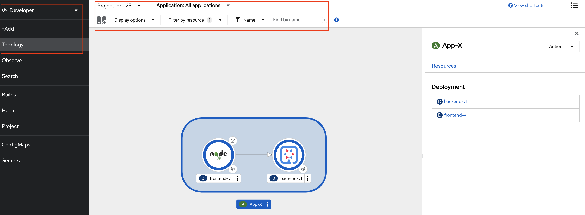


<br/>

frontend APP 를 호출 해 본다.  

```bash
curl -k https://$(oc get route frontend -o jsonpath='{.spec.host}' )
```  

<br/>

Output    
```bash 
Frontend version: v1 => [Backend: http://backend:8080, Response: 200, Body: Backend version:v1, Response:200, Host:backend-v1-86d9c7747d-96d7s, Status:200, Message: Hello, World]
```  


<br/>

backend APP 의 metrics 를 조회해 본다.    
- jvm heap size  

backend 는 Quarkus 로 개발이 되어 있다.  
- https://gitlab.com/ocp-demo/backend_quarkus

<br/>

```bash
oc exec  $(oc get pods -l app=backend \
--no-headers  -o custom-columns='Name:.metadata.name' \
 | head -n 1 ) -- curl -s  http://localhost:8080/q/metrics | grep heap
```  

<br/>

Output    
```bash 
# HELP jvm_gc_memory_allocated_bytes Incremented for an increase in the size of the (young) heap memory pool after one GC to before the next
jvm_memory_max_bytes{area="nonheap",id="CodeHeap 'profiled nmethods'"} 1.22912768E8
jvm_memory_max_bytes{area="heap",id="PS Old Gen"} 1.048576E8
jvm_memory_max_bytes{area="heap",id="PS Survivor Space"} 524288.0
jvm_memory_max_bytes{area="heap",id="PS Eden Space"} 5.1380224E7
jvm_memory_max_bytes{area="nonheap",id="Metaspace"} -1.0
jvm_memory_max_bytes{area="nonheap",id="CodeHeap 'non-nmethods'"} 5828608.0
jvm_memory_max_bytes{area="nonheap",id="Compressed Class Space"} 1.073741824E9
jvm_memory_max_bytes{area="nonheap",id="CodeHeap 'non-profiled nmethods'"} 1.22916864E8
# HELP jvm_memory_usage_after_gc_percent The percentage of long-lived heap pool used after the last GC event, in the range [0..1]
jvm_memory_usage_after_gc_percent{area="heap",pool="long-lived"} 0.09887138366699219
jvm_memory_committed_bytes{area="nonheap",id="CodeHeap 'profiled nmethods'"} 6029312.0
jvm_memory_committed_bytes{area="heap",id="PS Old Gen"} 1.1534336E7
jvm_memory_committed_bytes{area="heap",id="PS Survivor Space"} 524288.0
jvm_memory_committed_bytes{area="heap",id="PS Eden Space"} 1048576.0
jvm_memory_committed_bytes{area="nonheap",id="Metaspace"} 3.2636928E7
jvm_memory_committed_bytes{area="nonheap",id="CodeHeap 'non-nmethods'"} 2555904.0
jvm_memory_committed_bytes{area="nonheap",id="Compressed Class Space"} 4194304.0
jvm_memory_committed_bytes{area="nonheap",id="CodeHeap 'non-profiled nmethods'"} 2555904.0
jvm_memory_used_bytes{area="nonheap",id="CodeHeap 'profiled nmethods'"} 5988992.0
jvm_memory_used_bytes{area="heap",id="PS Old Gen"} 1.0367416E7
jvm_memory_used_bytes{area="heap",id="PS Survivor Space"} 248008.0
jvm_memory_used_bytes{area="heap",id="PS Eden Space"} 787736.0
jvm_memory_used_bytes{area="nonheap",id="Metaspace"} 3.22404E7
jvm_memory_used_bytes{area="nonheap",id="CodeHeap 'non-nmethods'"} 1318656.0
jvm_memory_used_bytes{area="nonheap",id="Compressed Class Space"} 4023512.0
jvm_memory_used_bytes{area="nonheap",id="CodeHeap 'non-profiled nmethods'"} 1021696.0
# HELP jvm_gc_live_data_size_bytes Size of long-lived heap memory pool after reclamation
# HELP jvm_gc_max_data_size_bytes Max size of long-lived heap memory pool
```  

<br/>

backend application 연관 Metric 를 체크한다.

```bash
oc exec  $(oc get pods -l app=backend \
 --no-headers  -o custom-columns='Name:.metadata.name' \
  | head -n 1 ) \
 -- curl -s  http://localhost:8080/q/metrics | grep http_server_requests_seconds
```  

<br/>

Output  
```bash
# TYPE http_server_requests_seconds summary
# HELP http_server_requests_seconds
http_server_requests_seconds_count{method="GET",outcome="SUCCESS",status="200",uri="root"} 1.0
http_server_requests_seconds_sum{method="GET",outcome="SUCCESS",status="200",uri="root"} 3.911644255
# TYPE http_server_requests_seconds_max gauge
# HELP http_server_requests_seconds_max
http_server_requests_seconds_max{method="GET",outcome="SUCCESS",status="200",uri="root"} 0.0
```  

<br/>

서비스 모니터를 생성한다.  

```bash
[root@bastion monitoring]# cat backend-service-monitor.yaml
apiVersion: monitoring.coreos.com/v1
kind: ServiceMonitor
metadata:
  name: backend-monitor
spec:
  endpoints:
  - interval: 30s
    port: http
    path: /q/metrics # Get metrics from URI /q/metrics
    scheme: http
  selector:
    matchLabels:
      app: backend # select only label app = backend
[root@bastion monitoring]# kubectl apply -f backend-service-monitor.yaml
servicemonitor.monitoring.coreos.com/backend-monitor created
[root@bastion monitoring]# kubectl get servicemonitor
NAME                     AGE
backend-monitor          16s
external-node-exporter   28h
```  

<br/>

ServiceMonitor and PodMonitor  를 생성하기 위해서는 monitor-edit 권한이 필요하다. ( 사전 부여됨 : monitoring-edit_by_admin.sh)  
 
```bash
[root@bastion monitoring]# oc adm policy add-role-to-user monitoring-edit edu25 -n edu25
clusterrole.rbac.authorization.k8s.io/monitoring-edit added: "edu25"
```  

<br/>

siege는 명령어를 사용하여 성능 테스트를 수행합니다. seige를 설정합니다.  

```bash
oc create -f tools.yaml
TOOL=$(oc get po  -l app=network-tools --no-headers  -o custom-columns='Name:.metadata.name')
```

<br/>  

siege를 실행한다.  

```bash
oc exec $TOOL -- siege -c 20 -t 4m http://frontend:8080
```  

<br/>

Output
```bash
New configuration template added to //.siege
Run siege -C to view the current settings in that file
/usr/local/bin/siege.config: line 32: //.siege/siege.conf: No such file or directory
** SIEGE 4.1.5
** Preparing 20 concurrent users for battle.
The server is now under siege...
```  
<br/>

아래 메시지가 나오면 종료가 된다.  

```bash
HTTP/1.1 200     1.41 secs:     178 bytes ==> GET  /
HTTP/1.1 200     1.29 secs:     178 bytes ==> GET  /
HTTP/1.1 200     1.39 secs:     178 bytes ==> GET  /

Transactions:		        2132 hits
Availability:		      100.00 %
Elapsed time:		      240.61 secs
Data transferred:	        0.36 MB
Response time:		        2.24 secs
Transaction rate:	        8.86 trans/sec
Throughput:		        0.00 MB/sec
Concurrency:		       19.89
Successful transactions:        2132
Failed transactions:	           0
Longest transaction:	       10.68
Shortest transaction:	        0.89
```  

<br/>

OKD Console -> Observe -> Metrics 메뉴로 이동하여
promQL 를 아래와 같이 넣고 Run을 한다.  

<br/>

```bash
rate(http_server_requests_seconds_count{method="GET",uri="root"}[1m])
```  

<br/>

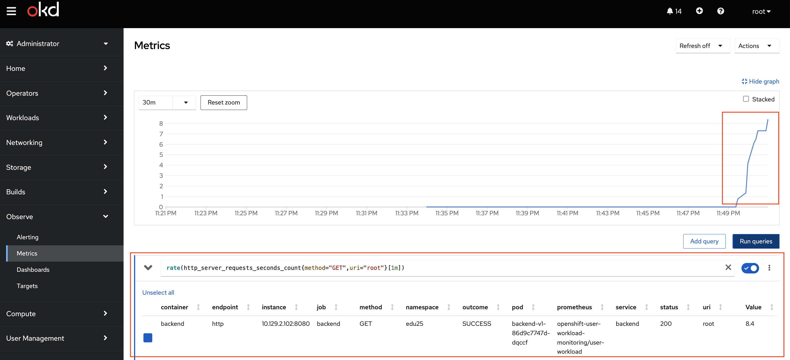

<br/>

Target 메뉴에서 Status를 확인한다.  

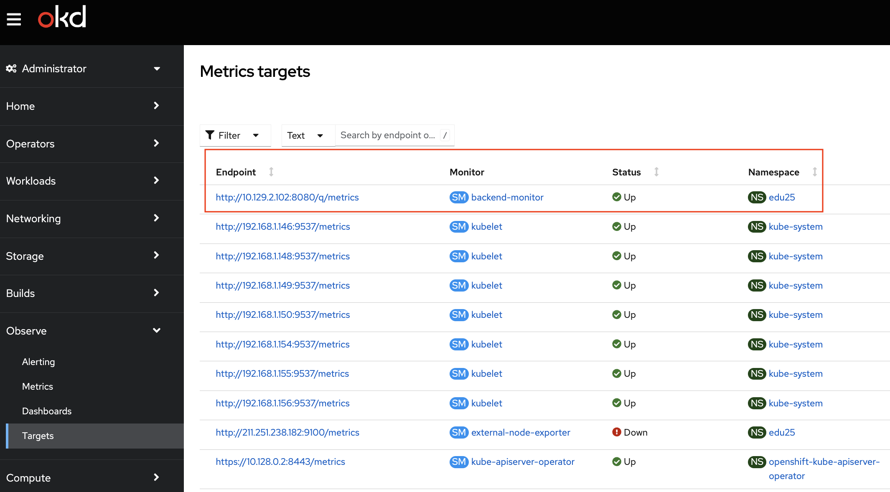


<br/>

Grafana 의 Backend App 대쉬보드에서 변화되는 metric 을 확인 할 수 있다.

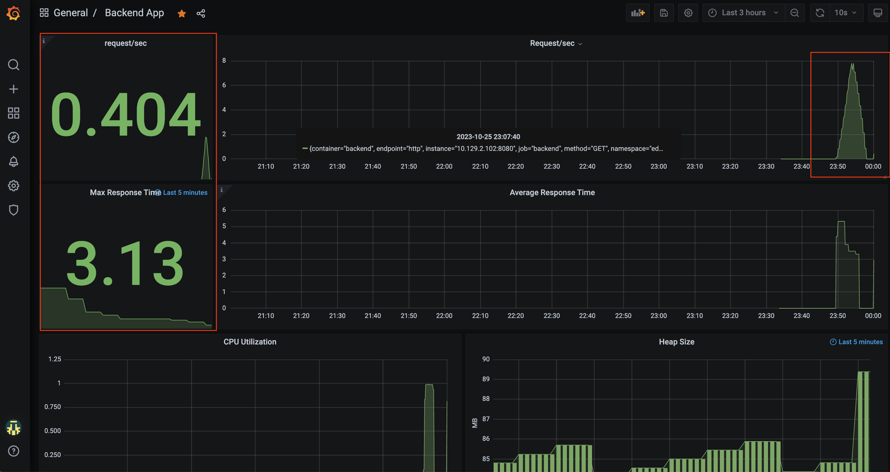

<br/>

## 6. Federation & Thanos  

<br/>


프로메테우스의 가장 큰 약점은 확장성과 가용성이다.  
프로메테우스는 클러스터가 지원되지 않는 독립형 서비스로, 프로메테우스 서버 장애시 메트릭을 수집할 수 없다는 것이다.   

프로메테우스 서버의 장애시간 또는 재설정 등으로 서버 또는 서비스가 재시작 될 동안 타켓에 대한 모니터링을 할 수 없다면 이는 서비스를 운영하는데 매우 큰 리스크이다.  이러한 문제를 해결하기 위해 여러가지 프로메테우스 서버 구성에 대한 아키텍처를 생각해 볼 수 있다.  


 <br/>

### 프로메테우스 Federation

<br/>

두 대이상의 프로메테우스 서버를 구성하여, 각 프로메테우스 서버에서 타겟 서버를 교차해서 메트릭을 수집하는 방식이다.  

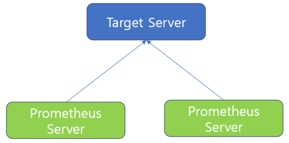

<br/>

이러한 방식으로 구성할 경우 관리 해야하는 프로메테우스 서버도 증가하지만, 모니터링 대상이 되는 타겟 서버 입장에서도 여러 프로메테우스 서버로부터 요청되는 메트릭 데이터를 수집 및 전달하기 위해 오버헤드가 발생한다.   

<br/>

또한 프로메테우스로 수집된 데이터를 분석할 때에도, 특정 시점에 장애가 번갈아 발생시, 데이터가 한쪽에만 있게 되므로 중앙에서 한번에 분석하기 불편한 단점이 있다. 

<br/>

프로메테우스 서버를 여러 대 구성하고, 프로메테우스 서버가 다른 프로메테우스 서버로 요청하여 데이터를 수집할 수 있다.  

<br/>

-  Hierarchical Federation 구성은 프로메테우스 서버 사이에 계층을 두고 Tree 형태로 Federation을 구성하는 방법이다. 부모 프로메테우스는 자식 프로메테우스들의 통합 메트릭 제공 및 통합 메트릭을 기반으로 알람을 제공하는 용도로 사용할 수 있다.  

- Cross-service Federation 구성은 동일 레벨의 프로메테우스 서버사이를 Federation으로 구성하는 방법이다.   

<br/>

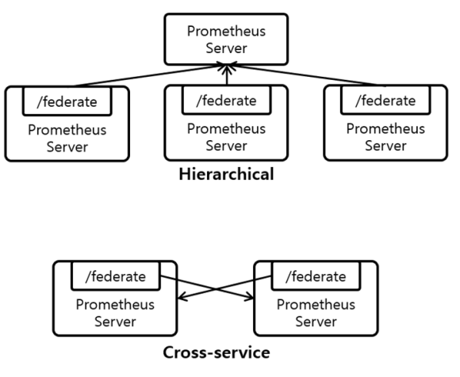  


<br/>

Federation으로 구성할 경우, 각 프로메테우스 서버는 타겟 서버로부터 일정 주기로 데이터를 수집하고 저장하고, 부모(중앙) 프로메테우스 서버는 각 프로메테우스 서버로부터 저장된 데이터를 별도의 주기로 수집할 수 있어, 데이터양이 많을 때, 평균값이나 해상도 등을 조정할 수 있다.  

<br/>

예를들면 각 프로메테우스 서버는 10초 단위로 수집하고, 중앙 프로메테우스는 1 분 단위로 하위 프로메테우스 서버로 요청하여 평균값 등을 이용할 수 있다. 하지만 각 프로메테우스 서버 장애 시 데이터 유실, 데이터 증가로 인한 중앙 프로메테우스 서버의 오버헤드 증가 문제가 있으므로 일정 규모 이상에서는 적용하기 힘든 부분이 있다.

<br/>

### Thanos

<br/>

Thanos는 프로메테우스의 확장성과 내구성을 향상 시키기 위한 오픈소스 프로젝트로, 프로메테우스의 메트릭 데이터를 분산된 원격 스토리지에 저장하고 조회할 수 있는 기능을 제공한다. 아래 그림에서 서드파티 스토리지로 데이터를 저장하기 위한 Adapter 역할이 Thanos의 기능이다.    

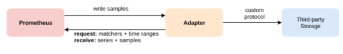    

<br/>

 - Thanos를 사용하여 구성 할 경우 아래와 같은 장점이 있다.  
 - Long-term Storage: 원격 스토리지에 데이터를 안정적으로 저장하여 장기적인 데이터 보존을 가능  
 - Global Query: 여러 원격 스토리지에서 데이터를 통합하여 조회할 수 있는 Global Query 기능을 제공하여 분산된 데이터에 대해 단일 쿼리를 실행할 수 있어 데이터 분석과 모니터링에 유용  
 - HA(고가용성): 원격 스토리지에 데이터를 복제하여 프로메테우스 서버 중 하나가 장애가 발생하더라도 데이터의 고가용성을 보장  

<br/>

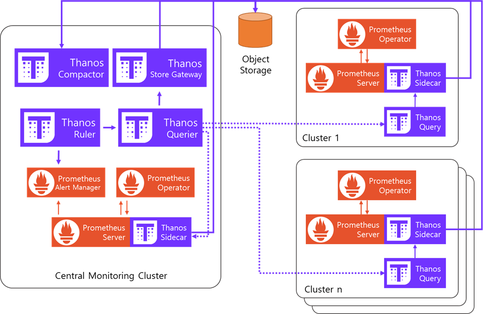    

<br/>

OKD 에는 기본적으로 Thanos 가 설치가 된다.  

`openshift-monitoring` namespace 에 가서 `prometheus-k8s-0` pod를 선택하면 아래에 6개의 container 가 보이고 `thanos-sidecar` 를 확인 할 수 있다.  

<br/>

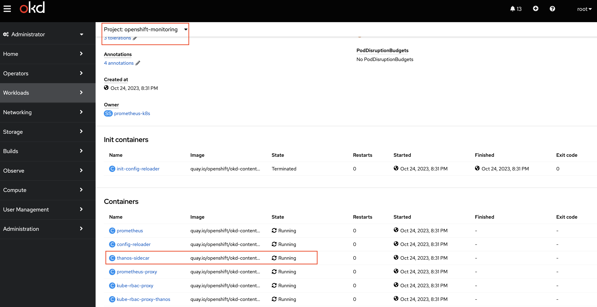    


<br/>

### 실습   


<br/>

namespace 별 pod 갯수 세기 를 Thanos에서 해봅니다.  

아래 구문은 우리가 사용한 PromQL 입니다.    
- PromQL: `sum(kube_pod_info) by (namespace)`
- `kube_pod_info`는 kubernetes-exporter를 통해 수집되는 metric  

<br/>

TOKEN 값과 THANOS_HOST를 찾습니다.  

```bash
[root@bastion monitoring]# SECRET=`oc get secret -n openshift-user-workload-monitoring | grep  prometheus-user-workload-token | head -n 1 | awk '{print $1 }'`
[root@bastion monitoring]# TOKEN=`echo $(oc get secret $SECRET -n openshift-user-workload-monitoring -o json | jq -r '.data.token') | base64 -d`
[root@bastion monitoring]# THANOS_HOST=`oc get route thanos-querier -n openshift-monitoring -o json | jq -r '.spec.host'`
```  

<br/>

query 는 URL-encoding 형태로 가공이 필요 하여 중간에 --data-urlencode 를 사용합니다.  

<br/>

```bash
[root@bastion monitoring]# curl -X GET -kG "https://$THANOS_HOST/api/v1/query?" --data-urlencode "query=sum(kube_pod_info) by (namespace)" -H "Authorization: Bearer $TOKEN"
```    

<br/>

Thanos에 접속하여 namespace 별 pod 갯수를 가져 왔습니다.  

Output
```bash
{"status":"success","data":{"resultType":"vector","result":[{"metric":{"namespace":"openshift-etcd"},"value":[1694754323.376,"4"]},{"metric":{"namespace":"openshift-kube-apiserver"},"value":[1694754323.376,"9"]},{"metric":{"namespace":"openshift-kube-controller-manager"},"value":[1694754323.376,"6"]},{"metric":{"namespace":"openshift-kube-scheduler"},"value":[1694754323.376,"6"]},{"metric":{"namespace":"openshift-marketplace"},"value":[1694754323.376,"8"]},{"metric":{"namespace":"edu1"},"value":[1694754323.376,"4"]},{"metric":{"namespace":"edu2"},"value":[1694754323.376,"8"]},{"metric":{"namespace":"minio"},"value":[1694754323.376,"2"]},{"metric":{"namespace":"shclub"},"value":[1694754323.376,"9"]},{"metric":{"namespace":"openshift-dns"},"value":[1694754323.376,"6"]},{"metric":{"namespace":"openshift-ingress-canary"},"value":[1694754323.376,"3"]},{"metric":{"namespace":"openshift-machine-config-operator"},"value":[1694754323.376,"6"]},{"metric":{"namespace":"openshift-multus"},"value":[1694754323.376,"10"]},{"metric":{"namespace":"openshift-network-diagnostics"},"value":[1694754323.376,"4"]},{"metric":{"namespace":"openshift-image-registry"},"value":[1694754323.376,"7"]},{"metric":{"namespace":"openshift-monitoring"},"value":[1694754323.376,"13"]},{"metric":{"namespace":"openshift-sdn"},"value":[1694754323.376,"4"]},{"metric":{"namespace":"openshift-cluster-node-tuning-operator"},"value":[1694754323.376,"4"]},{"metric":{"namespace":"haerin"},"value":[1694754323.376,"1"]},{"metric":{"namespace":"openshift-operator-lifecycle-manager"},"value":[1694754323.376,"7"]},{"metric":{"namespace":"etcd-backup"},"value":[1694754323.376,"3"]},{"metric":{"namespace":"openshift-oauth-apiserver"},"value":[1694754323.376,"1"]},{"metric":{"namespace":"openshift-apiserver"},"value":[1694754323.376,"1"]},{"metric":{"namespace":"argo-rollouts"},"value":[1694754323.376,"1"]},{"metric":{"namespace":"argocd"},"value":[1694754323.376,"7"]},{"metric":{"namespace":"openshift-authentication-operator"},"value":[1694754323.376,"1"]},{"metric":{"namespace":"openshift-cloud-credential-operator"},"value":[1694754323.376,"1"]},{"metric":{"namespace":"openshift-machine-api"},"value":[1694754323.376,"4"]},{"metric":{"namespace":"openshift-cloud-controller-manager-operator"},"value":[1694754323.376,"1"]},{"metric":{"namespace":"openshift-cluster-samples-operator"},"value":[1694754323.376,"1"]},{"metric":{"namespace":"openshift-cluster-storage-operator"},"value":[1694754323.376,"4"]},{"metric":{"namespace":"openshift-cluster-version"},"value":[1694754323.376,"1"]},{"metric":{"namespace":"openshift-console"},"value":[1694754323.376,"2"]},{"metric":{"namespace":"openshift-console-operator"},"value":[1694754323.376,"1"]},{"metric":{"namespace":"openshift-controller-manager"},"value":[1694754323.376,"1"]},{"metric":{"namespace":"openshift-dns-operator"},"value":[1694754323.376,"1"]},{"metric":{"namespace":"openshift-etcd-operator"},"value":[1694754323.376,"1"]},{"metric":{"namespace":"openshift-user-workload-monitoring"},"value":[1694754323.376,"5"]},{"metric":{"namespace":"openshift-ingress-operator"},"value":[1694754323.376,"1"]},{"metric":{"namespace":"openshift-insights"},"value":[1694754323.376,"1"]},{"metric":{"namespace":"openshift-kube-apiserver-operator"},"value":[1694754323.376,"1"]},{"metric":{"namespace":"openshift-kube-controller-manager-operator"},"value":[1694754323.376,"1"]},{"metric":{"namespace":"openshift-kube-storage-version-migrator-operator"},"value":[1694754323.376,"1"]},{"metric":{"namespace":"openshift-operators"},"value":[1694754323.376,"1"]},{"metric":{"namespace":"openshift-cluster-machine-approver"},"value":[1694754323.376,"1"]},{"metric":{"namespace":"openshift-kube-storage-version-migrator"},"value":[1694754323.376,"1"]},{"metric":{"namespace":"harbor"},"value":[1694754323.376,"9"]},{"metric":{"namespace":"edu5"},"value":[1694754323.376,"2"]},{"metric":{"namespace":"openshift-network-operator"},"value":[1694754323.376,"1"]},{"metric":{"namespace":"openshift-authentication"},"value":[1694754323.376,"1"]},{"metric":{"namespace":"openshift-apiserver-operator"},"value":[1694754323.376,"1"]},{"metric":{"namespace":"openshift-config-operator"},"value":[1694754323.376,"1"]},{"metric":{"namespace":"openshift-controller-manager-operator"},"value":[1694754323.376,"1"]},{"metric":{"namespace":"openshift-kube-scheduler-operator"},"value":[1694754323.376,"1"]},{"metric":{"namespace":"openshift-route-controller-manager"},"value":[1694754323.376,"1"]},{"metric":{"namespace":"openshift-ingress"},"value":[1694754323.376,"1"]},{"metric":{"namespace":"openshift-service-ca"},"value":[1694754323.376,"1"]},{"metric":{"namespace":"openshift-service-ca-operator"},"value":[1694754323.376,"1"]}]}}
```  


<br/>

추가적으로 보기 편하도록 파이썬 모듈인 json.tool을 사용할 수 있다.

```bash
[root@bastion monitoring]# curl -X GET -kG "https://$THANOS_HOST/api/v1/query?" --data-urlencode "query=sum(kube_pod_info) by (namespace)" -H "Authorization: Bearer $TOKEN" | python3  -m json.tool
  % Total    % Received % Xferd  Average Speed   Time    Time     Time  Current
                                 Dload  Upload   Total   Spent    Left  Speed
100  4749    0  4749    0     0  96918      0 --:--:-- --:--:-- --:--:-- 96918
{
    "status": "success",
    "data": {
        "resultType": "vector",
        "result": [
            {
                "metric": {
                    "namespace": "openshift-etcd"
                },
                "value": [
                    1694651859.101,
                    "4"
                ]
            },
            {
                "metric": {
                    "namespace": "openshift-kube-apiserver"
                },
                "value": [
                    1694651859.101,
                    "9"
                ]
            },
            {
                "metric": {
                    "namespace": "openshift-kube-controller-manager"
                },
                "value": [
                    1694651859.101,
                    "6"
                ]
            },
            {
                "metric": {
                    "namespace": "openshift-kube-scheduler"
                },
                "value": [
                    1694651859.101,
                    "6"
                ]
            },
...            
```  

<br/>

## 7. prometheus 내부 구조

<br/>

prometheus 의 폴더 구조는 아래와 같으며, 내부적으로 TSDB 를 사용한다.

```bash
prometheus
|-- 012345ABCDEF  -> 블록 Chunk 및 기타 메타데이터
|   |-- chunks
|   |   `-- 000001 -> 블록 Chunk 파일
|   |-- index      -> 색인을 위한 라벨 및 시간 inverted index 파일
|   |-- meta.json
|   `-- tombstones -> 삭제 여부를 나타내는 파일
|-- 012345ABCDEF
|-- 012345ABCDEF
|-- chunks_head
|-- lock -> 여러개의 prometheus 실행 방지를 위한 lock file
|-- queries.active -> 현재 실행 중인 쿼리를 저장. 쿼리 중 crash 시 확인 용도
`-- wal -> WAL (write ahead logging) 파일
	|-- 0000003
    |-- 0000004
    `-- checkpoint.0000002 -> 프로메테우스가 crash날 경우 복구를 위한 체크포인트 지점
        `-- 000000
```  

<br/>

prometheus 가 데이터를 저장하는 방식에는 크게 두가지가 존재한다

<br/>

- local file system: 일반적인 chunk 블록 파일  
- In memory: WAL (Write Ahead Logging) 파일 & 인메모리 버퍼  

<br/>

InfluxDB같은 DB와는 달리, 프로메테우스는 레코드를 수집하고 나서 해당 레코드 데이터를 즉시 스토리지에 저장하지 않는다. 일단 들어온 데이터를 인메모리 버퍼에 잔뜩 들고 있다가, 새로 들어온 레코드가 현재 메모리 페이지의 크기를 32KB가 넘어가게 만드는 경우 현재 페이지를 WAL 파일에 Flush 한다. 즉, 일차적으로 데이터를 메모리에 저장하는 것을 원칙으로 하되, 나름 주기적으로 WAL 파일에 백업하는 셈이다. 이렇게 저장되는 데이터 공간 (?) 을 일반적으로 "Head Block" 이라고 부른다.  

<br/>

Head Block의 데이터가 백업되는 WAL 파일은 최대 128MB를 차지할 수 있으며, 128MB가 넘을 경우 새로운 WAL 파일이 생성된다. 이 WAL 파일은 인메모리 데이터의 손실을 방지하기 위한 것인데, 프로메테우스가 비정상적으로 종료되는 crash가 발생할 경우 현재 존재하는 WAL을 다시 읽어들여 원래의 데이터를 복구하는 replay 작업을 수행한다 이 때, WAL 파일을 다시 읽어들이는 기준점은 wal 디렉터리에 존재하는 checkpoint.XXXXX가 된다.

<br/>

참고로 네트워크 스토리지를 쓰게 되면 checkpoint나 WAL 파일이 깨지는 corruption이 발생할 수도 있는데, 그러면 굉장히 골치아파진다. 프로메테우스의 재시작이 계속해서 실패할 수도 있고, 새로운 chunk 블록이 생성이 되지 않아서 이상하게 꼬여버릴 수도 있다.

<br/>

### TSDB의 읽기 쓰기

<br/>

일반적인 TSDB 데이터베이스를 살펴 보면 세로 축은 시계열, 가로 축은 타임 스탬프가 있는 sample 시퀀스입니다.  

Prometheus에는 일반적으로 샘플 데이터가 수백만 개가 있으며 기간은 몇 주 단위입니다.  


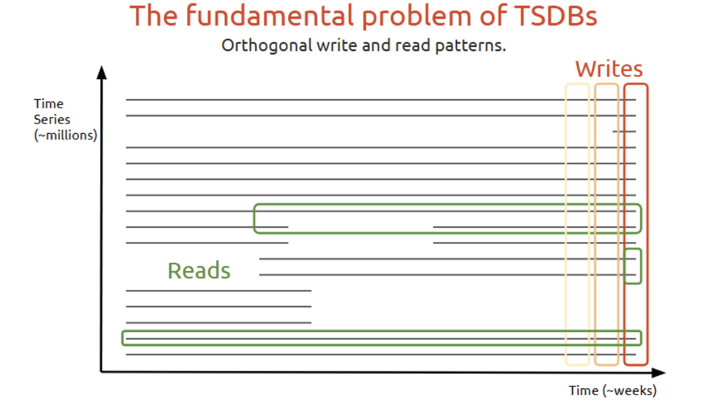


<br/>

- 쓰기 : 짧은 시간에 많은 시계열에 sample을 추가합니다. 일반적으로 쓰기만 사용합니다.
         그러나 어느 시점에서 이전 데이터를 자르거나 download 할 수 있습니다.
         위 예에서는 빨간 부분의 세로로 사용.

- 읽기 : 상대적으로 긴 시간 동안 상대적으로 적은 시계열 (가장 일반적으로 하나)에서 sample을 읽습니다.
         이는 쓰기 패턴과 정확히 수직이므로 TSDB를 올바르게 설정하기가 어렵습니다.
         예외가 있지만 대체로 많은 비용이 드는 쿼리는 시계열에 따른 쿼리입니다.
         위 예에서는 녹색 부분의 가로로 사용.

  *sample : 수집된 데이터


<br/>

### prometheus 내부 저장소

<br/>

prometheus는 in-memory에 자체 sample storage 레이어를 사용합니다.
그리고 하위 저장소로 파일 시스템과 Level DB를 사용합니다. (초기 버전에서는 sample 저장에도 Level DB를 사용)  

Level DB는 Google에서 만든 light-weight의 Key-value 저장소이며, 전반적으로 뛰어난 성능을 보이기에 여러곳에서 사용합니다.
Level DB는 기본적으로 압축을 지원합니다.  

<br/>

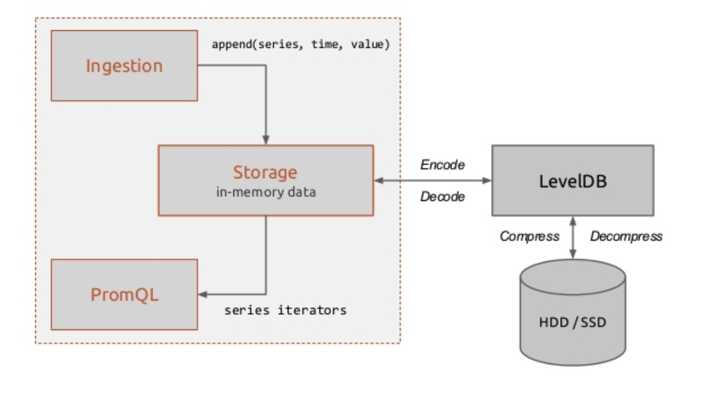


<br/>

### prometheus 데이터 구조

<br/>

시계열 데이터를 처리하기위한 기본 데이터 구조는 다음과 같이 정의 됩니다.

```bash
type sample struct {
        Labels map[string]string
        Value  float64
}
```
 
<br/>

prometheus의 메트릭은 다음과 같이 수집됩니다.


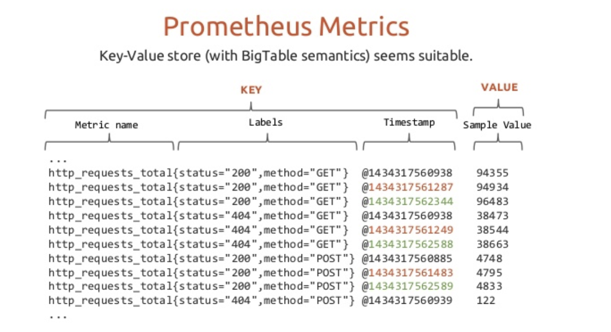

<br/>

메트릭명{필드1=값, 필드2=값} 샘플링데이터

<br/>

많은 수의 metric이 발생을 하게 되고, 이를 text/html 방식으로 특정 url(대부분 /metrics)로 export를 해두게 되면, prometheus 서버가 이를 긁어가서 데이터를 저장합니다.   


metric 이름이 제일 먼저 나오고, metric의 특징을 표현하는 레이블(label)들이 있습니다. 그리고 가장 마지막으로는 metric 값(value)이 있습니다.
필요에 따라 timestamp도 표시될 수 있다. timestamp를 보통 출력하지 않는데, 그 이유는 수집하는 순간의 시간으로 값이 기록되기 때문입니다.

<br/>

참고 : https://jjon.tistory.com/m/entry/prometheus-%EB%8D%B0%EC%9D%B4%ED%84%B0-%EA%B5%AC%EC%A1%B0


<br/>

## 참고 자료

<br/>

- Application Metric Test : https://github.com/rhthsa/openshift-demo/blob/main/application-metrics.md  

- [Spring] 프로메테우스 (prometheus)  ( 에전에 내가  썻던것 ) : https://hyuuny.tistory.com/220

- Node Exporter : https://devocean.sk.com/blog/techBoardDetail.do?ID=163266  


- metric 수집 : https://gist.github.com/christophlehmann/b1bbf2821a876c7f91d8eec3b6788f24  


-  Prometheus로 Kubernetes 클러스터 모니터링 : https://velog.io/@hyunshoon/Monitoring-Prometheus로-Kubernetes-클러스터-모니터링   

- Prometheus Journey : https://youtu.be/_bI_WcBc4ak?si=QoZMNBRKGDhTxLjn      

- Prometheus helm 설치와 Operator : https://youtu.be/qHIgk547SVA?si=8_f0gBHVEQPxHFOr    

- Prometheus Exporter 예제 : https://youtu.be/iJyC6A38qwY?si=d3HQ5PDU-pDUGYq1      

- Prometheus ServiceMonitor 실습 : https://jerryljh.medium.com/prometheus-servicemonitor-98ccca35a13e  

- Kubernetes MultiCluster 환경에서 Prometheus metric 데이터 수집하기 : https://ksr930.tistory.com/m/299   

- https://itnext.io/prometheus-kubernetes-endpoints-monitoring-with-blackbox-exporter-a027ae136b8d  

- Node Exporter 과제 :  https://www.justinpolidori.it/posts/20210829_monitor_external_services_with_promethues_outside_kubernetes/   

- Node Exporter : https://ksr930.tistory.com/m/116  

- kubernetes 리소스 메트릭 얻기 (prometheus, kube-state-metric, metric-server)
: https://jmholly.tistory.com/m/entry/prometheus%EC%99%80-k8s-metric-server-%EB%B9%84%EA%B5%90  


- [k8s]시작하세요! 도커/쿠버네티스(kubernetes) - 쿠버네티스 모니터링(metrics-server, kube-state-metrics, node-exporter, prometheus, grafana) : https://ihp001.tistory.com/249

- Host Network : https://xn--vj5b11biyw.kr/306  

- promethues 데이터 구조 : https://jjon.tistory.com/m/entry/prometheus-%EB%8D%B0%EC%9D%B4%ED%84%B0-%EA%B5%AC%EC%A1%B0

<br/>

### Federation & Thanos

<br/>

- https://blog.naver.com/PostView.naver?blogId=sqlmvp&logNo=223140909135&categoryNo=0&parentCategoryNo=88&viewDate=&currentPage=1&postListTopCurrentPage=1&from=search


- https://tech.osci.kr/%EC%8B%9C%EC%8A%A4%ED%85%9C-%EC%9A%B4%EC%98%81-%ED%99%98%EA%B2%BD%EC%9D%98-%EC%9D%B8%ED%94%84%EB%9D%BC-%EB%AA%A8%EB%8B%88%ED%84%B0%EB%A7%81prometheus/  

- https://devocean.sk.com/blog/techBoardDetail.do?ID=164488  

- https://ksr930.tistory.com/m/313  
- https://kmaster.tistory.com/109  

- minio 사용 하기 : https://devocean.sk.com/blog/techBoardDetail.do?page=&boardType=undefined&query=&ID=164946&searchData=&subIndex=


