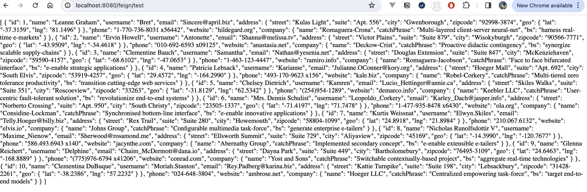

# Openfeign

Opefeign 를 통해 마이크로 서비스간의 호출 관계를 이해한다.

<br/>

1. Openfeign 이란

2. FeignClient 사용법

3. 참고

<br/>


## 1. Openfeign 이란 

<br>

이전에는 서비스 간 통신에서 RestTemplate를 통하여 동기구조로 호출을 하였지만 해당 서비스는 deprecated 되었습니다.    

FeignClient란 Netflix에서 최초로 개발된 선언적 HTTP 클라이언트이고 Hystrix 와 RestTemplate이 합쳐친 구조 라고 이해하면 된다.  


기존에는 Spring Cloud Netflix Feign 였으나, 현재는 오픈소스 프로젝트인 OpenFeign로 변경되었는데, OpenFeign가 Spring Cloud OpenFeign에 통합되면서 SpringMVC 어노테이션에 대한 지원 및 HttpMessageConverters를 사용할 수 있게 되었습니다.    

FeignClient는 HTTP API 클라이언트를 단순화하는 것을 목표로 하며
실제로 인터페이스를 만들고 어노테이션을 적용하는 간단한 방법으로 사용할 수 있으며, 적용해 보시면 Spring Data JPA에서 interface만 정의해서 쿼리를 실행하는 것과 비슷한 느낌입니다.  

<br/>

> MSA(MicroServiceArchitecture)의 서비스들이 많아지면서 각각의 서비스들 사이에 통신이 많아지게 되었는데, 이때 FeignClient를 도입하면 RestTemplate를 사용하던 방식을 조금 더 편리하게 사용할 수 있으며, 코드상으로도 중복되는 부분을 줄일 수 있다는 장점이 있습니다.  

<br/>

> MSA는 복잡한 웹 시스템에 맞춰 개발된 API 기반의 서비스 지향적 아키텍처 스타일로, 서비스 간 호출 시 API를 사용하기 때문에 통신이 많아지게 됩니다.


<br/>

## 2. FeignClient 사용법  

<br/>

### 의존성 추가

<br/>

 Spring Boot 3.2.1 를 지원하는 openfeign 버전을 사용한다.

```yaml
<dependency>
    <groupId>org.springframework.cloud</groupId>
    <artifactId>spring-cloud-starter-openfeign</artifactId>
    <version>4.1.0</version>
</dependency>
```  

<br/>

circuitbreaker 사용시 라이브러리 추가    

```yaml
		<dependency>
			<groupId>org.springframework.cloud</groupId>
			<artifactId>spring-cloud-starter-circuitbreaker-resilience4j</artifactId>
			<version>3.1.0</version>
		</dependency>
```  

<br/>

### `@EnableFeignClients` annotation 추가

<br/>

FeignClient를 사용하기 위해서는 @EnableFeignClients 어노테이션을 필수로 적용해야 합니다.  

일반적으로 해당 어노테이션은 메인 애플리케이션 클래스에 설정하는데요. 이 어노테이션은 하위 클래스를 탐색하면서 @FeignClient를 찾아 구현체를 생성하는 역할을 합니다.  

<br/>

> basePackages 또는 basePackageClasses 속성을 통해 탐색할 범위를 설정할 수 있습니다.

```java
@EnableEncryptableProperties
@EnableCaching
@SpringBootApplication
@EnableFeignClients
@ComponentScan("com.kt")
public class ThirdprojectApplication {

	public static void main(String[] args) {
		SpringApplication.run(ThirdprojectApplication.class, args);
	}

}
```  

<br/>

### 인터페이스 생성

<br/>

인터페이스를 생성하고 `@FeignClient` 어노테이션을 설정합니다.  

name 속성에는 페인 클라이언트의 이름을 설정하고, url 속성에는 호출할 api의 url을 설정합니다.

configuration에 대해서는 바로 이어서 조금 더 자세하게 살펴보겠습니다.


EduFeignClient.java  
```java
@FeignClient(name="edu", url="${api.edu.url}")
//@FeignClient(name="edu", url="https://jsonplaceholder.typicode.com",configuration = FeignConfig.class)
public interface EduFeignClient {

    @GetMapping(path = "/users", produces = "application/json")
    public String getUsers();

    @PostMapping(path = "/api/v1/employees", consumes = "application/json")
    public ResponseEntity<EmployeeEntity> EmployeeCreate(@RequestBody EmployeeEntity employeeEntity);


}
```  

<br/>

### Configuration 설정

<br/>

 
FeignClient 에서는 기본적으로 설정되는 Bean들이 있기 때문에 별도의 Configuration을 설정하지 않아도 사용하는 데는 문제가 없음

- 해당 내용은 org.springframework.cloud.openfeign.FeignClientsConfiguration 클래스에서 볼 수 있습니다.

<br/>

기본적으로 제공되는 Bean은 Encoder, Decoder, Logger, Contract, Retryer 등이 있으며, 재요청을 하는 Retryer 같은 경우에는 default 옵션이 Retryer.NEVER_RETRY로 재요청이 비활성화되어 있습니다.  

<br/>

FeignConfig.java  
```java
@Configuration
public class FeignConfig {
    @Bean
    @ConditionalOnMissingBean
    public Retryer feignRetryer() {
        return Retryer.NEVER_RETRY;
    }

}
```    

<br/>

### `application.yml` 설정

<br/>

feign 에 대한 Global 설정을 한다.  별도 설정을 하지 않으면 default 설정이 적용이 된다.  

```yaml
# openfeign
cloud
  openfeign:
    circuitbreaker:
      enabled: true # circuitbreak 사용시 추가
    client:
      config:
        default:
          #logger-level: full
          connectTimeout: 5000  # feign의 전역 timeout 설정 : 5초
          readTimeout: 5000
          loggerLevel: FULL ##basic
``` 

<br/>

`application-local.yml` 에 로컬 설정을 합니다.    

```yaml
#feign api
api:
  edu.url: https://jsonplaceholder.typicode.com # http://localhost:8081/
```  

<br/>

### Test

<br/>

service 와 controller를 생성한다.  

FeignTestService.java
```bash
@Service
public class FeignTestService {
    @Autowired
    EduFeignClient eduFeignClient;

    public String getUsers() {
        return eduFeignClient.getUsers(); # feign client에서 method를 호출 한다.
    }
}
```

<br/>

FeignTestController.java
```bash
@RestController
public class FeignTestController {

    @Autowired
    private  FeignTestService feignTestService;

    @GetMapping("/feign/test")
    public String getUsers() {
        return feignTestService.getUsers();
    }
}
```

<br/>

`SecurityConfig.java` 에서 `/feign/test` 보안 예외 설정을 한다.  

<br/>

SpringBoot를 기동하고 웹브라우저 에서 서비스를 호출 해본다.  



<br/>

정상적으로 호출 되는 것을 확인 할 수 있다.  

<br/>

## 3. 참고

<br/>

https://wildeveloperetrain.tistory.com/m/172

