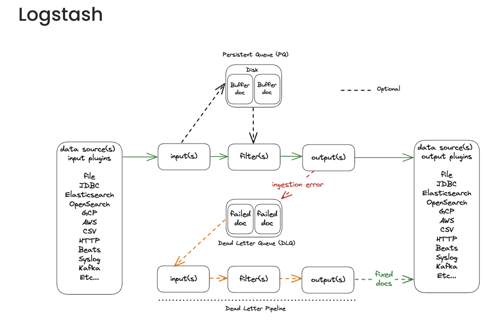
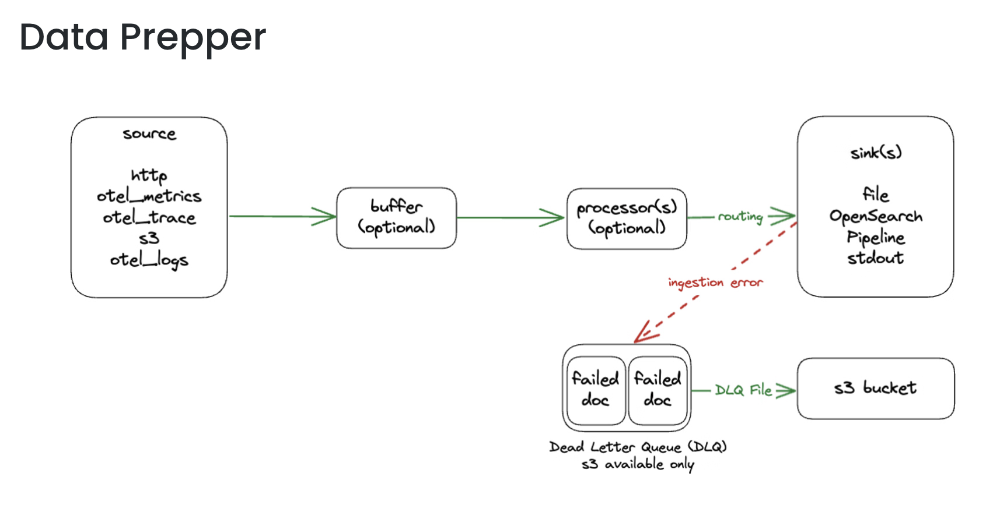
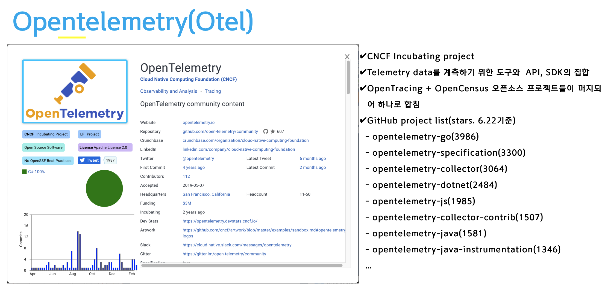
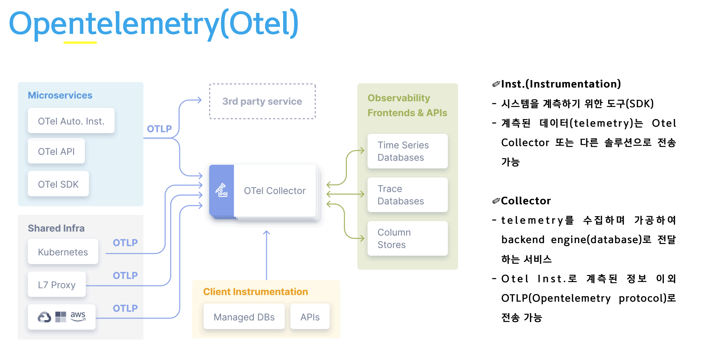
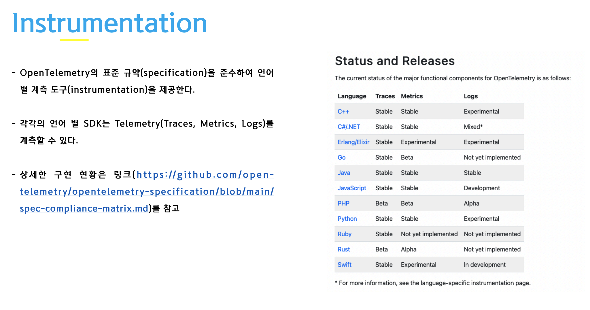

# Opensearch 

Opensearch 와 Opentelemetry를 통한 로그 수집 아키텍처를 이해한다.  

<br/>


1. Opensearch 소개

2. Opensearch 설정

3. OpenTelemetry 소개

4. OpenTelemetry 설정

5. Otel 를 통한 데이터 수집 및 모니터링 실습


<br/>

## 1. Opensearch 소개

<br>

Opensearch vs Elastic 차이  

- Elastic Stack 7.10.2 버전을 AWS에서 Fork하여 OpenSearch 로 오픈소스화. 그 이후 버전 (7.11 부터) 은 SSPL (Server Side
Public License )  


<br/>

오픈서치 History : https://www.megazone.com/techblog-opensource-introducing-opensearch/  


<br/>

기능 설명   
-  https://velog.io/@skybluelee/OpenSearch    

Opensearch and OTEL 설명
- https://itstarter.tistory.com/782  


<br/>


## 2. Opensearch 설정


<br/>

참고   
- https://medium.com/@erikstrm_11611/demystify-opentelemetry-with-opensearch-as-a-single-plane-of-glass-919f884eb568   

- https://velog.io/@sosimina/data-prepper

<br/>

Elastic Stack은 주로 Logstash 를 사용을 하고 opensearch는 Data Prepper를 이용한다.   




<br/>



<br/>

먼저 데이터를 수집하고 Opensearch 로 보내기 위한 Data Prepper를 설정합니다.  
configmap 을 생성하기 위한 yaml 화일을 만든다.  

```bash
[root@bastion opensearch]# cat data_prepper_config.yaml
apiVersion: v1
kind: ConfigMap
metadata:
  labels:
    app: data-prepper
  name: data-prepper-config
data:
  pipelines.yaml: |
    otel-logs-pipeline:
      workers: 5
      delay: 10
      source:
        otel_logs_source:
          ssl: false
      buffer:
        bounded_blocking:
      sink:
        - opensearch:
            hosts: ["https://opensearch-cluster-master:9200"]
            username: "admin"
            password: "admin"
            insecure: true
            index_type: custom
            index: events-%{yyyy.MM.dd}
            #max_retries: 20
            bulk_size: 4
    otel-trace-pipeline:
      # workers is the number of threads processing data in each pipeline.
      # We recommend same value for all pipelines.
      # default value is 1, set a value based on the machine you are running Data Prepper
      workers: 8
      # delay in milliseconds is how often the worker threads should process data.
      # Recommend not to change this config as we want the otel-trace-pipeline to process as quick as possible
      # default value is 3_000 ms
      delay: "100"
      source:
        otel_trace_source:
          ssl: false # Change this to enable encryption in transit
      buffer:
        bounded_blocking:
          # buffer_size is the number of ExportTraceRequest from otel-collector the data prepper should hold in memeory.
          # We recommend to keep the same buffer_size for all pipelines.
          # Make sure you configure sufficient heap
          # default value is 12800
          buffer_size: 25600
          # This is the maximum number of request each worker thread will process within the delay.
          # Default is 200.
          # Make sure buffer_size >= workers * batch_size
          batch_size: 400
      sink:
        - pipeline:
            name: "raw-traces-pipeline"
        - pipeline:
            name: "otel-service-map-pipeline"
    raw-traces-pipeline:
      workers: 5
      delay: 3000
      source:
        pipeline:
          name: "otel-trace-pipeline"
      buffer:
        bounded_blocking:
          buffer_size: 25600 # max number of records the buffer accepts
          batch_size: 400 # max number of records the buffer drains after each read
      processor:
        - otel_trace_raw:
        - otel_trace_group:
            hosts: [ "https://opensearch-cluster-master:9200" ]
            insecure: true
            username: "admin"
            password: "admin"
      sink:
        - opensearch:
            hosts: ["https://opensearch-cluster-master:9200"]
            username: "admin"
            password: "admin"
            insecure: true
            index_type: trace-analytics-raw
    otel-service-map-pipeline:
      workers: 5
      delay: 3000
      source:
        pipeline:
          name: "otel-trace-pipeline"
      processor:
        - service_map_stateful:
            # The window duration is the maximum length of time the data prepper stores the most recent trace data to evaluvate service-map relationships.
            # The default is 3 minutes, this means we can detect relationships between services from spans reported in last 3 minutes.
            # Set higher value if your applications have higher latency.
            window_duration: 180
      buffer:
          bounded_blocking:
            # buffer_size is the number of ExportTraceRequest from otel-collector the data prepper should hold in memeory.
            # We recommend to keep the same buffer_size for all pipelines.
            # Make sure you configure sufficient heap
            # default value is 12800
            buffer_size: 25600
            # This is the maximum number of request each worker thread will process within the delay.
            # Default is 200.
            # Make sure buffer_size >= workers * batch_size
            batch_size: 400
      sink:
        - opensearch:
            hosts: ["https://opensearch-cluster-master:9200"]
            username: "admin"
            password: "admin"
            insecure: true
            index_type: trace-analytics-service-map
            #index: otel-v1-apm-span-%{yyyy.MM.dd}
            #max_retries: 20
            bulk_size: 4
    otel-metrics-pipeline:
      workers: 8
      delay: 3000
      source:
        otel_metrics_source:
          health_check_service: true
          ssl: false
      buffer:
        bounded_blocking:
          buffer_size: 1024 # max number of records the buffer accepts
          batch_size: 1024 # max number of records the buffer drains after each read
      processor:
        - otel_metrics:
            calculate_histogram_buckets: true
            calculate_exponential_histogram_buckets: true
            exponential_histogram_max_allowed_scale: 10
            flatten_attributes: false
      sink:
        - opensearch:
            hosts: ["https://opensearch-cluster-master:9200"]
            username: "admin"
            password: "admin"
            insecure: true
            index_type: custom
            index: metrics-%{yyyy.MM.dd}
            #max_retries: 20
            bulk_size: 4
  data-prepper-config.yaml: |
    ssl: false
    circuit_breakers:
      heap:
        usage: 2gb
        reset: 30s
        check_interval: 5s
```


<br/>

service 와 deployment 를 생성하기 위한 yaml 화일을 만든다.     


```bash
[root@bastion opensearch]# cat data_prepper_manifest.yaml
apiVersion: v1
kind: Service
metadata:
  labels:
    app: data-prepper
  name: data-prepper
spec:
  type: ClusterIP
  ports:
    - name: otel-traces
      port: 21890
      targetPort: 21890
    - name: otel-metrics
      port: 21891
      targetPort: 21891
    - name: otel-logs
      port: 21892
      targetPort: 21892
    - name: api
      port: 4900
      targetPort: 4900
  selector:
    app: data-prepper
---
apiVersion: apps/v1
kind: Deployment
metadata:
  labels:
    app: data-prepper
  name: data-prepper
spec:
  replicas: 1
  selector:
    matchLabels:
      app: data-prepper
  template:
    metadata:
      labels:
        app: data-prepper
    spec:
      containers:
        - image: opensearchproject/data-prepper:2.3.0
          name: data-prepper
          ports:
            - containerPort: 21890
            - containerPort: 21891
            - containerPort: 21892
          resources:
            requests:
              memory: "2000Mi"
              cpu: "500m"
            limits:
              memory: "3000Mi"
              cpu: "500m"
          volumeMounts:
            - name: prepper-configmap-config
              mountPath: /usr/share/data-prepper/config/data-prepper-config.yaml
              subPath: data-prepper-config.yaml
            - name: prepper-configmap-pipelines
              mountPath: /usr/share/data-prepper/pipelines/pipelines.yaml
              subPath: pipelines.yaml
      restartPolicy: Always
      serviceAccountName: ""
      volumes:
        - name: prepper-configmap-config
          configMap:
            name: data-prepper-config
            items:
              - key: data-prepper-config.yaml
                path: data-prepper-config.yaml
        - name: prepper-configmap-pipelines
          configMap:
            name: data-prepper-config
            items:
              - key: pipelines.yaml
                path: pipelines.yaml
```  


<br/>

생성한 yaml 화일을 적용한다.  

<br/>

```bash
[root@bastion opensearch]# kubectl apply -f data_perpper_config.yaml -n opensearch
configmap/data-prepper-config created
[root@bastion opensearch]# kubectl apply -f data_prepper_manifest.yaml -n opensearch
service/data-prepper created
deployment.apps/data-prepper created
[root@bastion opensearch]# kubectl get svc -n opensearch
NAME                                         TYPE        CLUSTER-IP       EXTERNAL-IP   PORT(S)                                  AGE
data-prepper                                 ClusterIP   172.30.96.92     <none>        21890/TCP,21891/TCP,21892/TCP,4900/TCP   7s
opensearch-cluster-master                    ClusterIP   172.30.175.101   <none>        9200/TCP,9300/TCP                        4d14h
opensearch-cluster-master-headless           ClusterIP   None             <none>        9200/TCP,9300/TCP,9600/TCP               4d14h
opensearch-dashboard-opensearch-dashboards   ClusterIP   172.30.185.79    <none>        5601/TCP                                 4d14h
[root@bastion opensearch]# kubectl get configmap -n opensearch
NAME                               DATA   AGE
data-prepper-config                2      31s
kube-root-ca.crt                   1      4d23h
opensearch-cluster-master-config   1      4d14h
openshift-service-ca.crt           1      4d23h
[root@bastion opensearch]# kubectl get po -n opensearch
NAME                                                         READY   STATUS    RESTARTS   AGE
data-prepper-7c47579dcc-fbztw                                1/1     Running   0          3m16s
opensearch-cluster-master-0                                  1/1     Running   0          11m
opensearch-cluster-master-1                                  1/1     Running   0          11m
opensearch-cluster-master-2                                  1/1     Running   0          11m
opensearch-dashboard-opensearch-dashboards-878bcb586-v49jz   1/1     Running   0          9m54s
```

<br/>

web 브라우저에서 대쉬보드로 로그인 하고 Index Management -> Indices 로 이동하면 아래의 4개 index가 생성 된 것을 확인 할 수 있다.  


## 3. OpenTelemetry 소개

<br/>

Opentelemetry 소개  
 - https://youtu.be/4vlZ3XPeocc?si=M30M_q4C_TnwgOwu  
 - https://2023.openinfradays.kr/media/slides/6_%E1%84%92%E1%85%AA%E1%86%BC%E1%84%8B%E1%85%B5%E1%86%AB%E1%84%92%E1%85%AA%E1%86%AB-2023_%E1%84%8B%E1%85%A9%E1%84%91%E1%85%B3%E1%86%AB%E1%84%8B%E1%85%B5%E1%86%AB%E1%84%91%E1%85%B3%E1%84%85%E1%85%A1%E1%84%83%E1%85%A6%E1%84%8B%E1%85%B5%E1%84%87%E1%85%A1%E1%86%AF%E1%84%91%E1%85%AD_Otel_-_%E1%84%92%E1%85%AA%E1%86%BC%E1%84%8B%E1%85%B5%E1%86%AB%E1%84%92%E1%85%AA%E1%86%AB.pdf 

<br/>  



<br/>



<br/>



<br/>


Opentelemetry Collector   
- https://youtu.be/7T2SdvYW-eI?si=9DCpeN8fqsS91GJ6

<br/>


기존 방식 ( Fluentd + OpenSearch)
- https://velog.io/@thouy/Fluentd-OpenSearch-%EB%A1%9C%EA%B7%B8-%EB%AA%A8%EB%8B%88%ED%84%B0%EB%A7%81-%EC%8B%9C%EC%8A%A4%ED%85%9C-%EA%B5%AC%EC%B6%95%EA%B8%B0  


<br/>

## 4. OpenTelemetry 설정


<br/>

### cert-manager 설치

<br/>

```bash
[root@bastion opensearch]# helm repo add jetstack https://charts.jetstack.io
WARNING: Kubernetes configuration file is group-readable. This is insecure. Location: /root/okd4/auth/kubeconfig
"jetstack" has been added to your repositories
[root@bastion opensearch]# helm repo update
WARNING: Kubernetes configuration file is group-readable. This is insecure. Location: /root/okd4/auth/kubeconfig
Hang tight while we grab the latest from your chart repositories...
...Successfully got an update from the "jetstack" chart repository
...Successfully got an update from the "harbor" chart repository
...Successfully got an update from the "kubecost" chart repository
...Successfully got an update from the "elastic" chart repository
...Successfully got an update from the "opensearch" chart repository
...Successfully got an update from the "nfs-subdir-external-provisioner" chart repository
...Successfully got an update from the "kubescape" chart repository
...Successfully got an update from the "aspecto" chart repository
...Successfully got an update from the "bitnami" chart repository
Update Complete. ⎈Happy Helming!⎈
```  

<br/>

`cert-manager`  namespace 를 생성합니다.  

```bash
[root@bastion opensearch]# oc new-project cert-manager
Now using project "cert-manager" on server "https://api.okd4.ktdemo.duckdns.org:6443".

You can add applications to this project with the 'new-app' command. For example, try:

    oc new-app rails-postgresql-example

to build a new example application in Ruby. Or use kubectl to deploy a simple Kubernetes application:

    kubectl create deployment hello-node --image=k8s.gcr.io/e2e-test-images/agnhost:2.33 -- /agnhost serve-hostname
```  

<br/>

namespace 에 `annotations` 을   `openshift.io/node-selector: devops=true`로 설정합니다.    

```bash
[root@bastion opensearch]# kubectl edit namespace cert-manager -n cert-manager
```   

<br/>

```bash
apiVersion: v1
kind: Namespace
metadata:
  annotations:
    openshift.io/description: ""
    openshift.io/node-selector: devops=true
    openshift.io/display-name: ""
    openshift.io/requester: root
    openshift.io/sa.scc.mcs: s0:c30,c0
    openshift.io/sa.scc.supplemental-groups: 1000870000/10000
    openshift.io/sa.scc.uid-range: 1000870000/10000
```  

<br/>

해당 namespace 에 권한을 부여한다.  

```bash
[root@bastion opensearch]# oc adm policy add-scc-to-user anyuid system:serviceaccount:cert-manager:default
clusterrole.rbac.authorization.k8s.io/system:openshift:scc:anyuid added: "default"
[root@bastion opensearch]# oc adm policy add-scc-to-user privileged system:serviceaccount:cert-manager:default
clusterrole.rbac.authorization.k8s.io/system:openshift:scc:privileged added: "default"
```

<br/>

cert-manager 를 설치합니다.  

```bash
[root@bastion opensearch]# helm upgrade --install \
>   cert-manager jetstack/cert-manager \
>   --namespace cert-manager \
>   --version v1.12.0 \
>   --set installCRDs=true
WARNING: Kubernetes configuration file is group-readable. This is insecure. Location: /root/okd4/auth/kubeconfig
Release "cert-manager" does not exist. Installing it now.
NAME: cert-manager
LAST DEPLOYED: Tue Oct 10 10:49:49 2023
NAMESPACE: cert-manager
STATUS: deployed
REVISION: 1
TEST SUITE: None
NOTES:
cert-manager v1.12.0 has been deployed successfully!

In order to begin issuing certificates, you will need to set up a ClusterIssuer
or Issuer resource (for example, by creating a 'letsencrypt-staging' issuer).

More information on the different types of issuers and how to configure them
can be found in our documentation:

https://cert-manager.io/docs/configuration/

For information on how to configure cert-manager to automatically provision
Certificates for Ingress resources, take a look at the `ingress-shim`
documentation:

https://cert-manager.io/docs/usage/ingress/
[root@bastion opensearch]# kubectl get po -n cert-manager
NAME                                      READY   STATUS    RESTARTS   AGE
cert-manager-559b5d5b7d-xq5v9             1/1     Running   0          104s
cert-manager-cainjector-f5c6565d4-jw78p   1/1     Running   0          104s
cert-manager-webhook-5f44bc85f4-dhr45     1/1     Running   0          104s
```

<br/>

### OpenTelemetry Operator 설치

<br/>

참고 : https://kmaster.tistory.com/49 

<br/>


OpenSearch 설치는 해당 링크를 참고합니다.    
- https://github.com/shclub/edu/blob/master/okd4_install.md

<br/>

helm 으로 repostiory를 추가합니다.  
아래 과정은 cluster Admin 이 한번만 수행 하면 됩니다.  

```bash
[root@bastion opensearch]# helm repo add opentelemetry https://open-telemetry.github.io/opentelemetry-helm-charts
WARNING: Kubernetes configuration file is group-readable. This is insecure. Location: /root/okd4/auth/kubeconfig
"opentelemetry" has been added to your repositories
[root@bastion opensearch]# helm repo update
WARNING: Kubernetes configuration file is group-readable. This is insecure. Location: /root/okd4/auth/kubeconfig
Hang tight while we grab the latest from your chart repositories...
...Successfully got an update from the "nfs-subdir-external-provisioner" chart repository
...Successfully got an update from the "aspecto" chart repository
...Successfully got an update from the "kubescape" chart repository
...Successfully got an update from the "kubecost" chart repository
...Successfully got an update from the "jetstack" chart repository
...Successfully got an update from the "opentelemetry" chart repository
...Successfully got an update from the "opensearch" chart repository
...Successfully got an update from the "harbor" chart repository
...Successfully got an update from the "elastic" chart repository
...Successfully got an update from the "bitnami" chart repository
Update Complete. ⎈Happy Helming!⎈
```  

<br/>

설치를 진행합니다.    
 
```bash
[root@bastion opensearch]# helm upgrade --install  opentelemetry opentelemetry/opentelemetry-operator -n opensearch
WARNING: Kubernetes configuration file is group-readable. This is insecure. Location: /root/okd4/auth/kubeconfig
Release "opentelemetry" does not exist. Installing it now.
NAME: opentelemetry
LAST DEPLOYED: Tue Oct 10 11:04:48 2023
NAMESPACE: opensearch
STATUS: deployed
REVISION: 1
NOTES:
opentelemetry-operator has been installed. Check its status by running:
  kubectl --namespace opensearch get pods -l "release=opentelemetry"

Visit https://github.com/open-telemetry/opentelemetry-operator for instructions on how to create & configure OpenTelemetryCollector and Instrumentation custom resources by using the Operator.
[root@bastion opensearch]# kubectl get po -n opensearch
NAME                                                         READY   STATUS    RESTARTS   AGE
data-prepper-7c47579dcc-fbztw                                1/1     Running   0          55m
opensearch-cluster-master-0                                  1/1     Running   0          63m
opensearch-cluster-master-1                                  1/1     Running   0          63m
opensearch-cluster-master-2                                  1/1     Running   0          63m
opensearch-dashboard-opensearch-dashboards-878bcb586-v49jz   1/1     Running   0          61m
opentelemetry-opentelemetry-operator-745878dd85-gw88k        2/2     Running   0          49s
```

edu-collector 라는 service account를 생성하고 권한을 할당합니다.  

<br/>

```bash
[root@bastion opensearch]# cat opentelemetry_sa.yaml
apiVersion: v1
kind: ServiceAccount
metadata:
  labels:
    app: edu-collector
  name: edu-collector
---
apiVersion: rbac.authorization.k8s.io/v1
kind: ClusterRole
metadata:
  name: edu-collector
  labels:
    app: edu-collector
rules:
- apiGroups:
  - ""
  resources:
  - events
  - namespaces
  - namespaces/status
  - nodes
  - nodes/spec
  - pods
  - pods/status
  - replicationcontrollers
  - replicationcontrollers/status
  - resourcequotas
  - services
  verbs:
  - get
  - list
  - watch
- apiGroups:
  - apps
  resources:
  - daemonsets
  - deployments
  - replicasets
  - statefulsets
  verbs:
  - get
  - list
  - watch
- apiGroups:
  - extensions
  resources:
  - daemonsets
  - deployments
  - replicasets
  verbs:
  - get
  - list
  - watch
- apiGroups:
  - batch
  resources:
  - jobs
  - cronjobs
  verbs:
  - get
  - list
  - watch
- apiGroups:
    - autoscaling
  resources:
    - horizontalpodautoscalers
  verbs:
    - get
    - list
    - watch
---
apiVersion: rbac.authorization.k8s.io/v1
kind: ClusterRoleBinding
metadata:
  name: edu-collector
  labels:
    app: edu-collector
roleRef:
  apiGroup: rbac.authorization.k8s.io
  kind: ClusterRole
  name: edu-collector
subjects:
- kind: ServiceAccount
  name: edu-collector
  namespace: opensearch
```  

<br/>


```bash
[root@bastion opensearch]# kubectl apply -f opentelemetry_sa.yaml -n opensearch
serviceaccount/edu-collector created
clusterrole.rbac.authorization.k8s.io/edu-collector created
clusterrolebinding.rbac.authorization.k8s.io/edu-collector created
```


<br/>

참고  
- https://medium.com/@erikstrm_11611/demystify-opentelemetry-with-opensearch-as-a-single-plane-of-glass-919f884eb568  
-  https://medium.com/@dudwls96/kubernetes-%ED%99%98%EA%B2%BD%EC%97%90%EC%84%9C-opentelemetry-collector-%EA%B5%AC%EC%84%B1%ED%95%98%EA%B8%B0-d20e474a8b18  

<br/>

데이터 수집을 위한 collector를 생성한다.  

```bash
[root@bastion opensearch]# cat opentelemetry_edu_collector.yaml
apiVersion: opentelemetry.io/v1alpha1
kind: OpenTelemetryCollector
metadata:
  name: edu
spec:
  replicas: 1
  config: |
    receivers:
      k8sobjects:
        objects:
          - name: pods  # 수집할 k8S 오브젝트
            mode: pull   # 수집 방식
          - name: events
            mode: watch
      k8s_cluster:
        collection_interval: 10s
        node_conditions_to_report: [ "Ready", "MemoryPressure", "DiskPressure", "PIDPressure", "NetworkUnavailable" ]
        allocatable_types_to_report: [ "cpu", "memory", "ephemeral-storage", "storage" ]
        distribution: kubernetes
      otlp:
        protocols:
          grpc:
          http:
    exporters:
      otlp/traces:
        endpoint: data-prepper:21890
        tls:
          insecure: true
      otlp/data-prepper:
        endpoint: data-prepper:21891
        tls:
          insecure: true
      otlp/logs:
        endpoint: data-prepper:21892
        tls:
          insecure: true
    service:
      pipelines:
        traces:
          receivers: [otlp]
          exporters: [otlp/traces]
        metrics:
          receivers: [k8s_cluster]
          exporters: [otlp/data-prepper]
        logs:
          receivers: [k8sobjects]
          exporters: [otlp/logs]
```  

<br/>

```bash
[root@bastion opensearch]# kubectl apply -f opentelemetry_edu_collector.yaml -n opensearch
opentelemetrycollector.opentelemetry.io/edu created
[root@bastion opensearch]# kubectl get po -n opensearch
NAME                                                         READY   STATUS    RESTARTS   AGE
data-prepper-7c47579dcc-fbztw                                1/1     Running   0          63m
edu-collector-7c59748d4b-7wp75                               1/1     Running   0          50s
opensearch-cluster-master-0                                  1/1     Running   0          71m
opensearch-cluster-master-1                                  1/1     Running   0          71m
opensearch-cluster-master-2                                  1/1     Running   0          71m
opensearch-dashboard-opensearch-dashboards-878bcb586-v49jz   1/1     Running   0          69m
opentelemetry-opentelemetry-operator-745878dd85-gw88k        2/2     Running   0          8m55s
```  


<br/>

## 5. Otel 를 통한 데이터 수집 및 모니터링 실습

<br/>

Collector 가 설정이 잘 되었으면 Instrumentation (계측) 을 생성한다.  

```bash
[root@bastion opensearch]# cat edu_instrument.yaml
apiVersion: opentelemetry.io/v1alpha1
kind: Instrumentation
metadata:
  name: instrumentation
spec:
  exporter:
    endpoint: http://edu-collector.opensearch:4317
  propagators:
    - tracecontext
    - baggage
    - b3
  sampler:
    type: parentbased_traceidratio
    argument: "0.25"
```  

<br/>

```bash
root@edu25:~/opensearch# kubectl apply -f edu_instrument.yaml
instrumentation.opentelemetry.io/instrumentation created
root@edu25:~/opensearch# kubectl get crd
Error from server (Forbidden): customresourcedefinitions.apiextensions.k8s.io is forbidden: User "edu25" cannot list resource "customresourcedefinitions" in API group "apiextensions.k8s.io" at the cluster scope
root@edu25:~/opensearch# kubectl get instrumentation
NAME              AGE     ENDPOINT                               SAMPLER                    SAMPLER ARG
instrumentation   2m24s   http://edu-collector.opensearch:4317   parentbased_traceidratio   0.25
```  

<br/>

Deploy , Service , Route 를 생성한다.   

```bash
[root@bastion opensearch]# cat petclinic_manifest.yaml
apiVersion: apps/v1
kind: Deployment
metadata:
  name: spring-petclinic
spec:
  selector:
    matchLabels:
      app: spring-petclinic
  replicas: 1
  template:
    metadata:
      labels:
        app: spring-petclinic
      annotations:
    spec:
      containers:
      - name: app
        image: ghcr.io/pavolloffay/spring-petclinic:latest
        resources:
          limits:
            cpu: 2
            memory: "900Mi"
          requests:
            cpu: 0.2
            memory: "100Mi"
---
apiVersion: v1
kind: Service
metadata:
  name: spring-petclinic
  labels:
    app: spring-petclinic
spec:
  ports:
  - port: 8080
    name: http
    targetPort: 8080
  selector:
    app: spring-petclinic
---
apiVersion: route.openshift.io/v1
kind: Route
metadata:
  name: spring-petclinic
spec:
  port:
    targetPort: http
  tls:
    termination: edge
  to:
    kind: Service
    name: spring-petclinic
    weight: 100
  wildcardPolicy: None
```  

<br/>

deployment에 annotation 을 추가한다.    

`instrumentation.opentelemetry.io/inject-java=true`

<br/>

```bash
kubectl patch  deployment.apps/spring-petclinic  -p '{"spec": {"template": {"metadata": {"annotations": {"instrumentation.opentelemetry.io/inject-java": "true"}}}}}'
```  
<br/>

결과
```bash  
root@edu25:~/opensearch# kubectl patch  deployment.apps/spring-petclinic  -p '{"spec": {"template": {"metadata": {"annotations": {"instrumentation.opentelemetry.io/inject-java": "true"}}}}}'
deployment.apps/spring-petclinic patched
```  

<br/>

아래와 같이 deployment에 추가해도 된다.

```bash
[root@bastion opensearch]# cat petclinic_manifest.yaml
apiVersion: apps/v1
kind: Deployment
metadata:
  name: spring-petclinic
spec:
  selector:
    matchLabels:
      app: spring-petclinic
  replicas: 1
  template:
    metadata:
      labels:
        app: spring-petclinic
      annotations:
        instrumentation.opentelemetry.io/inject-java: 'true'
    spec:
      containers:
      - name: app
        image: ghcr.io/pavolloffay/spring-petclinic:latest
        resources:
          limits:
            cpu: 2
            memory: "900Mi"
          requests:
            cpu: 2
            memory: "900Mi"
```  

<br/>

리소스 들이 잘 생성되어 있는지 확인한다.  

```bash
root@edu25:~/opensearch# kubectl get po
NAME                                READY   STATUS    RESTARTS         AGE
backend-v1-86d9c7747d-dqccf         1/1     Running   0                11h
frontend-v1-5c9cdf678f-xbkxh        1/1     Running   0                11h
netshoot                            1/1     Running   24 (2m22s ago)   40h
network-tools-6875694c9b-n8kp9      1/1     Running   5 (51m ago)      9h
spring-petclinic-55cc6c784b-vwzvv   1/1     Running   0                4m21s
root@edu25:~/opensearch# kubectl get svc
NAME                     TYPE        CLUSTER-IP       EXTERNAL-IP   PORT(S)    AGE
backend                  ClusterIP   172.30.106.161   <none>        8080/TCP   11h
external-node-exporter   ClusterIP   172.30.94.58     <none>        9100/TCP   37h
frontend                 ClusterIP   172.30.43.109    <none>        8080/TCP   11h
spring-petclinic         ClusterIP   172.30.46.177    <none>        8080/TCP   4m5s
root@edu25:~/opensearch# kubectl get route
NAME               HOST/PORT                                             PATH   SERVICES           PORT   TERMINATION   WILDCARD
frontend           frontend-edu25.apps.okd4.ktdemo.duckdns.org                  frontend           http   edge          None
spring-petclinic   spring-petclinic-edu25.apps.okd4.ktdemo.duckdns.org          spring-petclinic   http   edge          None
```  

<br/>


로컬 PC로 접속하면  `port-forward` 를 사용하여 로컬 PC에서도 접속 할 수 있다.  

```bash
jakelee@jake-MacBookAir ~ % kubectl port-forward  deployment.apps/spring-petclinic 8082:8080

Forwarding from 127.0.0.1:8082 -> 8080
Forwarding from [::1]:8082 -> 8080
Handling connection for 8082
```

<br/>
route 정보를 확인하고  
브라우저에서 https://spring-petclinic-edu25.apps.okd4.ktdemo.duckdns.org/ 로 접속한다.    

<br/>


메뉴를 클릭하여 데이터를 생성을 한다.  

<br/>

시간이 지나면 Opensearch Dashboard 에서 Observability -> Trace Analytics 로 이동하여 service를 클릭한다.   

아래와 같이 `spring-petclinic` 서비스를 볼수 있다.


<br/>

trace 메뉴를 클릭하면 trace id 롤 볼수 있다.


<br/>

trace id를  클릭하면 span에 대한 자세한 정보를 볼수 있다.


<br/>

현재 예제는 Java 애플리케이션으로 JVM옵션에 Javaagent를 주입하여 바이트코드를 조작하여 수행됩니다.  ( 다른 언어도 유사한 개념이 도입됩니다. )  

<br/>

OpenTelemetry Operator는 Pod 개체가 생성되거나 업데이트될 때 호출되는 mutating admission webhook을 구현하여 사용된다.   
웹훅은 자동 계측 라이브러리를 애플리케이션 컨테이너에 삽입하도록 Pod 개체를 수정하고 OpenTelemetry SDK 및 런타임 (이 경우 자동 계측을 사용하도록 JVM - Java Virtual Machine)을 구성한다.

 <br/>

실제 spring-petclinic pod 로그를 보면  

`-javaagent:/otel-auto-instrumentation/javaagent.jar` 가 삽입된 것을 볼 수 있다.


<br/>


## 참고 자료

<br/>


- 데이터 스트림 : https://developer-jp.tistory.com/40  

- https://medium.com/@erikstrm_11611/demystify-opentelemetry-with-opensearch-as-a-single-plane-of-glass-919f884eb568  
- https://kmaster.tistory.com/49  
- cert-manager 란 : https://velog.io/@wanny328/Kubernetes-Cert-Manager-%EC%95%8C%EC%95%84%EB%B3%B4%EA%B8%B0    
- Kubernetes 환경에서 OpenTelemetry Collector 구성하기 : https://medium.com/@dudwls96/kubernetes-%ED%99%98%EA%B2%BD%EC%97%90%EC%84%9C-opentelemetry-collector-%EA%B5%AC%EC%84%B1%ED%95%98%EA%B8%B0-d20e474a8b18    

