## Prometheus 설치   

<br/>

### helm repo 추가

<br/>

```bash
root@newedu-k3s:~/monitoring# helm repo add prometheus-community https://prometheus-community.github.io/helm-charts
```  

<br/>


```bash
root@newedu-k3s:~/monitoring# helm search  repo prometheus
NAME                                              	CHART VERSION	APP VERSION	DESCRIPTION
bitnami/kube-prometheus                           	8.28.1       	0.71.2     	Prometheus Operator provides easy monitoring de...
bitnami/prometheus                                	0.11.1       	2.49.1     	Prometheus is an open source monitoring and ale...
bitnami/wavefront-prometheus-storage-adapter      	2.3.3        	1.0.7      	DEPRECATED Wavefront Storage Adapter is a Prome...
prometheus-community/kube-prometheus-stack        	56.8.2       	v0.71.2    	kube-prometheus-stack collects Kubernetes manif...
prometheus-community/prometheus                   	25.13.0      	v2.49.1    	Prometheus is a monitoring system and time seri...
prometheus-community/prometheus-adapter           	4.9.0        	v0.11.2    	A Helm chart for k8s prometheus adapter
prometheus-community/prometheus-blackbox-exporter 	8.11.0       	v0.24.0    	Prometheus Blackbox Exporter
prometheus-community/prometheus-cloudwatch-expo...	0.25.3       	0.15.5     	A Helm chart for prometheus cloudwatch-exporter
prometheus-community/prometheus-conntrack-stats...	0.5.10       	v0.4.18    	A Helm chart for conntrack-stats-exporter
prometheus-community/prometheus-consul-exporter   	1.0.0        	0.4.0      	A Helm chart for the Prometheus Consul Exporter
prometheus-community/prometheus-couchdb-exporter  	1.0.0        	1.0        	A Helm chart to export the metrics from couchdb...
```  

<br/>


### values.yaml 수정

<br/>

values.yaml 을 추출한다.  

```bash
root@newedu-k3s:~/monitoring# helm show values prometheus-community/kube-prometheus-stack > values.yaml
```  

<br/>

```bash
root@newedu-k3s:~/monitoring# vi values.yaml
```  

<br/>  

values.yaml 화일에서 아래 부분을 수정한다.      

<br/>


```bash
 929 grafana:
 930   enabled: true
...
3195     ## Interval between consecutive scrapes.
3196     ## Defaults to 30s.
3197     ## ref: https://github.com/prometheus-operator/prometheus-operator/blob/release-0.44/pkg/prometheus/promcfg.go#L180-L183
3198     ##
3199     scrapeInterval: "15s"
...
3369     serviceMonitorSelectorNilUsesHelmValues: false # true  # serviceMonitor 생성시 helm release 값 삭제
3370
3371     ## ServiceMonitors to be selected for target discovery.
3372     ## If {}, select all ServiceMonitors
3373     ##
3374     serviceMonitorSelector: {}
3375     ## Example which selects ServiceMonitors with label "prometheus" set to "somelabel"
3376     # serviceMonitorSelector:
3377     #   matchLabels:
3378     #     prometheus: somelabel
3379
3380     ## Namespaces to be selected for ServiceMonitor discovery.
3381     ##
3382     serviceMonitorNamespaceSelector: {}
3383     ## Example which selects ServiceMonitors in namespaces with label "prometheus" set to "somelabel"
3384     # serviceMonitorNamespaceSelector:
3385     #   matchLabels:
3386     #     prometheus: somelabel
3387
3388     ## If true, a nil or {} value for prometheus.prometheusSpec.podMonitorSelector will cause the
3389     ## prometheus resource to be created with selectors based on values in the helm deployment,
3390     ## which will also match the podmonitors created
3391     ##
3392     podMonitorSelectorNilUsesHelmValues: false
...
3454     ## How long to retain metrics
3455     ##
3456     retention: 1d # 데이터 유지 기간
3457
3458     ## Maximum size of metrics
3459     ##
3460     retentionSize: "10GiB"  # pvc 사이즈 
...
3561     storageSpec: # {}
3562     ## Using PersistentVolumeClaim
3563       volumeClaimTemplate:
3564         spec:
3565           storageClassName: nfs-client
3566           accessModes: ["ReadWriteOnce"]
3567           resources:
3568             requests:
3569               storage: 10Gi
```  

<br/>

설치를 진행한다.  

```bash
root@newedu-k3s:~/monitoring# helm install prometheus prometheus-community/kube-prometheus-stack -f values.yaml -n monitoring
NAME: prometheus
LAST DEPLOYED: Tue Feb 27 03:22:53 2024
NAMESPACE: monitoring
STATUS: deployed
REVISION: 1
NOTES:
kube-prometheus-stack has been installed. Check its status by running:
  kubectl --namespace monitoring get pods -l "release=prometheus"

Visit https://github.com/prometheus-operator/kube-prometheus for instructions on how to create & configure Alertmanager and Prometheus instances using the Operator.
```  

<br/>

```bash
root@newedu-k3s:~/monitoring# kubectl get po -n monitoring
NAME                                                     READY   STATUS    RESTARTS   AGE
prometheus-kube-prometheus-operator-59b48fb79f-tqrdn     1/1     Running   0          2m2s
prometheus-prometheus-node-exporter-fsmhb                1/1     Running   0          2m2s
alertmanager-prometheus-kube-prometheus-alertmanager-0   2/2     Running   0          2m
prometheus-kube-state-metrics-5c655d58fc-pnt6w           1/1     Running   0          2m2s
prometheus-grafana-7994bfb78f-n66tl                      3/3     Running   0          2m2s
prometheus-prometheus-kube-prometheus-prometheus-0       2/2     Running   0          2m
root@newedu-k3s:~/monitoring# kubectl get svc -n monitoring
NAME                                      TYPE        CLUSTER-IP      EXTERNAL-IP   PORT(S)                      AGE
prometheus-kube-prometheus-prometheus     ClusterIP   10.43.42.3      <none>        9090/TCP,8080/TCP            3m31s
prometheus-prometheus-node-exporter       ClusterIP   10.43.36.97     <none>        9100/TCP                     3m31s
prometheus-kube-prometheus-operator       ClusterIP   10.43.118.32    <none>        443/TCP                      3m31s
prometheus-kube-prometheus-alertmanager   ClusterIP   10.43.121.230   <none>        9093/TCP,8080/TCP            3m31s
prometheus-grafana                        ClusterIP   10.43.200.141   <none>        80/TCP                       3m31s
prometheus-kube-state-metrics             ClusterIP   10.43.255.119   <none>        8080/TCP                     3m31s
alertmanager-operated                     ClusterIP   None            <none>        9093/TCP,9094/TCP,9094/UDP   3m29s
prometheus-operated                       ClusterIP   None            <none>        9090/TCP                     3m29s
```  

<br/>

prometheus ingress 를 생성한다.  


```bash
root@newedu-k3s:~/monitoring# cat prometheus_ing.yaml
apiVersion: networking.k8s.io/v1
kind: Ingress
metadata:
  name: prometheus-duckdns-ingress
  annotations:
    kubernetes.io/ingress.class: "nginx"
spec:
  rules:
  - host: prometheus.kteducation.duckdns.org
    http:
      paths:
      - path: /
        pathType: Prefix
        backend:
          service:
            name: prometheus-kube-prometheus-prometheus
            port:
              number: 9090
```  

```bash              
root@newedu-k3s:~/monitoring# kubectl apply -f prometheus_ing.yaml -n monitoring
ingress.networking.k8s.io/prometheus-duckdns-ingress created
```  

<br/>

web browser에서 http://prometheus.kteducation.duckdns.org:31860 를 입력한다. 


<br/>  

up 을 입력하고 Execute 버튼을 클릭하면 metric 을 볼수 있다.  

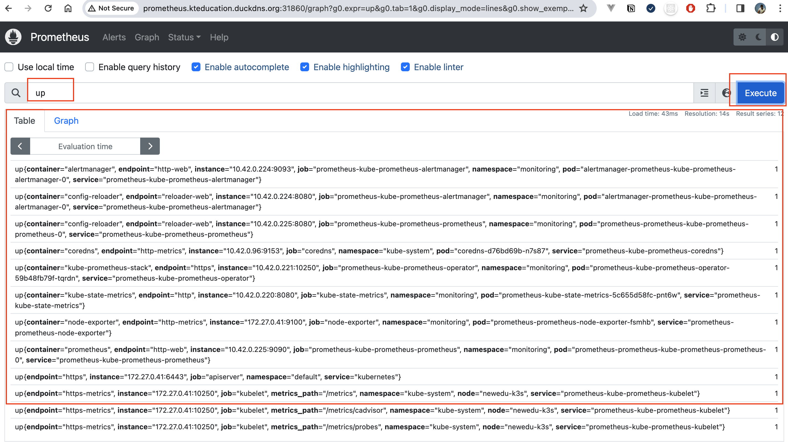

<br/>

grafana ingress 를 생성한다.  


```bash
root@newedu-k3s:~/monitoring# cat grafana_ing.yaml
apiVersion: networking.k8s.io/v1
kind: Ingress
metadata:
  name: grafana-duckdns-ingress
  annotations:
    kubernetes.io/ingress.class: "nginx"
spec:
  rules:
  - host: grafana.kteducation.duckdns.org
    http:
      paths:
      - path: /
        pathType: Prefix
        backend:
          service:
            name: prometheus-grafana
            port:
              number: 80
```  

```bash              
root@newedu-k3s:~/monitoring# kubectl apply -f grafana_ing.yaml -n monitoring
ingress.networking.k8s.io/grafana-duckdns-ingress created
```  

<br/>

web browser에서 http://grafana.kteducation.duckdns.org:31860 를 입력한다.    

<br/>

ID를 찾는다.  

```bash
root@newedu-k3s:~/monitoring# kubectl get secrets prometheus-grafana -o jsonpath="{.data.admin-user}" -n monitoring | base64 -d
admin
```
<br/>

비밀번호를 찾는다.  

```bash
root@newedu-k3s:~/monitoring# kubectl get secrets prometheus-grafana -o jsonpath="{.data.admin-password}" -n monitoring | base64 -d
prom-operator
```  

<br/>

로그인을 한다.  

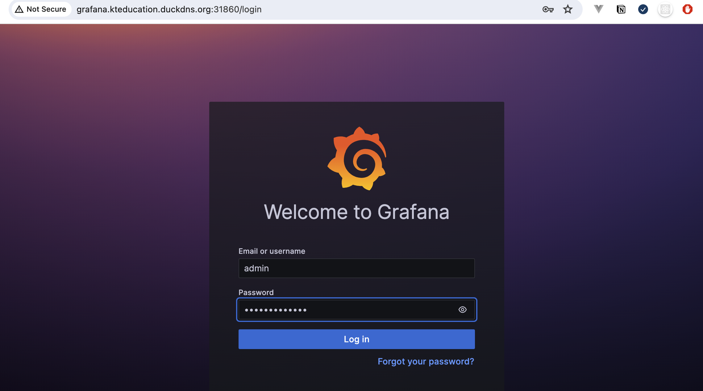


<br/>

로그인을 한후 오른쪽 상단를 클릭하여 비밀번호를 변경한다.  

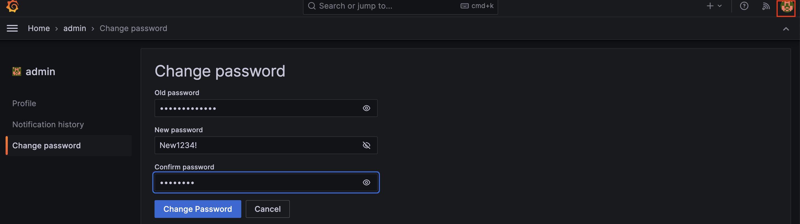  

<br/>

## Thanos 설치  

<br/>


### prometheus 설정 및 config 생성  

<br/>

먼저 objstore.yaml 화일을 생성한다.

아래 config 값은 minio 에서 가져온다.    
- URL : http://minio.kteducation.duckdns.org:31860/  

<br/>

minio에서 user 를 생성하고 권한을 할당한다.  


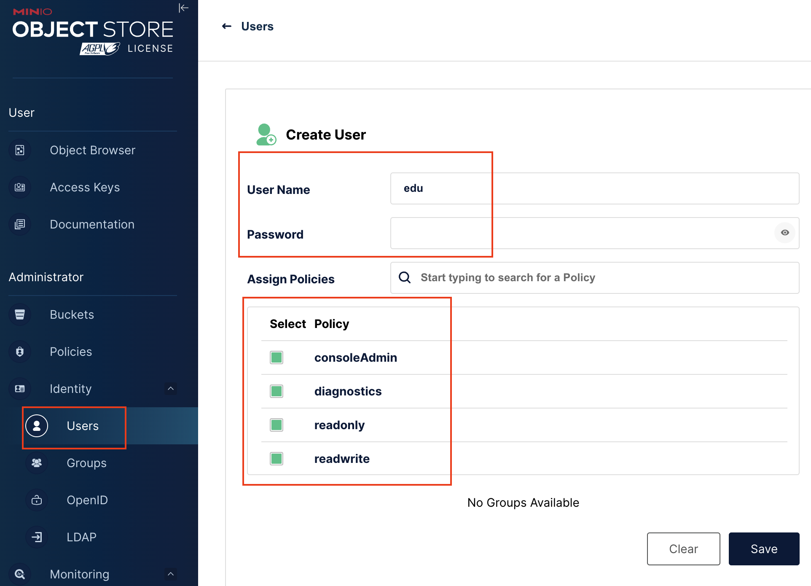      

<br/>

Users -> Service Accounts 로 이동하여 access key 를 생성한다.  

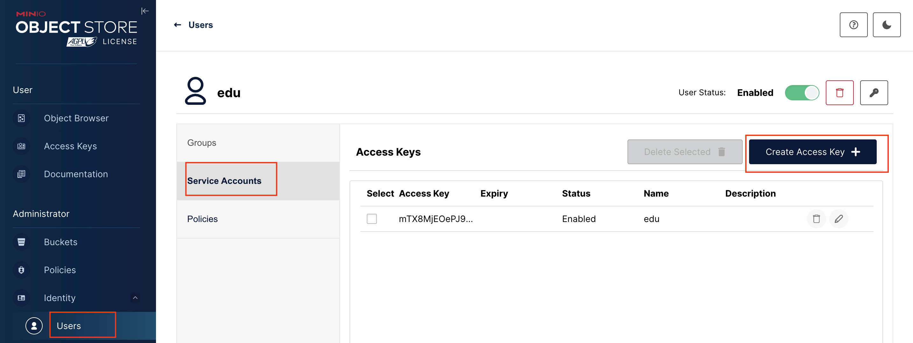    


<br/>

본인 Thanos의 bucket을 생성한다.    
- 버저닝은 체크하지 않는다.

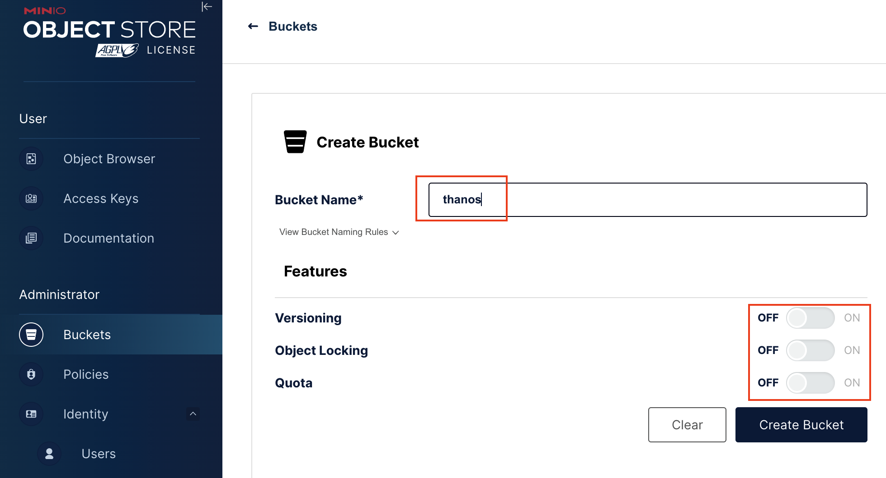    

<br/>

```bash
root@newedu-k3s:~/monitoring# cat objstore.yml
type: S3
config:
  bucket: "thanos-test"
  endpoint: "my-minio.minio.svc:9000"
  region: "ap-northeast-2"
  access_key: "FCPYjIq7y****"
  secret_key: "hcbhGG5IlpyROfT****"
  insecure: true  # http 연결을 위해서
  trace:
    enable: true
```  

<br/>

objstore.yaml 으로 secret을 생성한다.  

```bash
kubectl create secret generic s3-secret --from-file=objstore.yml -n monitoring
```  

<br/>

prometheus에서 thanos sidecar를 추가하기 위해 prometheus-thanos-values.yaml 파일을 생성합니다.     

먼저 prometheus App version 을 확인합니다. 

<br/>


```bash
root@newedu-k3s:~/monitoring# helm search repo prometheus
NAME                                              	CHART VERSION	APP VERSION	DESCRIPTION
prometheus-community/kube-prometheus-stack        	56.8.2       	v0.71.2    	kube-prometheus-stack collects Kubernetes manif..
```  

<br/>


```bash
root@newedu-k3s:~/monitoring# cat prometheus-thanos-values.yaml
prometheus:
  thanosService:
    enabled: true
  prometheusSpec:
    externalLables:
      cluster: prometheus-1
    thanos:
      objectStorageConfig:
        key: objstore.yml
        name: s3-secret
      version: v0.71.2
```  


<br/>

prometheus 를 helm 으로 upgrade 합니다.  

```bash
root@newedu-k3s:~/monitoring# helm  upgrade -i prometheus prometheus-community/kube-prometheus-stack -n monitoring -f values.yaml -f prometheus-thanos-values.yaml --set fullnameOverride=prometheus
Release "prometheus" has been upgraded. Happy Helming!
NAME: prometheus
LAST DEPLOYED: Tue Feb 27 06:10:13 2024
NAMESPACE: monitoring
STATUS: deployed
REVISION: 4
NOTES:
kube-prometheus-stack has been installed. Check its status by running:
  kubectl --namespace monitoring get pods -l "release=prometheus"

Visit https://github.com/prometheus-operator/kube-prometheus for instructions on how to create & configure Alertmanager and Prometheus instances using the Operator.
```  

<br/>

POD를 조회해 보면 `prometheus-prometheus-0` pod에 `thanos-sidecar` container가 추가 된것을 확인 할 수 있습니다.  

```bash
root@newedu-k3s:~/monitoring# kubectl get po -n monitoring prometheus-prometheus-prometheus-0 -o=jsonpath='{.spec.containers[*].name}' | tr ' ' '\n'
prometheus
config-reloader
thanos-sidecar
```  

<br/>

Thanos 사이트카 엔드포인트를 위한 service 도 생성이 된다.  

```bash
root@newedu-k3s:~/monitoring# kubectl get svc -n monitoring
NAME                                  TYPE        CLUSTER-IP      EXTERNAL-IP   PORT(S)                      AGE
prometheus-thanos-discovery           ClusterIP   None            <none>        10901/TCP,10902/TCP          10m
```  


<br/>

### Thanos 설치  

<br/>

thanos 구조는 아래와 같습니다.  


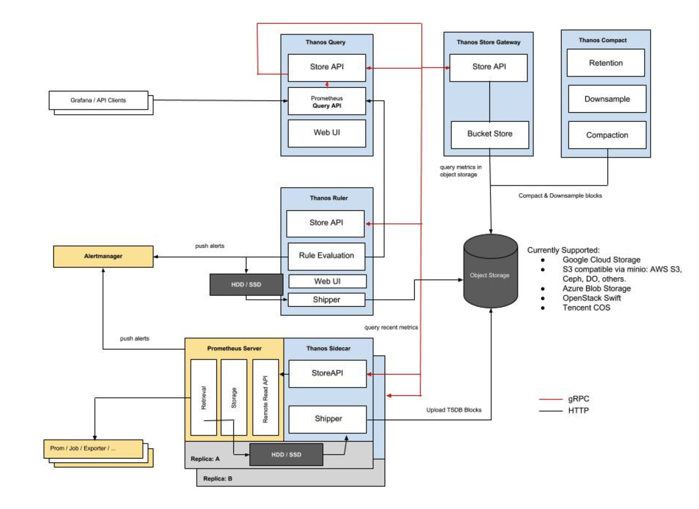    

<br/>

https://thanos.io/v0.6/thanos/getting-started.md/

파란 네모가 타노스 구성 컴포넌트이다. 설계 디자인은 공식 문서에서도 참고가 가능하다.  

- Thanos Sidecar : Prometheus에 연결되어 메트릭 데이터를 쿼리하고 클라우드 스토리지에 업로드한다. 노드마다 사이드카가 연결되며 외부 스토리지 저장을 통해 확장성을 개선시키는 역할의 컴포넌트이다.  

- Thanos Store Gateway : 외부 스토리지에 메트릭 데이터를 읽어 Thanos Query로 전달한다. 해당 컴포넌트를 통해 외부 스토리지에서 과거 데이터도 쿼리할 수 있게 된다.  

- Thanos Query : 사용자 쿼리를 요청 처리하며 짧은 시간의 데이터는 타노스 사이드카에서 가져오며, 오래된 데이터는 스토어 게이트웨이를 통해 외부 스토리지에서 가져온다. Prometheus Query API를 구현하여 사용자가 기존의 Prometheus 쿼리를 그대로 사용할 수 있게 한다.

<br/>

bitnami 로 설치를 진행하며 thanos-values.yaml 화일을 추출합니다.    
- network policy 는 다 false 로 설정합니다.  

```bash
root@newedu-k3s:~/monitoring#  helm show values bitnami/thanos > thanos-values.yaml  
```  

```bash
  13 global:
  14   imageRegistry: ""
  15   ## e.g:
  16   ## imagePullSecrets:
  17   ##   - myRegistryKeySecretName
  18   ##
  19   imagePullSecrets: []
  20   storageClass: "nfs-client"
  ...
  86 ##
  87 existingObjstoreSecret: "s3-secret"
  88 ## @param existingObjstoreSecretItems Optional item list for specifying a custom Secret key. If so, path should be objstore.yml
  89 ##
  ...
   160   stores: # []
   161   - prometheus-thanos-discovery:10901
   ...
    490   networkPolicy:
    491     ## @param query.networkPolicy.enabled Specifies whether a NetworkPolicy should be created
    492     ##
    493     enabled: false
   ...
    927   config: |-
    928     type: IN-MEMORY
    929     config:
    930       max_size: 512M
    931       max_size_items: 100
    932       validity: 120s 
    ...
    952   extraFlags: #[]
    953   - --query-range.split-interval=24h
    954   - --query-range.max-retries-per-request=5
    955   - --query-frontend.log-queries-longer-than=60s
    ...
    1197   networkPolicy:
    1198     ## @param queryFrontend.networkPolicy.enabled Specifies whether a NetworkPolicy should be created
    1199     ##
    1200     enabled: false
    ...
    1956 compactor:
    1957   ## @param compactor.enabled Enable/disable Thanos Compactor component
    1958   ##
    1959   enabled: true
    1960   ## @param compactor.logLevel Thanos Compactor log level
    1961   ##
    1962   logLevel: info
    1963   ## @param compactor.logFormat Thanos Compactor log format
    1964   ##
    1965   logFormat: logfmt
    1966   ## Resolution and Retention flags
    1967   ## @param compactor.retentionResolutionRaw Resolution and Retention flag
    1968   ## @param compactor.retentionResolution5m Resolution and Retention flag
    1969   ## @param compactor.retentionResolution1h Resolution and Retention flag
    1970   ##
    1971   retentionResolutionRaw: 30d
    1972   retentionResolution5m: 30d
    1973   retentionResolution1h: 1y
    1974   ## @param compactor.consistencyDelay Minimum age of fresh (non-compacted) blocks before they are being processed
    1975   ##
    1976   consistencyDelay: 30m
    ...
    2515   #config: # ""
    2516   config: |-
    2517     type: IN-MEMORY
    2518     config:
    2519       max_size: 300MB
    2520       max_item_size: 120MB
    ...
    3227 ruler:
    3228   ## @param ruler.enabled Enable/disable Thanos Ruler component
    3229   ##
    3230   enabled: true
    3250   alertmanagers: # []
    3251     - http://prometheus-alertmanager:9093
    ...
    3277   #config: ""
    3278   config: |-
    3279     groups:
    3280       - name: "monitoring"
    3281         rules:
    3282           - alert: "PrometheusDown"
    3283             expr: absent(up{prometheus="monitoring/prometheus-prometheus"})
```  

<br/>

위 설정에 대한 설명은 아래와 같다.    

- query-frontend  
    - cache는 메모리를 사용하도록 설정한다.
    - 최대 512MB 데이터와 최대 100개 데이터를 유지하고 유효시간은 120초다. 
    - 데이터를 처리할때 24시간 간격으로 분할하며, 데이터 요청에 최대 5번까지 재시도
    - 실행 시간이 60초인 쿼리는 로그에 기록 된다
- bucketweb
    - object storage의 연동시 저장소를 확인할 수 있는 유틸리티 이지만 본 예제에서는 사용하지 않는다.     
- compactor 
    - compactor의 동작을 지정하고 주기설정 등이 가능하다.
    - 데이터별 저장주기와 compaction 실행주기를 설정.
    - raw, 5분,1시간 단위로 다운 샘플링 된 데이터의 보존기간이다.
    - consistencyDelay 값을 통해 s3 저장소에 업로드 된 후에 지정한 시간 후에 블록을 읽을수 있다.  
- storegateway    
    - compactor나 query가 object storage의 데이터를 참조할때 거치는 기능을 설정.
    - 메모리 캐시를 사용하도록 설정하고, query 연동을 위한 포트만 설정. 
    - 최대 300MB의 메모리를 사용하며 일관성을 유지 할수 있다.
    - 처리 할 수있는 최대 블록크기는 120MB 이다.
- ruler
   - 발생 알람을 처리하기위해 manager에 대한 설정이 필요하다. 
   - 또한 처리할 룰(예시에서는 metamonitoring그룹의 PrometheusDown)과 수행주기를 정의할 수 있다   

<br/>


위에서 생성한 파일로 Thanos 설치를 한다.  

```bash
root@newedu-k3s:~/monitoring# helm install thanos bitnami/thanos -f  thanos-values.yaml -n monitoring
NAME: thanos
LAST DEPLOYED: Tue Feb 27 06:43:59 2024
NAMESPACE: monitoring
STATUS: deployed
REVISION: 1
TEST SUITE: None
NOTES:
CHART NAME: thanos
CHART VERSION: 13.2.1
APP VERSION: 0.34.0

** Please be patient while the chart is being deployed **

Thanos chart was deployed enabling the following components:
- Thanos Query
- Thanos Compactor
- Thanos Ruler
- Thanos Store Gateway

Thanos Query can be accessed through following DNS name from within your cluster:

    thanos-query.monitoring.svc.cluster.local (port 9090)

To access Thanos Query from outside the cluster execute the following commands:

1. Get the Thanos Query URL by running these commands:

    export SERVICE_PORT=$(kubectl get --namespace monitoring -o jsonpath="{.spec.ports[0].port}" services thanos-query)
    kubectl port-forward --namespace monitoring svc/thanos-query ${SERVICE_PORT}:${SERVICE_PORT} &
    echo "http://127.0.0.1:${SERVICE_PORT}"

2. Open a browser and access Thanos Query using the obtained URL.

WARNING: There are "resources" sections in the chart not set. Using "resourcesPreset" is not recommended for production. For production installations, please set the following values according to your workload needs:
  - compactor.resources
  - query.resources
  - queryFrontend.resources
  - ruler.resources
  - storegateway.resources
+info https://kubernetes.io/docs/concepts/configuration/manage-resources-containers/
```

<br/>

helm upgrade 명령어  

> helm upgrade -i thanos bitnami/thanos -n monitoring

<br/>

POD 를 조회해 본다.  

```bash
root@newedu-k3s:~/monitoring# kubectl get po -n monitoring
NAME                                             READY   STATUS    RESTARTS      AGE
prometheus-prometheus-node-exporter-fsmhb        1/1     Running   0             3h52m
prometheus-kube-state-metrics-5c655d58fc-pnt6w   1/1     Running   0             3h52m
prometheus-grafana-7994bfb78f-n66tl              3/3     Running   0             3h52m
prometheus-operator-7ffc467477-7hjws             1/1     Running   0             75m
alertmanager-prometheus-alertmanager-0           2/2     Running   0             75m
prometheus-prometheus-prometheus-0               3/3     Running   0             75m
thanos-query-85955b7ff8-2kqhd                    1/1     Running   0             8m54s
thanos-query-frontend-56685fc-4ftqf              1/1     Running   0             8m54s
thanos-compactor-fd5b84df9-qsfm9                 1/1     Running   0             5m51s
thanos-ruler-0                                   1/1     Running   0             8m53s
thanos-storegateway-0                            1/1     Running   0             4m1s
```  

<br/>

thanos ingress를 생성합니다.

```bash
root@newedu-k3s:~/monitoring# cat thanos_ing.yaml
apiVersion: networking.k8s.io/v1
kind: Ingress
metadata:
  name: thanos-duckdns-ingress
  annotations:
    kubernetes.io/ingress.class: "nginx"
spec:
  rules:
  - host: thanos.kteducation.duckdns.org
    http:
      paths:
      - path: /
        pathType: Prefix
        backend:
          service:
            name: thanos-query-frontend
            port:
              number: 9090
```  

<br/>

웹 브라우저에서 thanos 를 접속합니다.  
- http://thanos.kteducation.duckdns.org:31860/

<br/>

thanos를 선택하고 up을 입력 한 후 Execute 버튼을 클릭합니다.  

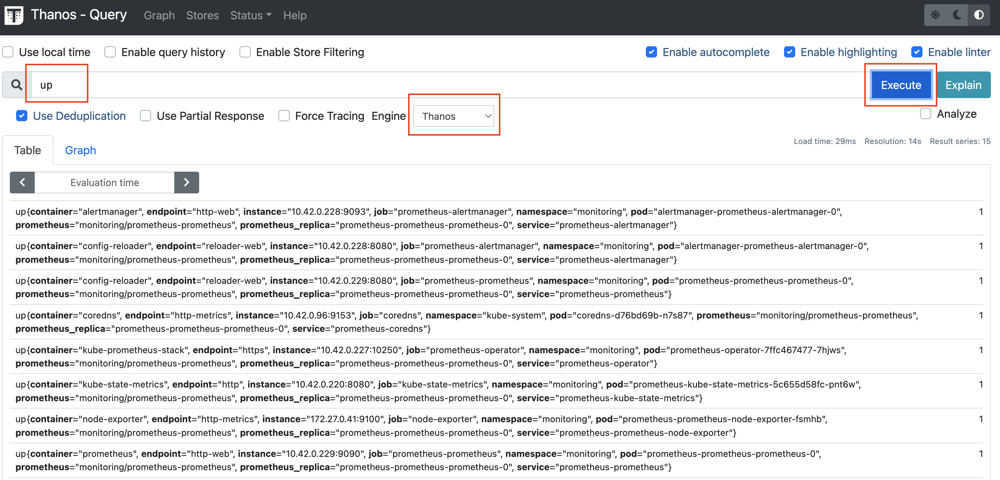     

데이터가 나오고 thanos와 prometheus가 연동 된 것을 확인 할 수 있습니다.  

<br/>

stores 메뉴를 클릭 해본다.  

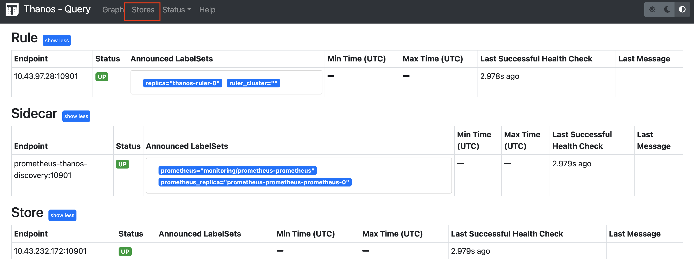     


<br/>

grafana 로 접속하여  thanos라는 이름으로 신규 data source를 추가한다.  
- 타입 : prometheus
- default 설정 : enable

<br/>

grafana 와 thanos가 같은 namespace 에 있기 때문에 url을 아래과 같이 설정한다.  
- http://thanos-query:9090


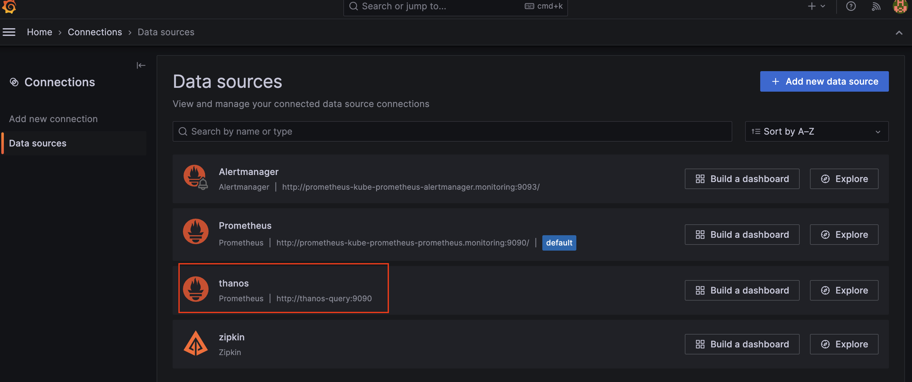     

<br/>

대쉬보드를 하나 추가합니다. 
- Dashboard ID : 17900


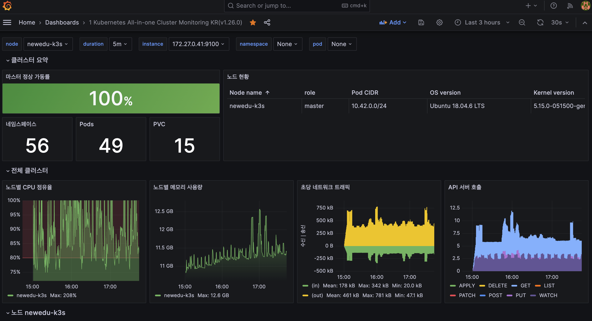 

<br/>

minio 의 bucket에서 데이터를 확인 해보면 아직 데이터가 없는것으로 나옵니다.

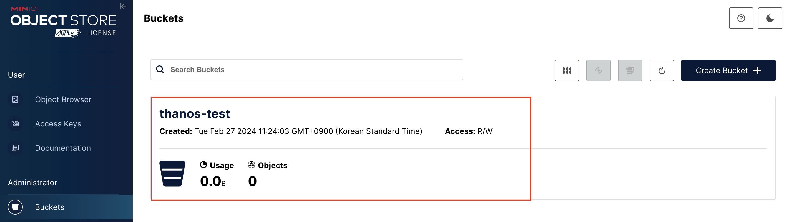     

<br/>

prometheus의 retention 기간이 1일로 되어 있어 bucket에 데이터가 저장되지 않는다.  
