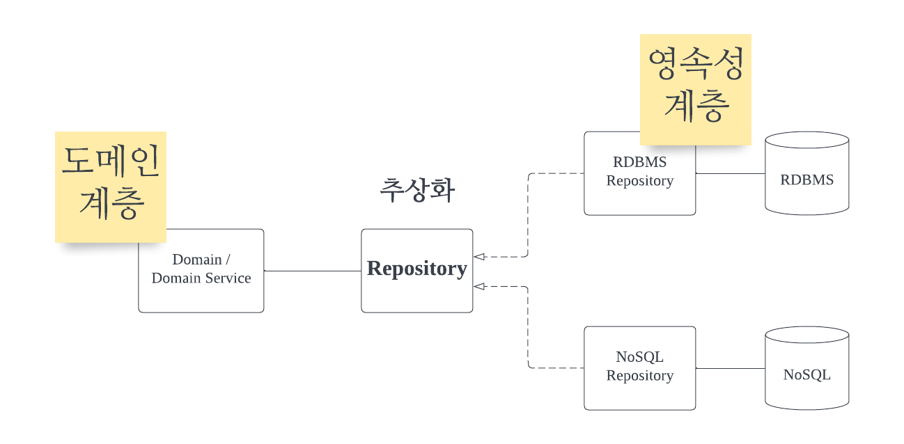
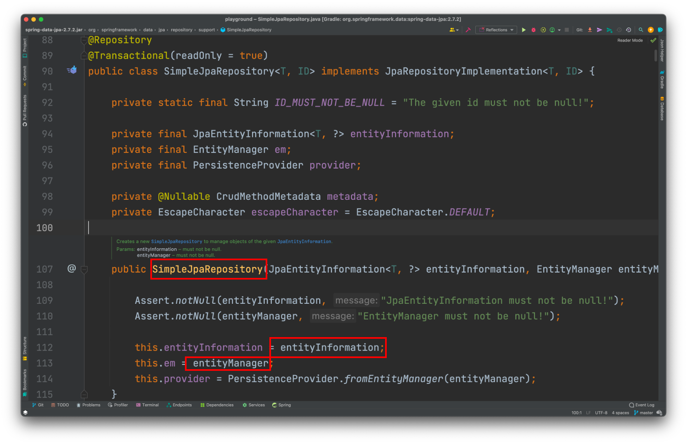
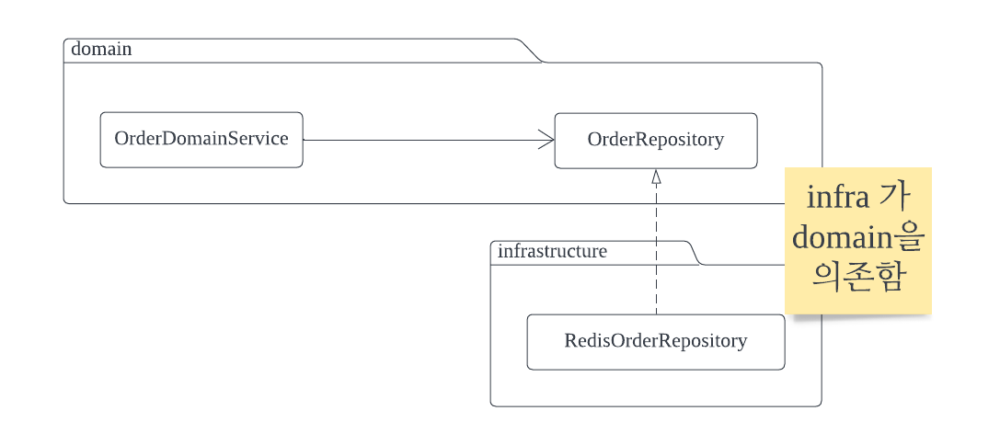
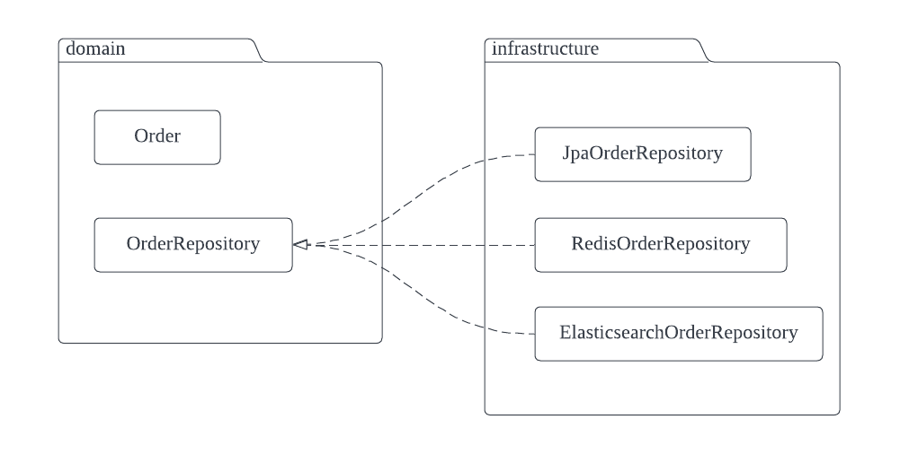

# 3. Repository Pattern

## 3.1. 개요

- Repository Pattern 은 2004 년 에릭 에반스의 Domain-Driven-Design 에서 처음 소개된 개념으로, 공통적인 데이터 Access & Manipluate 에 집중하여 **도메인 모델 계층과 구현 기술을 분리**시키는 것을 의미한다.

 

- 이렇게 함으로써 RDB 나 Query 와 같이 어떠한 **구현 기술에 종속적이지 않고 도메인에 더욱 집중**할 수 있게 되는 패턴을 의미한다.

- Repository 에 대해서 **Martin Fowler** 는  domain 과 data source layer 간에 **중재자 역할을 수행**하는 것이라고 한다.

- repository 는 영속성 장치에서 쿼리의 결과로 받아온 데이터를 repository 에서는 domain 에서 사용하기 적합하도록 Domain 객체로 mapping 하는 역할을 수행한다.

- 위 그림은 Jpa 를 사용할 떄 기본으로 사용되는 Repository 의 구현체인 (정확히는 `JpaRepository` 의 구현체) `SimpleJpaRepository` 클래스이다.

- 위와 같이 entity 에 대한 정보를 받기도 하며 실제 connection 을 처리할 entity manager 또한 보유하고 있는 것을 알 수 있다.

- **꼭 영속성 장치일 필요는 없다.**
  - domain 관점에서 보면 repository 뒤에 어떤 장치가 숨어있던 상관 없이 **데이터를 조작하는 데에 필요한 인터페이스만을 바라보고 협력**하기 때문에 RDBMS 이던, WebServer 이던, FileSystem 이던 **상관 없다**.

 

## 3.2. DIP 와 Repository

### 3.2.1. Repository

- **DDD** 에서 말하는 Layered Architecture 를 적용한다면 아마 다음과 같은 구조가 일반적으로 사용될 것이다.

 

- 가운데 있는 Infrastructure Persistence Layer 가 바로 Repository 가 존재하는 레이어이다.

>  **Repository 는 도메인을 영속화하는데 필요한 일종의 명세이다.**
>
> 도메인 관점에서 **"나는 이런 것들을 이렇게 저장할 것이고 이렇게 불러올거야!"** 라는 명세를 만들어놓고 실제 구현 기술에 대한 부분을 분리시킨다는 의미이다.

- 위의 **Domain Model Layer** 와 **Infrastructure Layer** 를 나누는 것도 같은 맥락이다.
  -  **Domain Model Layer** 에서는 저장하는 방법에 대해서 관심을 갖고,
  - **Infrastructure Layer** 에서는 실제로 어떻게 저장하는지에 대해서 관심을 갖는다.

 

### 3.2.2 DIP(Dependency Inversion Principle)

- 이 두개의 계층사이를 분리하기 위해서 DIP 를 이용해서 도메인 모델에 존재하는 Repository 추상화로 만들고 실제 구현을 infrastructure 에서 하게 한다.

- DIP 를 사용한다는 것은 **의존의 방향을 역전시**키겠다는 이야기다.

- 즉, **고수준 모듈**(의미 있는 단일 기능)이 **저수준 모듈**(고수준 모듈을 구현하기 위한 기능)에 의존하지 않도록 하기 위함인데, 단지 **선언과 구현을 분리** 쯤으로 생각한다면 잘못된 DIP 의 결과가 나올 수 있다.

- 예를 들면 아래와 같은 형태로 말이다.

- 이렇게 된다면 Repository 를 다양한 형태의 구현으로 다형적이게 만든다는 조건은 만족시켰다.

- 하지만 여전히 고수준 모듈이 저수준 모듈에 의존하고 있다. 즉, 의존의 관점에서 본다면 `OrderDomainService` 가 infrastructure 를 알게 되는 형태이다.

> 이렇게 의존의 방향이 잘못된다면 많은 고통이 발생할 수 있다. 현재는 이상없는것 처럼 보이겠지만 한 해가 지나고, 다음 해가 지나서 다른 개발자가 도메인 로직에서 Repository 를 추상적인 것에 의존하는 게 아니라 구체적인 ElasticsearchRepository 를 의존했다고 해보자. 그리고 그 다음해에 비즈니스가 변경되어 저장할 필요 없이 단지 API 로 다른 곳에 relay 만 한다고 했을때, 이들을 분리하는 것은 또 다른 pain point 가 될 것이다.

- 그래서 이를 해결하기 위해서 `OrderRepository` 를 고수준 모듈로 만드는 것이다.

 

이렇게 된다면 하나의 추상적인 Repository 에 대해서 다양한 구현이 가능하게 된다.

 

- 결국 **Repository 는 Jpa 진영에서 DB 와 연결하기 위한 layer 로 부르는 것이 아니라는 것**을 알 수 있다.

- **도메인의 관점**에서 Repository 는 데이터를 저장하는 backing 을 추상화한 것으로 도메인은 어떻게 Repository 에 저장되는지 관심을 갖지 않는다.

- 오로지 도메인 로직 자체에만 관심을 갖는다.

- 그래서 도메인 관점으로 보자면 Repository 를 두고 infrastructure 에서 이를 JPA 를 사용하던 MyBatis 를 사용해서 DAO 계층을 만들건 **중요하지 않게 되는 것**이다.

###  3.3. DDD 관점의 Repository 는?

- 이제 Domain Driven Design, 설계의 관점에서 Repository 를 생각해보자

- DDD 에서는 애그리거트라는 용어가 존재한다.

- 애그리거트는 간략하게 말하자면 **하나의 unit, 비즈니스 단위로 취급할 수 있는 오브젝트의 집합**이다.

- 예를 들어서 **Review** 라는 애그리거트가 존재한다고 해보자.
  -  그럼 해당 Review 라는 애그리거트에는 다음과 같은 오브젝트가 존재할 것이다.
  - Review 에는 글을 쓴 사람인 `Reviewer`
  - 글의 본문인 `Contents`
  - 리뷰의 제목인 `Title`
  - 해당 리뷰의 `Tag`

- 이외에도 리뷰를 표현하는 다양한 오브젝트가 존재할 것인데, 해당 오브젝트는 **리뷰**라는 비즈니스 **개념 하나**를 구성하는 요소들이다.

- 결국 어떤 애그리거트가 저장된다는 소리는 해당 애그리거트에 포함되는 모든 entity 와 value 들에 대해서 **transaction consistency** 를 보장해야 한다.

- 그래서 일반적으로 DDD 에서는 하나의 Aggregate 를 Repository 의 대상 엔티티로 삼는다.

- 즉 Review 라는 애그리거트가 존재할 때, 해당 애그리거트를 저장하고 로드하는 Repository 는 ReviewRepository 만 존재해야 한다는 소리다.

- Review 가 Tag 들을 포함하고 있다고 해서 TagRepository 가 존재해서는 안된다는 것이다.

 

## 3.4. 해결해야 할 문제

- 너무 많은 컨버팅 코드

- **휴먼 에러**
- **JPA 사용시 Lazy Loading 불가**