# Service Mesh ( Istio )

<br/>

Service Mesh 를 이해 하고 실습 할수 있다.   

<br/>


1. MSA  

2. Istio   

3. Istio 설치

4. Istio Demo 실습

5. 과제


<br/>

## MSA

<br/>

### MSA 란  

<br/>

참고   
- https://youtu.be/ZRpsB3ODr6M?si=S0nlHndFz6RejsTT  
- 코딩 애플 : https://youtu.be/ZRpsB3ODr6M?si=W5kjolLxZweNNHiZ 


<br/>

MicroService Architecture의 줄임말입니다.  

MSA란 작고, 독립적으로 배포 가능한 각각의 기능을 수행하는 서비스로 구성된
프레임워크라고 할 수 있습니다.  

<br/>

## Istio

<br/>

참고  
- https://m.blog.naver.com/isc0304/221892105612  

<br/>

### Istio 란

<br/>

참고   
- https://gruuuuu.github.io/cloud/service-mesh-istio/  

<br/>  

IBM, Google에 의해, Sidecar 패턴을 이용한 Service Mesh Architecture 구현체이다.  

Spring Cloud Netflix와 유사하지만 좀 더 발전된 형태라고 할 수 있다.  

물론 Spring Cloud는  자바와 스프링이라는 제약이 발생하고 코드 레벨에서 제어해야 한다는 점이 있다.  

반대로 Istio는 응용(코드) 레벨이 아닌 인프라 레벨로 존재하여 플랫폼 의존성이 적고 개발 언어에도 독립적이다.    
서비스마다 Proxy가 추가되는  형태로 오버헤드가 크다.

<br/>

### MicroService Architecture의 단점  

<br/>

기존 Monolithic Architecture의 단점을 극복하고 작은 서비스들로 하나의 서비스를 이루는 것은 각각의 서비스들을 독립적으로 관리할 수 있다는 점에서 유연하게 운용할 수 있었지만  

거대해진 MSA시스템을 보면 수십개의 MicroService가 분리되어있고 운영환경에는 수천개의 서비스 인스턴스가 동작하고 있습니다.      

<br/>

아래와 같은 MSA는 확장성, 유연성, 민첩성등에서 큰 강점을 가지고 있지만 여러 독립적인 서비스로 분산되기 때문에 복잡도가 추가된다. 이러한 복잡도는 모니터링, 전체 서비스의 가시성 확보, 서비스 검색(Service Discovery) 등을 어렵게 한다.


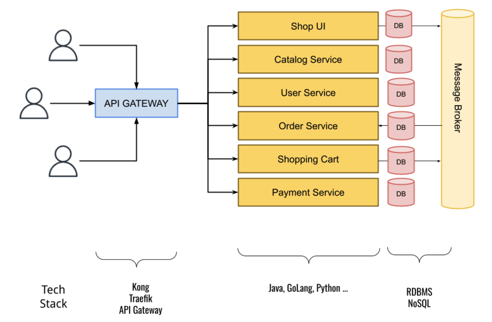   

<br/>

관리자는 수백~수천개의 인스턴스들을 모니터링하고 로깅해야하며 관리해야하는 책임이 주어지게 됩니다.  

또한 서비스간의 통신도 매우 복잡해질수밖에 없습니다.  

이와 같은 관리 및 프로그래밍 오버헤드를 낮추기위해 나온 아키텍처가 바로 Service Mesh입니다.  

<br/>

### Service Mesh

<br/>

기존의 서비스 아키텍처에서의 호출이 직접 호출방식이었다면,      


   

<br/>

Service Mesh에서의 호출은 서비스에 딸린 proxy끼리 이뤄지게 됩니다.

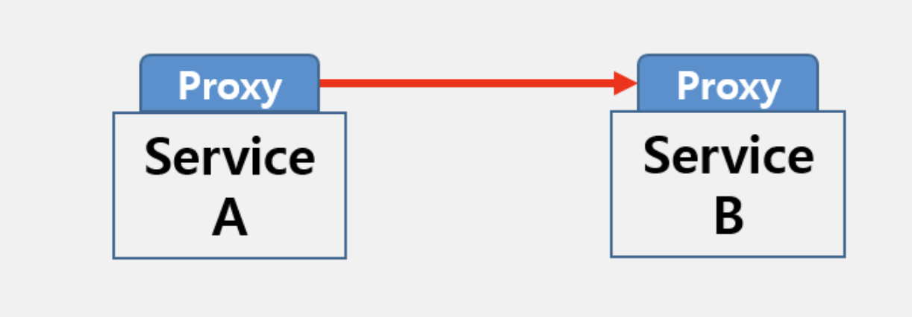   

<br/>

이는 서비스의 트래픽을 네트워크단에서 통제할 수 있게 하고, 또한 Client의 요구에 따라 proxy단에서 라우팅서비스도 가능하게 할 수 있습니다.  

이런 다양한 기능을 수행하려면 기존 TCP기반의 proxy로는 한계가 있습니다.  

그래서 Service Mesh에서의 통신은 사이드카로 배치된 경량화되고 L7계층기반의 proxy를 사용하게 됩니다.  

프록시를 사용해서 트래픽을 통제할 수 있다는 것 까지는 좋은데, 서비스가 거대해짐에 따라 프록시 수도 증가하게 됩니다.  

이런 문제를 해결하기 위해서 각 프록시에 대한 설정정보를 중앙집중화된 컨트롤러가 통제할 수 있게 설계되었습니다.  

<br/>

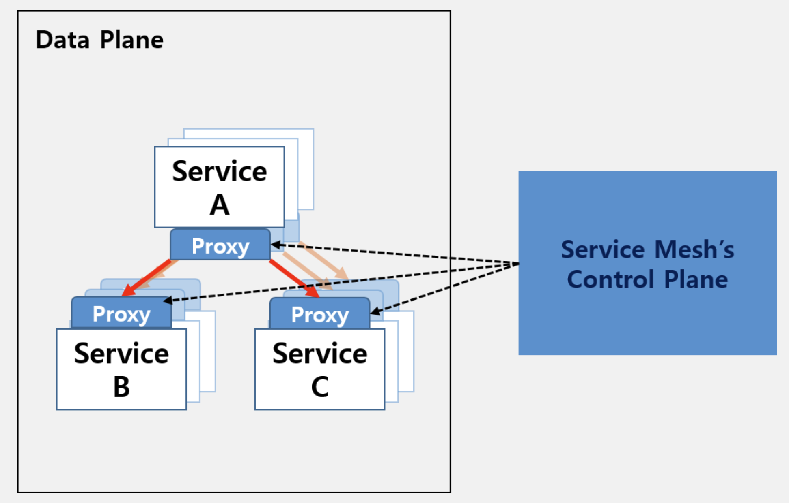     

프록시들로 이루어져 트래픽을 설정값에 따라 컨트롤하는 부분을 Data Plane이라고 하고,
프록시들에 설정값을 전달하고 관리하는 컨트롤러 역할을 Control Plane이라고 합니다.  

<br/>

### Istio

<br/>

Data Plane의 메인 프록시로 Envoy proxy를 사용하며 이를 컨트롤 해주는 Control Plane의 오픈소스 솔루션이 Istio입니다.    

<br/>

#### Envoy Proxy   

<br/>

C++로 개발된 고성능 프록시 사이드카.
dynamic service discovery, load balancing, TLS termination, circuit breaker..등등의 기능을 포함

<br/>

Istio로 구성된 Service Mesh를 개략적으로 살펴보면 다음 그림과 같습니다.  

<br/>

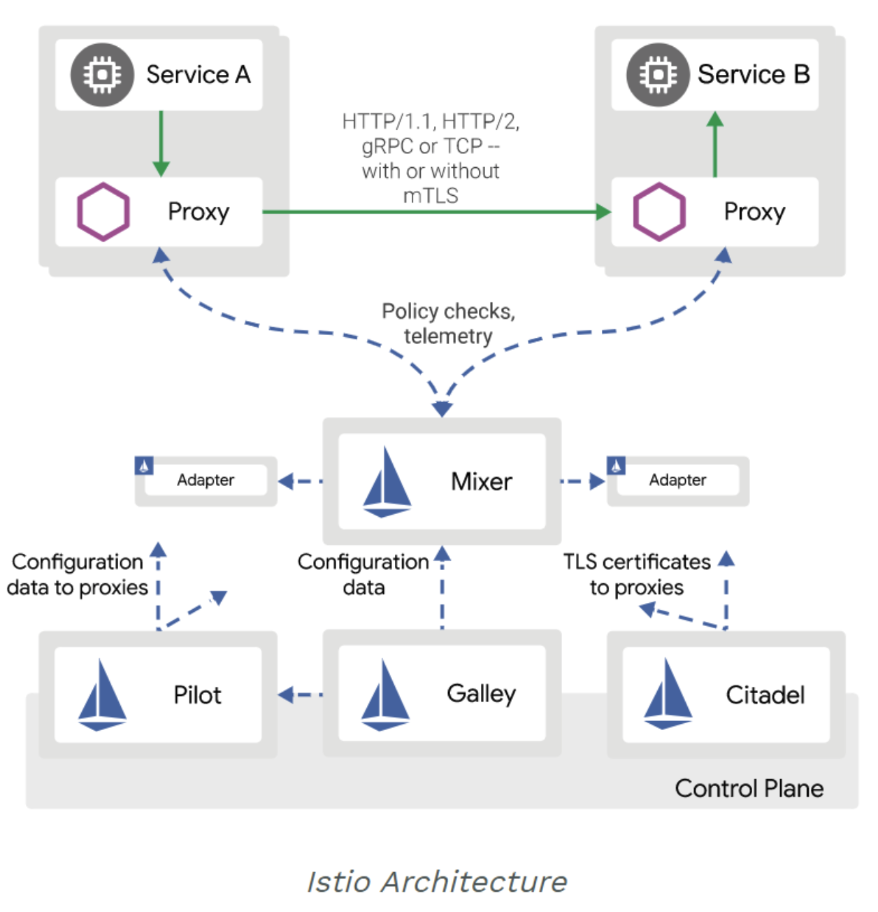 

<br/>

#### Pilot  

<br/>

- envoy에 대한 설정관리
- service discovery 기능 제공  

<br/>

> Service Discovery  

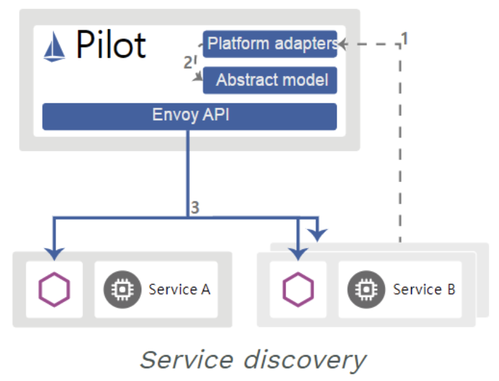   


- 새로운 서비스가 시작되고 pilot의 platform adapter에게 그 사실을 알림 
- platform adapter는 서비스 인스턴스를 Abstract model에 등록 
- Pilot은 트래픽 규칙과 구성을 Envoy Proxy에 배포  

<br/>

#### Mixer   

<br/>

- Service Mesh 전체에서 액세스 제어 및 정책 관리  
- 각종 모니터링 지표의 수집  
- 플랫폼 독립적, Istio가 다양한 호스트환경 & 백엔드와 인터페이스할 수 있는 이유  

<br/>

#### Citadel  

<br/>

- 보안 모듈
- 서비스를 사용하기 위한 인증
- TLS(SSL)암호화, 인증서 관리  

<br/>

#### Galley  

<br/>

Istio Configuration의 유효성 검사

<br/>

### Istio 기능  

<br/>

참고   
- https://musclebear.tistory.com/169  

<br/>

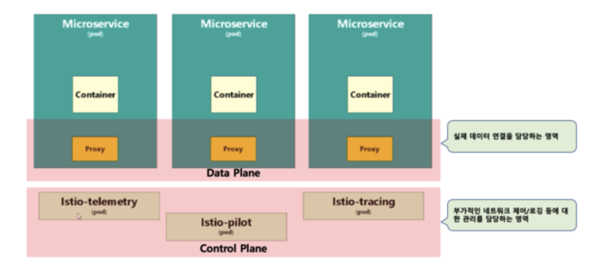     


#### Traffic management   

<br/>

쉬운 규칙 구성과 트래픽 라우팅을 통해 서비스간의 트래픽 흐름과 API 호출을 제어 할 수 있습니다.

<br/>

트래픽 분할    

<br/>

- 서로 다른 버전의 서비스를 배포해놓고, 버전별로 트래픽의 양을 조절할 수 있는 기능입니다.  
- ex) 새 버전의 서비스를 배포할때, 기존 버전으로 95%의 트래픽을 보내고, 새 버전으로 5%의 트래픽만 보내서 테스트하는 것이 가능합니다.    


<br/>


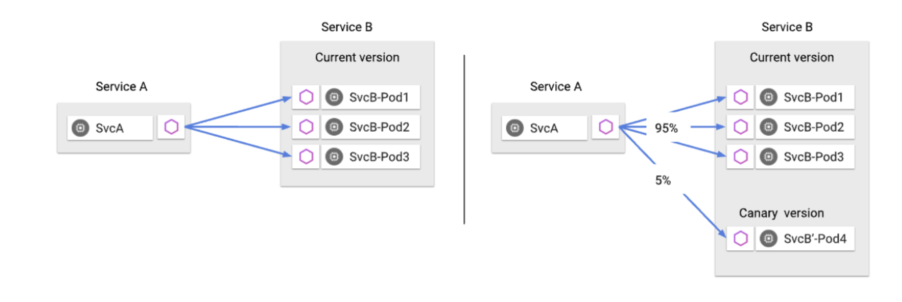     

<br/>

컨텐츠 기반의 트래픽 분할   

<br/>

- 단순하게 커넥션 기반으로 트래픽을 분할하는 것이 아니라, 조금 더 발전된 기능으로 네트워크 패킷의 내용을 기반으로 라우팅이 가능합니다.    
- ex) 아래 우측 그림과 같이 HTTP 헤더의 User-agent 필드에 따라서, 클라이언트가 안드로이드일 경우에는 안드로이드 서비스로 라우팅을 하고, IPhone일 경우에는 IOS 서비스로 라우팅을 할 수 있습니다.  

<br/>

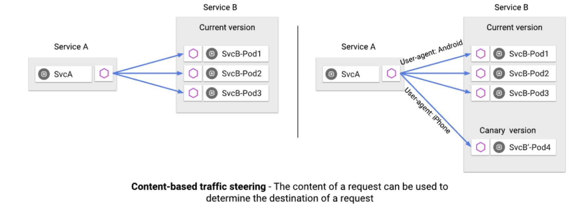     

<br/>

#### 서비스간 안정성 제공 (Resilience)  

<br/>

Pilot은 트래픽 통제를 통해서 서비스 호출에 대한 안정성을 제공합니다.  

<br/>

헬스체크 및 서비스 디스커버리   

<br/>

- 파일럿은 대상 서비스가 여러개의 인스턴스로 구성이 되어 있으면 이를 로드 밸런싱하고, 이 서비스들에 대해서 주기적으로 상태 체크를 합니다.   
- 장애가 난 서비스가 있으면 자동으로 서비스에서 제거합니다.    

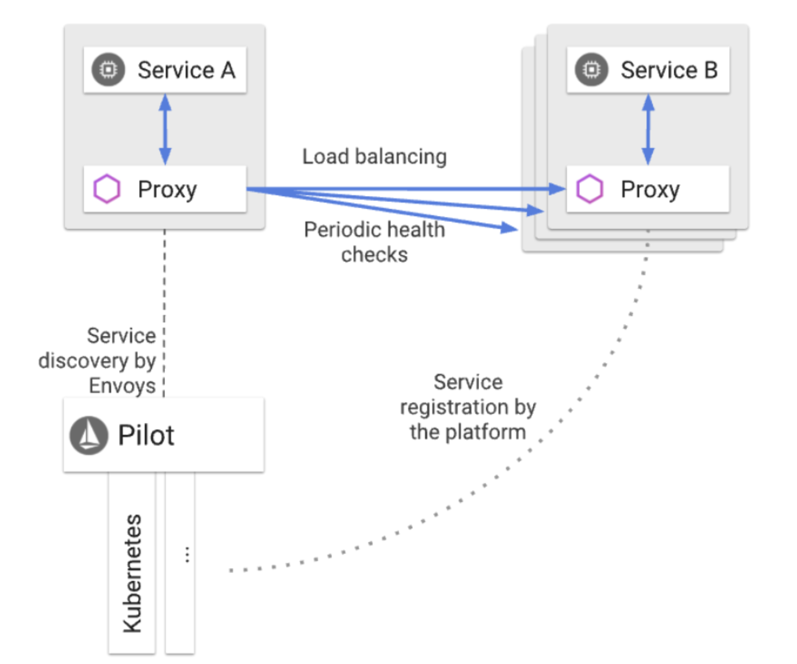     

<br/>

Retry, Timeout, Circuit breaker

<br/>

- 서비스간의 호출 안정성을 위해서, 재시도 횟수를 통제할 수 있습니다.  
- 호출을 했을때 일정 시간 (Timeout)이상 응답이 오지 않으면 에러 처리를 할 수 있고, Mircro Service Architecture 패턴중 하나인 Circuit breaker 패턴을 지원합니다.

<br/>


#### Security 

<br/>

기본적으로 envoy를 통해 통신하는 모든 트래픽을 자동으로 TLS암호화를 합니다.

<br/>

통신 보안

<br/>

- 기본적으로 envoy를 통해서 통신하는 모든 트래픽을 자동으로 TLS를 이용해서 암호화한다. 즉 서비스간의 통신이 디폴트로 암호화 됩니다.  

<br/>

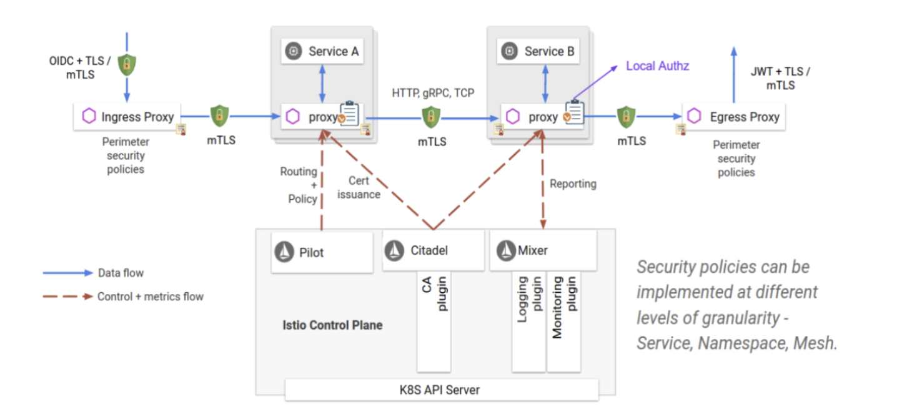     

<br/>

서비스 인증과 인가

<br/>

- Istio는 서비스에 대한 인증 (Authentication)을 제공하는데, 크게 서비스와 서비스간 호출에서, 서비스를 인증하는 기능과, 서비스를 호출하는 클라이언트를 직접 인증 할 수 있다.

<br/>

서비스간 인증

<br/>

- 서비스간 인증은 인증서를 이용하여 양방향 TLS (Mutual TLS) 인증을 이용하여, 서비스가 서로를 식별하고 인증합니다.  

<br/>

서비스와 사용자간 인증  

<br/>

- 서비스간 인증뿐 아니라, 엔드 유저 즉 사용자 클라이언트를 인증할 수 있는 기능인데, JWT 토큰을 이용해서 서비스에 접근할 수 있는 클라이언트를 인증할 수 있습니다.

<br/>

인가를 통한 권한 통제 (Authorization)

<br/>

- 인증뿐만 아니라, 서비스에 대한 접근 권한을 통제 (Authorization)이 가능합니다.  
- 기본적으로 역할 기반의 권한 인증 (RBAC : Role based authorization control)을 지원합니다.  
- 앞에서 인증된 사용자(End User)나 서비스는 각각 사용자 계정이나 쿠버네티스의 서비스 어카운트로 계정이 정의 되고, 이 계정에 역할(Role)을 부여해서 역할을 기반으로 서비스 접근 권한을 정의할 수 있습니다.    

<br/>

#### Policies     

<br/>

서비스간 상호작용에 대해 access, role등의 정책을 설정하여 리소스가 각 서비스에게 공정하게 분배되도록 제어합니다.

<br/>

#### Observability      

<br/>

강력한 모니터링 및 로깅 기능을 제공하여 문제를 빠르고 효율적으로 감지할 수 있게 합니다.     

- 마이크로 서비스에서 문제점중의 하나는 서비스가 많아 지면서 어떤 서비스가 어떤 서비스를 부르는지 의존성을 알기가 어렵고, 각 서비스를 개별적으로 모니터링 하기가 어렵다는 문제가 있습니다.  
- Istio는 네트워크 트래픽을 모니터링함으로써, 서비스간에 호출 관계가 어떻게 되고, 서비스의 응답 시간, 처리량등의 다양한 지표를 수집하여 모니터링할 수 있습니다.

<br/>

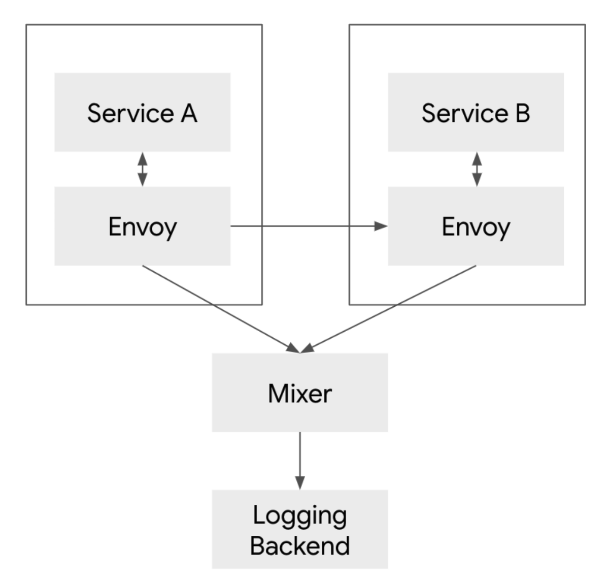     


<br/>

## Istio 설치

<br/>

### Namespace 생성 및 권한부여

<br/>

`istio-system` namespace 를 생성합니다. 


```bash
oc new-project istio-system
```  

<br/>

```bash
Now using project "istio-system" on server "https://api.okd4.ktdemo.duckdns.org:6443".

You can add applications to this project with the 'new-app' command. For example, try:

    oc new-app rails-postgresql-example

to build a new example application in Ruby. Or use kubectl to deploy a simple Kubernetes application:

    kubectl create deployment hello-node --image=k8s.gcr.io/e2e-test-images/agnhost:2.33 -- /agnhost serve-hostname
```   

<br/>

`istio-system` namespace 에 아래와 같이 annotation 을 추가 합니다.  

```bash 
    openshift.io/node-selector: devops=true
```   

<br/>

아래와 같이 권한을 할당합니다.    

```bash
[root@bastion istio]# kubectl edit namespace istio-system -n istio-system
namespace/istio-system edited
[root@bastion istio]# oc project istio-system
```  

<br/>

```bash 
oc adm policy add-scc-to-user anyuid -z default 
oc adm policy add-scc-to-user privileged -z default 
oc adm policy add-scc-to-user anyuid     -z istiod   
oc adm policy add-scc-to-user privileged -z istiod   
oc adm policy add-scc-to-user anyuid -z istio-ingressgateway-service-account
oc adm policy add-scc-to-user privileged -z istio-ingressgateway-service-account  
```  

<br/>

istio 를 다운 받습니다.    

```bash 
curl -L https://istio.io/downloadIstio | sh -
```  

<br/>

```bash 
  % Total    % Received % Xferd  Average Speed   Time    Time     Time  Current
                                 Dload  Upload   Total   Spent    Left  Speed
100   101  100   101    0     0     75      0  0:00:01  0:00:01 --:--:--    75
100  4899  100  4899    0     0   3007      0  0:00:01  0:00:01 --:--:--  3007

Downloading istio-1.19.3 from https://github.com/istio/istio/releases/download/1.19.3/istio-1.19.3-linux-amd64.tar.gz ...

Istio 1.19.3 Download Complete!

Istio has been successfully downloaded into the istio-1.19.3 folder on your system.

Next Steps:
See https://istio.io/latest/docs/setup/install/ to add Istio to your Kubernetes cluster.

To configure the istioctl client tool for your workstation,
add the /root/istio/istio-1.19.3/bin directory to your environment path variable with:
	 export PATH="$PATH:/root/istio/istio-1.19.3/bin"

Begin the Istio pre-installation check by running:
	 istioctl x precheck

Need more information? Visit https://istio.io/latest/docs/setup/install/
```  

<br/>

PATH 설정을 합니다.  

```bash
[root@bastion istio]# export PATH="$PATH:/root/istio/istio-1.19.3/bin"
```

<br/>

istio profile dump 기능을 이용하여 profile yaml 파일을 생성한다.
- profile dump로 설치 manifest 파일을 생성할 수 있다.  

<br/>

```bash
# profile 조회
[root@bastion istio]# istioctl profile list
Istio configuration profiles:
    ambient
    default
    demo
    empty
    external
    minimal
    openshift
    preview
    remote
#openshift-profile 로 생성
[root@bastion istio]# istioctl profile dump openshift > openshift-profile.yaml
```  

<br/>

istio를 설치 하기전에 모든 pod에 istio-proxy 가 설치가 되면 docker rate limit ( 1개 서버  6시간 동안 100번 호출) 로 private docker registry를 설치한다.   

Harbor를 설치되어 있기 때문에 아래와 같이 설정을 한다. 


<br/>

먼저 registry 메뉴로 이동하여 `New Endpoint` 를 생성한다.  
- provider : Docker Hub 선택  

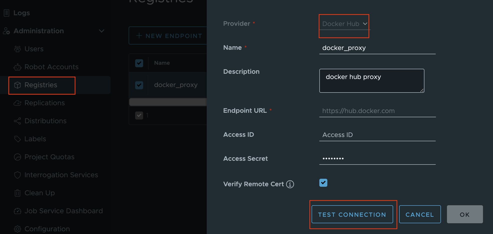     

<br/>

아래와 같이 `Endpoint` 가 생성이 된다.  

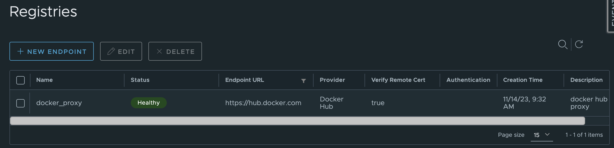     

<br/>

신규 프로젝트를 생성합니다.  
- proxy cache를 선택하고 앞에서 생성한 endpoint를 선택합니다.  

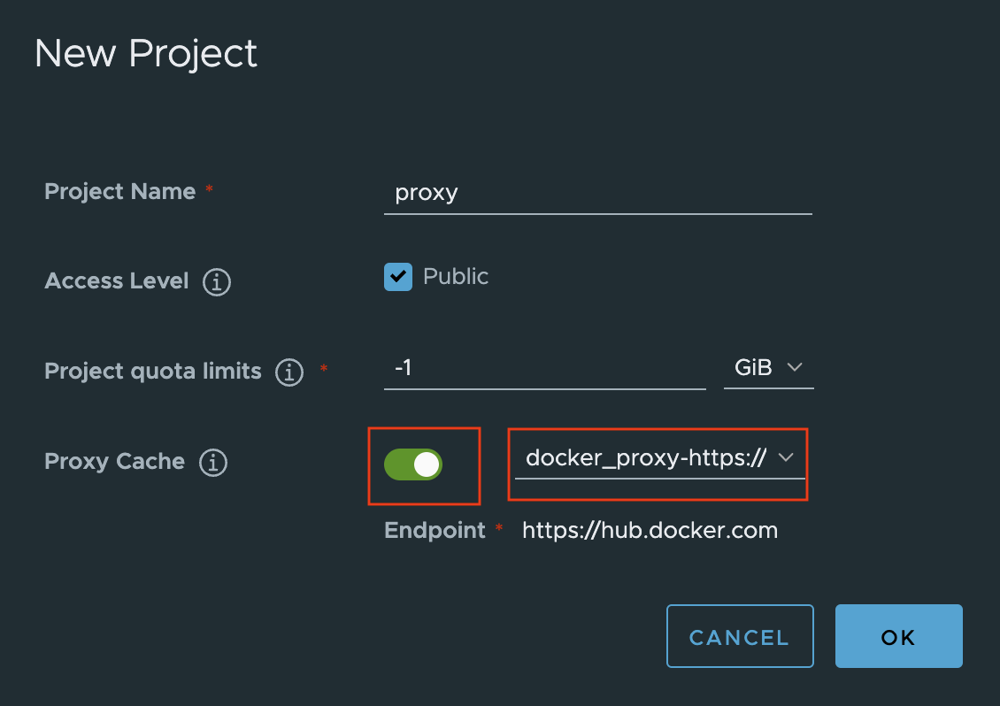       

<br/>

아래와 같이 proxy 라는 이름으로 생성 된것을 확인한다.  

       

<br/>

proxy 를 통해 nginx를 pull 해봅니다.    
- `<private docker registry 이름 >`/`<project 이름>`/ 
- 예) myharbor.apps.okd4.ktdemo.duckdns.org/proxy/   

<br/>


```bash
[root@bastion istio]# podman pull myharbor.apps.okd4.ktdemo.duckdns.org/proxy/nginx
Trying to pull myharbor.apps.okd4.ktdemo.duckdns.org/proxy/nginx:latest...
Getting image source signatures
Copying blob 6f837de2f887 done
Copying blob 578acb154839 done
Copying blob e398db710407 done
Copying blob 85c41ebe6d66 done
Copying blob 7170a263b582 done
Copying blob 8f28d06e2e2e done
Copying blob c1dfc7e1671e done
Copying config c20060033e done
Writing manifest to image destination
Storing signatures
c20060033e06f882b0fbe2db7d974d72e0887a3be5e554efdb0dcf8d53512647
```  

<br/>

아래 처럼 docker 에서 받은것과 같은 용량 , 같은 Image ID 인 것을 알수 있다.   

```bash
[root@bastion istio]# podman images
REPOSITORY                                                 TAG         IMAGE ID      CREATED        SIZE
docker.io/library/nginx                                    latest      c20060033e06  12 days ago    191 MB
myharbor.apps.okd4.ktdemo.duckdns.org/proxy/nginx  latest      c20060033e06  12 days ago    191 MB
```  

<br/>

워커 노드에 접속하여 podman 의 경우는 `/etc/containers/registries.conf.d` 로 이동하여 `myregistry.conf` 라는 이름으로 화일을 하나 생성한다.  

```bash
[root@bastion containers]# cd /etc/containers/registries.conf.d
[root@bastion registries.conf.d]# vi myregistry.conf
```  

<br/>

`location` 에 harbor 주소를 적어 주고 `insecure` 옵션은 `true` 로 설정한다.  

```bash
[[registry]]
location = "myharbor.apps.okd4.ktdemo.duckdns.org"
insecure = true
```   

<br/>

pod 생성시 해당 registry 를 가져 오지 못하는 문제가 있는데 이런경우  

`insecureEdgeTerminationPolicy` 을 `Redirect` 에서 `Allow` 로 변경한다.   

<br/>

```bash
[root@bastion istio]# kubectl get route -n harbor
NAME                      HOST/PORT                               PATH          SERVICES           PORT       TERMINATION     WILDCARD
my-harbor-ingress-9q9rt   myharbor.apps.okd4.ktdemo.duckdns.org   /service/     my-harbor-core     http-web   edge/Redirect   None
my-harbor-ingress-dmcxg   myharbor.apps.okd4.ktdemo.duckdns.org   /c/           my-harbor-core     http-web   edge/Redirect   None
my-harbor-ingress-g9k99   myharbor.apps.okd4.ktdemo.duckdns.org   /v2/          my-harbor-core     http-web   edge/Redirect   None
my-harbor-ingress-rsbjh   myharbor.apps.okd4.ktdemo.duckdns.org   /chartrepo/   my-harbor-core     http-web   edge/Redirect   None
my-harbor-ingress-smvwk   myharbor.apps.okd4.ktdemo.duckdns.org   /             my-harbor-portal   <all>      edge/Redirect   None
my-harbor-ingress-w2bps   myharbor.apps.okd4.ktdemo.duckdns.org   /api/         my-harbor-core     http-web   edge/Redirect   None
```  

<br/>

변경한다.  

```bash  
[root@bastion istio]# kubectl edit route my-harbor-ingress-smvwk -n harbor
route.route.openshift.io/my-harbor-ingress-smvwk edited
```  

<br/>

변경후 TERMINATION을 확인한다.    

```bash
[root@bastion istio]# kubectl get route -n harbor
NAME                      HOST/PORT                               PATH          SERVICES           PORT       TERMINATION     WILDCARD
my-harbor-ingress-smvwk   myharbor.apps.okd4.ktdemo.duckdns.org   /             my-harbor-portal   <all>      edge/Allow      None
```  

<br/>

Istio-cni 설치 하기 않기 때문에 openshift-profile.yaml 에서 `cni` 를 `false` 로 `privileged: true` 로 설정합니다.    

그리고 hub 정보를 docker hub가 아닌 위에서 설정한 private docker registry 로 변경합니다.  

<br/>

```bash
[root@bastion istio]# cat openshift-profile.yaml
apiVersion: install.istio.io/v1alpha1
kind: IstioOperator
spec:
  components:
    base:
      enabled: true
    cni:
      enabled: false
      namespace: kube-system
    egressGateways:
    - enabled: false
      name: istio-egressgateway
    ingressGateways:
    - enabled: true
      name: istio-ingressgateway
    istiodRemote:
      enabled: false
    pilot:
      enabled: true
  hub:  myharbor.apps.okd4.ktdemo.duckdns.org/proxy/istio #docker.io/istio
  meshConfig:
    defaultConfig:
      proxyMetadata: {}
    enablePrometheusMerge: true
  profile: openshift
  tag: 1.19.3
  values:
    base:
      enableCRDTemplates: false
      validationURL: ""
    cni:
      chained: false
      cniBinDir: /var/lib/cni/bin
      cniConfDir: /etc/cni/multus/net.d
      cniConfFileName: istio-cni.conf
      excludeNamespaces:
      - istio-system
      - kube-system
      logLevel: info
      privileged: true
      provider: multus
    defaultRevision: ""
    gateways:
      istio-egressgateway:
        autoscaleEnabled: true
        env: {}
        name: istio-egressgateway
        secretVolumes:
        - mountPath: /etc/istio/egressgateway-certs
          name: egressgateway-certs
          secretName: istio-egressgateway-certs
        - mountPath: /etc/istio/egressgateway-ca-certs
          name: egressgateway-ca-certs
          secretName: istio-egressgateway-ca-certs
        type: ClusterIP
      istio-ingressgateway:
        autoscaleEnabled: true
        env: {}
        name: istio-ingressgateway
        secretVolumes:
        - mountPath: /etc/istio/ingressgateway-certs
          name: ingressgateway-certs
          secretName: istio-ingressgateway-certs
        - mountPath: /etc/istio/ingressgateway-ca-certs
          name: ingressgateway-ca-certs
          secretName: istio-ingressgateway-ca-certs
        type: LoadBalancer
    global:
      configValidation: true
      defaultNodeSelector: {}
      defaultPodDisruptionBudget:
        enabled: true
      defaultResources:
        requests:
          cpu: 10m
      imagePullPolicy: ""
      imagePullSecrets: []
      istioNamespace: istio-system
      istiod:
        enableAnalysis: false
      jwtPolicy: third-party-jwt
      logAsJson: false
      logging:
        level: default:info
      meshNetworks: {}
      mountMtlsCerts: false
      multiCluster:
        clusterName: ""
        enabled: false
      network: ""
      omitSidecarInjectorConfigMap: false
      oneNamespace: false
      operatorManageWebhooks: false
      pilotCertProvider: istiod
      platform: openshift
      priorityClassName: ""
      proxy:
        autoInject: enabled
        clusterDomain: cluster.local
        componentLogLevel: misc:error
        enableCoreDump: false
        excludeIPRanges: ""
        excludeInboundPorts: ""
        excludeOutboundPorts: ""
        image: proxyv2
        includeIPRanges: '*'
        logLevel: warning
        privileged: true
        readinessFailureThreshold: 30
        readinessInitialDelaySeconds: 1
        readinessPeriodSeconds: 2
        resources:
          limits:
            cpu: 2000m
            memory: 1024Mi
          requests:
            cpu: 100m
            memory: 128Mi
        statusPort: 15020
        tracer: zipkin
      proxy_init:
        image: proxyv2
      sds:
        token:
          aud: istio-ca
      sts:
        servicePort: 0
      tracer:
        datadog: {}
        lightstep: {}
        stackdriver: {}
        zipkin: {}
      useMCP: false
    istio_cni:
      chained: false
      enabled: false
    istiodRemote:
      injectionURL: ""
    pilot:
      autoscaleEnabled: true
      autoscaleMax: 5
      autoscaleMin: 1
      configMap: true
      cpu:
        targetAverageUtilization: 80
      env: {}
      image: pilot
      keepaliveMaxServerConnectionAge: 30m
      nodeSelector: {}
      podLabels: {}
      replicaCount: 1
      traceSampling: 1
#    sidecarInjectorWebhook:
#      injectedAnnotations:
#        k8s.v1.cni.cncf.io/networks: ""
    telemetry:
      enabled: true
      v2:
        enabled: true
        metadataExchange:
          wasmEnabled: false
        prometheus:
          enabled: true
          wasmEnabled: false
        stackdriver:
          configOverride: {}
          enabled: false
          logging: false
          monitoring: false
          topology: false
```   

<br/>

수정내용  

```bash 
   ...
      7     cni:
      8       enabled: false ## 변경
      9       namespace: kube-system
   ...  
     20   hub: myharbor.apps.okd4.ktdemo.duckdns.org/proxy/istio  # 변경 docker.io/istio
     97       proxy:
     97       proxy:
     98         autoInject: enabled
     99         clusterDomain: cluster.local
    100         componentLogLevel: misc:error
    101         enableCoreDump: false
    102         excludeIPRanges: ""
    103         excludeInboundPorts: ""
    104         excludeOutboundPorts: ""
    105         image: proxyv2
    106         includeIPRanges: '*'
    107         logLevel: warning
    108         privileged: true #변경
    ...
    134     istio_cni:
    135       chained: false # 변경
    136       enabled: false # 변경
```  

<br/>

istio 를 설치 합니다.  

```bash
[root@bastion istio]# istioctl install -f openshift-profile.yaml
This will install the Istio 1.19.3 "openshift" profile (with components: Istio core, Istiod, and Ingress gateways) into the cluster. Proceed? (y/N) y
✔ Istio core installed
✔ Istiod installed
✔ Ingress gateways installed
✔ Installation complete                                                                                   Made this installation the default for injection and validation.
```  

<br/>

삭제 방법  

```bash  
[root@bastion istio]# istioctl operator remove --force
Operator controller is not installed in istio-operator namespace (no Deployment detected).
All revisions of Istio operator will be removed from cluster, Proceed? (y/N) y
Removing Istio operator...
✔ Removal complete
```  

<br/>

```bash  
[root@bastion istio]# istioctl uninstall -f openshift-profile.yaml --force
```

<br/>

설치시에 아래 에러가 발생하는 경우 `mutatingwebhookconfigurations.admissionregistration.k8s.io` 를 찾아 삭제한다.  

```bash   
Error: failed to install manifests: errors occurred during operation: creating default tag would conflict:
Error [IST0139] (MutatingWebhookConfiguration istio-sidecar-injector ) Webhook overlaps with others: [istio-revision-tag-default/namespace.sidecar-injector.istio.io]. This may cause injection to occur twice.  
```  

<br/>

`istio-revision-tag-default` 를 확인한다.  

```bash
[root@bastion istio]#  kubectl get mutatingwebhookconfigurations.admissionregistration.k8s.io
NAME                                            WEBHOOKS   AGE
cert-manager-webhook                            1          34d
istio-revision-tag-default                      4          6d
opentelemetry-opentelemetry-operator-mutation   3          34d
```  

<br/>

`istio-revision-tag-default` 를 삭제합니다.  

```bash
[root@bastion istio]#  kubectl delete  mutatingwebhookconfigurations.admissionregistration.k8s.io istio-revision-tag-default
mutatingwebhookconfiguration.admissionregistration.k8s.io "istio-revision-tag-default" deleted
```

<br/>

### Pod 의 선택적 수동 Istio Sidecar Injection 적용 

<br/>

istio를 활용하기 위해서는 pod에 sidecar proxy가 적용되어야 한다. 

기본적으로 istio는 sidecar injection이 enabled 되어 있다. 따라서 다음과 같이 namespace에 label을 적용하면 쉽게 pod에 자동으로 injection 된다.   

```bash  
oc label namespace edu istio-injection=enabled
```  

<br/>

아래와 같이 설정이 됩니다.

```bash  
[root@bastion istio]# kubectl edit namespace edu
apiVersion: v1
kind: Namespace
metadata:
  annotations:
    openshift.io/description: ""
    openshift.io/display-name: ""
    openshift.io/node-selector: edu=true
    openshift.io/requester: root
    openshift.io/sa.scc.mcs: s0:c35,c20
    openshift.io/sa.scc.supplemental-groups: 1001230000/10000
    openshift.io/sa.scc.uid-range: 1001230000/10000
  creationTimestamp: "2023-10-19T09:17:51Z"
  labels:
    istio-injection: enabled
```  


<br/>

하지만 이는 namespace 내 모든 pod에 자동으로 적용된다는 단점이 있다.  

선택적으로 적용하는 방법은 deployment에 다음과 같이 injection 적용 여부를 결정할 수 있다.  

```bash
spec:
  template:
    metadata:
      annotations:
        sidecar.istio.io/inject: "false"
```  


<br/>

하지만 만약 annotations 를 설정하지 않으면 default로 자동 injection 된다. 이를 방지하기 위해서는 아래와 같이 설정한다.  

```bash
[root@bastion istio]# kubectl edit configmap istio-sidecar-injector -n istio-system
```  

<br/>  

policy: enabled → policy: disabled 으로 변경한다.  

```bash
      5 apiVersion: v1
      6 data:
      7   config: |-
      8     # defaultTemplates defines the default template to use for pods that do not explicitly specif        y a template
      9     defaultTemplates: [sidecar]
     10     policy: disabled
```

<br/>

### Dashboard 설치

<br/>

`istio-system` namespace에 dashboard  를 설치합니다.  

```bash
[root@bastion istio-1.19.3]# kubectl apply -f samples/addons -n istio-system
```  

Output
```bash
serviceaccount/grafana created
configmap/grafana created
service/grafana created
deployment.apps/grafana created
configmap/istio-grafana-dashboards created
configmap/istio-services-grafana-dashboards created
deployment.apps/jaeger created
service/tracing created
service/zipkin created
service/jaeger-collector created
serviceaccount/kiali created
configmap/kiali created
clusterrole.rbac.authorization.k8s.io/kiali-viewer created
clusterrole.rbac.authorization.k8s.io/kiali created
clusterrolebinding.rbac.authorization.k8s.io/kiali created
role.rbac.authorization.k8s.io/kiali-controlplane created
rolebinding.rbac.authorization.k8s.io/kiali-controlplane created
service/kiali created
deployment.apps/kiali created
serviceaccount/loki created
configmap/loki created
configmap/loki-runtime created
service/loki-memberlist created
service/loki-headless created
service/loki created
statefulset.apps/loki created
serviceaccount/prometheus created
configmap/prometheus created
clusterrole.rbac.authorization.k8s.io/prometheus created
clusterrolebinding.rbac.authorization.k8s.io/prometheus created
service/prometheus created
deployment.apps/prometheus created
```  

loki 를 사용하기 위한 권한을 설정합니다.  

```bash
oc adm policy add-scc-to-user anyuid -z loki -n istio-system
oc adm policy add-scc-to-user anyuid -z privileged -n istio-system
```

<br/>

kiali route를 설정합니다.  

```bash
[root@bastion istio]# cat kiali_route.yaml
apiVersion: route.openshift.io/v1
kind: Route
metadata:
  labels:
    app : kiali
  name: kiali
spec:
  host: kiali.apps.okd4.ktdemo.duckdns.org
  port:
    targetPort: 2001
  tls:
#    insecureEdgeTerminationPolicy: Allow
    termination: edge
  to:
    kind: Service
    name: kiali
    weight: 100
  wildcardPolicy: None
```  

<br/>

웹부라우저에서 접속해 봅니다.  
- https://kiali.apps.okd4.ktdemo.duckdns.org

<br/>

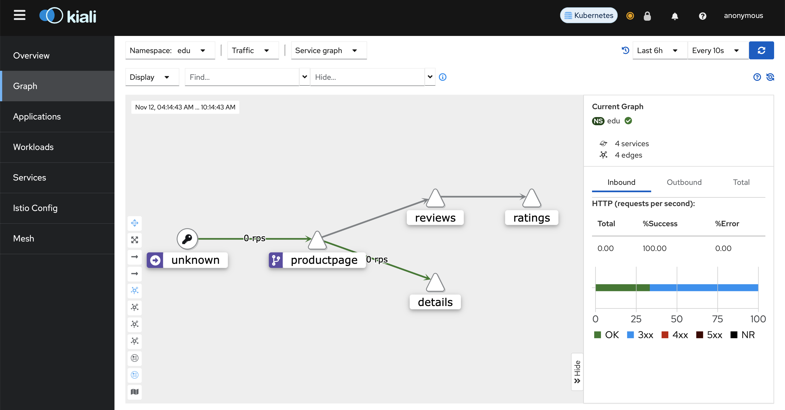  

<br/>

metric 은 Prometheus를 사용하여 데이터를 저장  
- https://grafana.apps.okd4.ktdemo.duckdns.org

<br/>

Access log는  Loki 를 사용하여 데이터를 저장(https://grafana.com/grafana/dashboards/14876)   


<br/>

### Istio Flow

<br/>


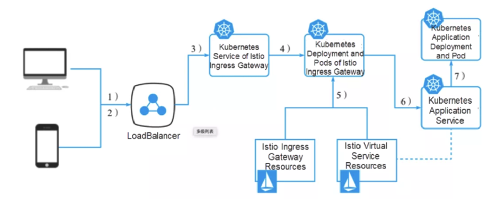      

Ingress Gateway > Gateway + VirtualService + Destination Rule > Service > Pod  

<br/>

### istio-ingressgateway

<br/> 

istio-ingressgateway는 Cluster의 entry point가 된다.  
 
쿠버네티스에서 nginx ingress controller와 동일하게 ingress controller 역할을 수행한다.  

로드밸런서 역할을 수행하며 pod로서 동작한다.

<br/>

### Gateway  

<br/>

gateway는 단어처럼 어느 호스트의 요청, 포트 등을 처리할지 gateway 역할을 수행한다.  

<br/>

### virtual service  

<br/>

참고 : https://happycloud-lee.tistory.com/108

<br/>

VirtualService: URI, HTTP Header등을 이용한 Rule에 따라 트래픽을 라우팅해 줌   

- 라우팅 조건 지정: uri, scheme, method, authority, headers, port, sourceLabels, gateways, queryParams 이용  
- 라우팅 대상 지정: destionation 서비스명/PORT번호/subset, 재시도 횟수, 라우팅 비중 정의. subset정의 시 destinationrule 필요.

<br/>

세부 기능   

- 한 VS에 여러개 rule 정의하여 분기 가능  
- 외부와 in/out처리(ingress, egress)를 위해 Gateway와 함께 사용 가능  
- 대상 서비스에 대한 제반 rule을 지정하기 위해 destinationrule과 함께 사용 가능  
- 구성  
  참고: https://istio.io/docs/reference/config/networking/virtual-service/#HTTPMatchRequest    
  - host: rule이 적용될 HOST로서 IP, FQDN(Fully Qualified Domain Name), k8s SERVICE name 지정    
  - match: rule 지정(uri, scheme, method, authority, headers, port, sourceLabels, gateways, queryParams 이용).  
  - routing  
    - route:  
      - destination: target service, port, subset  
      - retries: 재시도 정의  
      - weight: 라우팅 비중 정의  
    - rewrite: 요청된 request uri를 rewrite하고 routing할 때 사용. route와 rewrite는 같이 사용할 수 없다.  
    - redirect: redirect시킬때 사용  
  - fault: 에러를 일부러 발생시키기 위해 사용   
  	- delay  
    	- percentage: 몇%의 request에 대해 delay할지 지정  
        	- value  
        - fixedDelay: 몇초 또는 몇ms동안 delay시킬지 지정  
    - abort:  
    	- percentage: 몇%의 request에 대해 abort할지 지정  
        	- value  
        - httpStatus: 리턴할 코드(예: 404, 503)  


<br/>

### destination rule 

<br/>

destinationrule: 대상 서비스에 대한 제반 rule 정의  

- rule종류: connectionPool, L/B, outlierDetection, tls  
- 전체에 적용할 정책과 subset(version)별로 적용할 정책을 정의할 수 있음  

<br/>

세부 기능   

<br/>

  - 구성  
    참고: https://istio.io/docs/reference/config/networking/destination-rule/  
    - host: 적용할 service명  
    - TrafficPolicy  
      - connectionPool  
        - tcp: maxConnection, connectTimeout, tcpKeepalive  
        - http: http1MaxPendingRequests, http2MaxRequest, maxRequestsPerConnection, maxRetries, idleTimeout, h2UpgradePolicy  
      - loadBalancer  
        - simple: ROUND_ROBIN, LEAST_CONN, RANDOM, PASSTHROUGH  
        - consistentHash: httpHeaderName, httpCookie, useSourceIp, minimumRingSize  
        - localityLbSetting: source traffic의 지역에 따른 L/B. {region}/{zone}/{sub-zone}형식의 label 이용.  
          - distribute: from, to. from zone을 to sub-zone으로 어떻게 분배할지 비율 지정.  
          - failover: from, to. from region 라우팅 실패 시 failover할 to region지정.  
          - enabled: true OR false. locality L/B 사용여부.  
      - outlierDetection: circuit break를 위한 에러 발 조건 정의  
        - interval: 몇분동안  
        - consecutiveErrors: 몇번 에러가 발생하면  
        - baseEjectionTime: 몇분동안 502, 503, 504 error를 발생시킬지 정의  
      - tls: SSL/TLS관련 정책 정의  
        - mode: DISABLE/SIMPLE/MUTUAL/ISTIO_MUTUAL  
        - clientCertificate: client-side TLS인증서 파일 경로  
        - privateKey: client private key 인증서 파일 경로  
        - caCertificates: server 인증서 파일 경로  
        - subjectAltNames: 서버 name list  
        - sni: TLS handshake중에 서버에 제공할 sni문자열  
      - portTrafficPolicy: 포트별 정책 정의  
        - port: 포트 번호  
        - trafficPolicy: 이 포트에만 적용할 정책 정의   
          - loadBalancer  
          - connectionPool  
          - outlierDetection  
          - tls  
    - subsets: label이용한 version 목록 정의  
      - name: version명  
      - labels: label 값  
        - version  
      - trafficPolicy: 이 버전에만 적용할 trafficPolicy 정의  
        - loadBalancer  
        - connectionPool  
        - outlierDetection  
        - tls  
    - exportTo: rule을 적용할 namespace- 현재 namespace는 '.', 전체 namespace는 '*'임. 생략하면 전체 namespace에 적용됨.  

## Istio Demo 실습 

<br/>

vm에서 istio 최신버전을 를 다운 받습니다.      

```bash 
curl -L https://istio.io/downloadIstio | sh -
``` 

<br/>

PATH 설정을 합니다.    

```bash
[root@bastion istio]# export PATH="$PATH:/root/istio/istio-1.19.3/bin"  

```

<br/>

istio 설치 폴더로 이동합니다.

```bash
[root@bastion istio]# cd istio-1.19.3
```  

<br/>
 
본인의 namespace에 `istio-injection=enabled` label 을 설정합니다.  
앞으로 생성되는 모든 POD는 envoy가 injection 됩니다.  

```bash
[root@bastion istio-1.19.3]# kubectl label namespace edu istio-injection=enabled
```  

<br/>

### 서비스 생성

<br/>

참고 : https://happycloud-lee.tistory.com/106  

Bookinfo 서비스의 실행 결과 화면입니다.    

productpage, detail, review, rating의 4가지 마이크로서비스로 구성되어 있습니다.      

      

<br/>

각 마이크로서비스의 아키텍처는 아래와 같습니다.  
마이크로서비스의 큰 특성중 하나인 Poly-glot(마이크로서비스별 상이한 기술 적용)으로 구성되어 있습니다.

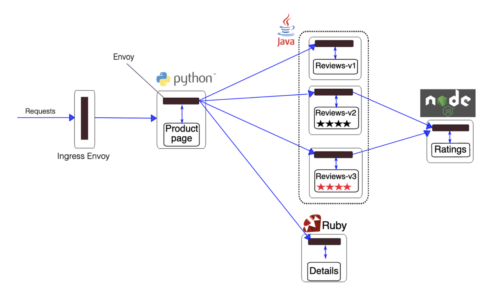  

<br/>

Bookinfo demo 서비스를 생성합니다.    

참고 : https://istio.io/v1.13/docs/setup/getting-started/#download  

<br/>

다른 환경에서 테스트 할 때는 samples/bookinfo/platform/kube/bookinfo.yaml 사용하지만 docker pull rate limit 이슈로  manifest -> istio 폴더의 bookinfo.yaml (github로 image 변경) 화일을 사용합니다.   


```bash
[root@bastion istio-1.19.3]# kubectl apply -f bookinfo.yaml
service/details created
serviceaccount/bookinfo-details created
deployment.apps/details-v1 created
service/ratings created
serviceaccount/bookinfo-ratings created
deployment.apps/ratings-v1 created
service/reviews created
serviceaccount/bookinfo-reviews created
deployment.apps/reviews-v1 created
deployment.apps/reviews-v2 created
deployment.apps/reviews-v3 created
service/productpage created
serviceaccount/bookinfo-productpage created
deployment.apps/productpage-v1 created
```  

<br/>

생성된 Service Accoount 에 권한을 할당 합니다.    

```bash
oc adm policy add-scc-to-user anyuid -z bookinfo-details
oc adm policy add-scc-to-user anyuid -z bookinfo-ratings
oc adm policy add-scc-to-user anyuid -z bookinfo-productpage
oc adm policy add-scc-to-user anyuid -z bookinfo-reviews
oc adm policy add-scc-to-user privileged -z bookinfo-details
oc adm policy add-scc-to-user privileged -z bookinfo-ratings
oc adm policy add-scc-to-user privileged -z bookinfo-productpage
oc adm policy add-scc-to-user privileged -z bookinfo-reviews
```

<br/>

우리는 `istio-system` 의 `istio-gatewayingress` 를 사용하지 않고 custom gatewayingress를 생성하려고 합니다.    

namespace 하나씩 생성합니다.  

<br/>

```bash
[root@bastion istio]# cat edu-ingressgateway.yaml
apiVersion: install.istio.io/v1alpha1
kind: IstioOperator
metadata:
  namespace: istio-system # 수정하지 말것
  name: edu-gateway  # 수정 : <namespace>-gateway
spec:
  profile: empty
  components:
    ingressGateways:
      - name: edu-ingressgateway # 수정 :  <namespace>-ingressgateway
        namespace: edu # 수정 : 본인 namespace
        enabled: true
        label:
          istio: edu-ingressgateway # 수정 : <namespace>-ingressgateway
  hub: docker.io/istio
  values:
    global:
    gateways:
      istio-ingressgateway:
        type: ClusterIP
```  

<br/>
ingressgateway 설치는 아래와 같이 istioctl 를 사용합니다.
-  kubectl 명령어 아님  

```bash
istioctl install -f edu-ingressgateway.yaml
``` 

<br/>

삭제는 아래와 같다.  

```bash
istioctl uninstall -f edu-ingressgateway.yaml --purge -n edu
``` 

<br/>

pod 와 서비스가 생성된 것을 확인힙니다.    
위에서 설치한 pod 들을 보면 container 가 2개씩 되어 있는 것을 확인할 수 있습니다.  

```bash
[root@bastion istio-1.19.3]# kubectl get po -n edu
NAME                                    READY   STATUS    RESTARTS   AGE
details-v1-ccbdcf56-fk7hk               2/2     Running   0          4d3h
edu-ingressgateway-f4f5ffbf9-v76gh      1/1     Running   0          43h
edu12-ingressgateway-54f6cff955-rrgqx   1/1     Running   0          45m
edu24-ingressgateway-849bf6958c-5g6jj   1/1     Running   0          52m
edu5-ingressgateway-556dbc5dbc-zcpzv    1/1     Running   0          65m
edu9-ingressgateway-7c8457bcb7-99pxq    1/1     Running   0          62m
nginx                                   2/2     Running   0          25h
productpage-v1-6766847957-pdfxn         2/2     Running   0          4d3h
ratings-v1-7cd8bb76c8-5bq5w             2/2     Running   0          4d3h
reviews-v1-8955dc448-tl6j5              2/2     Running   0          4d3h
reviews-v2-64776cb9bd-fzbs8             2/2     Running   0          4d3h
reviews-v3-5c8886f9c6-tfbjx             2/2     Running   0          4d3h
[root@bastion istio]# kubectl get svc -n edu
NAME                 TYPE        CLUSTER-IP       EXTERNAL-IP   PORT(S)                                      AGE
details              ClusterIP   172.30.123.32    <none>        9080/TCP                                     3d1h
edu-ingressgateway   NodePort    172.30.122.208   <none>        15021:31499/TCP,80:32712/TCP,443:31705/TCP   17h
productpage          ClusterIP   172.30.91.143    <none>        9080/TCP                                     3d1h
ratings              ClusterIP   172.30.80.200    <none>        9080/TCP                                     3d1h
reviews              ClusterIP   172.30.48.95     <none>        9080/TCP
``` 
```bash 
[root@bastion istio]# kubectl get sa
NAME                                 SECRETS   AGE
bookinfo-details                     1         3d2h
bookinfo-productpage                 1         3d2h
bookinfo-ratings                     1         3d2h
bookinfo-reviews                     1         3d2h
builder                              1         53d
default                              1         53d
deployer                             1         53d
edu-ingressgateway-service-account   1         17h
```  

<br/>

service account 가 생성이 되고 권한을 부여합니다.  
- 생성 규칙 : `<custom istio ingress gateway>-service-account`   

<br/>

```bash
oc adm policy add-scc-to-user anyuid -z edu-ingressgateway-service-account
```   

<br/>

이제 gateway 와 virtual service 를 생성합니다.  

```bash
[root@bastion istio]# cat bookinfo-gateway.yaml
apiVersion: networking.istio.io/v1alpha3
kind: Gateway
metadata:
  name: bookinfo-gateway
spec:
  selector:
    istio: edu-ingressgateway # 본인의 ingress gateway로 변경합니다.
  servers:
  - port:
      number: 8080
      name: http
      protocol: HTTP
    hosts:
    - "*"
---
apiVersion: networking.istio.io/v1alpha3
kind: VirtualService
metadata:
  name: bookinfo
spec:
  hosts:
  - "*"
  gateways:
  - bookinfo-gateway
  http:
  - match:
    - uri:
        exact: /productpage
    - uri:
        prefix: /static
    - uri:
        exact: /login
    - uri:
        exact: /logout
    - uri:
        prefix: /api/v1/products
    route:
    - destination:
        host: productpage
        port:
          number: 9080
```   

<br/>

적용합니다.  

```bash
[root@bastion istio]# kubectl apply -f bookinfo-gateway.yaml
gateway.networking.istio.io/bookinfo-gateway created
virtualservice.networking.istio.io/bookinfo created
```

<br/>

문제가 없는지 확인합니다.  

```bash
[root@bastion istio]# istioctl analyze

✔ No validation issues found when analyzing namespace: edu.
```  

<br/>

ingress port를 확인합니다.    
loadbalancer 가 없어 `pending` 으로 보입니다.  

```bash
[root@bastion istio]# kubectl get svc edu-ingressgateway
NAME                   TYPE           CLUSTER-IP      EXTERNAL-IP   PORT(S)                                      AGE
istio-ingressgateway   LoadBalancer   172.30.202.30   <pending>     15021:31605/TCP,80:30178/TCP,443:30488/TCP   22h
```

<br/>

loadbalancer 가 없기 때문에 외부에서 접속을 위하여
productpage 접속을 위한 route 를 생성합니다.    

<br/>

```bash
[root@bastion istio]# cat istio-demo-route.yaml
apiVersion: route.openshift.io/v1
kind: Route
metadata:
  labels:
    app : isto-demo
  name: istio-demo
spec:
  port:
    targetPort: http
  tls:
    termination: edge
  to:
    kind: Service
    name: productpage
    weight: 100
  wildcardPolicy: None
```    
```bash
[root@bastion istio]# kubectl apply -f istio-demo-route.yaml
[root@bastion istio]# kubectl get route
NAME         HOST/PORT                                     PATH   SERVICES      PORT   TERMINATION   WILDCARD
istio-demo   istio-demo-edu.apps.okd4.ktdemo.duckdns.org          productpage   http   edge          None
```

<br/>

외부에서 istio를 이용하여 특정 서비스를 routing하는 순서는 아래와 같습니다.   

<br/>

- (Gateway 설정)->Service: istio-ingressgateway -> Pod: instio-ingressgateway-XXX -> 
- (VirtualService설정)-> Service: productpage ->  
- Container in productpage-XXX: istio envoy proxy -> Container in productpage-XXX: productpage    

<br/>

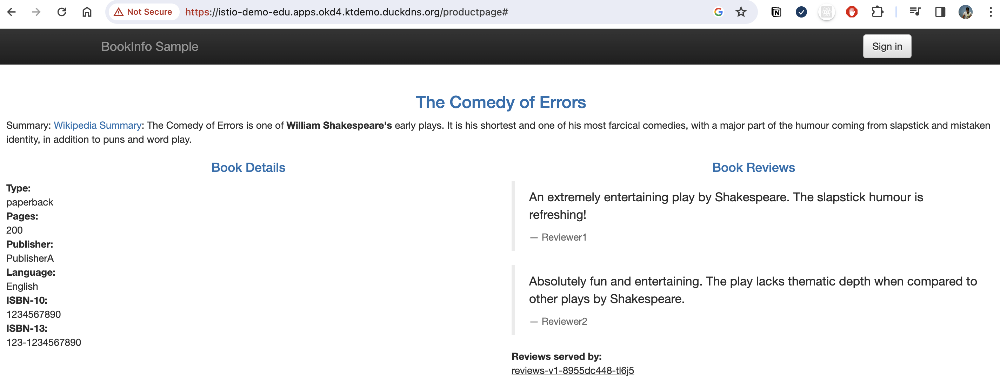  

<br/>

### Test 해보기

<br/>

웹브라우저에서 route 로 접속 합니다.  
- https://istio-demo-edu.apps.okd4.ktdemo.duckdns.org/productpage


  

해당 웹 페이지를 연타하여 데이터를 생성하고 kiali에 접속하여 본인의 namespace 를 선택후 토롤로지를 확인합니다.    
- kiali : https://kiali.apps.okd4.ktdemo.duckdns.org/  

<br/>

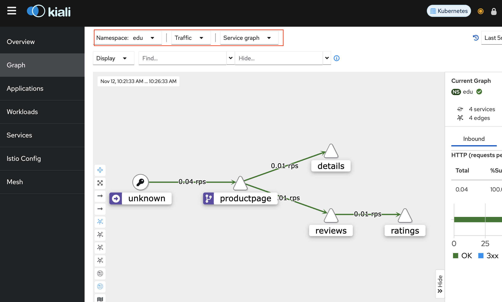  


<br/>

## 과제 

<br/>


### Traffic 분산해 보기 

<br/>

참고 : https://istio.io/latest/docs/tasks/traffic-management/traffic-shifting/    


<br/>

review 버전 v1을 호출하도록 virtual service를 생성합니다.  

```bash
kubectl apply -f samples/bookinfo/networking/virtual-service-all-v1.yaml
```  

<br/>

destinationrule 이라는 리소스를 먼저 만듭니다. 

```bash
kubectl apply -f samples/bookinfo/networking/destination-rule-all.yaml 
```

<br/>

```bash
 kubectl get destinationrule  또는 kubectl get dr
```  

<br/>

productpage를 접근하여 대여섯번 refresh합니다. 그리고 kiali 페이지에서 맨 우측 상단의 refresh 아이콘을 누릅니다.

<br/>

  

<br/>

이번에는 review v2 , v3를 호출하도록 바꿉니다. 

```bash
 kubectl apply -f virtual-service-reviews-v2-v3.yaml
```  

productpage를 접근하여 대여섯번 refresh합니다. v2가 호출되면 검은색 별점이 나타나고, v3가 호출되면 빨간색 별점이 표시됩니다.   

그리고 kiali 페이지에서 맨 우측 상단의 refresh아이콘을 누릅니다. 

<br/>

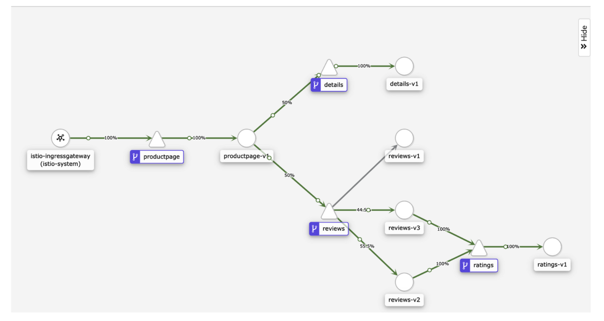  

<br/>

이번에는 review v3를 호출하도록 바꿉니다.    

```bash
kubectl apply -f virtual-service-reviews-v3.yaml
```  

- productpage를 접근하여 대여섯번 refresh합니다. 이번에는 항상 빨간색 별점이 표시됩니다.  

그리고 kiali 페이지에서 맨 우측 상단의 refresh아이콘을 누릅니다.  v2쪽으로도 라우팅 되는게 보이다가 계속 refresh하면 v3로만 라우팅 되는걸로 나올겁니다. 지난 1분의 라우팅을 보여주기 때문에 약간 시간 차이가 발생합니다. 

<br/>


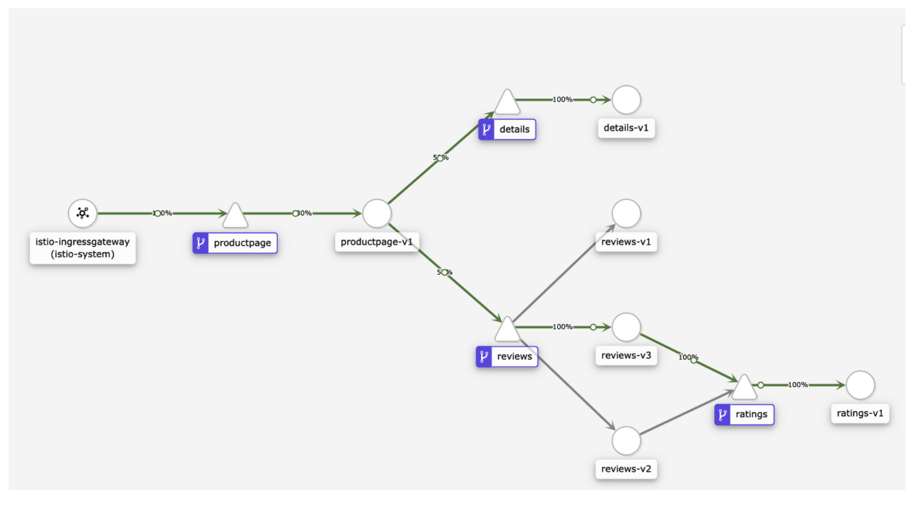  


<br/>

돌발 퀴즈 :  

v3 서비스에서 문제가 발생을 하여 서비스를 차단해야 합니다. 서비스를 차단해 보고 복구합니다.  
- kiali 에서 가능

<br/>

### Istio 실전 실습 


<br/>

현재 namespace에 backend-springboot 라는 서비스가 있고 해당 서비스는 frontend-react와 연결이 되어 있습니다.      

해당 서비스를 재실행 하여 istio injection 을 해주고 istio gateway 에서 gateway와 virtual 서비스를 생성하여 backend-springboot 서비스를 연결합니다.   

<br/>

- 기존 demo용 서비스를 삭제합니다.
  - kubectl delete -f samples/bookinfo/platform/kube/bookinfo.yaml
  - kubectl delete -f bookinfo-gateway.yaml  

- 신규 생성 : gateway 와 vs를 생성합니다.
  - gateway 이름 : apigw-gateway
  - destination : backend-springboot  

- 변경 : frontend-react deploy 수정
  - 이미지 버전 변경 ( 버그)
  - BACKEND_API_URL : 본인의 ingress 이름  

<br/>

```bash
[root@bastion istio]# kubectl apply -f edu_gateway_vs.yaml
gateway.networking.istio.io/edu-apigw-gateway created
virtualservice.networking.istio.io/edu-apigw-vs configured
```

<br/>

frontend-react deploy 에서 아래와 같이 yaml 화일을 변경하면 된다.  

```bash
    spec:
      containers:
        - name: frontend-react
          image: 'ghcr.io/shclub/edu12-3:v7' ## 버전 다시 생성
          ports:
            - containerPort: 80
              protocol: TCP
          env:
            - name: BACKEND_API_URL
              value: 'http://edu25-ingressgateway' # 본인의 ingress 이름
```

<br/>

서비스를 수정후에 웹브라우저에 frontend-react route로 이동하여 해당 페이지에서 로그인을 한후 데이터 생성을 한다.

kiali 에 접속하며 본인 서비스가 잘 호출 되었는지 확인한다.  

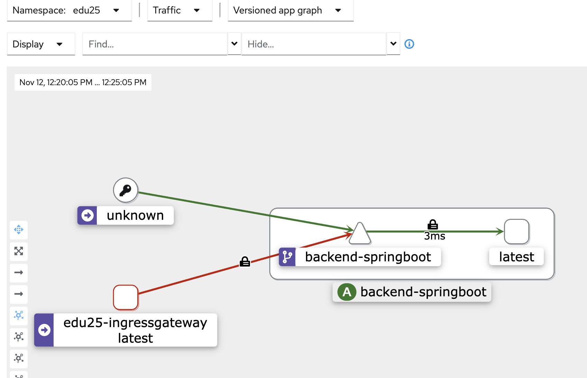  

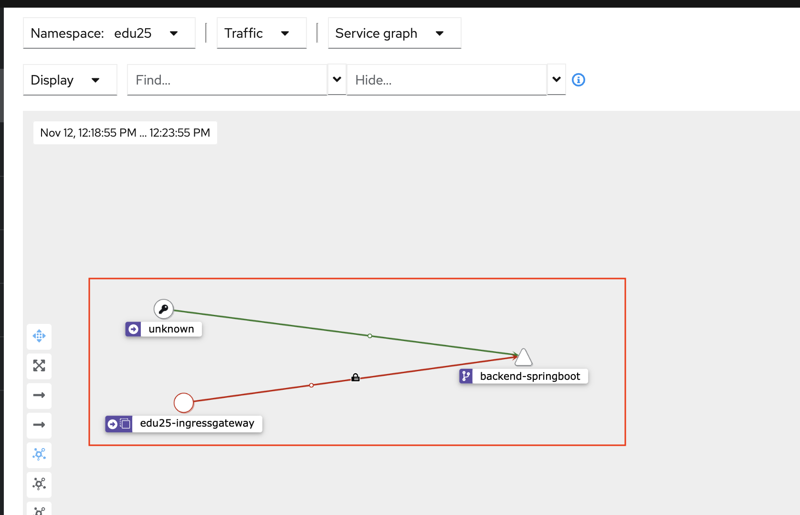  


<br/>

## 참고

<br/>

- https://m.blog.naver.com/isc0304/221892105612    
- test용 curl : curl  -X POST  http://edu25-ingressgateway/api/login -H "Content-Type: application/json"   -d  '{ "username": "edu","password": "edu1234”}'
